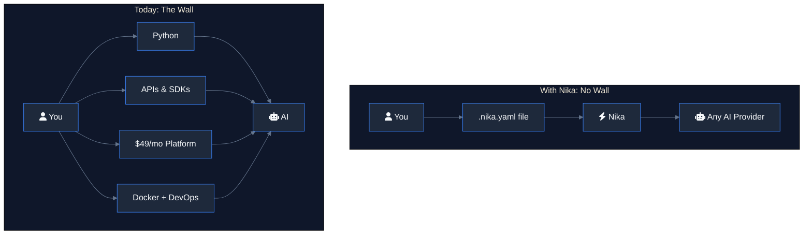
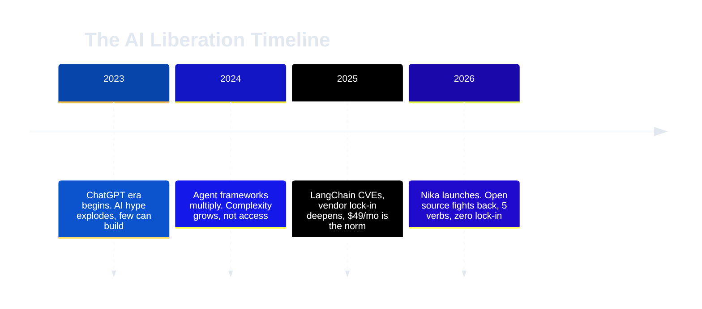
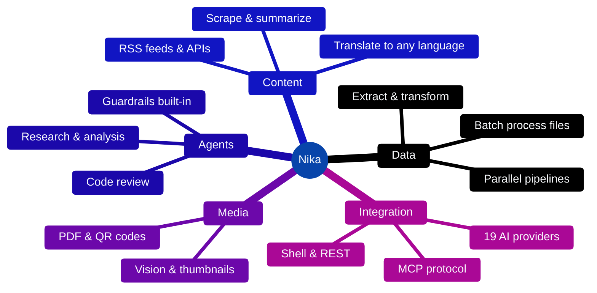
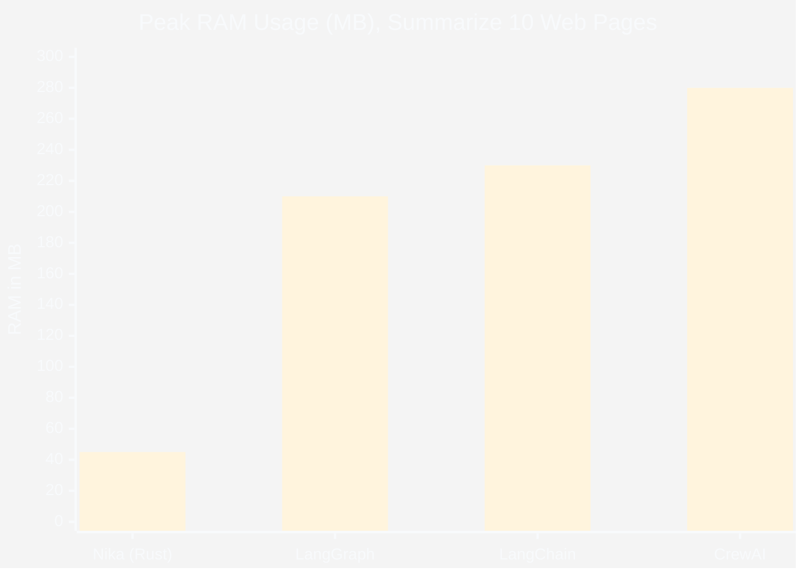
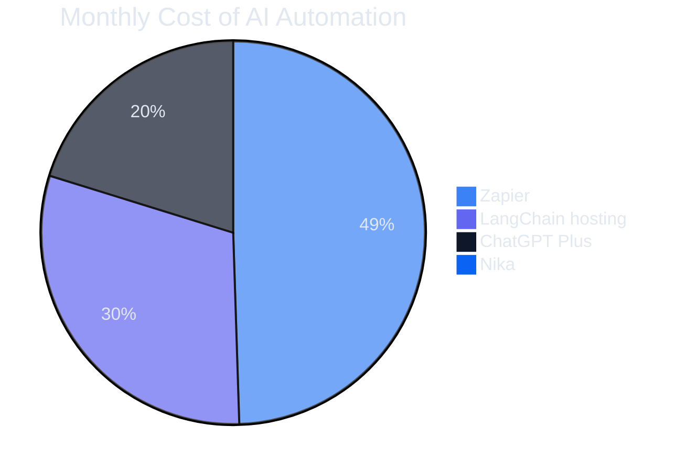

# The Nika Manifesto

> **Automate AI. No code required.**

> *AI is the new electricity. It should be accessible to everyone.*

---

### TL;DR

- **AI is locked** behind code, subscriptions, and vendor walls. Most people can't use it.
- **Nika is a single binary** that reads a YAML file and executes AI tasks. No code. No subscription.
- **5 verbs** (`infer`, `fetch`, `exec`, `invoke`, `agent`) describe any automation you can imagine.
- **14 LLM providers**, open source (AGPL), Rust-native, **5x less RAM** than Python alternatives.
- **The mission**: the gap between "AI exists" and "I can use AI" should be **zero**.

---

## 1. The Problem

Six closed labs control frontier AI. Chips cost $6 million per rack. LLM subscriptions
run $20 to $200 a month. And even if you pay, you still need a software engineer to wire anything useful together.

**The result?** AI is powerful, but locked. Locked behind code, subscriptions, and vendor
walls. The technology that should empower billions is gatekept by a handful of corporations.

Meanwhile, the tools that promise to "democratize AI" charge you $49/month to run
automations on *their* servers, with *their* limits, under *their* terms. They call it
accessible. We call it a new middleman. Here's what real people hear when they ask
"How do I use AI to automate my work?":

- **"Learn Python."** Six months minimum.
- **"Use our platform."** $49/mo, 1,000 runs, their cloud, their rules.
- **"Just copy-paste into ChatGPT."** For one thing. Manually. Every single time.

> **None of these are real answers. None of them are freedom.**



---

## 2. The Vision

Electricity doesn't ask you to learn electrical engineering before you flip a switch.
Water doesn't require a plumbing license before it flows from your tap.
**AI should work the same way.**

Write what you want in a plain text file. Describe the steps. Pick any AI. Press run.
No code. No subscription. No vendor lock-in. No PhD required.

A file that says *"fetch this page, summarize it, translate it to French, save it"*
should just work. On your machine. With your choice of AI. For free. This is not a
feature request. This is a fundamental belief:

> **The gap between "AI exists" and "I can use AI" should be zero.**



---

## 3. The Solution

**Nika** is a single binary that reads a YAML text file and executes it.

```yaml
# my-automation.nika.yaml
schema: "nika/workflow@0.12"
name: morning-briefing
tasks:
  - id: headlines
    fetch: { url: "https://news.ycombinator.com", extract: article }

  - id: summarize
    infer:
      model: claude-sonnet-4-20250514
      prompt: "Summarize these headlines in 5 bullets: {{with.news}}"
    with:
      news: $headlines
    depends_on: [headlines]

  - id: translate
    infer:
      model: gpt-4o
      prompt: "Translate to French: {{with.summary}}"
    with:
      summary: $summarize
    depends_on: [summarize]
```

Three steps. Two AI providers. Zero lines of code.

> **That's the entire idea.** Describe steps in a text file. Nika handles execution --
> parallel tasks, retries, error handling, streaming, cost tracking. So you don't have to.

### Five verbs. That's the whole language.

| Verb | What it does |
|------|-------------|
| `infer:` | Ask any AI to generate text, analyze images, think |
| `fetch:` | Pull data from the web: pages, APIs, feeds |
| `exec:` | Run shell commands on your machine |
| `invoke:` | Call external tools via MCP protocol |
| `agent:` | Launch an autonomous AI agent with guardrails |

Five verbs to describe any automation. From a 3-step summary to a 50-task parallel
pipeline processing hundreds of articles, images, and datasets.



### Manual vs. Automated: the real comparison

| | ChatGPT (manual) | Nika (automated) |
|---|---|---|
| Summarize 1 article | Copy URL, paste, wait, copy result | Write once, run forever |
| Summarize 50 articles | 50 tabs, 50 copy-pastes, 2 hours | One file, parallel execution, 3 minutes |
| Translate to 5 languages | 250 manual operations | Add 5 tasks, done |
| Use Claude + GPT together | Switch tabs, re-paste context | Two lines: `model: claude-sonnet-4-20250514`, `model: gpt-4o` |
| Run daily at 8am | Set an alarm, do it yourself | `cron` + `nika run briefing.nika.yaml` |
| Cost | $20/mo per subscription | Pay-per-token, your API keys, often cheaper |

---

## 4. Why Open Source

Nika is licensed under **AGPL-3.0-or-later**. Not MIT. Not Apache. AGPL. Here's why.

MIT and Apache are gifts to corporations. They let Amazon, Google, and Microsoft take
open-source projects, wrap them in a managed service, and contribute nothing back.
Redis, Elasticsearch, MongoDB. The pattern repeats: community builds, corporation captures.

> **AGPL breaks that pattern.** If you modify Nika and run it as a service, you must
> release your changes. The code stays free. The community stays in control.

This is not anti-business. Commercial use is welcome. But **selling Nika itself
behind a paywall** without sharing improvements? That's exploitation, and the
license prevents it.

### The principles

- **Multi-provider by design.** Claude, GPT, Mistral, Gemini, Groq, xAI, DeepSeek,
  local GGUF. All of them. You choose. You switch. No lock-in. Ever.
- **Your machine, your data.** Nika runs locally. Your files never touch our servers
  (we don't have servers). Your API keys stay in your OS keychain.
- **Community-owned.** No VC exit strategy. No "open core" bait-and-switch. The full
  engine is open source. Period.

---

## 5. EU AI Act Ready

On August 2, 2026, the EU AI Act (Regulation 2024/1689) starts enforcing
transparency obligations for AI-generated content. Every company using AI
to generate text, images, or media in the EU must mark and trace that content.
Penalties: up to 7.5 million EUR or 1.5% of global turnover.

Most AI tools treat compliance as an afterthought. Nika ships it as infrastructure.

**What's built in, today:**

- **C2PA content credentials.** `nika:provenance` signs AI-generated images with
  cryptographic provenance manifests (Article 50). `nika:verify` checks them and
  returns `eu_ai_act_compliant: true` or `false`. No external service needed.
- **Automatic audit trails.** Every workflow execution produces NDJSON traces with
  58+ event types: what model was called, what it returned, how much it cost, how
  long it took, what security events fired. Full traceability (Article 12).
- **Trust classification.** Every piece of data flowing through a workflow carries
  a trust level: Trusted, ModelGenerated, ModelTainted, or Untrusted. You always
  know what came from a human and what came from a model (Article 50).
- **Prompt injection defense.** 5-layer Nika Shield with taint analysis, spotlight
  fencing, canary tokens, and capability restrictions. Risk management by design,
  not by policy document (Article 9).
- **Human oversight.** Agent guardrails, turn limits, cost caps, LLM judge,
  structured output validation. The machine does not run unsupervised (Article 14).
- **AI literacy.** Ready-to-extract showcase workflows ship with the binary. Run
  `nika showcase list` and learn (Article 4).

No other AI orchestration tool ships these features natively. Not LangChain.
Not CrewAI. Not n8n. The market is empty. Nika fills it.

> **Compliance should not be a premium feature.
> It should be the default. It should be open source. It should be free.**

---

## 6. Why Rust

> **Performance is not a luxury. Performance is freedom.**

If your tool needs 2 GB of RAM, it won't run on a $200 laptop. If it takes 8 seconds
to start, it won't run in a CI pipeline. If it requires Python, it won't run on a bare
server without setup. Nika is a single Rust binary. No runtime. No dependencies. No Docker.

| Metric | **Nika** | Python equivalent |
|--------|------|-------------------|
| Cold start | **4 ms** | 800+ ms |
| RAM (idle) | **12 MB** | 60+ MB |
| Binary size | **~25 MB** | 200+ MB (with venv) |
| Dependencies | **0** (single binary) | pip install, venv, Docker... |
| Install | **Download and run** | `pip install`, `venv`, `requirements.txt`, pray |

A Raspberry Pi can run Nika. A GitHub Action can run Nika. A $5/month VPS can run Nika.

> **When your tool is lightweight, it goes everywhere.** That's not optimization for
> optimization's sake. That's reach. That's access. That's the mission.

---

## 7. The Numbers

Real benchmarks. Real tasks. No cherry-picking.
### RAM usage: "Summarize 10 web pages" task

| Tool | **Peak RAM** | **Cold start** | **Lines of config** |
|------|----------|------------|-----------------|
| **Nika** | **~45 MB** | **4 ms** | **12** |
| LangChain (Python) | ~230 MB | 1.2 s | 48 |
| LangGraph (Python) | ~210 MB | 1.1 s | 62 |
| CrewAI (Python) | ~280 MB | 1.4 s | 55 |



> Nika uses **5x less RAM** than LangChain for the same task.

### Agent reliability: multi-step autonomous tasks

| Tool | **Completion rate** | **Guardrails** | **Retry built-in** |
|------|----------------|------------|----------------|
| **Nika** | **Deterministic DAG** | Yes (NIKA-112) | Yes (exponential backoff) |
| CrewAI | ~56% (benchmark) | No | Manual |
| AutoGPT | Variable | No | No |
| LangGraph | Depends on graph | Partial | Manual |

> CrewAI reports a **44% failure rate** in multi-agent benchmarks. Nika's DAG
> execution is deterministic: tasks either complete with retries or fail with
> clear error codes. No silent drift.

### Security

| Tool | **Known critical CVEs (2024-2025)** | **Sandboxing** | **Dependency count** |
|------|------|------|------|
| **Nika** | **0** | Command blocklist + env validation | ~180 (compiled) |
| LangChain | CVSS 9.3 (CVE-2023-46229) + others | None by default | 400+ (runtime) |
| CrewAI | Inherits LangChain CVEs | None | 300+ (runtime) |

### Where your money goes



> Zapier: **$49/mo**. ChatGPT Plus: **$20/mo**. LangChain hosting: **$30+/mo**.
> Nika: **$0**. You pay for the AI tokens you use. Everything else is free. Forever.

---

## 8. The Name

In an old legend, there is a warrior who goes from place to place. Not conquering,
not ruling, but **liberating**. Not with weapons. Not with force. With joy.

> **The people called this warrior Nika.**

We chose this name because that's what this tool is for. Not to conquer a market.
Not to build an empire. To **liberate**: AI from the labs, automation from the
coders, power from the platforms. The butterfly 🦋 is the symbol.

A butterfly is fragile, beautiful, and free. It transforms completely, from
something earthbound to something that flies. And a single butterfly can start a
storm on the other side of the world.

Nika is a butterfly. Small. Light. Free. And when enough people use it, when enough
people realize that a 10-line text file can do what a $49/month platform does --

> **That's a storm.**

---

## 9. Built With AI

Nika is an AI tool, built with AI. We eat our own dogfood.

Every commit in this repository carries `Co-Authored-By: Nika 🦋`. That's not
a disclaimer. It's a statement. We use Mistral, Copilot, Kimi, Claude, and other AI tools
extensively. We don't hide it. We don't apologize for it. We ship.

**This is not AI slop.**

AI slop is what happens when there's no human in the loop. No architecture. No
taste. No "no." Generate, paste, push, pray. The output compiles (maybe) and
nobody reviewed it. Nobody tested it. Nobody asked "is this the right
abstraction?" That's not engineering. That's autocomplete with a deploy button.

What we do is different:

- **10,666 tests** don't write themselves by accident. Every test validates a
  design decision, not just a code path.
- **5 verbs, not 4, not 6.** That's a constraint no AI suggests. An AI will
  happily generate a sixth verb. A human says "no, five is the design."
- **A 5-layer security defense** with academic citations, threat models, and
  deferred items tracked by ID. That's architecture, not generation.
- **Every error message is crafted** to help the person reading it. AI generates
  error messages. Humans decide what they should say.

The value is in the decisions, not the keystrokes. What to build, what to
reject, how things compose, where to draw boundaries. AI accelerates the
execution. Humans own the judgment.

> In 2000, writing assembly by hand was "real programming." In 2010, using
> frameworks was "cheating." In 2020, copy-pasting from Stack Overflow was
> "not real work." In 2026, AI-assisted development is Tuesday.

A carpenter is not less of a carpenter because they use a power drill. The
house still needs an architect.

---

## 10. Join Us

Nika is not a product. It's a movement.

**If you believe AI should be accessible to everyone**, not just developers:
- Use Nika. Automate something. Share the recipe.
- Star the repo. Tell a friend. Write about it.
- File an issue when something breaks. We fix fast.

**If you're a developer** and this resonates:
- Read [CONTRIBUTING.md](CONTRIBUTING.md). Pick an issue. Ship a PR.
- Build a plugin, a tool, an integration. The MCP ecosystem is wide open.

**If you're a company** and you want to use Nika:
- Go ahead. AGPL allows commercial use. Improve the engine, share it back.

**If you're one of the six labs** and you're reading this:
- Make your APIs cheaper. Compete on quality, not lock-in.
- We're going to make it trivially easy for users to switch between you.

---

### The stack

```
You write:          A .nika.yaml file (plain text, human-readable)
Nika reads:         5 verbs, DAG of tasks, any AI provider
Nika runs:          Parallel execution, streaming, retries, cost tracking
You get:            Results. On your machine. Under your control.
```

### Install

```bash
# macOS
brew install supernovae-st/tap/nika

# From source
cargo install nika

# Then
nika run my-automation.nika.yaml
```

Read the [README](README.md) for full documentation, examples, and the interactive course.

---

<p align="center">
  <strong>Liberate your AI.</strong> 🦋
</p>
