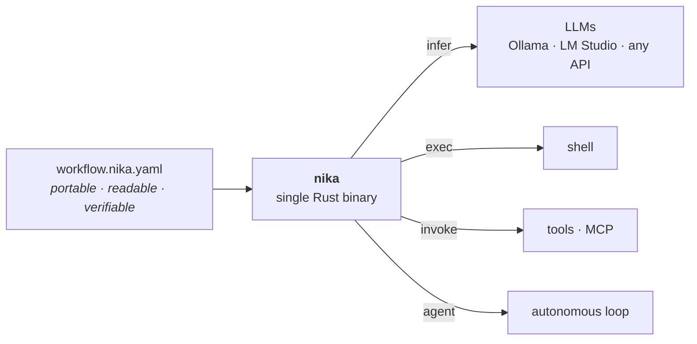
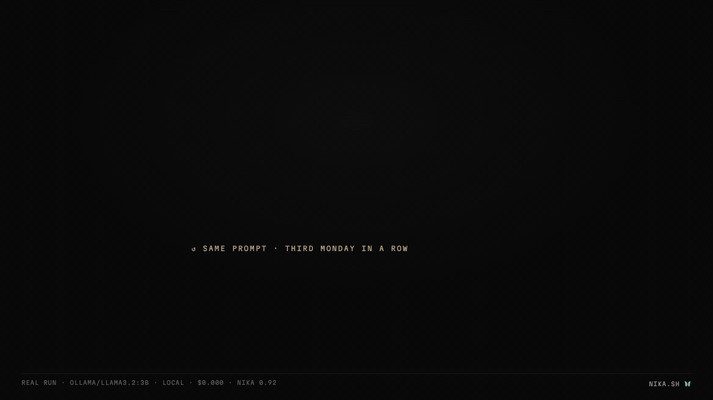

<p align="center">
  <a href="https://nika.sh">
    <picture>
      <source media="(prefers-color-scheme: dark)" srcset="https://nika.sh/brand/nika-logo-dark.svg">
      
    </picture>
  </a>
</p>

# Nika

> **Intent as Code.** The workflow language for AI: one file, 4 verbs,
> one binary.

[](LICENSE)
[](https://github.com/supernovae-st/nika-spec)
[](Cargo.toml)
[](https://github.com/supernovae-st/nika/actions/workflows/diamond-ci.yml)
[](https://scorecard.dev/viewer/?uri=github.com/supernovae-st/nika)
[](https://github.com/supernovae-st/nika/releases/latest)
[](https://archive.softwareheritage.org/browse/origin/?origin_url=https://github.com/supernovae-st/nika)

Useful AI work shouldn't disappear into chats. **Nika turns repeatable AI
work into files you can run, review, diff and share.** If you do the same
AI task twice, make it a workflow.

**The pipeline is a file.** A graph of model calls, tools and processes:
a shape you declare, not glue you program. Nika audits that file **before
a token is spent** (cost ceiling, permissions, secret flows, types), runs
it on whichever LLM you choose, local first, no cloud required, and leaves
every run a verifiable receipt. The language is an open
[Apache-2.0 spec](https://github.com/supernovae-st/nika-spec); this repo is
the reference engine, a single Rust binary (AGPL-3.0). The way SQL pairs
with PostgreSQL, or the Dockerfile with Docker.

<p align="center">
  
</p>

## Does it run today?

Yes.

```sh
brew install supernovae-st/tap/nika    # or: curl -LsSf https://nika.sh/install.sh | sh
nika try 01-hello                                # zero setup: no key, no model server
nika try 01-hello --model ollama/llama3.2:3b     # got Ollama? the same run, real + local
nika run 01-hello --access claude-code           # Claude Code (or codex · gemini-cli · kimi-code · qwen-code) — subscription, no vendor API key
nika list                                        # workflows below this directory
nika                                             # on a terminal: open one continuous thread
# (first run loads the model into memory; later runs are much faster)
```

`--access claude-code` (or `codex` · `gemini-cli` · `kimi-code` ·
`qwen-code`) runs the workflow through that CLI's own inference — the
subscription you already pay. `nika wire claude` is the other
direction: Nika as a read-only MCP oracle, not Claude's brain.

Inside the thread, normal text streams through the existing `agent:` runtime.
`/workflow <path>` posts a workflow card, `/run <path>` runs it in the same
thread, and Ctrl-C interrupts the active turn while leaving the thread open.


Nika audits a workflow **before a single token is spent** (plan, cost
ceiling, secret flows, types, tool args), then runs it:

Every line says what it looked at. A rung that covers less than its
name suggests narrows itself rather than borrowing your trust — `TYPES`
names the shapes it could not see, `PERMITS` names what defers to the
run, `COST` names the half of the bill it prices.

```text
$ nika check brief.nika.yaml
 ✔ PLAN     2 waves · 2 tasks · max parallelism 1
      wave 1 fetch_notes (invoke · nika:read)
      wave 2 brief (infer · ollama/llama3.2:3b)
 ✔ MODELS   1 model resolves in this binary
 ⚠  COST     bounded portion $0.0000 no total ceiling · 1 uncapped task · prompts, exec + mcp unpriced · prices 2026-07-28
   brief  ollama/llama3.2:3b  UNBOUNDED — no catalog price (local/unknown model)
 ⚠  ENERGY   no total energy ceiling · 0 of 1 tasks measured · 1 uncapped · never 0 Wh (NEP-0018)
 ✔ SECRETS  no declared secret reaches an effect · model echo untracked
 ✔ TYPES    deep references fit the shapes tasks declare · builtin output has none
 ✔ TOOLS    every named nika: tool is canonical · globs + mcp: not checked
 ✔ ARGS     every builtin invoke arg key is declared + required args present
 ✔ SCHEMA   no known-unsatisfiable form in an authored schema: · $ref opaque
 ✔ GATES    no task proven dead · status literals in vocabulary
 ✔ WRITES   no two unordered tasks write the same static path · computed paths at run
 ✔ PERMITS  literal + const: args fit the boundary · computed + symlinks at run
 ✔ TRIFECTA no lethal trifecta over the declared permits: without a human gate
 ✔ JOURNEY  internal · 1 source · 0 destinations · 2 model endpoints · no secret reaches a cloud destination
 ⚠ audited · 2 tasks · 2 waves · permits tools:nika:read · est unbounded · 1 uncapped task · 0 hints · risk unbounded

$ nika run brief.nika.yaml
  🦋 nika · daily-brief · 2 tasks
  ✔  fetch_notes  invoke · nika:read
  ✔  brief        infer · ollama/llama3.2:3b
  ── 2/2 done · $0.000 · elapsed 16.2s ───────────────────────────
```

## The loop: check → fix → run → receipt

An agent (or you, at 2am) writes a workflow. `nika check` audits the file
statically and **names every fix**; the run streams live; the trace is a
hash-chained receipt `nika trace verify` re-proves. The whole loop, captured
against the real binary:

<p align="center">
  
</p>

What the audit catches before a single token is spent. Each finding
carries its `NIKA-XXXX` code, the exact source span, and the fix:

| The mistake | What `nika check` says |
|---|---|
| A reference to a task that doesn't exist | `NIKA-VAR-001`: unresolved reference `tasks.digets`, *did you mean `tasks.digest`?* |
| Reading another task from a verb body | `NIKA-VAR-021`: `tasks.stats` outside the boundary — *hoist it into `with:` and read `${{ with.stats }}`* |
| A typo'd tool | TOOLS: `nika:wrte` is not a canonical builtin, *did you mean `nika:write`?* |
| A task reaching beyond its `permits:` boundary | PERMITS: the escape, with the machine-applicable widening line |
| A secret flowing where it shouldn't | SECRETS: the information-flow escape, statically |
| Unbounded spend | COST: a hard ceiling when priceable, an honest `UNBOUNDED` floor when not (never a fake `$0`) |
| An output used where its shape can't fit | TYPES: every deep reference checked against the declared schema |

After the run, the receipt: every run journals to `.nika/traces/` as an
append-only, hash-chained record. The run prints its chain head;
`nika trace verify` recomputes it. Tamper-evident, local, zero services.
The journal keeps task outputs verbatim so a run can be replayed — so
`.nika/traces/` inherits the sensitivity of whatever the workflow read.
On a shared or CI machine that directory is a second data-at-rest
surface; treat it like the files the run opened.

The capture above is honesty-gated like every asset here: its
[fixtures + tape](scripts/media/) are committed, and
`scripts/media/validate-media.sh` keeps the broken half failing `nika check`
and the fixed half clean.

## What a workflow looks like

```yaml
# review.nika.yaml: read a PR diff, judge its risk, comment only when it's high.
nika: pr-risk-review
model: ollama/qwen3.5:9b             # local by default. swap to any provider

permits:                              # the blast radius, declared in-file
  exec: ["git"]
  tools: ["mcp:github/pr-comment"]

tasks:
  diff:                               # exec: a read-only shell command
    exec:
      command: ["git", "diff", "origin/main...HEAD"]
      capture: structured

  assess:                             # infer: structured LLM judgment
    with:                             # the binding IS the edge — no separate wiring
      patch: ${{ tasks.diff.output.stdout }}
    infer:
      prompt: "Risk-assess this diff (secrets, breaking changes, missing tests). Be terse.\n${{ with.patch }}"
      max_tokens: 300
      schema:
        type: object
        required: [risk]
        properties:
          risk: { type: string, enum: [low, medium, high] }

  comment:                            # invoke: the only write, gated on the verdict
    with:
      risk: ${{ tasks.assess.output.risk }}
      verdict: ${{ tasks.assess.output }}
    when: ${{ with.risk == 'high' }}
    invoke:
      tool: "mcp:github/pr-comment"
      args:
        body: ${{ with.verdict }}
```

## Check before it runs

`nika check` is a static audit. It catches broken references, missing
dependencies, schema and permission problems **before any model is called**,
and when something is off, it points at the exact fix:


The two fixtures behind this capture live in
[`scripts/media/fixtures/`](scripts/media/fixtures/), gated in both
directions by `scripts/media/validate-media.sh`: the broken one must keep
failing `nika check`, the fixed one must stay clean.

The same audit holds the workflow's **declared blast radius**. A `permits:`
block makes the file itself the security boundary: hosts, paths, programs,
tools, all default-deny once declared. A task that reaches beyond it is
caught statically, with the machine-applicable fix, before anything runs:


And failure handling is part of the file, not an ops runbook. When a task
dies, `on_error: recover:` degrades to a declared fallback: the run
completes, and the output says what it is:


## Images are workflow citizens

`nika:image_generate` renders through the same discipline as everything
else: a declared `permits:` boundary gates every save, the run ledger
meters real spend, and provenance is structural, not a promise:


- **Local-first**: `provider: local` speaks the OpenAI-images wire any
  self-hosted server exposes (LocalAI · Ollama · stable-diffusion.cpp ·
  SGLang · vLLM-Omni). The base URL is engine config, never workflow data.
  Clouds when you choose: `openai` · `gemini` · `xai`, and `mock` renders
  real, decodable PNG files offline for CI.
- **Provenance survives `cp`**: every saved PNG carries a `nika` tEXt
  chunk (tool · engine · provider · model · prompt · seed), the practice
  ComfyUI and InvokeAI standardized and no other workflow engine ships.
  The sidecar manifest adds sha256, resolved request and timing.
- **Honesty is enforced**: magic bytes beat declared MIME types, lossy
  provider mappings warn loudly, a provider returning fewer images than
  asked is a visible `count_shortfall:`, result URLs are **never**
  fetched, and base64 never rides workflow outputs: assets, not blobs.
- **Real spend in the ledger**: a render's exact cost (xAI bills in
  ticks) lands on the task line and the run total, the same honest-spend
  channel `infer:` uses.

## Daily commands

```sh
nika welcome                         # the mirror · what Nika is + what it sees here · offline
nika welcome --deep --json           # the whole workspace, audited, one JSON (agents start here)
nika inspect flow.nika.yaml          # anatomy · tasks · waves · cost floor
nika check flow.nika.yaml            # the audit · exit 0 clean · 2 findings
nika explain flow.nika.yaml          # the story · waves · cost BEFORE a token · what it touches
nika explain NIKA-VAR-001            # any code · cause · category · fix-form
nika run flow.nika.yaml --var topic=rust   # launch inputs · repeatable
nika test flow.nika.yaml --update    # pin the golden · then `nika test` = offline CI (simulated · effects refused)
nika run flow.nika.yaml --task hero    # regenerate ONE task + its upstream cone
nika run flow.nika.yaml --resume .nika/traces/<run>.ndjson   # skip journaled successes
nika run flow.nika.yaml --resume <trace> --answer approve=true  # re-arm a paused gate
nika trace show .nika/traces/<run>.ndjson   # re-render any past run
nika catalog                         # the embedded provider/model catalog · capabilities · env vars
nika catalog --tools                 # the nika:* builtin catalog · what invoke reaches without MCP
nika model pull Qwen/Qwen3-0.6B-GGUF # a GGUF + its tokenizer land in ~/.nika/models
nika model serve --model Qwen/Qwen3-0.6B-GGUF  # your own loopback OpenAI endpoint · no cloud, no daemon
nika doctor --ping                   # are the local servers actually listening?
```

Every run writes its own journal to `.nika/traces/` (opt out per run with
`--no-trace-file`, globally with `NIKA_NO_TRACE_FILE`); `--resume` and
`nika trace` read it directly. A paused run exits `4` (a blocking
`nika:prompt` journals its question); cache hits on resume are always
visible: nothing is skipped silently.

Crash-resume without a server: the trace a run already writes **is** the
checkpoint · `--resume` is a reader of a file, not a client of a run-store.
Two hashes decide skip-or-rerun, recorded `infer:`/`agent:` work replays
from the trace instead of re-calling the model, and every agent tool call
lands in the same hash chain · [the architecture and its honest
limit](https://docs.nika.sh/guides/resume).

<!-- city:map -->
## The city · where this repo sits

```
📜 nika-spec ──── the civil code · the law tables, the corpus, the exam
    │ sync-pack: byte-gated mirror        │ projectors: drift-gated
    ▼                                     ▼
⚙️ nika ───────── the engine + the catalog (the yellow pages)   ◀── you are here
    │ the release train                  🖥️ nika.sh · 📖 nika-docs
    ▼                                     the showroom · the manual
📦 homebrew-tap · npm · Docker ── the docks
🔌 nika-client · 🎨 nika-vscode · 🤖 nika-plugins · ⚡ gh-nika ── the doors
🏭 nika-action · 🧪 nika-actions-starter ── the CI district
🏪 nika-registry ── the market · 🏛 nika-estate ── the land registry
```

**This building** · THE ENGINE · checks before it spends, runs inside declared permits, leaves a signed trace. Carries the catalog: providers, models, prices pinned with provenance.

**Root** · ENGINE facts, AGPL-3.0 · the crates, the tests, the hygiene vectors. Language facts arrive pinned from nika-spec and are never retyped here · the two roots never mix.

**Consumes** · the spec (corpus vendored at a pin, integrity-tested) · upstream pricing (pinned, provenance recorded).

**Serves** · the docks (brew · npm · Docker) · every door (CLI · LSP · MCP · serve).

**Truth lives** · engine numbers come from the binary, never from prose · `crates/nika-pack/pack/` is a byte-gated MIRROR of the spec — editing it is a lost gesture.

All the buildings: [nika-spec](https://github.com/supernovae-st/nika-spec) · [nika](https://github.com/supernovae-st/nika) · [nika.sh](https://github.com/supernovae-st/nika.sh) · [nika-docs](https://github.com/supernovae-st/nika-docs) · [nika-client](https://github.com/supernovae-st/nika-client) · [nika-vscode](https://github.com/supernovae-st/nika-vscode) · [nika-plugins](https://github.com/supernovae-st/nika-plugins) · [gh-nika](https://github.com/supernovae-st/gh-nika) · [homebrew-tap](https://github.com/supernovae-st/homebrew-tap) · [nika-action](https://github.com/supernovae-st/nika-action) · [nika-actions-starter](https://github.com/supernovae-st/nika-actions-starter) · [nika-registry](https://github.com/supernovae-st/nika-registry) · [nika-estate](https://github.com/supernovae-st/nika-estate)

Every fact has one home · everything else is a gated projection.
The living map: [nika.sh/map](https://nika.sh/map).
<!-- /city:map -->

## Pick a workflow

The binary embeds a versioned pack of runnable examples. Browse with
bare `nika try`, take one with `nika new <slug>` (the file is the read), preview any
of them with `--model ollama/llama3.2:3b` (or offline with `--model mock/echo`):

| I want to… | Run | For |
|---|---|---|
| Review a PR before merging | `nika try pr-review-fanout` | developers |
| Turn meeting notes into owned actions | `nika try meeting-actions` | everyone |
| Digest a week of standups | `nika try standup-digest` | teams |
| Draft release notes from commits | `nika try release-notes` | maintainers |
| Triage a support inbox | `nika try support-triage` | support · ops |
| Chase unpaid invoices politely | `nika try invoice-chaser` | founders |
| Track competitors weekly | `nika try competitor-radar` | founders |
| Screen resumes against a role | `nika try resume-screener` | hiring |
| Build a Monday operating brief | `nika try ceo-monday-brief` | founders |

The full gallery, every workflow sha256-pinned and proven in CI, lives in
[`examples/`](examples/): foundation patterns, business showcases, and the
skeletons `nika new <template>` instantiates (bare `nika try` and
`nika new '?'` list the live shelves).

Shared workflows live on [**nika-registry**](https://github.com/supernovae-st/nika-registry):
every entry pinned to a full commit + sha256 and re-proven by CI (the
conformance oracle + this engine's static certificate: exec · tools ·
cost, visible before anything runs). `nika add` is on the roadmap; today
the registry's `get.py` does resolve → verify → audit in one command.

## The model

Four verbs, and nothing else. A small core that composes into arbitrary
real-world workflows. The Unix and SQL discipline of "small surface, large
composition."

| Verb | What it does |
|---|---|
| `infer` | Call an LLM. Any provider, local or hosted |
| `exec` | Run a shell command |
| `invoke` | Call a tool or MCP server (an HTTP fetch, GitHub, a builtin…) |
| `agent` | Run an autonomous loop with tools, until the task is done |

Everything sits under one frozen nine-key envelope · `nika` · `model` ·
`inputs` · `const` · `secrets` · `permits` · `run` · `tasks` · `outputs` ·
that won't break. Three properties hold across every workflow:

- **Provider-agnostic, local-first.** Local Ollama or LM Studio, any API —
  or no server at all: every release binary serves GGUFs itself
  (`nika model pull` → `nika model serve`, loopback, 0.101+). Your
  workflow doesn't change when the model does.
- **Safe by construction.** A read-XOR-write capability model. A step that
  reads cannot silently write; every effect is explicit and gated.
- **Reproducible.** The file and its execution trace are an auditable,
  re-runnable record.



Dependencies make every workflow a graph: independent tasks run in
parallel, an `agent` step fans out, joins wait for every branch, and the
whole plan is known, costed and audited before execution starts (the
capture at the top of this page shows exactly that).

## Why Nika

The closest analogues aren't products. They're **standards**. SQL. The
Dockerfile. A portable specification with a reference engine. The language is
the contribution, not a product to sell.

The language has been finding this shape for a while: an *exploration*
era of private prototypes through summer 2025 · first git commit on
January 1, 2026 on the branch named `brouillon` · **79 versions in a
103-day draft era** (public [crates.io trail](https://crates.io/crates/nika/versions)
from March) · then **rewritten from scratch on April 13, 2026** — the
Diamond era, zero code inherited, the version line
continuing because the language is the continuity. Every dated claim is machine-verified in the spec
repo's [timeline](https://github.com/supernovae-st/nika-spec/blob/main/timeline/timeline.yaml),
rendered with the forward gates at [nika.sh/timeline](https://nika.sh/timeline).

As AI agents start acting on the real world, the interface where they act
can't be free text (too vague) or raw code (too risky). It has to be a
**verifiable action language**: one an AI writes, a human reviews and approves,
and a machine runs deterministically. Kept open and sovereign, not locked
inside one vendor's cloud.

What no existing workflow tool offers together: a single Rust binary · portable
declarative YAML · local-first · read-XOR-write capability security · AGPL ·
no cloud required · bring-your-own-LLM.

Coming from Airflow, Dagster, LangGraph, Temporal or plain GitHub Actions?
The docs keep an honest
[how-Nika-compares](https://docs.nika.sh/concepts/how-nika-compares) page,
including when *not* to use Nika.

## Status

Nika is built in the open.

The **language** (the nine-key envelope and its four verbs) is stable and
won't break. The **engine** is a strict, modular Rust workspace. The latest
tagged public release is whatever the badge at the top of this page says:
always [the releases page](https://github.com/supernovae-st/nika/releases/latest),
never a number typed here (numbers in prose rot). `main` moves immediately
to the next `-dev` version after each release so local contributor binaries
cannot be confused with Homebrew assets. The 1.0.0 launch remains gated by the release
checklist, not by a date. The code, the
[spec](https://github.com/supernovae-st/nika-spec), and the
[example workflows](examples/) are all readable, and development happens on
`main` in the open.

The nine-key language envelope is frozen forever. It is a separate axis from the
engine version. Every release is complete for its declared scope; no
half-features parked behind a future version.

## Get started

Install (macOS · Linux):

```sh
# Homebrew (macOS · Linux): on your PATH immediately
brew install supernovae-st/tap/nika
nika welcome   # thirty seconds: what Nika is + what it sees on this machine · offline

# …or, without Homebrew: the install script. It downloads the verified release
# binary into ~/.nika/bin and prints the single PATH line to add to your shell
# profile (then reopen the terminal, or `source` it, and `nika --version` works).
curl -LsSf https://nika.sh/install.sh | sh
```

Prefer a guided page? Every install path, step by step: [nika.sh/install](https://nika.sh/install).

> Fully manual / air-gapped? Download the platform tarball + `SHA256SUMS` from the
> [latest release](https://github.com/supernovae-st/nika/releases/latest), verify
> with `sha256sum -c SHA256SUMS --ignore-missing`, then move `nika` onto your `PATH`.

Already carrying a toolchain?

```sh
# cargo: fetches the PREBUILT release tarball (no compile); the binary lands
# as `nika-cli` until the crates.io publish; symlink the public name once:
#   ln -sf ~/.cargo/bin/nika-cli ~/.cargo/bin/nika
cargo binstall --git https://github.com/supernovae-st/nika nika-cli

# nix: builds the exact release source via the flake (first run compiles,
# the store caches it); `nix profile install` for a durable install
nix run github:supernovae-st/nika
```

Deploying to containers (Dokploy · Coolify · Railway · any PaaS)?

```sh
# docker: the official multi-arch image (ghcr · linux/amd64 + linux/arm64),
# built on the release train from the same verified release binaries;
# mount your workdir to check/run workflows
docker run --rm -v "$PWD:/work" -w /work ghcr.io/supernovae-st/nika check hello.nika.yaml

# the MCP lane (stdio JSON-RPC): wire it into any MCP client config
docker run -i --rm ghcr.io/supernovae-st/nika mcp
```

Embedding the checker in a page or a JS tool? Every release attaches the
wasm half of `nika check` as an npm tarball — on the registry as
[`@supernovae-st/nika-check-wasm`](https://github.com/supernovae-st/nika/tree/main/crates/nika-check-wasm)
— the same rows, codes and character-exact spans as the binary, judged
before a token is spent. It powers the live playground at
[nika.sh/play](https://nika.sh/play).

Your first workflow runs with **zero setup**: no model, no API key:

```sh
cat > hello.nika.yaml <<'YAML'
nika: hello
permits:
  exec: ["echo"]
tasks:
  greet:
    exec:
      command: ["echo", "hello from nika"]
YAML

nika check hello.nika.yaml   # static audit, before a single token is spent
nika run hello.nika.yaml     # execute locally
```

Adding an AI step? Point it at a local model and nothing leaves your machine:

```yaml
nika: hello
model: ollama/llama3.2:3b    # local · or mistral/..., anthropic/..., any provider
tasks:
  greet:
    infer:
      prompt: "Say hello in one sentence."
```

(No model handy? The built-in `mock/echo` previews any workflow offline.)

For real inference, run a local model (Ollama / LM Studio) or set a provider
key, then see what's wired:

```sh
nika doctor                  # provider keys + local servers, with the exact fix
nika init                    # schema wiring + AGENTS.md for this repo
nika wire cursor             # explicit MCP wiring · also: vscode · windsurf · claude · codex · zed · all
nika try                     # browse the embedded examples
nika try 01-hello --model ollama/llama3.2:3b     # a real local run
```

From source (contributors): `git clone https://github.com/supernovae-st/nika.git && cd nika && cargo test --workspace --lib`. End-user docs: [docs.nika.sh](https://docs.nika.sh).

## Work with your agents

Nika is built to be **written by agents and reviewed by you**. `nika init`
drops the schema wiring, `AGENTS.md`, the Cursor rule and a repo-level
[agent skill](https://agentskills.io) into your repo so Claude Code, Cursor,
Codex and friends author valid workflows on the first try. `nika wire
<cursor|vscode|windsurf|claude|codex|all>` points each client's MCP config at
the engine: idempotent, and it preserves your other servers. `nika mcp`
exposes a read-only oracle any MCP client can call: 9 tools, `nika_check` and
`nika_inspect` through `nika_catalog` and `nika_tools`. `nika lsp` speaks LSP to every editor.

The full map of every door (install paths, IDEs, agents, skills, MCP, CI,
SDKs) is one page: [docs.nika.sh/integrations/everywhere](https://docs.nika.sh/integrations/everywhere).

Wondering which model on your machine can actually drive a workflow? The
[model bench](https://docs.nika.sh/examples/model-bench) is a workflow that
benches your models: same tasks, every local/cloud model you point it at,
an honest scorecard out (unpriced never reads as free).

Or install everything as a plugin: this repo hosts one plugin (the
authoring skill · the `nika-author` subagent · three commands · a
check-on-edit hook · the read-only MCP oracle) for three ecosystems:

```sh
codex plugin marketplace add supernovae-st/nika-plugins && codex plugin add nika@nika
claude plugin marketplace add supernovae-st/nika-plugins && claude plugin install nika@nika
# Cursor: search "nika" in Settings → Plugins · one Add installs the bundle
```

Agents discover a working prompt chain once; Nika keeps it as a file your
team can check, run and replay.

## Send us a workflow

Do you repeat an AI task every week, in ChatGPT, Claude, Cursor, Codex, or
scripts? That loop is exactly what a workflow keeps:

<p align="center">
  
</p>

Describe yours at [nika.sh/convert](https://nika.sh/convert) or
[open a "convert my workflow" issue](https://github.com/supernovae-st/nika/issues/new/choose).
We convert the best ones into runnable `.nika.yaml` examples, credited to you.

## Editor support

This repo is the **engine**. It ships the language server (`nika lsp`, over stdio).
The VS Code / Cursor / Windsurf / VSCodium **extension** lives in its own repo and
is published as [`supernovae.nika-lang`](https://marketplace.visualstudio.com/items?itemName=supernovae.nika-lang)
(and on [Open VSX](https://open-vsx.org/extension/supernovae/nika-lang) for Cursor / Windsurf / VSCodium):

- Install it from your editor's marketplace. It auto-downloads the matching `nika`
  release binary on first use (or reuses the `nika` already on your `PATH`).
- Source + issues: [supernovae-st/nika-vscode](https://github.com/supernovae-st/nika-vscode).
- Any other editor: `nika lsp` speaks LSP over stdio. Wire it into any LSP client.

## The constellation

This repo is the engine. Everything around it lives in its own repo,
each with one job:

| Repo | What it is |
|---|---|
| [nika](https://github.com/supernovae-st/nika) | **this engine**: the reference implementation (AGPL-3.0-or-later) |
| [nika-spec](https://github.com/supernovae-st/nika-spec) | the open language spec + conformance corpus (Apache-2.0), the law the engine follows |
| [nika-docs](https://github.com/supernovae-st/nika-docs) | the source of [docs.nika.sh](https://docs.nika.sh) |
| [nika.sh](https://github.com/supernovae-st/nika.sh) | the source of [nika.sh](https://nika.sh) |
| [nika-vscode](https://github.com/supernovae-st/nika-vscode) | the editor extension: VS Code, Cursor, Windsurf, VSCodium |
| [nika-plugins](https://github.com/supernovae-st/nika-plugins) | the plugin marketplace: skill + subagent + commands + hooks + the read-only MCP oracle · Claude Code, Codex, Cursor |
| [nika-registry](https://github.com/supernovae-st/nika-registry) | the verifiable workflow registry: every entry pinned and re-proven in CI |
| [nika-client](https://github.com/supernovae-st/nika-client) | the TypeScript SDK (targets the `nika serve` HTTP surface) |
| [homebrew-tap](https://github.com/supernovae-st/homebrew-tap) | the brew formula: `brew install supernovae-st/tap/nika` |
| [nika-action](https://github.com/supernovae-st/nika-action) | the GitHub Action: check verdict, cost floor, permits and the DAG as a sticky PR comment |
| [nika-actions-starter](https://github.com/supernovae-st/nika-actions-starter) | template repo: AI-workflow receipts in CI from the first push |
| [gh-nika](https://github.com/supernovae-st/gh-nika) | the GitHub CLI extension: `gh nika check/run`, checksum-verified fetch |
| [nika-estate](https://github.com/supernovae-st/nika-estate) | the estate law: every file is authored bytes or a proven derivation, sealed and anchored |

Examples live right here: [`examples/`](examples/), the embedded
gallery (bare `nika try` shows the same shelf from the binary).

**Building Nika?** The engine is crafted under a strict workspace discipline:
context-window-sized crates, a per-crate admission checklist, zero `.unwrap()`
in `src/` (CI-enforced), downward-only layering. The design lives in
[`docs/architecture/`](docs/architecture/) and the decisions in
[`docs/adr/`](docs/adr/README.md); the roadmap is in [`ROADMAP.md`](ROADMAP.md).

## License

The **engine** is AGPL-3.0-or-later (see [`LICENSE`](LICENSE)): modify it and
run it as a hosted service, and users of that service get the source. The
**spec** is [Apache-2.0](https://github.com/supernovae-st/nika-spec), maximally
permissive for a standard.

A commercial license (Grafana model) is available for organizations that can't
accept AGPL's network clause. Contact `contact@supernovae.studio`. Security
reports: `security@supernovae.studio`.

---

© 2024–2026 [SuperNovae Studio](https://supernovae.studio) · 🦋 Nika, the
butterfly on the SuperNovae flag. *Prompt once. Run forever.*
