<div align="center">

<!-- Animated Header with Butterfly Logo -->
<picture>
  <source media="(prefers-color-scheme: dark)" srcset="https://raw.githubusercontent.com/supernovae-st/nika/main/assets/nika-logo-dark.svg">
  <source media="(prefers-color-scheme: light)" srcset="https://raw.githubusercontent.com/supernovae-st/nika/main/assets/nika-logo.svg">
  
</picture>

# 🦋 Nika

### Open-Source Agentic CLI

<sup>✨ Transform YAML into intelligent AI workflows ✨</sup>

<!-- Primary Badges -->
[](CHANGELOG.md)
[](https://www.rust-lang.org/)
[](LICENSE)
[](https://nika.sh)

<!-- GitHub Badges -->
[](https://github.com/supernovae-st/nika/actions)
[](https://github.com/supernovae-st/nika/stargazers)
[](https://github.com/supernovae-st/nika/actions)
[](https://github.com/supernovae-st/nika)

<!-- Feature Badges -->
[](#-providers)
[](#-studio-tui)
[](#-chat-dag-widgets)
[](#-mcp-integration)

<!-- Navigation -->
<p>
<a href="#-quick-start">🚀 Quick Start</a> •
<a href="#-the-problem-we-solve">💡 Problem</a> •
<a href="#-how-nika-compares">🆚 Compare</a> •
<a href="#-the-5-verbs">⚡ 5 Verbs</a> •
<a href="#-chat-dag-widgets">💬 Chat DAG</a> •
<a href="#-studio-tui">🎨 Studio</a> •
<a href="#-examples">📚 Examples</a>
</p>

---

**Nika** executes YAML-defined workflows as **directed acyclic graphs (DAGs)**.<br>
Connect LLMs, shell commands, HTTP APIs, and MCP tools in a single declarative file.

<br>

```
    ╔═══════════════════════════════════════════════════════════════════════╗
    ║                                                                       ║
    ║   🦋  "Write YAML. Run AI workflows. That's it."                      ║
    ║                                                                       ║
    ║       • Zero dependencies          • Full observability               ║
    ║       • Single Rust binary         • Native MCP client                ║
    ║       • 5 semantic verbs           • 7 LLM providers                  ║
    ║                                                                       ║
    ╚═══════════════════════════════════════════════════════════════════════╝
```

</div>

<br>

<!-- TUI Screenshot as ASCII Art -->
```
┌─────────────────────────────────────────────────────────────────────────────────────┐
│  🦋 Nika Studio                                                v0.21.1  ⌘K  ?  │
├─────────────────────────────────────────────────────────────────────────────────────┤
│ ┌─ 📁 Files ───────────┐ ┌─ 📝 Editor ──────────────────────────────────────────┐  │
│ │ ▸ workflows/         │ │  1 │ schema: "nika/workflow@0.9"                    │  │
│ │   ├─ deploy.nika.yaml│ │  2 │ provider: claude                                │  │
│ │   ├─ review.nika.yaml│ │  3 │                                                 │  │
│ │   └─ test.nika.yaml  │ │  4 │ tasks:                                          │  │
│ ├─ 🔀 DAG ─────────────┤ │  5 │   - id: research                               │  │
│ │                      │ │  6 │     agent:                                      │  │
│ │  ┌──────────┐        │ │  7 │       prompt: "Find AI papers"                  │  │
│ │  │ research │────┐   │ │  8 │       mcp: [web_search]                         │  │
│ │  └────┬─────┘    │   │ │  9 │       thinking: true                            │  │
│ │       │          │   │ │ 10 │                                                 │  │
│ │  ┌────▼────┐ ┌───▼──┐│ │ 11 │   - id: analyze                                │  │
│ │  │ analyze │ │ eval ││ │ 12 │     use: { papers: @1 }                         │  │
│ │  └────┬────┘ └───┬──┘│ │ 13 │     infer: "Summarize findings"                 │  │
│ │       │          │   │ └──────────────────────────────────────────────────────┘  │
│ │  ┌────▼──────────▼──┐│ ┌─ 💬 Chat DAG ────────────────────────────────────────┐  │
│ │  │     report       ││ │ @1 research ──▶ @2 analyze ──▶ @4 report            │  │
│ │  └──────────────────┘│ │      └────────▶ @3 evaluate ──┘                      │  │
│ └──────────────────────┘ └──────────────────────────────────────────────────────┘  │
├─────────────────────────────────────────────────────────────────────────────────────┤
│  [a]💬Chat  [h]🏠Home  [s]📝Studio  [m]📊Monitor  [,]⚙️Settings  [?]❓Help         │
│  🧠 claude-sonnet-4  │  📊 4 tasks  │  ⏱️ 2.1s  │  💰 $0.02  │  🔌 MCP: 2 servers  │
└─────────────────────────────────────────────────────────────────────────────────────┘
```

<br>

## ✨ What's New in v0.21.1

```
╔═══════════════════════════════════════════════════════════════════════════════╗
║  🦋 v0.21.1 — WORKFLOW RECIPES + STRUCTURED OUTPUT + TUI CONSOLIDATION        ║
╠═══════════════════════════════════════════════════════════════════════════════╣
║                                                                               ║
║  5 NEW WORKFLOW RECIPE TEMPLATES:                                             ║
║  ├── 📊 data-pipeline        — ETL pattern (fetch → transform → load)        ║
║  ├── ☀️ morning-briefing     — Daily digest (news, weather, tasks)           ║
║  ├── 📝 git-changelog        — Commit analysis + changelog generation        ║
║  ├── 🌍 parallel-translation — Multi-language with for_each parallelism      ║
║  └── 🧪 agent-qa-tester      — QA testing agent with test generation         ║
║                                                                               ║
║  STRUCTURED OUTPUT ENGINE (v0.21.0):                                          ║
║  ├── 4-layer defense         — ~99.99% JSON Schema compliance                ║
║  ├── structured: field       — Per-task schema validation                    ║
║  └── Implicit $task syntax   — Shorthand for use: blocks                     ║
║                                                                               ║
║  STATS: 3,808 tests | 15 templates | Zero clippy warnings                    ║
║                                                                               ║
╚═══════════════════════════════════════════════════════════════════════════════╝
```

<table>
<tr>
<td width="50%">

### 📋 Structured Output Validation

```yaml
- id: generate_content
  infer: "Generate product metadata"
  output:
    format: json
    schema:
      type: object
      required: [title, description]
      properties:
        title:
          type: string
          maxLength: 60
        description:
          type: string
          minLength: 100
    max_retries: 3  # Auto-retry on failure
```

</td>
<td width="50%">

### 📦 Artifact Persistence

```yaml
artifacts:
  dir: ./output/{{date}}/{{workflow_name}}
  format: json
  manifest: true

tasks:
  - id: process
    artifact:
      - path: data/{{task_id}}.json
        mode: overwrite
      - path: logs/audit.log
        mode: append
```

</td>
</tr>
</table>

> 💡 **Upgrade:** `cargo install --git https://github.com/supernovae-st/nika.git --force`

<br>

---

## 🦋 Mascots & Hierarchy

> **Nika is not an agent. Nika is the runtime that orchestrates agents.**

```
                            🦋 NIKA (Papillon)
                                 Runtime
                      Orchestrates the 5 semantic verbs
                                    │
        ┌───────────────┬───────────┼───────────┬───────────────┐
        │               │           │           │               │
        ▼               ▼           ▼           ▼               ▼
     infer:          exec:       fetch:     invoke:        agent: 🐔
      LLM           Shell        HTTP         MCP       (Space Chicken)
                                                              │
                                                        spawn_agent
                                                              │
                                                  ┌───────────┼───────────┐
                                                  ▼           ▼           ▼
                                                 🐤          🐤          🐤
                                            (Subagents - Poussins)
```

| Mascot | Role | What it does |
|--------|------|--------------|
| 🦋 **Nika** | **Runtime** | Executes YAML workflows, runs chat UI, launches agents |
| 🐔 **Agent** | **One of 5 verbs** | Multi-turn agentic loop with MCP tools, spawns subagents |
| 🐤 **Subagent** | **Spawned by agent** | Executes subtask, returns result to parent, depth-limited |

**In chat mode**, Nika 🦋 talks to the user and launches agents 🐔 when needed:

```
$ nika chat
🦋 Hello! How can I help you today?

User: /agent "Research AI papers and summarize"

🦋 Launching an agent for this task...
  ├─🐔 Agent: Searching for papers...
  │   ├─🐤 Subagent: Fetching arxiv.org
  │   └─🐤 Subagent: Parsing results
  └─🐔 Agent: Done! Found 15 papers.

🦋 The agent completed. Here are the results...
```

<br>

---

## 💡 The Problem We Solve

### 🚨 AI Orchestration in 2025 is Broken

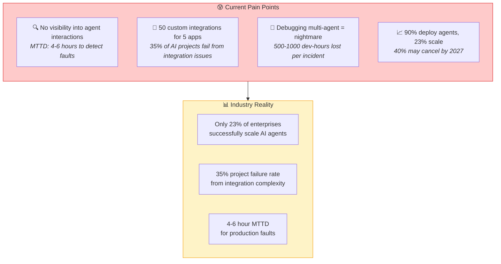

### 📋 Common Failure Modes

| Problem | Impact | Industry Data |
|:--------|:-------|:--------------|
| 🔍 **Observability Blind Spots** | Can't see what agents are doing | 20% revenue loss from downtime |
| 🔌 **Integration Hell** | N apps × M services = N×M integrations | 3-6 month delays typical |
| 🤝 **Agent Collisions** | Competing goals, no priority logic | Budget overruns, "digital riots" |
| 📝 **No Standard Format** | Every tool has different config | Vendor lock-in, fragmented teams |
| 🧪 **Hard to Test** | Non-deterministic, stateful | Emergent failures in production |

### ✅ How Nika Solves This

```
┌─────────────────────────────────────────────────────────────────────────────────┐
│                                                                                 │
│  ❌ BEFORE NIKA                        ✅ WITH NIKA                             │
│  ─────────────────                     ──────────────                           │
│                                                                                 │
│  • 50 custom integrations              • 1 MCP client, unlimited servers        │
│  • 4-6 hours to detect faults          • Real-time NDJSON traces               │
│  • Python/JS spaghetti code            • Declarative YAML (5 verbs)            │
│  • Vendor lock-in                      • 6 providers, swap in 1 line           │
│  • "It worked on my machine"           • Reproducible, version-controlled      │
│  • 500+ hours debugging                • Structured events, clear errors       │
│                                                                                 │
└─────────────────────────────────────────────────────────────────────────────────┘
```

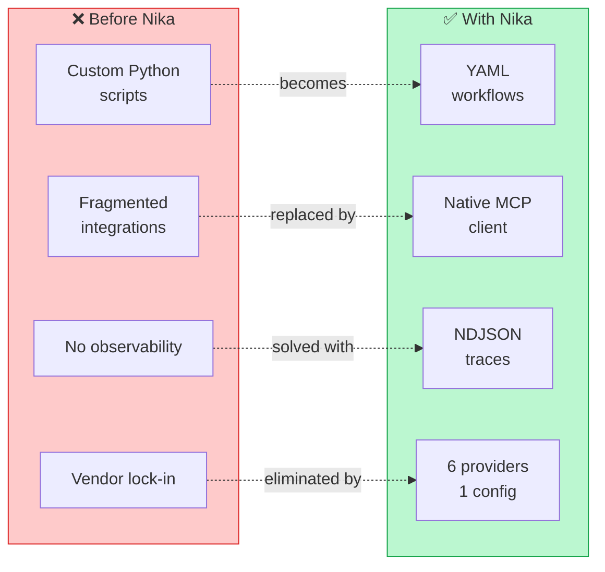

<br>

---

## 🆚 How Nika Compares

### Framework Comparison Matrix

<div align="center">

| Feature | 🦋 **Nika** | 🦜 LangChain | 🦙 LlamaIndex | 👥 CrewAI | 🤖 AutoGen |
|:--------|:----------:|:-----------:|:------------:|:---------:|:----------:|
| **Primary Use** | AI Workflows | LLM Framework | RAG/Docs | Multi-Agent | Conversations |
| **Config Format** | YAML | Python | Python | Python | Python |
| **Learning Curve** | 🟢 5 min | 🟡 Hours | 🟡 Hours | 🟢 30 min | 🔴 Days |
| **MCP Support** | ✅ Native | ❌ No | ❌ No | ❌ No | ❌ No |
| **Observability** | ✅ NDJSON | 🟡 LangSmith | 🟡 Custom | 🟡 Limited | 🟡 Limited |
| **Self-hosted** | ✅ Binary | ✅ Yes | ✅ Yes | ✅ Yes | ✅ Yes |
| **Dependencies** | 0 | Many | Many | Many | Many |
| **Chat-as-DAG** | ✅ Native | ❌ No | ❌ No | ❌ No | ❌ No |
| **Type Safety** | ✅ Rust | ❌ Python | ❌ Python | ❌ Python | ❌ Python |
| **Streaming** | ✅ All 6 | ✅ Yes | ✅ Yes | 🟡 Partial | 🟡 Partial |
| **Production Ready** | ✅ 3,808 tests | 🟡 Varies | 🟡 Varies | 🟡 New | 🔴 Needs guardrails |

</div>

### 📊 Why Each Framework Falls Short

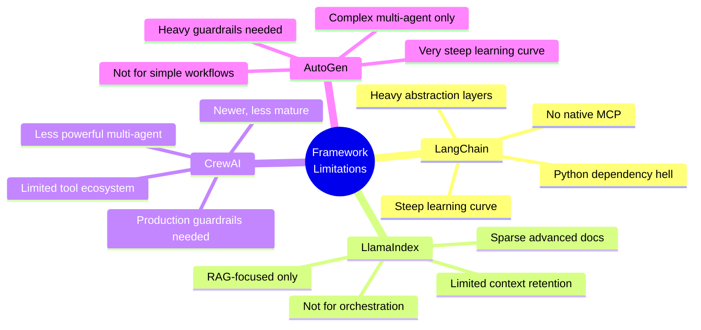

### 💡 When to Use Nika vs Others

```
┌─────────────────────────────────────────────────────────────────────────────────┐
│                                                                                 │
│  USE NIKA WHEN:                           USE OTHERS WHEN:                      │
│  ──────────────                           ─────────────────                     │
│                                                                                 │
│  ✅ You want declarative YAML             🦜 You need deep LangChain ecosystem  │
│  ✅ You need MCP tool integration         🦙 You're building pure RAG apps      │
│  ✅ You want full observability           👥 You need pre-built agent roles     │
│  ✅ You prefer Rust performance           🤖 You're doing research/exploration  │
│  ✅ You need 6 LLM provider support                                             │
│  ✅ You want Chat-as-DAG architecture                                           │
│  ✅ You need reproducible workflows                                             │
│                                                                                 │
└─────────────────────────────────────────────────────────────────────────────────┘
```

<br>

---

## 🚀 Quick Start

### 📦 Installation

```bash
# 🦀 From source (recommended)
cargo install --git https://github.com/supernovae-st/nika.git

# 📁 Or clone and build
git clone https://github.com/supernovae-st/nika.git
cd nika && cargo install --path tools/nika

# ✅ Verify installation
nika --version
# nika 0.17.5
```

### 👋 Hello World (30 seconds)

```yaml
# 📄 hello.nika.yaml
schema: "nika/workflow@0.9"
provider: claude

tasks:
  - id: greet
    infer: "Say hello in French, then in Japanese 🇫🇷🇯🇵"
```

```bash
# 🔑 Set your API key
export ANTHROPIC_API_KEY=sk-ant-...

# 🚀 Run it!
nika hello.nika.yaml
```

<details>
<summary>📺 <b>Output</b></summary>

```
✅ Workflow completed in 1.4s

greet:
  🇫🇷 Bonjour! Comment allez-vous?

  🇯🇵 こんにちは! お元気ですか?
```

</details>

### 🎯 Your First Real Workflow (2 minutes)

```yaml
# 📄 code-review.nika.yaml
schema: "nika/workflow@0.9"
provider: claude

tasks:
  # Step 1: Get the git diff
  - id: get_diff
    exec: "git diff HEAD~1"

  # Step 2: AI reviews the code
  - id: review
    use:
      diff: get_diff  # 👈 Reference previous task
    infer:
      prompt: |
        🔍 Review this code diff for:
        1. 🐛 Potential bugs
        2. 🔒 Security issues
        3. ✨ Improvements

        ```diff
        {{use.diff}}
        ```

        Format as markdown with severity levels.

# 📈 Dependencies (optional - auto-detected)
flows:
  - source: get_diff
    target: review
```

```bash
nika code-review.nika.yaml
```

> 💡 **Pro tip:** Use `nika studio code-review.nika.yaml` to edit with live validation!

<br>

---

## 🏗️ Architecture

### High-Level Overview

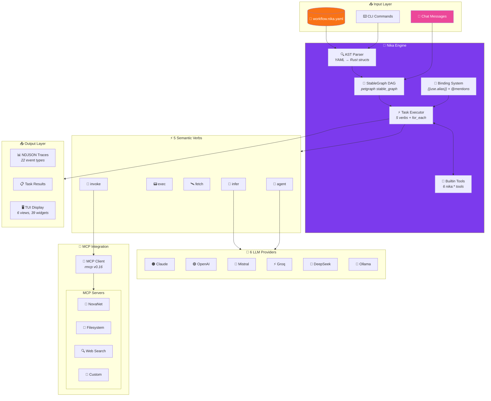

### 📁 Module Architecture

```
┌─────────────────────────────────────────────────────────────────────────────────┐
│                           🦋 NIKA CRATE STRUCTURE                               │
├─────────────────────────────────────────────────────────────────────────────────┤
│                                                                                 │
│  tools/nika/src/                                                               │
│  │                                                                             │
│  ├── 📄 main.rs ─────────── CLI entry point                                   │
│  ├── 📄 lib.rs ──────────── Public API exports                                │
│  ├── 📄 error.rs ────────── NikaError (40+ variants)                          │
│  │                                                                             │
│  ├── 🔍 ast/ ────────────── YAML → Rust structs (3,969 LOC)                   │
│  │   ├── workflow.rs        Workflow definition                                │
│  │   ├── action.rs          5 TaskAction variants                              │
│  │   ├── task.rs            Task with for_each, decompose                      │
│  │   └── decompose.rs       Runtime DAG expansion                              │
│  │                                                                             │
│  ├── 🔗 dag/ ────────────── petgraph StableGraph (1,914 LOC)                  │
│  │   ├── stable.rs          StableDag<T> wrapper                               │
│  │   └── validation.rs      Cycle detection, dependency resolution             │
│  │                                                                             │
│  ├── ⚡ runtime/ ─────────── Execution engine (10,282 LOC)                     │
│  │   ├── executor.rs        Task dispatch (5 verbs + for_each)                 │
│  │   ├── runner.rs          Workflow orchestration                             │
│  │   ├── rig_agent_loop.rs  rig-core AgentBuilder wrapper                      │
│  │   └── spawn.rs           Nested agents (spawn_agent tool)                   │
│  │                                                                             │
│  ├── 🔌 mcp/ ────────────── MCP client (5,182 LOC)                            │
│  │   ├── client.rs          McpClient with DashMap caching                     │
│  │   ├── rmcp_adapter.rs    rmcp v0.16 SDK wrapper                             │
│  │   └── validation/        Tool parameter validation                          │
│  │                                                                             │
│  ├── 🔗 binding/ ─────────── Data flow (3,325 LOC)                            │
│  │   ├── entry.rs           UseEntry with lazy flag                            │
│  │   ├── resolve.rs         LazyBinding resolution                             │
│  │   └── template.rs        {{use.alias}} interpolation                        │
│  │                                                                             │
│  ├── 📊 event/ ──────────── Observability (1,732 LOC)                         │
│  │   ├── log.rs             EventLog (22 variants)                             │
│  │   └── trace.rs           NDJSON writer                                      │
│  │                                                                             │
│  ├── 🔮 provider/ ────────── LLM providers (1,912 LOC)                        │
│  │   └── rig.rs             RigProvider + NikaMcpTool                          │
│  │                                                                             │
│  └── 🖥️ tui/ ─────────────── Terminal UI (73,466 LOC)                         │
│      ├── views/             6 views (Chat, Home, Studio, Monitor...)           │
│      ├── widgets/           39 widgets                                          │
│      └── animation.rs       AnimationTicker (60fps)                            │
│                                                                                 │
├─────────────────────────────────────────────────────────────────────────────────┤
│  📊 TOTALS: 172 files │ 106,000 LOC │ 3,449 tests │ 0 clippy warnings         │
└─────────────────────────────────────────────────────────────────────────────────┘
```

### 🔄 Execution Flow

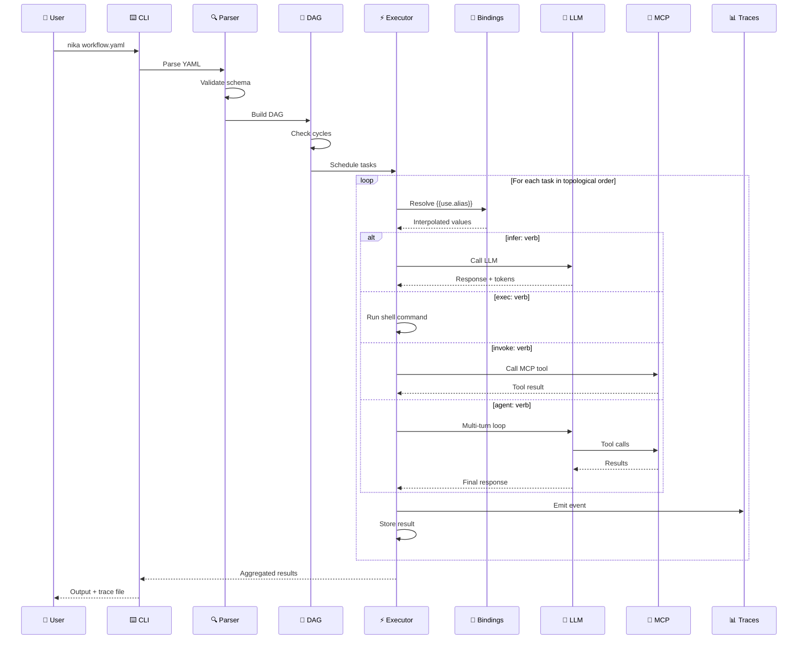

<br>

---

## ⚡ The 5 Verbs

<div align="center">

```
┌─────────────────────────────────────────────────────────────────────────────────┐
│                                                                                 │
│                           🦋 NIKA'S 5 SEMANTIC VERBS                            │
│                                                                                 │
│   ┌─────────┐   ┌─────────┐   ┌─────────┐   ┌─────────┐   ┌─────────┐         │
│   │  🧠     │   │  📟     │   │  🛰️     │   │  🔌     │   │  🤖     │         │
│   │ infer   │   │  exec   │   │  fetch  │   │ invoke  │   │  agent  │         │
│   │         │   │         │   │         │   │         │   │         │         │
│   │  LLM    │   │  Shell  │   │  HTTP   │   │  MCP    │   │ Agentic │         │
│   └─────────┘   └─────────┘   └─────────┘   └─────────┘   └─────────┘         │
│                                                                                 │
│   "Generate    "Run any      "Call any     "Use MCP     "Multi-turn            │
│    text"        command"      REST API"     tools"       reasoning"            │
│                                                                                 │
└─────────────────────────────────────────────────────────────────────────────────┘
```

</div>

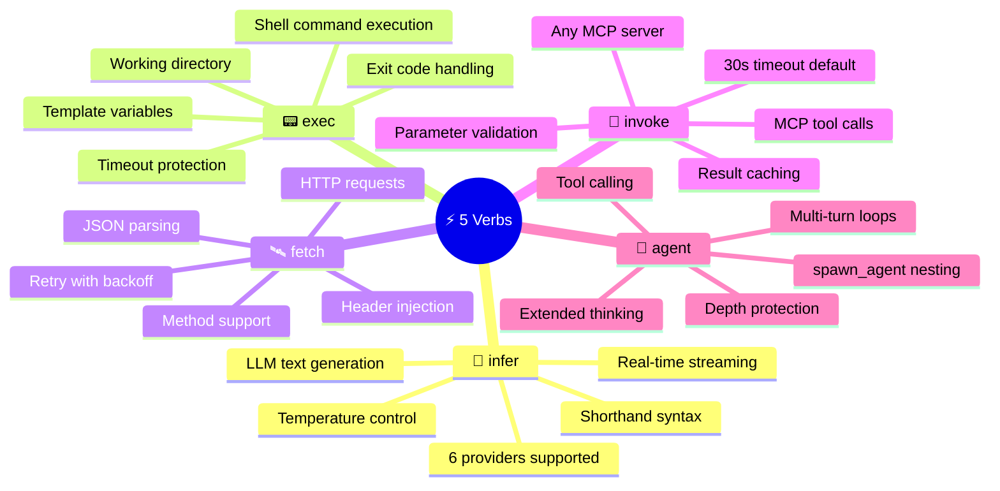

### 🧠 `infer` — LLM Generation

<table>
<tr>
<td width="50%">

**Shorthand** (simple prompts):
```yaml
- id: haiku
  infer: "Write a haiku about Rust 🦀"
```

</td>
<td width="50%">

**Full options** (production):
```yaml
- id: analyze
  infer:
    prompt: "Analyze this code for bugs"
    provider: openai      # Override default
    model: gpt-4o         # Specific model
    temperature: 0.7      # Creativity
    max_tokens: 2000      # Limit output
```

</td>
</tr>
</table>

> 💡 **Tip:** Use shorthand for quick scripts, full form for production workflows!

### 📟 `exec` — Shell Commands

<table>
<tr>
<td width="50%">

**Simple command**:
```yaml
- id: build
  exec: "cargo build --release"
```

</td>
<td width="50%">

**With templating**:
```yaml
- id: deploy
  use:
    env: staging
    tag: v1.2.3
  exec:
    command: |
      kubectl apply -f {{use.env}}.yaml
      echo "Deployed {{use.tag}} ✅"
    timeout: 60
```

</td>
</tr>
</table>

> ⚠️ **Security tip:** Always validate inputs when using `{{use.*}}` in commands!

### 🛰️ `fetch` — HTTP Requests

```yaml
- id: get_weather
  fetch:
    url: "https://api.weather.com/v1/current"
    method: GET
    headers:
      Authorization: "Bearer {{use.api_key}}"
      Content-Type: "application/json"
    query:
      city: "Paris"
      units: "metric"
  output:
    format: json

- id: post_data
  fetch:
    url: "https://api.example.com/submit"
    method: POST
    body:
      name: "{{use.user_name}}"
      data: "{{use.processed_data}}"
    retry:
      max_attempts: 3
      backoff_ms: 1000
```

### 🔌 `invoke` — MCP Tool Calls

```yaml
# Define MCP servers once
mcp:
  novanet:
    command: novanet-mcp
    env:
      NEO4J_URI: bolt://localhost:7687
  filesystem:
    command: npx
    args: ["-y", "@anthropic/mcp-filesystem"]

tasks:
  - id: generate_content
    invoke:
      mcp: novanet              # Server name
      tool: novanet_generate    # Tool name
      params:
        focus_key: "entity:qr-code"
        locale: "fr-FR"
        forms: ["text", "title", "description"]

  - id: save_file
    use:
      content: generate_content
    invoke:
      mcp: filesystem
      tool: write_file
      params:
        path: "/output/content.json"
        content: "{{use.content}}"
```

### 🤖 `agent` — Agentic Loops

```yaml
- id: research_agent
  agent:
    prompt: |
      🔬 Research AI safety papers from 2024.

      For each paper:
      1. Extract key findings
      2. Identify methodologies
      3. Note limitations

      Compile into a comprehensive report.

    mcp: [web_search, filesystem]  # Available tools
    max_turns: 15                   # Prevent infinite loops
    thinking: true                  # Extended reasoning (Claude)
    depth_limit: 3                  # Nested agent protection

    stop_conditions:               # When to stop
      - "RESEARCH_COMPLETE"
      - "NO_MORE_PAPERS"
```

> 🎯 **Best practice:** Always set `max_turns` and `depth_limit` in production!

<br>

---

## 💬 Chat DAG Widgets

<sup>✨ New in v0.10+</sup>

Nika v0.10 introduces **Chat-as-DAG** architecture where every chat message is a DAG node with stable references.

```
┌─────────────────────────────────────────────────────────────────────────────────┐
│                         💬 CHAT-AS-DAG ARCHITECTURE                             │
├─────────────────────────────────────────────────────────────────────────────────┤
│                                                                                 │
│  Every message you send becomes a node in a directed graph:                     │
│                                                                                 │
│     @1 ──────────► @2 ──────────► @3 ──────────► @4                            │
│    User         Assistant        User         Assistant                         │
│   "Research"   "Found 5..."    "Summarize    "Here's a                          │
│                                  @1"           summary..."                      │
│                                   │                                             │
│                                   └── Creates edge back to @1!                  │
│                                                                                 │
│  Benefits:                                                                      │
│  • Reference any previous message with @N                                       │
│  • Create parallel branches with //                                             │
│  • Full traceability of conversation flow                                       │
│  • Stable references survive deletions                                          │
│                                                                                 │
└─────────────────────────────────────────────────────────────────────────────────┘
```

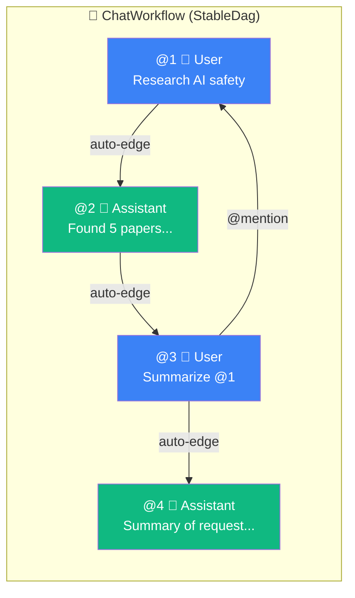

### 📝 @mention Syntax Reference

| Syntax | Description | Example | Result |
|:-------|:------------|:--------|:-------|
| `@N` | Reference message N | `Analyze @1` | Links to message 1 |
| `@last` | Previous message | `Continue @last` | Links to most recent |
| `@all` | All messages | `Summarize @all` | Links to entire history |
| `@N..M` | Range of messages | `Compare @1..3` | Links to messages 1, 2, 3 |
| `//` | Parallel marker | `@1 // @2` | Creates parallel edges |

### 🧩 Widget Components

| Widget | Purpose | Features | LOC |
|:-------|:--------|:---------|----:|
| **ChatNodeBox** | Message as DAG node | 4 kinds, 4 states, verb icons | 450 |
| **ChatEdgeLine** | @N reference edges | Bezier curves, directional arrows | 380 |
| **ChatTaskQueue** | Task execution queue | 5-verb icons, progress, timing | 520 |
| **ChatDagPanel** | Full DAG visualization | Nodes + edges combined, zoom | 680 |

<br>

---

## 🔧 Builtin Tools

<sup>✨ New in v0.9.3</sup>

6 `nika:*` prefixed tools for workflow control:

```
┌─────────────────────────────────────────────────────────────────────────────────┐
│                         🔧 BUILTIN TOOLS (nika:*)                               │
├─────────────────────────────────────────────────────────────────────────────────┤
│                                                                                 │
│  ⏱️  nika:sleep     │  Delay execution with millisecond precision              │
│  📝  nika:log       │  Emit log events (trace/debug/info/warn/error)           │
│  📤  nika:emit      │  Custom event emission with JSON payload                 │
│  ✅  nika:assert    │  Validate conditions with custom error messages          │
│  💬  nika:prompt    │  Interactive user prompts (Human-in-the-Loop)            │
│  🔄  nika:run       │  Execute sub-workflows with validation                   │
│                                                                                 │
├─────────────────────────────────────────────────────────────────────────────────┤
│  💡 These tools are available in any agent: block without MCP config!          │
└─────────────────────────────────────────────────────────────────────────────────┘
```

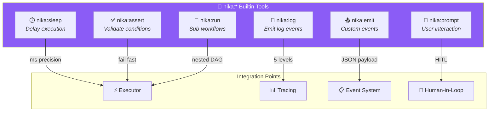

### Usage Example

```yaml
- id: careful_agent
  agent:
    prompt: |
      Process this data carefully.
      Use nika:log to track progress.
      Use nika:assert to validate assumptions.
      Use nika:sleep for rate limiting.

    tools:
      - nika:log      # 📝 Track progress
      - nika:assert   # ✅ Validate data
      - nika:sleep    # ⏱️ Rate limit APIs
      - nika:prompt   # 💬 Ask user if unsure
```

<br>

---

## 🎨 Studio TUI

Launch the terminal UI with **8 views**:

```bash
nika              # 🏠 Home view (browse workflows)
nika chat         # 💬 Chat with AI
nika studio       # 📝 YAML editor
nika studio file.yaml  # 📝 Edit specific file
```

### 🖥️ 8-Views Architecture

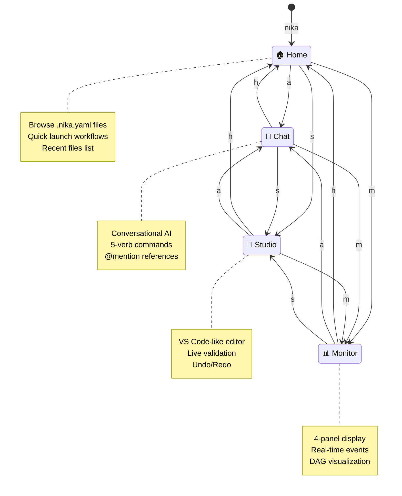

```
┌─────────────────────────────────────────────────────────────────────────────────┐
│                            🎨 8-VIEWS ARCHITECTURE                              │
├─────────────────────────────────────────────────────────────────────────────────┤
│                                                                                 │
│    ┌──────────┐     ┌──────────┐     ┌──────────┐     ┌──────────┐            │
│    │   🏠     │     │   💬     │     │   📝     │     │   📊     │            │
│    │   Home   │◄───►│   Chat   │◄───►│  Studio  │◄───►│ Monitor  │            │
│    │          │     │          │     │          │     │          │            │
│    │  Browse  │     │  Converse│     │   Edit   │     │  Execute │            │
│    └──────────┘     └──────────┘     └──────────┘     └──────────┘            │
│         │                                                    │                 │
│         │              ┌──────────┐     ┌──────────┐        │                 │
│         └──────────────│   ⚙️     │     │   ❓     │────────┘                 │
│                        │ Settings │     │   Help   │                          │
│                        │  Ctrl+,  │     │    ?     │                          │
│                        └──────────┘     └──────────┘                          │
│                                                                                 │
└─────────────────────────────────────────────────────────────────────────────────┘
```

### ⌨️ Keyboard Shortcuts

| Category | Key | Action |
|:---------|:---:|:-------|
| **Navigation** | `a` | Switch to Chat view |
| | `h` | Switch to Home view |
| | `s` | Switch to Studio view |
| | `m` | Switch to Monitor view |
| | `,` | Open Settings |
| | `?` | Open Help |
| | `Tab` | Cycle views |
| **Editor** | `Ctrl+Z` | Undo |
| | `Ctrl+Y` | Redo |
| | `Ctrl+S` | Save |
| | `Ctrl+P` | Fuzzy file search |
| | `Ctrl+W` | Close tab |
| | `Alt+←/→` | Navigate tabs |
| **General** | `Ctrl+K` | Command palette |
| | `q` | Quit |
| | `Esc` | Close overlay |

<br>

---

## 🔮 Providers

<div align="center">

### 6 LLM Providers, 1 Config

| Provider | Env Variable | Default Model | Streaming | Thinking | Status |
|:--------:|:-------------|:--------------|:---------:|:--------:|:------:|
| 🟠 **Claude** | `ANTHROPIC_API_KEY` | `claude-sonnet-4-20250514` | ✅ | ✅ | Primary |
| 🟢 **OpenAI** | `OPENAI_API_KEY` | `gpt-4o` | ✅ | - | Full |
| 🔵 **Mistral** | `MISTRAL_API_KEY` | `mistral-large-latest` | ✅ | - | Full |
| ⚡ **Groq** | `GROQ_API_KEY` | `llama-3.3-70b-versatile` | ✅ | - | Full |
| 🌊 **DeepSeek** | `DEEPSEEK_API_KEY` | `deepseek-chat` | ✅ | - | Full |
| 🦙 **Ollama** | `OLLAMA_API_BASE_URL` | `llama3.2` | ✅ | - | Local |

</div>

### 🔄 Auto-Detection Priority

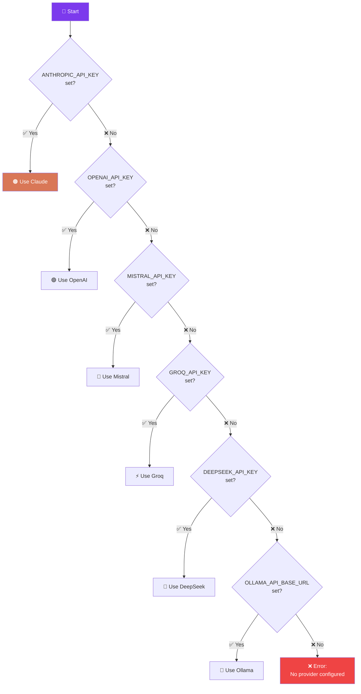

### 💡 Provider Tips

```
┌─────────────────────────────────────────────────────────────────────────────────┐
│                           💡 PROVIDER TIPS                                      │
├─────────────────────────────────────────────────────────────────────────────────┤
│                                                                                 │
│  🟠 CLAUDE      Best for: Complex reasoning, extended thinking                  │
│                 Tip: Use thinking: true for deep analysis                       │
│                                                                                 │
│  🟢 OPENAI      Best for: General purpose, GPT-4o vision                        │
│                 Tip: Great for code generation                                  │
│                                                                                 │
│  🔵 MISTRAL     Best for: European data residency, code                         │
│                 Tip: Excellent price/performance ratio                          │
│                                                                                 │
│  ⚡ GROQ        Best for: Speed (10x faster inference)                          │
│                 Tip: Use for latency-sensitive workflows                        │
│                                                                                 │
│  🌊 DEEPSEEK    Best for: Cost-effective, reasoning                             │
│                 Tip: Strong on math and coding tasks                            │
│                                                                                 │
│  🦙 OLLAMA      Best for: Local/private, no API costs                           │
│                 Tip: Run llama3.2 locally for development                       │
│                                                                                 │
└─────────────────────────────────────────────────────────────────────────────────┘
```

<br>

---

## 🔌 MCP Integration

Connect Nika to any [Model Context Protocol](https://modelcontextprotocol.io/) server:

```
┌─────────────────────────────────────────────────────────────────────────────────┐
│                         🔌 MCP: THE NEW STANDARD                                │
├─────────────────────────────────────────────────────────────────────────────────┤
│                                                                                 │
│  MCP (Model Context Protocol) is Anthropic's open standard for connecting      │
│  AI models to external tools and data sources.                                  │
│                                                                                 │
│  📊 Industry Adoption (2025):                                                   │
│  • 10,000+ active public servers                                                │
│  • 97M+ monthly SDK downloads                                                   │
│  • Supported by OpenAI, Google, Microsoft, GitHub                               │
│  • Governed by Linux Foundation                                                 │
│                                                                                 │
│  🦋 Nika was built MCP-native from day 1!                                       │
│                                                                                 │
└─────────────────────────────────────────────────────────────────────────────────┘
```

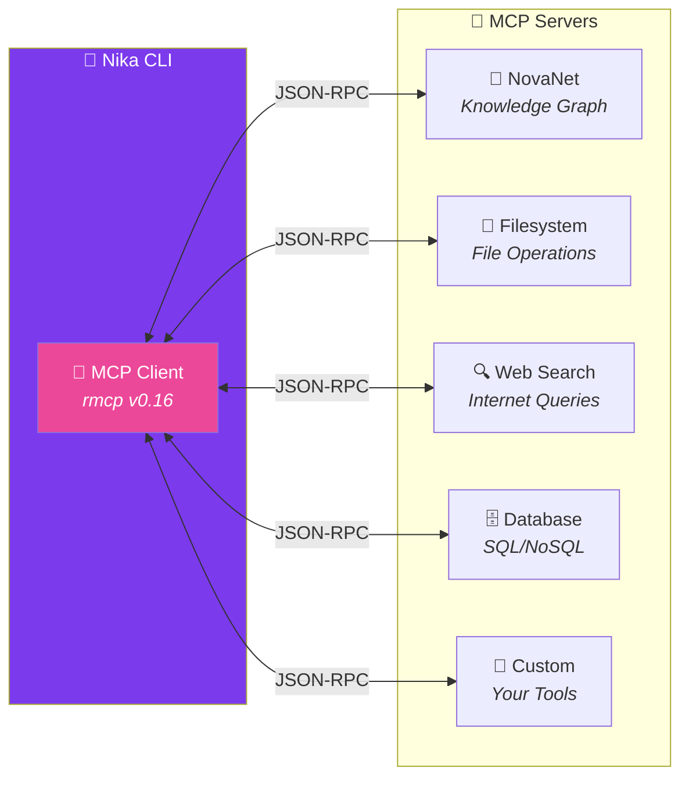

### 📝 Configuration Example

```yaml
schema: "nika/workflow@0.9"

# 🔌 Define MCP servers
mcp:
  novanet:
    command: novanet-mcp
    env:
      NEO4J_URI: bolt://localhost:7687
      NEO4J_USER: neo4j
      NEO4J_PASSWORD: "{{env.NEO4J_PASSWORD}}"

  filesystem:
    command: npx
    args: ["-y", "@anthropic/mcp-filesystem"]
    env:
      ALLOWED_PATHS: "/home/user/projects"

  web_search:
    command: npx
    args: ["-y", "@anthropic/mcp-web-search"]
    env:
      SEARCH_API_KEY: "{{env.SEARCH_API_KEY}}"

  slack:
    command: npx
    args: ["-y", "@anthropic/mcp-slack"]
    env:
      SLACK_TOKEN: "{{env.SLACK_TOKEN}}"

tasks:
  # Use MCP tools in workflows
  - id: research
    agent:
      prompt: "Research AI papers and save findings"
      mcp: [web_search, filesystem]  # 👈 Available tools

  # Or invoke directly
  - id: notify
    invoke:
      mcp: slack
      tool: send_message
      params:
        channel: "#research"
        text: "New findings available! 🎉"
```

<br>

---

## 📚 Examples

### 🔄 Complete Code Review Pipeline

```yaml
# 📄 code-review-pipeline.nika.yaml
schema: "nika/workflow@0.9"
provider: claude

tasks:
  # 1️⃣ Get changed files
  - id: get_files
    exec: "git diff --name-only HEAD~1"

  # 2️⃣ Get the actual diff
  - id: get_diff
    exec: "git diff HEAD~1"

  # 3️⃣ AI analyzes the code
  - id: security_review
    use:
      diff: get_diff
    infer:
      prompt: |
        🔒 SECURITY REVIEW

        Analyze this diff for security vulnerabilities:
        - SQL injection
        - XSS vulnerabilities
        - Authentication issues
        - Secrets exposure

        ```diff
        {{use.diff}}
        ```

        Format: JSON with severity (critical/high/medium/low)
      temperature: 0.3  # More deterministic

  # 4️⃣ Check for bugs
  - id: bug_review
    use:
      diff: get_diff
    infer:
      prompt: |
        🐛 BUG REVIEW

        Analyze this diff for potential bugs:
        - Logic errors
        - Edge cases
        - Null pointer issues
        - Race conditions

        ```diff
        {{use.diff}}
        ```

  # 5️⃣ Suggest improvements
  - id: improvement_review
    use:
      diff: get_diff
    infer:
      prompt: |
        ✨ IMPROVEMENT SUGGESTIONS

        Suggest improvements for:
        - Code readability
        - Performance
        - Best practices
        - Documentation

        ```diff
        {{use.diff}}
        ```

  # 6️⃣ Compile final report
  - id: compile_report
    use:
      security: security_review
      bugs: bug_review
      improvements: improvement_review
      files: get_files
    infer:
      prompt: |
        📋 COMPILE CODE REVIEW REPORT

        Create a comprehensive markdown report combining:

        **Files Changed:**
        {{use.files}}

        **Security Findings:**
        {{use.security}}

        **Bug Analysis:**
        {{use.bugs}}

        **Improvements:**
        {{use.improvements}}

        Format as a professional PR review comment.

  # 7️⃣ Post to GitHub (optional)
  - id: post_comment
    use:
      report: compile_report
    exec: |
      gh pr comment --body "{{use.report}}"

flows:
  - source: get_files
    target: get_diff
  - source: get_diff
    target: [security_review, bug_review, improvement_review]
  - source: [security_review, bug_review, improvement_review]
    target: compile_report
  - source: compile_report
    target: post_comment
```

### 🌍 Multi-Locale Content Generation

```yaml
# 📄 multi-locale.nika.yaml
schema: "nika/workflow@0.9"

mcp:
  novanet:
    command: novanet-mcp

tasks:
  # 1️⃣ Get entity context from knowledge graph
  - id: get_context
    invoke:
      mcp: novanet
      tool: novanet_describe
      params:
        entity: "qr-code"
        depth: 2

  # 2️⃣ Generate content for all locales in parallel
  - id: generate_content
    for_each: ["en-US", "fr-FR", "de-DE", "ja-JP", "es-ES", "pt-BR"]
    as: locale
    concurrency: 6  # 🚀 All in parallel!
    use:
      context: get_context
    infer:
      prompt: |
        📝 Generate marketing content for locale: {{use.locale}}

        Context: {{use.context}}

        Create:
        1. Headline (max 60 chars)
        2. Tagline (max 120 chars)
        3. Description (max 300 chars)
        4. CTA button text

        Adapt tone and cultural references for {{use.locale}}.
        Format as JSON.

  # 3️⃣ Validate all outputs
  - id: validate_outputs
    use:
      content: generate_content
    agent:
      prompt: |
        ✅ Validate all generated content:

        {{use.content}}

        Check:
        - Character limits respected
        - No placeholder text
        - Culturally appropriate
        - Valid JSON format

        Report any issues found.
      tools: [nika:assert, nika:log]

flows:
  - source: get_context
    target: generate_content
  - source: generate_content
    target: validate_outputs
```

### 🤖 Multi-Agent Research System

```yaml
# 📄 research-system.nika.yaml
schema: "nika/workflow@0.9"
provider: claude

mcp:
  web_search:
    command: npx
    args: ["-y", "@anthropic/mcp-web-search"]
  filesystem:
    command: npx
    args: ["-y", "@anthropic/mcp-filesystem"]

tasks:
  # 🎯 Main orchestrator agent
  - id: orchestrator
    agent:
      prompt: |
        🎯 RESEARCH ORCHESTRATOR

        Topic: "AI Safety Developments 2024"

        Your job:
        1. Use web_search to find 5 key papers/articles
        2. For complex analysis, use spawn_agent to delegate
        3. Use filesystem to save intermediate results
        4. Compile a final comprehensive report

        Guidelines:
        - Be thorough but focused
        - Cite all sources
        - Use spawn_agent for deep dives
        - Log your progress with nika:log

      mcp: [web_search, filesystem]
      max_turns: 20
      depth_limit: 3  # Allow nested agents
      thinking: true  # Extended reasoning

      tools:
        - nika:log     # Track progress
        - nika:sleep   # Rate limit searches
        - nika:emit    # Custom events

  # 📊 Post-processing
  - id: format_report
    use:
      research: orchestrator
    infer:
      prompt: |
        📊 FORMAT FINAL REPORT

        Take the research findings and create a polished
        markdown report with:

        - Executive summary
        - Key findings (numbered)
        - Source citations
        - Recommendations
        - Appendix with raw data

        Research: {{use.research}}

flows:
  - source: orchestrator
    target: format_report
```

### 💎 Diamond DAG Pattern

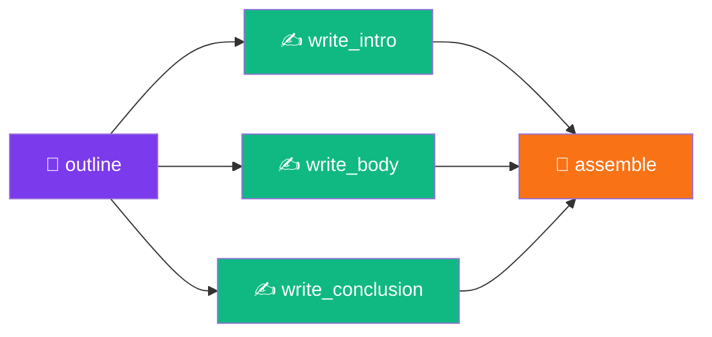

```yaml
# 📄 diamond-dag.nika.yaml
schema: "nika/workflow@0.9"
provider: claude

tasks:
  - id: outline
    infer: |
      Create a detailed outline for a blog post about:
      "Why Declarative AI Workflows Are the Future"

      Include: title, 3 main sections, key points per section.
      Format as JSON.

  - id: write_intro
    use: { outline: outline }
    infer: |
      Write an engaging introduction based on:
      {{use.outline}}

      Hook the reader in the first sentence.
      ~200 words.

  - id: write_body
    use: { outline: outline }
    infer: |
      Write the main body sections based on:
      {{use.outline}}

      Include examples and code snippets.
      ~600 words.

  - id: write_conclusion
    use: { outline: outline }
    infer: |
      Write a compelling conclusion based on:
      {{use.outline}}

      Include a call-to-action.
      ~150 words.

  - id: assemble
    use:
      intro: write_intro
      body: write_body
      conclusion: write_conclusion
    exec: |
      cat << 'EOF'
      {{use.intro}}

      ---

      {{use.body}}

      ---

      {{use.conclusion}}
      EOF

flows:
  - source: outline
    target: [write_intro, write_body, write_conclusion]
  - source: [write_intro, write_body, write_conclusion]
    target: assemble
```

<br>

---

## 📊 Project Stats

<div align="center">

```
╔═════════════════════════════════════════════════════════════════════════════════╗
║                                                                                 ║
║                           🦋 NIKA v0.21.1 STATS                                 ║
║                                                                                 ║
╠═════════════════════════════════════════════════════════════════════════════════╣
║                                                                                 ║
║   📊 Tests              │  3,808 passing                                        ║
║   📝 Lines of Code      │  110,000+ LOC                                         ║
║   🔧 Clippy Warnings    │  0 (zero!)                                            ║
║   🔮 LLM Providers      │  7 (Claude, OpenAI, Mistral, Groq, DeepSeek, Ollama, Gemini) ║
║   ⚡ Semantic Verbs     │  5 (infer, exec, fetch, invoke, agent)               ║
║   🔧 Builtin Tools      │  11 (6 core + 5 file tools)                          ║
║   🖥️ TUI Views          │  8 (Chat, Home, Studio, Monitor, Split, Workspace, Settings, Help) ║
║   🧩 TUI Widgets        │  39 widgets                                           ║
║   📋 Event Types        │  24 variants (+2 artifact events)                     ║
║   🦀 Rust Edition       │  2021                                                 ║
║   📦 Binary Size        │  ~15 MB                                               ║
║   🚀 Startup Time       │  < 50ms                                               ║
║                                                                                 ║
╚═════════════════════════════════════════════════════════════════════════════════╝
```

</div>

### 📈 Test Distribution by Module

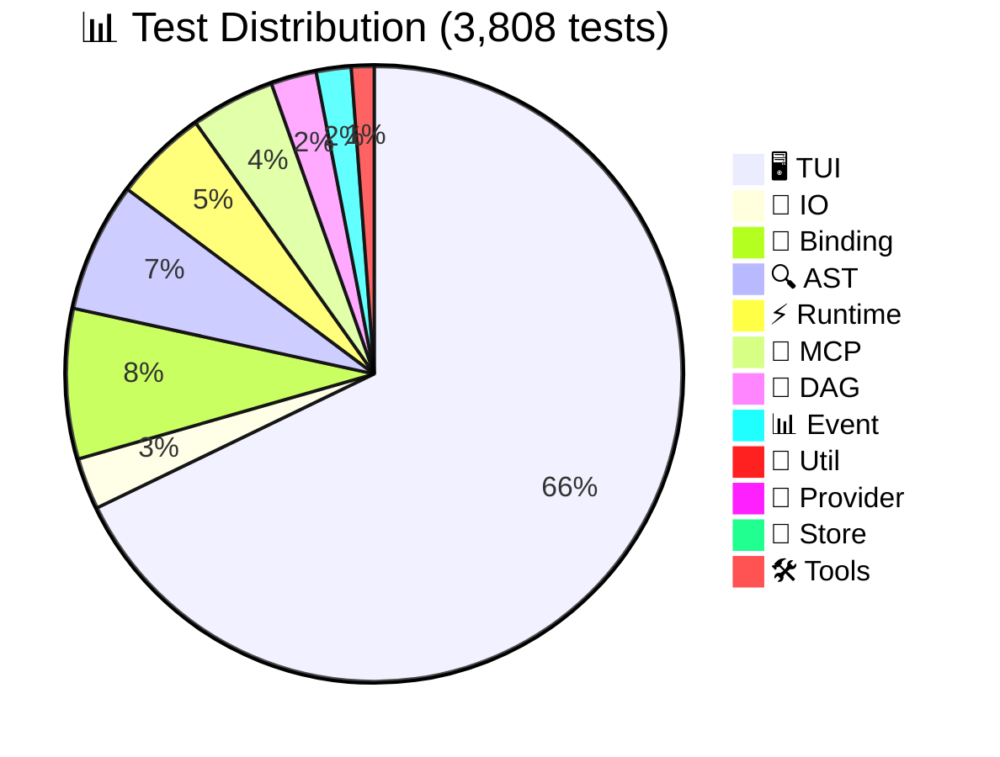

### 🏗️ Code Distribution

| Module | LOC | Tests | Description |
|:-------|----:|------:|:------------|
| 🖥️ `tui/` | 73,466 | 1,704 | Terminal UI (6 views, 39 widgets) |
| ⚡ `runtime/` | 10,282 | 124 | Execution engine, agent loop |
| 🔌 `mcp/` | 5,182 | 111 | MCP client, validation |
| 🔍 `ast/` | 3,969 | 171 | YAML parsing, task actions |
| 🔗 `binding/` | 3,325 | 198 | Data flow, templates |
| 🔧 `tools/` | 3,281 | 13 | Claude Code tools |
| 🔮 `provider/` | 1,912 | 24 | rig-core wrapper |
| 🔀 `dag/` | 1,914 | 60 | StableGraph, validation |
| 📊 `event/` | 1,732 | 46 | Event log, traces |
| **Total** | **106,000+** | **3,449** | |

<br>

---

## ⚙️ Powered By

<div align="center">

| Crate | Version | Purpose |
|:------|:-------:|:--------|
| [](https://github.com/0xPlaygrounds/rig) | 0.31 | LLM agent framework |
| [](https://tokio.rs/) | 1.49 | Async runtime |
| [](https://ratatui.rs/) | 0.30 | Terminal UI |
| [](https://github.com/anthropics/anthropic-cookbook) | 0.16 | MCP client SDK |
| [](https://docs.rs/petgraph) | 0.6 | DAG implementation |
| [](https://serde.rs/) | 1.0 | Serialization |

</div>

<br>

---

## 💻 IDE Setup

Get YAML autocompletion and validation:

<details>
<summary>🆚 <b>VS Code</b></summary>

Install [YAML extension](https://marketplace.visualstudio.com/items?itemName=redhat.vscode-yaml), then add to `.vscode/settings.json`:

```json
{
  "yaml.schemas": {
    "https://raw.githubusercontent.com/supernovae-st/nika/main/schemas/nika-workflow.schema.json": "*.nika.yaml"
  },
  "yaml.customTags": [
    "!include scalar"
  ]
}
```

</details>

<details>
<summary>🧠 <b>JetBrains (IntelliJ, WebStorm)</b></summary>

1. Go to **Settings → Languages → Schemas and DTDs → JSON Schema Mappings**
2. Add new mapping:
   - Schema URL: `https://raw.githubusercontent.com/supernovae-st/nika/main/schemas/nika-workflow.schema.json`
   - File pattern: `*.nika.yaml`

</details>

<details>
<summary>🌙 <b>Neovim (nvim-lspconfig)</b></summary>

```lua
require('lspconfig').yamlls.setup {
  settings = {
    yaml = {
      schemas = {
        ["https://raw.githubusercontent.com/supernovae-st/nika/main/schemas/nika-workflow.schema.json"] = "*.nika.yaml"
      }
    }
  }
}
```

</details>

<br>

---

## 📖 Documentation

| Resource | Description |
|:---------|:------------|
| 📋 [CHANGELOG.md](CHANGELOG.md) | Version history & release notes |
| 🏗️ [docs/ARCHITECTURE.md](docs/ARCHITECTURE.md) | System design & diagrams |
| 🤖 [tools/nika/CLAUDE.md](tools/nika/CLAUDE.md) | AI context & codebase guide |
| 📁 [examples/](tools/nika/examples/) | Sample workflows (100+ examples) |
| 🎓 [examples/expert/](tools/nika/examples/expert/) | Advanced production patterns |
| 📐 [schemas/](schemas/) | JSON Schema for IDE validation |

<br>

---

## ❓ FAQ

<details>
<summary><b>🔄 How do I switch LLM providers?</b></summary>

Set the environment variable for your provider:

```bash
# Use Claude (default)
export ANTHROPIC_API_KEY=sk-ant-...

# Use OpenAI instead
export OPENAI_API_KEY=sk-...

# Or specify per-workflow
provider: openai  # in your YAML

# Or per-task
- id: analyze
  infer:
    prompt: "..."
    provider: mistral
```

</details>

<details>
<summary><b>💬 How do I use @mentions in chat?</b></summary>

Reference previous messages by their number:

```
You: Research AI safety papers
Assistant: Found 5 papers...

You: Summarize @1 in bullet points
# ^^ References message 1 (your first message)

You: Compare @1 and @2
# ^^ References messages 1 and 2

You: Review @all and identify gaps
# ^^ References all messages
```

</details>

<details>
<summary><b>🔧 What are builtin tools?</b></summary>

Nika provides 6 `nika:*` tools for workflow control:

| Tool | Purpose | Example |
|:-----|:--------|:--------|
| `nika:sleep` | Delay execution | `nika:sleep 1000` (1 second) |
| `nika:log` | Emit log events | `nika:log info "Processing..."` |
| `nika:emit` | Custom events | `nika:emit {status: "done"}` |
| `nika:assert` | Validate conditions | `nika:assert count > 0` |
| `nika:prompt` | User prompts | `nika:prompt "Continue?"` |
| `nika:run` | Sub-workflows | `nika:run other.nika.yaml` |

</details>

<details>
<summary><b>🤖 What's the difference between infer and agent?</b></summary>

| Feature | `infer` | `agent` |
|:--------|:--------|:--------|
| Turns | Single | Multi-turn loop |
| Tools | ❌ No | ✅ MCP tools |
| Nested agents | ❌ No | ✅ spawn_agent |
| Extended thinking | ❌ No | ✅ Yes (Claude) |
| Use for | Simple prompts | Complex reasoning |

</details>

<details>
<summary><b>🐛 How do I debug a failing workflow?</b></summary>

1. **Check traces:**
   ```bash
   nika trace list
   nika trace show <id>
   ```

2. **Validate first:**
   ```bash
   nika check workflow.yaml --strict
   ```

3. **Use verbose mode:**
   ```bash
   RUST_LOG=debug nika run workflow.yaml
   ```

4. **Use TUI Monitor:**
   ```bash
   nika studio workflow.yaml
   # Press 'm' for Monitor view
   ```

</details>

<details>
<summary><b>🚀 How do I improve performance?</b></summary>

1. **Use `for_each` with concurrency:**
   ```yaml
   for_each: [a, b, c, d, e]
   concurrency: 5  # Run all in parallel
   ```

2. **Use lazy bindings:**
   ```yaml
   use:
     ctx:
       path: expensive_task.result
       lazy: true  # Only resolve when accessed
   ```

3. **Cache MCP results:**
   ```yaml
   mcp:
     server:
       cache_ttl: 300  # 5 minutes
   ```

4. **Use Groq for speed:**
   ```yaml
   provider: groq  # 10x faster inference
   ```

</details>

<br>

---

## 🔧 Troubleshooting

<details>
<summary><b>🔴 NIKA-001: No API key found</b></summary>

```
Error: NIKA-001 - No LLM provider configured
```

**Fix:** Set at least one API key:
```bash
export ANTHROPIC_API_KEY=sk-ant-...
# or
export OPENAI_API_KEY=sk-...
```

</details>

<details>
<summary><b>🔴 NIKA-010: MCP server failed to start</b></summary>

```
Error: NIKA-010 - MCP server 'novanet' failed to connect
```

**Fix:**
1. Check the command path exists: `which novanet-mcp`
2. Verify executable: `chmod +x /path/to/server`
3. Check server logs: `nika trace show <id> | grep mcp`
4. Test manually: `novanet-mcp --help`

</details>

<details>
<summary><b>🔴 NIKA-020: Cycle detected in DAG</b></summary>

```
Error: NIKA-020 - Cycle detected: task_a → task_b → task_a
```

**Fix:** Remove circular dependency. Visualize with:
```bash
nika check workflow.yaml --graph
```

</details>

<details>
<summary><b>🟡 Workflow runs slowly</b></summary>

**Tips:**
1. Use `for_each` with `concurrency: N` for parallel tasks
2. Use `lazy: true` bindings to defer expensive lookups
3. Check if MCP servers are reconnecting (add `timeout: 30`)
4. Use Groq provider for 10x faster inference
5. Profile with `RUST_LOG=nika=trace`

</details>

<br>

---

## 🤝 Contributing

We welcome contributions! See [CONTRIBUTING.md](CONTRIBUTING.md) for guidelines.

```bash
git clone https://github.com/supernovae-st/nika.git
cd nika

# 🔨 Build
cargo build

# 🧪 Test (3,808 tests)
cargo test

# 🔍 Lint
cargo clippy -- -D warnings

# 🚀 Run
cargo run -- --help

# 📊 Benchmark
cargo bench
```

<br>

---

## 📜 License

**AGPL-3.0** — See [LICENSE](LICENSE) for details.

<br>

---

<div align="center">

## 🌟 Part of the SuperNovae Ecosystem

<table>
<tr>
<td align="center">
<a href="https://github.com/supernovae-st/novanet">

</a>
<br><sub>Brain: Knowledge Graph + MCP Server</sub>
</td>
<td align="center">
<a href="https://github.com/supernovae-st/nika">

</a>
<br><sub>Body: DAG Workflows + MCP Client</sub>
</td>
</tr>
</table>

<br>

<!-- SuperNovae Studio -->
<a href="https://supernovae.studio">

</a>

**[SuperNovae Studio](https://supernovae.studio)**

*Building the future of AI workflows* 🚀

<br>

<!-- Team -->
<table>
<tr>
<td align="center">
<a href="https://github.com/ThibautMelen">
<br>
<sub><b>Thibaut Melen</b></sub>
</a>
</td>
<td align="center">
<a href="https://github.com/NicolasCELLA">
<br>
<sub><b>Nicolas Cella</b></sub>
</a>
</td>
</tr>
</table>

<br>

<!-- Links -->
[](https://nika.sh)
[](https://supernovae.studio)
[](https://github.com/supernovae-st)
[](https://twitter.com/nikadotsh)

<br>

[](https://github.com/supernovae-st/nika)
&nbsp;&nbsp;
[](https://github.com/supernovae-st/nika/fork)
&nbsp;&nbsp;
[](https://github.com/supernovae-st/nika)

<br>

---

<sub>Made with 💜 and 🦀 by SuperNovae Studio</sub>

**⭐ Star us on GitHub if you find Nika useful!**

</div>
