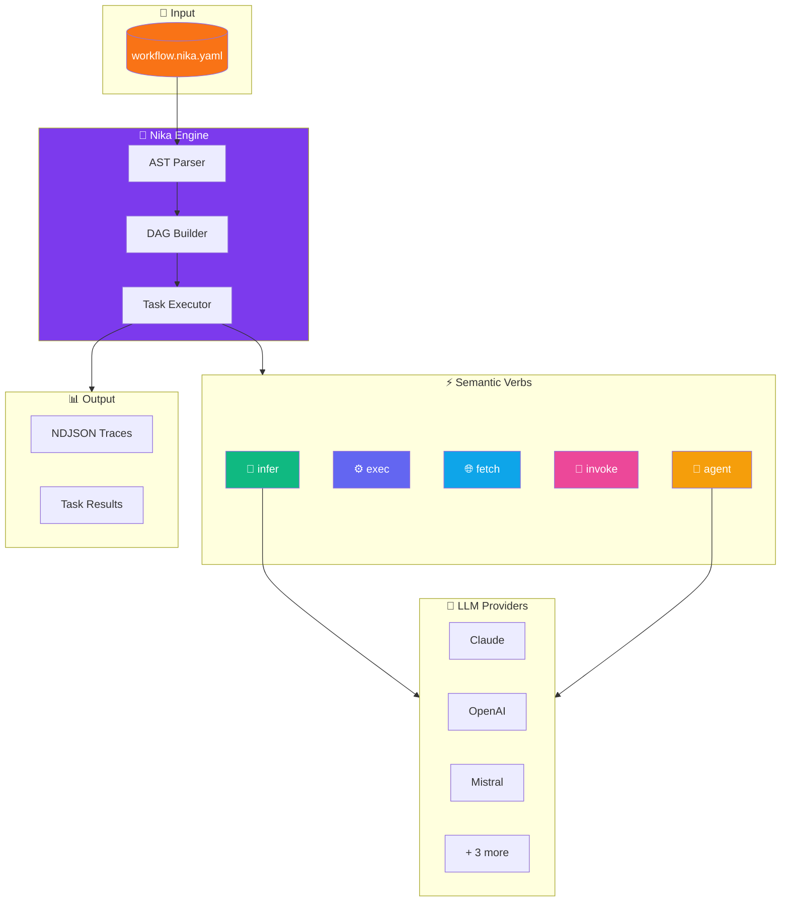
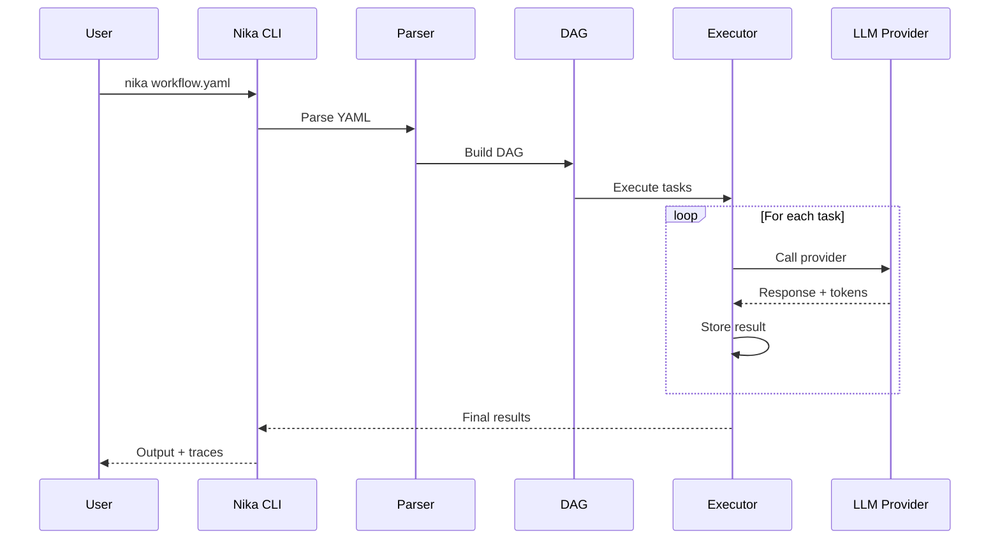
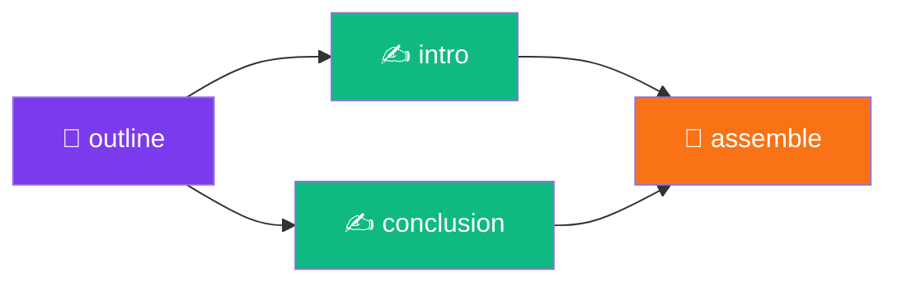

<div align="center">

<!-- Animated Header -->


# 🦋 Nika

### **Native Intelligence Kernel Agent**

<sup>Transform YAML into intelligent workflows</sup>

<!-- Primary Badges -->
[](CHANGELOG.md)
[](https://www.rust-lang.org/)
[](LICENSE)

<!-- GitHub Badges -->
[](https://github.com/supernovae-st/nika/actions)
[](https://github.com/supernovae-st/nika/stargazers)
[](https://github.com/supernovae-st/nika/actions)
[](#-providers)

<!-- Navigation -->
<p>
<a href="#-quick-start">Quick Start</a> •
<a href="#-whats-new-in-v080">What's New</a> •
<a href="#-features">Features</a> •
<a href="#-architecture">Architecture</a> •
<a href="#-examples">Examples</a> •
<a href="#-documentation">Docs</a>
</p>

---

**Nika** executes YAML-defined workflows as **directed acyclic graphs (DAGs)**.<br>
Connect LLMs, shell commands, HTTP APIs, and MCP tools in a single declarative file.

</div>

<br>

<!-- TUI Screenshot as ASCII Art -->
```
┌──────────────────────────────────────────────────────────────────────────────────┐
│  🦋 Nika Studio                                              v0.8.0  ⌘K ?  │
├──────────────────────────────────────────────────────────────────────────────────┤
│ ┌─ Files ────────────┐ ┌─ Editor ─────────────────────────────────────────────┐ │
│ │ 📁 workflows/      │ │  1 │ schema: "nika/workflow@0.8"                     │ │
│ │   📄 deploy.yaml   │ │  2 │ provider: claude                                │ │
│ │   📄 review.yaml   │ │  3 │                                                 │ │
│ │ ▸ 📄 hello.yaml ◀  │ │  4 │ tasks:                                          │ │
│ │   📄 test.yaml     │ │  5 │   - id: greet                                   │ │
│ │                    │ │  6 │     infer: "Say hello in French"                │ │
│ └────────────────────┘ │  7 │                                                 │ │
│ ┌─ DAG Preview ──────┐ │  8 │   - id: format                                  │ │
│ │                    │ │  9 │     use: { msg: greet }                         │ │
│ │   ┌───────┐        │ │ 10 │     exec: "echo '{{use.msg}}' | cowsay"         │ │
│ │   │ greet │        │ └───────────────────────────────────────────────────────┘ │
│ │   └───┬───┘        │ ┌─ Output ─────────────────────────────────────────────┐ │
│ │       │            │ │ ✅ greet completed (1.2s)                             │ │
│ │   ┌───▼───┐        │ │    Bonjour! Comment allez-vous?                      │ │
│ │   │format │        │ │ ⏳ format running...                                  │ │
│ │   └───────┘        │ │                                                       │ │
│ └────────────────────┘ └───────────────────────────────────────────────────────┘ │
├──────────────────────────────────────────────────────────────────────────────────┤
│  Chat[c] Home[h] Studio[s] Monitor[m]  │  claude-sonnet-4  │  2 tasks  │  1.2s  │
└──────────────────────────────────────────────────────────────────────────────────┘
```

<br>

## ✨ What's New in v0.8.0

<table>
<tr>
<td>

**🎨 Studio DX Enhancement**

</td>
<td>

- **Edit History** — Ctrl+Z/Y with intelligent 500ms coalescing
- **Session Persistence** — Auto-save to `.nika/sessions/`
- **Solarized Theme** — Beautiful dark/light modes
- **Config System** — `.nika/config.toml` for preferences

</td>
</tr>
</table>

> 📦 **Upgrade:** `cargo install --git https://github.com/supernovae-st/nika.git --force`

<br>

## 🎯 Why Nika?

<table>
<tr>
<td width="50%">

### ❌ The Problem

```
LLM calls buried in code = untraceable
Custom glue code for each integration
No standard format for AI workflows
Hard to debug multi-step pipelines
```

</td>
<td width="50%">

### ✅ The Solution

```
YAML workflows = version-controlled
5 semantic verbs cover everything
Full observability via NDJSON traces
Native MCP client for tool calling
```

</td>
</tr>
</table>

<br>

## 🚀 Quick Start

### Installation

```bash
# From source (recommended)
cargo install --git https://github.com/supernovae-st/nika.git

# Or clone and build
git clone https://github.com/supernovae-st/nika.git
cd nika && cargo install --path .
```

### Hello World

```yaml
# hello.nika.yaml
schema: "nika/workflow@0.8"
provider: claude

tasks:
  - id: greet
    infer: "Say hello in French, then in Japanese"
```

```bash
export ANTHROPIC_API_KEY=sk-ant-...
nika hello.nika.yaml
```

<details>
<summary>📺 <b>Output</b></summary>

```
✅ Workflow completed in 1.4s

greet:
  Bonjour! 👋

  こんにちは! 🇯🇵
```

</details>

<br>

## 🎨 Features

<div align="center">

| | Feature | Description |
|:---:|:---|:---|
| 🧠 | **5 Semantic Verbs** | `infer` `exec` `fetch` `invoke` `agent` |
| ⚡ | **Parallel DAG** | Automatic dependency resolution & parallel execution |
| 🔄 | **for_each Loops** | Process arrays with configurable concurrency |
| 🔌 | **MCP Native** | Connect to any MCP server (NovaNet, filesystem, etc.) |
| 🤖 | **6 LLM Providers** | Claude, OpenAI, Mistral, Groq, DeepSeek, Ollama |
| 🖥️ | **Studio TUI** | VS Code-like terminal interface |
| ↩️ | **Undo/Redo** | Ctrl+Z/Y with intelligent coalescing |
| 💾 | **Sessions** | Auto-save & restore your work |
| 🎨 | **Themes** | Default, Solarized, Custom |
| 📊 | **Traces** | NDJSON traces for full observability |

</div>

<br>

## 🏗️ Architecture



### Execution Flow



<br>

## 📖 The 5 Verbs

<details open>
<summary><b>🧠 infer</b> — LLM Generation</summary>

```yaml
# Shorthand
- id: haiku
  infer: "Write a haiku about Rust"

# Full options
- id: analyze
  infer:
    prompt: "Analyze this code for bugs"
    provider: openai
    model: gpt-4o
    temperature: 0.7
    max_tokens: 2000
```

</details>

<details>
<summary><b>⚙️ exec</b> — Shell Commands</summary>

```yaml
# Simple command
- id: build
  exec: "cargo build --release"

# With templating
- id: deploy
  use:
    env: staging
  exec:
    command: "kubectl apply -f {{use.env}}.yaml"
    timeout: 60
```

</details>

<details>
<summary><b>🌐 fetch</b> — HTTP Requests</summary>

```yaml
- id: get_users
  fetch:
    url: "https://api.example.com/users"
    method: GET
    headers:
      Authorization: "Bearer {{use.token}}"
  output:
    format: json
```

</details>

<details>
<summary><b>🔌 invoke</b> — MCP Tool Calls</summary>

```yaml
- id: generate_content
  invoke:
    mcp: novanet
    tool: novanet_generate
    params:
      focus_key: "entity:qr-code"
      locale: "fr-FR"
```

</details>

<details>
<summary><b>🤖 agent</b> — Agentic Loops</summary>

```yaml
- id: research
  agent:
    prompt: "Research recent AI papers and summarize findings"
    mcp: [filesystem, web_search]
    max_turns: 10
    thinking: true  # Enable extended thinking
```

</details>

<br>

## 🔮 Providers

<div align="center">

| Provider | Environment Variable | Default Model | Streaming |
|:--------:|:---------------------|:--------------|:---------:|
|  **Claude** | `ANTHROPIC_API_KEY` | `claude-sonnet-4-20250514` | ✅ |
|  **OpenAI** | `OPENAI_API_KEY` | `gpt-4o` | ✅ |
|  **Mistral** | `MISTRAL_API_KEY` | `mistral-large-latest` | ✅ |
| ⚡ **Groq** | `GROQ_API_KEY` | `llama-3.1-70b-versatile` | ✅ |
| 🌊 **DeepSeek** | `DEEPSEEK_API_KEY` | `deepseek-chat` | ✅ |
| 🦙 **Ollama** | `OLLAMA_API_BASE_URL` | `llama3.2` | ✅ |

</div>

**Auto-detection priority:** Claude → OpenAI → Mistral → Groq → DeepSeek → Ollama

<br>

## 💻 Studio TUI

Launch the terminal UI:

```bash
nika              # Home view (browse workflows)
nika chat         # Chat with AI
nika studio       # YAML editor
nika studio file.yaml  # Edit specific file
```

### Keyboard Shortcuts

| Key | Action | | Key | Action |
|:---:|:-------|---|:---:|:-------|
| `Tab` | Switch views | | `Ctrl+Z` | Undo |
| `Ctrl+P` | Fuzzy search | | `Ctrl+Y` | Redo |
| `Ctrl+W` | Close tab | | `Ctrl+S` | Save |
| `?` | Help overlay | | `q` | Quit |

<br>

## 📚 Examples

### 🔍 Code Review Pipeline

```yaml
schema: "nika/workflow@0.8"
provider: claude

tasks:
  - id: get_diff
    exec: "git diff HEAD~1"

  - id: review
    use:
      diff: get_diff
    infer:
      prompt: |
        Review this code diff for:
        1. 🐛 Potential bugs
        2. 🔒 Security issues
        3. ✨ Improvements

        ```diff
        {{use.diff}}
        ```

flows:
  - source: get_diff
    target: review
```

### 🌍 Multi-Locale Generation

```yaml
schema: "nika/workflow@0.8"

tasks:
  - id: translate
    for_each: ["en-US", "fr-FR", "de-DE", "ja-JP", "es-ES"]
    as: locale
    concurrency: 5
    infer:
      prompt: "Write a marketing tagline in {{use.locale}}"
```

### 💎 Diamond DAG Pattern



```yaml
schema: "nika/workflow@0.8"
provider: claude

tasks:
  - id: outline
    infer: "Create blog outline about AI agents"
    output:
      format: json

  - id: write_intro
    use: { title: outline.title }
    infer: "Write engaging intro for: {{use.title}}"

  - id: write_conclusion
    use: { title: outline.title }
    infer: "Write compelling conclusion for: {{use.title}}"

  - id: assemble
    use:
      intro: write_intro
      conclusion: write_conclusion
    exec: |
      echo "{{use.intro}}"
      echo -e "\n---\n"
      echo "{{use.conclusion}}"

flows:
  - source: outline
    target: [write_intro, write_conclusion]
  - source: [write_intro, write_conclusion]
    target: assemble
```

<br>

## 🔌 MCP Integration

Connect Nika to any [Model Context Protocol](https://modelcontextprotocol.io/) server:

```yaml
schema: "nika/workflow@0.8"

mcp:
  novanet:
    command: novanet-mcp
    env:
      NEO4J_URI: bolt://localhost:7687
  filesystem:
    command: npx
    args: ["-y", "@anthropic/mcp-filesystem"]

tasks:
  - id: generate
    invoke:
      mcp: novanet
      tool: novanet_generate
      params:
        entity: "qr-code"
        locale: "fr-FR"
```

<br>

## 📊 Project Stats

<div align="center">

```
╔═══════════════════════════════════════════════════════════════╗
║                      🦋 Nika v0.8.0                           ║
╠═══════════════════════════════════════════════════════════════╣
║  Tests           │  1,902 passing                             ║
║  Clippy          │  0 warnings                                ║
║  Providers       │  6 (Claude, OpenAI, Mistral, Groq...)      ║
║  Verbs           │  5 semantic actions                        ║
║  Schema          │  nika/workflow@0.8                         ║
║  TUI Views       │  4 (Chat, Home, Studio, Monitor)           ║
║  Rust Edition    │  2024                                      ║
╚═══════════════════════════════════════════════════════════════╝
```

</div>

<br>

## ⚡ Powered By

<div align="center">

[](https://github.com/0xPlaygrounds/rig)
[](https://tokio.rs/)
[](https://ratatui.rs/)
[](https://github.com/anthropics/anthropic-cookbook)
[](https://serde.rs/)

</div>

<br>

## 📖 Documentation

| Resource | Description |
|:---------|:------------|
| 📋 [CHANGELOG.md](CHANGELOG.md) | Version history |
| 🏗️ [docs/ARCHITECTURE.md](docs/ARCHITECTURE.md) | System design |
| 🔄 [docs/MIGRATION-v0.8.0.md](docs/MIGRATION-v0.8.0.md) | Upgrade guide |
| 🤖 [tools/nika/CLAUDE.md](tools/nika/CLAUDE.md) | AI context |
| 📁 [examples/](tools/nika/examples/) | Sample workflows |

<br>

## 🤝 Contributing

We welcome contributions! See [CONTRIBUTING.md](CONTRIBUTING.md) for guidelines.

```bash
git clone https://github.com/supernovae-st/nika.git
cd nika

cargo build          # Build
cargo test           # Test (1,902 tests)
cargo clippy         # Lint
cargo run -- --help  # Run
```

<br>

## 📜 License

<div align="center">

**AGPL-3.0** — See [LICENSE](LICENSE) for details.

---

<br>


**[SuperNovae Studio](https://supernovae.studio)**

*Building the future of AI workflows*

<br>

Made with 🦋 and 🦀 Rust

<br>

[](https://github.com/supernovae-st/nika)
[](https://twitter.com/supernovaestudio)

</div>
