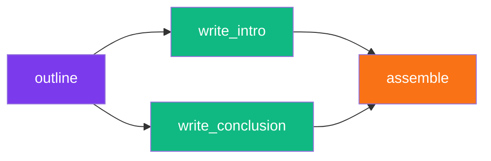

<div align="center">

<!-- Logo & Title -->


# 🦋 Nika

### **Native Intelligence Kernel Agent**

*Transform YAML into intelligent workflows*

<!-- Badges Row 1 -->
[](CHANGELOG.md)
[](https://www.rust-lang.org/)
[](LICENSE)

<!-- Badges Row 2 -->
[](https://github.com/supernovae-st/nika/actions)
[](#providers)
[](#mcp-integration)

<!-- Navigation -->
<p>
<a href="#-quick-start">Quick Start</a> •
<a href="#-features">Features</a> •
<a href="#-architecture">Architecture</a> •
<a href="#-examples">Examples</a> •
<a href="#-documentation">Docs</a>
</p>

---

<br>

<!-- Hero Description -->
**Nika** executes YAML-defined workflows as **directed acyclic graphs (DAGs)**.<br>
Connect LLMs, shell commands, HTTP APIs, and MCP tools in a single declarative file.

<br>

</div>

<!-- Demo GIF placeholder -->
<p align="center">
  
</p>

<br>

## ✨ Why Nika?

<table>
<tr>
<td width="50%">

### 🎯 **The Problem**

```
❌ LLM calls buried in code = untraceable
❌ Custom glue code for each integration
❌ No standard format for AI workflows
❌ Hard to debug multi-step pipelines
```

</td>
<td width="50%">

### 💡 **The Solution**

```
✅ YAML workflows = version-controlled
✅ 5 semantic verbs for everything
✅ Full observability via NDJSON traces
✅ Native MCP client for tool calling
```

</td>
</tr>
</table>

<br>

## 🚀 Quick Start

### Installation

```bash
# From crates.io (coming soon)
cargo install nika

# From source
cargo install --git https://github.com/supernovae-st/nika.git

# Or clone and build
git clone https://github.com/supernovae-st/nika.git
cd nika && cargo install --path tools/nika
```

### Your First Workflow

```yaml
# hello.nika.yaml
schema: "nika/workflow@0.8"
provider: claude

tasks:
  - id: greet
    infer: "Say hello in French, then in Japanese"
```

```bash
export ANTHROPIC_API_KEY=your-key
nika hello.nika.yaml
```

<br>

## 🎨 Features

<div align="center">

| | Feature | Description |
|:---:|:---|:---|
| 🧠 | **5 Semantic Verbs** | `infer` `exec` `fetch` `invoke` `agent` |
| ⚡ | **Parallel DAG Execution** | Automatic dependency resolution |
| 🔄 | **for_each Loops** | Process arrays in parallel |
| 🔌 | **MCP Integration** | Connect to any MCP server |
| 🤖 | **6 LLM Providers** | Claude, OpenAI, Mistral, Groq, DeepSeek, Ollama |
| 🖥️ | **Studio TUI** | VS Code-like terminal interface |
| ↩️ | **Undo/Redo** | Ctrl+Z/Y with intelligent coalescing |
| 💾 | **Session Persistence** | Auto-save your work |
| 🎨 | **Solarized Theme** | Beautiful dark/light modes |

</div>

<br>

## 🏗️ Architecture


<br>

## 📖 The 5 Verbs

<details>
<summary><b>🧠 infer</b> — LLM Generation</summary>

```yaml
# Simple
- id: generate
  infer: "Write a haiku about Rust"

# Full options
- id: analyze
  infer:
    prompt: "Analyze this code for bugs"
    provider: openai
    model: gpt-4o
    temperature: 0.7
```

</details>

<details>
<summary><b>⚙️ exec</b> — Shell Commands</summary>

```yaml
# Simple
- id: build
  exec: "cargo build --release"

# With template
- id: deploy
  use:
    env: staging
  exec:
    command: "kubectl apply -f {{use.env}}.yaml"
```

</details>

<details>
<summary><b>🌐 fetch</b> — HTTP Requests</summary>

```yaml
- id: get_data
  fetch:
    url: "https://api.example.com/users"
    method: GET
    headers:
      Authorization: "Bearer {{use.token}}"
  output:
    format: json
```

</details>

<details>
<summary><b>🔌 invoke</b> — MCP Tool Calls</summary>

```yaml
- id: generate_content
  invoke:
    mcp: novanet
    tool: novanet_generate
    params:
      focus_key: "entity:qr-code"
      locale: "fr-FR"
```

</details>

<details>
<summary><b>🤖 agent</b> — Agentic Loops</summary>

```yaml
- id: research
  agent:
    prompt: "Research and summarize recent AI papers"
    tools:
      - web_search
      - read_file
    max_iterations: 10
```

</details>

<br>

## 🔮 Providers

<div align="center">

| Provider | Environment Variable | Default Model |
|:--------:|:---------------------|:--------------|
|  **Claude** | `ANTHROPIC_API_KEY` | `claude-sonnet-4-20250514` |
|  **OpenAI** | `OPENAI_API_KEY` | `gpt-4o` |
|  **Mistral** | `MISTRAL_API_KEY` | `mistral-large-latest` |
| ⚡ **Groq** | `GROQ_API_KEY` | `llama-3.1-70b-versatile` |
| 🌊 **DeepSeek** | `DEEPSEEK_API_KEY` | `deepseek-chat` |
| 🦙 **Ollama** | `OLLAMA_API_BASE_URL` | `llama3.2` |

</div>

Auto-detection priority: Claude → OpenAI → Mistral → Groq → DeepSeek → Ollama

<br>

## 💻 Studio TUI

Nika includes a powerful terminal UI with VS Code-like features:

```bash
nika              # Launch TUI (Home view)
nika chat         # Chat with AI
nika studio       # YAML editor
```

### Keyboard Shortcuts

| Key | Action |
|:---:|:-------|
| `Tab` | Switch views |
| `Ctrl+Z` | Undo |
| `Ctrl+Y` | Redo |
| `Ctrl+P` | Fuzzy file search |
| `Ctrl+W` | Close tab |
| `?` | Help overlay |

<br>

## 📚 Examples

### 🔍 Code Review Automation

```yaml
schema: "nika/workflow@0.8"
provider: claude

tasks:
  - id: get_diff
    exec: "git diff HEAD~1"

  - id: review
    use:
      diff: get_diff
    infer:
      prompt: |
        Review this code diff for:
        1. 🐛 Potential bugs
        2. 🔒 Security issues
        3. ✨ Improvements

        ```diff
        {{use.diff}}
        ```

flows:
  - source: get_diff
    target: review
```

### 🌍 Multi-Locale Generation

```yaml
schema: "nika/workflow@0.8"

tasks:
  - id: translate
    for_each: ["en-US", "fr-FR", "de-DE", "ja-JP", "es-ES"]
    as: locale
    infer:
      prompt: "Translate 'Hello World' to {{use.locale}}"
```

### 💎 Diamond DAG Pattern



```yaml
schema: "nika/workflow@0.8"
provider: claude

tasks:
  - id: outline
    infer:
      prompt: "Create blog outline about AI"
    output:
      format: json

  - id: write_intro
    use: { title: outline.title }
    infer: "Write intro for: {{use.title}}"

  - id: write_conclusion
    use: { title: outline.title }
    infer: "Write conclusion for: {{use.title}}"

  - id: assemble
    use:
      intro: write_intro
      conclusion: write_conclusion
    exec: |
      echo "{{use.intro}}"
      echo "---"
      echo "{{use.conclusion}}"

flows:
  - source: outline
    target: [write_intro, write_conclusion]
  - source: [write_intro, write_conclusion]
    target: assemble
```

<br>

## 🔌 MCP Integration

Connect Nika to any MCP server:

```yaml
schema: "nika/workflow@0.8"

mcp:
  novanet:
    command: novanet-mcp
    env:
      NEO4J_URI: bolt://localhost:7687

tasks:
  - id: generate
    invoke:
      mcp: novanet
      tool: novanet_generate
      params:
        entity: "qr-code"
        locale: "fr-FR"
```

<br>

## 📊 Project Stats

<div align="center">

```
┌─────────────────────────────────────────────────────┐
│                    Nika v0.8.0                      │
├─────────────────────────────────────────────────────┤
│  Tests         │  1,902 passing                     │
│  Clippy        │  0 warnings                        │
│  Providers     │  6 (Claude, OpenAI, Mistral...)    │
│  Verbs         │  5 semantic actions                │
│  Schema        │  nika/workflow@0.8                 │
│  TUI Views     │  4 (Chat, Home, Studio, Monitor)   │
└─────────────────────────────────────────────────────┘
```

</div>

<br>

## 📖 Documentation

| Resource | Description |
|:---------|:------------|
| [CHANGELOG.md](CHANGELOG.md) | Version history |
| [docs/ARCHITECTURE.md](docs/ARCHITECTURE.md) | System design |
| [docs/MIGRATION-v0.8.0.md](docs/MIGRATION-v0.8.0.md) | Upgrade guide |
| [tools/nika/CLAUDE.md](tools/nika/CLAUDE.md) | AI context |
| [examples/](tools/nika/examples/) | Sample workflows |

<br>

## 🤝 Contributing

We welcome contributions! See [CONTRIBUTING.md](CONTRIBUTING.md) for guidelines.

```bash
# Clone
git clone https://github.com/supernovae-st/nika.git
cd nika

# Build
cargo build

# Test
cargo test

# Run
cargo run -- --help
```

<br>

## 📜 License

<div align="center">

**AGPL-3.0** — See [LICENSE](LICENSE) for details.

---

<br>


**[SuperNovae Studio](https://supernovae.studio)**

*Building the future of AI workflows*

<br>

Made with 🦋 and Rust

[](https://github.com/supernovae-st/nika)
[](https://twitter.com/supernovaestudio)

</div>
