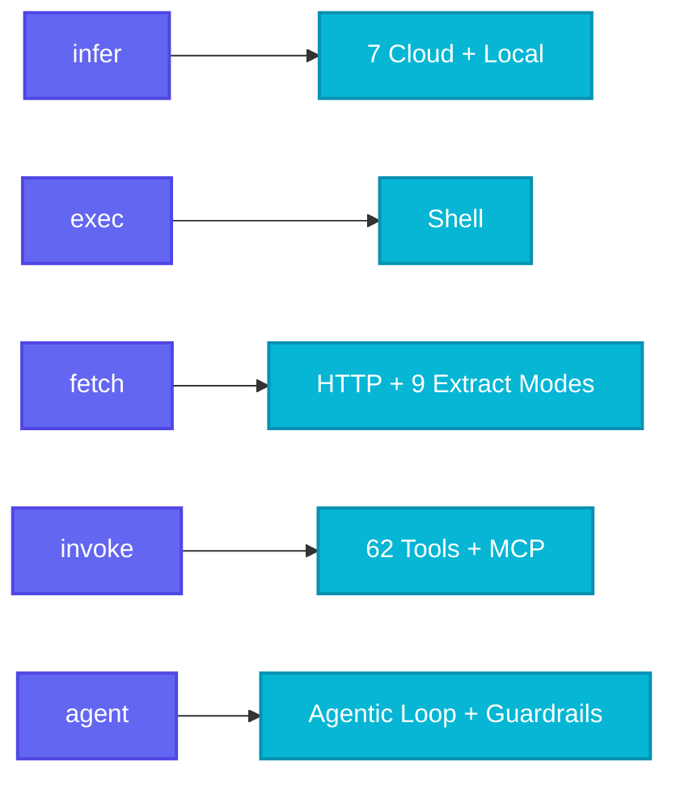
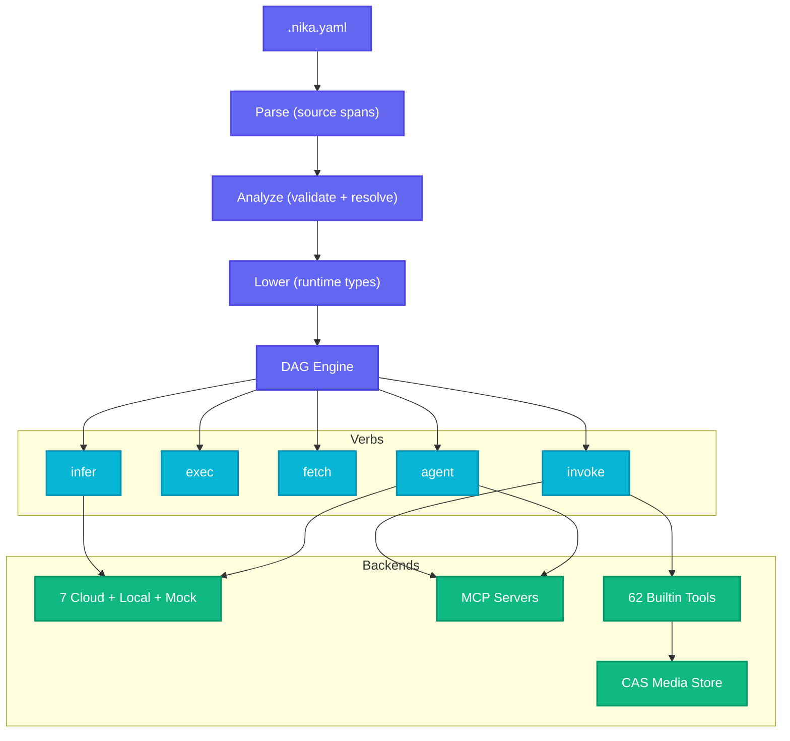

<div align="center">

# Nika

**One file. Any AI.**

The semantic YAML workflow engine that turns plain-text steps into automated AI pipelines.

<br>

[](https://crates.io/crates/nika)
[](https://github.com/supernovae-st/nika/actions/workflows/ci.yml)
[](https://github.com/supernovae-st/nika/actions)
[](https://github.com/supernovae-st/nika/tree/main/tools)
[](LICENSE)
[](https://hub.docker.com/r/supernovae/nika)
[](https://zenodo.org/doi/10.5281/zenodo.19362013)

[Quick Start](#quick-start) · [5 Verbs](#the-5-verbs) · [Examples](#examples) · [Install](#install) · [Docs](#documentation)

</div>

<br>

```yaml
# news.nika.yaml -- Scrape Hacker News and summarize the top stories
schema: "nika/workflow@0.12"
provider: claude                  # or: openai, mistral, groq, gemini, deepseek, xai

tasks:
  - id: scrape
    fetch: { url: "https://news.ycombinator.com", extract: article }

  - id: summarize
    with: { page: $scrape }
    infer: "3-bullet summary of today's top stories: {{with.page}}"
```

```bash
nika run news.nika.yaml
```

---

## What is Nika?

Nika is a workflow engine where each step is a YAML task with exactly **one verb** -- `infer`, `exec`, `fetch`, `invoke`, or `agent`. Write your steps in a `.nika.yaml` file, run `nika run`, and Nika handles the rest: parallel execution, data flow between tasks, retries, structured output, and multi-provider LLM routing.

| | Without Nika | With Nika |
|:---:|---|---|
| **Workflow** | Copy-paste between ChatGPT tabs | Write steps once, run automatically |
| **Scale** | One thing at a time | 50 items in parallel with `for_each` |
| **Providers** | Locked into one vendor at $20/mo | 7 cloud + local + mock, switch in one line |
| **Output** | Pray the LLM returns valid JSON | 5-layer schema validation with auto-repair |
| **Reproducibility** | "It worked last time" | Deterministic DAG, NDJSON traces, event replay |

---

## Quick Start

```bash
# Install (pick one)
brew install supernovae-st/tap/nika      # macOS / Linux
cargo install nika                        # from crates.io
npx @supernovae-st/nika                   # run without installing

# Set up your API key
nika setup

# Run your first workflow
nika run hello.nika.yaml
```

<details>
<summary><strong>hello.nika.yaml</strong></summary>

```yaml
schema: "nika/workflow@0.12"
provider: claude

inputs:
  topic: "butterflies"

tasks:
  - id: haiku
    infer: "Write a haiku about {{inputs.topic}}"
```

</details>

Want more? Scaffold a full project or start the interactive course:

```bash
nika init                   # 5 starter workflows (one per verb)
nika init --course          # 44 hands-on exercises across 12 levels
nika doctor                 # verify your setup
```

---

## The 5 Verbs

Every task uses exactly **one** verb. That is the entire API surface.

| Verb | What it does | Example |
|:-----|:-------------|:--------|
| `infer:` | Call any LLM | `infer: "Summarize this: {{with.text}}"` |
| `exec:` | Run a shell command | `exec: "git log --oneline -5"` |
| `fetch:` | HTTP request + extraction | `fetch: { url: "https://...", extract: markdown }` |
| `invoke:` | Call MCP or builtin tools | `invoke: { tool: nika:thumbnail, params: { width: 800 } }` |
| `agent:` | Multi-turn autonomous loop | `agent: { prompt: "Research...", max_turns: 15 }` |



---

## Examples

### Scrape, summarize, translate -- in parallel

```yaml
schema: "nika/workflow@0.12"
provider: claude

tasks:
  - id: scrape
    fetch: { url: "https://example.com/blog", extract: markdown }

  - id: summarize
    with: { content: $scrape }
    infer: "Summarize in 3 bullets: {{with.content}}"

  - id: translate
    for_each: ["French", "Spanish", "Japanese", "German", "Portuguese"]
    as: lang
    concurrency: 5
    with: { summary: $summarize }
    infer: "Translate to {{with.lang}}: {{with.summary}}"
```

### AI agent with guardrails

```yaml
schema: "nika/workflow@0.12"
provider: claude

tasks:
  - id: research
    agent:
      prompt: "Research the top 5 competitors for our product"
      tools: [nika:read, nika:write, nika:glob]
      max_turns: 15
      guardrails:
        - type: length
          max_words: 2000
      completion:
        mode: explicit
```

### Image processing pipeline

```yaml
schema: "nika/workflow@0.12"
provider: claude

tasks:
  - id: import
    invoke: { tool: nika:import, params: { path: "./photo.jpg" } }

  - id: thumbnail
    with: { img: $import }
    invoke:
      tool: nika:pipeline
      params:
        hash: "{{with.img.hash}}"
        ops:
          - { op: thumbnail, width: 800 }
          - { op: optimize }
          - { op: convert, format: webp }

  - id: describe
    with: { img: $import }
    infer:
      content:
        - type: image
          source: "{{with.img.hash}}"
        - type: text
          text: "Write an alt-text description for this image"
```

### Multi-provider fan-out

```yaml
schema: "nika/workflow@0.12"

tasks:
  - id: claude_take
    provider: anthropic
    infer: "Analyze this trend: {{inputs.topic}}"

  - id: gpt_take
    provider: openai
    model: gpt-4o
    infer: "Analyze this trend: {{inputs.topic}}"

  - id: gemini_take
    provider: gemini
    model: gemini-2.5-flash
    infer: "Analyze this trend: {{inputs.topic}}"

  - id: synthesize
    depends_on: [claude_take, gpt_take, gemini_take]
    with:
      claude: $claude_take
      gpt: $gpt_take
      gemini: $gemini_take
    infer: "Synthesize these 3 perspectives: {{with.claude}} / {{with.gpt}} / {{with.gemini}}"
```

---

## Key Features

### Providers -- 7 cloud + local + mock

Switch providers in one line. Same workflow, any AI.

| Provider | Models |
|:---------|:-------|
| **Anthropic** | claude-opus-4, claude-sonnet-4, claude-haiku-4.5 |
| **OpenAI** | gpt-4o, gpt-4.1, o3, o4-mini |
| **Gemini** | gemini-2.5-pro, gemini-2.5-flash |
| **Mistral** | mistral-large-latest, mistral-small-latest |
| **Groq** | llama-3.3-70b-versatile, mixtral-8x7b |
| **DeepSeek** | deepseek-chat, deepseek-reasoner |
| **xAI** | grok-3 |
| **Native** | Any GGUF model locally via [mistral.rs](https://github.com/EricLBuehler/mistral.rs) |
| **Mock** | Deterministic test responses -- no API calls, no keys |

You can also connect to any **OpenAI-compatible** endpoint (vLLM, Ollama, LiteLLM, SGLang) via config or inline `base_url:`.

### Structured Output -- 5-layer defense

Get guaranteed schema-valid JSON from any provider. No prompt hacking required.

```yaml
- id: extract
  infer: "Tell me about Alice, 30, Rust and Python developer"
  structured:
    schema:
      type: object
      required: [name, age, skills]
      properties:
        name: { type: string }
        age: { type: number, minimum: 0 }
        skills: { type: array, items: { type: string }, minItems: 1 }
    enable_repair: true
    max_retries: 3
```

| Layer | Strategy |
|:------|:---------|
| L0 | Provider-native tool/schema enforcement |
| L2 | Extract + validate JSON from response |
| L3 | Retry with error feedback |
| L4 | LLM repair call (last resort) |

### Data Flow -- bindings, transforms, parallel loops

```yaml
tasks:
  - id: fetch_data
    fetch: { url: "https://api.example.com/users" }

  - id: process
    with:
      users: $fetch_data                     # bind upstream output
      name: $fetch_data.data[0].name         # JSONPath access
      safe: $fetch_data.name ?? "Unknown"    # default fallback
    infer: "First user: {{with.name | upper | trim}}"
```

**39 pipe transforms**: `upper`, `lower`, `trim`, `join(",")`, `split(",")`, `sort`, `unique`, `flatten`, `first`, `last`, `length`, `to_json`, `parse_json`, `default("x")`, `shell`, `pluck(field)`, `where(field, val)`, `sort_by(field)`, `pick(f1,f2)`, `omit(f1,f2)`, `regex(pattern)`, and more.

**Parallel loops** with `for_each` + `concurrency`:

```yaml
- id: translate
  for_each: ["en", "fr", "ja", "de", "ko"]
  as: locale
  concurrency: 5
  infer: "Translate to {{with.locale}}: {{with.text}}"
```

### 62 Builtin Tools

All accessible via `invoke: nika:*` -- no external dependencies.

<details>
<summary><strong>Media tools</strong> -- import, resize, convert, optimize, metadata, charts, QR, C2PA</summary>

| Tool | Purpose |
|:-----|:--------|
| `nika:import` | Import any file into CAS |
| `nika:decode` | Base64 string → CAS store |
| `nika:thumbnail` | SIMD-accelerated resize (Lanczos3) |
| `nika:convert` | Format conversion (PNG/JPEG/WebP) |
| `nika:optimize` | Lossless PNG optimization (oxipng) |
| `nika:pipeline` | Chain operations in-memory |
| `nika:metadata` | Universal EXIF/audio/video metadata |
| `nika:dimensions` | Image dimensions (~0.1ms) |
| `nika:thumbhash` | 25-byte compact placeholder |
| `nika:dominant_color` | Color palette extraction |
| `nika:strip` | Remove EXIF metadata |
| `nika:svg_render` | SVG to PNG (resvg) |
| `nika:phash` | Perceptual image hashing |
| `nika:compare` | Visual similarity comparison |
| `nika:pdf_extract` | PDF text extraction |
| `nika:chart` | Bar/line/pie charts from JSON |
| `nika:provenance` | C2PA content credentials |
| `nika:verify` | C2PA verification + EU AI Act |
| `nika:qr_validate` | QR decode + quality score |
| `nika:quality` | Image quality (DSSIM/SSIM) |

</details>

<details>
<summary><strong>Web extraction tools</strong> -- HTML to Markdown, CSS selectors, metadata, links, readability</summary>

| Tool | Purpose |
|:-----|:--------|
| `nika:html_to_md` | HTML to clean Markdown |
| `nika:css_select` | CSS selector extraction |
| `nika:extract_metadata` | OG, Twitter Cards, JSON-LD |
| `nika:extract_links` | Rich link classification |
| `nika:readability` | Article content extraction |

</details>

<details>
<summary><strong>File & core tools</strong> -- read, write, edit, glob, grep, sleep, log, assert, jq</summary>

| Tool | Purpose |
|:-----|:--------|
| `nika:read` | Read file contents |
| `nika:write` | Write file (with overwrite mode) |
| `nika:edit` | Edit file in place |
| `nika:glob` | Pattern-match files |
| `nika:grep` | Search file contents |
| `nika:jq` | JQ expressions on JSON |
| `nika:sleep` | Delay execution |
| `nika:log` | Emit log messages |
| `nika:emit` | Emit custom events |
| `nika:assert` | Runtime assertions |
| `nika:run` | Run sub-workflows |
| `nika:complete` | Signal agent completion |

</details>

### MCP Integration

Nika is an MCP-native client. Connect to any [Model Context Protocol](https://modelcontextprotocol.io/) server. 100+ server aliases built in.

```yaml
mcp:
  web_search:
    command: npx
    args: ["-y", "@anthropic/mcp-web-search"]

tasks:
  - id: search
    invoke: { mcp: web_search, tool: search, params: { query: "..." } }

  - id: agent_task
    agent:
      prompt: "Research this topic thoroughly"
      mcp: [web_search]
      max_turns: 10
```

### `nika serve` -- HTTP API

Expose any workflow as a REST endpoint. SDKs for Rust, Node.js, and Python.

```bash
nika serve --port 3000
```

```bash
curl -X POST http://localhost:3000/v1/jobs \
  -H "Content-Type: application/json" \
  -d '{"workflow": "news.nika.yaml", "inputs": {"topic": "AI"}}'
```

### Terminal UI

Three views: **Studio** (editor + DAG), **Command** (chat + execution), **Control** (settings).

```
+-----------------------------------------------------------------------+
| Nika Studio                                              v0.65.1      |
|-----------------------------------------------------------------------|
| +- Files --------+ +- Editor ------------------------------------+   |
| | > workflows/   | |  1 | schema: "nika/workflow@0.12"           |   |
| |   deploy.nika  | |  2 | provider: claude                       |   |
| |   review.nika  | |  3 | tasks:                                 |   |
| +- DAG ----------+ |  4 |   - id: research                       |   |
| | [research]--+  | |  5 |     agent:                             |   |
| |      |      |  | |  6 |       prompt: "Find AI papers"         |   |
| | [analyze] [e]  | +--------------------------------------------+   |
| |      |      |  |                                                    |
| | [  report   ]  | Tree-sitter highlighting | LSP | Git gutter       |
| +----------------+ Vi/Emacs modes | Fuzzy search | Undo/redo         |
+-----------------------------------------------------------------------+
| [1/s] Studio  [2/c] Command  [3/x] Control                           |
+-----------------------------------------------------------------------+
```

### Language Server

Full LSP with 16 capabilities: completion (verbs, fields, providers, models, task refs), hover, go-to-definition, diagnostics, semantic tokens, code actions, inlay hints, CodeLens, rename, formatting, and more.

```bash
cargo install nika-lsp                                # standalone
code --install-extension supernovae.nika-lang         # VS Code
```

### Interactive Course

12 levels. 44 exercises. From shell commands to full AI orchestration.

```bash
nika init --course
nika course next
nika course hint
```

| Level | Name | What You Learn |
|:------|:-----|:---------------|
| 01 | Jailbreak | exec, fetch, infer -- the 3 core verbs |
| 02 | Hot Wire | Data bindings, transforms, templates |
| 03 | Fork Bomb | DAG patterns, parallel execution |
| 04 | Root Access | Context files, imports, inputs |
| 05 | Shapeshifter | Structured output, JSON Schema |
| 06 | Pay-Per-Dream | Multi-provider, native models, cost control |
| 07 | Swiss Knife | Builtin tools, file operations |
| 08 | Gone Rogue | Autonomous agents, skills, guardrails |
| 09 | Data Heist | Web scraping, 9 extraction modes |
| 10 | Open Protocol | MCP integration |
| 11 | Pixel Pirate | Media pipeline, vision |
| 12 | SuperNovae | Boss battle -- everything combined |

---

## Architecture



**Three-phase AST** (inspired by rustc): Raw (parse with source spans) --> Analyzed (validate, resolve bindings) --> Lowered (concrete runtime types). The immutable DAG is built from petgraph for safe concurrent execution.

**17 workspace crates:**

```
tools/
  nika/             CLI entry point                    cargo install nika
  nika-engine/      Embeddable runtime (135k LOC)      cargo add nika-engine
  nika-core/        AST, types, catalogs               zero I/O
  nika-event/       EventLog, TraceWriter
  nika-mcp/         MCP client (rmcp)
  nika-media/       CAS store, media processor
  nika-daemon/      Background daemon
  nika-init/        Project scaffolding + course
  nika-cli/         CLI subcommands
  nika-tui/         Terminal UI (ratatui)
  nika-lsp-core/    Protocol-agnostic LSP
  nika-lsp/         Standalone LSP binary
  nika-serve/       HTTP server
  nika-sdk/         Rust SDK
  nika-napi/        Node.js bindings (N-API)
  nika-py/          Python bindings
  nika-storage/     Storage abstraction
```

---

## Install

| Method | Command |
|:-------|:--------|
| **Homebrew** | `brew install supernovae-st/tap/nika` |
| **Cargo** | `cargo install nika` |
| **npm** | `npm install -g @supernovae-st/nika` |
| **npx** | `npx @supernovae-st/nika` |
| **Docker** | `docker run --rm -v "$(pwd)":/work supernovae/nika run /work/flow.nika.yaml` |
| **Source** | `git clone https://github.com/supernovae-st/nika && cargo install --path nika/tools/nika` |

```bash
nika --version       # nika 0.65.1
nika doctor          # full system health check
```

<details>
<summary><strong>Feature flags</strong></summary>

| Feature | Default | Description |
|:--------|:--------|:------------|
| `tui` | yes | Terminal UI (ratatui, tree-sitter, git2) |
| `native-inference` | yes | Local GGUF models via mistral.rs |
| `media-core` | yes | Tier 2 media tools |
| `media-phash` | yes | Perceptual hashing |
| `media-pdf` | yes | PDF text extraction |
| `media-chart` | yes | Chart generation |
| `media-qr` | yes | QR code validation |
| `media-iqa` | yes | Image quality assessment |
| `media-provenance` | no | C2PA signing + verification |
| `fetch-extract` | yes | HTML extraction |
| `fetch-markdown` | yes | HTML to Markdown |
| `fetch-article` | yes | Article extraction |
| `fetch-feed` | yes | RSS/Atom/JSON Feed |
| `lsp` | no | Standalone LSP binary |

```bash
# Minimal build
cargo install --path tools/nika --no-default-features

# Custom features
cargo install --path tools/nika --features "tui,native-inference,media-core"
```

</details>

---

## Documentation

| Resource | Description |
|:---------|:------------|
| [User Guide](https://docs.supernovae.studio/nika) | Getting started, verbs, data flow, providers |
| [Interactive Course](https://docs.supernovae.studio/nika/course) | 12 levels, 44 exercises |
| [Manifesto](MANIFESTO.md) | Why AI should be free |
| [Contributing](CONTRIBUTING.md) | Build, test, conventions |
| [Citation](CITATION.cff) | Academic citation (Zenodo DOI) |

### CLI at a glance

```bash
nika run flow.nika.yaml          # execute workflow
nika check flow.nika.yaml       # validate without executing
nika ui                          # TUI
nika chat                        # direct chat mode
nika serve --port 3000           # HTTP API
nika init                        # scaffold project
nika init --course               # interactive course
nika course next                 # next exercise
nika provider list               # API key status
nika model list                  # local models
nika mcp list                    # MCP servers
nika doctor                      # system health
nika showcase list               # browse 115 example workflows
```

---

## Contributing

```bash
git clone https://github.com/supernovae-st/nika.git
cd nika
cargo build                       # build all 17 crates
cargo test --workspace --lib      # 9,930+ tests (safe, no keychain popups)
cargo clippy -- -D warnings       # zero warnings policy
```

> **Note:** `cargo test` without `--lib` runs contract tests that trigger macOS Keychain popups. Always use `--lib`.

See [CONTRIBUTING.md](CONTRIBUTING.md) for full guidelines.

---

## License

[AGPL-3.0-or-later](LICENSE) -- Nika is free software. Use it, study it, share it, improve it.

Read the [Manifesto](MANIFESTO.md) to understand why.

---

<div align="center">

**Nika v0.68.0** · Schema `nika/workflow@0.12` · Rust 1.86+ · 18 crates · 9,800+ tests

[SuperNovae Studio](https://supernovae.studio) · [QR Code AI](https://qrcode-ai.com) · [GitHub](https://github.com/supernovae-st/nika)

**Liberate your AI.** 🦋

</div>
