<div align="center">

<!-- Animated Header with Butterfly Logo -->
<picture>
  <source media="(prefers-color-scheme: dark)" srcset="https://raw.githubusercontent.com/supernovae-st/nika/main/assets/nika-logo-dark.svg">
  <source media="(prefers-color-scheme: light)" srcset="https://raw.githubusercontent.com/supernovae-st/nika/main/assets/nika-logo.svg">
  
</picture>

# Nika

### Open-Source Agentic CLI

<sup>Transform YAML into intelligent AI workflows</sup>

<!-- Primary Badges -->
[](CHANGELOG.md)
[](https://www.rust-lang.org/)
[](LICENSE)
[](https://nika.sh)

<!-- GitHub Badges -->
[](https://github.com/supernovae-st/nika/actions)
[](https://github.com/supernovae-st/nika/stargazers)
[](https://github.com/supernovae-st/nika/actions)
[](https://github.com/supernovae-st/nika)

<!-- Feature Badges -->
[](#-providers)
[](#-studio-tui)
[](#-chat-dag-widgets)

<!-- Navigation -->
<p>
<a href="#-quick-start">Quick Start</a> &bull;
<a href="#-the-5-verbs">5 Verbs</a> &bull;
<a href="#-chat-dag-widgets">Chat DAG</a> &bull;
<a href="#-studio-tui">Studio TUI</a> &bull;
<a href="#-providers">Providers</a> &bull;
<a href="#-examples">Examples</a> &bull;
<a href="#-documentation">Docs</a>
</p>

---

**Nika** executes YAML-defined workflows as **directed acyclic graphs (DAGs)**.<br>
Connect LLMs, shell commands, HTTP APIs, and MCP tools in a single declarative file.

</div>

<br>

<!-- TUI Screenshot as ASCII Art -->
```
+-------------------------------------------------------------------------------------+
|  Nika Studio                                               v0.12.0  Ctrl+K ?   |
+-------------------------------------------------------------------------------------+
| +- Files ---------------+ +- Editor ------------------------------------------------+ |
| | > workflows/          | |  1 | schema: "nika/workflow@0.12"                      | |
| |     deploy.nika.yaml  | |  2 | provider: claude                                  | |
| |   > review.nika.yaml  | |  3 |                                                   | |
| |     test.nika.yaml    | |  4 | tasks:                                            | |
| +- DAG ------------------| |  5 |   - id: research                                 | |
| |                       | |  6 |     agent:                                        | |
| |  [research] ----+     | |  7 |       prompt: "Find AI papers"                    | |
| |        |        |     | |  8 |       mcp: [web_search]                           | |
| |   [analyze]  [eval]   | |  9 |                                                   | |
| |        |        |     | | 10 |   - id: analyze                                   | |
| |     [report]<--+      | | 11 |     use: { papers: @1 }                           | |
| +-----------------------+ +-----------------------------------------------------------+ |
| +- Chat DAG ---------------------------------------------------------------------+ |
| | @1 research --> @2 analyze --> @4 report                                       | |
| |       \                                                                        | |
| |        `-----> @3 evaluate ---'                                                | |
| +--------------------------------------------------------------------------------+ |
+-------------------------------------------------------------------------------------+
|  [a]Chat  [h]Home  [s]Studio  [m]Monitor  [,]Settings  [?]Help  |  claude  |  4 tasks |
+-------------------------------------------------------------------------------------+
```

<br>

## What's New in v0.12.0

<table>
<tr>
<td width="50%">

**Chat-as-DAG Architecture**

- **@mention Bindings** &mdash; Reference messages with `@1`, `@last`, `@all`
- **StableGraph** &mdash; Stable NodeIndex preserved after deletion
- **ChatWorkflow** &mdash; Thread-safe DAG wrapper for messages
- **4 Chat DAG Widgets** &mdash; Visual DAG in terminal

</td>
<td width="50%">

**6-Views TUI**

- **Settings View** &mdash; Provider config, themes, preferences
- **Help View** &mdash; Keyboard shortcuts, documentation
- **MonitorView** &mdash; Real-time execution monitoring
- **6 Builtin Tools** &mdash; `nika:sleep`, `nika:log`, `nika:assert`...

</td>
</tr>
</table>

> **Upgrade:** `cargo install --git https://github.com/supernovae-st/nika.git --force`

<br>

## Why Nika?

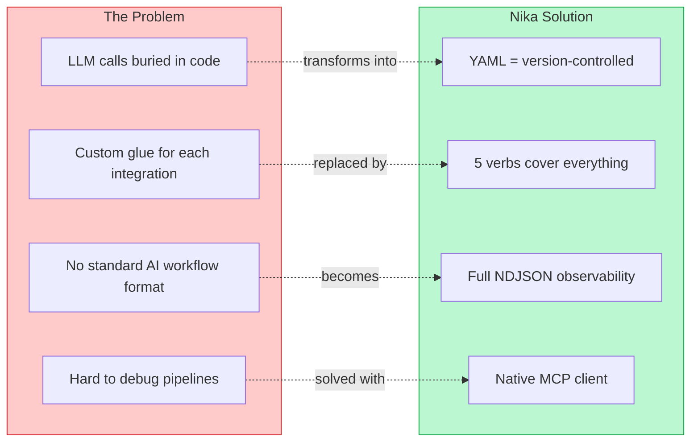

<br>

### How Nika Compares

<div align="center">

| | **Nika** | LangChain | Prefect | Temporal |
|:---|:---:|:---:|:---:|:---:|
| **Config Format** | YAML | Python | Python | Code |
| **Learning Curve** | 5 min | Hours | Hours | Days |
| **LLM Native** | Built-in | Core | Add-on | Add-on |
| **MCP Support** | Native | No | No | No |
| **Observability** | NDJSON | LangSmith | UI | UI |
| **Self-hosted** | Single Binary | Yes | Cloud | Cloud |
| **Dependencies** | 0 | Many | Many | Many |
| **Chat-as-DAG** | Native | No | No | No |

</div>

> **TL;DR:** Nika = single binary, YAML config, LLM-first, zero dependencies.

<br>

## Quick Start

### Installation

```bash
# From source (recommended)
cargo install --git https://github.com/supernovae-st/nika.git

# Or clone and build
git clone https://github.com/supernovae-st/nika.git
cd nika && cargo install --path tools/nika
```

### Hello World

```yaml
# hello.nika.yaml
schema: "nika/workflow@0.12"
provider: claude

tasks:
  - id: greet
    infer: "Say hello in French, then in Japanese"
```

```bash
export ANTHROPIC_API_KEY=sk-ant-...
nika hello.nika.yaml
```

<details>
<summary><b>Output</b></summary>

```
Workflow completed in 1.4s

greet:
  Bonjour!

  konnichiha!
```

</details>

<br>

## Architecture

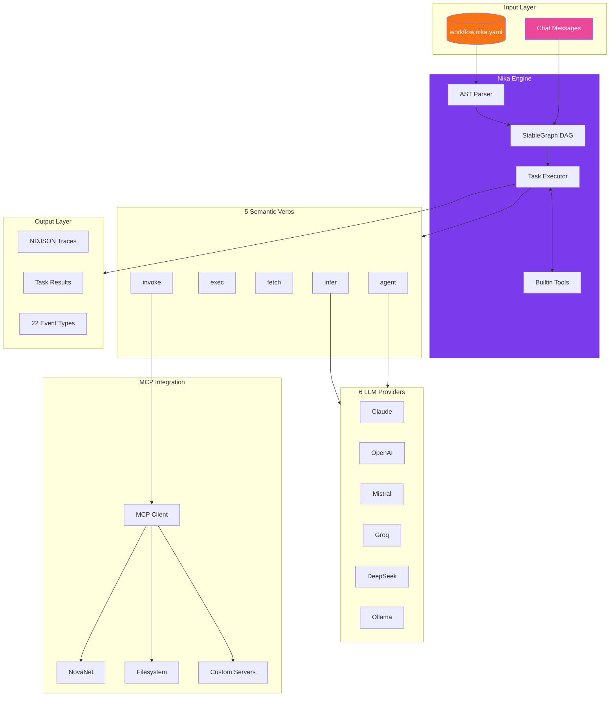

### Module Architecture

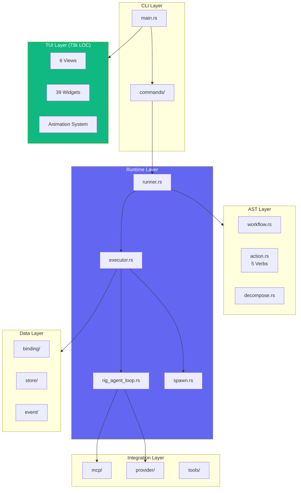

<br>

## The 5 Verbs

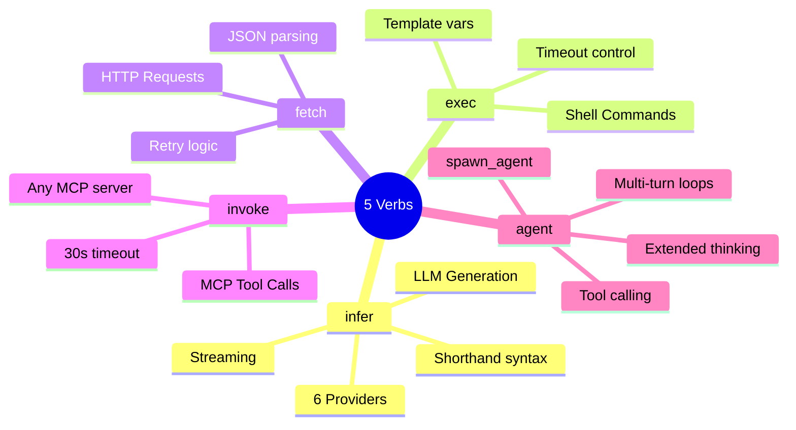

<details open>
<summary><b>infer</b> &mdash; LLM Generation</summary>

```yaml
# Shorthand (v0.5.1+)
- id: haiku
  infer: "Write a haiku about Rust"

# Full options
- id: analyze
  infer:
    prompt: "Analyze this code for bugs"
    provider: openai
    model: gpt-4o
    temperature: 0.7
    max_tokens: 2000
```

</details>

<details>
<summary><b>exec</b> &mdash; Shell Commands</summary>

```yaml
# Simple command
- id: build
  exec: "cargo build --release"

# With templating
- id: deploy
  use:
    env: staging
  exec:
    command: "kubectl apply -f {{use.env}}.yaml"
    timeout: 60
```

</details>

<details>
<summary><b>fetch</b> &mdash; HTTP Requests</summary>

```yaml
- id: get_users
  fetch:
    url: "https://api.example.com/users"
    method: GET
    headers:
      Authorization: "Bearer {{use.token}}"
  output:
    format: json
```

</details>

<details>
<summary><b>invoke</b> &mdash; MCP Tool Calls</summary>

```yaml
- id: generate_content
  invoke:
    mcp: novanet
    tool: novanet_generate
    params:
      focus_key: "entity:qr-code"
      locale: "fr-FR"
```

</details>

<details>
<summary><b>agent</b> &mdash; Agentic Loops</summary>

```yaml
- id: research
  agent:
    prompt: "Research recent AI papers and summarize findings"
    mcp: [filesystem, web_search]
    max_turns: 10
    thinking: true  # Extended thinking (Claude)
    depth_limit: 3  # Nested agent protection
```

</details>

<br>

## Chat DAG Widgets

<sup>New in v0.10+</sup>

Nika v0.10 introduces **Chat-as-DAG** architecture where every chat message is a DAG node with stable references.

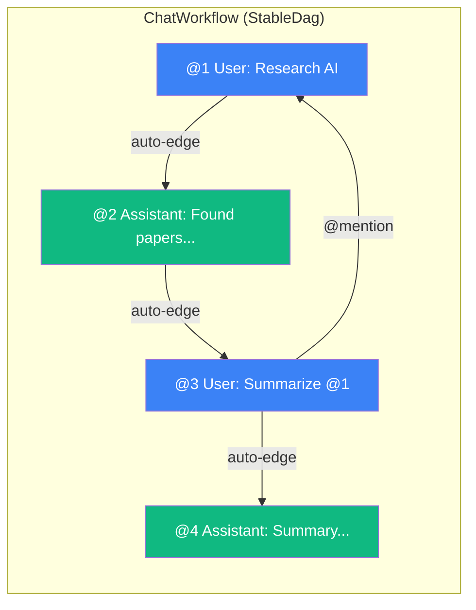

### @mention Binding System

Reference previous messages in your chat:

| Syntax | Description | Example |
|:-------|:------------|:--------|
| `@N` | Reference message N | `Analyze @1` |
| `@last` | Previous message | `Continue @last` |
| `@all` | All messages | `Summarize @all` |
| `@N..M` | Range of messages | `Compare @1..3` |
| `//` | Parallel marker | `@1 // @2` (parallel edges) |

### Widget Components

| Widget | Purpose | Features |
|:-------|:--------|:---------|
| **ChatNodeBox** | Message as DAG node | 4 kinds, 4 states |
| **ChatEdgeLine** | @N reference edges | Bezier curves |
| **ChatTaskQueue** | Task execution queue | 5-verb icons |
| **ChatDagPanel** | Full DAG visualization | Nodes + edges combined |

<br>

## Builtin Tools

<sup>New in v0.9.3</sup>

6 `nika:*` prefixed tools for workflow control:

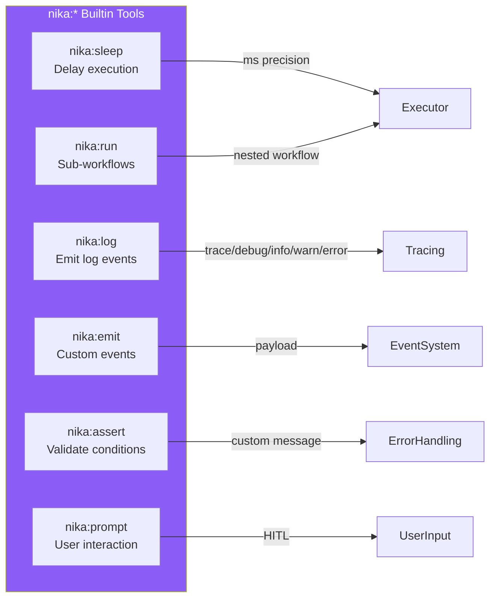

```yaml
# Example: Using builtin tools in agent
- id: careful_agent
  agent:
    prompt: "Process data carefully"
    tools:
      - nika:log     # Emit debug logs
      - nika:assert  # Validate assumptions
      - nika:sleep   # Rate limiting
```

<br>

## Studio TUI

Launch the terminal UI with 6 views:

```bash
nika              # Home view (browse workflows)
nika chat         # Chat with AI
nika studio       # YAML editor
nika studio file.yaml  # Edit specific file
```

### 6-Views Architecture

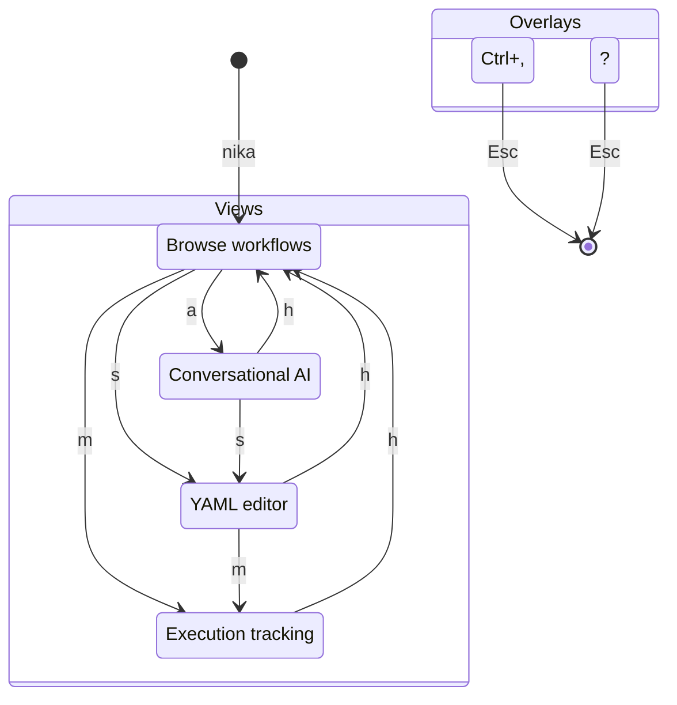

| Key | View | Description |
|:---:|:-----|:------------|
| `a` | **Chat** | Conversational AI agent with 5-verb commands |
| `h` | **Home** | Browse and launch `.nika.yaml` workflows |
| `s` | **Studio** | VS Code-like YAML editor with validation |
| `m` | **Monitor** | Real-time execution with 4-panel display |
| `,` | **Settings** | Provider config, themes, preferences |
| `?` | **Help** | Keyboard shortcuts, documentation |

### Keyboard Shortcuts

| Key | Action | | Key | Action |
|:---:|:-------|---|:---:|:-------|
| `Tab` | Switch views | | `Ctrl+Z` | Undo |
| `Ctrl+P` | Fuzzy search | | `Ctrl+Y` | Redo |
| `Ctrl+W` | Close tab | | `Ctrl+S` | Save |
| `Alt+`/`Alt+` | Navigate tabs | | `q` | Quit |

<br>

## Providers

<div align="center">

| Provider | Environment Variable | Default Model | Streaming | Thinking |
|:--------:|:---------------------|:--------------|:---------:|:--------:|
| **Claude** | `ANTHROPIC_API_KEY` | `claude-sonnet-4-20250514` | | |
| **OpenAI** | `OPENAI_API_KEY` | `gpt-4o` | | - |
| **Mistral** | `MISTRAL_API_KEY` | `mistral-large-latest` | | - |
| **Groq** | `GROQ_API_KEY` | `llama-3.3-70b-versatile` | | - |
| **DeepSeek** | `DEEPSEEK_API_KEY` | `deepseek-chat` | | - |
| **Ollama** | `OLLAMA_API_BASE_URL` | `llama3.2` | | - |

</div>

**Auto-detection priority:** Claude &rarr; OpenAI &rarr; Mistral &rarr; Groq &rarr; DeepSeek &rarr; Ollama

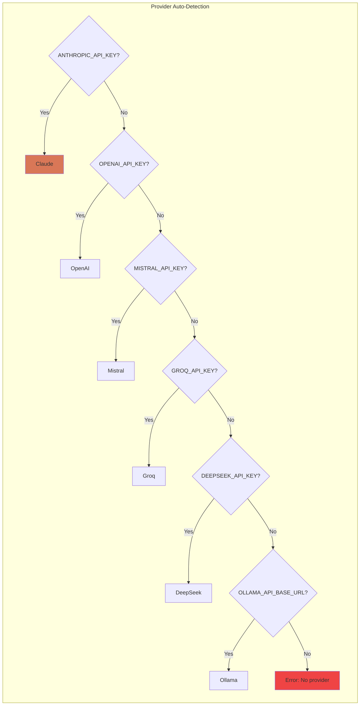

<br>

## Examples

### Code Review Pipeline

```yaml
schema: "nika/workflow@0.12"
provider: claude

tasks:
  - id: get_diff
    exec: "git diff HEAD~1"

  - id: review
    use:
      diff: get_diff
    infer:
      prompt: |
        Review this code diff for:
        1. Potential bugs
        2. Security issues
        3. Improvements

        ```diff
        {{use.diff}}
        ```

flows:
  - source: get_diff
    target: review
```

### Multi-Locale Generation with for_each

```yaml
schema: "nika/workflow@0.12"

tasks:
  - id: translate
    for_each: ["en-US", "fr-FR", "de-DE", "ja-JP", "es-ES"]
    as: locale
    concurrency: 5
    infer:
      prompt: "Write a marketing tagline in {{use.locale}}"
```

### Diamond DAG Pattern

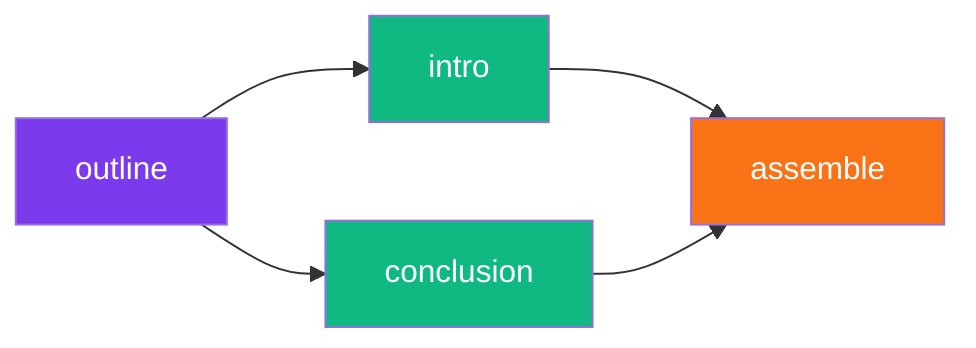

```yaml
schema: "nika/workflow@0.12"
provider: claude

tasks:
  - id: outline
    infer: "Create blog outline about AI agents"
    output:
      format: json

  - id: write_intro
    use: { title: outline.title }
    infer: "Write engaging intro for: {{use.title}}"

  - id: write_conclusion
    use: { title: outline.title }
    infer: "Write compelling conclusion for: {{use.title}}"

  - id: assemble
    use:
      intro: write_intro
      conclusion: write_conclusion
    exec: |
      echo "{{use.intro}}"
      echo -e "\n---\n"
      echo "{{use.conclusion}}"

flows:
  - source: outline
    target: [write_intro, write_conclusion]
  - source: [write_intro, write_conclusion]
    target: assemble
```

### Multi-Agent Research with spawn_agent

```yaml
schema: "nika/workflow@0.12"
provider: claude

tasks:
  - id: orchestrator
    agent:
      prompt: |
        Research AI safety papers from 2024.
        For each paper found, spawn a sub-agent to summarize it.
        Compile findings into a comprehensive report.
      mcp: [web_search, filesystem]
      max_turns: 15
      depth_limit: 3  # Allows nested agents up to depth 3
      thinking: true
```

<br>

## MCP Integration

Connect Nika to any [Model Context Protocol](https://modelcontextprotocol.io/) server:

```yaml
schema: "nika/workflow@0.12"

mcp:
  novanet:
    command: novanet-mcp
    env:
      NEO4J_URI: bolt://localhost:7687
  filesystem:
    command: npx
    args: ["-y", "@anthropic/mcp-filesystem"]
  web_search:
    command: npx
    args: ["-y", "@anthropic/mcp-web-search"]

tasks:
  - id: generate
    invoke:
      mcp: novanet
      tool: novanet_generate
      params:
        entity: "qr-code"
        locale: "fr-FR"
```

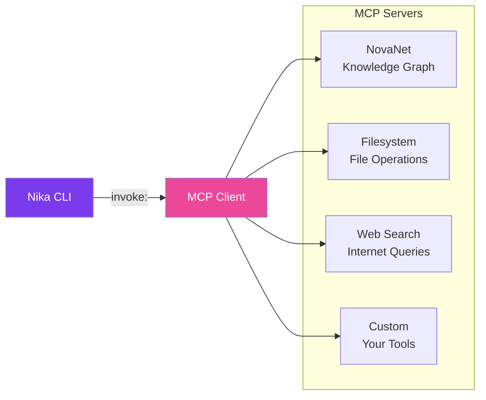

<br>

## Project Stats

<div align="center">

```
+===================================================================+
|                       Nika v0.12.0                                |
+===================================================================+
|  Tests           |  2,720+ passing                                |
|  Lines of Code   |  106,000+ LOC                                  |
|  Clippy          |  0 warnings                                    |
|  Providers       |  6 (Claude, OpenAI, Mistral, Groq...)          |
|  Verbs           |  5 semantic actions                            |
|  Builtin Tools   |  6 nika:* tools                                |
|  TUI Views       |  6 (Chat, Home, Studio, Monitor...)            |
|  TUI Widgets     |  39 widgets                                    |
|  Event Types     |  22 event variants                             |
|  Rust Edition    |  2021                                          |
+===================================================================+
```

</div>

### Test Distribution

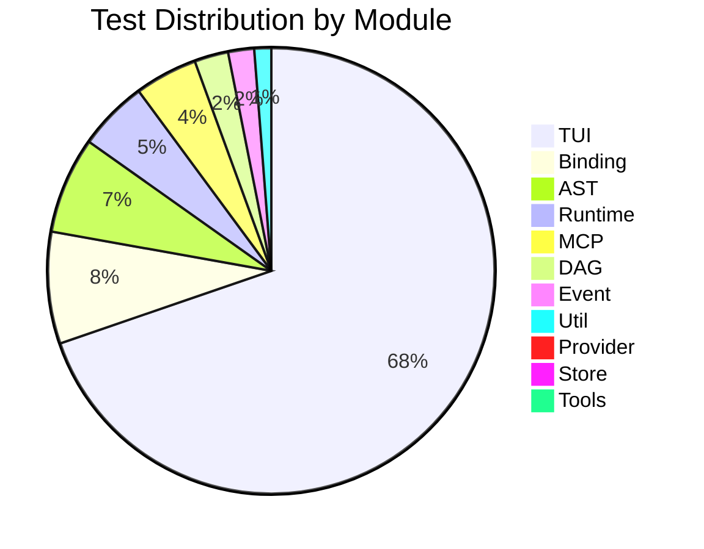

<br>

## Powered By

<div align="center">

[](https://github.com/0xPlaygrounds/rig)
[](https://tokio.rs/)
[](https://ratatui.rs/)
[](https://github.com/anthropics/anthropic-cookbook)
[](https://docs.rs/petgraph)
[](https://serde.rs/)

</div>

<br>

## IDE Setup

Get YAML autocompletion and validation in your editor:

<details>
<summary><b>VS Code</b></summary>

Install [YAML extension](https://marketplace.visualstudio.com/items?itemName=redhat.vscode-yaml), then add to `.vscode/settings.json`:

```json
{
  "yaml.schemas": {
    "https://raw.githubusercontent.com/supernovae-st/nika/main/schemas/nika-workflow.schema.json": "*.nika.yaml"
  }
}
```

</details>

<details>
<summary><b>JetBrains (IntelliJ, WebStorm)</b></summary>

1. Go to **Settings &rarr; Languages &rarr; Schemas and DTDs &rarr; JSON Schema Mappings**
2. Add new mapping:
   - Schema URL: `https://raw.githubusercontent.com/supernovae-st/nika/main/schemas/nika-workflow.schema.json`
   - File pattern: `*.nika.yaml`

</details>

<details>
<summary><b>Neovim (with nvim-lspconfig)</b></summary>

```lua
require('lspconfig').yamlls.setup {
  settings = {
    yaml = {
      schemas = {
        ["https://raw.githubusercontent.com/supernovae-st/nika/main/schemas/nika-workflow.schema.json"] = "*.nika.yaml"
      }
    }
  }
}
```

</details>

<br>

## Documentation

| Resource | Description |
|:---------|:------------|
| [CHANGELOG.md](CHANGELOG.md) | Version history |
| [docs/ARCHITECTURE.md](docs/ARCHITECTURE.md) | System design |
| [tools/nika/CLAUDE.md](tools/nika/CLAUDE.md) | AI context |
| [examples/](tools/nika/examples/) | Sample workflows |
| [schemas/](schemas/) | JSON Schema for IDE |

<br>

## FAQ

<details>
<summary><b>How do I switch LLM providers?</b></summary>

Set the environment variable for your provider:

```bash
# Use Claude (default)
export ANTHROPIC_API_KEY=sk-ant-...

# Use OpenAI instead
export OPENAI_API_KEY=sk-...

# Or specify per-workflow
provider: openai  # in your YAML
```

</details>

<details>
<summary><b>How do I use @mentions in chat?</b></summary>

Reference previous messages by their number:

```
You: Research AI safety papers
Assistant: Found 5 papers...

You: Summarize @1 in bullet points
# ^^ References message 1 (your first message)

You: Compare @1 and @2
# ^^ References messages 1 and 2
```

</details>

<details>
<summary><b>What are builtin tools?</b></summary>

Nika provides 6 `nika:*` tools for workflow control:

- `nika:sleep` &mdash; Delay execution (ms precision)
- `nika:log` &mdash; Emit log events (trace/debug/info/warn/error)
- `nika:emit` &mdash; Custom event emission with payload
- `nika:assert` &mdash; Validate conditions with custom messages
- `nika:prompt` &mdash; Interactive user prompts (HITL)
- `nika:run` &mdash; Execute sub-workflows

</details>

<details>
<summary><b>What's the difference between infer and agent?</b></summary>

| | `infer` | `agent` |
|---|---|---|
| Turns | Single | Multi-turn loop |
| Tools | No | MCP tools |
| Nested agents | No | spawn_agent |
| Use for | Simple prompts | Complex reasoning |

</details>

<details>
<summary><b>How do I debug a failing workflow?</b></summary>

1. **Check traces:** `nika trace list` then `nika trace show <id>`
2. **Validate first:** `nika check workflow.yaml --strict`
3. **Use verbose mode:** `RUST_LOG=debug nika run workflow.yaml`

</details>

<br>

## Troubleshooting

<details>
<summary><b>NIKA-001: No API key found</b></summary>

```
Error: NIKA-001 - No LLM provider configured
```

**Fix:** Set at least one API key:
```bash
export ANTHROPIC_API_KEY=sk-ant-...
# or
export OPENAI_API_KEY=sk-...
```

</details>

<details>
<summary><b>NIKA-010: MCP server failed to start</b></summary>

```
Error: NIKA-010 - MCP server 'novanet' failed to connect
```

**Fix:**
1. Check the command path exists
2. Verify the server binary is executable
3. Check server logs: `nika trace show <id> | grep mcp`

</details>

<details>
<summary><b>NIKA-020: Cycle detected in DAG</b></summary>

```
Error: NIKA-020 - Cycle detected: task_a -> task_b -> task_a
```

**Fix:** Remove circular dependency. Use `flows:` to visualize.

</details>

<br>

## Contributing

We welcome contributions! See [CONTRIBUTING.md](CONTRIBUTING.md) for guidelines.

```bash
git clone https://github.com/supernovae-st/nika.git
cd nika

cargo build          # Build
cargo test           # Test (2,720+ tests)
cargo clippy         # Lint
cargo run -- --help  # Run
```

<br>

## License

**AGPL-3.0** &mdash; See [LICENSE](LICENSE) for details.

<br>

---

<div align="center">

## Part of the SuperNovae Ecosystem

<table>
<tr>
<td align="center">
<a href="https://github.com/supernovae-st/novanet">

</a>
</td>
<td align="center">
<a href="https://github.com/supernovae-st/nika">

</a>
</td>
</tr>
</table>

<br>

<!-- SuperNovae Studio -->
<a href="https://supernovae.studio">

</a>

**[SuperNovae Studio](https://supernovae.studio)**

*Building the future of AI workflows*

<br>

<!-- Team -->
<table>
<tr>
<td align="center">
<a href="https://github.com/ThibautMelen">
<br>
<sub><b>Thibaut Melen</b></sub>
</a>
</td>
<td align="center">
<a href="https://github.com/NicolasCELLA">
<br>
<sub><b>Nicolas Cella</b></sub>
</a>
</td>
</tr>
</table>

<br>

<!-- Links -->
[](https://nika.sh)
[](https://supernovae.studio)
[](https://github.com/supernovae-st)

<br>

[](https://github.com/supernovae-st/nika)
&nbsp;&nbsp;
[](https://github.com/supernovae-st/nika/fork)
&nbsp;&nbsp;
[](https://github.com/supernovae-st/nika)

<br>

---

<sub>Made with love and Rust by SuperNovae Studio</sub>

</div>
