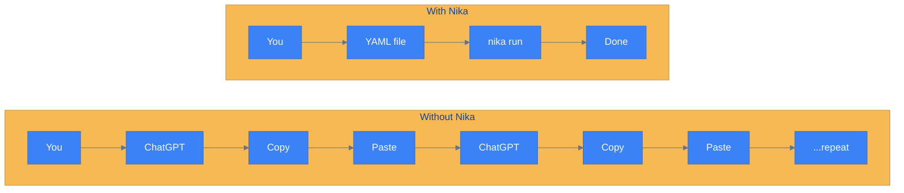
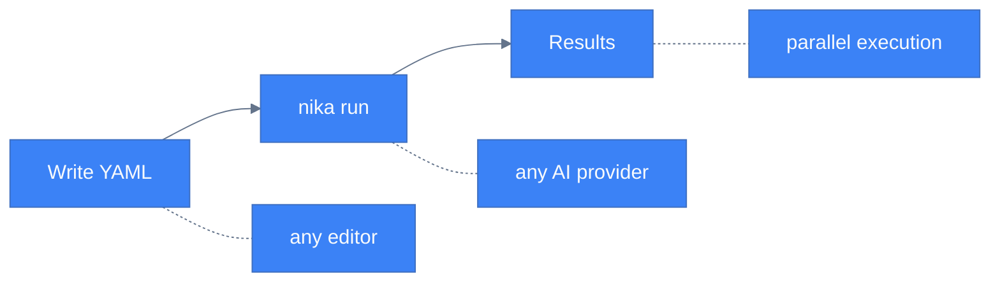
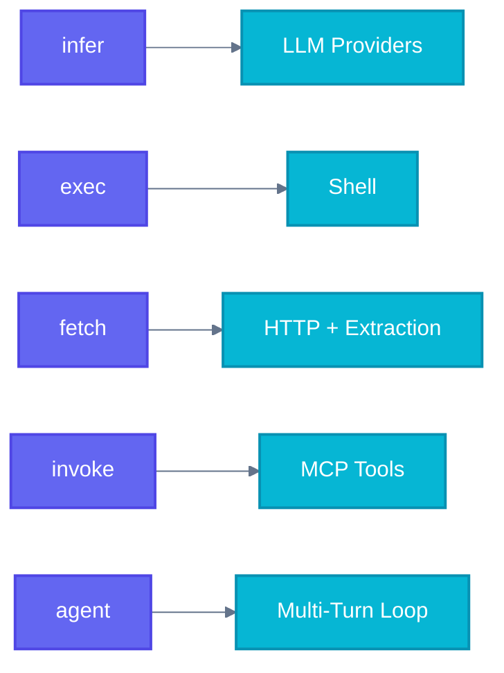
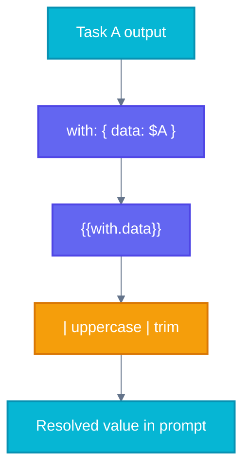
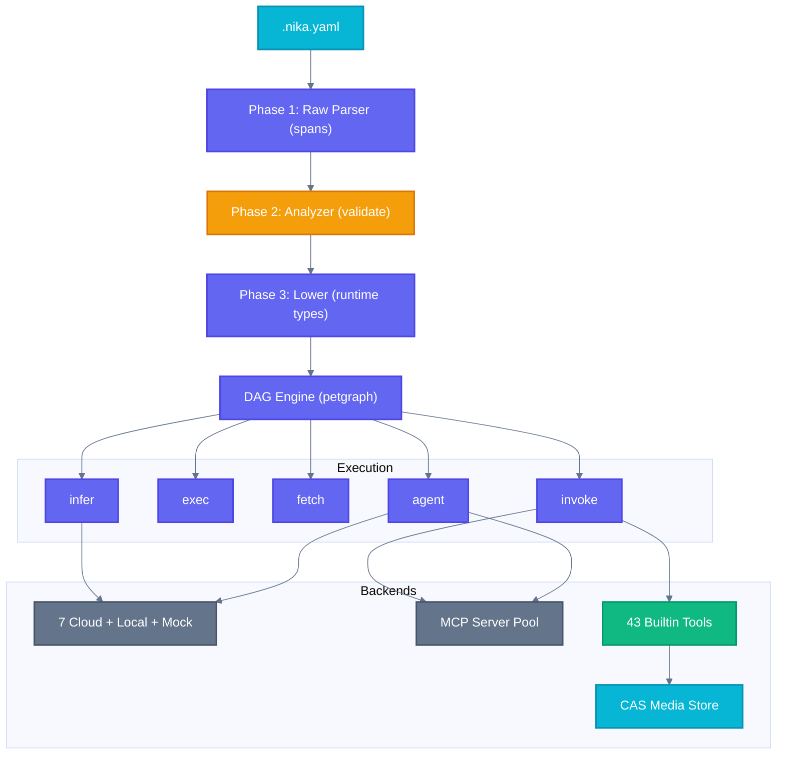
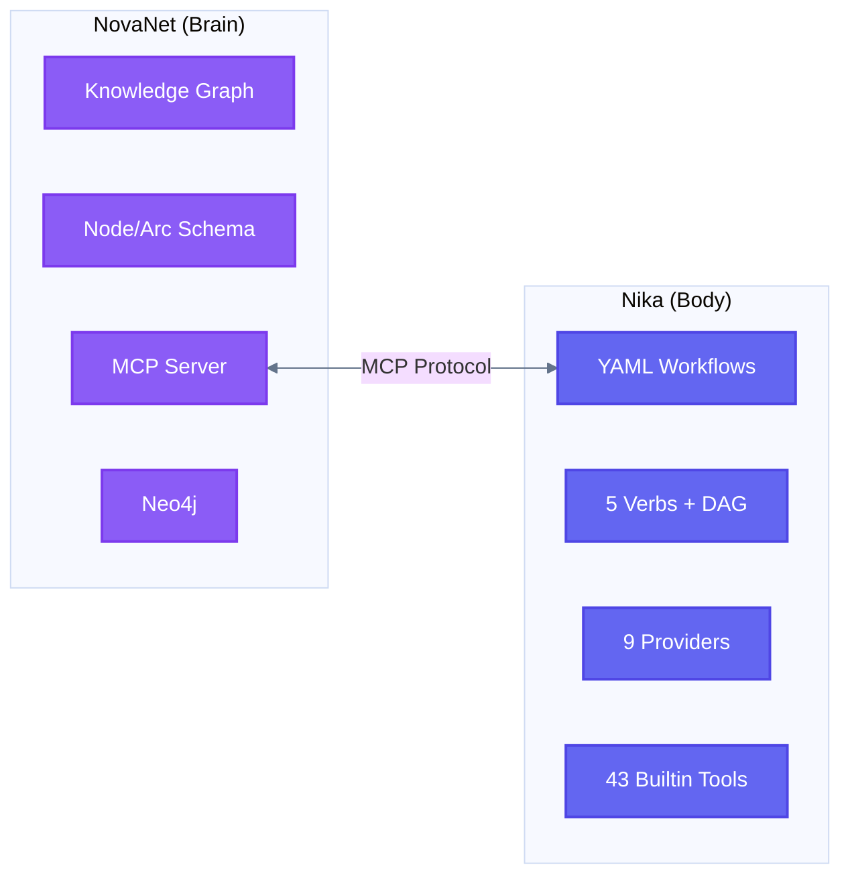

<div align="center">

# Nika

**Automate AI. No code required.**

[](https://crates.io/crates/nika)
[](https://github.com/supernovae-st/nika/actions/workflows/ci.yml)
[](https://codecov.io/gh/supernovae-st/nika)
[](LICENSE)
[](https://github.com/supernovae-st/nika/actions)
[](https://hub.docker.com/r/supernovae/nika)
[](https://zenodo.org/doi/10.5281/zenodo.19362013)
[](https://archive.softwareheritage.org/browse/origin/?origin_url=https://github.com/supernovae-st/nika)
[](CITATION.cff)

[Quick Start](#quick-start) | [How It Works](#how-it-works) | [Use Cases](#use-cases) | [Documentation](#documentation)

</div>

---

You know how you ask ChatGPT to summarize something, then copy the result, paste it somewhere else, then ask it to translate? Nika does all of that automatically. You write the steps once in a simple text file. Nika runs them.

```yaml
# news.nika.yaml -- Scrape Hacker News and summarize the top stories
schema: "nika/workflow@0.12"
provider: claude                  # or: openai, mistral, groq, gemini...
tasks:
  - id: scrape                    # Step 1: grab the page
    fetch: { url: "https://news.ycombinator.com", extract: article }
  - id: summarize                 # Step 2: ask an AI to summarize it
    with: { page: $scrape }       # pass the scraped content in
    infer: "3-bullet summary of today's top stories: {{with.page}}"
```

```bash
# One command. That's it.
nika run news.nika.yaml
```

---

## Why Nika?

| | Without Nika (manual) | With Nika |
|:---:|---|---|
| **Speed** | Copy-paste between ChatGPT tabs | Write steps once, runs automatically |
| **Scale** | One thing at a time | 50 items in parallel |
| **Cost** | $20/mo for ONE provider | Free, ANY provider |
| **Privacy** | Your data in their cloud | Your data on your machine |



---

## How It Works

Three steps. That's the whole idea.

| Step | What you do | What Nika does |
|:---:|---|---|
| **1.** | Write your steps in a `.nika.yaml` file | -- |
| **2.** | Run `nika run file.nika.yaml` | Fetches, summarizes, translates -- all automatically |
| **3.** | Read the results | Tasks run in parallel when possible |



---

## Use Cases

### Scrape, summarize, translate to 5 languages

```yaml
# content.nika.yaml -- Full content pipeline in 3 steps
schema: "nika/workflow@0.12"
provider: claude
tasks:
  - id: scrape                    # Step 1: fetch a blog post as markdown
    fetch: { url: "https://example.com/blog", extract: markdown }

  - id: summarize                 # Step 2: summarize the content
    with: { content: $scrape }    # $scrape = output of step 1
    infer: "Summarize in 3 bullets: {{with.content}}"

  - id: translate                 # Step 3: translate to 5 languages (in parallel!)
    for_each: ["French", "Spanish", "Japanese", "German", "Portuguese"]
    as: lang                      # {{with.lang}} = current language
    with: { summary: $summarize }
    infer: "Translate to {{with.lang}}: {{with.summary}}"
```

> **What you'll see:** 5 translations appear at once -- Nika runs them all in parallel.

### Process 100 URLs in parallel

```yaml
# batch.nika.yaml -- Read a file of URLs and scrape them all
schema: "nika/workflow@0.12"
tasks:
  - id: urls                      # Step 1: read a list of URLs from a file
    exec: "cat urls.txt"

  - id: process                   # Step 2: scrape each URL (10 at a time)
    for_each: "$urls"             # loop over each line from urls.txt
    as: url
    concurrency: 10               # max 10 requests at once
    fetch: { url: "{{with.url}}", extract: article }
```

> **What you'll see:** 100 articles scraped in seconds, 10 running at a time.

### AI agent with guardrails

```yaml
# research.nika.yaml -- Let an AI agent do research autonomously
schema: "nika/workflow@0.12"
provider: claude
tasks:
  - id: research
    agent:
      prompt: "Research the top 5 competitors for our product"
      tools: [nika:read, nika:write, nika:glob]   # tools the agent can use
      max_turns: 15               # stop after 15 steps max
      guardrails:                 # safety limits
        - type: length
          max_words: 2000         # keep the response under 2000 words
```

> **What you'll see:** The agent reads files, writes a report, and stops within the limits you set.

### Import, resize, and describe an image

```yaml
# vision.nika.yaml -- Process an image with AI vision
schema: "nika/workflow@0.12"
provider: claude
tasks:
  - id: import                    # Step 1: import the image into Nika's storage
    invoke: { tool: nika:import, params: { path: "./photo.jpg" } }

  - id: thumbnail                 # Step 2: create a 400px-wide thumbnail
    with: { img: $import }
    invoke: { tool: nika:thumbnail, params: { hash: "{{with.img.hash}}", width: 400 } }

  - id: describe                  # Step 3: ask an AI to describe the image
    with: { img: $import }
    infer:
      content:
        - type: image
          source: "{{with.img.hash}}"       # the original image
        - type: text
          text: "Write an alt-text description for this image"
```

> **What you'll see:** A resized thumbnail saved locally + an AI-generated alt-text description.

---

## Quick Start

```bash
# Install Nika (pick one)
cargo install nika                       # from crates.io
brew install supernovae-st/tap/nika      # macOS / Linux
npx @supernovae-st/nika                     # run without installing

# Configure your LLM provider (interactive wizard)
nika setup

# Run any .nika.yaml file
nika run my-recipe.nika.yaml
```

Want to explore? Scaffold a project with examples:

```bash
nika init                   # 5 starter recipes (one per verb)
nika init --course          # 44 hands-on exercises across 12 levels
nika doctor                 # verify your setup
```

---

## Documentation

| | Section | Description |
|:---:|---|---|
| :book: | [The 5 Verbs](#the-5-verbs) | Learn the 5 commands that do everything: `infer`, `exec`, `fetch`, `invoke`, `agent` |
| :link: | [Data Flow](#data-flow) | Learn how to pass data between steps with `with:`, `depends_on:`, and templates |
| :robot: | [Providers](#providers) | Learn how to use Claude, OpenAI, Mistral, Groq, Gemini, DeepSeek, xAI, or local models |
| :package: | [Structured Output](#structured-output) | Learn how to get validated JSON back from any AI |
| :electric_plug: | [MCP Integration](#mcp-integration) | Learn how to connect external tools via Model Context Protocol |
| :hammer_and_wrench: | [Builtin Tools](#builtin-tools) | Explore 43 built-in tools for file ops, media processing, and web scraping |
| :shield: | [Agent Guardrails](#agent-guardrails) | Learn how to set limits, cost caps, and safety rails on autonomous agents |
| :desktop_computer: | [Terminal UI](#terminal-ui) | Learn how to run your files interactively with a beautiful TUI |
| :pencil2: | [Language Server](#language-server) | Set up autocomplete, hover info, and diagnostics in your editor |
| :brain: | [AI Integration](#ai-integration) | See how 43+ AI coding tools understand Nika out of the box |
| :building_construction: | [Architecture](#architecture) | Explore the 10-crate Rust workspace under the hood |
| :computer: | [CLI Reference](#cli-reference) | Browse all commands at a glance |
| :mortar_board: | [Interactive Course](#learn-nika--interactive-course) | Start the 12-level, 44-exercise hands-on course |

Read our [manifesto](MANIFESTO.md) -- why we believe AI should be free.

---

## Learn Nika -- Interactive Course

```bash
nika init --course
cd nika-course
nika course status
```

12 progressive levels. 44 hands-on exercises. From shell commands to full AI orchestration.

| Level | Name | What You Learn |
|:------|:-----|:---------------|
| 01 | Jailbreak | exec, fetch, infer -- the 3 core verbs |
| 02 | Hot Wire | Data bindings, transforms, templates |
| 03 | Fork Bomb | DAG patterns, parallel execution, for_each |
| 04 | Root Access | Context files, imports, inputs |
| 05 | Shapeshifter | Structured output, JSON Schema, artifacts |
| 06 | Pay-Per-Dream | Multi-provider, native models, cost control |
| 07 | Swiss Knife | 12 builtin tools, file operations |
| 08 | Gone Rogue | Autonomous agents, skills, guardrails |
| 09 | Data Heist | Web scraping, 9 extraction modes |
| 10 | Open Protocol | MCP integration, NovaNet |
| 11 | Pixel Pirate | Media pipeline, vision, 26 tools |
| 12 | SuperNovae | Boss battle -- everything combined |

Track progress, get hints, validate exercises:

```bash
nika course next      # Next exercise
nika course check     # Validate your work
nika course hint      # Progressive hints (no penalty!)
nika course status    # Constellation map
```

---

## The 5 Verbs

Every task uses exactly one verb. That is the entire API surface.



### `infer:` -- LLM Generation

```yaml
# Shorthand — just a prompt string
- id: quick
  infer: "Explain quantum computing in one paragraph"

# Full form with structured output
- id: analysis
  infer:
    system: "You are a senior code reviewer."
    prompt: "Review this code: {{with.code}}"
    temperature: 0.3
    max_tokens: 2000
    output:
      format: json
      schema:
        type: object
        required: [score, issues, suggestions]

# Vision — multimodal content
- id: describe
  infer:
    content:
      - type: image
        source: "{{with.photo.media[0].hash}}"
        detail: high
      - type: text
        text: "Describe this image in detail"

# Extended thinking (Claude only)
- id: reason
  infer:
    prompt: "Solve this step by step: {{with.problem}}"
    extended_thinking: true
    thinking_budget: 8192
```

### `exec:` -- Shell Commands

```yaml
# Shorthand
- id: status
  exec: "git log --oneline -5"

# Full form with timeout and working directory
- id: build
  exec:
    command: "cargo build --release"
    timeout: 120
    cwd: "./project"
```

### `fetch:` -- HTTP + Extraction

```yaml
# API call with JSONPath extraction
- id: weather
  fetch:
    url: "https://api.weather.gov/points/40.7,-74.0"
    extract: jsonpath
    selector: "$.properties.forecast"

# Web scraping to clean Markdown
- id: docs
  fetch:
    url: "https://docs.example.com/guide"
    extract: markdown

# RSS feed parsing
- id: news
  fetch:
    url: "https://hnrss.org/frontpage"
    extract: feed

# Binary download to content-addressable storage
- id: download
  fetch:
    url: "https://example.com/image.png"
    response: binary
```

**9 extract modes:** `markdown` | `article` | `text` | `selector` | `metadata` | `links` | `jsonpath` | `feed` | `llm_txt`

### `invoke:` -- MCP Tool Calls

```yaml
# Call any MCP server tool
- id: query
  invoke:
    mcp: novanet
    tool: read_neo4j_cypher
    params:
      query: "MATCH (n:Entity) RETURN n.name LIMIT 10"

# Call builtin tools directly
- id: process
  invoke:
    tool: nika:thumbnail
    params:
      hash: "{{with.img.hash}}"
      width: 800
```

### `agent:` -- Multi-Turn Agentic Loops

```yaml
# Autonomous agent with tool access and guardrails
- id: researcher
  agent:
    prompt: "Find and summarize recent AI safety papers"
    mcp: [web_search, filesystem]
    max_turns: 15
    guardrails:
      max_length: 5000
      schema:
        type: object
        required: [papers, summary]
    completion:
      mode: explicit  # Agent must call nika:complete
```

---

## Data Flow



### Bindings (`with:`)

Tasks pass data to downstream tasks via `with:` blocks:

```yaml
tasks:
  - id: fetch_data
    fetch: { url: "https://api.example.com/users" }

  - id: process
    with:
      users: $fetch_data                           # Reference upstream output
      count: $fetch_data.total ?? 0                # JSONPath + default value
      name: $fetch_data.data[0].name ?? "Unknown"  # Nested path + fallback
    infer:
      prompt: "Found {{with.count}} users. First: {{with.name}}"
```

### Pipe Transforms (38 available)

```yaml
with:
  upper: $data | uppercase
  lower: $data | lowercase
  clean: $data | trim | lowercase
  list:  $data | sort | unique | reverse
  safe:  $data | shell_escape
  len:   $data | length
  path:  $data | jq('.results[0].name')
```

### Parallel Execution (`for_each`)

```yaml
- id: translate
  for_each: ["en-US", "fr-FR", "ja-JP", "de-DE", "ko-KR"]
  as: locale
  concurrency: 5
  infer:
    prompt: "Translate to {{with.locale}}: {{with.text}}"
```

### Dependencies

```yaml
- id: step_b
  depends_on: [step_a]         # Explicit dependency
  with: { result: $step_a }    # Implicit dependency (auto-detected from binding)
```

---

## Providers

Seven cloud providers via [rig-core](https://github.com/0xPlaygrounds/rig), local inference via [mistral.rs](https://github.com/EricLBuehler/mistral.rs), and a mock provider for testing:

| Provider | Env Variable | Example Models |
|:---------|:-------------|:---------------|
| **Claude** | `ANTHROPIC_API_KEY` | claude-opus-4, claude-sonnet-4, claude-haiku-4.5 |
| **OpenAI** | `OPENAI_API_KEY` | gpt-4o, gpt-4.1, o3, o4-mini |
| **Mistral** | `MISTRAL_API_KEY` | mistral-large-latest, mistral-small-latest |
| **Groq** | `GROQ_API_KEY` | llama-3.3-70b-versatile, mixtral-8x7b |
| **DeepSeek** | `DEEPSEEK_API_KEY` | deepseek-chat, deepseek-reasoner |
| **Gemini** | `GEMINI_API_KEY` | gemini-2.5-pro, gemini-2.5-flash |
| **xAI** | `XAI_API_KEY` | grok-3 |
| **Native** | *(local)* | Any GGUF model via mistral.rs |
| **Mock** | *(none)* | Deterministic test responses -- no API calls |

```yaml
# Per-workflow default
provider: claude
model: sonnet-4

# Per-task override
tasks:
  - id: fast
    provider: groq
    model: mixtral-8x7b
    infer: "Quick answer needed"

  - id: local
    provider: native
    model: "Qwen/Qwen2.5-7B-Instruct"
    infer: "This runs entirely on your machine"
```

### Native Inference

Run models locally via [mistral.rs](https://github.com/EricLBuehler/mistral.rs) -- no API keys, no network:

```bash
nika model list                                    # Browse available models
nika model download Qwen/Qwen2.5-7B-Instruct      # Download from HuggingFace
nika model vision Qwen/Qwen2.5-VL-7B-Instruct     # Vision-capable models
```

---

## Structured Output

Five-layer defense for guaranteed JSON schema compliance:

```yaml
- id: extract
  infer: "Extract entities from: {{with.text}}"
  structured:
    schema:
      type: object
      required: [entities]
      properties:
        entities:
          type: array
          items:
            type: object
            required: [name, type, confidence]
    enable_repair: true
    max_retries: 3
```

| Layer | Strategy | When |
|:------|:---------|:-----|
| **0** | Provider-native schema enforcement (DynamicSubmitTool) | Always tried first |
| **1** | rig Extractor (schemars) | Future |
| **2** | Extract + Validate JSON | Fallback |
| **3** | Retry with error feedback | On validation failure |
| **4** | LLM repair call | Last resort |

---

## MCP Integration

Nika is an MCP-native client. Connect to any [Model Context Protocol](https://modelcontextprotocol.io/) server:

```yaml
schema: "nika/workflow@0.12"

mcp:
  novanet:
    command: cargo
    args: [run, --bin, novanet-mcp]
  filesystem:
    command: npx
    args: ["-y", "@anthropic/mcp-filesystem"]

tasks:
  - id: query
    invoke:
      mcp: novanet
      tool: read_neo4j_cypher
      params:
        query: "MATCH (e:Entity) RETURN e.name LIMIT 5"

  - id: agent_task
    agent:
      prompt: "Organize the project files by category"
      mcp: [filesystem]
      max_turns: 10
```

**100 MCP server aliases** are built in -- use common names like `neo4j`, `filesystem`, `web_search`, `slack`, `github` and Nika auto-resolves the full server configuration.

---

## Builtin Tools

43 builtin tools accessible via `invoke: nika:*`, organized in three tiers.

### Tier 1 -- Always On (5 tools)

| Tool | Purpose |
|:-----|:--------|
| `nika:import` | Import any file into CAS (content-addressable storage) |
| `nika:dimensions` | Image dimensions from headers (~0.1ms) |
| `nika:thumbhash` | 25-byte compact image placeholder |
| `nika:dominant_color` | Color palette extraction |
| `nika:pipeline` | Chain operations in-memory (zero intermediate files) |

### Tier 2 -- Default, `media-core` (6 tools)

| Tool | Purpose |
|:-----|:--------|
| `nika:thumbnail` | SIMD-accelerated resize (Lanczos3) |
| `nika:convert` | Format conversion (PNG/JPEG/WebP) |
| `nika:strip` | Remove EXIF/metadata |
| `nika:metadata` | Universal EXIF/audio/video metadata |
| `nika:optimize` | Lossless PNG optimization (oxipng) |
| `nika:svg_render` | SVG to PNG rasterization (resvg) |

### Tier 3 -- Opt-In (8 tools)

| Tool | Feature Flag | Purpose |
|:-----|:-------------|:--------|
| `nika:phash` | `media-phash` | Perceptual image hashing |
| `nika:compare` | `media-phash` | Visual similarity comparison |
| `nika:pdf_extract` | `media-pdf` | PDF text extraction |
| `nika:chart` | `media-chart` | Bar/line/pie charts from JSON data |
| `nika:provenance` | `media-provenance` | C2PA content credentials (sign) |
| `nika:verify` | `media-provenance` | C2PA verification + EU AI Act compliance |
| `nika:qr_validate` | `media-qr` | QR decode + 0-100 quality score |
| `nika:quality` | `media-iqa` | Image quality assessment (DSSIM/SSIM) |

### Web Extraction (5 tools)

| Tool | Feature Flag | Purpose |
|:-----|:-------------|:--------|
| `nika:html_to_md` | `fetch-markdown` | HTML to clean Markdown (htmd) |
| `nika:css_select` | `fetch-html` | CSS selector extraction (scraper) |
| `nika:extract_metadata` | `fetch-html` | OG, Twitter Cards, JSON-LD, SEO metadata |
| `nika:extract_links` | `fetch-html` | Rich link classification (internal/external/nav/content) |
| `nika:readability` | `fetch-article` | Article content extraction (dom_smoothie) |

Plus 12 core file tools (read, write, edit, glob, grep, and more) and 7 agent tools (complete, feedback, etc.).

All media is stored in a **Content-Addressable Store** (CAS) using blake3 hashing with zstd compression and reflink-copy.

---

## Agent Guardrails

Validate and constrain agent outputs at multiple levels:

```yaml
- id: writer
  agent:
    prompt: "Write a product description"
    guardrails:
      max_length: 1000
      schema:
        type: object
        required: [title, body, tags]
      regex: "^[A-Z]"                    # Must start with uppercase
    completion:
      mode: explicit                     # Agent must call nika:complete
      confidence_threshold: 0.8          # Minimum confidence score
    limits:
      max_turns: 20
      timeout: 300
```

---

## Terminal UI

Three views for the complete workflow lifecycle:

```
+-----------------------------------------------------------------------------+
| Nika Studio                                                  v0.54.0        |
|-----------------------------------------------------------------------------|
| +- Files ----------+ +- Editor ------------------------------------------+ |
| | > workflows/     | |  1 | schema: "nika/workflow@0.12"                 | |
| |   deploy.nika    | |  2 | provider: claude                             | |
| |   review.nika    | |  3 |                                              | |
| +- DAG ------------+ |  4 | tasks:                                       | |
| |                  | |  5 |   - id: research                             | |
| | [research]--+    | |  6 |     agent:                                   | |
| |      |      |    | |  7 |       prompt: "Find AI papers"               | |
| | [analyze] [eval] | |  8 |       mcp: [web_search]                      | |
| |      |      |    | +--------------------------------------------------+ |
| | [   report    ]  |                                                        |
| +------------------+                                                        |
|-----------------------------------------------------------------------------|
| [1/s] Studio  [2/c] Command  [3/x] Control                                 |
+-----------------------------------------------------------------------------+
```

| View | Key | Features |
|:-----|:----|:---------|
| **Studio** | `1` / `s` | File browser, YAML editor with tree-sitter highlighting, LSP integration (completion, hover, diagnostics, go-to-def, code actions), DAG preview |
| **Command** | `2` / `c` | Interactive chat with LLM, workflow execution monitor, streaming responses, real-time task progress |
| **Control** | `3` / `x` | Provider configuration, theme selection, editor preferences |

### Editor Features

- Tree-sitter YAML syntax highlighting
- LSP-powered completions, hover docs, go-to-definition
- Diagnostic gutter with underlines
- Code actions and quick fixes
- Undo/redo with edit history
- Git status gutter (git2)
- Fuzzy file search (nucleo)
- Vi/Emacs keybinding modes

---

## Language Server

Full Language Server Protocol support for external editors:

```bash
# Standalone LSP binary
cargo install nika-lsp

# Via VS Code extension
code --install-extension supernovae.nika-lang
```

16 capabilities:

| Capability | Details |
|:-----------|:--------|
| **Completion** | 16-variant context detection: verbs, fields, providers, models, task refs, templates, vision content |
| **Hover** | Documentation for all verbs, fields, providers, and models |
| **Go-to-Definition** | Jump from `depends_on:` and `with:` references to task definitions |
| **Diagnostics** | Schema validation, binding errors, syntax errors, model compatibility |
| **Semantic Tokens** | 20+ token types for syntax-aware highlighting |
| **Document Symbols** | Workflow outline with task hierarchy |
| **Code Actions** | Quick fixes for common mistakes |
| **Inlay Hints** | Timeout values, binding sources, dependency counts |
| **CodeLens** | Validate, Run Workflow, task count badges |
| **Document Links** | Clickable references to tasks and files |
| **Folding Ranges** | Collapse tasks, with: blocks, MCP configs |
| **References** | Find all references to a task ID |
| **Rename** | Rename task IDs across all references |
| **Formatting** | Standardize YAML formatting |
| **Selection Range** | Smart expand/shrink selection |
| **Signature Help** | Parameter hints for verbs and tools |

---

## AI Integration

Nika integrates with 43+ AI coding tools out of the box. Install once, every AI understands `.nika.yaml`.

```bash
nika init               # Auto-detects editors + generates AI rules
```

| Tier | What | Tools |
|------|------|-------|
| **Agent Skills** | Universal skill format (agentskills.io) | Claude, Cursor, Copilot, Windsurf, Roo, 38+ more |
| **Claude Plugin** | 5 skills, 3 agents, hooks, MCP, LSP | Claude Code |
| **Native Rules** | Per-tool optimized rules (.mdc, .instructions.md) | Cursor, Copilot, Windsurf, Roo, Aider |
| **MCP Server** | `nika mcp serve` — check, list, schema, error lookup | All MCP-capable tools |
| **llms.txt** | AI content discovery standard | Web-based AI agents |

Generated files per project:

```
AGENTS.md                    # Universal (60k+ repos)
CLAUDE.md → AGENTS.md        # Symlink for Claude Code
.cursor/rules/nika.mdc       # Cursor
.github/copilot/*.md         # GitHub Copilot
.windsurf/rules/nika.md      # Windsurf
.roo/rules/nika.md           # Roo Code
.roomodes                    # Roo Code custom modes
.vscode/extensions.json      # VS Code recommendations
```

---

## Architecture



### Three-Phase AST Pipeline

Inspired by rustc, the AST passes through three distinct phases with increasing guarantees:

1. **Raw** -- YAML is parsed with source spans preserved for error reporting
2. **Analyzed** -- Validation, binding resolution, dependency detection, schema compliance
3. **Lowered** -- Conversion to concrete runtime types ready for execution

### Key Design Decisions

- **Immutable DAG** -- After construction, the dependency graph is frozen for safe concurrent execution via petgraph
- **Content-Addressable Storage** -- blake3 hashing, zstd compression, reflink-copy; media is never duplicated
- **Event Sourcing** -- 41 event types emitted as NDJSON traces with full replay capability
- **Zero Cypher** -- Nika never talks to databases directly; all graph access goes through MCP

### 12 Workspace Crates

```
nika/tools/
├── nika/               Binary entry point (2k LOC) .... cargo install nika
├── nika-engine/        Embeddable runtime (135k LOC) .. cargo add nika-engine
│   ├── runtime/        DAG execution + 5 verb implementations
│   ├── provider/       9 providers (rig-core + mistral.rs + mock)
│   ├── dag/            Graph validation + execution ordering
│   ├── binding/        Templates, 38 transforms, JSONPath
│   ├── tools/          File tools (read, write, edit, glob, grep)
│   └── builtin/        24 builtin tools (file, media, web)
├── nika-core/          AST, types, catalogs (23k LOC) -- zero I/O
├── nika-event/         EventLog, TraceWriter (4k LOC)
├── nika-mcp/           MCP client, rmcp adapter (9k LOC)
├── nika-media/         CAS store, media processor (13k LOC)
├── nika-daemon/        Background daemon (5k LOC) -- secrets, jobs, watch, cache
├── nika-init/          Project scaffolding (21k LOC) -- init wizard + course
├── nika-cli/           CLI subcommands (8k LOC)
├── nika-tui/           Terminal UI with ratatui (86k LOC)
├── nika-lsp-core/      Protocol-agnostic LSP intelligence (9k LOC)
└── nika-lsp/           Standalone LSP server binary (2.5k LOC)
```

To embed Nika's engine in your own Rust application without pulling in TUI or CLI dependencies:

```bash
cargo add nika-engine
```

---

## CLI Reference

```bash
# Workflow execution
nika run workflow.nika.yaml              # Execute a workflow
nika run workflow.nika.yaml --detail max # Verbose output with all events
nika run workflow.nika.yaml --quiet      # Single-line summary
nika check workflow.nika.yaml            # Validate without executing
nika check workflow.nika.yaml --strict   # + MCP server connectivity checks

# Interactive
nika ui                                  # Launch TUI
nika ui workflow.nika.yaml               # Open file in Studio view
nika chat                                # Direct chat mode
nika studio workflow.nika.yaml           # Open Studio view

# Initialization
nika init                                # Minimal project (5 workflows, 1 per verb)
nika init --course                       # Interactive 12-level course (44 exercises)

# Course
nika course status                       # Constellation progress map
nika course next                         # Next exercise
nika course check                        # Validate current exercise
nika course hint                         # Progressive hints (no penalty)
nika course run                          # Run current exercise workflow
nika course info                         # Details about current exercise
nika course reset                        # Reset progress
nika course watch                        # Watch mode for exercises

# Providers
nika provider list                       # Show all providers with key status
nika provider test claude                # Validate API key with provider

# Models (native inference)
nika model list                          # Available local models
nika model download MODEL_ID             # Download from HuggingFace
nika model vision MODEL_ID               # Download vision-capable model
nika model remove MODEL_ID               # Remove local model

# MCP servers
nika mcp list                            # List configured MCP servers
nika mcp test workflow.yaml SERVER       # Test server connection
nika mcp tools workflow.yaml SERVER      # List available tools
nika mcp serve                           # Start MCP server for AI coding tools

# Showcase
nika showcase list                       # Browse 115 showcase workflows
nika showcase extract NAME               # Extract a showcase to current dir

# Media (CAS)
nika media list                          # List stored media with stats
nika media inspect HASH                  # Show metadata for a CAS entry
nika media clean                         # Remove orphaned media

# Tracing
nika trace list                          # List workflow traces
nika trace show ID                       # Show trace details
nika trace export ID --format json       # Export trace as JSON

# Configuration
nika config list                         # Show all settings
nika config get KEY                      # Get a setting
nika config set KEY VALUE                # Set a setting

# System
nika doctor                              # Full system health check
nika doctor --full                       # + LSP, editor, MSRV checks
nika completion bash|zsh|fish            # Shell completions
```

---

## Installation

### From crates.io

```bash
cargo install nika
```

### Homebrew

```bash
brew install supernovae-st/tap/nika
```

### npm

```bash
npm install -g @supernovae-st/nika    # global install
npx @supernovae-st/nika               # or run directly
```

### Docker

```bash
docker run --rm -v "$(pwd)":/work supernovae/nika run /work/my-workflow.nika.yaml
```

### From Source

```bash
git clone https://github.com/supernovae-st/nika.git
cd nika
cargo install --path tools/nika
```

### Verify

```bash
nika --version       # nika 0.58.0
nika doctor          # Full system health check
```

### Feature Flags

Nika ships with sensible defaults. Customize at build time:

```bash
# Minimal build (no TUI, no native inference, no media)
cargo install --path tools/nika --no-default-features

# With specific features
cargo install --path tools/nika --features "tui,native-inference,media-core"
```

| Feature | Default | Description |
|:--------|:--------|:------------|
| `tui` | yes | Terminal UI (ratatui, tree-sitter, git2) |
| `native-inference` | yes | Local GGUF models via mistral.rs |
| `media-core` | yes | Tier 2 media tools (thumbnail, convert, etc.) |
| `media-phash` | yes | Perceptual hashing + comparison |
| `media-pdf` | yes | PDF text extraction |
| `media-chart` | yes | Chart generation from JSON data |
| `media-qr` | yes | QR code validation |
| `media-iqa` | yes | Image quality assessment |
| `media-provenance` | no | C2PA signing + verification |
| `media-compression` | yes | zstd CAS compression |
| `fetch-extract` | yes | HTML extraction (text, selector, metadata, links) |
| `fetch-markdown` | yes | HTML to Markdown (htmd) |
| `fetch-article` | yes | Article extraction (dom_smoothie) |
| `fetch-feed` | yes | RSS/Atom/JSON Feed parsing |
| `lsp` | no | Standalone LSP server binary |
| `nika-daemon` | yes | Background daemon for key management |

---

## Production Examples

### SEO Audit Pipeline

```yaml
schema: "nika/workflow@0.12"
provider: claude

tasks:
  - id: crawl
    fetch:
      url: "https://example.com"
      extract: metadata

  - id: audit
    with: { meta: $crawl }
    infer:
      prompt: |
        Audit this page's SEO metadata and suggest improvements:
        {{with.meta}}
      output:
        format: json
        schema:
          type: object
          required: [score, issues, recommendations]
          properties:
            score: { type: integer, minimum: 0, maximum: 100 }
            issues: { type: array, items: { type: string } }
            recommendations: { type: array, items: { type: string } }
```

### Multi-Language Content Pipeline

```yaml
schema: "nika/workflow@0.12"
provider: claude

tasks:
  - id: generate
    for_each: ["en-US", "fr-FR", "ja-JP", "de-DE", "ko-KR"]
    as: locale
    concurrency: 5
    infer:
      prompt: |
        Write a product tagline for locale {{with.locale}}.
        Max 120 characters. Adapt tone for the culture.

  - id: review
    with: { taglines: $generate }
    infer:
      prompt: "Review these taglines for cultural sensitivity: {{with.taglines}}"
      output:
        format: json
        schema:
          type: object
          required: [approved, flagged]
```

### Image Processing Pipeline

```yaml
schema: "nika/workflow@0.12"

tasks:
  - id: import
    invoke:
      tool: nika:import
      params: { path: "./photos/hero.jpg" }

  - id: process
    with: { img: $import }
    invoke:
      tool: nika:pipeline
      params:
        hash: "{{with.img.hash}}"
        ops:
          - { op: thumbnail, width: 800 }
          - { op: optimize }
          - { op: convert, format: webp }

  - id: analyze
    with: { img: $import }
    invoke:
      tool: nika:quality
      params: { hash: "{{with.img.hash}}" }
```

### Agentic Research with Guardrails

```yaml
schema: "nika/workflow@0.12"
provider: claude
model: sonnet-4

mcp:
  web_search:
    command: npx
    args: ["-y", "@anthropic/mcp-web-search"]

tasks:
  - id: research
    agent:
      prompt: |
        Research the latest developments in quantum computing.
        Find 5 recent papers, summarize each, and identify trends.
      mcp: [web_search]
      max_turns: 20
      guardrails:
        max_length: 10000
        schema:
          type: object
          required: [papers, trends, summary]
      completion:
        mode: explicit
        confidence_threshold: 0.85
      limits:
        timeout: 600
```

### Health Check Dashboard

```yaml
schema: "nika/workflow@0.12"

tasks:
  - id: check
    for_each:
      - "https://api.example.com/health"
      - "https://cdn.example.com/status"
      - "https://db.example.com/ping"
    as: endpoint
    concurrency: 3
    fetch:
      url: "{{each.endpoint}}"
      timeout: 10
      response: full

  - id: report
    with: { results: $check }
    provider: claude
    infer:
      prompt: "Generate a status report from these health checks: {{with.results}}"
      output:
        format: json
        schema:
          type: object
          required: [status, services, timestamp]
```

---

## Error Codes

Nika uses structured error codes (`NIKA-XXX`) for every failure mode:

| Range | Category |
|:------|:---------|
| `000-009` | Workflow parsing |
| `010-019` | Schema validation |
| `020-029` | DAG (cycles, missing deps) |
| `030-039` | Provider errors |
| `040-049` | Template/binding resolution |
| `050-059` | Security (path traversal, blocked commands) |
| `060-069` | Output validation (JSON schema) |
| `070-089` | With block + DAG validation |
| `090-099` | JSONPath/IO/Execution |
| `100-109` | MCP (connection, tool errors) |
| `110-119` | Agent + Guardrails |
| `120-129` | Resilience |
| `140-151` | AST analysis (Phase 2) |
| `160-164` | Parse errors (Phase 1 parser, nika-core) |
| `165-169` | Policy/Boot/Startup |
| `170-179` | Runtime (decompose) |
| `200-219` | File tools + Builtin tools |
| `251-259` | Media pipeline |
| `260-269` | Package URI |
| `270-279` | Skills |
| `280-285` | Artifacts + Media |
| `290-297` | Media tools |
| `300-309` | Structured output |

---

## Contributing

```bash
git clone https://github.com/supernovae-st/nika.git
cd nika

cargo build                       # Build all 12 crates
cargo test --workspace --lib      # Run 9000+ tests (safe, no keychain popups)
cargo clippy -- -D warnings       # Zero warnings policy
```

> **Warning:** `cargo test` (without `--lib`) runs contract tests that trigger macOS Keychain popups. Always use `cargo test --lib` for safe local testing.

See [CONTRIBUTING.md](CONTRIBUTING.md) for full guidelines.

### Conventions

- **Tests first** -- TDD preferred, edge cases always
- **Error codes** -- `NikaError` with `NIKA-XXX`, never `anyhow`
- **AST phases** -- Always Raw then Analyzed then Lower, never skip
- **Extensions** -- `.nika.yaml` for workflows
- **Zero Cypher** -- Use MCP `invoke:`, never direct database access
- **Commits** -- `type(scope): description` with co-author lines

---

## Troubleshooting

| Problem | Fix |
|---------|-----|
| Missing API key | `nika setup` (interactive wizard) or `nika provider set anthropic <key>` |
| Extension outdated | `code --install-extension supernovae.nika-lang --force` |
| Daemon not running | `nika daemon start` (auto-starts on macOS/Linux) |
| LSP not working | `nika doctor` to diagnose, then `nika doctor --fix` |
| Workflow validation | `nika check workflow.nika.yaml --strict` |
| Full health check | `nika doctor --full` |

For detailed diagnostics, run `nika doctor --format json` or check the [User Guide](docs/content/user-guide/getting-started.md).

---

## Ecosystem

Nika is the workflow engine of the **SuperNovae** ecosystem:



---

<div align="center">

**Nika v0.58.0** | Schema `nika/workflow@0.12` | Rust 1.86+ | AGPL-3.0-or-later

356k+ LOC across 12 crates | 9,000+ tests | 0 clippy warnings

[SuperNovae Studio](https://supernovae.studio) | [QR Code AI](https://qrcode-ai.com) | [GitHub](https://github.com/supernovae-st/nika)

**Liberate your AI.** 🦋

</div>
