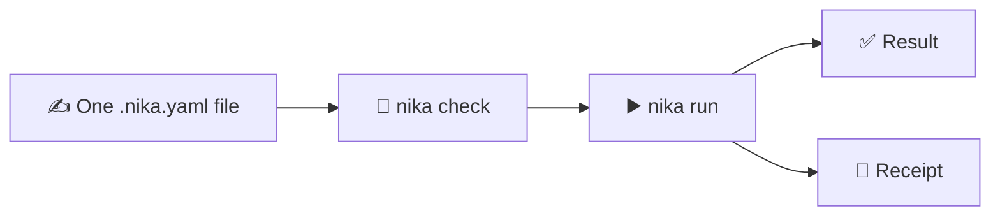

<p align="center">
  <a href="https://nika.sh">
    <picture>
      <source media="(prefers-color-scheme: dark)" srcset="https://nika.sh/brand/nika-logo-dark.svg">
      
    </picture>
  </a>
</p>

# Nika

### AI workflows you can understand before they run.

[](https://github.com/supernovae-st/nika/releases/latest)
[](https://github.com/supernovae-st/nika/actions/workflows/diamond-ci.yml)
[](https://github.com/supernovae-st/nika-spec)

Nika turns an AI task into one small `.nika.yaml` file. Check it, run it on
the model you choose, and keep a receipt of what happened.

## Start here

```sh
curl -LsSf https://nika.sh/install.sh | sh
nika try 01-hello
```

**Done.** Your first workflow ran locally. No account, API key, or model server
was needed.

## The whole idea



One file is the source of truth. `check` finds problems before a model call.
`run` executes the same file locally, in CI, or from another program.

## Your first workflow

Save this as `hello.nika.yaml`:

```yaml
nika: hello
model: mock/echo       # offline demo
permits: {}            # this workflow can touch nothing else

tasks:
  greet:
    infer:
      prompt: "Say hello in French."
      max_tokens: 64

outputs:
  greeting: ${{ tasks.greet.output }}
```

Then use the same two commands for every workflow:

```sh
nika check hello.nika.yaml
nika run hello.nika.yaml
```

That is Nika. Change the prompt, add another task, or connect tasks with
`${{ ... }}`. The file stays readable and reviewable in Git.

## Use your model

Keep the workflow. Change only the model:

```sh
nika run hello.nika.yaml --model ollama/qwen3.5:4b
```

Not sure what is ready on your machine?

```sh
nika doctor
```

Nika can use local models, API providers, and supported agentic CLIs without
changing the workflow itself.

## Why people use Nika

- **Repeat it** — the task is a file, not a chat you have to reconstruct.
- **Review it** — prompts, tools, permissions, and limits are visible in Git.
- **Check it** — mistakes and unsafe access are caught before execution.
- **Prove it** — every run leaves a local, hash-chained receipt.

<details>
<summary><strong>Learn the four building blocks</strong></summary>

| Verb | Plain meaning |
|---|---|
| `infer` | Ask a model |
| `exec` | Run a command |
| `invoke` | Call a tool or another workflow |
| `agent` | Let a model use allowed tools for a limited number of turns |

Most first workflows only need `infer`. Independent tasks run in parallel;
`${{ ... }}` references connect them when one needs another's result.

</details>

<details>
<summary><strong>Install another way</strong></summary>

```sh
# Homebrew
brew install supernovae-st/tap/nika

# Cargo
cargo binstall --git https://github.com/supernovae-st/nika nika-cli

# Nix
nix run github:supernovae-st/nika
```

Or use the [latest release archive](https://github.com/supernovae-st/nika/releases/latest).
Windows binaries are not shipped yet; use WSL2 or build from source.

</details>

<details>
<summary><strong>About run data</strong></summary>

Nika writes journals under `.nika/traces/`. Add that directory to `.gitignore`
unless you deliberately want to publish the runs.

`.nika/traces/` inherits the sensitivity of whatever the workflow read; on a
shared or CI machine, treat it as a data-at-rest surface.

```sh
nika trace verify .nika/traces/<run>.ndjson
```

</details>

## Next

[Examples](examples/README.md) ·
[Install guide](https://nika.sh/install) ·
[TypeScript SDK](nika-client/README.md) ·
[Editor extension](https://marketplace.visualstudio.com/items?itemName=supernovae.nika-lang) ·
[Open specification](https://github.com/supernovae-st/nika-spec) ·
[Roadmap](https://github.com/orgs/supernovae-st/projects/3)

Nika is usable today and intentionally pre-1.0. The engine is
[AGPL-3.0-or-later](LICENSE); the specification is Apache-2.0.
