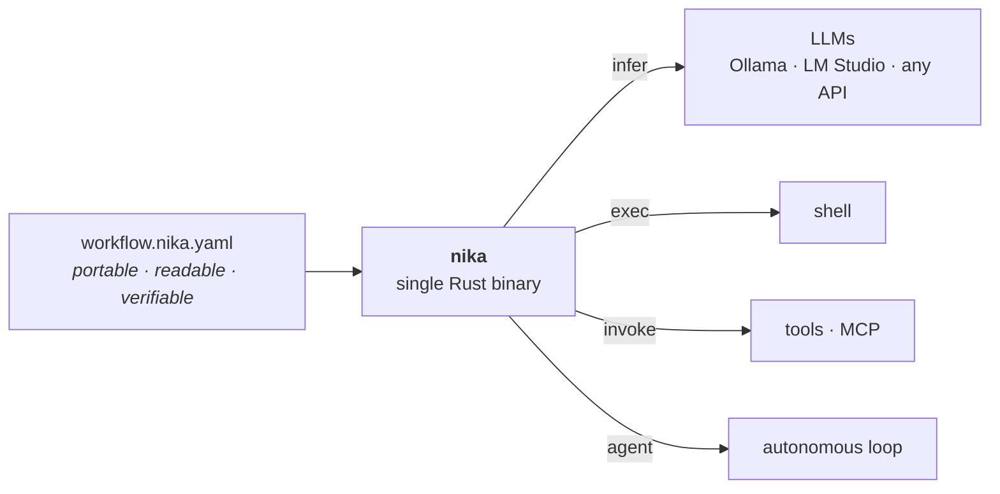

# Nika

> **Intent as Code.** An open language for AI workflows — one portable file,
> any model, no cloud.

[](LICENSE)
[](https://github.com/supernovae-st/nika-spec)
[](Cargo.toml)
[](https://github.com/supernovae-st/nika/actions/workflows/diamond-ci.yml)

Nika is an **open language for describing and running AI workflows** — a YAML
specification ([Apache-2.0](https://github.com/supernovae-st/nika-spec)) and a
reference engine, a single Rust binary (AGPL-3.0). The way SQL pairs with
PostgreSQL, or the Dockerfile with Docker: a portable standard, plus an engine
that runs it.

A Nika workflow is just a file — readable, portable, verifiable. It runs
locally, on whichever LLM you choose, with no cloud required.

```yaml
# review.nika.yaml — read a PR diff, judge its risk, comment only when it's high.
nika: v1
workflow: pr-risk-review
model: ollama/llama3.1               # local by default — swap to any provider

tasks:
  - id: diff                          # exec — a read-only shell command
    exec:
      command: "git diff origin/main...HEAD"
      capture: structured

  - id: assess                        # infer — structured LLM judgment
    with: { patch: ${{ tasks.diff.output.stdout }} }
    infer:
      prompt: "Risk-assess this diff (secrets, breaking changes, missing tests). Be terse.\n${{ with.patch }}"
      schema:
        type: object
        required: [risk]
        properties:
          risk: { type: string, enum: [low, medium, high] }

  - id: comment                       # invoke — the only write, gated on the verdict
    when: ${{ tasks.assess.output.risk == 'high' }}
    invoke:
      tool: "mcp:github/pr-comment"
      args: { body: ${{ tasks.assess.output }} }
```

## The model

Four verbs, and nothing else. A small core that composes into arbitrary
real-world workflows — the Unix and SQL discipline of "small surface, large
composition."

| Verb | What it does |
|---|---|
| `infer` | Call an LLM — any provider, local or hosted |
| `exec` | Run a shell command |
| `invoke` | Call a tool or MCP server (an HTTP fetch, GitHub, a builtin…) |
| `agent` | Run an autonomous loop with tools, until the task is done |

Everything sits under one frozen, versioned envelope — `nika: v1` — that won't
break. Three properties hold across every workflow:

- **Provider-agnostic, local-first** — local Ollama or LM Studio, or any API.
  Your workflow doesn't change when the model does.
- **Safe by construction** — a read-XOR-write capability model. A step that
  reads cannot silently write; every effect is explicit and gated.
- **Reproducible** — the file and its execution trace are an auditable,
  re-runnable record.



## Why Nika

The closest analogues aren't products — they're **standards**. SQL. The
Dockerfile. A portable specification with a reference engine. The language is
the contribution, not a product to sell.

As AI agents start acting on the real world, the interface where they act
can't be free text (too vague) or raw code (too risky). It has to be a
**verifiable action language** — one an AI writes, a human reviews and approves,
and a machine runs deterministically. Kept open and sovereign, not locked
inside one vendor's cloud.

What no existing workflow tool offers together: a single Rust binary · portable
declarative YAML · local-first · read-XOR-write capability security · AGPL ·
no cloud required · bring-your-own-LLM.

## Status

Nika is built in the open.

The **language** — the `nika: v1` envelope and its four verbs — is stable and
won't break. The **engine** is a strict, modular Rust workspace. The latest
tagged public release is **v0.90.0**; `main` moves immediately to the next
`-dev` version after each release so local contributor binaries cannot be
confused with Homebrew assets. The 1.0.0 launch remains gated by the release
checklist, not by a date. The code, the
[spec](https://github.com/supernovae-st/nika-spec), and the
[example workflows](examples/) are all readable, and development happens on
`main` in the open.

The `nika: v1` language envelope is frozen forever — a separate axis from the
engine version. Every release is complete for its declared scope; no
half-features parked behind a future version.

## Get started

Install (macOS · Linux):

```sh
brew install supernovae-st/tap/nika
nika --version
```

Your first workflow runs with **zero setup** — no model, no API key:

```sh
cat > hello.nika.yaml <<'YAML'
nika: v1
workflow: hello
tasks:
  - id: greet
    exec:
      command: "echo hello from nika"
YAML

nika check hello.nika.yaml   # static audit — before a single token is spent
nika run hello.nika.yaml     # execute locally
```

Adding an AI step? With no provider handy, the built-in `mock/echo` model lets
you see the shape offline — swap it for a real model when ready:

```yaml
model: mock/echo             # → ollama/llama3.1, anthropic/…, openai/… when ready
tasks:
  - id: greet
    infer:
      prompt: "Say hello in one sentence."
```

For real inference, run a local model (Ollama / LM Studio) or set a provider
key, then see what's wired:

```sh
nika doctor                  # provider keys + local servers, with the exact fix
nika init                    # schema wiring + AGENTS.md + Cursor rule for this repo
nika wire cursor             # optional · explicit MCP wiring for Cursor agents
nika examples list           # browse the embedded examples
nika examples run 01-hello   # runs on ollama/llama3.1 by default
```

From source (contributors): `git clone https://github.com/supernovae-st/nika.git && cd nika && cargo test --workspace --lib`. End-user docs: [docs.nika.sh](https://docs.nika.sh).

## Documentation

- **Language spec** — [supernovae-st/nika-spec](https://github.com/supernovae-st/nika-spec) (Apache-2.0), the runtime-agnostic Nika language.
- **End-user docs** — [docs.nika.sh](https://docs.nika.sh).
- **Website** — [nika.sh](https://nika.sh).
- **Example workflow** — [`examples/pr-risk-review.nika.yaml`](examples/pr-risk-review.nika.yaml), a readable four-verb workflow, local-first.

**Building Nika?** The engine is crafted under a strict workspace discipline —
context-window-sized crates, a per-crate admission checklist, zero `.unwrap()`
in `src/` (CI-enforced), downward-only layering. The design lives in
[`docs/architecture/`](docs/architecture/) and the decisions in
[`docs/adr/`](docs/adr/README.md); the roadmap is in [`ROADMAP.md`](ROADMAP.md).

## License

The **engine** is AGPL-3.0-or-later (see [`LICENSE`](LICENSE)) — modify it and
run it as a hosted service, and users of that service get the source. The
**spec** is [Apache-2.0](https://github.com/supernovae-st/nika-spec), maximally
permissive for a standard.

A commercial license (Grafana model) is available for organizations that can't
accept AGPL's network clause. Contact `contact@supernovae.studio`. Security
reports: `security@supernovae.studio`.

---

© 2024–2026 [SuperNovae Studio](https://supernovae.studio) · 🦋 Nika, the
butterfly on the SuperNovae flag.
