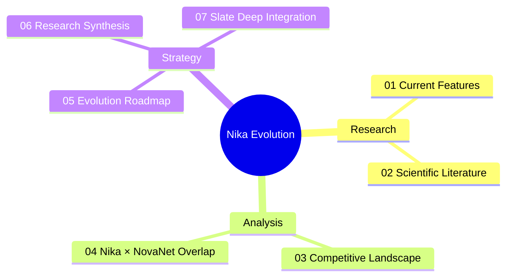
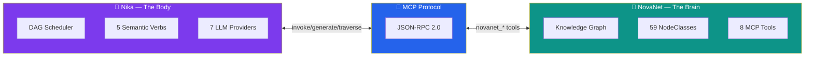
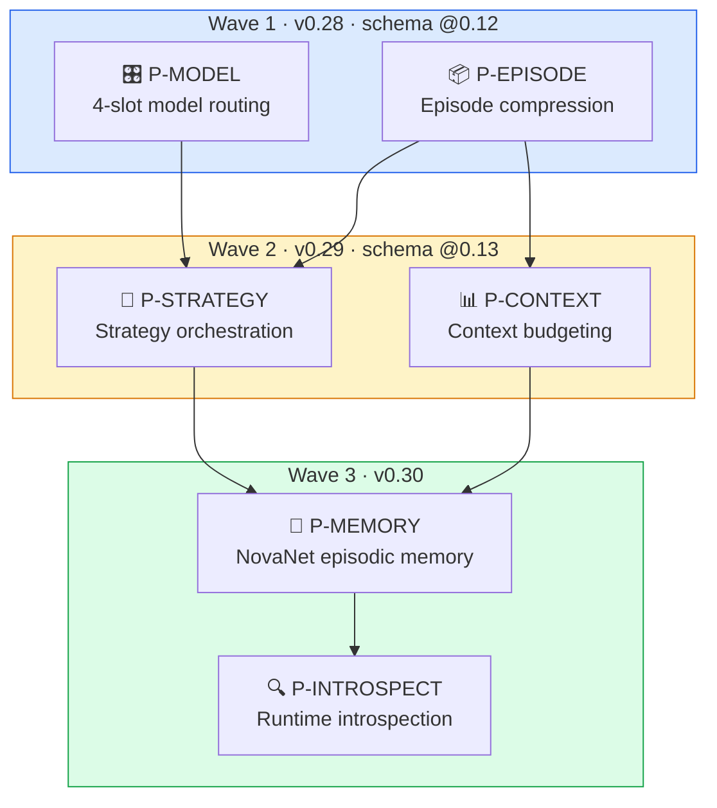
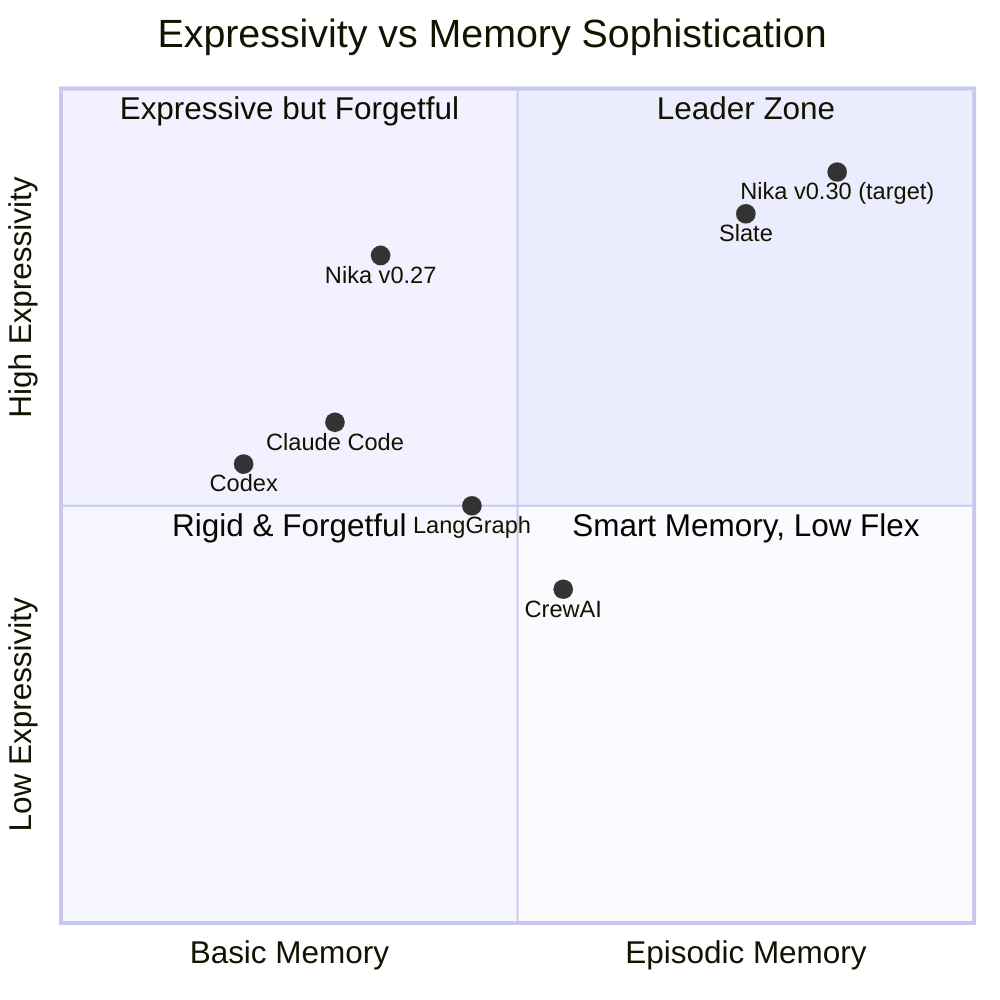

# 🦋 Nika Evolution — Research & Strategy

> Comprehensive research corpus for Nika's next evolution phase.
> 13 research agents deployed. 6 papers analyzed. 5 competitors mapped. 7 brainstorm documents produced.

**Nika** v0.27.0 · **NovaNet** v0.20.0 · Updated 2026-03-14

---

## 🗺️ Document Map

| # | Document | Purpose | Key Output |
|:-:|----------|---------|------------|
| [01](./01-current-features.md) | **Current Features** | Exhaustive Nika v0.27 + NovaNet v0.20 inventory | 373 files, 220K lines, 6,610 tests[^1] |
| [02](./02-scientific-literature.md) | **Scientific Literature** | RLM, CodeAct, THREAD, Context-Folding, Swarms | 6 papers → 6 priorities |
| [03](./03-competitive-landscape.md) | **Competitive Landscape** | Slate, Claude Code, Codex, LangGraph, CrewAI | Competitive positioning |
| [04](./04-nika-novanet-overlap.md) | **Nika × NovaNet Overlap** | Boundary rules, synergy opportunities | Golden Rule definition |
| [05](./05-evolution-roadmap.md) | **Evolution Roadmap** | 6 priorities in 3 waves with full designs | Implementation blueprint |
| [06](./06-research-synthesis-report.md) | **Research Synthesis** | Complete synthesis from 13 research agents | Unified strategy |
| [07](./07-slate-deep-integration.md) | **Slate Deep Integration** | Thread/episode/weaving → Nika architecture | Kernel upgrade plan |

---

## 🏗️ Architecture: Brain + Body + MCP

> [!IMPORTANT]
> **The Golden Rule** — Five lines that govern every architectural decision:
>
> | Concern | Owner | Why |
> |---------|-------|-----|
> | **KNOWING** things | NovaNet | Knowledge graph, entities, locales, semantics |
> | **DOING** things | Nika | Workflow execution, DAG, verbs, providers |
> | **CONNECTING** | MCP | Protocol boundary, zero Cypher in Nika |
> | **THINKING** | Episodes | Strategy orchestration, model routing, confidence |
> | **REMEMBERING** | Episodes → NovaNet | Cross-session memory, entity-linked persistence |

---

## 🎯 The 6 Priorities

📋 Priority details

| Priority | What | Inspired By | Key Rust Change |
|----------|------|-------------|-----------------|
| **P-MODEL** | 4-slot model routing (main/tactical/search/reasoning) | Slate cross-model[^2], THREAD[^3] | `model_slots` in `AnalyzedWorkflow` |
| **P-EPISODE** | LLM compression at task completion boundaries | Slate episodes[^2], Context-Folding[^4] | `Episode` struct in `runtime/` |
| **P-STRATEGY** | Dynamic tactic dispatch via thread weaving | Slate strategy/tactics[^2], AlphaZero[^5] | Orchestration mode in `runner.rs` |
| **P-CONTEXT** | Working memory awareness, token budget tracking | Slate dumb zone[^2], Context-Folding[^4] | Budget tracking in `DataStore` |
| **P-MEMORY** | NovaNet-backed cross-session episodic memory | Slate sessions[^2], Memory-R1[^6] | New MCP tools for episode storage |
| **P-INTROSPECT** | 6 runtime introspection builtin tools | RLM REPL[^7] | New tools in `runtime/builtin.rs` |

> [!TIP]
> **Core Insight** — Nika's DAG IS Slate's kernel. Tasks ARE processes. `TaskResult` IS return values. `DataStore` IS RAM.
> We don't BUILD Slate — we UPGRADE the kernel with 4 additions, then persist via NovaNet.

---

## ⚔️ Competitive Positioning

| Competitor | Key Differentiator | Nika's Response |
|-----------|-------------------|-----------------|
| **Slate**[^2] | Threads, episodes, thread weaving, cross-model | Integrate all 8 concepts via P-MODEL → P-MEMORY |
| **LangGraph** | Python flexibility, checkpointing | Keep YAML-first, add introspection (P-INTROSPECT) |
| **CrewAI** | 3-type memory system | Use NovaNet as memory backend (P-MEMORY) |
| **Claude Code** | Conversation-driven, subagent delegation | Nika is Claude Code's workflow engine |

> [!NOTE]
> **Nika's moat** — No competitor has: YAML-first declarative workflows + knowledge graph integration + 5 semantic verbs + entity-linked episodic memory. The combination is unique.

---

## 📚 Sources

📄 Academic Papers (6)

| Paper | ID | Key Contribution |
|-------|----|-----------------|
| **RLM** | [arXiv:2512.24601](https://arxiv.org/abs/2512.24601) | Recursive Language Models with REPL memory (MIT, 2025) |
| **CodeAct** | [arXiv:2402.01030](https://arxiv.org/abs/2402.01030) | Code actions for LLM agents (ICML 2024, 451 citations) |
| **THREAD** | [arXiv:2405.17402](https://arxiv.org/abs/2405.17402) | Hierarchical agent decomposition with recursive spawning |
| **Context-Folding** | [arXiv:2510.11967](https://arxiv.org/abs/2510.11967) | Branch/fold sub-trajectory compression |
| **LLM Swarms** | [arXiv:2506.14496](https://arxiv.org/abs/2506.14496) | Rule-based vs LLM swarm comparison |
| **Memory-R1** | [arXiv:2508.19828](https://arxiv.org/abs/2508.19828) | RL-trained agent memory policies |

🏢 Products & Protocols (7)

| Product | Type | Reference |
|---------|------|-----------|
| **Slate** | Agent framework | [randomlabs.ai/blog/slate](https://randomlabs.ai/blog/slate) · [docs](https://docs.randomlabs.ai) · npm: `@randomlabs/slate` |
| **Claude Code** | AI coding agent | Anthropic |
| **Codex** | AI coding agent | OpenAI |
| **LangGraph** | Agent framework | LangChain |
| **CrewAI** | Multi-agent framework | — |
| **MCP** | Protocol | Anthropic — Model Context Protocol |
| **A2A** | Protocol | Google → Linux Foundation — Agent-to-Agent |

💻 Codebase Verification

All claims verified against actual source code on 2026-03-14:

| Claim | Verified Value | Method |
|-------|---------------|--------|
| Rust files | 373 | `find src -name '*.rs' \| wc -l` |
| Lines of code | 220,380 | `find src -name '*.rs' -exec cat {} + \| wc -l` |
| Tests passing | 6,610 | `cargo test -- --list \| grep "test$" \| wc -l` |
| Modules | 11 | `ls -d src/*/` |
| EventKind variants | 34 | Comment in `src/event/log.rs` |
| Provider definitions | 20+ | `src/core/providers.rs` |
| Model definitions | 36 | `src/core/models.rs` |
| MCP aliases | 48+ | `src/core/mcp_aliases.rs` |

### Research Methodology

- **13 research agents** deployed in parallel
- **12-step ultrathink** sequential analysis (Slate → Nika concept mapping)
- **7 brainstorm documents** produced (01-features through 07-slate-integration)
- **Full Slate blog** scraped and analyzed (26 academic references in blog)

---

[📋 Index](./00-README.md) · [01 Features →](./01-current-features.md)

---

[^1]: Verified via `cargo test -- --list | grep "test$" | wc -l` on 2026-03-14. See [01-current-features.md](./01-current-features.md) for full inventory.
[^2]: Slate by Random Labs — [Technical blog post](https://randomlabs.ai/blog/slate) with thread-based episodic memory architecture. The "4 model slots" design (main/tactical/search/reasoning) is our proposal, inspired by Slate's cross-model composition support (Sonnet + Codex).
[^3]: THREAD: Thinking Deeper with Recursive Spawning — [arXiv:2405.17402](https://arxiv.org/abs/2405.17402)
[^4]: Context-Folding: Scaling Long-Horizon LLM Agent — [arXiv:2510.11967](https://arxiv.org/abs/2510.11967)
[^5]: McGrath et al., "Acquisition of Chess Knowledge in AlphaZero" — [PNAS 2022](https://www.pnas.org/doi/10.1073/pnas.2206625119). Cited in Slate blog for strategy/tactics separation.
[^6]: Memory-R1: RL-trained agent memory policies — [arXiv:2508.19828](https://arxiv.org/abs/2508.19828)
[^7]: RLM: Recursive Language Models — [arXiv:2512.24601](https://arxiv.org/abs/2512.24601) (MIT, 2025)
