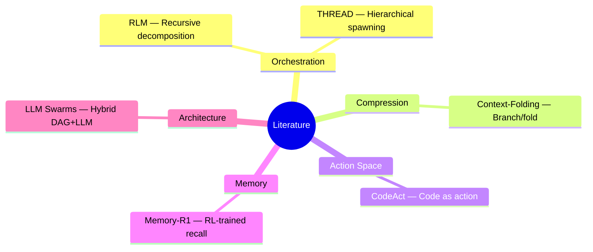
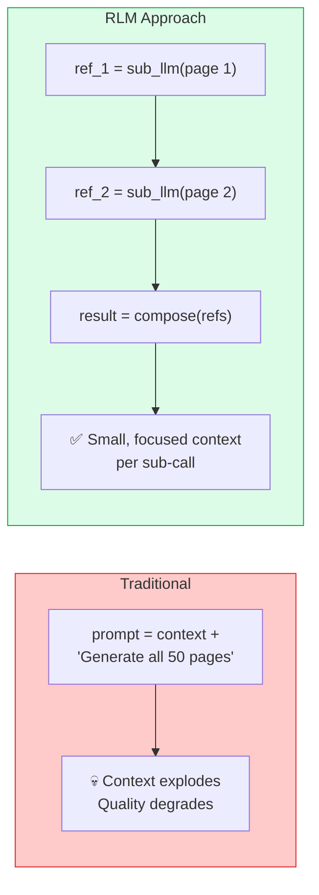
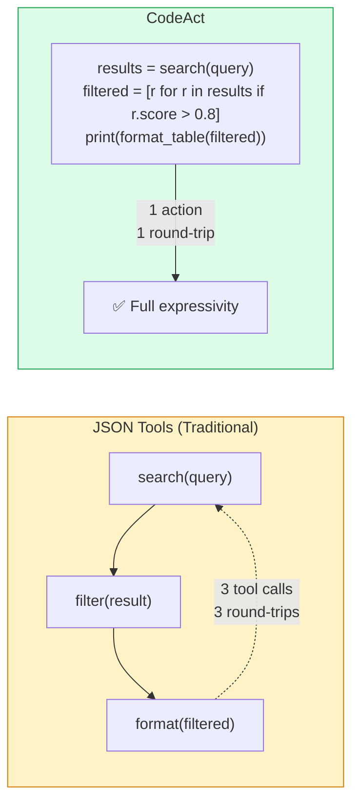
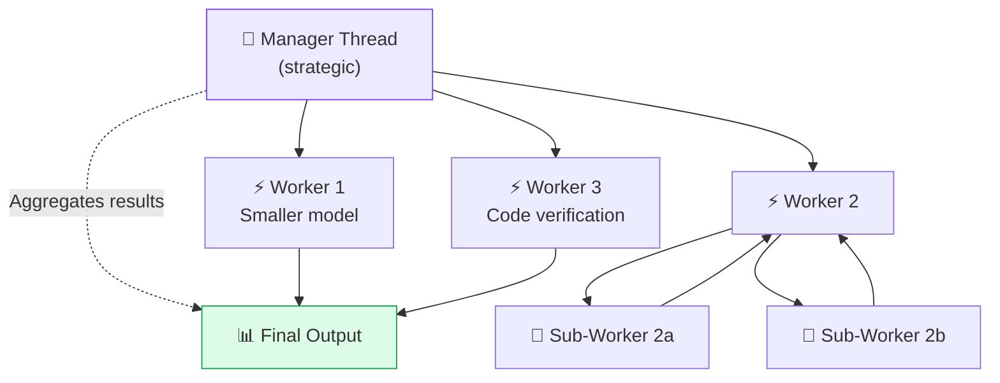
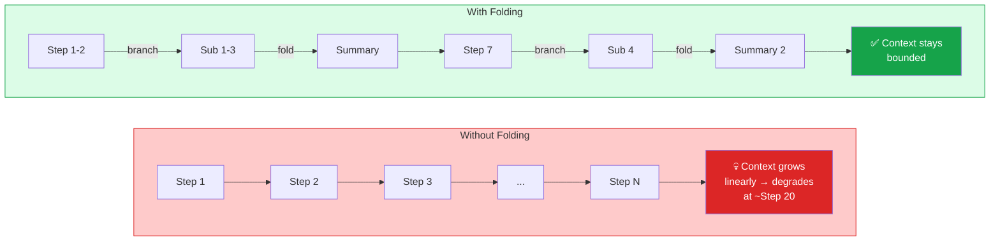
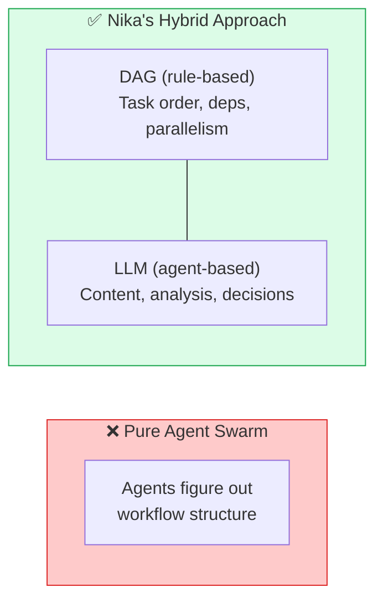
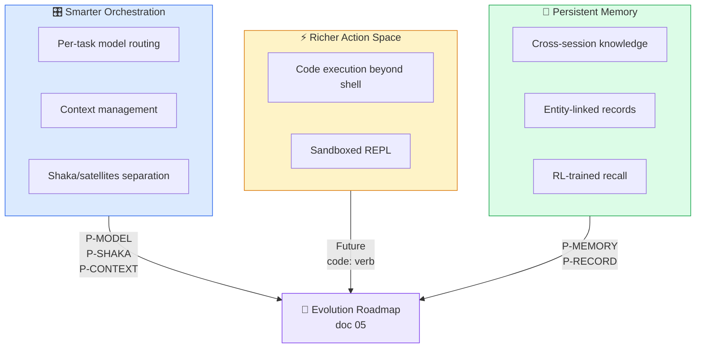

# 02 — Scientific Literature Synthesis

> Key papers and techniques relevant to Nika's evolution.
> 6 papers analyzed. 3 evolution axes identified.

**Nika** v0.27.0 · **NovaNet** v0.20.0 · Updated 2026-03-14

---

## Paper Map

---

## 1. RLM — Recursive Language Models[^1]

**Paper:** Xu et al. — Recursive decomposition with REPL as external working memory (MIT, 2025)

### Core Idea

An 8B-parameter model matches GPT-4-level performance on long-context tasks by using a **REPL as external working memory**:

1. **Decomposes** complex tasks into sub-problems
2. **Executes** sub-problems in a REPL (Python/shell)
3. **Stores** intermediate results in variables (reference semantics)
4. **Composes** final output from stored references

### Relevance to Nika

| RLM Concept | Nika Equivalent | Gap |
|-------------|----------------|-----|
| REPL as working memory | `Egghead` + `use:` bindings | Nika already has this |
| Recursive sub-LM calls | `spawn_agent` (depth_limit 3-10) | Exists but static DAG |
| Reference semantics | `$task` implicit output refs | Fully implemented |
| Task decomposition | `decompose:` modifier | Exists via MCP traversal |
| Variable persistence | `store/mod.rs` DashMap | In-memory only (no cross-session) |

> [!TIP]
> **Verdict:** Nika already implements ~70% of RLM patterns. The main gap is **dynamic DAG generation** — the ability for an agent to generate new workflow steps at runtime rather than following a pre-defined YAML.

---

## 2. CodeAct[^2]

**Paper:** Wang et al. — "Executable Code Actions Elicit Better LLM Agents" (ICML 2024, 451 citations)

### Core Idea

Instead of LLMs choosing from fixed JSON tool schemas, let them **write executable code** (Python) as their action space:
- **+20% success rate** vs JSON/function-calling on benchmark tasks
- More expressive: loops, conditionals, composition in a single action

### Relevance to Nika

| CodeAct Concept | Nika Equivalent | Gap |
|-----------------|----------------|-----|
| Code as action | `exec:` verb | Limited to shell, not Python REPL |
| Multi-step composition | `for_each` + `flows:` | DAG is static, not generated by LLM |
| Self-debugging | Structured Output retry (layers 3-4) | Only for format, not logic |
| Tool composition | Transform engine pipes | 30+ ops but not arbitrary code |

> [!NOTE]
> **Opportunity:** A `code:` verb or enriched `exec:` mode with a sandboxed REPL (Pyodide, Deno, or WASM) would give agents CodeAct-level expressivity while maintaining Nika's security model.

---

## 3. THREAD[^3]

**Paper:** "Thinking Hierarchically for Resource-Efficient Agent Decision-making" — arXiv:2405.17402

### Core Idea

Hierarchical task decomposition with **recursive thread spawning**. A manager thread creates worker threads for sub-tasks, achieving **10-50% improvement** on complex tasks using smaller models.

### Key Features

1. **Strategy/Tactics separation:** Manager plans, workers execute
2. **Recursive spawning:** Workers can spawn sub-workers (depth-limited)
3. **Resource-aware:** Different models for different complexity levels
4. **Context compression:** Each thread maintains only relevant context

### Relevance to Nika

| THREAD Concept | Nika Equivalent | Gap |
|----------------|----------------|-----|
| Manager thread | `agent:` verb orchestrator | No explicit shaka/satellites split |
| Worker threads | `spawn_agent` sub-agents | Implemented (depth 3-10) |
| Recursive spawning | `SpawnAgentTool` | Done, but no model routing |
| Resource allocation | Single `provider:` per workflow | **No per-task model selection** |
| Context compression | None | **Major gap** |

> [!WARNING]
> **Three critical gaps:** per-task model routing, context compression, and shaka/satellites separation. These map directly to priorities P-MODEL, P-RECORD, and P-SHAKA in the [Evolution Roadmap](./05-evolution-roadmap.md).

---

## 4. Context-Folding[^4]

**Paper:** "Compressing Agent Trajectories with Branch-and-Fold" — arXiv:2510.11967 (2025)

### Core Idea

Agent trajectories grow linearly with each step, degrading performance. Context-Folding introduces **branch/fold operations**:

1. **Branch:** Fork a sub-trajectory for a focused sub-task
2. **Execute:** Run the sub-task with minimal context
3. **Fold:** Compress the sub-trajectory result back into parent
4. **Continue:** Parent proceeds with compressed summary, not full trace

**Impact:** 10x smaller active context, quality maintained or improved.

### Relevance to Nika

| Concept | Nika Equivalent | Gap |
|---------|----------------|-----|
| Branch | `spawn_agent` creates child agent | Exists |
| Fold | `use: { result: $child }` | Manual, no compression |
| Sub-trajectory | Agent turn history | No automatic folding |
| Context bounds | `max_turns` per agent | Blunt instrument |

> [!TIP]
> **Verdict:** Nika spawns child agents but doesn't compress their results. Implementing automatic **result folding** (LLM-summarized output from child agents) maps to P-RECORD in the [Evolution Roadmap](./05-evolution-roadmap.md).

---

## 5. LLM-Powered Swarms[^5]

**Paper:** "From Rule-Based to LLM-Powered: A Comparative Study of Swarm Intelligence" — arXiv:2506.14496 (2025)

### Core Findings

1. **Rule-based swarms** (PSO, ant colony, boids) are orders of magnitude faster for optimization
2. **LLM swarms** excel at **creative, open-ended tasks** where rules can't be pre-defined
3. **Hybrid approach** is optimal: rules for structure, LLM for decisions

### Relevance to Nika

| Finding | Nika Implication |
|---------|--------------------|
| Rule-based is faster | Keep DAG orchestration, don't go pure-swarm |
| LLM for creativity | `infer:` and `agent:` verbs cover this |
| Hybrid is optimal | Nika IS hybrid (DAG + LLM). Lean into it |
| Swarm communication | Inter-agent messaging not implemented |

> [!NOTE]
> **Validation:** The Swarms paper confirms Nika's hybrid DAG+LLM architecture is the right approach. Nika should NOT go pure-swarm.

---

## 6. Memory-R1[^6]

**Paper:** RL-trained agent memory policies — arXiv:2508.19828 (2025)

Reinforcement learning for agent memory management. Agents learn when to store, retrieve, and forget information across episodes.

**Relevance:** If Nika adds cross-session memory (P-MEMORY), Memory-R1's approach of RL-trained memory policies is more effective than simple retrieval. See [Evolution Roadmap — P-MEMORY](./05-evolution-roadmap.md#p-memory-novanet-episodic-memory).

---

## Synthesis: Three Evolution Axes

### Impact × Effort Matrix

| | High Impact + Low Effort | High Impact + Medium Effort | High Impact + High Effort |
|---|---|---|---|
| **Papers** | THREAD, Context-Folding | RLM, THREAD | CodeAct, Memory-R1 |
| **Priorities** | Per-task model routing, result compression | Dynamic DAG, shaka/satellites | Code sandbox, episodic memory + RL |

### What the Literature Validates

The literature consistently validates three things Nika already does right:
1. **Hybrid DAG+LLM architecture** — Swarms paper confirms this outperforms pure-swarm
2. **Reference semantics via Egghead** — RLM paper's core insight, already implemented
3. **Recursive spawning with depth limits** — THREAD paper's approach, already in `SpawnAgentTool`

---

[← 01 Current Features](./01-current-features.md) · [📋 Index](./00-README.md) · [03 Competitive Landscape →](./03-competitive-landscape.md)

---

[^1]: RLM: Recursive Language Models — [arXiv:2512.24601](https://arxiv.org/abs/2512.24601) (MIT, 2025). Recursive sub-LM calls with external working memory.
[^2]: CodeAct: Code Actions for LLM Agents — [arXiv:2402.01030](https://arxiv.org/abs/2402.01030) (ICML 2024, Wang et al.). Executable code as unified action space.
[^3]: THREAD: Thinking Hierarchically for Resource-Efficient Agent Decision-making — [arXiv:2405.17402](https://arxiv.org/abs/2405.17402). Hierarchical decomposition with recursive spawning.
[^4]: Context-Folding: Scaling Long-Horizon LLM Agent — [arXiv:2510.11967](https://arxiv.org/abs/2510.11967) (2025). Branch/fold sub-trajectory compression.
[^5]: From Rule-Based to LLM-Powered: A Comparative Study of Swarm Intelligence — [arXiv:2506.14496](https://arxiv.org/abs/2506.14496) (2025).
[^6]: Memory-R1: RL-trained agent memory policies — [arXiv:2508.19828](https://arxiv.org/abs/2508.19828) (2025).
