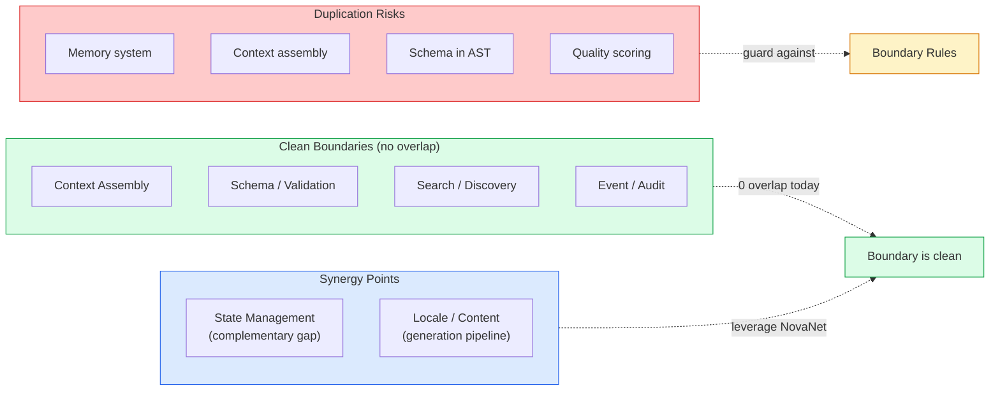
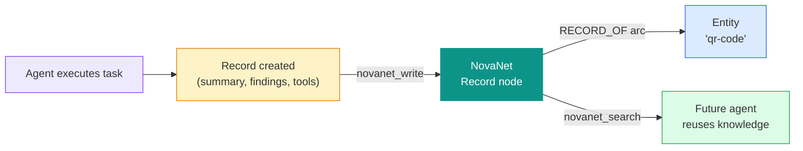
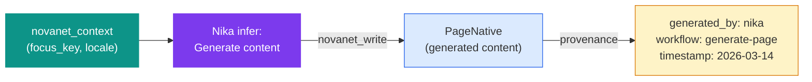
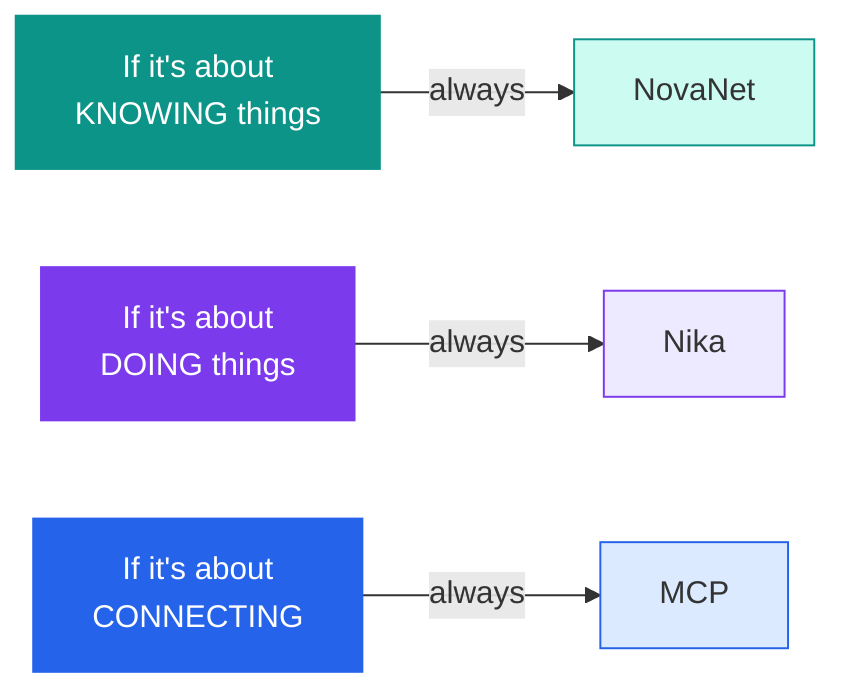

# 04 — Nika x NovaNet Overlap Analysis

> Identifying duplication, synergies, and boundary decisions.
> 6 overlap areas analyzed. 4 duplication risks mapped. 4 synergy opportunities identified.

**Nika** v0.27.0 · **NovaNet** v0.20.0 · Updated 2026-03-14

---

## Architecture Recap


> [!IMPORTANT]
> **Rule (ADR-003):** Nika NEVER accesses Neo4j directly. All graph interaction flows through MCP. Zero Cypher in Nika — MCP is the abstraction boundary.

---

## Overlap Areas

### 1. Context Assembly

| Capability | NovaNet | Nika | Verdict |
|-----------|---------|------|---------|
| Context assembly for LLM | `novanet_context` (4 modes) | `context:` file loading | **Complementary** |
| Token budgeting | `token_budget` param in context | None | NovaNet owns this |
| Evidence ranking | `novanet_context` auto-ranks | None | NovaNet owns this |
| File loading | None | `context: { files: ... }` | Nika owns this |
| Session restore | None | `context: { session: ... }` | Nika owns this |

> [!NOTE]
> **No duplication.** NovaNet assembles **graph-based context** (entities, knowledge atoms, page structure). Nika assembles **file-based context** (markdown, JSON, YAML from disk). They combine naturally in workflows.

<details>
<summary>Example: Complementary context assembly</summary>

```yaml
tasks:
  - id: graph_ctx
    invoke: novanet_context
    params: { focus_key: "homepage", locale: "fr-FR", mode: page }

  - id: file_ctx
    # Nika's own context (from disk)
    context:
      files:
        brand: ./context/brand.md

  - id: generate
    use:
      graph: $graph_ctx
      brand: "{{context.files.brand}}"
    infer: "Generate using both: {{use.graph}} {{use.brand}}"
```

</details>

### 2. Schema / Validation

| Capability | NovaNet | Nika | Verdict |
|-----------|---------|------|---------|
| Schema definition | 59 NodeClasses, YAML source | `nika-workflow.schema.json` | **No overlap** |
| Schema validation | `novanet_write(dry_run=true)` | Two-phase AST analyzer | **No overlap** |
| Schema introspection | `novanet_introspect` | LSP diagnostics | **Different domains** |

> [!NOTE]
> **Zero overlap.** NovaNet validates graph data schemas. Nika validates workflow YAML schemas. Completely different domains.

### 3. Search / Discovery

| Capability | NovaNet | Nika | Verdict |
|-----------|---------|------|---------|
| Entity search | `novanet_search` (5 modes) | None | NovaNet only |
| File search | None | `nika:glob`, `nika:grep` | Nika only |
| Tool discovery | `list_tools()` (MCP server) | `list_tools()` (MCP client) | **MCP protocol** |

> [!NOTE]
> **No duplication.** NovaNet searches graph data. Nika searches filesystem. Tool discovery is the MCP protocol itself.

### 4. State Management

| Capability | NovaNet | Nika | Verdict |
|-----------|---------|------|---------|
| Persistent state | Neo4j (durable) | Egghead (in-memory) | **Gap in Nika** |
| Cross-session | Graph persists forever | Session files only | **Gap in Nika** |
| Concurrent access | Neo4j transactions | DashMap lock-free | Both handle concurrency |

> [!TIP]
> **Complementary gap, not overlap.** NovaNet has durable state (Neo4j). Nika's state is ephemeral (DashMap, session files). Nika should use NovaNet to persist cross-session agent memory — see [P-MEMORY in doc 05](./05-evolution-roadmap.md).

### 5. Event / Audit

| Capability | NovaNet | Nika | Verdict |
|-----------|---------|------|---------|
| Quality audit | `novanet_audit` (CSR metrics) | None | NovaNet only |
| Event sourcing | None | 34 EventKind variants | Nika only |
| Trace storage | None | NDJSON files | Nika only |
| Data lineage | Arc-based provenance | None | NovaNet only |

> [!NOTE]
> **No overlap.** NovaNet audits data quality. Nika traces execution. Synergy opportunity: Nika could log generation events TO NovaNet for content lineage.

### 6. Locale / Content

| Capability | NovaNet | Nika | Verdict |
|-----------|---------|------|---------|
| Locale definitions | Shared realm locale layer | None | NovaNet only |
| Knowledge atoms | Expression, Pattern, CultureRef, Taboo | None | NovaNet only |
| Content generation | PageNative, BlockNative (output) | `infer:` verb | **Synergy point** |
| Content validation | Denomination forms (6 types) | Structured output (4 layers) | **Complementary** |

> [!NOTE]
> **Synergy, not overlap.** NovaNet supplies context → Nika generates → NovaNet stores result. The only risk is if Nika started building its own locale awareness, which it must NOT.

---

## Overlap Verdict



---

## Potential Duplication Risks

> [!WARNING]
> **Risk 1: Memory / State Duplication**
>
> Nika builds its own episodic memory system (P-MEMORY) that duplicates NovaNet's entity/knowledge storage.
>
> **Recommendation:** Nika's episodic memory follows a 3-tier architecture: HOT (Egghead DashMap RAM, single run), WARM (Punk Records NDJSON on disk, TTL configurable, managed by `RecordLog`), COLD (NovaNet `Record` node class, permanent, promoted records only). Nika writes promoted records via `novanet_write`, reads via `novanet_search`. NovaNet handles permanent persistence, search, and cleanup for the COLD tier only.
>
> **Why:** Most records live locally in Punk Records (WARM tier). Only high-value records are promoted to NovaNet (COLD tier) for cross-run, cross-agent reuse. NovaNet is not the whole memory system — it's the durable, graph-queryable long-term store.

> [!WARNING]
> **Risk 2: Context Assembly Duplication**
>
> Nika evolves its `context:` system to include entity awareness, essentially rebuilding `novanet_context`.
>
> **Recommendation:** Keep `context:` for FILE-based context only. All graph-based context goes through `novanet_context`. Never add entity/locale/knowledge awareness to Nika.
>
> **Why:** NovaNet's context assembly has token budgeting, evidence ranking, and spreading activation. Rebuilding this in Nika would be inferior.

> [!WARNING]
> **Risk 3: Schema Duplication**
>
> Nika adds graph schema concepts (node types, arcs) to its workflow DSL for `decompose:` or routing.
>
> **Recommendation:** Keep graph schema knowledge in NovaNet only. Nika uses `novanet_introspect` to discover schema at runtime. `decompose:` strategy should call `novanet_search(mode=walk)`. Never hardcode NovaNet schema in Nika's AST.
>
> **Why:** Schema changes in NovaNet (59 → N nodes) shouldn't require Nika code changes. MCP is the abstraction.

> [!WARNING]
> **Risk 4: Audit Duplication**
>
> Nika builds its own quality scoring for generated content instead of using `novanet_audit` CSR metrics.
>
> **Recommendation:** Generated content quality → `novanet_audit`. Workflow execution quality → Nika event analysis. Content stored in NovaNet → NovaNet audits it. Execution traces in Nika → Nika monitors them.
>
> **Why:** Content quality depends on entity coverage, locale completeness, and graph integrity — all NovaNet concerns.

---

## Synergy Opportunities

### Opportunity 1: Agent Records in NovaNet

Maps to [P-MEMORY](./05-evolution-roadmap.md) and [P-RECORD](./05-evolution-roadmap.md) in the Evolution Roadmap.



<details>
<summary>Workflow example</summary>

```yaml
# Future: Agent writes its experience to NovaNet
tasks:
  - id: research
    agent:
      prompt: "Research QR code trends"
      episodic_memory: true  # NEW: persist to NovaNet

  # Automatically creates:
  # Record node in NovaNet with:
  #   - task_summary, key_findings, tools_used
  #   - linked to Entity "qr-code" via RECORD_OF arc
  #   - searchable for future similar tasks
```

</details>

### Opportunity 2: Generation Lineage

Track what Nika generated, how, and with what context — full provenance chain.



<details>
<summary>Workflow example</summary>

```yaml
# Future: Track what Nika generated and how
tasks:
  - id: generate_page
    invoke: novanet_context
    params: { focus_key: "homepage", locale: "fr-FR" }

  - id: write_content
    use:
      ctx: $generate_page
    infer: "Generate landing page"
    # After generation, auto-invoke:
    # novanet_write(class="PageNative", properties={content: result})
    # With provenance: generated_by="nika", workflow="generate-page.nika.yaml"
```

</details>

### Opportunity 3: Smart Model Routing via NovaNet

NovaNet stores model performance data; Nika queries it for routing decisions.

<details>
<summary>Workflow example</summary>

```yaml
# Future: NovaNet stores model performance data
# Nika queries it for routing decisions
tasks:
  - id: route
    invoke: novanet_search
    params:
      query: "model performance for translation tasks"
      kinds: ["ModelBenchmark"]  # New NodeClass

  - id: translate
    use:
      model: "$route.best_model"
    infer: "Translate to French"
    provider: "{{use.model.provider}}"
```

</details>

### Opportunity 4: Decompose via Graph Structure

Already partially implemented — `decompose:` uses NovaNet's graph to expand the DAG at runtime.

<details>
<summary>Workflow example</summary>

```yaml
# decompose: uses NovaNet's graph to expand DAG
tasks:
  - id: generate_all
    decompose:
      strategy: semantic
      traverse: HAS_CHILD  # NovaNet arc
      source: $entity
      max_items: 10         # Optional limit
    infer: "Generate for {{use.item}}"
```

</details>

---

## Boundary Rules

> [!IMPORTANT]
> **The Golden Rule** — Five lines that govern every architectural decision. See also [doc 00](./00-README.md).

```mermaid
flowchart TB
    subgraph NIKA_OWNS["Nika Owns (DOING)"]
        direction TB
        N1["Workflow definition & execution"]
        N2["LLM provider management & inference"]
        N3["DAG construction, validation, scheduling"]
        N4["Agent loop, spawning, tool routing"]
        N5["File-based context loading"]
        N6["Execution traces & event sourcing"]
        N7["TUI & developer experience"]
        N8["Transform engine & data binding"]
        N9["Security (shell exec, path validation)"]
    end

    subgraph NN_OWNS["NovaNet Owns (KNOWING)"]
        direction TB
        V1["Entity & content storage (all NodeClasses)"]
        V2["Locale intelligence (atoms, forms, culture)"]
        V3["Graph-based context assembly (token budget)"]
        V4["Schema definition & validation"]
        V5["Content quality audit (CSR metrics)"]
        V6["Search & discovery (fulltext, property, walk)"]
        V7["Data lineage & provenance"]
        V8["Cross-session durable state"]
    end

    subgraph MCP_SHARED["Shared via MCP (CONNECTING)"]
        direction TB
        M1["Tool discovery (list_tools)"]
        M2["Context requests (novanet_context)"]
        M3["Data writes (novanet_write)"]
        M4["Schema introspection (novanet_introspect)"]
    end

    subgraph NEVER["Never Duplicate"]
        direction TB
        X1["Entity/locale awareness in Nika"]
        X2["Graph schema in Nika AST"]
        X3["Workflow execution in NovaNet"]
        X4["LLM inference in NovaNet"]
    end

    NIKA_OWNS <-->|"JSON-RPC 2.0"| MCP_SHARED
    MCP_SHARED <-->|"JSON-RPC 2.0"| NN_OWNS

    style NIKA_OWNS fill:#ede9fe,stroke:#7c3aed
    style NN_OWNS fill:#ccfbf1,stroke:#0d9488
    style MCP_SHARED fill:#dbeafe,stroke:#2563eb
    style NEVER fill:#fecaca,stroke:#dc2626
```



---

## Summary

The Nika/NovaNet boundary is clean today. The main evolution risk is Nika building parallel systems (memory, context, quality) instead of leveraging NovaNet.



> [!TIP]
> **Overlap scorecard:** 0 of 6 areas have duplication today. 4 risks identified and mitigated via boundary rules. 4 synergy opportunities mapped to [Evolution Roadmap priorities](./05-evolution-roadmap.md).

---

<div align="center">

[← 03 Competitive Landscape](./03-competitive-landscape.md) · [📋 Index](./00-README.md) · [05 Evolution Roadmap →](./05-evolution-roadmap.md)

</div>
