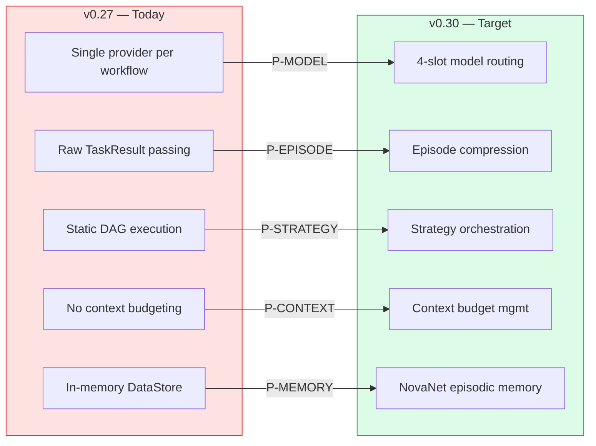
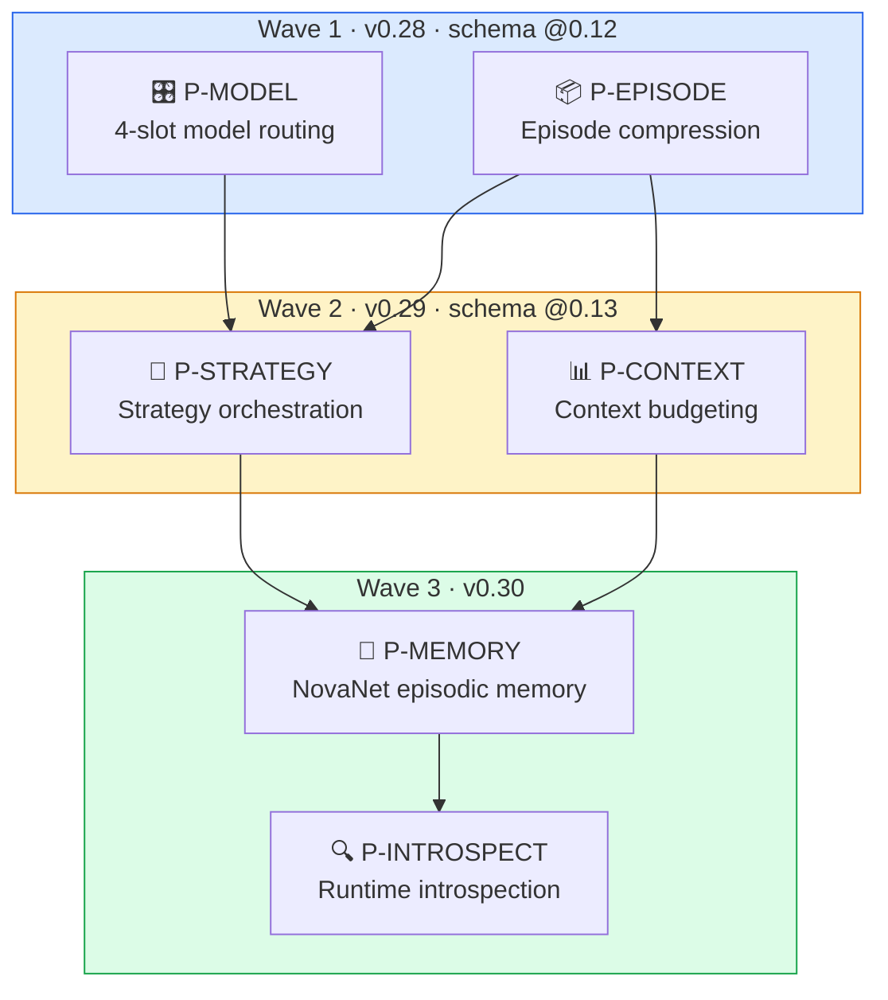
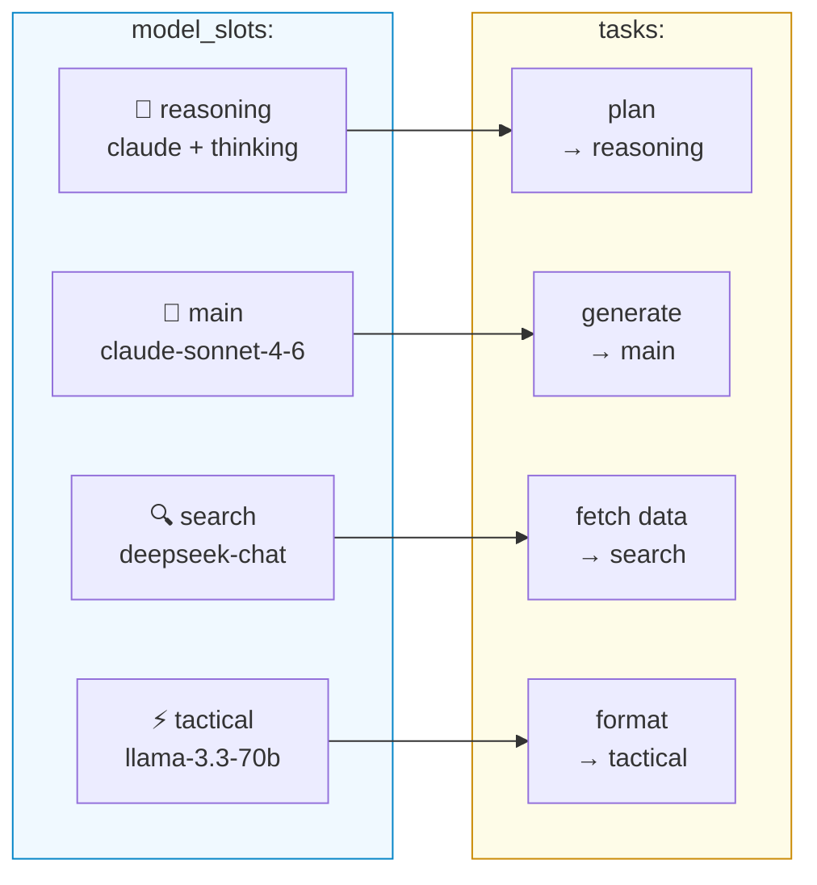
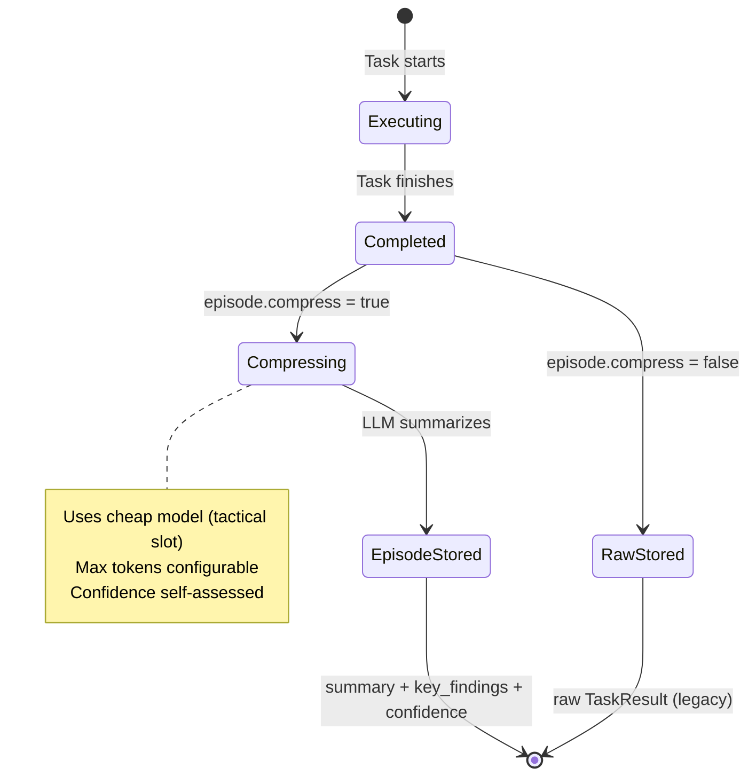
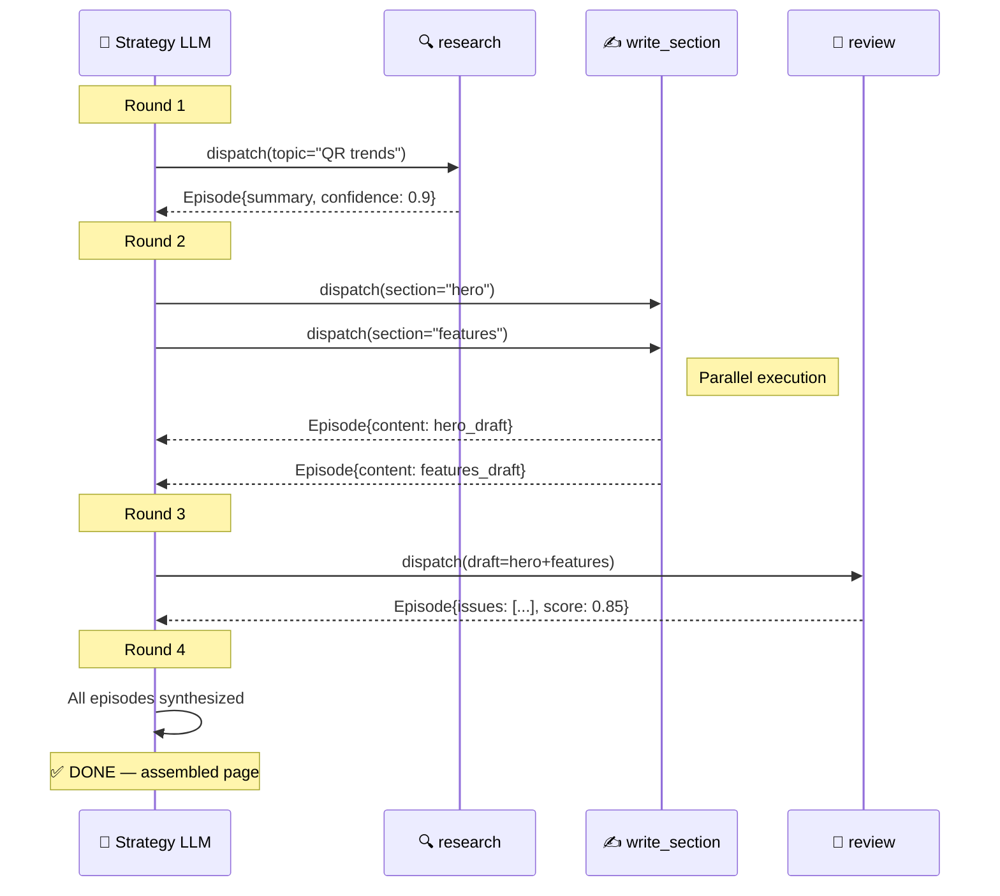
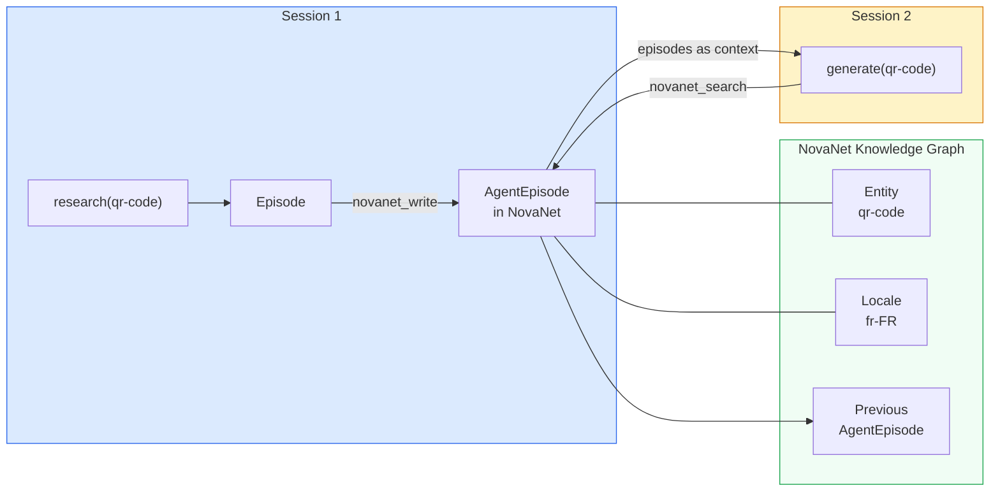
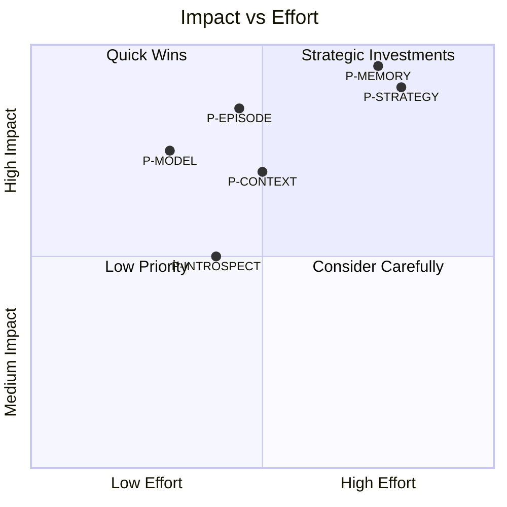

# 05 — Evolution Roadmap

> 6 priorities in 3 waves — from Nika v0.27 to v0.30.
> Centered on Slate's thread/episode architecture, adapted for YAML-first declarative workflows.

**Nika** v0.27.0 · **NovaNet** v0.20.0 · Updated 2026-03-14

---

## Overview



> [!IMPORTANT]
> **Core insight** — Nika's DAG IS Slate's kernel. `AnalyzedWorkflow` IS the OS. `TaskResult` IS return values. `DataStore` IS RAM. We don't BUILD Slate — we UPGRADE the kernel with 4 additions, then persist via NovaNet.

---

## The 6 Priorities



> [!NOTE]
> **Old P3 (ConfidenceRouter) absorbed** — Confidence is now an episode property. The strategy LLM handles escalation naturally, with full context, rather than a rigid router with fixed rules.

---

## Wave 1: Thread Foundation (v0.28, schema @0.12)

### P-MODEL: 4-Slot Model Architecture

Route different cognitive tasks to different providers/models. Inspired by Slate's cross-model composition (Sonnet + Codex)[^1], adapted as named slots per-workflow.



**Current state** → After:

| Aspect | Today (v0.27) | After (v0.28) |
|--------|---------------|---------------|
| Provider scope | Single per workflow | 4 named slots per workflow |
| Per-task override | Not supported | `model_slot:` reference |
| Cost optimization | None | Route simple tasks to cheap models |
| Provider resolution | `RigProvider::auto()` | `RigProvider::from_slot()` |

<details>
<summary>📐 YAML Design</summary>

```yaml
schema: nika/workflow@0.12

model_slots:
  main:
    provider: anthropic
    model: claude-sonnet-4-6
    # For: primary content generation, complex reasoning

  tactical:
    provider: groq
    model: llama-3.3-70b-versatile
    # For: simple thread execution, tactical actions

  search:
    provider: deepseek
    model: deepseek-chat
    # For: research, search synthesis, information retrieval

  reasoning:
    provider: anthropic
    model: claude-sonnet-4-6
    extended_thinking: true
    thinking_budget: 16384
    # For: strategy, planning, review, critique

default_model_slot: main

tasks:
  - id: plan
    model_slot: reasoning         # Expensive deep-thinking model
    infer: "Create a content plan for {{use.entity}}"

  - id: generate_pages
    model_slot: tactical          # Cheap fast model
    for_each: $pages
    infer: "Generate page {{use.item}}"

  - id: review
    model_slot: reasoning         # Back to expensive model
    infer: "Review all generated pages for quality"
```

**Why per-workflow, not global**: Different workflows have different cost/quality tradeoffs. A content generation workflow uses expensive models. An audit workflow uses cheap models. Slate's global config can't express this.

</details>

<details>
<summary>🔧 Implementation</summary>

| Change | Location | Effort |
|--------|----------|--------|
| `ModelSlot` struct | `ast/raw/model_slot.rs` (NEW) | Low |
| `model_slots:` field | `ast/raw/workflow.rs` | Low |
| `model_slot:` field | `ast/raw/task.rs` | Low |
| Slot validation | `ast/analyzer/analyze.rs` | Low |
| `from_slot()` constructor | `provider/rig.rs` | Medium |
| Slot resolution per task | `runtime/executor.rs` | Medium |
| Schema bump | `schemas/nika-workflow.schema.json` → @0.12 | Low |
| Feature gate | `ast/analyzer/feature_gate.rs` | Low |

**Breaking changes:** None — new optional fields, old workflows unchanged.

</details>

<details>
<summary>📚 Source Inspiration</summary>

- **Slate:** Cross-model composition — uses Sonnet + Codex together for different cognitive tasks[^1]. The "4 named slots" design (main/tactical/search/reasoning) is our proposal.
- **THREAD:** Resource-aware model allocation per subtask[^2]
- **SWE-bench:** Different models excel at different cognitive tasks

</details>

---

### P-EPISODE: Episode Engine

Compressed representation of a task's execution, generated at the natural completion boundary. Downstream tasks receive **episodes**, not raw output. This is Slate's core innovation[^1].



**Current state** → After:

| Aspect | Today (v0.27) | After (v0.28) |
|--------|---------------|---------------|
| Task output | Raw `TaskResult` in `DataStore` | `Episode` struct with compression |
| Context passing | Full output via `use:` bindings | Episode summaries via `use:` bindings |
| Context growth | Linear with pipeline depth | Bounded by episode `max_tokens` |
| Observability | `TaskCompleted` event | `TaskCompleted` + `EpisodeCreated` events |
| Confidence | Not tracked | Self-assessed `0.0-1.0` per episode |

<details>
<summary>📐 YAML Design</summary>

```yaml
tasks:
  - id: research_trends
    model_slot: search
    infer: "Research QR code trends in 2026"
    episode:
      compress: true           # Generate episode summary after execution
      retain: [key_findings]   # What to keep from raw output
      max_tokens: 500          # Episode summary size limit
      confidence_threshold: 0.8 # Strategy can escalate if below
```

</details>

<details>
<summary>🦀 Rust Data Structure</summary>

```rust
/// Compressed representation of a task's execution.
/// Generated at the natural completion boundary (not mid-stream).
pub struct Episode {
    pub task_id: TaskId,
    pub summary: String,           // LLM-compressed summary
    pub key_findings: Vec<String>, // Extracted key points
    pub raw_output: Option<String>,// Original (debug only, not passed downstream)
    pub model_used: String,        // Which model produced this
    pub tokens_spent: u64,         // Cost tracking
    pub confidence: f64,           // Self-assessed (0.0-1.0)
    pub artifacts: Vec<Artifact>,  // Files produced
}
```

**Location:** `src/runtime/episode.rs` (NEW)

</details>

<details>
<summary>🔁 Confidence Replaces Old P3 (ConfidenceRouter)</summary>

```
Old approach (ConfidenceRouter):
  Task → Tier 1 model → confidence < threshold? → Tier 2 model
  Rigid. Fixed rules. No context.

New approach (Episode confidence):
  Task → Episode (with confidence) → Strategy LLM sees low confidence
  → Strategy DECIDES: retry with better model? get more context? skip?
  Adaptive. Full context. Natural escalation.
```

</details>

<details>
<summary>🔧 Implementation</summary>

| Change | Location | Effort |
|--------|----------|--------|
| `Episode` struct | `runtime/episode.rs` (NEW) | Medium |
| `EpisodeCompressor` (LLM-based) | `runtime/episode_compress.rs` (NEW) | Medium |
| `episode:` field | `ast/raw/task.rs` | Low |
| Episode generation after completion | `runtime/executor.rs` | Medium |
| Episode storage | `store/mod.rs` | Low |
| Episode-aware binding resolution | `binding/resolve.rs` | Medium |
| `EpisodeCreated` event kind | `event/log.rs` | Low |

**Quality risk:** Compression quality depends on LLM summarization ability. Mitigated by using the `retain:` field for explicit key extraction.

</details>

<details>
<summary>📚 Source Inspiration</summary>

- **Slate:** Episodes — compressed at natural completion boundary[^1]
- **Context-Folding:** Sub-trajectory compression for reduced context[^3]
- **Memory-R1:** RL-trained memory policies with confidence scoring[^4]

</details>

---

## Wave 2: Strategy Intelligence (v0.29, schema @0.13)

### P-STRATEGY: Strategy Orchestration

A new workflow execution mode where a **strategy LLM** dynamically dispatches **tactic tasks** based on the goal and accumulated episodes. This is Slate's thread weaving[^1]: implicit adaptive decomposition via an orchestrator loop.



**Current state** → After:

| Aspect | Today (v0.27) | After (v0.29) |
|--------|---------------|---------------|
| Execution mode | Static DAG only | `dag` (default) or `strategy` |
| Task dispatch | All known at parse time | Dynamic by strategy LLM |
| Inter-task data | Raw `use:` bindings | Episode synthesis between rounds |
| Stopping condition | DAG completed | Strategy LLM decides "DONE" |
| DAG mutation | Immutable after parse | `DynamicDag` adds tasks at runtime |

<details>
<summary>📐 YAML Design</summary>

```yaml
schema: nika/workflow@0.13
workflow: landing-page-generator

orchestration: strategy    # NEW: enables strategy/tactics mode

model_slots:
  reasoning: { provider: anthropic, model: claude-sonnet-4-6, extended_thinking: true }
  main: { provider: anthropic, model: claude-sonnet-4-6 }
  search: { provider: groq, model: llama-3.3-70b-versatile }
  tactical: { provider: deepseek, model: deepseek-chat }

strategy:
  goal: "Generate a complete French landing page for QR Code AI"
  model_slot: reasoning
  max_rounds: 10
  episode_budget: 15000    # Total token budget across all episodes

# Tactic templates — dispatched dynamically by strategy
tasks:
  - id: research
    model_slot: search
    infer: "Research: {{use.topic}}"
    episode: { compress: true, max_tokens: 300 }

  - id: write_section
    model_slot: main
    infer: "Write: {{use.section}} using context: {{use.context}}"
    episode: { compress: true, retain: [content], max_tokens: 800 }

  - id: review
    model_slot: reasoning
    infer: "Review and critique: {{use.draft}}"
    episode: { compress: true, retain: [issues, suggestions] }
```

</details>

<details>
<summary>🔧 Implementation</summary>

| Change | Location | Effort |
|--------|----------|--------|
| `StrategyOrchestrator` struct | `runtime/strategy.rs` (NEW) | **High** |
| `TacticTemplate`, `TacticInstance` | `runtime/tactic.rs` (NEW) | Medium |
| `DynamicDag` (mutable DAG) | `dag/dynamic.rs` (NEW) | **High** |
| `orchestration:` + `strategy:` fields | `ast/raw/workflow.rs` | Low |
| Strategy mode routing | `runtime/runner.rs` | Medium |
| Mutable DAG operations | `dag/mod.rs` | Medium |
| Strategy visualization in TUI | `tui/views/runner.rs` | Medium |
| Schema bump | `schemas/nika-workflow.schema.json` → @0.13 | Low |

**Dependencies:** Requires P-MODEL + P-EPISODE (Wave 1) as foundation.

</details>

<details>
<summary>📚 Source Inspiration</summary>

- **Slate:** Thread weaving — implicit adaptive decomposition[^1]
- **Slate:** Strategy/tactics separation, AlphaZero mapping (value network = strategy, policy network = tactics)[^5]
- **THREAD:** Hierarchical decomposition with resource-aware model selection[^2]
- **RLM:** Recursive sub-LM calls with external working memory[^6]

</details>

---

### P-CONTEXT: Context Budget Management

Working memory awareness at the runtime level. Each task declares its context budget. The runtime enforces this by passing only episode summaries — never raw history.

```mermaid
flowchart TB
    subgraph BEFORE["Without P-CONTEXT"]
        B1["Task A output\n2,000 tokens"] --> B2["Task B receives\nfull 2,000 tokens"]
        B2 --> B3["Task C receives\nA + B = 4,000 tokens"]
        B3 --> B4["Task D receives\nA+B+C = 6,000+ tokens"]
        B4 --> B5["💀 Dumb Zone\nContext degradation"]
    end

    subgraph AFTER["With P-CONTEXT"]
        A1["Task A → Episode\n300 tokens"] --> A2["Task B receives\nepisode = 300 tokens"]
        A2 --> A3["Task C receives\nA_ep + B_ep = 600 tokens"]
        A3 --> A4["Task D receives\nrelevant episodes only"]
        A4 --> A5["✅ Working Memory\nAlways within budget"]
    end

    style BEFORE fill:#fee2e2,stroke:#dc2626
    style AFTER fill:#dcfce7,stroke:#16a34a
    style B5 fill:#dc2626,color:#fff
    style A5 fill:#16a34a,color:#fff
```



> [!WARNING]
> **Context degradation** is the root cause of agent failure. LLM performance degrades past the "dumb zone" threshold (Dex Horthy's term[^1]). P-CONTEXT prevents this structurally.

<details>
<summary>📐 YAML Design</summary>

```yaml
tasks:
  - id: research
    model_slot: search
    context_budget: 4000     # Max tokens in this task's context
    infer: "Research QR code trends"
    episode:
      compress: true
      max_tokens: 300        # Episode must fit in 300 tokens

  - id: generate
    model_slot: main
    context_budget: 8000     # Larger budget for generation
    use:
      trends: $research      # Receives episode, not raw output
    infer: "Generate landing page based on: {{use.trends}}"
```

**Rules:**
1. Each task receives ONLY: its prompt + relevant episodes + NovaNet context
2. Never raw history from other tasks
3. `context_budget` enforced by the runtime (truncate/warn if exceeded)
4. Strategy orchestrator manages which episodes to include per thread
5. Token budget tracked in events for observability

</details>

<details>
<summary>🔧 Implementation</summary>

| Change | Location | Effort |
|--------|----------|--------|
| `context_budget:` field | `ast/raw/task.rs` | Low |
| Budget enforcement | `runtime/executor.rs` | Medium |
| Token counting utilities | `runtime/context_budget.rs` (NEW) | Medium |
| Budget tracking in events | `event/log.rs` | Low |
| Strategy episode selection | `runtime/strategy.rs` | Medium |

**Accuracy note:** Token counting is approximate (tokenizer-dependent). Use conservative estimates.

</details>

---

## Wave 3: Persistent Memory (v0.30)

### P-MEMORY: NovaNet Episodic Memory

Persistent episodes stored in NovaNet's knowledge graph, linked to semantic entities. Episodes survive across sessions — enabling cross-session learning and knowledge overhang activation[^1].



> [!TIP]
> **Knowledge overhang** — Models have knowledge they can't access without scaffolding. Cross-session episodes provide that scaffolding, activating latent capabilities across sessions.

<details>
<summary>📐 YAML Design</summary>

```yaml
tasks:
  - id: research
    infer: "Research QR code trends"
    episode:
      compress: true
      persist: novanet        # Store episode in NovaNet
      entity_link: qr-code    # Link to semantic entity

  - id: generate
    use:
      past_experience: $recall_episodes  # Retrieved from NovaNet
    infer: |
      Generate a QR code landing page.
      Previous experience: {{use.past_experience}}
```

</details>

<details>
<summary>🏗️ NovaNet Schema Additions</summary>

```
AgentEpisode (NodeClass, org realm, output layer)
├── Properties:
│   ├── key: string (unique identifier)
│   ├── workflow: string (source workflow name)
│   ├── task_id: string (source task)
│   ├── summary: string (compressed episode)
│   ├── key_findings: string[] (extracted points)
│   ├── model_used: string
│   ├── tokens_spent: integer
│   ├── confidence: float
│   └── timestamp: datetime
├── Arcs:
│   ├── EPISODE_OF → Entity (semantic link)
│   ├── FOR_LOCALE → Locale (if locale-specific)
│   ├── SIMILAR_TO → AgentEpisode (similarity)
│   └── PRECEDED_BY → AgentEpisode (temporal chain)
```

**Requires:** NovaNet schema ADR + coordinated Nika/NovaNet development.

</details>

<details>
<summary>🔧 Implementation (5 Phases)</summary>

| Phase | What | Location |
|-------|------|----------|
| 1 | Episode data model | NovaNet schema YAML (ADR required) |
| 2 | Write episodes | Nika calls `novanet_write` after completion |
| 3 | Recall episodes | `novanet_search` for similar past runs |
| 4 | Inject in context | Recalled episodes in agent system prompt |
| 5 | Auto-learning | Pattern extraction from success/failure |

</details>

---

### P-INTROSPECT: Runtime Introspection Tools

New builtin tools that let agents query the current workflow's runtime state. The DAG becomes a first-class data structure that agents can reason about.

| Tool | Returns | Use Case |
|------|---------|----------|
| `nika:episodes` | `[{task_id, summary, confidence, tokens}]` | Query accumulated episodes |
| `nika:threads` | `[{task_id, status, model_slot}]` | List active/completed threads |
| `nika:strategy_state` | `{round, max_rounds, budget_used, budget_total}` | Check strategy progress |
| `nika:cost` | `{total_tokens, total_cost, per_model}` | Token usage and cost report |
| `nika:dag_info` | `{predecessors, successors, critical_path}` | DAG structure queries |
| `nika:task_status` | `{task_id, status, episode}` | Individual task status |

> [!NOTE]
> These 6 new tools join the existing 11 builtin tools (6 core + 5 file), bringing the total to 17. All read-only — agents cannot modify runtime state via introspection tools.

<details>
<summary>📐 YAML Design</summary>

```yaml
tasks:
  - id: adaptive_step
    agent:
      prompt: "Generate content, adapting based on what came before"
      tools:
        - nika:episodes       # Query accumulated episodes
        - nika:cost           # Check remaining budget
        - nika:strategy_state # Know current round
        - nika:dag_info       # Understand DAG structure
```

</details>

---

## Priority Matrix



---

## Version Mapping

| Priority | Version | Schema | New Files | Modified Files | Dependencies |
|----------|---------|--------|-----------|----------------|--------------|
| P-MODEL | v0.28.0 | @0.12 | 2 | 6 | None |
| P-EPISODE | v0.28.0 | @0.12 | 2 | 5 | None (ships with P-MODEL) |
| P-STRATEGY | v0.29.0 | @0.13 | 3 | 5 | P-MODEL + P-EPISODE |
| P-CONTEXT | v0.29.0 | @0.13 | 1 | 3 | P-EPISODE |
| P-MEMORY | v0.30.0 | @0.13 + NovaNet | 1 | 3 | P-EPISODE |
| P-INTROSPECT | v0.30.0 | — | 6 tools | 3 | P-EPISODE + P-STRATEGY |

---

## File Change Summary

<details>
<summary>📁 New Files (8)</summary>

| File | Priority | Purpose |
|------|----------|---------|
| `src/ast/raw/model_slot.rs` | P-MODEL | `ModelSlot` struct |
| `src/ast/analyzed/model_slot.rs` | P-MODEL | Analyzed slot with validation |
| `src/runtime/episode.rs` | P-EPISODE | `Episode` struct + lifecycle |
| `src/runtime/episode_compress.rs` | P-EPISODE | LLM-based compression |
| `src/runtime/strategy.rs` | P-STRATEGY | `StrategyOrchestrator` |
| `src/runtime/tactic.rs` | P-STRATEGY | `TacticTemplate`, `TacticInstance` |
| `src/dag/dynamic.rs` | P-STRATEGY | `DynamicDag` for runtime mutation |
| `src/runtime/episodic_memory.rs` | P-MEMORY | `EpisodicMemoryManager` |

</details>

<details>
<summary>📝 Modified Files (11)</summary>

| File | Priorities | Changes |
|------|-----------|---------|
| `src/ast/raw/workflow.rs` | P-MODEL, P-STRATEGY | `model_slots`, `orchestration`, `strategy` fields |
| `src/ast/raw/task.rs` | P-MODEL, P-EPISODE, P-CONTEXT | `model_slot`, `episode`, `context_budget` fields |
| `src/ast/analyzer/analyze.rs` | P-MODEL, P-EPISODE | Slot validation, episode config validation |
| `src/provider/rig.rs` | P-MODEL | `from_slot()` constructor |
| `src/runtime/executor.rs` | P-MODEL, P-EPISODE, P-CONTEXT | Slot routing, episode gen, budget enforcement |
| `src/runtime/runner.rs` | P-STRATEGY | Strategy mode routing |
| `src/store/mod.rs` | P-EPISODE | Episode storage in `DataStore` |
| `src/binding/resolve.rs` | P-EPISODE | Episode-aware resolution |
| `src/event/log.rs` | P-EPISODE, P-CONTEXT | `EpisodeCreated`, `BudgetExceeded` events |
| `src/dag/mod.rs` | P-STRATEGY | Mutable operations |
| `src/mcp/client.rs` | P-MEMORY | `AgentEpisode` read/write |

</details>

---

## Cross-Cutting Concerns

### Context Compression (from literature)

Not a separate priority — woven into P-EPISODE and P-CONTEXT:

- **P-EPISODE:** Sub-DAG results auto-compressed at completion boundary (Context-Folding[^3])
- **P-CONTEXT:** Working memory budget prevents degradation (Slate's dumb zone[^1])

### A2A Protocol

Future consideration beyond these 6 priorities. If Nika agents need to coordinate with external runtimes (LangGraph, Slate), A2A is the protocol. Not urgent for QR Code AI target.

### Code Execution Sandbox

Potential future priority. A `code:` verb with Pyodide/Deno sandbox would give agents CodeAct-level expressivity[^7]. Lower priority because Nika's 5 semantic verbs + `exec:` cover most needs.

---

## Sequencing Rationale

> [!TIP]
> **Why this order?** Each wave builds the foundation for the next. You can't have strategy without model slots and episodes. You can't have memory without episodes being stable.

1. **P-MODEL first** — Low-effort, high-value, prerequisite for everything (strategy needs model slots to route tactics)
2. **P-EPISODE with P-MODEL** — Episodes are the core primitive. Everything downstream depends on compressed task results
3. **P-STRATEGY after Wave 1** — Strategy orchestration REQUIRES both model slots (routing) and episodes (inter-round communication)
4. **P-CONTEXT with P-STRATEGY** — Context budgeting makes strategy mode practical (without budgets, rounds accumulate unbounded context)
5. **P-MEMORY last** — Requires cross-project NovaNet schema changes (ADR, NodeClass, ArcClasses) and builds on episodes being stable
6. **P-INTROSPECT with P-MEMORY** — Introspection tools are simple once runtime state (episodes, strategy, cost) is already tracked

---

<div align="center">

[← 04 Nika × NovaNet Overlap](./04-nika-novanet-overlap.md) · [📋 Index](./00-README.md) · [06 Research Synthesis →](./06-research-synthesis-report.md)

</div>

---

[^1]: Slate by Random Labs — [Technical blog post](https://randomlabs.ai/blog/slate). Episodes, thread weaving, working memory, and cross-model composition are Slate's architectural innovations. The "4 named slots" (main/tactical/search/reasoning) is our design, inspired by Slate's approach.
[^2]: THREAD: Thinking Deeper with Recursive Spawning — [arXiv:2405.17402](https://arxiv.org/abs/2405.17402). Hierarchical agent decomposition with resource-aware model selection.
[^3]: Context-Folding: Scaling Long-Horizon LLM Agent — [arXiv:2510.11967](https://arxiv.org/abs/2510.11967). Branch/fold sub-trajectory compression.
[^4]: Memory-R1: RL-trained agent memory policies — [arXiv:2508.19828](https://arxiv.org/abs/2508.19828). Confidence scoring and memory retention.
[^5]: McGrath et al., "Acquisition of Chess Knowledge in AlphaZero" — [PNAS 2022](https://www.pnas.org/doi/10.1073/pnas.2206625119). Strategy/tactics separation cited in Slate blog.
[^6]: RLM: Recursive Language Models — [arXiv:2512.24601](https://arxiv.org/abs/2512.24601) (MIT, 2025). Recursive sub-LM calls with external working memory.
[^7]: CodeAct: Code Actions for LLM Agents — [arXiv:2402.01030](https://arxiv.org/abs/2402.01030) (ICML 2024).
