# 06 — Research Synthesis Report

> Complete findings from the Nika Evolution brainstorming session.
> 13 research agents deployed. 373 source files audited. 6 papers analyzed. 5 competitors studied.

**Nika** v0.27.0 · **NovaNet** v0.20.0 · Updated 2026-03-14

---

## Table of Contents

1. [Ecosystem Overview](#1-ecosystem-overview)
2. [Nika Deep Dive](#2-nika-deep-dive)
3. [NovaNet Deep Dive](#3-novanet-deep-dive)
4. [Scientific Literature](#4-scientific-literature)
5. [Competitive Landscape](#5-competitive-landscape)
6. [Gap Analysis](#6-gap-analysis)
7. [Synergy Map](#7-synergy-map)
8. [Evolution Priorities](#8-evolution-priorities)
9. [Research Methodology](#9-research-methodology)

---

## 1. Ecosystem Overview

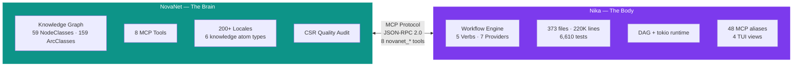

> [!IMPORTANT]
> **The Golden Rule (Extended)** — Five lines that govern every decision:
>
> | Concern | Owner | Why |
> |---------|-------|-----|
> | **KNOWING** things | NovaNet | Knowledge graph, entities, locales, semantics |
> | **DOING** things | Nika | Workflow execution, DAG, verbs, providers |
> | **CONNECTING** | MCP | Protocol boundary, zero Cypher in Nika (ADR-003) |
> | **THINKING** | Episodes | Strategy orchestration, model routing, confidence |
> | **REMEMBERING** | Episodes → NovaNet | Cross-session memory, entity-linked persistence |

### Stats Snapshot

| | Nika v0.27.0 | NovaNet v0.20.0 |
|--|--|--|
| **Scale** | 373 files · 220,380 lines | 59 NodeClasses · 159 ArcClasses |
| **Tests** | 6,610 passing | 1,210 passing |
| **Capabilities** | 5 verbs · 7 providers · 11 builtin tools | 8 MCP tools · 200+ locales · 6 atom types |
| **Observability** | 34 event types · NDJSON traces | CSR quality audit · denomination forms |
| **Infrastructure** | 4 TUI views · 48 MCP aliases · 30+ transforms | Neo4j backend · 5 search modes · 4 context modes |

> [!NOTE]
> Full feature inventory in [doc 01 — Current Features](./01-current-features.md). All stats verified against source code on 2026-03-14.

---

## 2. Nika Deep Dive

> Full module-by-module inventory in [doc 01](./01-current-features.md). This section highlights **architectural patterns** relevant to evolution decisions.

### 2.1 Module Architecture

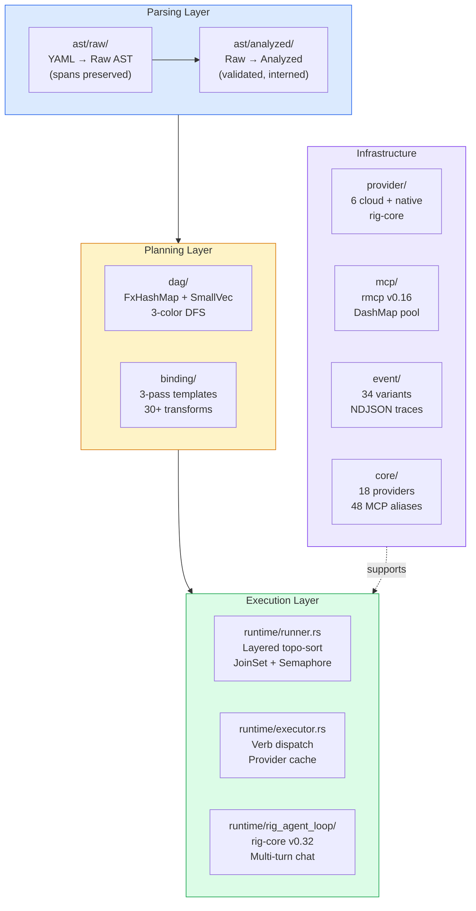

### 2.2 The 5 Semantic Verbs (ADR-001)

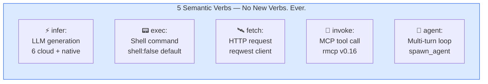

> [!NOTE]
> New capabilities = modifiers on existing verbs (`for_each`, `decompose:`, `retry:`, `model_slot:`). Never new verbs.

### 2.3 Agent Hierarchy

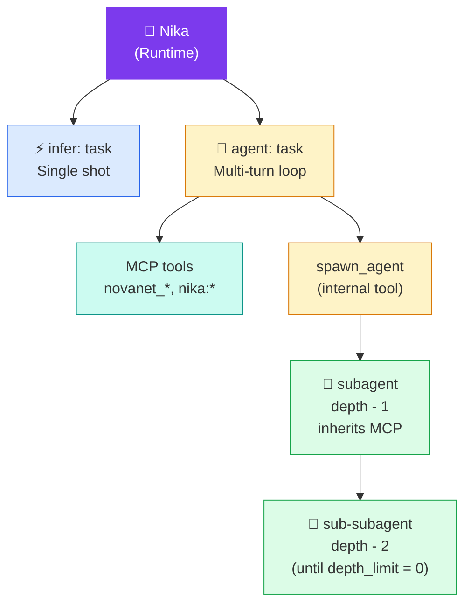

**Depth protection**: `depth_limit` defaults to 3 (max 10). Each `spawn_agent` decrements by 1. At depth 0, `spawn_agent` tool is not registered.

### 2.4 4-Layer Structured Output

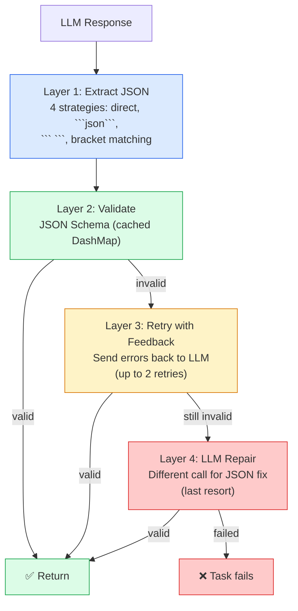

### 2.5 Key Subsystems

DAG Engine — Immutable, layered topo-sort execution

- **Data structure**: `FxHashMap<Arc<str>, SmallVec<[Arc<str>; 4]>>` — 4 deps inline, heap if more
- **Cycle detection**: 3-color DFS (White/Gray/Black)
- **Implicit deps**: `use:`/`with:` bindings auto-create flow edges
- **Execution**: Layered topo-sort with `JoinSet` for parallel tasks within layers
- **Concurrency**: `tokio::sync::Semaphore` limits parallel tasks
- **Control**: `CancellationToken` via `tokio::select!`, `fail_fast: true` stops all on first error

Binding & Transform — 3-pass template engine with 30+ operations

- **Pass 1**: Resolve `{{use.xxx}}` / `{{with.xxx}}` from DataStore
- **Pass 2**: Resolve `{{context.files.xxx}}` from LoadedContext
- **Pass 3**: Resolve `{{inputs.xxx}}` from workflow inputs
- **Lazy bindings**: `lazy: true` defers resolution until first access
- **30+ transforms**: String (uppercase, trim, replace), Array (map, filter, sort), Object (pick, omit, merge), Type (parse_json, to_string), Format (template, markdown), Logic (if_empty, default)

Event Sourcing — 34 event types across 6 categories

| Category | Events |
|----------|--------|
| **Workflow** | Started, Completed, Failed, Cancelled |
| **Task** | Started, Completed, Failed, Cancelled, Skipped, DependencyFailed |
| **Agent** | Started, Turn (with thinking, tokens, tool_calls), Completed, Spawned |
| **Provider** | Selected, InferStarted, InferCompleted, InferFailed, InferStreaming |
| **MCP** | ServerStarted, ServerStopped, ToolCalled, ToolResult, Error |
| **Other** | ArtifactWritten, ArtifactFailed, UserEvent, LogEvent |

**Storage**: NDJSON file per run. **Broadcast**: tokio channels for TUI real-time updates.

Secrets & Daemon — Unified credential management via IPC

- **Problem**: macOS Keychain prompts repeatedly when Nika spawns multiple MCP server processes
- **Solution**: `spn daemon` as sole keychain accessor via Unix socket IPC
- **Resolution chain**: env var → daemon IPC → not found
- **Security**: Socket `0600`, peer verification (`SO_PEERCRED`), PID file with `flock()`, `mlock()`, `Zeroizing<T>`

Core Registry (v0.27) — Zero-dependency static definitions

- **KNOWN_PROVIDERS** (18): 6 LLM + 11 MCP + 1 Local
- **KNOWN_MODELS** (16+): Text, vision, embedding models for native inference
- **MCP_ALIASES** (48): 6 categories (AI/LLM, Data, Search, Dev, Comms, Files)
- **MCP Config**: 3-level hierarchy (global → project → workflow)

---

## 3. NovaNet Deep Dive

> Full details in the NovaNet documentation. This section covers the **MCP integration surface** relevant to Nika workflows.

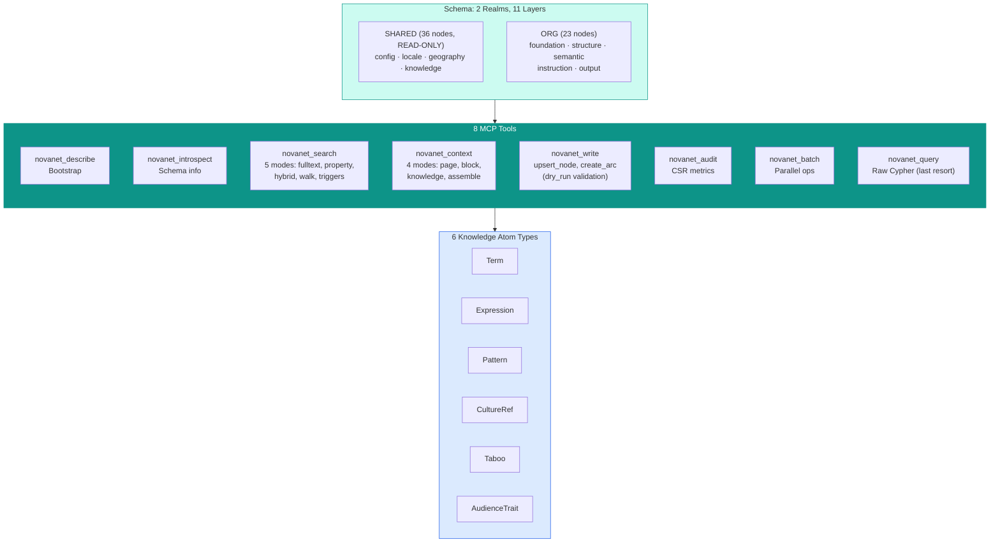

**Key patterns**: `*Native` (Entity → EntityNative per locale), Denomination forms (6: text/title/abbrev/mixed/base/url), Arc families (5: ownership/localization/semantic/generation/mining).

> [!NOTE]
> Overlap analysis in [doc 04 — Nika x NovaNet Overlap](./04-nika-novanet-overlap.md). Boundary rules ensure zero duplication between systems.

---

## 4. Scientific Literature

> Full paper-by-paper analysis in [doc 02 — Scientific Literature](./02-scientific-literature.md). This section maps **key findings to evolution priorities**.

### Paper → Priority Mapping

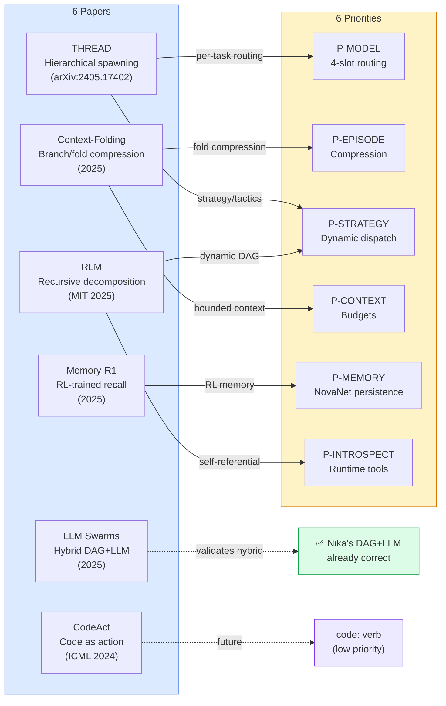

### Impact × Effort Matrix

| | Low Effort | Medium Effort | High Effort |
|---|---|---|---|
| **High Impact** | Per-task model routing (THREAD)[^1] | Episode compression (Context-Folding)[^2] | Strategy orchestration (THREAD + Slate) |
| **Medium Impact** | Runtime introspection (RLM)[^3] | Context budgeting (Slate) | Episodic memory + RL (Memory-R1)[^4] |
| **Low Impact** | — | — | Code sandbox (CodeAct)[^5] |

### What the Literature Validates

> [!TIP]
> The literature consistently validates three things Nika already does right:
> 1. **Hybrid DAG+LLM architecture** — Swarms paper[^6] confirms this outperforms pure-swarm
> 2. **Reference semantics via DataStore** — RLM paper's core insight, already implemented
> 3. **Recursive spawning with depth limits** — THREAD paper's approach, already in `SpawnAgentTool`

---

## 5. Competitive Landscape

> Full competitor analysis in [doc 03 — Competitive Landscape](./03-competitive-landscape.md). Full Slate integration strategy in [doc 07](./07-slate-deep-integration.md).

### Positioning

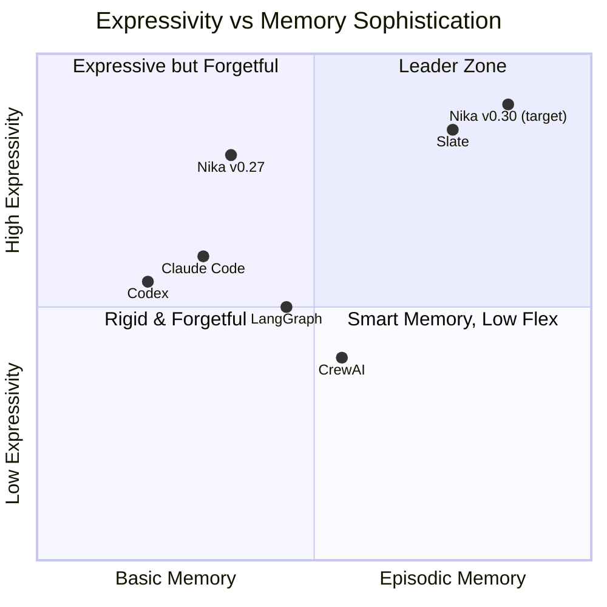

### Slate — The Primary Reference

> [!IMPORTANT]
> **Core realization**: Nika's DAG IS already Slate's kernel. Tasks ARE processes. `TaskResult` IS return values. `DataStore` IS RAM. We don't BUILD Slate — we UPGRADE the kernel with 4 additions (model slots, episodes, strategy mode, context budgets), then persist via NovaNet.

| Where Slate Leads | Where Nika Leads | Priority |
|---|---|---|
| Context management (working memory) | YAML-first workflows (reproducible) | P-CONTEXT |
| 4 model slots | NovaNet knowledge graph (unique) | P-MODEL |
| Episode compression | 200+ locales (no competitor) | P-EPISODE |
| Strategy/tactics split | 34-event observability | P-STRATEGY |
| Cross-session memory (files) | 4-layer structured output | P-MEMORY |
| Adaptive decomposition | Rust performance | P-STRATEGY |

> [!NOTE]
> **Attribution**: Slate's slots are main/subagent/search/reasoning. Our P-MODEL design uses main/**tactical**/search/reasoning — renaming "subagent" to "tactical" per THREAD[^1] and AlphaZero[^7] strategy/tactics separation.

### Quick Competitive Matrix

| Feature | Nika | LangGraph | CrewAI | Codex | Claude Code |
|---------|------|-----------|--------|-------|-------------|
| Language | Rust+YAML | Python | Python | Cloud | CLI |
| Multi-provider | 7 | Via LangChain | 1-2 | OpenAI | Claude |
| Knowledge graph | NovaNet | Manual | None | None | None |
| Multi-locale | 200+ | None | None | None | None |
| Memory | Session | Checkpoints | 3-type | None | Conversation |
| Observability | 34 events | LangSmith | Basic | PRs | Conversation |
| Reproducibility | NDJSON traces | Low | Low | PR diffs | Low |
| MCP | Native client | Plugin | None | None | Native |

> [!WARNING]
> CrewAI's **3-type memory system** (short-term, long-term, entity) is more mature than Nika's single DataStore. This gap is addressed by P-MEMORY.

---

## 6. Gap Analysis

### Capability Gaps

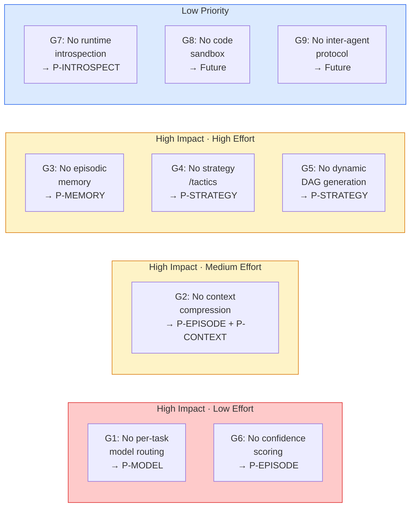

| Gap | Description | Source | Severity | Priority |
|-----|-------------|--------|----------|----------|
| G1 | Single provider per workflow — no per-task model routing | THREAD, Slate | HIGH | P-MODEL |
| G2 | Full output carried forward — no context compression | Context-Folding, Slate | HIGH | P-EPISODE + P-CONTEXT |
| G3 | In-memory session only — no cross-session episodic memory | Slate, CrewAI, Memory-R1 | HIGH | P-MEMORY |
| G4 | Flat agent loop — no strategy/tactics pattern | THREAD, Slate | HIGH | P-STRATEGY |
| G5 | Static YAML only — no dynamic DAG generation | RLM, Slate | MEDIUM | P-STRATEGY |
| G6 | No confidence-based escalation (absorbed into episodes) | THREAD, Slate | MEDIUM | P-EPISODE |
| G7 | Agents can't see DAG state — no runtime introspection | RLM | LOW | P-INTROSPECT |
| G8 | `exec:` is shell-only — no code execution sandbox | CodeAct | LOW | Future |
| G9 | Parent-child only — no inter-agent protocol | A2A, Swarms | LOW | Future |

### Architectural Debt

> [!WARNING]
> Found during deep audit of 373 source files:
>
> | ID | Debt | Risk |
> |---|---|---|
> | D1 | Two binding systems coexist (`use:` + `with:`) | Confusion |
> | D2 | DataStore has no eviction (unbounded memory growth) | OOM |
> | D3 | Mixed locking (DashMap + RwLock in DataStore) | Complexity |
> | D4 | Context file loading has no size limits | OOM |
> | D5 | Env var pollution from boot-time secret injection | Security |
> | D6 | Limited JSONPath in binding resolution | Expressivity |

---

## 7. Synergy Map

> Full overlap analysis and boundary rules in [doc 04 — Nika x NovaNet Overlap](./04-nika-novanet-overlap.md).

```mermaid
flowchart TB
    subgraph S1["Synergy 1: Episodic Memory"]
        direction LR
        A1["Nika agent\ncompletes task"] --> A2["Compress\ninto episode"]
        A2 -->|"novanet_write"| A3["AgentEpisode\nin NovaNet"]
        A3 -->|"novanet_search"| A4["Future agent\nreuses knowledge"]
    end

    subgraph S2["Synergy 2: Generation Lineage"]
        direction LR
        B1["novanet_context\n(page, fr-FR)"] --> B2["Nika infer:\ngenerate content"]
        B2 -->|"novanet_write"| B3["PageNative\nwith provenance"]
    end

    subgraph S3["Synergy 3: Smart Model Routing"]
        direction LR
        C1["NovaNet stores\nmodel benchmarks"] --> C2["Nika queries\nat routing time"]
        C2 --> C3["Best model\nselected per task"]
    end

    subgraph S4["Synergy 4: Decompose via Graph"]
        direction LR
        D1["decompose:\nstrategy: semantic"] --> D2["novanet_search\nmode: walk"]
        D2 --> D3["DAG expanded\nat runtime"]
    end

    style S1 fill:#dcfce7,stroke:#16a34a
    style S2 fill:#dbeafe,stroke:#2563eb
    style S3 fill:#fef3c7,stroke:#d97706
    style S4 fill:#ede9fe,stroke:#7c3aed
```

### Boundary Rules

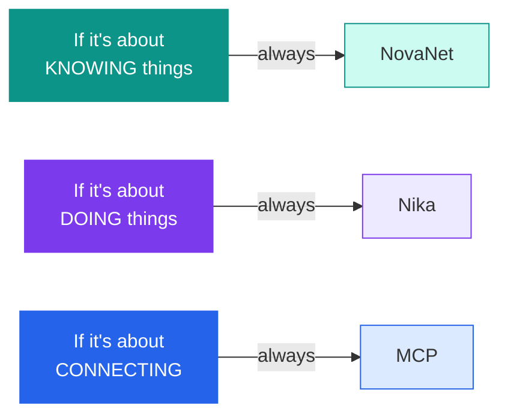

> [!WARNING]
> **Duplication risks to guard against:**
> 1. Nika builds parallel memory system → **use NovaNet**
> 2. Nika adds entity/locale awareness → **use `novanet_context`**
> 3. Nika hardcodes graph schema in AST → **use `novanet_introspect`**
> 4. Nika builds quality scoring → **use `novanet_audit`**

---

## 8. Evolution Priorities

> Full implementation designs in [doc 05 — Evolution Roadmap](./05-evolution-roadmap.md). Slate concept mapping in [doc 07 — Slate Deep Integration](./07-slate-deep-integration.md).

### The 6 Priorities in 3 Waves

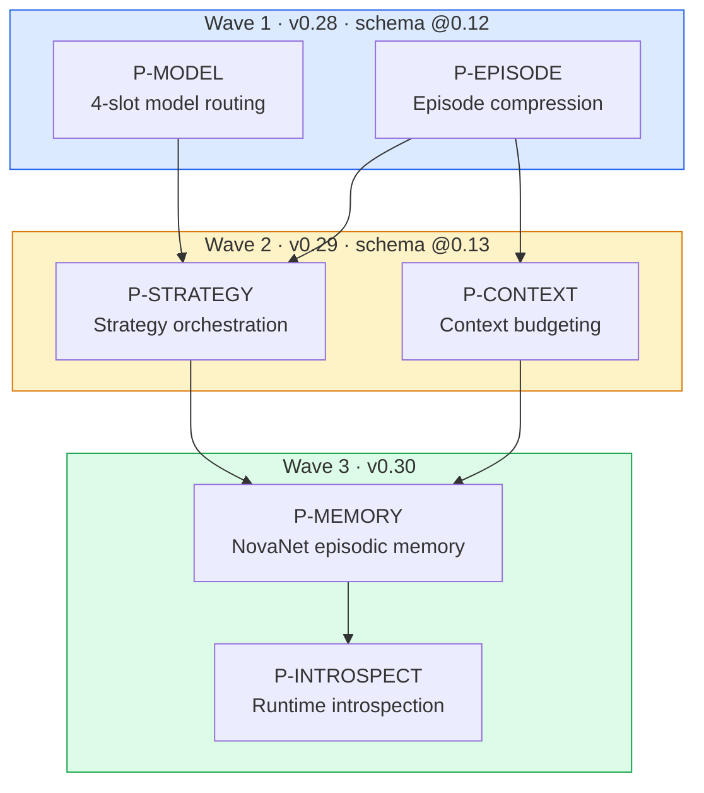

### Priority Summary

| Priority | What | Source | Wave | Key Rust Change |
|----------|------|--------|------|-----------------|
| **P-MODEL** | 4-slot model routing (main/tactical/search/reasoning) | Slate, THREAD[^1] | 1 | `model_slots` in `AnalyzedWorkflow` |
| **P-EPISODE** | LLM compression at task completion boundaries | Slate, Context-Folding[^2] | 1 | `Episode` struct in `runtime/` |
| **P-STRATEGY** | Dynamic tactic dispatch via thread weaving | Slate, THREAD[^1], RLM[^3] | 2 | Orchestration mode in `runner.rs` |
| **P-CONTEXT** | Working memory awareness, token budget tracking | Slate, Context-Folding[^2] | 2 | Budget tracking in `DataStore` |
| **P-MEMORY** | NovaNet-backed cross-session episodic memory | Slate, Memory-R1[^4], CrewAI | 3 | New MCP tools for episode storage |
| **P-INTROSPECT** | 6 runtime introspection builtin tools | RLM[^3] | 3 | New tools in `runtime/builtin.rs` |

### Why This Order

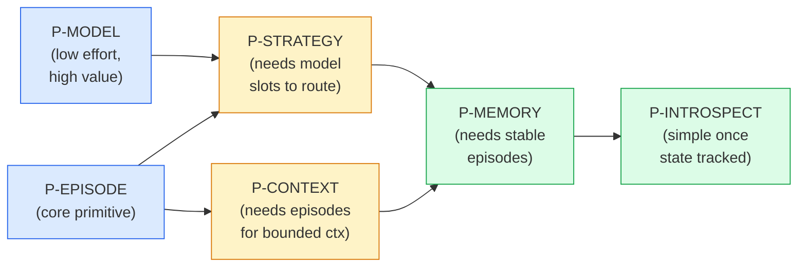

> [!TIP]
> **P-MODEL first** because it's low effort + high value + prerequisite for strategy routing. **P-EPISODE with it** because it's the core primitive everything else depends on. **P-STRATEGY after** because it requires both model slots and episodes. **P-MEMORY last** because it needs cross-project NovaNet schema changes and stable episodes.

### After All Priorities: Competitive Position

> [!NOTE]
> After Wave 3, Nika achieves **parity** on all 6 of Slate's advantages, goes **beyond** on 2 capabilities (NovaNet memory, introspection), and retains **9 unique strengths** Slate cannot replicate.

---

## 9. Research Methodology

### 13 Research Agents Deployed

| # | Agent Mission | Key Output |
|---|---|---|
| 1 | Deep-dive Nika architecture (all modules) | Module map (373 files, 22 modules) |
| 2 | Research RLM, CodeAct, THREAD papers | 3 priority mappings |
| 3 | Research Slate (Random Labs) | 8 concept analysis |
| 4 | Research competing runtimes | 5-competitor matrix |
| 5 | Analyze Nika-NovaNet boundaries | Overlap scorecard (0/6) |
| 6 | Research agent orchestration patterns | Strategy/tactics design |
| 7 | Audit ALL Nika features (exhaustive) | Feature inventory |
| 8 | NovaNet MCP tools inventory | 8-tool capability map |
| 9 | Research agent memory architectures | Memory-R1 findings |
| 10 | Research model routing in production | 4-slot design |
| 11 | Deep audit Nika runtime internals | Architectural debt (6 items) |
| 12 | Deep audit Nika AST + DAG internals | Two-phase architecture doc |
| 13 | Research context compression techniques | Context-Folding + Swarms analysis |

### Source Material

| Category | Count | Details |
|----------|-------|---------|
| Academic papers | 6 | RLM, CodeAct, THREAD, Context-Folding, LLM Swarms, Memory-R1 |
| Competitor products | 5 | Slate, Claude Code, Codex, LangGraph, CrewAI |
| Protocols | 3 | MCP, A2A, ACP |
| Codebase | 373 files | 220,380 lines, every module audited |
| Brainstorm docs | 7 | 01-features through 07-slate-integration |

> [!TIP]
> All codebase claims verified via direct source inspection on 2026-03-14. Paper citations link to arXiv or conference proceedings. Slate analysis based on published blog + npm documentation.

---

## References

[^1]: THREAD: Thinking Hierarchically for Resource-Efficient Agent Decision-making — [arXiv:2405.17402](https://arxiv.org/abs/2405.17402). Hierarchical decomposition with per-task model routing.
[^2]: Context-Folding: Scaling Long-Horizon LLM Agent — [arXiv:2510.11967](https://arxiv.org/abs/2510.11967) (2025). Branch/fold sub-trajectory compression.
[^3]: RLM: Recursive Language Models — [arXiv:2512.24601](https://arxiv.org/abs/2512.24601) (MIT, 2025). Recursive sub-LM calls with external working memory.
[^4]: Memory-R1: RL-trained agent memory policies — [arXiv:2508.19828](https://arxiv.org/abs/2508.19828) (2025).
[^5]: CodeAct: Code Actions for LLM Agents — [arXiv:2402.01030](https://arxiv.org/abs/2402.01030) (ICML 2024, Wang et al.). Executable code as unified action space.
[^6]: From Rule-Based to LLM-Powered: A Comparative Study of Swarm Intelligence — [arXiv:2506.14496](https://arxiv.org/abs/2506.14496) (2025).
[^7]: McGrath et al., "Acquisition of Chess Knowledge in AlphaZero" — [PNAS 2022](https://www.pnas.org/doi/10.1073/pnas.2206625119). Cited for strategy/tactics separation.

---

[← 05 Evolution Roadmap](./05-evolution-roadmap.md) · [📋 Index](./00-README.md) · [07 Slate Deep Integration →](./07-slate-deep-integration.md)

