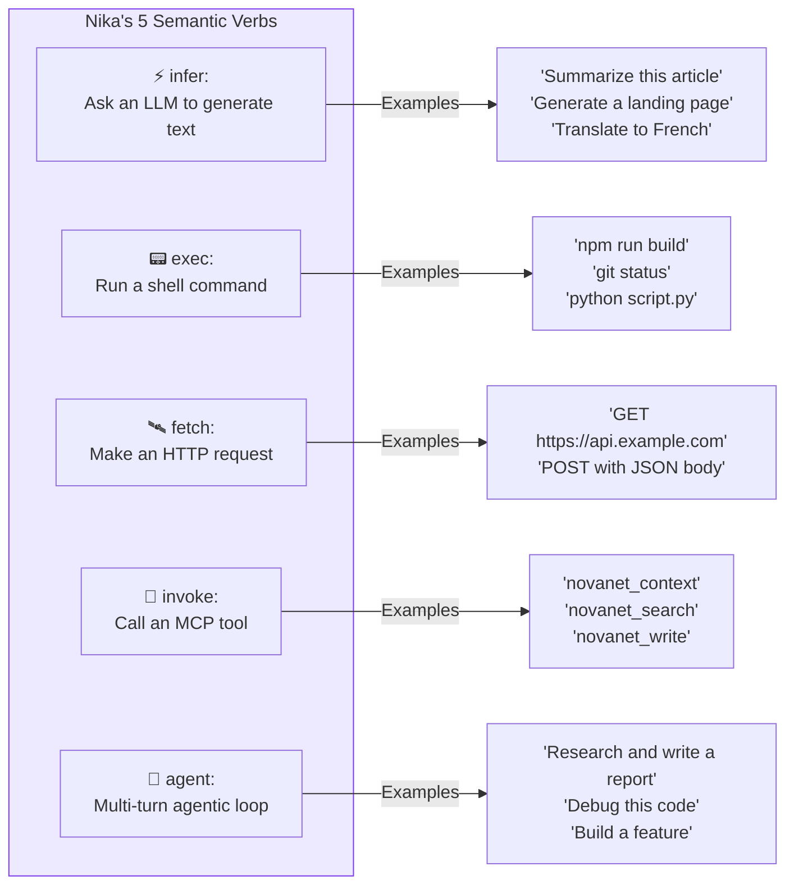
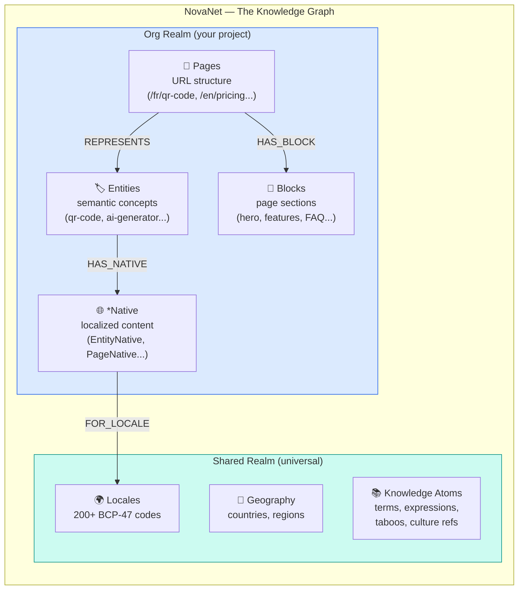
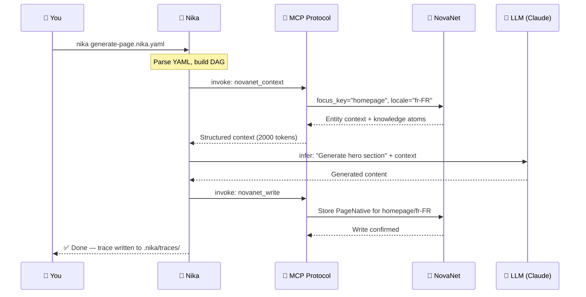
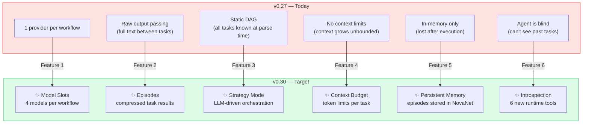
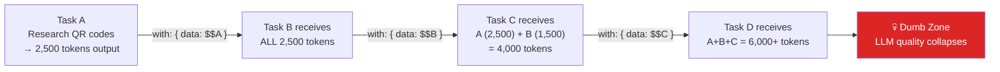
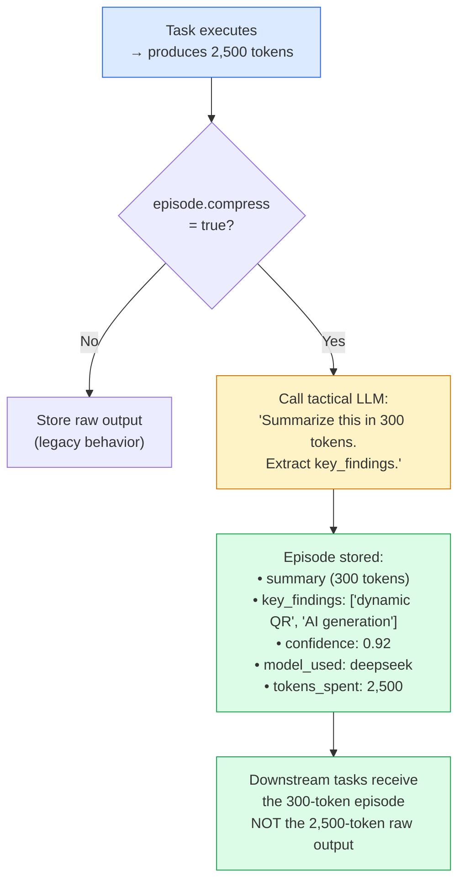
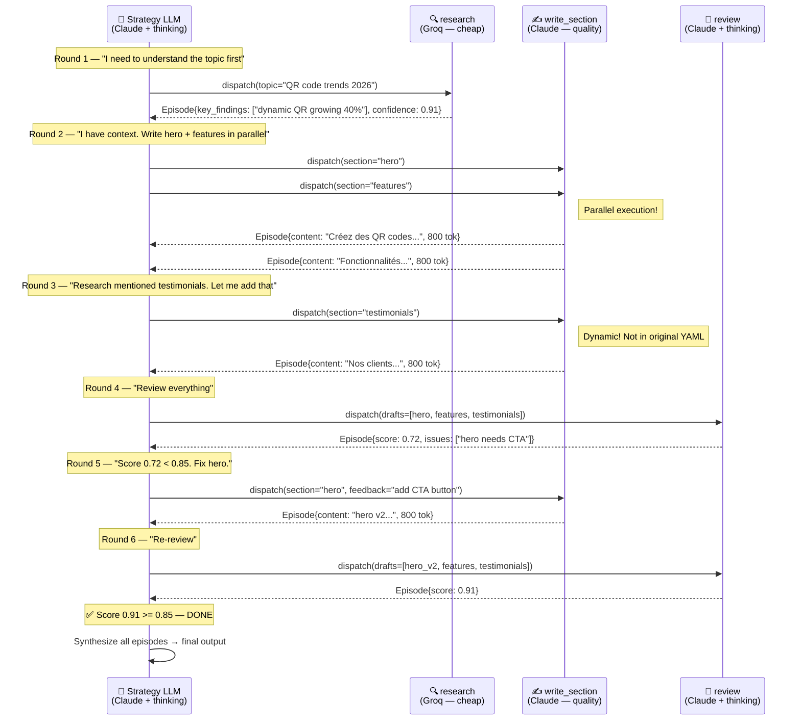
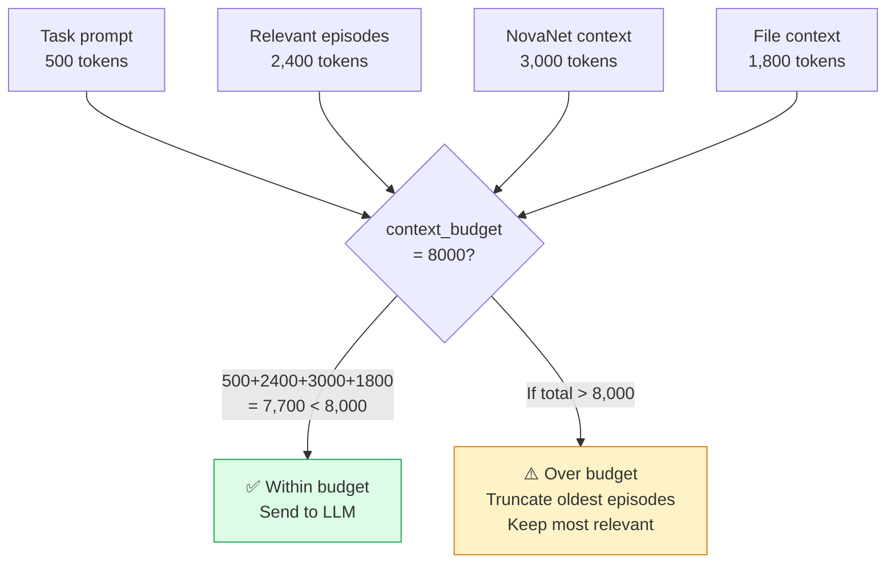
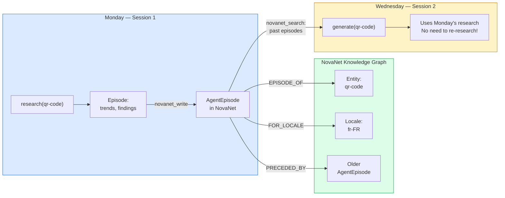

# 08 — Nika v0.30 Complete Guide

> Everything you need to understand Nika v0.30 + NovaNet — explained with real examples.
> What it is, how it works, what changed, and how to use it.

**Nika** v0.27.0 → v0.30 · **NovaNet** v0.20.0 · Updated 2026-03-14

---

## Table of Contents

1. [What is Nika?](#what-is-nika)
2. [What is NovaNet?](#what-is-novanet)
3. [How They Work Together](#how-nika--novanet-work-together)
4. [What's New in v0.30 — The 6 Features](#whats-new-in-v030)
5. [Feature 1: Model Slots](#feature-1-model-slots)
6. [Feature 2: Episodes](#feature-2-episodes)
7. [Feature 3: Strategy Orchestration](#feature-3-strategy-orchestration)
8. [Feature 4: Context Budget](#feature-4-context-budget)
9. [Feature 5: Persistent Memory](#feature-5-persistent-memory-novanet)
10. [Feature 6: Runtime Introspection](#feature-6-runtime-introspection)
11. [Before vs After — Side by Side](#before-vs-after)
12. [Feature Compatibility Matrix](#feature-compatibility-matrix)
13. [FAQ](#faq)

---

## What is Nika?

Nika is a **workflow engine for AI tasks**. You write a YAML file describing what you want to do, and Nika executes it — calling LLMs, running shell commands, fetching URLs, and invoking MCP tools.

```
┌─────────────────────────────────────────────────────────────────────────────────┐
│  YOU WRITE THIS (YAML):              NIKA DOES THIS:                            │
│                                                                                 │
│  tasks:                              1. Parse YAML into a DAG                   │
│    - id: research                    2. Validate dependencies                   │
│      infer: "Research QR codes"      3. Execute tasks in order                  │
│                                      4. Pass outputs between tasks               │
│    - id: write                       5. Track tokens, costs, events             │
│      with:                           6. Write NDJSON trace file                  │
│        data: "$research"                                                        │
│      infer: "Write article from:                                                │
│              {{with.data}}"                                                     │
│                                                                                 │
└─────────────────────────────────────────────────────────────────────────────────┘
```

### The 5 Verbs

Every task in a Nika workflow uses exactly one of 5 verbs:



| Verb | What it does | When to use |
|------|-------------|-------------|
| `infer:` | Sends a prompt to an LLM, gets text back | Content generation, translation, summarization |
| `exec:` | Runs a shell command, captures stdout | Building, testing, file operations |
| `fetch:` | Makes an HTTP request, returns response | API calls, web scraping, webhooks |
| `invoke:` | Calls an MCP tool (NovaNet, etc.) | Knowledge graph queries, external tools |
| `agent:` | Multi-turn loop with tools (LLM decides) | Complex tasks requiring reasoning + tools |

### Minimal Example

```yaml
# hello.nika.yaml — The simplest Nika workflow
schema: nika/workflow@0.11

tasks:
  - id: greet
    infer: "Say hello in French, Japanese, and Swahili"
```

Run it:

```bash
nika hello.nika.yaml
```

Output:

```
Bonjour ! こんにちは！ Jambo!
```

That's it. Nika calls your default LLM provider, gets the response, writes a trace file.

---

## What is NovaNet?

NovaNet is a **knowledge graph** powered by Neo4j. It stores structured knowledge about entities, locales, and content — and exposes it to Nika through 8 MCP tools.



### What's in it concretely?

For the QR Code AI project, NovaNet contains:

| What | Example | Count |
|------|---------|-------|
| **Entities** | `qr-code`, `ai-generator`, `dynamic-qr`, `qr-scanner` | ~30 |
| **Pages** | `homepage`, `pricing`, `blog/what-is-qr` | ~20 |
| **Blocks** | `hero`, `features`, `faq`, `testimonials` | ~80 |
| **Locales** | `fr-FR`, `en-US`, `de-DE`, `ja-JP`... | 200+ |
| **Knowledge atoms** | French expressions for "QR code", taboos for Japan, cultural refs for Germany | 1000+ |

### The 8 MCP Tools

NovaNet exposes its knowledge through MCP (Model Context Protocol):

| Tool | What it does | Example |
|------|-------------|---------|
| `novanet_describe` | Get an overview of the graph | "What's in this knowledge graph?" |
| `novanet_introspect` | Inspect schema (NodeClasses, ArcClasses) | "What types of nodes exist?" |
| `novanet_search` | Find nodes by text or properties | "Find all entities about QR codes" |
| `novanet_context` | Build LLM context from the graph | "Give me everything for homepage in French" |
| `novanet_write` | Create or update data | "Store this generated PageNative" |
| `novanet_audit` | Check data quality | "What's missing for French locale?" |
| `novanet_batch` | Run multiple operations | "Search 5 things in parallel" |
| `novanet_query` | Raw Cypher (last resort) | Custom analytics queries |

---

## How Nika + NovaNet Work Together



### The Golden Rule

```
╔═══════════════════════════════════════════════════════════════════════════════╗
║  THE GOLDEN RULE — 3 lines that govern everything                             ║
╠═══════════════════════════════════════════════════════════════════════════════╣
║                                                                               ║
║  KNOWING things (entities, locales, knowledge) → NovaNet                      ║
║  DOING things (execution, LLM calls, DAG)      → Nika                        ║
║  CONNECTING them (protocol boundary)            → MCP                         ║
║                                                                               ║
║  Nika NEVER touches Neo4j directly.                                           ║
║  NovaNet NEVER executes workflows.                                            ║
║  MCP is the only bridge.                                                      ║
║                                                                               ║
╚═══════════════════════════════════════════════════════════════════════════════╝
```

### A Real Integration Workflow

```yaml
# generate-page.nika.yaml — Real-world Nika + NovaNet
schema: nika/workflow@0.11
provider: anthropic

mcp:
  servers:
    novanet:
      command: cargo
      args: ["run", "-p", "novanet-mcp"]

tasks:
  # Step 1: Get context from NovaNet
  - id: get_context
    invoke:
      tool: novanet_context
      server: novanet
      params:
        focus_key: "homepage"
        locale: "fr-FR"
        mode: page

  # Step 2: Get locale-specific knowledge (expressions, taboos)
  - id: get_knowledge
    invoke:
      tool: novanet_context
      server: novanet
      params:
        focus_key: "homepage"
        locale: "fr-FR"
        mode: knowledge
        atom_type: expression

  # Step 3: Generate content using both
  - id: generate_hero
    with:
      entity: "$get_context"
      expressions: "$get_knowledge"
    infer: |
      Generate the hero section for the QR Code AI homepage in French.

      Entity context: {{with.entity}}
      French expressions to use: {{with.expressions}}

      Requirements:
      - Natural French (not translated)
      - Use the provided expressions
      - Include a CTA button text
    structured:
      schema:
        type: object
        properties:
          headline: { type: string }
          subheadline: { type: string }
          cta_text: { type: string }
          body: { type: string }
        required: [headline, body, cta_text]

  # Step 4: Store result back in NovaNet
  - id: save_to_novanet
    with:
      content: "$generate_hero"
    invoke:
      tool: novanet_write
      server: novanet
      params:
        operation: upsert_node
        class: BlockNative
        key: "homepage-hero-fr-FR"
        locale: "fr-FR"
        properties:
          content: "{{with.content}}"
          generated_by: "nika"
```

---

## What's New in v0.30

v0.30 adds **6 new features** across 3 versions (waves). Here's the big picture:



```
╔═══════════════════════════════════════════════════════════════════════════════╗
║  TL;DR — THE 6 FEATURES IN ONE SENTENCE EACH                                 ║
╠═══════════════════════════════════════════════════════════════════════════════╣
║                                                                               ║
║  1. MODEL SLOTS    → Use different LLMs for different tasks (save 5-10x $)    ║
║  2. EPISODES       → Compress task outputs before passing downstream          ║
║  3. STRATEGY       → Let an LLM decide what tasks to run dynamically          ║
║  4. CONTEXT BUDGET → Set token limits so LLMs never get confused              ║
║  5. MEMORY         → Save episodes to NovaNet for cross-session learning      ║
║  6. INTROSPECT     → Let agents query the workflow's own runtime state        ║
║                                                                               ║
╚═══════════════════════════════════════════════════════════════════════════════╝
```

### Release Schedule

| Wave | Version | Schema | Features | Dependencies |
|:----:|---------|--------|----------|--------------|
| 1 | v0.28 | @0.12 | Model Slots + Episodes | None |
| 2 | v0.29 | @0.13 | Strategy + Context Budget | Wave 1 |
| 3 | v0.30 | @0.13 | Memory + Introspection | Wave 1 + 2 |

---

## Feature 1: Model Slots

### The Problem

Today, a workflow uses ONE LLM provider for everything:

```yaml
# v0.27 — All tasks use the same model
provider: anthropic  # ← Claude Sonnet for EVERYTHING

tasks:
  - id: research
    infer: "Research QR code trends"        # Claude Sonnet ($0.003/1K tokens)

  - id: format_list
    infer: "Format this as a bullet list"   # Claude Sonnet ($0.003/1K tokens)
    # ↑ This is a trivial task — why pay $0.003/1K for bullet formatting?
```

**Problem:** You're paying Claude Sonnet prices for trivial tasks that a $0.0001/1K model could handle.

### The Solution

`model_slots:` lets you define 4 named model slots per workflow, and assign tasks to the right slot:

```yaml
# v0.28+ — Different models for different tasks
schema: nika/workflow@0.12

model_slots:
  main:                                    # For quality content generation
    provider: anthropic
    model: claude-sonnet-4-6
    # Cost: ~$0.003/1K tokens

  tactical:                                # For simple formatting, parsing
    provider: deepseek
    model: deepseek-chat
    # Cost: ~$0.0001/1K tokens (30x cheaper!)

  search:                                  # For research, information retrieval
    provider: groq
    model: llama-3.3-70b-versatile
    # Cost: ~$0.0003/1K tokens (10x cheaper!)

  reasoning:                               # For complex planning, review
    provider: anthropic
    model: claude-sonnet-4-6
    extended_thinking: true
    thinking_budget: 16384

default_model_slot: main

tasks:
  - id: research
    model_slot: search                     # ← Groq: fast & cheap
    infer: "Research QR code trends"

  - id: plan
    model_slot: reasoning                  # ← Claude + thinking: expensive but deep
    infer: "Create a content strategy"

  - id: write_hero
    model_slot: main                       # ← Claude: quality content
    infer: "Write the hero section"

  - id: format_output
    model_slot: tactical                   # ← DeepSeek: trivial task, dirt cheap
    infer: "Format as HTML"
```

### Cost Impact

```
┌─────────────────────────────────────────────────────────────────────────────────┐
│  💰 COST COMPARISON (same workflow, same quality)                               │
├─────────────────────────────────────────────────────────────────────────────────┤
│                                                                                 │
│  v0.27 (single provider):                                                       │
│  ─────────────────────────────────────────────────────────────                  │
│  research:  Claude Sonnet  2K tokens × $0.003  = $0.006                        │
│  plan:      Claude Sonnet  5K tokens × $0.003  = $0.015                        │
│  write:     Claude Sonnet  3K tokens × $0.003  = $0.009                        │
│  format:    Claude Sonnet  1K tokens × $0.003  = $0.003                        │
│                                         TOTAL  = $0.033                        │
│                                                                                 │
│  v0.28 (model slots):                                                           │
│  ─────────────────────────────────────────────────────────────                  │
│  research:  Groq           2K tokens × $0.0003 = $0.0006                       │
│  plan:      Claude+think   5K tokens × $0.003  = $0.015                        │
│  write:     Claude Sonnet  3K tokens × $0.003  = $0.009                        │
│  format:    DeepSeek       1K tokens × $0.0001 = $0.0001                       │
│                                         TOTAL  = $0.0247                       │
│                                                                                 │
│  Savings: 25% on a simple 4-task workflow                                       │
│  On a 50-task workflow with many tactical tasks: savings reach 60-80%           │
│                                                                                 │
└─────────────────────────────────────────────────────────────────────────────────┘
```

---

## Feature 2: Episodes

### The Problem

Today, when Task B depends on Task A, it receives Task A's **entire raw output**:



With 10 tasks chained, Task 10 might receive 20,000+ tokens of accumulated context. The LLM enters the "dumb zone" — where it has so much context it performs **worse** than with less.

### The Solution

`episode:` compresses a task's output at the completion boundary:

```yaml
tasks:
  - id: research
    model_slot: search
    infer: "Research QR code trends for 2026"
    episode:
      compress: true              # ← LLM summarizes the output
      max_tokens: 300             # ← Summary must fit in 300 tokens
      retain: [key_findings]      # ← Also extract structured findings
      confidence_threshold: 0.8   # ← Self-assessed quality score
```

### How it works internally



### Before vs After

```
v0.27 (raw passing):                    v0.28 (episodes):
────────────────────                    ─────────────────
Task A → 2,500 tokens                  Task A → Episode: 300 tokens
Task B gets 2,500                      Task B gets 300
Task C gets 4,000                      Task C gets 600
Task D gets 6,000                      Task D gets 900
Task E gets 8,000                      Task E gets 1,200
...                                    ...
Task J gets 20,000 → 💀 DUMB ZONE     Task J gets 3,000 → ✅ SHARP

Context growth: O(n²)                  Context growth: O(n) bounded
```

### Episode Rust Struct

```rust
pub struct Episode {
    pub task_id: TaskId,
    pub summary: String,            // LLM-compressed (max_tokens limit)
    pub key_findings: Vec<String>,  // Structured extraction (retain field)
    pub raw_output: Option<String>, // Debug only — never passed downstream
    pub model_used: String,         // Which model produced this
    pub tokens_spent: u64,          // Total tokens consumed
    pub confidence: f64,            // Self-assessed quality (0.0–1.0)
    pub artifacts: Vec<Artifact>,   // Files produced by this task
}
```

---

## Feature 3: Strategy Orchestration

### The Problem

Today, Nika's DAG is **static** — you must define ALL tasks at write time:

```yaml
# v0.27 — You must decide everything upfront
tasks:
  - id: write_hero
    infer: "Write hero section"
  - id: write_features
    infer: "Write features section"
  - id: write_pricing
    infer: "Write pricing section"
  # What if research reveals you need a "testimonials" section?
  # → You can't add it. The DAG is fixed.
```

### The Solution

`orchestration: strategy` adds a new execution mode where a **strategy LLM** dynamically dispatches tasks:

```yaml
# v0.29 — The strategy LLM decides what to do
schema: nika/workflow@0.13

orchestration: strategy         # ← NEW: enables strategy mode

model_slots:
  reasoning: { provider: anthropic, model: claude-sonnet-4-6, extended_thinking: true }
  main:      { provider: anthropic, model: claude-sonnet-4-6 }
  search:    { provider: groq,      model: llama-3.3-70b-versatile }

strategy:
  goal: |
    Generate a complete landing page for QR Code AI in French.
    Research trends, write sections, review quality.
    Iterate until quality score >= 0.85.
  model_slot: reasoning
  max_rounds: 8
  episode_budget: 15000

# These are TEMPLATES — the strategy LLM dispatches them
tasks:
  - id: research
    model_slot: search
    infer: "Research: {{with.topic}}"
    episode: { compress: true, max_tokens: 300 }

  - id: write_section
    model_slot: main
    infer: "Write {{with.section}} section"
    episode: { compress: true, max_tokens: 800 }
    structured:
      schema:
        type: object
        properties:
          content: { type: string }
        required: [content]

  - id: review
    model_slot: reasoning
    infer: "Review drafts: {{with.drafts}}"
    episode: { compress: true, retain: [score, issues] }
    structured:
      schema:
        type: object
        properties:
          score: { type: number }
          issues: { type: array, items: { type: string } }
        required: [score, issues]
```

### How it executes



### The Two Modes

```
╔═══════════════════════════════════════════════════════════════════════════════╗
║  NIKA HAS TWO EXECUTION MODES                                                ║
╠═══════════════════════════════════════════════════════════════════════════════╣
║                                                                               ║
║  Mode 1: orchestration: dag (default — like v0.27)                            ║
║  ─────────────────────────────────────────────────────────────                ║
║  • All tasks defined at write time                                            ║
║  • Execution order determined by DAG                                          ║
║  • Predictable, reproducible, deterministic                                   ║
║  • Best for: pipelines, batch processing, CI/CD                               ║
║                                                                               ║
║  Mode 2: orchestration: strategy (new in v0.29)                               ║
║  ─────────────────────────────────────────────────────────────                ║
║  • Tasks are TEMPLATES dispatched by a strategy LLM                           ║
║  • Strategy decides what to run, when, and with what params                   ║
║  • Adaptive: adds tasks, retries on low quality, changes approach             ║
║  • Best for: content generation, research, complex multi-step reasoning       ║
║                                                                               ║
║  Same YAML format. Same 5 verbs. Same bindings.                              ║
║  Only difference: WHO decides the execution order.                            ║
║                                                                               ║
╚═══════════════════════════════════════════════════════════════════════════════╝
```

---

## Feature 4: Context Budget

### The Problem

Without limits, a task's context can grow unbounded — especially in strategy mode where multiple rounds accumulate episodes:

```
Round 1: research episode      → 300 tokens
Round 2: write_hero episode    → 800 tokens
Round 3: write_features episode → 800 tokens
Round 4: review episode        → 500 tokens
...
Round 8: strategy has 5,000+ tokens of episodes
→ LLM starts losing quality
```

### The Solution

`context_budget:` sets a hard token limit per task:

```yaml
tasks:
  - id: research
    model_slot: search
    context_budget: 4000          # ← Max 4K tokens in this task's prompt
    infer: "Research QR codes"
    episode:
      compress: true
      max_tokens: 300

  - id: write_hero
    model_slot: main
    context_budget: 8000          # ← Larger budget for generation
    with:
      trends: "$research"
      entity: "$get_context"
    infer: "Write hero: {{with.trends}} {{with.entity}}"
```

### How it works



**Rules enforced by the runtime:**
1. Each task receives ONLY: its prompt + relevant episodes + context
2. Never raw history from other tasks
3. Budget enforced by truncation/selection — not rejection
4. Token count tracked in events for cost monitoring

---

## Feature 5: Persistent Memory (NovaNet)

### The Problem

Today, everything Nika learns during a workflow is **lost** when execution ends:

```
Monday:   Workflow researches QR code trends → findings in DataStore → LOST
Wednesday: Same workflow runs again → starts from zero → pays for research again
```

### The Solution

`episode.persist: novanet` stores episodes in NovaNet's knowledge graph, linked to semantic entities:

```yaml
tasks:
  - id: research
    infer: "Research QR code trends"
    episode:
      compress: true
      persist: novanet            # ← NEW: save to NovaNet
      entity_link: qr-code        # ← Link to the QR code entity
```

### How it works



### NovaNet Schema Addition

```
AgentEpisode (new NodeClass)
├── key: string
├── workflow: string
├── task_id: string
├── summary: string
├── key_findings: string[]
├── confidence: float
├── tokens_spent: integer
├── timestamp: datetime
├── Arcs:
│   ├── EPISODE_OF → Entity
│   ├── FOR_LOCALE → Locale
│   ├── SIMILAR_TO → AgentEpisode
│   └── PRECEDED_BY → AgentEpisode
```

This means you can query past experience:

```yaml
# "What did we learn about QR codes last week?"
- id: recall
  invoke:
    tool: novanet_search
    server: novanet
    params:
      query: "QR code research"
      kinds: ["AgentEpisode"]
      # Returns: [{summary: "...", confidence: 0.92, timestamp: "2026-03-10"}]
```

---

## Feature 6: Runtime Introspection

### The Problem

Today, an `agent:` task is blind — it can't see what happened before it in the workflow:

```yaml
- id: my_agent
  agent:
    prompt: "Generate content"
    # The agent has NO IDEA:
    # - What other tasks produced
    # - How much budget is left
    # - What the DAG looks like
    # - What previous episodes contain
```

### The Solution

6 new builtin tools that let agents query the workflow's runtime state:

```yaml
- id: smart_agent
  agent:
    prompt: "Generate content, adapting to what came before"
    tools:
      - nika:episodes         # "What did previous tasks produce?"
      - nika:threads          # "What tasks are running/completed?"
      - nika:strategy_state   # "What round are we on? Budget left?"
      - nika:cost             # "How many tokens/dollars spent so far?"
      - nika:dag_info         # "What tasks come after me?"
      - nika:task_status      # "Did task X succeed?"
```

### What each tool returns

| Tool | Returns | Example Use |
|------|---------|-------------|
| `nika:episodes` | List of all episodes with summaries and confidence | "Check if research was thorough enough" |
| `nika:threads` | Active, completed, and pending tasks | "Know what's left to do" |
| `nika:strategy_state` | Current round, max rounds, budget used/remaining | "Am I running out of budget?" |
| `nika:cost` | Token counts and cost per model slot | "Switch to cheaper model if over budget" |
| `nika:dag_info` | Predecessors, successors, critical path | "Understand my position in the workflow" |
| `nika:task_status` | Single task's status and episode | "Check if dependency succeeded" |

### Example: Cost-Aware Agent

```yaml
- id: cost_aware_writer
  agent:
    prompt: |
      Write landing page sections.
      Check your budget with nika:cost before each section.
      If budget is > 80% spent, use shorter summaries.
      If budget is > 95% spent, stop and output what you have.
    tools:
      - nika:cost
      - nika:episodes
      - nika:write
```

---

## Before vs After

### Complete Side-by-Side

Here's the SAME use case (generate a landing page) in v0.27 vs v0.30:

<table>
<tr><th>v0.27 (today)</th><th>v0.30 (target)</th></tr>
<tr>
<td>

```yaml
schema: nika/workflow@0.11
provider: anthropic

mcp:
  servers:
    novanet:
      command: cargo
      args: ["run", "-p", "novanet-mcp"]

tasks:
  - id: ctx
    invoke:
      tool: novanet_context
      server: novanet
      params:
        focus_key: "homepage"
        locale: "fr-FR"
        mode: page

  - id: research
    use:
      ctx: $ctx
    infer: "Research trends: {{use.ctx}}"

  - id: hero
    use:
      ctx: $ctx
      research: $research
    infer: "Write hero: {{use.ctx}}
            {{use.research}}"

  - id: features
    use:
      ctx: $ctx
      research: $research
    infer: "Write features: {{use.ctx}}
            {{use.research}}"

  - id: assemble
    use:
      hero: $hero
      features: $features
    infer: "Assemble: {{use.hero}}
            {{use.features}}"
```

</td>
<td>

```yaml
schema: nika/workflow@0.13
orchestration: strategy

model_slots:
  reasoning: { provider: anthropic,
    model: claude-sonnet-4-6,
    extended_thinking: true }
  main: { provider: anthropic,
    model: claude-sonnet-4-6 }
  search: { provider: groq,
    model: llama-3.3-70b-versatile }

strategy:
  goal: |
    Generate French landing page
    for QR Code AI.
    Quality >= 0.85.
  model_slot: reasoning
  max_rounds: 8
  episode_budget: 15000

mcp:
  servers:
    novanet:
      command: cargo
      args: ["run", "-p", "novanet-mcp"]

tasks:
  - id: ctx
    invoke:
      tool: novanet_context
      server: novanet
      params:
        focus_key: "homepage"
        locale: "fr-FR"
        mode: page
    episode:
      compress: true
      max_tokens: 500

  - id: research
    model_slot: search
    context_budget: 4000
    with:
      topic: "$ctx"
    infer: "Research: {{with.topic}}"
    episode:
      compress: true
      max_tokens: 300
      persist: novanet
      entity_link: qr-code

  - id: write_section
    model_slot: main
    context_budget: 8000
    with:
      section: "$research"
      context: "$ctx"
    infer: "Write {{with.section}} using {{with.context}}"
    structured:
      schema:
        type: object
        properties:
          content: { type: string }
          word_count: { type: integer }
        required: [content]
    episode:
      compress: true
      max_tokens: 800

  - id: review
    model_slot: reasoning
    with:
      drafts: "$write_section"
    infer: "Review: {{with.drafts}}"
    structured:
      schema:
        type: object
        properties:
          score: { type: number }
          issues: { type: array, items: { type: string } }
        required: [score, issues]
    episode:
      compress: true
      retain: [score, issues]
      confidence_threshold: 0.85
```

</td>
</tr>
<tr>
<td>

**Behavior:**
- 1 model for everything (expensive)
- Fixed 5 tasks, always the same
- Context grows linearly (dumb zone risk)
- Results lost after execution
- No quality feedback loop

</td>
<td>

**Behavior:**
- 3 models, right tool for each job
- Strategy adds tasks dynamically
- Context bounded by episodes + budget
- Episodes persisted in NovaNet
- Quality loop: review → retry if < 0.85

</td>
</tr>
</table>

---

## Feature Compatibility Matrix

All 6 features work independently. You can adopt them incrementally:

| Feature | Works alone? | Requires | Best with |
|---------|:----------:|----------|-----------|
| Model Slots | ✅ | Nothing | Any workflow |
| Episodes | ✅ | Nothing | Multi-step pipelines |
| Strategy | ❌ | Model Slots + Episodes | Content generation |
| Context Budget | ✅ | Nothing (better with Episodes) | Long pipelines |
| Memory | ❌ | Episodes + NovaNet | Cross-session workflows |
| Introspect | ✅ | Nothing (better with Episodes) | Agent tasks |

### Adoption Path

```
Level 1 — Start here:
  Add model_slots: to save money (zero risk, backward compatible)

Level 2 — Add compression:
  Add episode: to tasks that pass data downstream

Level 3 — Go adaptive:
  Switch to orchestration: strategy for complex workflows

Level 4 — Add memory:
  Add episode.persist: novanet for cross-session learning
```

---

## FAQ

### "Is v0.30 backward compatible?"

**Yes.** All new fields are optional. A v0.27 workflow runs unchanged on v0.30. You adopt features incrementally.

### "Do I need NovaNet to use v0.30?"

**No.** Features 1-4 (model slots, episodes, strategy, context budget) work without NovaNet. Only Feature 5 (persistent memory) requires NovaNet.

### "Is strategy mode deterministic?"

**No.** The strategy LLM makes decisions dynamically, so two runs may produce different task sequences. Use `orchestration: dag` when you need determinism.

### "How is this different from LangGraph?"

LangGraph is Python code that defines agent graphs. Nika is YAML that defines workflows. Key differences:
- Nika workflows are version-controlled YAML (auditable, reproducible)
- Nika has NovaNet integration (knowledge graph + 200 locales)
- Nika has real-time TUI for monitoring
- Nika has 5 semantic verbs (not arbitrary function nodes)

### "How is this different from CrewAI?"

CrewAI is multi-agent with role-based crews. Nika is workflow-first with optional strategy mode. Key differences:
- Nika's strategy mode is simpler (1 strategist + N tactic templates)
- Nika episodes are compressed (CrewAI passes full outputs)
- Nika has NovaNet (no competitor has a knowledge graph)

### "What's the 'dumb zone'?"

The dumb zone (term from Dex Horthy / Slate) is the point where an LLM has so much context that its performance actually **degrades**. Think of it like trying to read a 100-page document while writing — you lose track. Episodes and context budgets prevent this.

### "Can I mix DAG and strategy mode?"

Not in the same workflow. But you can have a strategy workflow that `include:`s a DAG sub-workflow, or an `agent:` task that calls `nika:run` to execute a DAG workflow.

---

<div align="center">

[← 07 Slate Deep Integration](./07-slate-deep-integration.md) · [📋 Index](./00-README.md) · [09 Use Cases Cookbook →](./09-use-cases-cookbook.md)

</div>
