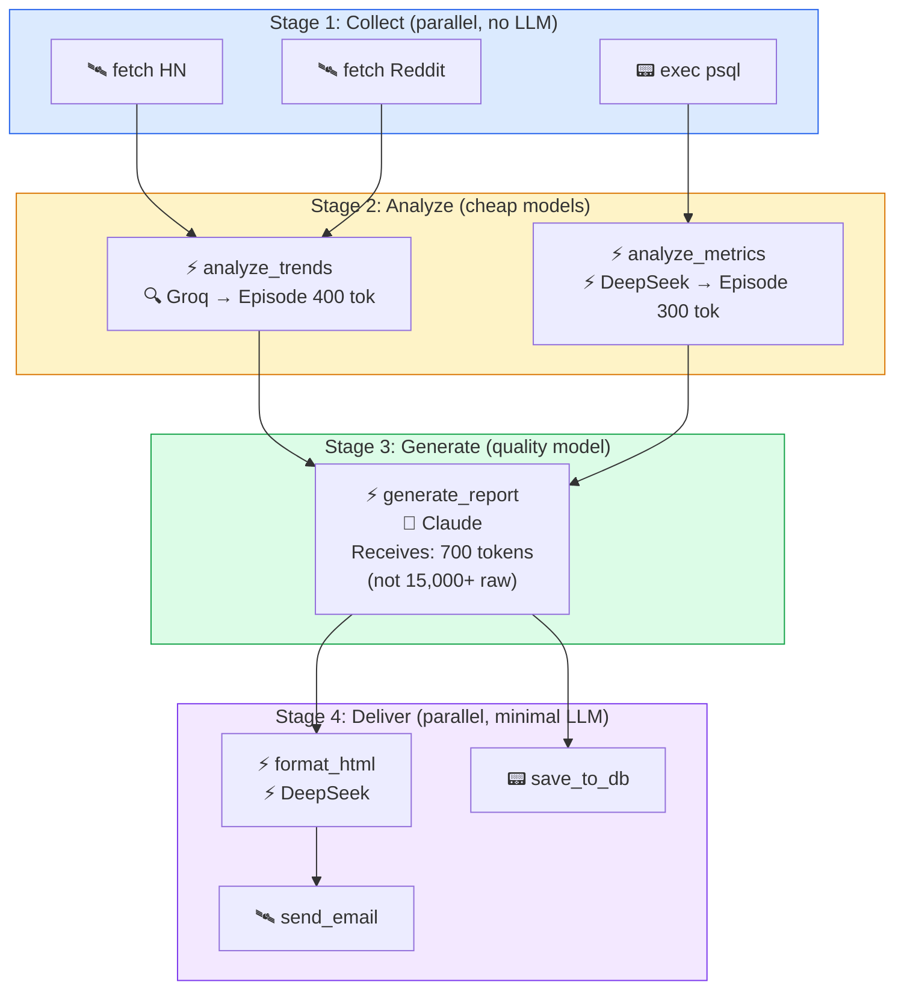
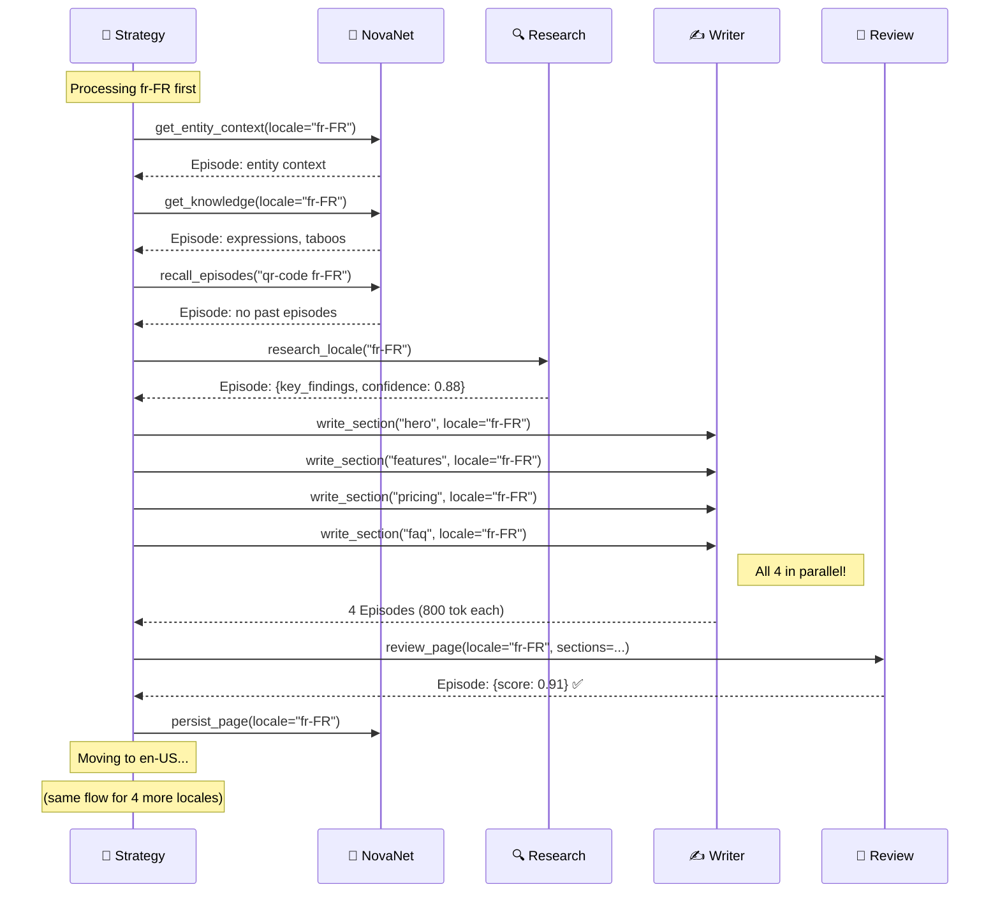
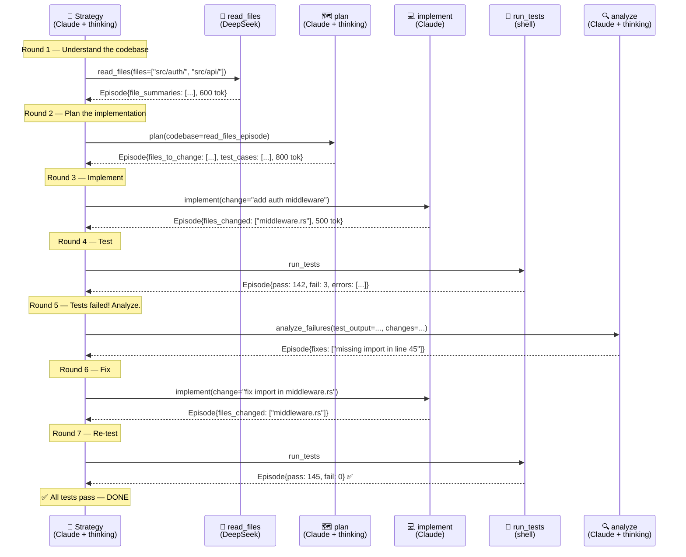

# 09 — Use Cases Cookbook

> 3 concrete use cases with complete YAML workflows.
> Copy-paste ready. Each one demonstrates different v0.30 features.

**Nika** v0.30 · **NovaNet** v0.20.0 · Updated 2026-03-14

---

## Table of Contents

1. [Use Case C: AI Pipeline Automation](#use-case-c-ai-pipeline-automation)
2. [Use Case A: Multilingual Content Generation](#use-case-a-multilingual-content-generation)
3. [Use Case B: Coding Agent Orchestration](#use-case-b-coding-agent-orchestration)
4. [Feature Usage Cheat Sheet](#feature-usage-cheat-sheet)

---

## Use Case C: AI Pipeline Automation

**Scenario:** You have a data processing pipeline — scrape web data, analyze it with an LLM, generate a report, send it via API.

**v0.30 features used:** Model Slots, Episodes, Context Budget

### The Workflow

```yaml
# pipeline-report.nika.yaml — Automated data analysis pipeline
schema: nika/workflow@0.13

model_slots:
  main:
    provider: anthropic
    model: claude-sonnet-4-6
  tactical:
    provider: deepseek
    model: deepseek-chat
  search:
    provider: groq
    model: llama-3.3-70b-versatile

tasks:
  # ──────────────────────────────────────────────────────────
  # STAGE 1: Data Collection (no LLM needed — fetch + exec)
  # ──────────────────────────────────────────────────────────

  - id: scrape_hackernews
    fetch:
      url: https://hacker-news.firebaseio.com/v0/topstories.json
      method: GET

  - id: scrape_reddit
    fetch:
      url: https://www.reddit.com/r/artificial/top.json?t=week
      method: GET
      headers:
        User-Agent: "NikaBot/1.0"

  - id: get_internal_data
    exec:
      command: "psql -c 'SELECT * FROM metrics WHERE date > NOW() - INTERVAL 7 DAY' --csv"
      shell: true

  # ──────────────────────────────────────────────────────────
  # STAGE 2: Analysis (cheap models — just extracting patterns)
  # ──────────────────────────────────────────────────────────

  - id: analyze_trends
    model_slot: search                     # ← Groq: fast, cheap
    context_budget: 6000
    with:
      hn: "$scrape_hackernews"
      reddit: "$scrape_reddit"
    infer: |
      Analyze these data sources for AI trends this week:
      HackerNews: {{with.hn}}
      Reddit: {{with.reddit}}
      Extract: top 5 topics, sentiment, emerging themes.
    structured:
      schema:
        type: object
        properties:
          topics: { type: array, items: { type: string } }
          sentiment: { type: string }
          themes: { type: array, items: { type: string } }
        required: [topics, sentiment, themes]
    episode:
      compress: true
      max_tokens: 400                      # ← Compressed to 400 tokens
      retain: [topics, sentiment, themes]

  - id: analyze_metrics
    model_slot: tactical                   # ← DeepSeek: very cheap
    context_budget: 4000
    with:
      data: "$get_internal_data"
    infer: |
      Analyze these internal metrics:
      {{with.data}}
      Summarize: key changes, anomalies, week-over-week trends.
    structured:
      schema:
        type: object
        properties:
          changes: { type: array, items: { type: string } }
          anomalies: { type: array, items: { type: string } }
        required: [changes]
    episode:
      compress: true
      max_tokens: 300
      retain: [changes, anomalies]

  # ──────────────────────────────────────────────────────────
  # STAGE 3: Report Generation (quality model — content matters)
  # ──────────────────────────────────────────────────────────

  - id: generate_report
    model_slot: main                       # ← Claude: quality writing
    context_budget: 8000
    with:
      trends: "$analyze_trends"            # ← Gets 400-token episode, not raw data
      metrics: "$analyze_metrics"          # ← Gets 300-token episode, not raw data
    infer: |
      Generate a weekly AI intelligence report.

      External Trends: {{with.trends}}
      Internal Metrics: {{with.metrics}}

      Format:
      1. Executive Summary (3 sentences)
      2. Key Trends (top 5 with analysis)
      3. Internal Performance (metrics vs last week)
      4. Recommendations (3 action items)

  # ──────────────────────────────────────────────────────────
  # STAGE 4: Delivery (exec + fetch — no LLM needed)
  # ──────────────────────────────────────────────────────────

  - id: format_html
    model_slot: tactical                   # ← DeepSeek: simple formatting
    with:
      report: "$generate_report"
    infer: "Convert this report to clean HTML with inline CSS: {{with.report}}"

  - id: send_email
    with:
      html: "$format_html"
    fetch:
      url: https://api.sendgrid.com/v3/mail/send
      method: POST
      headers:
        Authorization: "Bearer ${SENDGRID_API_KEY}"
      json:
        personalizations:
          - to: [{ email: "team@company.com" }]
        from: { email: "nika@company.com" }
        subject: "Weekly AI Intelligence Report"
        content:
          - type: text/html
            value: "{{with.html}}"

  - id: save_to_db
    with:
      report: "$generate_report"
    exec:
      command: "psql -c \"INSERT INTO reports (content, created_at) VALUES ('{{with.report}}', NOW())\""
      shell: true

flows:
  - source: scrape_hackernews
    target: analyze_trends
  - source: scrape_reddit
    target: analyze_trends
  - source: get_internal_data
    target: analyze_metrics
  - source: analyze_trends
    target: generate_report
  - source: analyze_metrics
    target: generate_report
  - source: generate_report
    target: format_html
  - source: format_html
    target: send_email
  - source: generate_report
    target: save_to_db
```

### What happens at execution



### Cost Analysis

```
┌─────────────────────────────────────────────────────────────────────────────────┐
│  💰 COST BREAKDOWN                                                              │
├─────────────────────────────────────────────────────────────────────────────────┤
│                                                                                 │
│  Task               Model Slot    Tokens    Cost                                │
│  ─────────────────────────────────────────────────                              │
│  scrape_hackernews   (none)        0         $0                                 │
│  scrape_reddit       (none)        0         $0                                 │
│  get_internal_data   (none)        0         $0                                 │
│  analyze_trends      search/Groq   3K        $0.0009                           │
│  analyze_metrics     tactical/DS   2K        $0.0002                           │
│  generate_report     main/Claude   4K        $0.012                            │
│  format_html         tactical/DS   2K        $0.0002                           │
│  send_email          (none)        0         $0                                 │
│  save_to_db          (none)        0         $0                                 │
│  ─────────────────────────────────────────────────                              │
│  TOTAL                             11K       $0.0133                            │
│                                                                                 │
│  v0.27 (all Claude): 11K tokens × $0.003 = $0.033                             │
│  v0.30 (model slots): $0.0133                                                  │
│  Savings: 60%                                                                   │
│                                                                                 │
└─────────────────────────────────────────────────────────────────────────────────┘
```

---

## Use Case A: Multilingual Content Generation

**Scenario:** Generate localized landing pages for QR Code AI in 5 languages, using NovaNet's knowledge graph for entity context and cultural intelligence.

**v0.30 features used:** ALL 6 features (Model Slots, Episodes, Strategy, Context Budget, Memory, Introspection)

### The Workflow

```yaml
# generate-multilingual.nika.yaml — Full v0.30 showcase
schema: nika/workflow@0.13
orchestration: strategy

model_slots:
  reasoning:
    provider: anthropic
    model: claude-sonnet-4-6
    extended_thinking: true
    thinking_budget: 16384
  main:
    provider: anthropic
    model: claude-sonnet-4-6
  search:
    provider: groq
    model: llama-3.3-70b-versatile
  tactical:
    provider: deepseek
    model: deepseek-chat

mcp:
  servers:
    novanet:
      command: cargo
      args: ["run", "-p", "novanet-mcp"]

strategy:
  goal: |
    Generate landing pages for QR Code AI in 5 locales: fr-FR, en-US, de-DE, ja-JP, es-ES.
    For each locale:
    1. Get entity context + knowledge atoms from NovaNet
    2. Check if past episodes exist (reuse research)
    3. Research locale-specific trends
    4. Write 4 sections: hero, features, pricing, FAQ
    5. Review for quality (score >= 0.85)
    6. Persist episodes for future reuse
  model_slot: reasoning
  max_rounds: 25
  episode_budget: 50000

tasks:
  # ──────────────────────────────────────────────────────────
  # TEMPLATE: Get context from NovaNet
  # ──────────────────────────────────────────────────────────

  - id: get_entity_context
    model_slot: tactical
    invoke:
      tool: novanet_context
      server: novanet
      params:
        focus_key: "{{with.entity_key}}"
        locale: "{{with.locale}}"
        mode: page
    episode:
      compress: true
      max_tokens: 500

  - id: get_knowledge
    model_slot: tactical
    invoke:
      tool: novanet_context
      server: novanet
      params:
        focus_key: "{{with.entity_key}}"
        locale: "{{with.locale}}"
        mode: knowledge
        atom_type: all
    episode:
      compress: true
      max_tokens: 400
      retain: [expressions, taboos, audience_traits]

  # ──────────────────────────────────────────────────────────
  # TEMPLATE: Check past experience
  # ──────────────────────────────────────────────────────────

  - id: recall_episodes
    model_slot: tactical
    invoke:
      tool: novanet_search
      server: novanet
      params:
        query: "{{with.entity_key}} {{with.locale}} research"
        kinds: ["AgentEpisode"]
        limit: 5
    episode:
      compress: true
      max_tokens: 300

  # ──────────────────────────────────────────────────────────
  # TEMPLATE: Research (skip if past episodes are fresh)
  # ──────────────────────────────────────────────────────────

  - id: research_locale
    model_slot: search
    context_budget: 6000
    with:
      locale: "$get_entity_context.locale"
      past_episodes: "$recall_episodes"
      entity_key: "$get_entity_context.entity_key"
    infer: |
      Research QR code market trends for {{with.locale}}.
      Past experience (if any): {{with.past_episodes}}
      Focus on: local adoption rates, popular use cases, regulatory requirements.
    structured:
      schema:
        type: object
        properties:
          key_findings: { type: array, items: { type: string } }
          market_size: { type: string }
          regulations: { type: array, items: { type: string } }
        required: [key_findings]
    episode:
      compress: true
      max_tokens: 400
      retain: [key_findings, market_size, regulations]
      persist: novanet
      entity_link: "{{with.entity_key}}"

  # ──────────────────────────────────────────────────────────
  # TEMPLATE: Write sections
  # ──────────────────────────────────────────────────────────

  - id: write_section
    model_slot: main
    context_budget: 8000
    with:
      section: "$strategy.current_section"
      locale: "$get_entity_context.locale"
      entity_context: "$get_entity_context"
      knowledge: "$get_knowledge"
      research: "$research_locale"
    infer: |
      Write the {{with.section}} section for a QR Code AI landing page.

      Locale: {{with.locale}}
      Entity context: {{with.entity_context}}
      Knowledge atoms: {{with.knowledge}}
      Research: {{with.research}}

      RULES:
      - Write natively in the target language (NOT translated)
      - Use the provided expressions naturally
      - Respect cultural taboos listed in knowledge atoms
      - Match audience traits (formal/informal, direct/indirect)
    structured:
      schema:
        type: object
        properties:
          content: { type: string }
          cta_text: { type: string }
          word_count: { type: integer }
        required: [content]
    episode:
      compress: true
      retain: [content]
      max_tokens: 800

  # ──────────────────────────────────────────────────────────
  # TEMPLATE: Review quality
  # ──────────────────────────────────────────────────────────

  - id: review_page
    model_slot: reasoning
    context_budget: 12000
    with:
      locale: "$get_entity_context.locale"
      all_sections: "$write_section"
    infer: |
      Review this landing page for {{with.locale}}.

      Sections: {{with.all_sections}}

      Check:
      1. Language quality (native, not translated?)
      2. Cultural appropriateness (taboos respected?)
      3. Expression usage (knowledge atoms used naturally?)
      4. Completeness (all sections have CTA?)
      5. SEO readiness (keywords present?)
    structured:
      schema:
        type: object
        properties:
          score: { type: number }
          issues: { type: array, items: { type: string } }
          suggestions: { type: array, items: { type: string } }
        required: [score, issues]
    episode:
      compress: true
      retain: [score, issues, suggestions]
      confidence_threshold: 0.85

  # ──────────────────────────────────────────────────────────
  # TEMPLATE: Store result in NovaNet
  # ──────────────────────────────────────────────────────────

  - id: persist_page
    model_slot: tactical
    invoke:
      tool: novanet_write
      server: novanet
      params:
        operation: upsert_node
        class: PageNative
        key: "homepage-{{with.locale}}"
        locale: "{{with.locale}}"
        properties:
          content: "{{with.final_content}}"
          generated_by: nika
          quality_score: "{{with.score}}"
    episode:
      compress: true
      max_tokens: 100
      persist: novanet
      entity_link: qr-code-ai
```

### Execution Flow (Strategy Mode)



### NovaNet's Role in Each Step

```
┌─────────────────────────────────────────────────────────────────────────────────┐
│  🧠 WHAT NOVANET PROVIDES AT EACH STEP                                         │
├─────────────────────────────────────────────────────────────────────────────────┤
│                                                                                 │
│  get_entity_context → "QR Code AI is a SaaS product that generates             │
│                         dynamic QR codes using AI. Key features:                │
│                         customization, analytics, batch generation..."          │
│                                                                                 │
│  get_knowledge →                                                                │
│    expressions:  "code QR" (not "QR code" in French)                           │
│                  "flash code" (alternate term in FR)                            │
│                  "générer" (preferred over "créer" for AI context)              │
│    taboos:       "Don't use 'gratuit' in headlines (implies low quality)"      │
│    audience:     "French B2B prefers formal tone, data-driven arguments"       │
│                                                                                 │
│  recall_episodes → Past research findings from previous sessions               │
│    (or empty if first run — research will be done fresh)                       │
│                                                                                 │
│  persist_page → Stores generated PageNative in the graph                       │
│    linked to Entity "qr-code-ai" + Locale "fr-FR"                             │
│    with provenance: generated_by=nika, quality_score=0.91                      │
│                                                                                 │
└─────────────────────────────────────────────────────────────────────────────────┘
```

---

## Use Case B: Coding Agent Orchestration

**Scenario:** A coding agent that analyzes a codebase, plans changes, implements them, runs tests, and iterates until tests pass.

**v0.30 features used:** Model Slots, Episodes, Strategy, Context Budget, Introspection

### The Workflow

```yaml
# code-agent.nika.yaml — Coding agent with strategy mode
schema: nika/workflow@0.13
orchestration: strategy

model_slots:
  reasoning:
    provider: anthropic
    model: claude-sonnet-4-6
    extended_thinking: true
    thinking_budget: 32768
  main:
    provider: anthropic
    model: claude-sonnet-4-6
  tactical:
    provider: deepseek
    model: deepseek-chat

strategy:
  goal: |
    Implement the feature described in the user's request.
    Steps:
    1. Read relevant source files to understand the codebase
    2. Plan the implementation (what to change and why)
    3. Implement changes (write/edit files)
    4. Run tests
    5. If tests fail: analyze errors, fix, re-test
    6. Done when all tests pass
  model_slot: reasoning
  max_rounds: 15
  episode_budget: 30000

context:
  files:
    request: ./feature-request.md
    architecture: ./docs/architecture.md

tasks:
  # ──────────────────────────────────────────────────────────
  # TEMPLATE: Read source files
  # ──────────────────────────────────────────────────────────

  - id: read_files
    model_slot: tactical
    with:
      files: "$strategy.target_files"
    agent:
      prompt: |
        Read the source files relevant to this task: {{with.files}}
        Summarize what each file does and how they relate.
      tools: [nika:read, nika:glob, nika:grep]
      max_turns: 5
    episode:
      compress: true
      max_tokens: 600
      retain: [file_summaries, dependencies]

  # ──────────────────────────────────────────────────────────
  # TEMPLATE: Plan implementation
  # ──────────────────────────────────────────────────────────

  - id: plan
    model_slot: reasoning
    context_budget: 10000
    with:
      codebase: "$read_files"
    infer: |
      Based on the feature request and codebase analysis, create an implementation plan.

      Feature request: {{context.files.request}}
      Architecture: {{context.files.architecture}}
      Codebase analysis: {{with.codebase}}

      Output:
      1. Files to create/modify
      2. Changes per file (specific functions/structs)
      3. Test cases needed
      4. Risk assessment
    structured:
      schema:
        type: object
        properties:
          files_to_change: { type: array, items: { type: string } }
          test_cases: { type: array, items: { type: string } }
          risks: { type: array, items: { type: string } }
        required: [files_to_change, test_cases]
    episode:
      compress: true
      max_tokens: 800
      retain: [files_to_change, test_cases, risks]

  # ──────────────────────────────────────────────────────────
  # TEMPLATE: Implement changes
  # ──────────────────────────────────────────────────────────

  - id: implement
    model_slot: main
    context_budget: 12000
    with:
      change_description: "$strategy.current_change"
      plan: "$plan"
      relevant_code: "$read_files"
    agent:
      prompt: |
        Implement the following change: {{with.change_description}}

        Plan: {{with.plan}}
        Relevant code: {{with.relevant_code}}

        Use nika:edit for modifications and nika:write for new files.
        Follow existing code style and patterns.
      tools: [nika:read, nika:write, nika:edit, nika:glob, nika:grep]
      max_turns: 10
    episode:
      compress: true
      max_tokens: 500
      retain: [files_changed, summary]

  # ──────────────────────────────────────────────────────────
  # TEMPLATE: Run tests
  # ──────────────────────────────────────────────────────────

  - id: run_tests
    exec:
      command: "cargo test 2>&1"
      shell: true
    episode:
      compress: true
      max_tokens: 400
      retain: [pass_count, fail_count, errors]

  # ──────────────────────────────────────────────────────────
  # TEMPLATE: Analyze test failures
  # ──────────────────────────────────────────────────────────

  - id: analyze_failures
    model_slot: reasoning
    context_budget: 8000
    with:
      test_output: "$run_tests"
      changes: "$implement"
    infer: |
      Tests failed. Analyze the errors and determine root cause.

      Test output: {{with.test_output}}
      Recent changes: {{with.changes}}

      For each failure:
      1. Which test failed
      2. Why it failed
      3. What to fix
      4. Specific code change needed
    structured:
      schema:
        type: object
        properties:
          failures: { type: array, items: { type: string } }
          root_causes: { type: array, items: { type: string } }
          fixes: { type: array, items: { type: string } }
        required: [failures, fixes]
    episode:
      compress: true
      max_tokens: 500
      retain: [failures, root_causes, fixes]
```

### Execution Flow



### Why This Beats a Simple Agent

```
┌─────────────────────────────────────────────────────────────────────────────────┐
│  SIMPLE AGENT vs STRATEGY CODING AGENT                                          │
├─────────────────────────────────────────────────────────────────────────────────┤
│                                                                                 │
│  Simple agent (v0.27):                                                          │
│  • ONE long conversation with the LLM                                           │
│  • Context grows with every tool call                                           │
│  • After 20 tool calls → dumb zone → makes mistakes                            │
│  • Can't switch models for different subtasks                                   │
│  • Everything in one prompt = confused, unfocused                               │
│                                                                                 │
│  Strategy coding agent (v0.30):                                                 │
│  • Strategy LLM PLANS what to do (with extended thinking)                      │
│  • Each task (read, plan, implement, test) has fresh context                   │
│  • Episodes pass only essential info (not 500 lines of code)                   │
│  • Cheap model reads files (DeepSeek), expensive model plans (Claude)          │
│  • If tests fail → analyze → fix → re-test (adaptive loop)                    │
│                                                                                 │
│  Result: More reliable, cheaper, and debuggable (traces show each step).       │
│                                                                                 │
└─────────────────────────────────────────────────────────────────────────────────┘
```

---

## Feature Usage Cheat Sheet

Quick reference for which YAML fields to use:

```yaml
# ══════════════════════════════════════════════════════════════
# FEATURE 1: MODEL SLOTS
# ══════════════════════════════════════════════════════════════

model_slots:
  main:      { provider: anthropic, model: claude-sonnet-4-6 }
  tactical:  { provider: deepseek,  model: deepseek-chat }
  search:    { provider: groq,      model: llama-3.3-70b-versatile }
  reasoning: { provider: anthropic, model: claude-sonnet-4-6,
               extended_thinking: true, thinking_budget: 16384 }

default_model_slot: main

tasks:
  - id: my_task
    model_slot: search              # ← Reference a slot

# ══════════════════════════════════════════════════════════════
# FEATURE 2: EPISODES
# ══════════════════════════════════════════════════════════════

tasks:
  - id: my_task
    infer: "..."
    episode:
      compress: true                # Enable compression
      max_tokens: 500               # Max size of compressed episode
      retain: [key_findings]        # Structured extraction
      confidence_threshold: 0.8     # Quality threshold

# ══════════════════════════════════════════════════════════════
# FEATURE 3: STRATEGY ORCHESTRATION
# ══════════════════════════════════════════════════════════════

orchestration: strategy             # At workflow level

strategy:
  goal: "What you want to achieve"  # Natural language goal
  model_slot: reasoning             # Which slot for the strategist
  max_rounds: 10                    # Max dispatch rounds
  episode_budget: 15000             # Total token budget

# ══════════════════════════════════════════════════════════════
# FEATURE 4: CONTEXT BUDGET
# ══════════════════════════════════════════════════════════════

tasks:
  - id: my_task
    context_budget: 8000            # Max tokens in this task's context
    infer: "..."

# ══════════════════════════════════════════════════════════════
# FEATURE 5: PERSISTENT MEMORY (NovaNet)
# ══════════════════════════════════════════════════════════════

tasks:
  - id: my_task
    infer: "..."
    episode:
      compress: true
      persist: novanet              # Store in NovaNet
      entity_link: qr-code          # Link to entity

# ══════════════════════════════════════════════════════════════
# FEATURE 6: INTROSPECTION
# ══════════════════════════════════════════════════════════════

tasks:
  - id: smart_agent
    agent:
      prompt: "..."
      tools:
        - nika:episodes             # Past episodes
        - nika:threads              # Active/completed tasks
        - nika:strategy_state       # Round, budget
        - nika:cost                 # Token/cost report
        - nika:dag_info             # DAG structure
        - nika:task_status          # Single task status
```

---

## Comparison Table

| Dimension | Use Case C (Pipeline) | Use Case A (Multilingual) | Use Case B (Coding) |
|-----------|:--------------------:|:------------------------:|:-------------------:|
| Mode | `dag` | `strategy` | `strategy` |
| Model Slots | 3 (main, tactical, search) | 4 (all) | 3 (reasoning, main, tactical) |
| Episodes | ✅ compress + retain | ✅ compress + retain + persist | ✅ compress + retain |
| Context Budget | ✅ per-task | ✅ per-task | ✅ per-task |
| NovaNet | ❌ not needed | ✅ context + knowledge + persist | ❌ not needed |
| Memory | ❌ | ✅ persist episodes | ❌ |
| Introspection | ❌ | ❌ | ✅ (in agent tasks) |
| Estimated Cost | $0.013 | $0.50 (5 locales) | $0.10 |
| Complexity | Low | High | Medium |

---

<div align="center">

[← 08 Complete Guide](./08-nika-030-complete-guide.md) · [📋 Index](./00-README.md)

</div>
