# 11 — Nika v0.30 Technical Reference

> The complete Nika runtime, presented as a unified product.
> What it is, how it works, every feature, every mechanism.

**Nika** v0.30 target | **NovaNet** v0.20+ | Written 2026-03-14

---

## Table of Contents

1. [What Is Nika](#1-what-is-nika)
2. [Architecture Overview](#2-architecture-overview)
3. [The 5 Semantic Verbs](#3-the-5-semantic-verbs)
4. [DAG Execution Engine](#4-dag-execution-engine)
5. [Model Routing — 4 Slots](#5-model-routing--4-slots)
6. [Agent System](#6-agent-system)
7. [Record Engine](#7-record-engine)
8. [Shaka Orchestration](#8-shaka-orchestration)
9. [Context Budget Management](#9-context-budget-management)
10. [Structured Output Pipeline](#10-structured-output-pipeline)
11. [NovaNet Integration (MCP)](#11-novanet-integration-mcp)
12. [Persistent Records](#12-persistent-records)
13. [Runtime Introspection](#13-runtime-introspection)
14. [Binding System & Data Flow](#14-binding-system--data-flow)
15. [Artifact System](#15-artifact-system)
16. [Security Model](#16-security-model)
17. [Observability & Traces](#17-observability--traces)
18. [CLI](#18-cli)
19. [TUI — 4-View Architecture](#19-tui--4-view-architecture)
20. [LSP](#20-lsp)
21. [Stack & Numbers](#21-stack--numbers)
22. [Complete Module Map](#22-complete-module-map)

---

## 1. What Is Nika

Nika is an AI workflow runtime written in Rust. You define tasks in a YAML file (`.nika.yaml`), Nika resolves the dependency graph, and executes them in parallel via tokio.

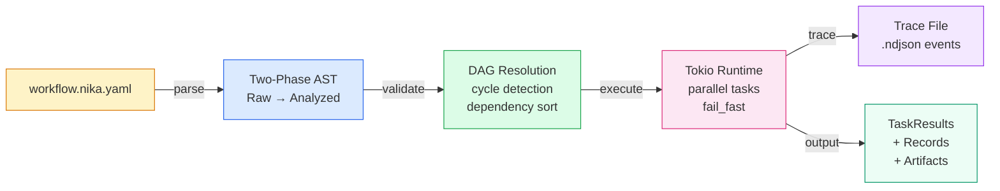

Two execution modes:

| Mode | Description | YAML field |
|------|-------------|------------|
| **dag** (default) | Static DAG — all tasks known at parse time, executed in dependency order | `orchestration: dag` or omitted |
| **shaka** | Dynamic — a Shaka orchestrator dispatches satellites across rounds | `orchestration: shaka` |

---

## 2. Architecture Overview

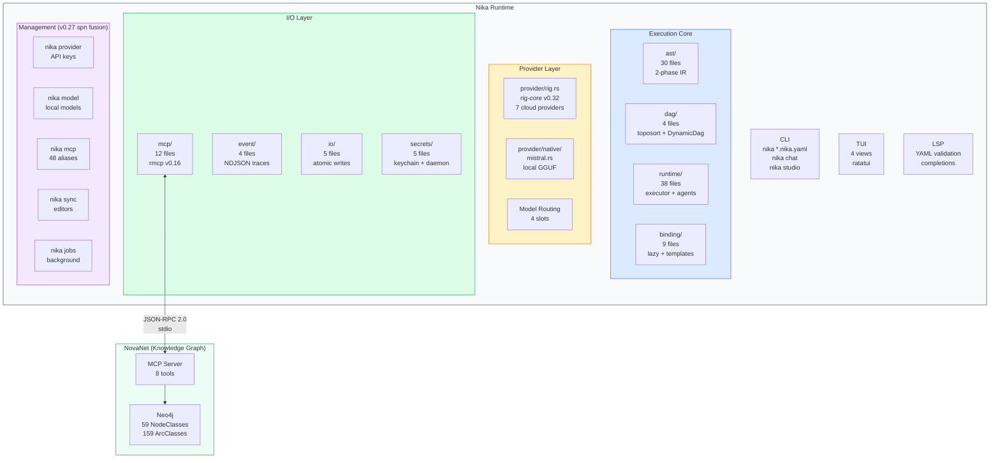

### The Brain & Body Pattern

| Role | System | Responsibility |
|------|--------|----------------|
| **Brain** | NovaNet | Knows things — entities, locales, knowledge atoms, SEO data, denomination forms |
| **Body** | Nika | Does things — runs workflows, calls LLMs, executes shell commands, manages tools |
| **Nervous System** | MCP | Connects them — JSON-RPC 2.0 protocol, 8 tools, bidirectional |

**The Golden Rule**: KNOWING goes to NovaNet. DOING goes to Nika. CONNECTING uses MCP.

---

## 3. The 5 Semantic Verbs

Every task uses exactly one verb. No more, no less.

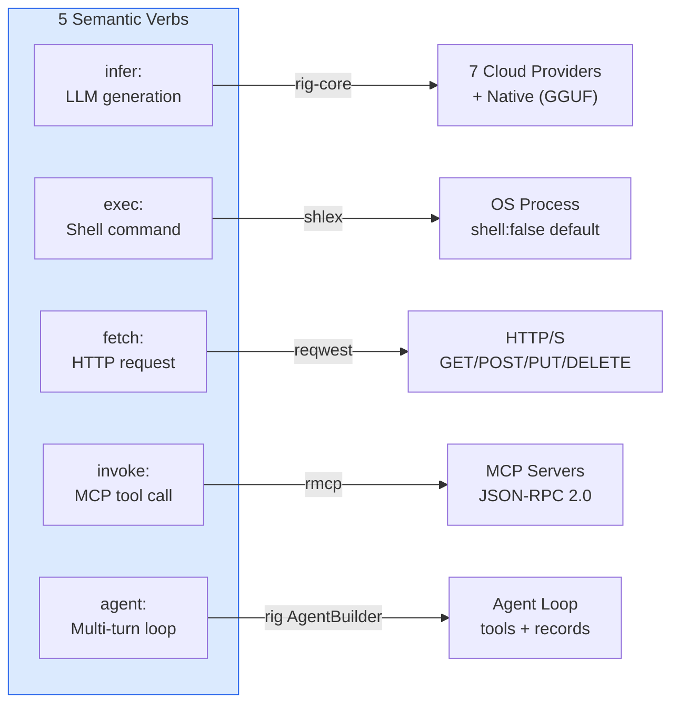

### Verb Reference

| Verb | Purpose | Shorthand | Full Form |
|------|---------|-----------|-----------|
| `infer:` | One-shot LLM call | `infer: "prompt"` | `infer: { prompt, provider, model, temperature, system, max_tokens, response_format, extended_thinking }` |
| `exec:` | Shell command | `exec: "command"` | `exec: { command, shell, env, timeout }` |
| `fetch:` | HTTP request | -- | `fetch: { url, method, headers, body, json }` |
| `invoke:` | MCP tool call | -- | `invoke: { tool, server, params }` |
| `agent:` | Multi-turn agentic loop | -- | `agent: { prompt, system, provider, model, mcp, tools, max_turns, depth_limit, strategy, ... }` |

### YAML Examples

```yaml
# infer: — shorthand
- id: headline
  infer: "Generate a headline for QR Code AI"

# infer: — full form with LLM controls
- id: creative
  infer:
    prompt: "Write a tagline"
    provider: anthropic
    model: claude-sonnet-4-6
    temperature: 0.9
    system: "You are a creative copywriter"
    max_tokens: 100
    extended_thinking: true
    thinking_budget: 8192

# exec: — with env injection
- id: build
  exec:
    command: "npm run build"
    env:
      NODE_ENV: production
    shell: true  # Opt-in for pipes/redirects

# fetch: — with JSON body
- id: api_call
  fetch:
    url: "https://api.example.com/data"
    method: POST
    headers:
      Authorization: "Bearer $token"
    json:
      query: "QR code trends"

# invoke: — MCP tool call
- id: get_context
  invoke: novanet_context
  params:
    focus_key: "qr-code"
    locale: "fr-FR"
    mode: "page"

# agent: — multi-turn with tools
- id: researcher
  agent:
    prompt: "Research QR code trends and write a summary"
    provider: anthropic
    model: claude-sonnet-4-6
    mcp: [novanet]
    tools: [nika:read, nika:write, nika:glob]
    max_turns: 20
    depth_limit: 3
    completion:
      mode: explicit  # Must call nika:complete to finish
```

---

## 4. DAG Execution Engine

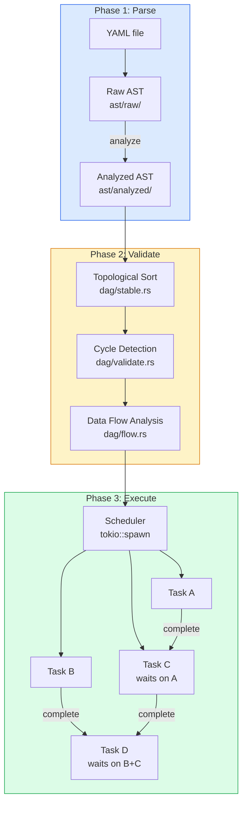

### Two-Phase IR Architecture

| Phase | Module | Input | Output |
|-------|--------|-------|--------|
| **Raw Parse** | `ast/raw/parser.rs` | YAML string | `RawWorkflow` — unvalidated struct with raw strings |
| **Analysis** | `ast/analyzer/analyze.rs` | `RawWorkflow` | `AnalyzedWorkflow` — resolved IDs, validated deps, typed actions |

### Parallel Execution

Tasks without dependencies execute concurrently via `tokio::spawn`. When a task completes, its dependents are released.

### fail_fast Behavior

When `fail_fast: true` (default):

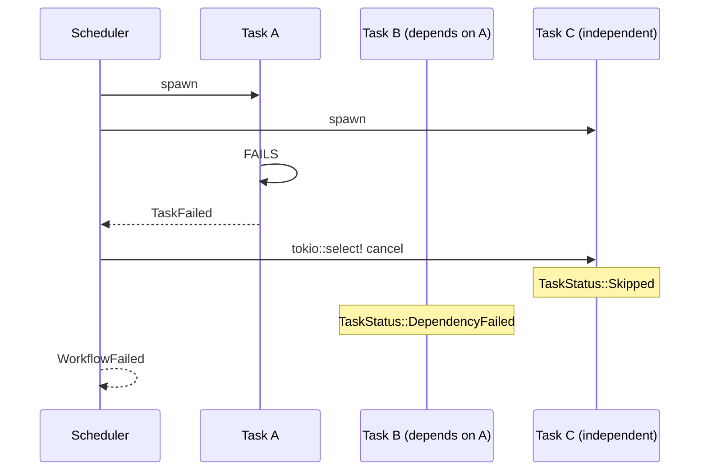

- `tokio::select!` races semaphore acquisition against a cancellation token
- In-flight tasks are cancelled immediately
- Unstarted dependents get `DependencyFailed { dependency: "task_a" }`
- Distinguishes true deadlock (NIKA-025) from dependency chain failure (NIKA-026)

### for_each Parallelism

```yaml
- id: generate_pages
  for_each: ["fr-FR", "en-US", "de-DE"]
  as: locale
  concurrency: 5
  fail_fast: true
  infer: "Generate page in {{use.locale}}"
```

Creates N task instances running in a `tokio::JoinSet` with bounded concurrency.

### DynamicDag (v0.30 — shaka mode)

In `orchestration: shaka` mode, the DAG is mutable at runtime. The Shaka orchestrator can dispatch new satellites that get inserted into the live DAG.

| DAG Type | When | Mutability |
|----------|------|------------|
| `StableDag` | `orchestration: dag` (default) | Immutable after parse |
| `DynamicDag` | `orchestration: shaka` | Tasks added at runtime by Shaka orchestrator |

Source: `dag/stable.rs` (existing), `dag/dynamic.rs` (v0.30)

---

## 5. Model Routing — 4 Slots

Route different cognitive tasks to different providers/models within a single workflow.

```mermaid
flowchart LR
    subgraph SLOTS["model_slots:"]
        EDISON["edison\nclaude-sonnet\n$$$$"]
        ATLAS["atlas\nllama-3.3-70b\n$"]
        YORK["york\ndeepseek-chat\n$$"]
        PYTHAGORAS["pythagoras\nclaude + thinking\n$$$$$"]
    end

    subgraph TASKS["Task Routing"]
        T1["plan → pythagoras"]
        T2["generate → edison"]
        T3["classify → atlas"]
        T4["research → york"]
    end

    PYTHAGORAS -.-> T1
    EDISON -.-> T2
    ATLAS -.-> T3
    YORK -.-> T4

    style SLOTS fill:#dbeafe,stroke:#2563eb
    style TASKS fill:#fef3c7,stroke:#d97706
```

### YAML Configuration

```yaml
schema: nika/workflow@0.12

model_slots:
  edison:
    provider: anthropic
    model: claude-sonnet-4-6
    # Primary content generation, complex reasoning

  atlas:
    provider: groq
    model: llama-3.3-70b-versatile
    # Simple decisions, classifications, formatting

  york:
    provider: deepseek
    model: deepseek-chat
    # Research, search synthesis, information retrieval

  pythagoras:
    provider: anthropic
    model: claude-sonnet-4-6
    extended_thinking: true
    thinking_budget: 16384
    # Strategy, planning, review, critique

default_model_slot: edison

tasks:
  - id: plan
    model_slot: pythagoras
    infer: "Create a content plan"

  - id: classify
    model_slot: atlas
    infer: "Is this about QR codes? Answer yes/no"

  - id: generate
    model_slot: edison
    infer: "Generate the landing page"
```

### Provider Inventory

| Provider | Type | Models | Use Case |
|----------|------|--------|----------|
| **Anthropic** | Cloud | Claude Sonnet, Haiku, Opus | General purpose, reasoning |
| **OpenAI** | Cloud | GPT-4o, GPT-4o-mini | General purpose |
| **Mistral** | Cloud | Mistral Large, Medium, Small | European AI |
| **Groq** | Cloud | Llama 3.3 70B, Mixtral | Fast inference |
| **DeepSeek** | Cloud | DeepSeek-Chat, DeepSeek-R1 | Reasoning, search |
| **Google** | Cloud | Gemini 2.0 Flash, Pro | Multimodal, grounded search |
| **Native** | Local | Any GGUF model via mistral.rs | Zero API key, Metal/CUDA |

### Cost Impact

Model routing enables significant cost reduction:

```
WITHOUT routing (v0.27):
  All tasks use Claude Sonnet → $$$$ per task
  200 pages × 5 locales × 5 tasks = 5,000 calls at $$$$ each

WITH routing (v0.30):
  Planning (5%) → pythagoras ($$$$)
  Generation (35%) → edison ($$$$)
  Classification/formatting (60%) → atlas ($)

  Result: ~60% cost reduction on same pipeline
```

Source: `provider/rig.rs` (existing), `ast/raw/model_slot.rs` (v0.28)

---

## 6. Agent System

The `agent:` verb creates a multi-turn execution loop where the LLM iterates with tool access until task completion.

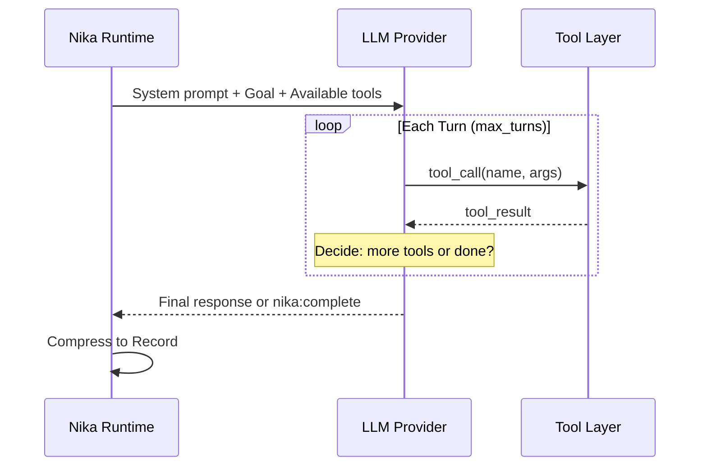

### Tool Inventory

**12 Builtin Tools (7 core + 5 file):**

| Tool | Category | Description |
|------|----------|-------------|
| `nika:sleep` | Core | Pause execution (max 5 min) |
| `nika:log` | Core | Emit log event at level |
| `nika:emit` | Core | Emit custom event to trace |
| `nika:assert` | Core | Validate condition, fail if false |
| `nika:prompt` | Core | Human-in-the-loop user input |
| `nika:run` | Core | Execute nested workflow |
| `nika:complete` | Core | Signal agent task completion |
| `nika:read` | File | Read file with line numbers |
| `nika:write` | File | Create/overwrite file |
| `nika:edit` | File | Modify file (old_string → new_string) |
| `nika:glob` | File | Find files by pattern |
| `nika:grep` | File | Search content with regex |

**6 Introspection Tools (v0.30):**

| Tool | Returns |
|------|---------|
| `nika:records` | Accumulated records `[{task_id, summary, confidence, tokens}]` |
| `nika:threads` | Active/completed threads `[{task_id, status, model_slot}]` |
| `nika:shaka` | Shaka progress `{round, max_rounds, budget_used, budget_total}` |
| `nika:cost` | Token usage and cost report `{total_tokens, total_cost, per_model}` |
| `nika:dag_info` | DAG structure `{predecessors, successors, critical_path}` |
| `nika:task_status` | Individual task status `{task_id, status, record}` |

**+ All MCP tools** from configured servers (NovaNet, Neo4j, GitHub, Slack, etc.)

### spawn_agent — Nested Agents

An agent can launch sub-agents via the `spawn_agent` internal tool.

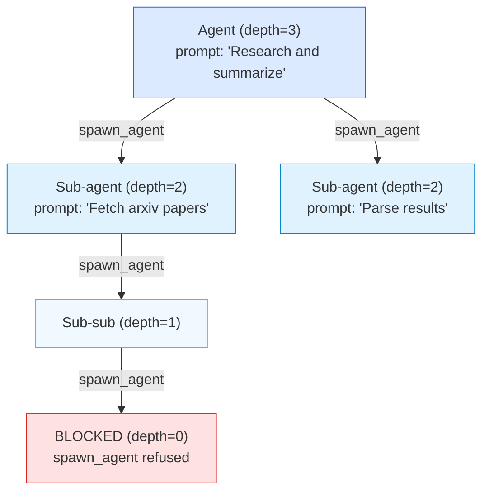

- `depth_limit` decremented at each spawn (default: 3, max: 10)
- Sub-agent inherits parent's MCP connections
- Result returned to parent agent

### decompose: — Runtime DAG Expansion

The agent can call `nika:decompose` to break a task into sub-tasks at runtime. The DAG is re-resolved dynamically. Used when the agent discovers the problem is more complex than anticipated.

### Completion Modes

| Mode | Behavior |
|------|----------|
| `natural` (default) | Completes when LLM has no more tool calls |
| `explicit` | Agent must call `nika:complete` tool |
| `pattern` | Completes on pattern match in output |

Source: `runtime/rig_agent_loop/` (7 files), `runtime/builtin/` (13 files), `runtime/spawn.rs`

---

## 7. Record Engine

Records are compressed representations of task execution, generated at the natural completion boundary. Downstream tasks receive records, not raw output.

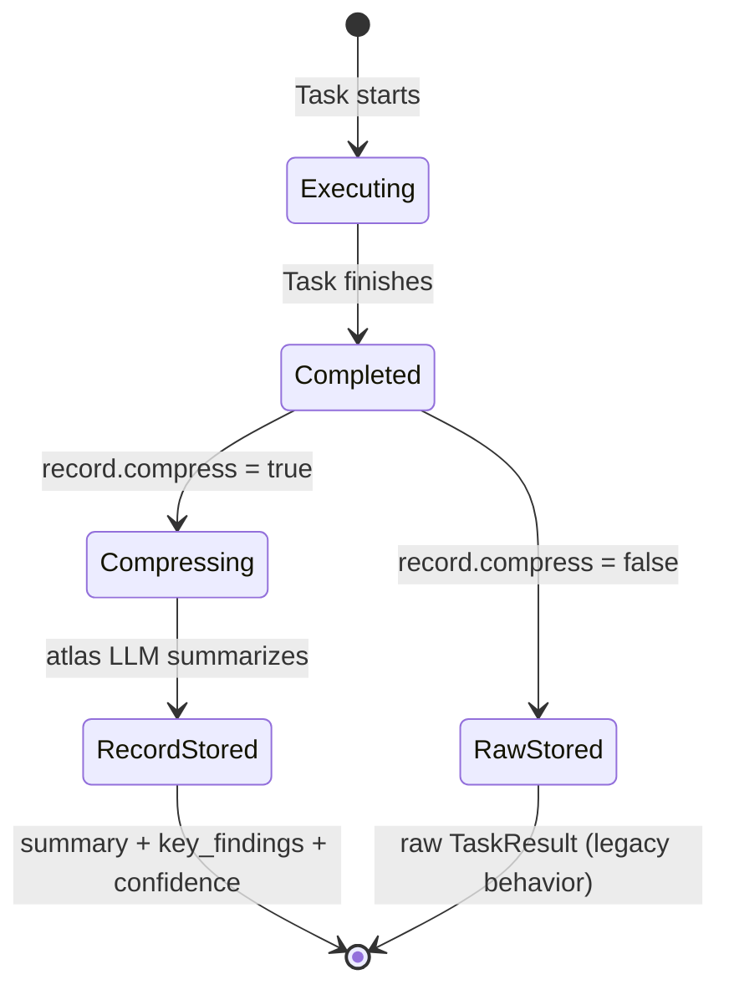

### Record Data Structure

```rust
pub struct Record {
    pub task_id: TaskId,
    pub summary: String,           // LLM-compressed summary
    pub key_findings: Vec<String>, // Extracted key points
    pub raw_output: Option<String>,// Debug only, not passed downstream
    pub model_used: String,        // Which model produced this
    pub tokens_spent: u64,         // Cost tracking
    pub confidence: f64,           // Self-assessed 0.0-1.0
    pub artifacts: Vec<Artifact>,  // Files produced
}
```

### YAML Configuration

```yaml
tasks:
  - id: research
    model_slot: york
    infer: "Research QR code trends in 2026"
    record:
      compress: true            # Generate record summary
      retain: [key_findings]    # What to extract from raw output
      max_tokens: 500           # Record summary size limit
      confidence_threshold: 0.8 # Shaka can escalate if below
```

### How It Works

1. Task executes normally (any verb)
2. At completion, if `record.compress: true`:
   - The raw output is sent to the **atlas** model slot (cheap, fast)
   - The LLM produces a structured summary + key_findings + confidence score
   - The Record struct replaces the raw TaskResult for downstream bindings
3. Downstream tasks referencing this task via `$research` get the record, not the raw output

### Impact on Context Growth

```
WITHOUT records:
  Task A output: 2,000 tokens
  Task B receives: 2,000 tokens (full A)
  Task C receives: 4,000 tokens (A + B)
  Task D receives: 6,000+ tokens → context degradation

WITH records:
  Task A → Record: 300 tokens
  Task B receives: 300 tokens
  Task C receives: 600 tokens (A_rec + B_rec)
  Task D receives: relevant records only → always within budget
```

Source: `runtime/record.rs`, `runtime/record_compress.rs` (v0.28)

---

## 8. Shaka Orchestration

A new execution mode where a Shaka orchestrator dynamically dispatches satellites based on the goal and accumulated records.

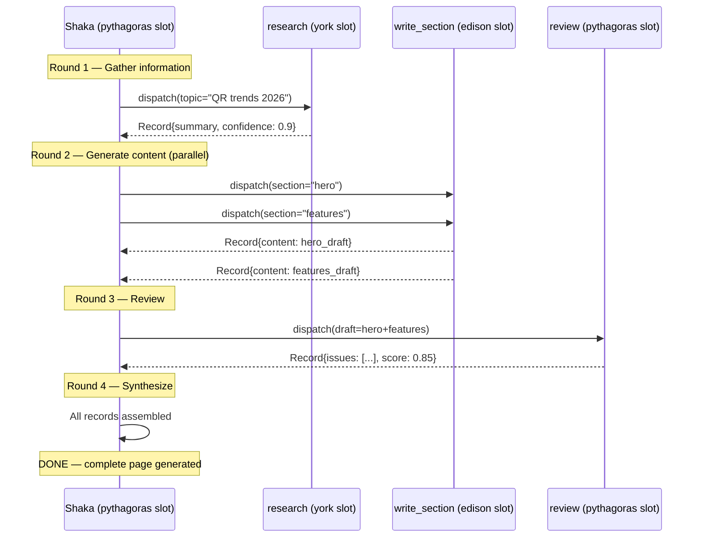

### YAML Configuration

```yaml
schema: nika/workflow@0.13
workflow: landing-page-generator

orchestration: shaka              # Enables shaka/satellites mode

model_slots:
  pythagoras: { provider: anthropic, model: claude-sonnet-4-6, extended_thinking: true }
  edison: { provider: anthropic, model: claude-sonnet-4-6 }
  york: { provider: groq, model: llama-3.3-70b-versatile }
  atlas: { provider: deepseek, model: deepseek-chat }

shaka:
  goal: "Generate a complete French landing page for QR Code AI"
  model_slot: pythagoras
  max_rounds: 10
  record_budget: 15000            # Total token budget across all records

# Satellite templates — dispatched dynamically by Shaka orchestrator
tasks:
  - id: research
    model_slot: york
    infer: "Research: {{with.topic}}"
    record: { compress: true, max_tokens: 300 }

  - id: write_section
    model_slot: edison
    infer: "Write: {{with.section}} using context: {{with.context}}"
    record: { compress: true, retain: [content], max_tokens: 800 }

  - id: review
    model_slot: pythagoras
    infer: "Review and critique: {{with.draft}}"
    record: { compress: true, retain: [issues, suggestions] }
```

### DAG vs Shaka — When to Use Which

| Criterion | DAG Mode | Shaka Mode |
|-----------|----------|------------|
| Tasks known at design time | Yes | No — discovered at runtime |
| Execution order | Fixed by depends_on | Dynamic per round |
| Stopping condition | All tasks done | Shaka orchestrator says "DONE" |
| Cost | Predictable | Variable (max_rounds bounds it) |
| Inter-task data | Raw bindings or records | Always records |
| Use case | Pipelines, ETL, deterministic flows | Creative generation, research, iterative refinement |

### Components

| Component | File | Purpose |
|-----------|------|---------|
| `ShakaOrchestrator` | `runtime/shaka.rs` | Main loop — sends goal + records to Shaka, dispatches satellites |
| `SatelliteTemplate` | `runtime/satellite.rs` | Parsed task definitions available as satellites |
| `SatelliteInstance` | `runtime/satellite.rs` | Concrete instantiation with runtime parameters |
| `DynamicDag` | `dag/dynamic.rs` | Mutable DAG that accepts new tasks at runtime |

Source: `runtime/shaka.rs`, `runtime/satellite.rs`, `dag/dynamic.rs` (v0.29)

---

## 9. Context Budget Management

Working memory awareness at the runtime level. Each task declares its context budget. The runtime enforces this via record summaries.

```mermaid
flowchart TB
    subgraph BEFORE["Without Context Budgets"]
        B1["Task A output\n2,000 tokens"] --> B2["Task B\n2,000 tokens context"]
        B2 --> B3["Task C\n4,000 tokens"]
        B3 --> B4["Task D\n6,000+ tokens"]
        B4 --> B5["Context degradation\nLLM in 'dumb zone'"]
    end

    subgraph AFTER["With Context Budgets"]
        A1["Task A → Record\n300 tokens"] --> A2["Task B\n300 tokens context"]
        A2 --> A3["Task C\n600 tokens"]
        A3 --> A4["Task D\nrelevant records only"]
        A4 --> A5["Always within budget"]
    end

    style BEFORE fill:#fee2e2,stroke:#dc2626
    style AFTER fill:#dcfce7,stroke:#16a34a
    style B5 fill:#dc2626,color:#fff
    style A5 fill:#16a34a,color:#fff
```

### YAML Configuration

```yaml
tasks:
  - id: research
    model_slot: york
    context_budget: 4000        # Max tokens in this task's context
    infer: "Research QR code trends"
    record:
      compress: true
      max_tokens: 300           # Record must fit in 300 tokens

  - id: generate
    model_slot: edison
    context_budget: 8000        # Larger budget for generation
    with:
      trends: "$research"       # Receives record, not raw output
    infer: "Generate landing page based on: {{with.trends}}"
```

### Rules

1. Each task receives ONLY: its prompt + relevant records + NovaNet context
2. Never raw history from other tasks
3. `context_budget` enforced by runtime (truncate/warn if exceeded)
4. In shaka mode, the orchestrator selects which records to include per round
5. Token budget tracked in events for observability

### Agent Budget Awareness

Agents can call `nika:get_budget` to check remaining tokens and adapt:

```
Agent: "I have 30% budget remaining → I'll simplify my approach"
Agent: "Budget critical → switching to atlas model"
Agent: "Insufficient budget for spawn_agent → handling inline"
```

Source: `runtime/context_budget.rs` (v0.29), `ast/raw/task.rs`

---

## 10. Structured Output Pipeline

When an `infer:` or `agent:` task declares an `output.schema` (JSON Schema), Nika enforces the structure through a 4-layer pipeline.

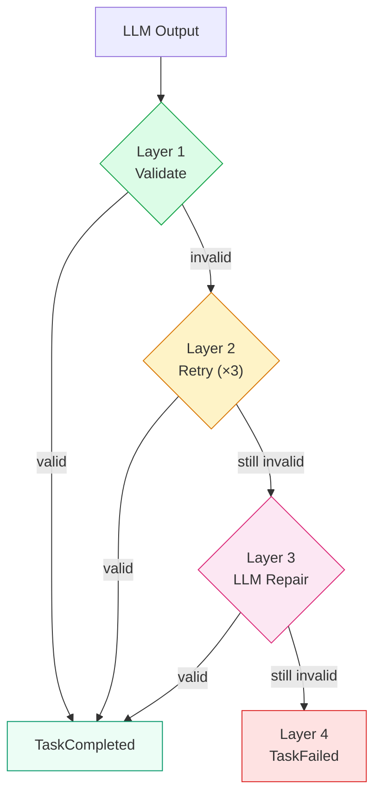

| Layer | Mechanism | Model Used |
|-------|-----------|------------|
| **1 — Validate** | JSON Schema validation against output | None |
| **2 — Retry** | Re-prompt LLM with validation error | Same as task (edison slot) |
| **3 — Repair** | Separate LLM call to fix invalid JSON | Atlas slot (cheap) |
| **4 — Fallback** | Task fails with structured error | None |

### YAML Configuration

```yaml
- id: generate
  infer: "Generate product data"
  output:
    schema:
      type: object
      properties:
        title: { type: string }
        description: { type: string }
        price: { type: number }
      required: [title, description, price]
```

No silent truncation. No corrupted data. The pipeline guarantees valid JSON or explicit failure.

Source: `runtime/structured_output.rs`, `ast/output.rs`, `ast/structured.rs`

---

## 11. NovaNet Integration (MCP)

Nika connects to NovaNet exclusively via MCP protocol. Zero Cypher in Nika.

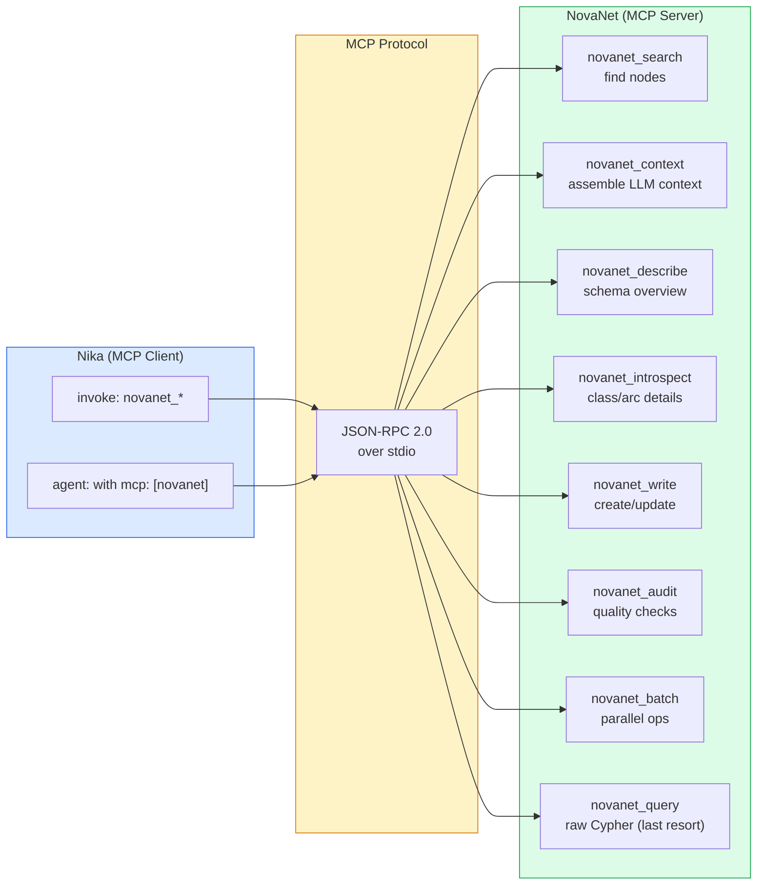

### NovaNet Tool Reference

| Tool | Mode | Purpose |
|------|------|---------|
| `novanet_search` | fulltext, property, hybrid, walk, triggers | Find nodes, traverse graph |
| `novanet_context` | page, block, knowledge, assemble | Build LLM generation context |
| `novanet_describe` | schema, entity, category, relations, locales, stats | Understand the graph |
| `novanet_introspect` | classes, class, arcs, arc | Schema details with relationships |
| `novanet_write` | upsert_node, create_arc, update_props | Mutate graph (dry_run to validate) |
| `novanet_audit` | coverage, orphans, integrity, freshness, all | Data quality checks |
| `novanet_batch` | parallel operations | Multiple ops in one call |
| `novanet_query` | raw Cypher | Analytics only (LAST RESORT) |

### NovaNet Knowledge Structure

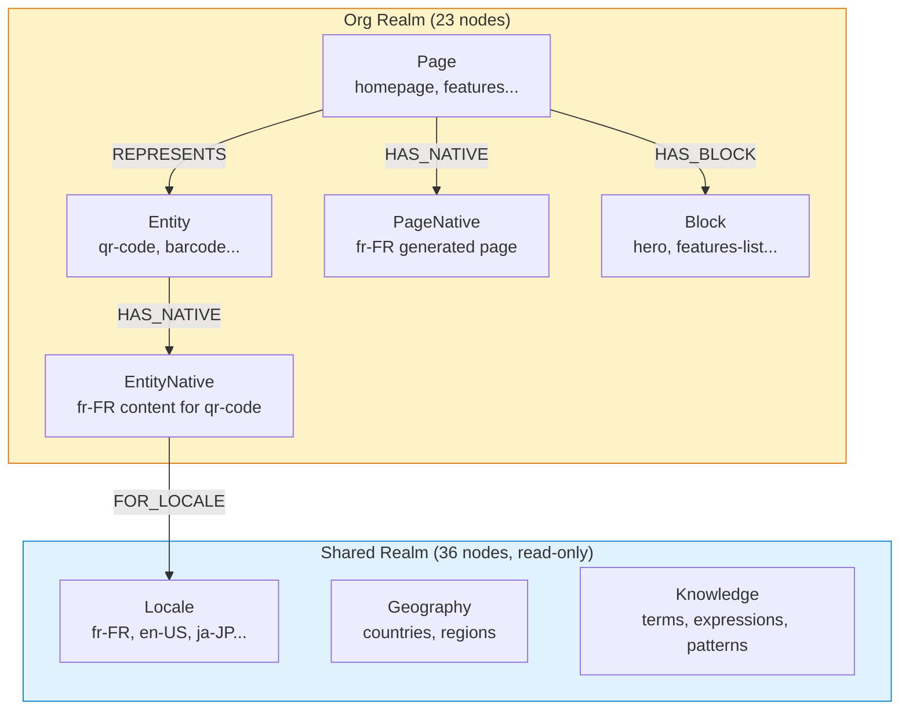

### Key Concepts

| Concept | Description |
|---------|-------------|
| **Entity** | Semantic concept (e.g., "qr-code") — defined, universal |
| **EntityNative** | Locale-specific content for an entity (e.g., fr-FR text for "qr-code") — authored |
| **Page** | URL-owning structure — owns slug, has blocks |
| **PageNative** | Generated locale-specific page content |
| **Denomination Forms** | 6 canonical forms per entity: text, title, abbrev, mixed, base, url |
| **Knowledge Atoms** | Locale knowledge: expressions, patterns, culture refs, taboos, audience traits |

### MCP Client Architecture

| Component | File | Purpose |
|-----------|------|---------|
| `McpClient` | `mcp/client.rs` | Main client with DashMap + OnceCell caching |
| `ConnectionPool` | `mcp/pool.rs` | Pool for multiple MCP servers |
| `RetryPolicy` | `mcp/retry.rs` | Retry logic for transient failures |
| `SchemaCache` | `mcp/validation/schema_cache.rs` | Cache JSON schemas from tool definitions |
| `ParameterValidator` | `mcp/validation/validator.rs` | Validate params before sending |

**Timeouts:**
- `INVOKE_TASK_DEADLINE`: 5 minutes per MCP operation
- `RECONNECT_TIMEOUT`: Auto-reconnect if server crashes
- JSON-RPC error codes preserved from server

Source: `mcp/` (12 files)

---

## 12. Persistent Records

Records compressed at task completion don't die with the workflow. Nika persists them in NovaNet's knowledge graph, enabling cross-session learning.

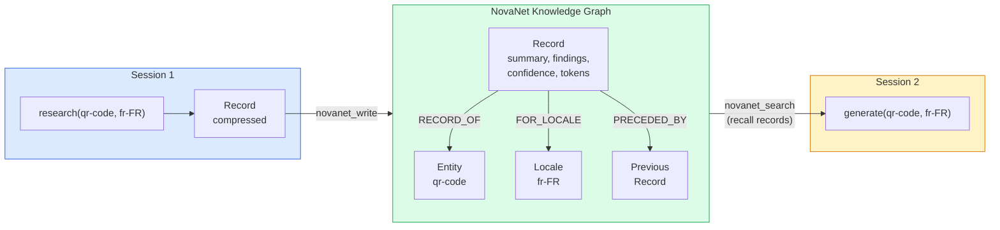

### How It Works

1. Task completes → record compressed (P-RECORD)
2. If `record.persist: novanet`, the record is written to NovaNet via `novanet_write`
3. NovaNet stores it as a `Record` node, linked to the relevant Entity and Locale
4. On next run, Nika calls `novanet_search` to recall relevant records
5. Recalled records are injected into the agent's context

### Record Node (NovaNet Schema)

```
Record (NodeClass, org realm, agent layer)
├── key: string                 # Unique identifier
├── workflow: string            # Source workflow name
├── task_id: string             # Source task
├── summary: string             # Compressed record
├── key_findings: string[]      # Extracted points
├── model_used: string          # Which model produced this
├── tokens_spent: integer       # Cost
├── confidence: float           # Self-assessed 0.0-1.0
├── timestamp: datetime         # When created
└── Arcs:
    ├── RECORD_OF → Entity      # Semantic link
    ├── FOR_LOCALE → Locale     # Locale-specific
    ├── SIMILAR_TO → Record
    └── PRECEDED_BY → Record (temporal chain)
```

### Cross-Session Learning

```
Run 1: Agent generates fr-FR content for "qr-code"
  → Tone too formal, user corrects to casual
  → Record: "tone was too formal, user preferred casual register"

Run 2: Agent receives this record in context
  → Adapts tone directly, no repeated mistake
  → Record: "casual tone applied successfully, user approved"

Run 3: Agent has both records
  → Knows the pattern, applies immediately
```

Memory is scoped per entity × locale — no cross-locale pollution.

### YAML Configuration

```yaml
tasks:
  - id: research
    infer: "Research QR code trends"
    record:
      compress: true
      persist: novanet          # Store in NovaNet
      entity_link: qr-code     # Link to semantic entity
```

Source: `runtime/record_memory.rs` (v0.30), `mcp/client.rs`

---

## 13. Runtime Introspection

6 read-only builtin tools that let agents examine their own state.

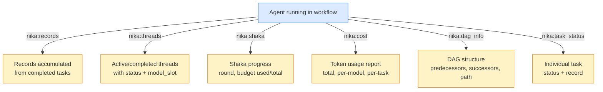

### Why This Matters

Agents make better decisions when they can observe their own state:

| Observation | Agent Decision |
|-------------|----------------|
| "30% budget remaining" | Simplify approach, use atlas model |
| "Previous task failed at confidence 0.4" | Change approach, retry with more context |
| "3 sub-agents already spawned" | Don't spawn a 4th, handle inline |
| "Round 7 of 10 in shaka mode" | Start synthesizing, stop researching |
| "DAG critical path has 2 remaining tasks" | Focus on unblocking them |

These tools join the existing 12 builtins, bringing the total to **18 builtin tools**.

Source: `runtime/builtin/` (v0.30 additions)

---

## 14. Binding System & Data Flow

The binding system connects task outputs to task inputs.

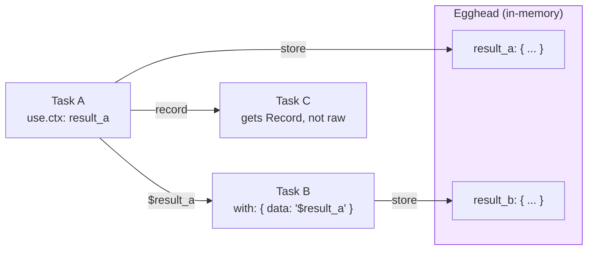

### Binding Types

| Syntax | Type | Description |
|--------|------|-------------|
| `use.ctx: name` | Store | Store task result in Egghead under `name` |
| `$name` | Reference | Reference a stored value |
| `{{use.name}}` | Template | Inline template interpolation |
| `{{inputs.locale}}` | Input | Access workflow inputs |
| `{{context.files.brand}}` | Context | Access loaded context files |
| `for_each: $items` | Iteration | Iterate over stored array |
| `lazy: true` | Deferred | Resolve only when accessed, not at planning time |

### Lazy Bindings (ADR-006)

```yaml
- id: maybe_needed
  infer: "Generate optional content"
  use.ctx: optional_data

- id: consumer
  with:
    data:
      binding: "$optional_data"
      lazy: true              # Only resolved if {{with.data}} is actually used
  infer: "Use if needed: {{with.data}}"
```

Lazy bindings avoid loading data that may not be needed, reducing context size.

### Binding Resolution Pipeline

| Module | File | Purpose |
|--------|------|---------|
| Entry parsing | `binding/entry.rs` | Parse binding expressions |
| JSONPath | `binding/jsonpath.rs` | `$.field.subfield` access |
| Mentions | `binding/mention.rs` | `@task_id` references |
| Resolution | `binding/resolve.rs` | Resolve bindings to values |
| Templates | `binding/template.rs` | `{{var}}` interpolation |
| Transforms | `binding/transform.rs` | jq-style transforms |
| Validation | `binding/validate.rs` | Validate at parse time |

Source: `binding/` (9 files)

---

## 15. Artifact System

Secure file persistence for task outputs.

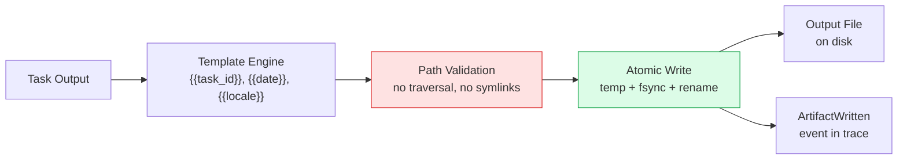

### Architecture

| Module | File | Purpose |
|--------|------|---------|
| `io::atomic` | `io/atomic.rs` | Atomic writes: temp file → fsync → rename |
| `io::security` | `io/security.rs` | Path validation, traversal prevention (`../../` blocked) |
| `io::template` | `io/template.rs` | Variable interpolation in output paths |
| `io::writer` | `io/writer.rs` | `ArtifactWriter` combining all modules |

### Security Guarantees

- **No directory traversal**: `../../etc/passwd` is rejected
- **No symlink following**: Symlinks in output paths are blocked
- **Atomic writes**: Temp file → fsync → rename prevents partial writes
- **TOCTOU mitigation**: Checks performed just before write
- **Template injection prevented**: Variables sanitized before interpolation

Source: `io/` (5 files), error codes NIKA-280 to NIKA-289

---

## 16. Security Model

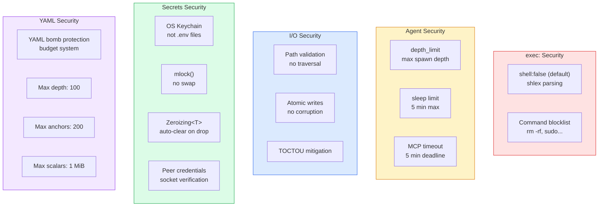

### Security Summary

| Vector | Protection | Error Code |
|--------|-----------|------------|
| Shell injection | `shell: false` default, shlex parsing | NIKA-053 |
| Directory traversal | Path validation in artifacts | NIKA-280+ |
| YAML bombs | Budget system (depth, anchors, aliases, scalars) | Parse error |
| Runaway agents | `depth_limit`, `max_turns`, `token_budget` | Agent timeout |
| Unbounded sleep | 5 minute max on `nika:sleep` | NIKA tool error |
| MCP hangs | 5 minute deadline per operation | Timeout |
| Secret exposure | OS Keychain, mlock(), Zeroizing<T>, daemon socket 0600 | N/A |
| Blocked commands | Blocklist for dangerous binaries | NIKA-053 |

Source: `runtime/security.rs`, `ast/budget.rs`, `io/security.rs`, `secrets/`

---

## 17. Observability & Traces

Every workflow run produces a NDJSON trace file with structured events.

### Event Inventory (22+ event types)

| Event | When |
|-------|------|
| `WorkflowStarted` | Workflow begins |
| `WorkflowCompleted` | All tasks done |
| `WorkflowFailed` | Workflow failed |
| `WorkflowAborted` | User cancelled |
| `TaskScheduled` | Task queued |
| `TaskStarted` | Task begins |
| `TaskCompleted` | Task done (includes record if compressed) |
| `TaskFailed` | Task failed |
| `ProviderCalled` | LLM API call made |
| `ProviderResponded` | LLM response received |
| `McpInvoke` | MCP tool called |
| `McpResponse` | MCP result received |
| `McpConnected` | MCP server connected |
| `McpError` | MCP error |
| `AgentStart` | Agent loop begins |
| `AgentTurn` | Agent turn (includes thinking if extended_thinking) |
| `AgentComplete` | Agent done |
| `AgentSpawned` | Sub-agent created |
| `ContextAssembled` | Context loaded |
| `TemplateResolved` | Template variables resolved |
| `ArtifactWritten` | File written |
| `ArtifactFailed` | File write failed |
| `RecordCreated` | Record compressed (v0.28) |
| `BudgetExceeded` | Context budget warning (v0.29) |

### CLI Trace Commands

```bash
nika trace list              # List all trace files
nika trace show <id>         # Display events for a run
nika trace export <id>       # Export as JSON/YAML
```

Source: `event/` (4 files): `emitter.rs`, `log.rs`, `trace.rs`

---

## 18. CLI

Complete CLI with spn features merged (v0.27).

### Command Reference

```
nika                              # TUI Home view
nika <workflow.nika.yaml>         # Run workflow (positional arg)
nika chat                         # Chat view
nika studio [file]                # Studio view (YAML editor)
nika check <file> [--strict]      # Validate workflow
nika new                          # Interactive workflow wizard
nika trace list|show|export       # Trace inspection

nika provider list                # Show all providers + status
nika provider set <name>          # Store API key in OS keychain
nika provider get <name>          # Retrieve (masked)
nika provider test <name>         # Validate key with API call
nika provider migrate             # Migrate env vars → keychain

nika model list                   # List local models
nika model pull <name>            # Download from HuggingFace
nika model info <name>            # Model details

nika mcp add <name>               # Add MCP server (48 aliases)
nika mcp remove <name>            # Remove server
nika mcp list                     # List configured
nika mcp test <name>              # Test connection
nika mcp tools <name>             # List available tools

nika sync                         # Sync to enabled editors
nika sync --status                # Show sync status
nika sync --enable <editor>       # Enable editor (claude-code, cursor, windsurf, vscode)

nika daemon start|stop|status     # Background daemon (keychain relay)
nika jobs submit|list|output|cancel  # Background workflow execution
nika backup create|list|restore|prune  # Unified backup
nika setup [nika|novanet|claude-code]  # Interactive onboarding wizard
```

### Provider Resolution Priority

1. OS Keychain (most secure) — via `nika provider set`
2. Environment variable — `ANTHROPIC_API_KEY`, `OPENAI_API_KEY`, etc.
3. `.env` file — via dotenvy

Source: `main.rs`, `core/` (8 files), `secrets/` (5 files)

---

## 19. TUI — 4-View Architecture

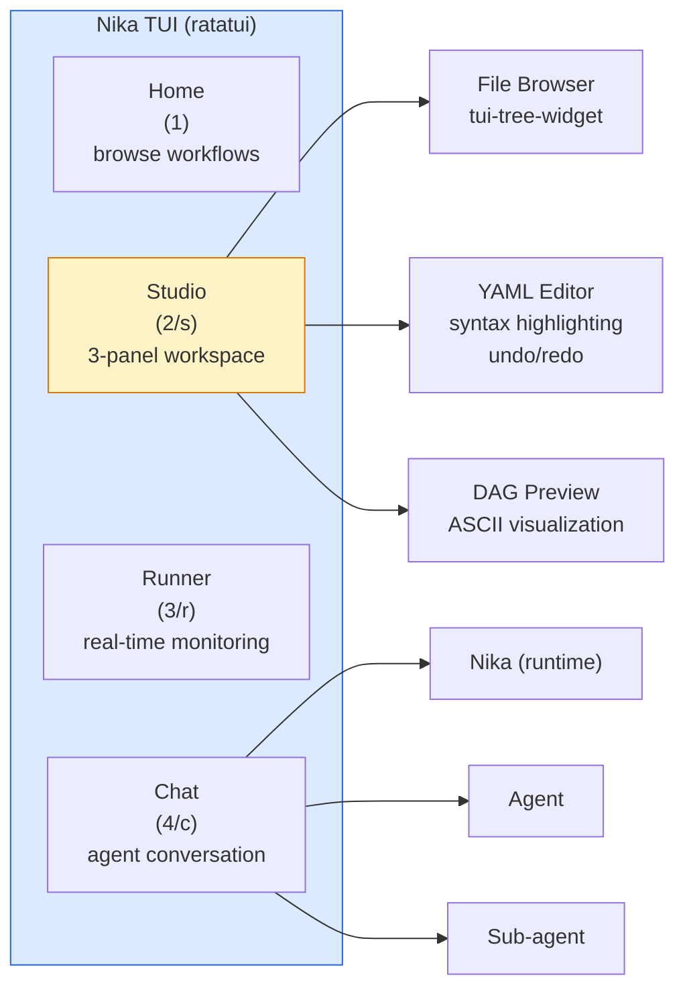

### Views

| View | Shortcut | Purpose |
|------|----------|---------|
| **Home** | `1` | Browse workflows, recent files |
| **Studio** | `2` or `s` | 3-panel workspace: Browser \| Editor \| DAG Preview |
| **Runner** | `3` or `r` | Real-time execution monitoring: tasks, status, logs |
| **Chat** | `4` or `c` | Conversational agent interface |

### Studio Features

- **File browser**: VS Code-like tree widget, navigate project files
- **YAML editor**: Syntax highlighting, schema validation inline, tab management
- **DAG preview**: ASCII visualization of task dependencies
- **Undo/Redo**: Ctrl+Z / Ctrl+Y with 500ms coalescing
- **Fuzzy search**: Ctrl+P quick open
- **Sessions**: Auto-save to `.nika/sessions/` (max 50, auto-cleanup)

### Chat Interface

```
┌────────────────────────────────────────────┐
│  Nika Chat                                  │
│                                             │
│  User: /agent "Research QR trends"          │
│                                             │
│  Nika: Je lance un agent...                 │
│    ├─ Agent: Searching for papers...        │
│    │  ├─ Sub-agent: Fetching arxiv...       │
│    │  └─ Sub-agent: Parsing results...      │
│    └─ Agent: Found 15 papers.               │
│                                             │
│  Nika: L'agent a terminé. Résultats...      │
└────────────────────────────────────────────┘
```

### Theme

Solarized Dark/Light unified palette. Config in `.nika/config.toml`.

Source: `tui/` (153 files), `tui/views/` (11 files), `tui/widgets/` (100+ files)

---

## 20. LSP

Language Server Protocol for `.nika.yaml` files.

| Feature | Description |
|---------|-------------|
| **Completion** | Verb names, task IDs, binding references, provider names |
| **Hover** | Documentation on hover for verbs, fields, providers |
| **Go-to-definition** | Jump to task definition from `depends_on` references |
| **Code actions** | Quick fixes for common errors |
| **Document symbols** | Task and workflow outline |
| **Diagnostics** | Real-time YAML validation against workflow schema |

Source: `lsp/` (13 files)

---

## 21. Stack & Numbers

### Tech Stack

| Component | Library | Version |
|-----------|---------|---------|
| Language | Rust | 2024 edition |
| Async runtime | tokio | latest |
| LLM abstraction | rig-core | v0.32 |
| MCP client | rmcp | v0.16 |
| Terminal UI | ratatui | latest |
| Error reporting | miette | latest |
| Local inference | mistral.rs | latest |
| YAML parsing | serde_saphyr | with budget protection |
| Tree widget | tui-tree-widget | v0.24 |

### Numbers

| Metric | Value |
|--------|-------|
| Lines of Rust | ~220,000 |
| Source files | 378 |
| Modules | 29 |
| Tests | 6,600+ |
| Clippy warnings | 0 |
| Semantic verbs | 5 |
| Builtin tools | 12 (+ 6 introspection in v0.30 = 18) |
| Cloud providers | 7 (Anthropic, OpenAI, Mistral, Groq, DeepSeek, Gemini, Perplexity) |
| Local provider | 1 (mistral.rs / GGUF) |
| MCP aliases | 48 preconfigured |
| Known models | 16+ curated |
| Known providers | 18 (6 LLM + 11 MCP + 1 local) |
| TUI views | 4 (Home, Studio, Runner, Chat) |
| TUI widgets | 100+ |
| Event types | 22+ |
| Error codes | 40+ (NIKA-025 through NIKA-289) |
| Test workflows | 103 |

---

## 22. Complete Module Map

```mermaid
flowchart TB
    subgraph SRC["tools/nika/src/ — 378 files, 29 modules"]
        direction TB

        subgraph PARSE_LAYER["Parsing Layer"]
            AST_M["ast/ (30 files)\n2-phase IR\nRaw → Analyzed"]
            DAG_M["dag/ (4 files)\ntoposort, cycle detection\nflow analysis, DynamicDag"]
        end

        subgraph EXEC_LAYER["Execution Layer"]
            RUNTIME_M["runtime/ (38 files)\nexecutor, runner, agents\nrecords, shaka, builtins"]
            PROVIDER_M["provider/ (7 files)\nrig-core, native/mistral.rs\ncost tracking"]
            BINDING_M["binding/ (9 files)\nlazy, templates, JSONPath\nmentions, transforms"]
        end

        subgraph IO_LAYER_M["I/O Layer"]
            MCP_M["mcp/ (12 files)\nclient, pool, retry\nvalidation, protocol"]
            EVENT_M["event/ (4 files)\nemitter, trace\nNDJSON writer"]
            IO_M["io/ (5 files)\natomic, security\ntemplate, writer"]
            SECRETS_M["secrets/ (5 files)\nkeychain, daemon\nfallback"]
        end

        subgraph CORE_LAYER["Core Definitions (v0.27)"]
            CORE_M["core/ (8 files)\nproviders, models\nMCP aliases, paths"]
        end

        subgraph UI_LAYER["UI Layer"]
            TUI_M["tui/ (153 files)\n4 views, 100+ widgets\nstate, themes, sessions"]
            LSP_M["lsp/ (13 files)\ncompletion, hover\ndefinition, diagnostics"]
            INIT_M["init/ (10 files)\nworkflow wizard\n6 template tiers"]
        end

        subgraph MGMT_LAYER["Management (v0.27 spn fusion)"]
            JOBS_M["jobs/ (8 files)\nscheduler, daemon\nretry, notify"]
            SYNC_M["sync/ (4 files)\neditor sync\nconfig, operations"]
            SETUP_M["setup/ (2 files)\nonboarding wizard"]
            REGISTRY_M["registry/ (6 files)\npackage management\nlockfile, resolver"]
        end

        subgraph SUPPORT["Support"]
            STORE_M["store/ (3 files)\nSQLite egghead\nsessions, traces"]
            SOURCE_M["source/ (3 files)\nspan tracking\nerror reporting"]
            TOOLS_M["tools/ (9 files)\nfile tool impls\nread, write, edit, glob, grep"]
            UTIL_M["util/ (5 files)\nconstants, fs\ninterner, system"]
        end
    end

    AST_M --> DAG_M
    DAG_M --> RUNTIME_M
    RUNTIME_M --> PROVIDER_M
    RUNTIME_M --> BINDING_M
    RUNTIME_M --> MCP_M
    RUNTIME_M --> EVENT_M
    RUNTIME_M --> IO_M
    CORE_M --> PROVIDER_M
    CORE_M --> SECRETS_M
    TUI_M --> RUNTIME_M

    style SRC fill:#f8fafc,stroke:#334155
    style PARSE_LAYER fill:#dbeafe,stroke:#2563eb
    style EXEC_LAYER fill:#dcfce7,stroke:#16a34a
    style IO_LAYER_M fill:#fef3c7,stroke:#d97706
    style CORE_LAYER fill:#f3e8ff,stroke:#9333ea
    style UI_LAYER fill:#fce7f3,stroke:#db2777
    style MGMT_LAYER fill:#ecfdf5,stroke:#059669
    style SUPPORT fill:#f1f5f9,stroke:#94a3b8
```

---

## Feature Status Matrix

| Feature | Status | Version | Source Files |
|---------|--------|---------|--------------|
| 5 semantic verbs | Shipped | v0.1+ | `ast/action.rs` |
| DAG execution + toposort | Shipped | v0.1+ | `dag/`, `runtime/executor/` |
| 7 cloud providers (rig-core) | Shipped | v0.6-v0.15 | `provider/rig.rs` |
| Native inference (mistral.rs) | Shipped | v0.26 | `provider/native/` |
| Agent loop (multi-turn) | Shipped | v0.4+ | `runtime/rig_agent_loop/` |
| spawn_agent (nested agents) | Shipped | v0.5 | `runtime/spawn.rs` |
| decompose: (runtime DAG expansion) | Shipped | v0.5 | `runtime/executor/decompose.rs` |
| Lazy bindings | Shipped | v0.5 | `binding/types.rs` |
| Structured output (4 layers) | Shipped | v0.19-v0.24 | `runtime/structured_output.rs` |
| fail_fast + DependencyFailed | Shipped | v0.24 | `runtime/executor/` |
| Artifact system (atomic writes) | Shipped | v0.18 | `io/` |
| 4-view TUI | Shipped | v0.20-v0.22 | `tui/views/` |
| Studio (editor + browser + DAG) | Shipped | v0.8-v0.22 | `tui/views/studio.rs` |
| spn→nika CLI fusion | Shipped | v0.27 | `core/`, `secrets/`, `jobs/`, `sync/`, `setup/` |
| 12 builtin tools | Shipped | v0.15 | `runtime/builtin/` |
| LSP | Shipped | v0.19+ | `lsp/` |
| YAML bomb protection | Shipped | v0.27+ | `ast/budget.rs` |
| **Model routing (4 slots)** | **Planned** | **v0.28** | `ast/raw/model_slot.rs`, `provider/rig.rs` |
| **Record engine** | **Planned** | **v0.28** | `runtime/record.rs`, `runtime/record_compress.rs` |
| **Shaka Orchestration** | **Planned** | **v0.29** | `runtime/shaka.rs`, `runtime/satellite.rs`, `dag/dynamic.rs` |
| **Context budget management** | **Planned** | **v0.29** | `runtime/context_budget.rs` |
| **Persistent Records (NovaNet)** | **Planned** | **v0.30** | `runtime/record_memory.rs` |
| **6 introspection tools** | **Planned** | **v0.30** | `runtime/builtin/` (6 new tools) |

---

## Version Mapping

```mermaid
gantt
    title Nika v0.28 → v0.30 Feature Roadmap
    dateFormat YYYY-MM-DD
    axisFormat %b

    section Wave 1 (v0.28)
    P-MODEL: 4-slot model routing          :pm, 2026-04-01, 30d
    P-RECORD: Record compression           :pe, 2026-04-01, 30d

    section Wave 2 (v0.29)
    P-SHAKA: Shaka orchestration           :ps, after pe, 45d
    P-CONTEXT: Context budgets             :pc, after pe, 30d

    section Wave 3 (v0.30)
    P-MEMORY: NovaNet persistent records   :pmem, after ps, 30d
    P-INTROSPECT: 6 introspection tools    :pi, after ps, 20d
```

### Dependencies

```mermaid
flowchart LR
    PM["P-MODEL\n4 slots"] --> PS["P-SHAKA\nneeds slots for routing"]
    PE["P-RECORD\ncompression"] --> PS
    PE --> PC["P-CONTEXT\nneeds records for budgets"]
    PS --> PMEM["P-MEMORY\nneeds records stable"]
    PC --> PMEM
    PMEM --> PI["P-INTROSPECT\nneeds runtime state"]

    style PM fill:#dbeafe,stroke:#2563eb
    style PE fill:#dbeafe,stroke:#2563eb
    style PS fill:#fef3c7,stroke:#d97706
    style PC fill:#fef3c7,stroke:#d97706
    style PMEM fill:#dcfce7,stroke:#16a34a
    style PI fill:#dcfce7,stroke:#16a34a
```

---

<div align="center">

[← 10 Jarvis TUI Vision](./10-jarvis-tui-vision.md) · [Index](./00-README.md)

</div>
