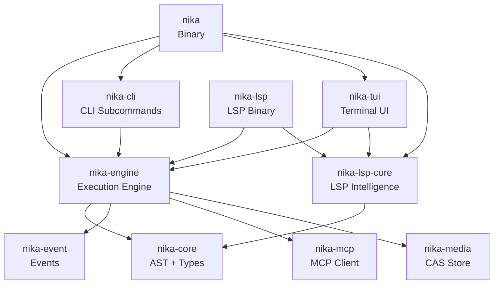
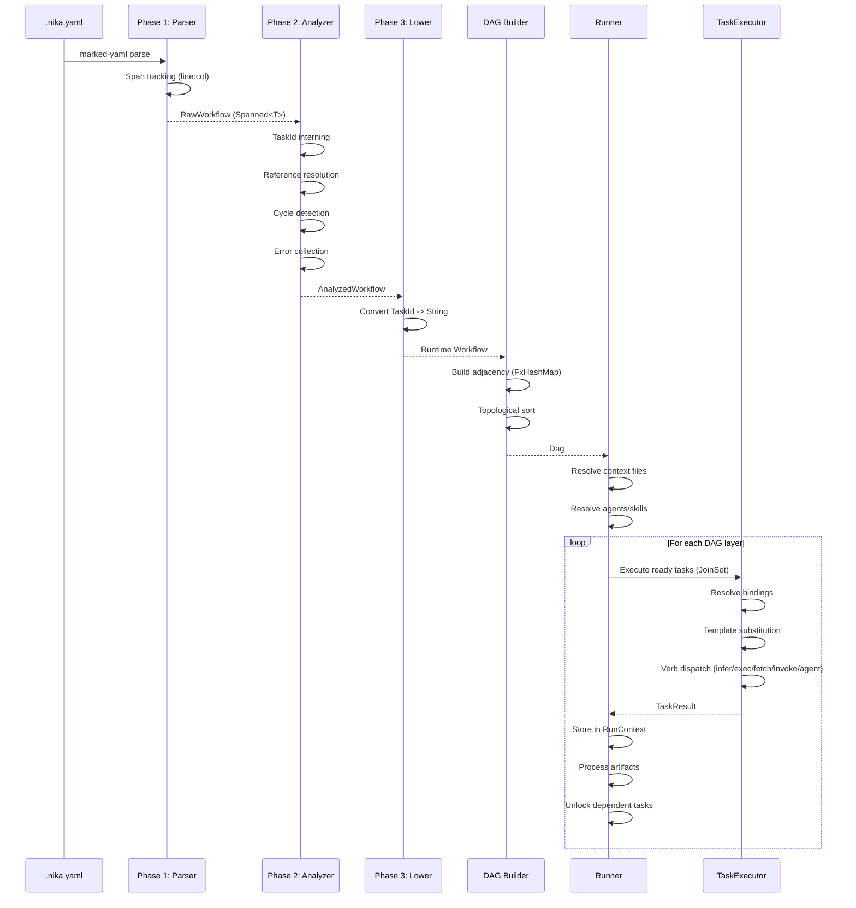

# 02 -- Architecture Overview

## Workspace Structure

Nika is organized as a Cargo workspace with 12 crates under `tools/`. Each crate has a well-defined responsibility and dependency boundary.

```
tools/
├── Cargo.toml          # Workspace root (resolver = "2")
├── nika/               # Binary crate -- CLI entry point (2K lines)
├── nika-engine/        # Execution engine -- embeddable runtime (134K lines)
├── nika-core/          # AST, types, catalogs -- zero I/O (23K lines)
├── nika-event/         # EventLog, TraceWriter (4K lines)
├── nika-mcp/           # MCP client, rmcp 0.16 (9K lines)
├── nika-media/         # CAS store, processor (13K lines)
├── nika-tui/           # Terminal UI -- ratatui (86K lines)
├── nika-lsp-core/      # LSP intelligence (9K lines)
├── nika-lsp/           # LSP binary (2.5K lines)
├── nika-cli/           # CLI subcommands (8K lines)
├── nika-init/          # Project scaffolding (21K lines)
└── nika-daemon/        # Background daemon (5K lines)
```

All crates share version `0.42.0`, edition 2021, AGPL-3.0-or-later license, and minimum Rust version 1.86.

---

## Dependency Graph



### Key Dependency Rules

1. **`nika-core` has zero runtime dependencies.** No tokio, no reqwest, no rig-core. It defines pure data types, AST nodes, and static catalogs. This makes it suitable for IDE integration and validation without pulling in the entire async runtime.

2. **`nika-engine` is the gravity well.** It depends on core, event, mcp, and media. It contains all execution logic: the DAG runner, task executor, provider wrapper, binding resolver, template engine, media tools, init system, and security enforcement.

3. **`nika-tui` depends on engine, not on nika.** This avoids circular dependencies. The TUI gets engine functionality directly.

4. **`nika-lsp-core` depends only on `nika-core`.** LSP handlers are pure functions: `(text, offset, context) -> Result`. No async, no server state.

---

## Crate Responsibilities

### nika (Binary)

The CLI entry point. Contains `main.rs` with clap argument parsing and command dispatch. All subcommands delegate to `nika-cli` or `nika-engine`. The binary is ~2K lines -- thin by design.

**Key types:** `Cli`, `Commands` (enum with ~20 variants)

### nika-engine (Execution Engine)

The heart of Nika. Contains 134K lines organized in 15+ modules:

```
src/
├── lib.rs               # Public API re-exports
├── error.rs             # NikaError (NIKA-XXX codes)
├── config.rs            # NikaConfig (TOML)
├── ast/                 # Three-phase pipeline
│   ├── mod.rs           # Re-exports from nika-core + runtime types
│   ├── lower.rs         # Phase 3: Analyzed -> Runtime
│   ├── action.rs        # Runtime verb params (InferParams, ExecParams, ...)
│   ├── agent.rs         # AgentParams
│   ├── invoke.rs        # InvokeParams
│   ├── workflow.rs      # Runtime Workflow, Task
│   ├── schema_validator.rs  # JSON Schema validation
│   └── loader.rs        # Definition discovery (agents, skills)
├── dag/                 # DAG structure
│   ├── flow.rs          # Dag (FxHashMap + SmallVec)
│   ├── indexed.rs       # IndexedDag (Vec adjacency, Kahn's algorithm)
│   ├── stable.rs        # StableDag (petgraph wrapper for TUI)
│   └── validate.rs      # Binding validation against DAG
├── runtime/             # Execution engine
│   ├── runner.rs        # DAG runner (tokio JoinSet)
│   ├── executor/        # Task executor
│   │   ├── mod.rs       # TaskExecutor struct
│   │   ├── verbs.rs     # 5 verb implementations
│   │   ├── decompose.rs # Decompose modifier
│   │   └── extract.rs   # Fetch extraction
│   ├── rig_agent_loop/  # Agent loop (rig-core)
│   ├── builtin/         # 12 core + 24 media tools
│   ├── boot.rs          # 7-phase boot sequence
│   ├── policy.rs        # Security policy enforcer
│   ├── security.rs      # Command blocklist
│   ├── structured_output.rs  # 5-layer JSON compliance
│   └── artifact_processor.rs # File persistence
├── binding/             # Data flow
│   ├── resolve.rs       # ResolvedBindings (eager + lazy)
│   ├── template.rs      # {{with.alias}} substitution
│   ├── jsonpath.rs      # RFC 9535 JSONPath
│   └── mention.rs       # @task mentions
├── provider/            # LLM providers
│   ├── rig.rs           # RigProvider (7 cloud providers)
│   ├── cost.rs          # Pricing tables
│   └── native/          # mistral.rs integration
├── init/                # nika init
│   ├── course/          # 12-level course (44 exercises)
│   ├── minimal.rs       # 5 starter workflows
│   └── showcase_*.rs    # 115 showcase workflows
├── tools/               # File tools (read, write, edit, glob, grep)
├── media/               # Media pipeline bridge
├── mcp/                 # MCP bridge (re-exports from nika-mcp)
├── store/               # RunContext + TaskResult
├── event/               # Re-exports from nika-event
├── source/              # Source spans + registry
├── secrets/             # OS Keychain + daemon IPC
├── io/                  # Atomic file I/O
├── util/                # Constants, fs helpers, string interner
├── registry/            # Package registry client
├── display/             # Header + check renderers
└── new/                 # nika new (template wizard)
```

### nika-core (AST + Types)

Zero-I/O core with 23K lines. Contains:

- **Raw AST** (`ast/raw/`): Phase 1 types parsed from YAML with full span tracking via `marked-yaml`. All nodes carry `Spanned<T>` for precise error locations.
- **Analyzer** (`ast/analyzer/`): Phase 2 validation and transformation. Builds task table with `TaskId(u32)` interning, resolves all references, detects cycles, and collects errors with "did you mean?" suggestions via Jaro-Winkler similarity.
- **Analyzed AST** (`ast/analyzed/`): Phase 2 output. All string references replaced with interned `TaskId`. Memory-efficient, O(1) comparison, validated, ready for execution.
- **Schema types** (`ast/schema.rs`): SchemaVersion enum.
- **Binding types** (`binding/`): BindingSpec, WithSpec, WithEntry, 27 TransformOps.
- **Static catalogs** (`catalogs/`): 19 known providers, 100 MCP aliases, 15+ curated native models.

### nika-event (Events)

Event sourcing for workflow execution (4K lines):

- **EventKind**: 37 variants across 12 categories (workflow start/end, task start/end, template resolved, context assembled, MCP call, agent turn, etc.)
- **EventLog**: Thread-safe, append-only log backed by `DashMap`.
- **EventEmitter**: Trait for dependency injection. `NoopEmitter` for zero-cost testing.
- **TraceWriter**: NDJSON file writer for debugging. Writes to `.nika/traces/`.
- **TraceInfo**: Trace metadata with workflow hash for deduplication.

### nika-mcp (MCP Client)

MCP client implementation (9K lines) using rmcp 0.16:

- **McpClient**: Single server connection with tool calling, response caching, ping, and graceful shutdown.
- **McpClientPool**: Connection pool with lazy initialization, per-server deduplication via `DashMap + OnceCell`, and event logging.
- **McpValidator**: Tool schema validation with `CachedSchema` and `ErrorEnhancer` for "did you mean?" suggestions.
- **McpConfigInline**: Inline server configuration (command + args + env + cwd).
- **NikaMcpConfig**: Reads `~/.mcp.json` for global MCP server definitions.
- Timeout constants: connect 20s, call 60s, reconnect 30s.

### nika-media (CAS Store)

Content-addressable storage (13K lines):

- **CasStore**: blake3-hashed storage at `.nika/media/store/`. Files are stored by hash, enabling deduplication and integrity verification.
- **MediaProcessor**: Extracts and processes media from MCP responses. Handles binary content blocks.
- **MediaRef**: Reference to a stored media file (hash, MIME type, size).
- **MediaBudget**: Configurable limits on media storage (max files, max total size).
- Error codes: NIKA-251 through NIKA-259.

### nika-tui (Terminal UI)

Ratatui-based TUI (86K lines) with a 3-view architecture:

```
+------------------------------------------------------------------+
|  [1/s] Studio  | [2/c] Command | [3/x] Control                   |
+------------------------------------------------------------------+
|                                                                    |
|  Studio:   File Browser | YAML Editor | DAG Preview               |
|  Command:  Chat Mode | Monitor Mode (Ctrl+M toggle)              |
|  Control:  Provider Config | Theme | Preferences                  |
|                                                                    |
+------------------------------------------------------------------+
```

Key modules: `app.rs` (main loop), `chat_agent.rs` (ChatAgent with streaming), `views/` (studio, command, control), `widgets/` (40+ custom widgets), `highlight.rs` (YAML syntax highlighting), `cosmic_theme.rs` (theme engine), `session.rs` (persistence).

### nika-lsp-core (LSP Intelligence)

Protocol-agnostic LSP handlers (9K lines, 745+ tests):

- **CursorContext**: 16-variant enum for cursor position semantics (verb field, task id, binding key, provider name, etc.)
- **Handlers**: Completion, hover, go-to-definition, code actions, diagnostics.
- **Parse**: Error-recovery parsing via tree-sitter. `PartialWorkflow` extracts structural info from broken YAML.
- **WorldDatabase**: In-memory document store for multi-file analysis.

### nika-lsp (LSP Binary)

Standalone LSP server binary (2.5K lines). Wraps `nika-lsp-core` handlers with `tower-lsp-server` for stdio/TCP communication. Used by VS Code extension and other editors.

### nika-cli (CLI Subcommands)

CLI command implementations (8K lines): course, provider, mcp, model, pkg, media, trace, config, schema, showcase, workflow.

---

## Data Flow: YAML to Execution



### Phase 1: Raw Parsing

The parser uses `marked-yaml` to parse YAML with full span tracking. Every value is wrapped in `Spanned<T>`, which carries `(FileId, start_byte, end_byte)`. This enables precise error locations like "line 14, column 5".

The parser validates YAML structure but not semantics. Unknown keys produce warnings, not errors. The output is `RawWorkflow` with string-typed references.

### Phase 2: Analysis

The analyzer transforms `RawWorkflow` into `AnalyzedWorkflow` in a single pass that:

1. Validates schema version (`nika/workflow@0.12`)
2. Builds a `TaskTable` with `TaskId(u32)` interning for O(1) comparisons
3. Resolves all `depends_on:` references to `TaskId`
4. Extracts implicit dependencies from `with:` bindings
5. Detects cyclic dependencies via DFS three-color algorithm
6. Validates `with:` entries against the binding grammar
7. Collects ALL errors (not fail-fast) with "did you mean?" suggestions

The analyzer uses Jaro-Winkler similarity (`strsim`) for fuzzy matching. If you reference `taks1`, it suggests `task1`.

### Phase 3: Lowering

`lower()` converts `AnalyzedWorkflow` into the runtime `Workflow` type. This resolves `TaskId` back to string names and converts analyzed action variants into runtime params (`InferParams`, `ExecParams`, etc.). The lowering is straightforward and adds no validation.

Note: The Runner now directly consumes `AnalyzedWorkflow` and performs bridge conversions (`lower_action`, `lower_output`) at the TaskExecutor boundary. The full `lower()` path is used by the CLI `check` command and tests.

### DAG Construction

`Dag::from_analyzed()` builds the dependency graph using `FxHashMap<Arc<str>, SmallVec<[Arc<str>; 4]>>`. Performance optimizations:

- `Arc<str>` for zero-cost task ID cloning
- `FxHashMap` for ~2x faster non-cryptographic hashing
- `SmallVec<[_; 4]>` for stack-allocated dependency lists (most tasks have 0-4 deps)

Cycle detection uses a DFS three-color algorithm (White/Gray/Black). The DAG is immutable after construction.

### Execution

The `Runner` executes the DAG layer by layer:

1. Finds all tasks with zero unmet dependencies (root layer)
2. Spawns them concurrently via `tokio::task::JoinSet`
3. As tasks complete, decrements dependency counts for successors
4. Spawns newly-ready tasks
5. Supports for_each iteration with configurable concurrency and fail_fast
6. Processes artifacts (file persistence) after each task
7. Writes events to `EventLog` and optional `TraceWriter`

The `TaskExecutor` handles individual task execution:

1. Resolves `with:` bindings from the `RunContext` datastore
2. Performs template substitution (`{{with.alias}}`)
3. Dispatches to the appropriate verb handler
4. Applies output policy (JSON schema validation)
5. Applies structured output engine (5-layer defense)
6. Returns `TaskResult` with output and metadata

---

## Feature Flags

Nika uses Cargo feature flags for modular compilation. The default feature set includes everything except two opt-in features:

| Feature | Default | Description |
|---------|---------|-------------|
| `tui` | Yes | Terminal UI (ratatui) |
| `native-inference` | Yes | Local GGUF models (mistral.rs) |
| `media-core` | Yes | Tier 2 media tools (thumbnail, metadata, optimize, svg) |
| `media-thumbnail` | Yes | SIMD image resize (fast_image_resize) |
| `media-metadata` | Yes | EXIF/audio metadata (nom-exif, lofty) |
| `media-optimize` | Yes | Lossless PNG optimization (oxipng) |
| `media-svg` | Yes | SVG to PNG rasterization (resvg) |
| `media-phash` | Yes | Perceptual image hashing |
| `media-pdf` | Yes | PDF text extraction |
| `media-chart` | Yes | Chart generation (charts-rs) |
| `media-qr` | Yes | QR code validation |
| `media-iqa` | Yes | Image quality assessment (DSSIM) |
| `media-compression` | Yes | Zstd CAS compression |
| `fetch-html` | Yes | CSS selector extraction |
| `fetch-markdown` | Yes | HTML to Markdown (htmd) |
| `fetch-article` | Yes | Article extraction (dom_smoothie) |
| `fetch-feed` | Yes | RSS/Atom feed parsing |
| `media-provenance` | No | C2PA content credentials (heavy deps) |
| `lsp` | No | Language Server Protocol |

---

## Key Dependencies

| Dependency | Version | Purpose |
|-----------|---------|---------|
| `tokio` | 1.49 | Async runtime (rt-multi-thread) |
| `rig-core` | 0.32 | LLM provider abstraction |
| `rmcp` | 0.16 | MCP protocol client |
| `ratatui` | 0.30 | Terminal UI framework |
| `marked-yaml` | 0.8 | YAML parsing with spans |
| `petgraph` | 0.6 | Graph data structure (StableDag for TUI) |
| `dashmap` | 6.1 | Concurrent hashmap |
| `serde` | 1.0 | Serialization framework |
| `blake3` | 1.8 | Content-addressable hashing |
| `reqwest` | 0.12 | HTTP client (rustls-tls) |
| `clap` | 4.6 | CLI argument parsing |
| `miette` | 7.6 | Fancy terminal error display |
| `tracing` | 0.1 | Structured logging |
| `mistralrs` | 0.7 | Native LLM inference (optional) |

---

## Build Profiles

```toml
[profile.release]
lto = "thin"
codegen-units = 1
strip = true

[profile.dev]
split-debuginfo = "unpacked"

[profile.test]
opt-level = 1
```

The release profile uses thin LTO and single codegen unit for optimal binary size and performance. Debug info is stripped from release builds. Test builds use opt-level 1 to speed up test execution without sacrificing too much debug information.

---

## Testing Strategy

```bash
cargo test --workspace --lib        # All crates (8,100+, safe)
cargo test --lib                    # nika binary tests only
cargo test -p nika-engine --lib     # Engine tests (4060)
cargo test -p nika-tui --lib        # TUI tests (2117)
cargo test --features lsp           # Include LSP tests
cargo clippy --workspace -- -D warnings  # Zero warnings policy
```

**Critical:** Always use `--lib` to avoid contract tests that trigger macOS Keychain popups. The `--lib` flag restricts to unit tests only.

Testing tools: `insta` for snapshot testing, `proptest` for property-based testing, `wiremock` for HTTP mocking, `pretty_assertions` for diff output, `criterion` for benchmarks.

See [07-error-codes-reference.md](./07-error-codes-reference.md) for the complete error code taxonomy.
