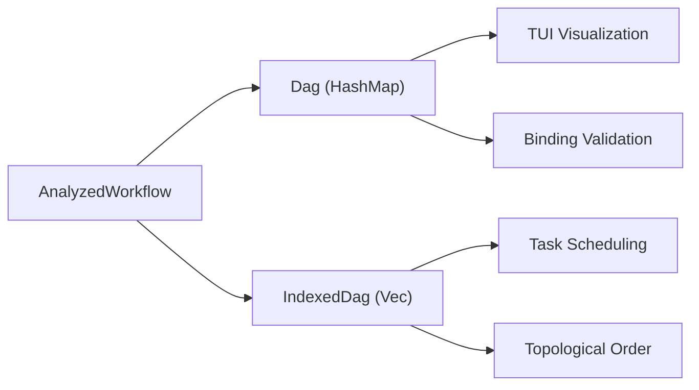
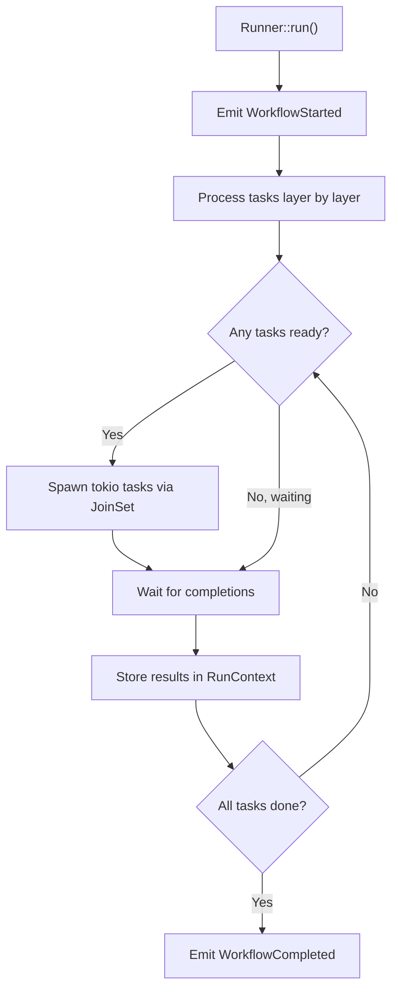

# 03 — DAG Execution Model

> How workflows become directed acyclic graphs, and how Nika schedules tasks for parallel execution.

## Two DAG Implementations

Nika maintains two complementary DAG representations, each optimized for a different use case:

| Implementation | Location | Purpose | Data structure |
|---|---|---|---|
| `Dag` | `dag/flow.rs` | Runner, CLI, TUI visualization | `FxHashMap<Arc<str>, SmallVec<[Arc<str>; 4]>>` |
| `IndexedDag` | `dag/indexed.rs` | Runtime execution scheduling | `Vec<SmallVec<[TaskId; 4]>>` |

Both are immutable after construction -- this is an explicit architectural decision. Once built, the DAG cannot be modified, ensuring thread-safe sharing across tokio tasks.



## Dag (HashMap-based)

**Location**: `nika-engine/src/dag/flow.rs`

The `Dag` struct uses `Arc<str>` for task identifiers and `FxHashMap` for adjacency lists. It is the primary representation used by the runner and for binding validation.

```rust
pub struct Dag {
    /// task_id -> list of successor task_ids
    adjacency: FxHashMap<Arc<str>, DepVec>,
    /// task_id -> list of predecessor task_ids
    predecessors: FxHashMap<Arc<str>, DepVec>,
    /// All task IDs (for iteration)
    task_ids: Vec<Arc<str>>,
    /// Quick lookup for task existence
    task_set: FxHashSet<Arc<str>>,
}

/// Stack-allocated deps: most tasks have 0-4 dependencies
type DepVec = SmallVec<[Arc<str>; 4]>;
```

### Performance Optimizations

Three key optimizations make the DAG efficient:

1. **`Arc<str>` interning**: Task IDs are interned via `crate::util::intern()` so that the same string is allocated once and shared everywhere via reference counting. Cloning an `Arc<str>` is a single atomic increment.

2. **`FxHashMap`**: Rustc's internal hash function (non-cryptographic) provides roughly 2x speedup over SipHash for short string keys. Security is not a concern here since task IDs are from trusted YAML input.

3. **`SmallVec<[_; 4]>`**: 95% of workflow tasks have 0-4 dependencies. `SmallVec` keeps up to 4 elements on the stack, avoiding heap allocation for the common case while seamlessly falling back to heap for larger fan-outs.

### Construction from AnalyzedWorkflow

```rust
pub fn from_analyzed(workflow: &AnalyzedWorkflow) -> Result<Self, NikaError> {
    // 1. Intern all task IDs and build empty adjacency lists
    for task in &workflow.tasks {
        let id = intern(&task.name);
        task_ids.push(Arc::clone(&id));
        task_set.insert(Arc::clone(&id));
        adjacency.insert(Arc::clone(&id), DepVec::new());
        predecessors.insert(id, DepVec::new());
    }

    // 2. Build edges from depends_on + implicit_deps
    for task in &workflow.tasks {
        // Deduplicate across both dependency sources
        let mut seen_deps: FxHashSet<&str> = FxHashSet::default();

        for dep_id in &task.depends_on {
            // ... add edge from dep -> task
        }
        for dep_id in &task.implicit_deps {
            // ... add edge from dep -> task (skip duplicates)
        }
    }

    // 3. Validate: cycle detection via DFS three-color algorithm
    let dag = Self { adjacency, predecessors, task_ids, task_set };
    dag.detect_cycles()?;
    Ok(dag)
}
```

### Cycle Detection

The DAG uses a DFS three-color algorithm for cycle detection:

```rust
enum Color { White, Gray, Black }

fn detect_cycles(&self) -> Result<(), NikaError> {
    let mut colors: FxHashMap<&str, Color> = /* all White */;

    for task_id in &self.task_ids {
        if colors[task_id.as_ref()] == Color::White {
            self.dfs_visit(task_id, &mut colors, &mut path)?;
        }
    }
    Ok(())
}

fn dfs_visit(&self, node: &str, colors: &mut ..., path: &mut Vec<&str>)
    -> Result<(), NikaError>
{
    colors.insert(node, Color::Gray);
    path.push(node);

    for successor in &self.adjacency[node] {
        match colors[successor.as_ref()] {
            Color::Gray => {
                // Found a cycle! Extract the cycle path for the error message
                return Err(NikaError::CyclicDependency { cycle: /* ... */ });
            }
            Color::White => {
                self.dfs_visit(successor, colors, path)?;
            }
            Color::Black => {} // Already fully explored
        }
    }

    path.pop();
    colors.insert(node, Color::Black);
    Ok(())
}
```

When a cycle is detected, the error message includes the full cycle path (e.g., `"task_a -> task_b -> task_c -> task_a"`).

### Layer Computation

The `compute_layers()` function assigns a depth to each task for visualization:

```rust
pub fn compute_layers<'a>(
    nodes: &[&'a str],
    edges: &[(&'a str, &'a str)],
) -> HashMap<&'a str, usize> {
    // Root nodes (no predecessors) get depth 0.
    // Each successor gets max(predecessor depths) + 1.
    // Iterates until stable (at most |nodes| iterations).
}
```

This is used by the TUI's DAG preview panel to arrange tasks in horizontal layers.

## IndexedDag (Vec-based)

**Location**: `nika-engine/src/dag/indexed.rs`

The `IndexedDag` is a compact, cache-friendly representation using `Vec` adjacency lists indexed by `TaskId`. All lookups are O(1) array indexing -- no hashing.

```rust
pub struct IndexedDag {
    /// Forward edges: task -> its successors
    successors: Vec<DepVec>,
    /// Backward edges: task -> its predecessors
    predecessors: Vec<DepVec>,
    /// Pre-computed topological order + depths
    topo: TopoOrder,
    /// Number of tasks
    num_tasks: usize,
}

type DepVec = SmallVec<[TaskId; 4]>;
```

### Kahn's Algorithm

The `IndexedDag` uses Kahn's BFS topological sort, which simultaneously detects cycles and computes task depths:

```rust
fn kahn_sort(
    successors: &[DepVec],
    in_degree: &mut [u32],
    n: usize,
    task_table: &TaskTable,
) -> Result<TopoOrder, NikaError> {
    let mut queue: VecDeque<TaskId> = VecDeque::new();
    let mut order: Vec<TaskId> = Vec::with_capacity(n);
    let mut depths = vec![0u32; n];

    // Seed queue with root nodes (in_degree == 0)
    for i in 0..n {
        if in_degree[i] == 0 {
            queue.push_back(TaskId::new(i as u32));
        }
    }

    while let Some(node) = queue.pop_front() {
        order.push(node);
        for &succ in &successors[node.index() as usize] {
            // Update depth: max(current, predecessor + 1)
            depths[succ.index() as usize] =
                depths[succ.index() as usize].max(depths[node.index() as usize] + 1);

            in_degree[succ.index() as usize] -= 1;
            if in_degree[succ.index() as usize] == 0 {
                queue.push_back(succ);
            }
        }
    }

    // If we didn't visit all nodes, there's a cycle
    if order.len() != n {
        return Err(NikaError::CyclicDependency { /* ... */ });
    }

    Ok(TopoOrder {
        order: order.into_boxed_slice(),
        depths: depths.into_boxed_slice(),
    })
}
```

### TopoOrder

The pre-computed topological order is stored as a `Box<[TaskId]>` (no capacity waste):

```rust
pub struct TopoOrder {
    /// Tasks in topological order (roots first)
    order: Box<[TaskId]>,
    /// Depth of each task, indexed by TaskId.index()
    depths: Box<[u32]>,
}
```

This enables the runner to iterate tasks in execution order without recomputing the sort.

### Edge Deduplication (Bug #23 Fix)

A critical detail: the `IndexedDag` deduplicates edges across `depends_on` and `implicit_deps`:

```rust
for task in &wf.tasks {
    let mut seen_deps: FxHashSet<TaskId> = FxHashSet::default();
    for &dep_id in task.depends_on.iter().chain(task.implicit_deps.iter()) {
        if !seen_deps.insert(dep_id) {
            continue; // Skip duplicate edge
        }
        // Add edge...
        in_degree[idx] += 1;
    }
}
```

Without this deduplication, a task that appears in both `depends_on` and `implicit_deps` (which happens when the user writes both `depends_on: [step1]` and `with: { data: step1 }`) would have an inflated in-degree, causing Kahn's algorithm to falsely report a cycle.

## StableDag (petgraph-based)

**Location**: `nika-engine/src/dag/stable.rs`

The `StableDag` wraps `petgraph::StableGraph` for TUI visualization. It supports node removal without invalidating indices (stable IDs), which is needed when the TUI filters or collapses DAG nodes interactively.

```rust
pub struct StableDag {
    graph: petgraph::stable_graph::StableGraph<String, DagEdge>,
}

pub struct DagEdge {
    pub edge_type: EdgeType,  // Data or Ordering
}
```

## Task Scheduling in the Runner

**Location**: `nika-engine/src/runtime/runner.rs`

The `Runner` executes tasks using the DAG's topological order with concurrent scheduling. The core execution loop works as follows:



### Parallel Execution with JoinSet

The runner uses `tokio::task::JoinSet` to manage concurrent task execution:

```rust
// Simplified from runner.rs
pub async fn run(&mut self) -> Result<String, NikaError> {
    let mut join_set = JoinSet::new();
    let mut completed: FxHashSet<Arc<str>> = FxHashSet::default();

    // Process tasks in topological order
    loop {
        // Find ready tasks (all predecessors completed)
        for task in &self.workflow.tasks {
            if !completed.contains(&task.name) && all_deps_done(&task, &completed) {
                // Spawn task execution
                join_set.spawn(async move {
                    executor.execute(task, bindings).await
                });
            }
        }

        // Wait for next completion
        let result = join_set.join_next().await;
        // Store result, mark completed
        completed.insert(task_id);

        if completed.len() == total_tasks {
            break;
        }
    }
}
```

### Concurrency Control

For `for_each` tasks, a `Semaphore` controls concurrency:

```rust
let semaphore = Arc::new(Semaphore::new(concurrency));

for (index, item) in items.iter().enumerate() {
    let permit = semaphore.clone().acquire_owned().await?;
    join_set.spawn(async move {
        let result = executor.execute(task, item_bindings).await;
        drop(permit);  // Release semaphore
        result
    });
}
```

### Pause and Resume

The runner supports pausing via an `AtomicBool` + `Notify` pair:

```rust
pub struct Runner {
    paused: Arc<AtomicBool>,
    resume_notify: Arc<Notify>,
    // ...
}

// In the execution loop:
if self.paused.load(Ordering::Relaxed) {
    self.event_log.emit(EventKind::WorkflowPaused);
    self.resume_notify.notified().await;
    self.event_log.emit(EventKind::WorkflowResumed);
}
```

The TUI's Command view can toggle pause state, and the runner checks between layers.

### Cancellation

A `CancellationToken` enables graceful abort:

```rust
pub struct Runner {
    cancel_token: CancellationToken,
    // ...
}

// MCP tool calls race against cancellation:
tokio::select! {
    result = mcp_client.call_tool(name, params) => result,
    _ = cancel_token.cancelled() => Err(NikaError::WorkflowAborted { .. }),
}
```

## Binding Validation Against the DAG

**Location**: `nika-engine/src/dag/validate.rs`

After DAG construction, `validate_with_bindings()` checks that every `with:` binding references an upstream task:

```rust
pub fn validate_with_bindings(
    workflow: &AnalyzedWorkflow,
    flow_graph: &Dag,
) -> Result<(), NikaError> {
    for task in &workflow.tasks {
        for (alias, entry) in task.with_spec.iter() {
            if let Some(ref_task) = entry.task_id() {
                // 1. Referenced task must exist
                // 2. Must not be self-reference
                // 3. Must be upstream (reachable via DAG edges)
            }
        }

        // Also validate {{with.alias}} references in templates
        validate_template_refs(task)?;
    }
}
```

Error codes:
- **NIKA-080**: `with.alias` references unknown task
- **NIKA-081**: `with.alias` references non-upstream task
- **NIKA-082**: `with.alias` creates self-reference

## Decompose: Runtime DAG Expansion

The `decompose:` modifier enables a single task to expand into multiple sub-tasks at runtime. This is handled by the executor's `decompose.rs` module, which creates synthetic task IDs (e.g., `"task[0]"`, `"task[1]"`) and runs them in parallel.

Unlike `for_each` (which iterates over a static or resolved array), `decompose` uses the LLM itself to determine how to split work, then executes the sub-tasks as a mini-DAG within the parent task.

## Summary

The DAG system provides:
1. **Two complementary representations**: HashMap-based for flexibility, Vec-based for performance
2. **Two cycle detection algorithms**: DFS three-color in `Dag`, Kahn's BFS in `IndexedDag`
3. **Pre-computed topological order**: No runtime sorting needed
4. **SmallVec optimization**: Stack allocation for the 95% case
5. **Edge deduplication**: Prevents false cycle detection from overlapping dependency sources
6. **Immutability after construction**: Thread-safe sharing without locks
