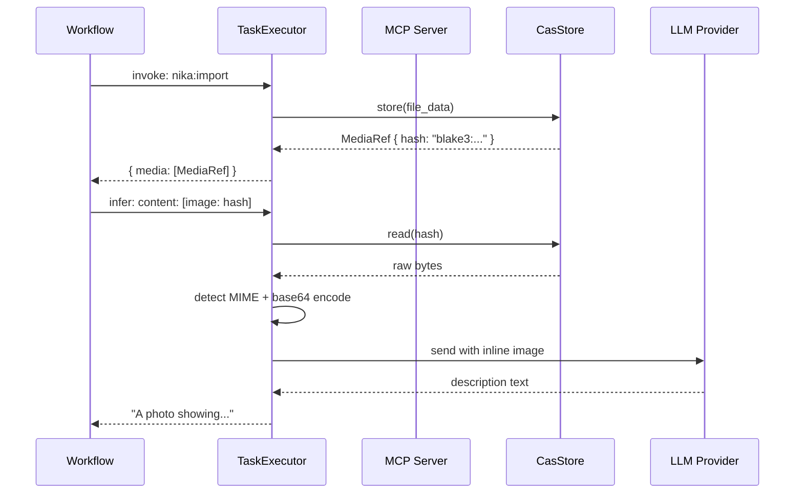

# 09 — Media & CAS Architecture

> Content-addressable storage, the media pipeline, and how binary data flows through Nika.

## Content-Addressable Storage (CAS)

**Location**: `nika-media/src/store.rs`

The `CasStore` is a blake3-hashed content-addressable storage system. Every binary blob (image, PDF, audio, video) is stored under its hash, providing automatic deduplication and immutability.

### Layout

```
.nika/media/
  af/                          # First 2 chars of hash
    1349b9f5f9a1d02e...        # Remaining hash (no extension)
  b7/
    2c4d5e6f7a8b9c0d...
```

Filenames are hash-only with no extension. The hash format is algorithm-prefixed: `blake3:af1349b9f5f9a1d02e...`.

### CasStore

```rust
pub struct CasStore {
    root: PathBuf,
}

pub struct StoreResult {
    pub hash: String,          // "blake3:af1349..."
    pub path: PathBuf,
    pub size: u64,
    pub deduplicated: bool,    // Already existed
    pub verified: bool,        // Read-back verification passed
    pub pipeline_ms: u64,      // Hash + store + verify latency
}
```

### Store Operation

1. **Hash**: Compute blake3 hash of the raw data
2. **Check**: If file exists at hash path, return `deduplicated: true`
3. **Write**: Atomic write via `O_EXCL` (prevents race conditions)
4. **Verify**: For files over 1MB, read back and verify hash
5. **Return**: `StoreResult` with hash, path, size, and timings

The atomic write uses `tokio::fs` and `O_EXCL` semantics to ensure that concurrent writes to the same hash are safe -- only the first writer creates the file.

### Compression

When the `media-compression` feature is enabled, blobs are framed with a 4-byte header:

```
+--------+--------+--------+--------+
| 'N'    | 'K'    | Flag   | Ver    |
+--------+--------+--------+--------+
| Data...                            |
+------------------------------------+
```

- Flag `0x00`: Raw (uncompressed)
- Flag `0x01`: Zstd compressed (level 3)
- Legacy blobs (pre-framing): Detected by absence of `NK` magic, returned as-is

Smart compression skips already-compressed formats (JPEG, PNG, WebP, video) and only compresses text-based formats (JSON, SVG, YAML, plain text).

### Safety Limits

| Limit | Value | Purpose |
|-------|-------|---------|
| `MAX_STORE_SIZE` | 100 MB | Maximum raw data accepted |
| `MAX_DECOMPRESS_SIZE` | 200 MB | Decompression bomb defense |
| `VERIFY_THRESHOLD` | 1 MB | Only verify large files |
| `ZSTD_LEVEL` | 3 | Optimal speed/ratio for CAS |

## MediaProcessor

**Location**: `nika-media/src/processor.rs`

The `MediaProcessor` extracts binary content from MCP tool responses and stores it in the CAS:

```rust
pub struct MediaProcessor {
    cas: Arc<CasStore>,
}
```

When an MCP tool returns binary content (e.g., an image), the processor:
1. Detects the MIME type from magic bytes
2. Stores the data in the CAS
3. Returns a `MediaRef` that downstream tasks can reference

### MediaRef

```rust
pub struct MediaRef {
    pub hash: String,          // "blake3:af1349..."
    pub mime: String,          // "image/png"
    pub size: u64,             // Bytes
    pub media_type: MediaType, // Image/Audio/Video/Document/Other
}
```

The `MediaRef` is serialized into the task result JSON, enabling downstream tasks to reference media by hash rather than by path.

## Vision Content Resolution

When the `infer:` verb has `content:` parts of type `image`, the executor resolves CAS hashes to base64:

```yaml
infer:
  content:
    - type: image
      source: "{{with.photo.media[0].hash}}"
      detail: high
    - type: text
      text: "Describe this image"
```

Resolution flow:
1. Template resolves `{{with.photo.media[0].hash}}` to `"blake3:af1349..."`
2. The executor reads the file from CAS
3. Detects the image MIME type from magic bytes
4. Encodes the data as base64
5. Sends to the LLM API as an inline image

This ensures paths never leak to LLM APIs -- only base64-encoded data is transmitted.

## Media Tools (Builtin)

**Location**: `nika-engine/src/runtime/builtin/media/`

24 builtin media tools operate on CAS blobs via `invoke: nika:*`:

### Pipeline Tool

`nika:pipeline` chains operations in-memory without intermediate files:

```yaml
invoke: nika:pipeline
params:
  input: "{{with.photo.media[0].hash}}"
  steps:
    - thumbnail: { width: 300, height: 200 }
    - convert: { format: webp }
    - optimize: {}
```

Each step reads from the previous step's output, all in memory. The final result is stored in CAS and returns a new `MediaRef`.

### MediaToolContext

All media tools share a `MediaToolContext` for accessing the CAS store and media budget:

```rust
pub struct MediaToolContext {
    pub cas: Arc<CasStore>,
    pub budget: MediaBudget,
}

pub struct MediaBudget {
    pub max_file_size: u64,     // Per-file limit
    pub max_total_size: u64,    // Workflow total limit
    pub current_total: AtomicU64,
}
```

The budget tracks total media usage to prevent runaway storage consumption.

## Artifact Processing

**Location**: `nika-engine/src/runtime/artifact_processor.rs`

After task completion, the artifact processor persists outputs to files:

```yaml
artifact:
  path: "output/{{task_id}}.json"
  format: json
```

The processor:
1. Resolves template variables in the path
2. Creates parent directories
3. Writes the task output in the specified format
4. Returns `ArtifactProcessResult` with the written path

Artifact paths are validated against traversal attacks (no `..` components).

## Data Flow: Binary Content Through Nika



## Fetch Binary Mode

The `fetch:` verb with `response: binary` stores HTTP responses directly in CAS:

```yaml
- id: download_image
  fetch:
    url: "https://example.com/photo.jpg"
    response: binary

- id: process
  with:
    photo: download_image
  invoke: nika:thumbnail
  params:
    input: "{{with.photo.media[0].hash}}"
    width: 300
```

This creates a seamless pipeline from HTTP download to CAS storage to media processing, all using content-addressed hashes for referencing.
