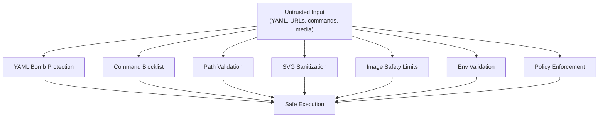

# 11 — Security Architecture

> Defense in depth: command blocklist, path validation, SVG sanitization, image safety limits, and environment validation.

## Security Principles

Nika workflows execute arbitrary LLM-generated commands, fetch URLs, and process untrusted media. The security architecture follows defense-in-depth: multiple independent layers, each catching threats the others might miss.



## Command Blocklist

**Location**: `nika-engine/src/runtime/security.rs`

The `exec:` verb validates commands against a blocklist of dangerous patterns before execution:

```rust
const BLOCKLIST: &[&str] = &[
    // Destructive file operations
    "rm -rf /", "rm -rf /*", "rm -rf ~",

    // Remote code execution (pipe-to-shell)
    "| bash", "|bash", "| sh", "|sh",

    // Dynamic execution
    "eval ",

    // Reverse shells
    "mkfifo", "nc -e", "nc -c", "ncat -e", "ncat -c",

    // Chained destructive commands
    "; rm ", "&& rm ", "| rm ",

    // Fork bombs
    ":(){ :|:& };:",

    // Privilege escalation
    "sudo ", "doas ", "pkexec ", "su ",

    // Dangerous permissions
    "chmod 777", "chmod -r 777", "chmod a+rwx",

    // Encoded payload execution
    "base64 -d |", "| base64 -d",

    // Disk destruction
    "dd if=",

    // Interpreter bypass
    "perl -e", "ruby -e", "node -e",

    // Command wrapper bypass
    "env ",
];
```

### Shell Mode Additional Blocklist

When `shell: true` is set, additional patterns are blocked:

```rust
const SHELL_MODE_BLOCKLIST: &[&str] = &[
    "$(", // Command substitution
    "`",  // Backtick substitution
];
```

These are only dangerous in shell mode. In non-shell mode (`shlex` parsing), they are harmless literal characters.

### Unicode Confusable Protection

Attackers may try to bypass the blocklist using Unicode confusables:

- Fullwidth characters: `rm` vs `ｒｍ` (U+FF52, U+FF4D)
- Math bold/italic: `sudo` vs characters from the U+1D600 range
- Zero-width joiners between characters

Nika applies NFKC (Compatibility Decomposition + Canonical Composition) normalization before blocklist checking:

```rust
use unicode_normalization::UnicodeNormalization;

let normalized: String = command.nfkc().collect();
// Now check against blocklist
```

NFKC normalizes fullwidth and mathematical variants to their ASCII equivalents, defeating these bypass attempts.

### Control Character Detection

Commands are scanned for control characters that could alter terminal behavior:

```rust
fn contains_control_chars(s: &str) -> bool {
    s.chars().any(|c| {
        c.is_control() && c != '\n' && c != '\r' && c != '\t'
    })
}
```

Null bytes (`\0`) and escape sequences (`\x1b`) are blocked to prevent terminal injection.

## Path Validation

### Import Path Validation

File import paths are validated against traversal attacks:

```rust
pub fn validate_import_path(path: &str) -> Result<(), NikaError> {
    // Block path traversal
    if path.contains("..") {
        return Err(NikaError::SecurityError { ... });
    }
    // Block absolute paths
    if path.starts_with('/') || path.starts_with('\\') {
        return Err(NikaError::SecurityError { ... });
    }
    Ok(())
}
```

### CAS Path Validation

The `TraceWriter` validates `generation_id` to prevent path traversal in trace file paths:

```rust
if generation_id.contains("..") || generation_id.contains('/') || generation_id.contains('\\') {
    return Err(EventError::TraceWrite(/* invalid generation_id */));
}
```

### Artifact Path Validation

Artifact output paths are validated similarly -- no `..` components, no absolute paths outside the project root.

## SVG Sanitization

**Rule**: Always call `sanitize_svg()` BEFORE `usvg` parsing.

SVG files can contain embedded JavaScript, external entity references, and other attack vectors. The sanitization step strips:

- `<script>` elements
- Event handlers (`onclick`, `onload`, etc.)
- External references (`xlink:href` to external URLs)
- `<foreignObject>` elements (can embed arbitrary HTML)

This is enforced before the `resvg` rasterizer processes the SVG.

## Image Safety Limits

**Rule**: Never use `image::load_from_memory()` directly. Use `decode_image_safe()` with `Limits`.

The `image` crate's default decoder has no resource limits, making it vulnerable to decompression bombs (a small PNG that expands to gigabytes). Nika's `decode_image_safe()` function sets explicit limits:

```rust
pub fn decode_image_safe(data: &[u8]) -> Result<DynamicImage, MediaError> {
    let mut reader = ImageReader::new(Cursor::new(data));
    reader.set_limits(Limits {
        max_image_width: Some(16384),
        max_image_height: Some(16384),
        max_alloc: Some(256 * 1024 * 1024), // 256 MB
    });
    reader.decode()
}
```

### Pre-Read Size Check

Before reading any file into memory, size is checked:

```rust
const MAX_IMPORT_SIZE: u64 = 50 * 1024 * 1024; // 50 MB default

let metadata = fs::metadata(&path)?;
if metadata.len() > MAX_IMPORT_SIZE {
    return Err(MediaError::FileTooLarge { size: metadata.len(), limit: MAX_IMPORT_SIZE });
}
```

## Environment Variable Validation

Provider API keys are validated before use:

```rust
if provider.requires_key && !provider.has_env_key() {
    return Err(NikaError::MissingApiKey { provider: ... });
}
```

This prevents rig-core from panicking on missing API keys (which it does by default).

## Policy Enforcement

**Location**: `nika-engine/src/runtime/policy.rs`

The `PolicyEnforcer` provides configurable security policies:

```rust
pub struct PolicyEnforcer {
    exec_policy: ExecPolicy,
    fetch_policy: FetchPolicy,
    token_budget: TokenBudget,
}

pub enum PolicyDecision {
    Allow,
    Deny(String),
    RequireApproval(String),
}
```

### Token Budget

Limits total token expenditure per workflow:

```rust
pub struct TokenBudget {
    pub max_input_tokens: Option<u64>,
    pub max_output_tokens: Option<u64>,
    pub max_total_cost: Option<f64>,  // USD
}
```

### Agent Limits

**Location**: `nika-engine/src/runtime/limit_tracker.rs`

The `LimitTracker` enforces per-agent resource limits:

```rust
pub struct LimitTracker {
    pub max_turns: Option<u32>,
    pub max_tokens: Option<u64>,
    pub max_cost: Option<f64>,
    pub current_turns: u32,
    pub current_tokens: u64,
    pub current_cost: f64,
}
```

When a limit is reached, the action depends on the `OnLimitReachedConfig`:
- `stop`: Halt the agent immediately
- `warn`: Continue but emit a warning event
- `error`: Return an error

## Security Error Codes

| Code | Meaning |
|------|---------|
| NIKA-050 | Blocked command (exec blocklist) |
| NIKA-051 | Invalid path (traversal attack) |
| NIKA-052 | Control characters in command |
| NIKA-053 | Shell injection attempt |
| NIKA-054 | Policy violation (denied by enforcer) |
| NIKA-160 | Invalid policy configuration |
| NIKA-290 | Media security violation |

## Summary

| Layer | Threat | Defense |
|-------|--------|---------|
| YAML parsing | YAML bombs | Budget-limited parsing |
| Command execution | Destructive commands, privilege escalation | Blocklist + NFKC normalization |
| Shell mode | Command injection | Additional shell-specific blocklist |
| Path handling | Directory traversal | Path validation, no `..` |
| SVG processing | Script injection | sanitize_svg() before parsing |
| Image processing | Decompression bombs | decode_image_safe() with Limits |
| File import | Oversized files | Pre-read size check |
| API keys | Missing credentials | Env validation before use |
| Agent loops | Runaway cost | LimitTracker with configurable actions |
| Policy | Unrestricted access | PolicyEnforcer with allow/deny/approve |
