# Nika Developer Learning Roadmap

> From zero to production-grade AI workflow architect in 12 levels.

---

## Who This Is For

This roadmap is designed for developers who want to learn Nika -- a semantic YAML workflow engine for AI tasks. You should have:

- **Basic YAML knowledge**: Indentation, key-value pairs, lists, maps. If you have used Docker Compose, Kubernetes manifests, or GitHub Actions, you are ready.
- **Command-line familiarity**: You can navigate directories, run commands, and read terminal output.
- **Curiosity about AI/LLM integration**: You want to build workflows that orchestrate LLM calls, shell commands, HTTP requests, and external tools.

No Rust knowledge is required. No SDK or framework experience is needed. One binary, one file format, one schema line.

---

## The Four Phases

Nika's learning path mirrors the built-in course system (12 levels, 44 exercises) plus extended practice through showcases and real-world projects.

```mermaid
graph TD
    subgraph Phase 1: Beginner
        L1[Level 1: Jailbreak<br/>exec, fetch, schema basics]
        L2[Level 2: Hot Wire<br/>with: bindings, templates, env vars]
        L3[Level 3: Fork Bomb<br/>DAG patterns, depends_on, parallel]
        L4[Level 4: Root Access<br/>infer: verb, providers, LLM pipelines]
    end

    subgraph Phase 2: Intermediate
        L5[Level 5: Shapeshifter<br/>Pipe transforms, data reshaping]
        L6[Level 6: Pay-Per-Dream<br/>Structured output, JSON schemas]
        L7[Level 7: Swiss Knife<br/>Builtin tools, file tools, invoke:]
        L8[Level 8: Gone Rogue<br/>Agent loops, completion, guardrails]
    end

    subgraph Phase 3: Advanced
        L9[Level 9: Data Heist<br/>Advanced fetch extraction]
        L10[Level 10: Open Protocol<br/>MCP integration, external tools]
        L11[Level 11: Pixel Pirate<br/>Media pipeline, CAS, vision]
        L12[Level 12: SuperNovae<br/>Boss level: full orchestration]
    end

    subgraph Phase 4: Expert
        E1[Production Workflows<br/>Templates, artifacts, inputs]
        E2[Multi-Agent Systems<br/>Chained agents, guardrail chains]
        E3[Custom Integrations<br/>MCP servers, NovaNet, sub-workflows]
        E4[Architecture Mastery<br/>DAG optimization, cost control, resilience]
    end

    L1 --> L2 --> L3 --> L4
    L4 --> L5 --> L6 --> L7 --> L8
    L8 --> L9 --> L10 --> L11 --> L12
    L12 --> E1 --> E2 --> E3 --> E4

    style L1 fill:#e8f5e9
    style L2 fill:#e8f5e9
    style L3 fill:#e8f5e9
    style L4 fill:#e8f5e9
    style L5 fill:#fff9c4
    style L6 fill:#fff9c4
    style L7 fill:#fff9c4
    style L8 fill:#fff9c4
    style L9 fill:#ffccbc
    style L10 fill:#ffccbc
    style L11 fill:#ffccbc
    style L12 fill:#ffccbc
    style E1 fill:#e1bee7
    style E2 fill:#e1bee7
    style E3 fill:#e1bee7
    style E4 fill:#e1bee7
```



---

## Phase 1: Beginner (Estimated: 4-6 hours)

**Goal**: Write, run, and validate multi-task workflows using the three non-LLM verbs.

### Level 1 -- Jailbreak (1-1.5 hours)

**Theme**: Break free from manual commands.

You will learn:
- The anatomy of a `.nika.yaml` workflow file
- The `schema: "nika/workflow@0.12"` declaration
- The `exec:` verb -- running shell commands (shorthand and full form)
- The `fetch:` verb -- making HTTP requests
- Provider and model configuration at the workflow level
- Validating workflows with `nika check`

**Exercises** (5):
1. Schema Basics -- your first workflow with schema declaration
2. Shell Commands -- `exec:` shorthand, full form, `timeout:`, `env:`, `cwd:`
3. HTTP Requests -- `fetch:` with GET, POST, headers, `extract: jsonpath`
4. Task Sequencing -- combining exec and fetch in one workflow
5. Validation -- validating workflows with `nika check`

**Skills acquired**: You can write a workflow from scratch, run shell commands, fetch data from URLs, and validate syntax before execution.

### Level 2 -- Hot Wire (1-1.5 hours)

**Theme**: Wire up the data flow between tasks.

You will learn:
- The `with:` block for binding task outputs to aliases
- Template syntax: `{{with.alias}}` and `{{with.alias.field}}`
- JSONPath for reaching into nested JSON data
- Environment variable bindings with `$env.VAR`
- How data flows between tasks without intermediate files

**Exercises** (4):
1. Simple Binding -- basic `with:` block and template rendering
2. Nested JSON -- JSONPath access into deep API responses
3. Transforms -- pipe transforms for inline data transformation
4. Env Bindings -- environment variable injection with `$env.VAR`

**Skills acquired**: You can wire any task's output into any other task, extract fields from nested JSON, and keep secrets out of workflow files.

### Level 3 -- Fork Bomb (1 hour)

**Theme**: Multiply your power with parallel execution.

You will learn:
- DAG (Directed Acyclic Graph) execution model
- The `depends_on:` field for explicit task ordering
- Parallel execution -- tasks without dependencies run simultaneously
- Diamond patterns: fan-out, then fan-in
- The `for_each:` field for parallel iteration over lists

**Exercises** (4):
1. Parallel Diamond -- fan-out / fan-in dependency patterns
2. For Each Basic -- iterate over a list with `for_each:`
3. For Each Concurrent -- concurrent iteration with concurrency limits
4. Chained Pipeline -- multi-stage pipelines with complex dependency graphs

**Skills acquired**: You can design complex dependency graphs, leverage automatic parallelism, and understand why DAGs are superior to sequential scripts.

### Level 4 -- Root Access (1 hour)

**Theme**: Unlock deeper workflow power.

You will learn:
- Context files for injecting external content
- The `imports:` block for sharing definitions across workflows
- The `inputs:` block for parameterized workflows with CLI overrides
- Combining all verbs in real pipelines

**Exercises** (3):
1. Context Files -- loading external files into task context
2. Imports -- reusing definitions across workflows
3. Inputs -- parameterized workflows with `--input key=value`

**Skills acquired**: You can build reusable, parameterized workflows that accept user input and share definitions across files.

**Phase 1 Checkpoint Project**: Build a "System Health Dashboard" workflow that checks disk usage, memory, network connectivity, and generates a formatted report.

---

## Phase 2: Intermediate (Estimated: 6-8 hours)

**Goal**: Master LLM integration, structured output, builtin tools, and autonomous agents.

### Level 5 -- Shapeshifter (1.5 hours)

**Theme**: Transform data with pipe transforms.

You will learn:
- Pipe transforms: `{{with.data | upper | trim}}`
- The full transform catalog: `upper`, `lower`, `trim`, `length`, `reverse`, `first`, `last`, `keys`, `values`, `flatten`, `sort`, `unique`, `compact`, `to_string`, `to_number`, `to_bool`, `to_json`, `parse_json`, `round`, `abs`, `ceil`, `floor`, `type_of`, `shell`, `join`, `split`, `default`
- Transform chaining for multi-step data reshaping
- Using transforms in prompts, commands, and headers

**Exercises** (3):
1. Structured Output -- JSON output with schema validation
2. Artifacts -- writing output to files with `artifact:`
3. Schema Retry -- automatic retry when LLM output fails validation

**Skills acquired**: You can transform data inline without intermediate tasks and force LLMs to return exactly the structure you need.

### Level 6 -- Pay-Per-Dream (1.5 hours)

**Theme**: Master the LLM landscape with structured output.

You will learn:
- The `output:` block with `format: json_schema`
- JSON Schema validation on LLM responses
- Multi-provider workflows (switching between providers per task)
- Native local model execution (GGUF models)
- System prompts, temperature, max_tokens fine-tuning

**Exercises** (3):
1. Multi-Provider -- using different providers in one workflow
2. Native Local -- running models locally with the native provider
3. System Prompts -- controlling LLM behavior with system prompts

**Skills acquired**: You can switch between any of 22+ providers without rewriting workflows, and force validated JSON output from any LLM.

### Level 7 -- Swiss Knife (2 hours)

**Theme**: Master the builtin tool ecosystem.

You will learn:
- The `invoke:` verb for calling builtin tools
- Core builtins: `nika:log`, `nika:emit`, `nika:assert`, `nika:sleep`
- File tools: `nika:read`, `nika:write`, `nika:edit`, `nika:glob`, `nika:grep`
- Sub-workflows: `nika:run` for composing workflows
- The `nika:` namespace and tool discovery

**Exercises** (3):
1. Core Builtins -- `nika:sleep`, `nika:log`, `nika:emit`, `nika:assert`
2. File Tools -- `nika:write`, `nika:read`, `nika:edit`, `nika:grep`, `nika:glob`
3. Sub-Workflows -- `nika:run` for nested workflow execution

**Skills acquired**: You can use all 12+ core builtin tools, perform file operations, and compose workflows from other workflows.

### Level 8 -- Gone Rogue (2 hours)

**Theme**: Build autonomous AI agents.

You will learn:
- The `agent:` verb for multi-turn LLM loops
- Agent tools: `[builtin]`, specific tool lists, MCP tools
- Completion modes: `explicit`, `natural`, `pattern`
- Safety limits: `max_turns`, `token_budget`, `max_cost_usd`, `max_duration_secs`
- Guardrails: `length`, `regex`, `schema`, `llm` validation
- Chaining agents with `with:` bindings

**Exercises** (3):
1. Basic Agent -- first autonomous agent with builtin tools
2. Agent Skills -- completion modes and chained agents
3. Agent Guardrails -- output validation and cost control

**Skills acquired**: You can build autonomous agents that loop, call tools, validate their own output, and chain with other agents.

**Phase 2 Checkpoint Project**: Build a "Code Review Assistant" that captures a git diff, analyzes it for bugs and security issues, generates a structured report, and saves it as an artifact.

---

## Phase 3: Advanced (Estimated: 8-10 hours)

**Goal**: Master fetch extraction, MCP integration, media pipelines, and full orchestration.

### Level 9 -- Data Heist (2 hours)

**Theme**: Advanced web scraping and data extraction.

You will learn:
- Extract modes (9 total): `markdown`, `article`, `text`, `selector`, `metadata`, `links`, `jsonpath`, `feed`, `llm_txt`
- Response modes: `full`, `binary`, default (raw body)
- CSS selector extraction with `selector:`
- RSS/Atom feed parsing
- Binary downloads for media pipeline integration

**Exercises** (4):
1. Fetch Markdown -- clean Markdown extraction from web pages
2. Fetch Metadata -- OpenGraph, Twitter Cards, JSON-LD extraction
3. Fetch JSONPath -- querying JSON API responses
4. Fetch Binary -- downloading files into the CAS

**Skills acquired**: You can extract structured data from any web page, parse feeds, download binaries, and query JSON APIs.

### Level 10 -- Open Protocol (2 hours)

**Theme**: MCP (Model Context Protocol) integration.

You will learn:
- The MCP protocol and why it matters
- Configuring MCP servers in workflows
- Calling external tools via `invoke:`
- NovaNet integration (knowledge graph queries)
- MCP aliases for tool discovery

**Exercises** (3):
1. MCP Basics -- configuring and connecting to MCP servers
2. MCP Tools -- calling external tools from workflows
3. MCP NovaNet -- integrating with the NovaNet knowledge graph

**Skills acquired**: You can connect to any MCP server, call external tools, and integrate with the broader AI tool ecosystem.

### Level 11 -- Pixel Pirate (2.5 hours)

**Theme**: The media pipeline and CAS (Content-Addressable Storage).

You will learn:
- CAS: importing files into content-addressable storage
- 24 media tools across 3 tiers (always-on, default, opt-in)
- Tier 1: `nika:import`, `nika:dimensions`, `nika:thumbhash`, `nika:dominant_color`, `nika:pipeline`
- Tier 2: `nika:thumbnail`, `nika:convert`, `nika:strip`, `nika:metadata`, `nika:optimize`, `nika:svg_render`
- Tier 3: `nika:phash`, `nika:compare`, `nika:pdf_extract`, `nika:chart`, `nika:provenance`, `nika:verify`, `nika:qr_validate`, `nika:quality`, and more
- Vision support with multimodal `content:` blocks

**Exercises** (4):
1. Media Import -- importing images into CAS
2. Media Transform -- thumbnails, conversion, optimization
3. Media Pipeline -- chained in-memory operations
4. Vision -- sending images to vision-capable LLMs

**Skills acquired**: You can build complete image processing pipelines, generate thumbnails, extract metadata, and use vision models.

### Level 12 -- SuperNovae (3 hours)

**Theme**: Boss level -- orchestrate everything.

This is the final boss. You must combine all 5 verbs, all binding patterns, all tool categories, and all orchestration techniques into production-grade workflows.

**Exercises** (5):
1. SEO Mega Audit -- fetch + extract + infer + artifacts
2. Image Pipeline -- media import + transform + vision + agent
3. Content Factory -- multi-stage content generation with agents
4. Research Agent -- autonomous research with web scraping and analysis
5. Full Stack -- every verb, every pattern, every tool category

**Skills acquired**: You can build any workflow Nika is capable of. You have mastered the full system.

**Phase 3 Checkpoint Project**: Build a "Competitive Intelligence Suite" that scrapes competitor websites, extracts key data, analyzes it with LLMs, generates comparison charts, and produces a comprehensive report.

---

## Phase 4: Expert (Ongoing)

**Goal**: Production-grade workflow architecture, performance optimization, and system integration.

### Production Workflows

- Using `inputs:` for parameterized, reusable workflows
- `artifacts:` for structured file output with manifests
- Production templates: daily standup reports, PR review helpers, changelog generators
- Error handling with `on_error: continue` and retry strategies

### Multi-Agent Systems

- Chaining multiple agents with `with:` bindings
- Guardrail chains: length, regex, schema, and LLM-based validation
- Escalation policies: `on_failure: retry`, `on_failure: escalate`
- Token budget management across agent chains

### Custom Integrations

- Building and connecting to custom MCP servers
- NovaNet knowledge graph integration via the `invoke:` verb
- Sub-workflow composition with `nika:run`
- Package registry and workflow sharing

### Architecture Mastery

- DAG optimization: maximizing parallelism, minimizing critical path
- Cost control: `max_cost_usd`, provider cost comparison, model pricing
- Resilience patterns: retry with backoff, circuit breakers, timeouts
- Security: command blocklists, env validation, path traversal prevention

---

## Quick Reference: Skills by Phase

| Phase | Verbs Mastered | Key Concepts | Exercise Count |
|-------|---------------|-------------|----------------|
| Beginner | `exec:`, `fetch:`, `infer:` | Schema, tasks, DAG, bindings, inputs | 16 exercises |
| Intermediate | `invoke:`, `agent:` | Transforms, structured output, builtin tools, agents | 12 exercises |
| Advanced | All 5 + extraction | MCP, media pipeline, vision, full orchestration | 16 exercises |
| Expert | Architecture | Production patterns, multi-agent, integrations | Projects |

---

## Getting Started

```bash
# Install Nika
brew install supernovae/tap/nika

# Generate the interactive course (44 exercises across 12 levels)
nika init --course

# Check your progress
nika course status

# Start the first exercise
nika course next

# Validate your work
nika course check 1

# Get progressive hints (3 tiers: conceptual, specific, solution)
nika course hint

# Browse 115+ showcase workflows for inspiration
nika showcase list
nika showcase extract blog-post-generator
```

---

## Time Investment Summary

| Phase | Estimated Time | Exercises | Outcome |
|-------|---------------|-----------|---------|
| Phase 1: Beginner | 4-6 hours | 16 | Write and run multi-task workflows |
| Phase 2: Intermediate | 6-8 hours | 12 | Build AI agents with guardrails |
| Phase 3: Advanced | 8-10 hours | 16 | Full orchestration mastery |
| Phase 4: Expert | Ongoing | Projects | Production architecture |
| **Total** | **18-24 hours** | **44 + projects** | **Workflow architect** |

---

*"The first step is not the hardest. It is the one they do not want you to take."*
