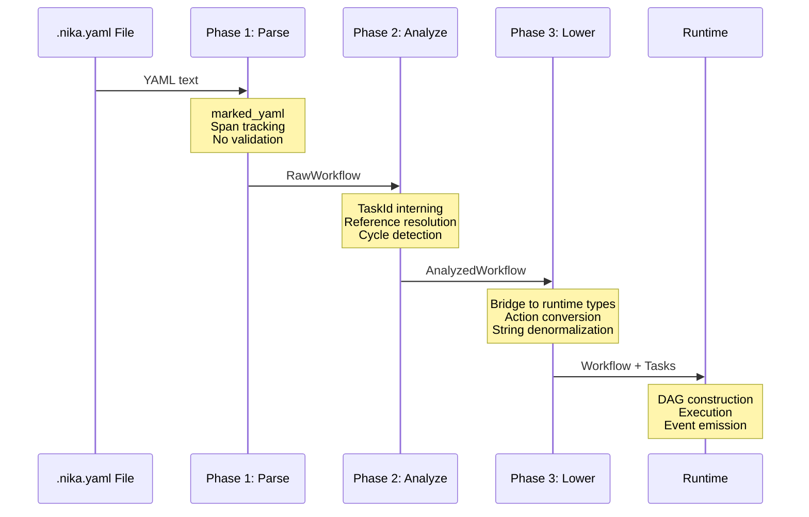
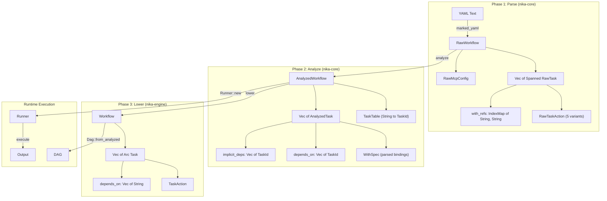

# 02 — AST Three-Phase Pipeline

> The complete journey from YAML text to executable runtime types: Raw, Analyzed, Lowered.

## Pipeline Overview

Every Nika workflow passes through a strict three-phase transformation pipeline before execution. Each phase has a distinct purpose, operates on its own type hierarchy, and enforces a specific category of invariants.



The pipeline is split across two crates:
- **Phase 1 + 2** live in `nika-core` (zero I/O)
- **Phase 3** lives in `nika-engine` (`ast/lower.rs`)

This split means the LSP can parse and analyze workflows without importing the full runtime.

## Phase 1: YAML to Raw AST

**Location**: `nika-core/src/ast/raw/parser.rs`

The three phases split across two crates for modularity:
- **nika-core**: Phase 1 + Phase 2 (zero I/O, LSP-compatible)
- **nika-engine**: Phase 3 (runtime bridge)

Phase 1 transforms raw YAML text into a structured `RawWorkflow` using `marked_yaml`. Every value is wrapped in `Spanned<T>`, preserving the exact byte offset where it appeared in the source file. No semantic validation occurs -- the parser only checks structural correctness.

### Source Tracking Foundation

Before any parsing happens, Nika establishes a source tracking system for precise error locations:

```rust
// nika-core/src/source/span.rs

/// File identifier -- index into SourceRegistry.
#[derive(Debug, Clone, Copy, PartialEq, Eq, Hash)]
pub struct FileId(pub u16);

/// Byte offset in a source file.
#[derive(Debug, Clone, Copy, PartialEq, Eq, Hash)]
pub struct ByteOffset(u32);

/// A range in a source file.
#[derive(Debug, Clone, Copy, PartialEq, Eq, Hash)]
pub struct Span {
    pub file: FileId,
    pub start: ByteOffset,
    pub end: ByteOffset,
}

/// A value paired with its source location.
#[derive(Debug, Clone)]
pub struct Spanned<T> {
    pub value: T,
    pub span: Span,
}
```

`Spanned<T>` is the fundamental building block. Every field in the raw AST carries one, enabling error messages like `"workflow.nika.yaml:12:5: unknown field 'inferr'"` with exact positions.

### Raw AST Types

The raw AST mirrors the YAML structure one-to-one. Here are the key types:

```rust
// nika-core/src/ast/raw/workflow.rs

pub struct RawWorkflow {
    pub schema: Spanned<String>,
    pub workflow: Option<Spanned<String>>,
    pub description: Option<Spanned<String>>,
    pub provider: Option<Spanned<String>>,
    pub model: Option<Spanned<String>>,
    pub mcp: Option<Spanned<RawMcpConfig>>,
    pub imports: Option<Spanned<Vec<Spanned<RawImportSpec>>>>,
    pub inputs: Option<Spanned<IndexMap<Spanned<String>, Spanned<serde_json::Value>>>>,
    pub tasks: Spanned<Vec<Spanned<RawTask>>>,
    pub span: Span,
    // ... plus context, pkg, artifacts, log, agents, skills
}
```

```rust
// nika-core/src/ast/raw/task.rs

pub struct RawTask {
    pub id: Spanned<String>,
    pub description: Option<Spanned<String>>,
    pub action: Option<RawTaskAction>,
    pub provider: Option<Spanned<String>>,
    pub model: Option<Spanned<String>>,
    pub with_refs: Option<Spanned<IndexMap<Spanned<String>, Spanned<String>>>>,
    pub depends_on: Option<Spanned<Vec<Spanned<String>>>>,
    pub output: Option<Spanned<RawOutputConfig>>,
    pub for_each: Option<Spanned<RawForEach>>,
    pub retry: Option<Spanned<RawRetryConfig>>,
    pub decompose: Option<Spanned<DecomposeSpec>>,
    pub structured: Option<StructuredOutputSpec>,
    pub span: Span,
}
```

### The Five Verbs

Task actions are represented as a five-variant enum -- one per verb:

```rust
// nika-core/src/ast/raw/action.rs

pub enum RawTaskAction {
    Infer(Spanned<RawInferAction>),    // LLM inference
    Exec(Spanned<RawExecAction>),      // Shell command
    Fetch(Spanned<RawFetchAction>),    // HTTP request
    Invoke(Spanned<RawInvokeAction>),  // MCP tool call
    Agent(Box<Spanned<RawAgentAction>>), // Multi-turn loop
}
```

Note that `Agent` is `Box`ed because `RawAgentAction` is significantly larger than the other variants (it has 20+ fields for tools, skills, MCP servers, guardrails, limits, etc.). Without the `Box`, every `RawTaskAction` would be as large as the `Agent` variant due to enum sizing.

Each verb has its own params struct. For example, `RawInferAction`:

```rust
pub struct RawInferAction {
    pub prompt: Spanned<String>,
    pub system: Option<Spanned<String>>,
    pub temperature: Option<Spanned<f64>>,
    pub max_tokens: Option<Spanned<u32>>,
    pub extended_thinking: Option<Spanned<bool>>,
    pub thinking_budget: Option<Spanned<u32>>,
    pub content: Option<Spanned<Vec<RawContentPart>>>,
    pub response_format: Option<Spanned<String>>,
    pub guardrails: Vec<GuardrailConfig>,
}
```

### Parse Errors

Parse errors carry their own error kind and span:

```rust
pub struct ParseError {
    pub kind: ParseErrorKind,
    pub span: Span,
    pub message: String,
}

pub enum ParseErrorKind {
    Syntax,        // NIKA-160: YAML syntax error
    MissingField,  // NIKA-161: Required field missing
    InvalidType,   // NIKA-162: Wrong type (expected string, got map)
    UnknownField,  // NIKA-163: Unknown field name
    InvalidSchema, // NIKA-164: Invalid schema version string
}
```

### Design Principles of Phase 1

1. **Every node has a span** -- For precise error locations in IDEs.
2. **Strings are unresolved** -- Task IDs are plain strings, not interned.
3. **No validation** -- Only structural checks; semantics are Phase 2's job.
4. **Preserves YAML order** -- Uses `IndexMap` for key ordering.
5. **Budget protection** -- `from_str_with_budget()` defends against YAML bombs.

## Phase 2: Raw to Analyzed AST

**Location**: `nika-core/src/ast/analyzer/analyze.rs`

Phase 2 transforms `RawWorkflow` into `AnalyzedWorkflow`. This is where semantic validation happens: reference resolution, duplicate detection, cycle detection, and `with:` binding parsing.

### The Analyzer

The entry point is `analyze(raw: RawWorkflow) -> AnalyzeResult`:

```rust
// nika-core/src/ast/analyzer/analyze.rs (conceptual)

pub fn analyze(raw: RawWorkflow) -> AnalyzeResult {
    // 1. Validate schema version
    // 2. Build TaskTable (intern all task IDs)
    // 3. For each task:
    //    a. Validate task ID format
    //    b. Parse with: entries via parse_with_entry()
    //    c. Resolve task references to TaskId
    //    d. Parse depends_on: references
    //    e. Convert action (RawTaskAction -> AnalyzedTaskAction)
    //    f. Validate temperature, retry, for_each, etc.
    // 4. Detect cycles in the dependency graph
    // 5. Validate schema-version feature gates
    // 6. Return AnalyzedWorkflow or accumulated errors
}
```

The analyzer **collects all errors in a single pass** rather than failing on the first one. This is critical for IDE integration -- the LSP needs to show all problems at once, not force the user to fix them one by one.

### TaskId Interning

The central optimization in Phase 2 is replacing string task references with interned `TaskId(u32)` values:

```rust
// nika-core/src/ast/analyzed/ids.rs

#[derive(Debug, Clone, Copy, PartialEq, Eq, Hash)]
pub struct TaskId(pub u32);

pub struct TaskTable {
    names: Vec<String>,                    // TaskId -> name
    index: FxHashMap<String, TaskId>,      // name -> TaskId (O(1) lookup)
}
```

After interning, comparing two task references is a single `u32 == u32` operation instead of a string comparison. The `FxHashMap` (from `rustc-hash`) uses a non-cryptographic hash that is roughly 2x faster than `HashMap`'s default SipHash.

### Analyzed AST Types

The analyzed types strip all `Spanned<T>` wrappers and replace string references with `TaskId`:

```rust
// nika-core/src/ast/analyzed/task.rs

pub struct AnalyzedTask {
    pub id: TaskId,
    pub name: String,
    pub description: Option<String>,
    pub action: AnalyzedTaskAction,
    pub provider: Option<String>,
    pub model: Option<String>,
    pub with_spec: WithSpec,          // Parsed binding declarations
    pub depends_on: Vec<TaskId>,      // Explicit ordering edges
    pub implicit_deps: Vec<TaskId>,   // Auto-extracted from with: bindings
    pub output: Option<AnalyzedOutput>,
    pub for_each: Option<AnalyzedForEach>,
    pub retry: Option<AnalyzedRetry>,
    pub decompose: Option<DecomposeSpec>,
    pub structured: Option<StructuredOutputSpec>,
    pub span: Span,                   // Kept for error reporting
}
```

Note the two dependency vectors:
- `depends_on` -- Explicit ordering edges from the `depends_on:` YAML field.
- `implicit_deps` -- Auto-extracted from `with:` bindings. When a task writes `with: { data: step1 }`, the analyzer recognizes that `step1` is an implicit dependency and adds it to `implicit_deps`.

Both are used by the DAG builder (see [03-dag-execution-model.md](03-dag-execution-model.md)).

### WithSpec and WithEntry

The `with:` block parsing is the most complex part of Phase 2. Raw strings like `"step1.data.temp ?? 20"` are parsed into structured `WithEntry` values:

```rust
// nika-core/src/binding/types.rs

pub struct WithEntry {
    pub path: BindingPath,                    // Source reference
    pub transforms: Vec<TransformOp>,         // Pipe chain
    pub default: Option<serde_json::Value>,   // ?? fallback
    pub binding_type: BindingType,            // Task/Env/Context/Input/LoopVar
    pub lazy: bool,                           // Deferred resolution
}

pub struct BindingPath {
    pub source: BindingSource,
    pub segments: Vec<PathSegment>,
}

pub enum BindingSource {
    Task(String),     // step1
    Env(String),      // $env.API_KEY
    Context(String),  // $context.readme
    Input(String),    // $input.name
    LoopVar(String),  // item (from for_each)
}

pub enum PathSegment {
    Field(String),    // .data
    Index(usize),     // [0]
}
```

The parser (`parse_with_entry()`) handles all these forms:
```yaml
with:
  simple: step1                          # BindingSource::Task("step1")
  path: step1.data.temp                  # + segments [Field("data"), Field("temp")]
  default: step1.data.temp ?? 20         # + default Some(20)
  string_default: user.name ?? "Anon"    # + default Some("Anon")
  object_default: cfg ?? {"debug": false} # + default Some({...})
  env: $env.API_KEY                      # BindingSource::Env("API_KEY")
  context: $context.readme               # BindingSource::Context("readme")
  input: $input.name                     # BindingSource::Input("name")
  piped: step1.output | upper | trim     # + transforms [Upper, Trim]
```

### Error Handling with Suggestions

The analyzer uses Jaro-Winkler similarity (via `strsim`) to generate "did you mean?" suggestions for common mistakes:

```
// Unknown task "taks1" -> did you mean "task1"? (similarity > 0.8)
// Invalid schema "nika/workfow@0.10" -> did you mean "nika/workflow@0.12"?
```

Error codes for Phase 2 analysis are in the NIKA-140..151 range:

| Code | Meaning |
|------|---------|
| NIKA-140 | Duplicate task ID |
| NIKA-141 | Unknown task reference in `with:` |
| NIKA-142 | Self-referencing task |
| NIKA-143 | Invalid temperature range |
| NIKA-144 | Cyclic dependency detected |
| NIKA-145 | Invalid `with:` entry syntax |
| NIKA-146 | Schema version feature not supported |

### AnalyzedWorkflow

The final output of Phase 2:

```rust
// nika-core/src/ast/analyzed/workflow.rs

pub struct AnalyzedWorkflow {
    pub schema_version: SchemaVersion,
    pub name: Option<String>,
    pub description: Option<String>,
    pub provider: Option<String>,
    pub model: Option<String>,
    pub task_table: TaskTable,
    pub tasks: Vec<AnalyzedTask>,
    pub mcp_servers: IndexMap<String, AnalyzedMcpServer>,
    pub context_files: Vec<AnalyzedContextFile>,
    pub imports: Vec<AnalyzedImportSpec>,
    pub inputs: IndexMap<String, serde_json::Value>,
    pub artifacts: Option<ArtifactsConfig>,
    pub log: Option<LogConfig>,
    pub agents: Option<IndexMap<String, AgentDef>>,
    pub skills_map: HashMap<String, String>,
    pub span: Span,
}
```

This workflow is fully validated and ready for execution. It has:
- Unique, interned task IDs
- Resolved references (no dangling pointers)
- Validated dependency graph (no cycles)
- Parsed binding specifications
- Schema version checked against feature gates

## Phase 3: Analyzed to Lowered (Runtime Types)

**Location**: `nika-engine/src/ast/lower.rs`

Phase 3 converts the `AnalyzedWorkflow` into the runtime `Workflow` type. This is the bridge between the zero-I/O core and the execution engine. The lowering step denormalizes interned `TaskId` values back to string names (the runtime uses `Arc<str>` for efficient sharing), converts analyzed action types to runtime action types, and maps MCP server configs to their inline representation.

### The lower() Function

```rust
// nika-engine/src/ast/lower.rs

pub fn lower(analyzed: AnalyzedWorkflow) -> Result<Workflow, NikaError> {
    let tasks: Vec<Arc<Task>> = tasks
        .into_iter()
        .map(|t| lower_task(t, &task_table).map(Arc::new))
        .collect::<Result<_, _>>()?;

    Ok(Workflow {
        schema: schema_version.as_str().to_string(),
        name,
        provider: provider.unwrap_or_else(|| "claude".to_string()),
        model,
        mcp: lower_mcp_servers(mcp_servers),
        tasks,
        // ...
    })
}
```

### Runtime Types

The runtime uses its own type hierarchy optimized for execution rather than validation:

```rust
// nika-engine/src/ast/workflow.rs

pub struct Workflow {
    pub schema: String,
    pub name: Option<String>,
    pub provider: String,          // Default provider (always set)
    pub model: Option<String>,
    pub mcp: Option<FxHashMap<String, McpConfigInline>>,
    pub tasks: Vec<Arc<Task>>,     // Arc for zero-cost sharing
    // ...
}

pub struct Task {
    pub id: Arc<str>,
    pub action: TaskAction,
    pub binding_spec: BindingSpec,
    pub depends_on: Vec<Arc<str>>,   // Denormalized back to strings as Arc<str>
    pub output: Option<OutputPolicy>,
    pub for_each: Option<ForEachConfig>,
    pub decompose: Option<DecomposeSpec>,
    pub structured: Option<StructuredOutputSpec>,
    pub provider: Option<String>,
    pub model: Option<String>,
    // ...
}
```

### Action Lowering

Each analyzed action variant maps to a runtime action:

```rust
pub(crate) fn lower_action(
    action: AnalyzedTaskAction,
    provider: Option<String>,
    model: Option<String>,
    retry: Option<AnalyzedRetry>,
) -> TaskAction {
    match action {
        AnalyzedTaskAction::Infer(a) => TaskAction::Infer { infer: lower_infer(a, provider, model) },
        AnalyzedTaskAction::Exec(a) => TaskAction::Exec { exec: lower_exec(a) },
        AnalyzedTaskAction::Fetch(a) => TaskAction::Fetch { fetch: lower_fetch(a) },
        AnalyzedTaskAction::Invoke(a) => TaskAction::Invoke { invoke: lower_invoke(a) },
        AnalyzedTaskAction::Agent(a) => TaskAction::Agent {
            agent: lower_agent(*a, provider, model, retry),
        },
    }
}
```

The lowering copies validated values, merges provider/model overrides, and converts enums (e.g., `AnalyzedOutputFormat::Json` to `OutputFormat::Json`).

## Unified Entry Point

The three phases are exposed as a single function in `nika-core`:

```rust
// nika-core/src/ast/mod.rs

pub fn parse_analyzed(yaml: &str) -> Result<AnalyzedWorkflow, NikaError> {
    // Phase 1: YAML -> Raw AST
    let raw = raw::parse(yaml, FileId(0))?;
    // Phase 2: Raw -> Analyzed
    analyzer::analyze(raw).into_result()
}
```

The runtime never calls Phase 3 directly -- the `Runner` accepts an `AnalyzedWorkflow` and calls `lower_action()` at the `TaskExecutor` boundary, converting tasks on-demand rather than pre-lowering the entire workflow.

## Data Flow Diagram



## Why Three Phases?

### Phase 1 exists to capture source locations

Without `Spanned<T>` wrapping, error messages would say "invalid temperature" instead of "workflow.yaml:15:3: temperature must be between 0.0 and 2.0". The marked_yaml library tracks byte offsets for every YAML node, and Phase 1 preserves these positions for downstream error reporting.

### Phase 2 exists to validate before executing

Running a workflow with a typo in a task reference would fail at runtime, possibly after expensive LLM calls. Phase 2 catches all reference errors, cycles, and constraint violations before any I/O happens. The error-collecting design (not fail-fast) is essential for IDE integration.

### Phase 3 exists to bridge types

The analyzed AST uses `TaskId(u32)` for efficiency, but the runtime uses `Arc<str>` for concurrent sharing across tokio tasks. Phase 3 performs this denormalization and merges workflow-level defaults (provider, model) with task-level overrides. It also converts validated enums to their runtime equivalents.

### Skipping phases is forbidden

The CLAUDE.md rules state: "Always Raw -> Analyzed -> Lower. Never skip phases." This ensures:
- Every workflow is validated before execution
- Source locations are always available for error messages
- The runtime never encounters invalid or unresolved references
