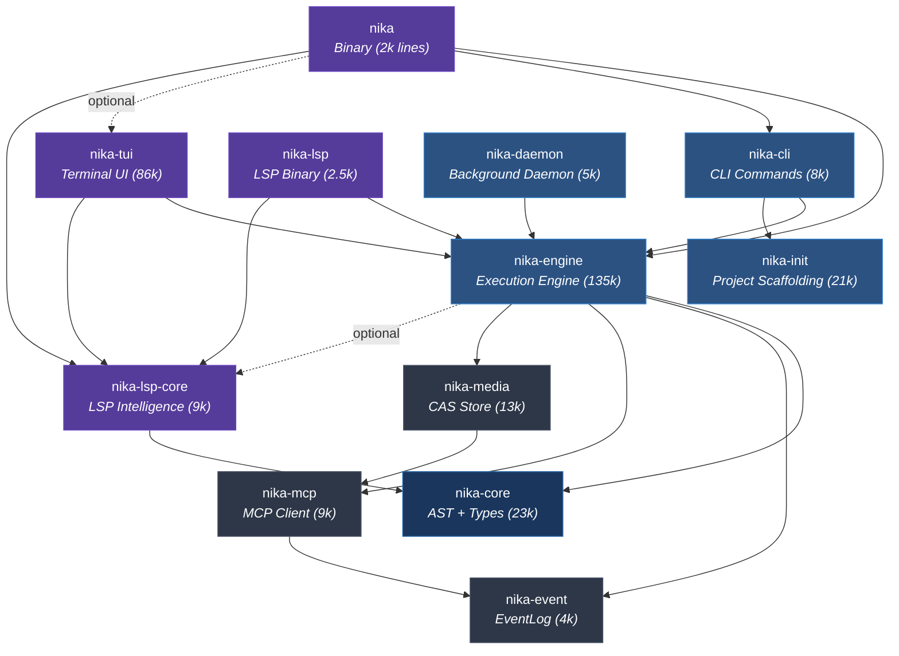

# 01 — Crate Dependency Graph

> How Nika's 12 crates relate to each other, what each one owns, and why the boundaries exist.

## Workspace Overview

Nika is organized as a Cargo workspace containing 12 crates at `tools/`. Every crate shares version `0.49.0`, edition 2021, and the AGPL-3.0-or-later license. The workspace uses the resolver v2 setting for correct feature unification.

```
tools/
├── Cargo.toml          # Workspace root (members, shared deps, profiles)
├── nika/               # Binary crate — CLI entry point
├── nika-engine/        # Execution engine — the heart of Nika
├── nika-core/          # AST + types — zero-I/O foundation
├── nika-event/         # Event sourcing — observability layer
├── nika-mcp/           # MCP client — Model Context Protocol
├── nika-media/         # CAS store — content-addressable storage
├── nika-cli/           # CLI subcommands — non-TUI command handlers
├── nika-tui/           # Terminal UI — ratatui 3-view architecture
├── nika-lsp-core/      # LSP intelligence — protocol-agnostic handlers
├── nika-lsp/           # LSP binary — Language Server Protocol server
├── nika-init/          # Project scaffolding — init wizard + course (~21k lines)
└── nika-daemon/        # Background daemon — secrets, jobs, watch, cache (~5k lines)
```

## Dependency Graph



## The Zero-I/O Core Principle

The most important architectural boundary in Nika is between `nika-core` and everything else. `nika-core` performs **zero I/O**: no network requests, no file system access, no async runtime. Its dependencies are exclusively parsing and data-structure libraries:

| nika-core dependency | Purpose |
|---|---|
| `marked-yaml` | YAML parsing with source position tracking |
| `serde` / `serde_json` | Serialization for AST types |
| `indexmap` | Ordered maps preserving YAML key order |
| `rustc-hash` (FxHashMap) | Fast non-crypto hashing for interning |
| `thiserror` / `miette` | Error types and rich diagnostics |
| `strsim` | Jaro-Winkler similarity for "did you mean?" suggestions |
| `smallvec` | Stack-allocated vectors for small collections |
| `xxhash-rust` | Fast hashing for workflow fingerprinting |
| `regex` | Pattern matching for validation rules |

This constraint means `nika-core` compiles fast, can be used in WebAssembly targets, and never blocks on I/O. Every type that needs to exist before runtime — `RawWorkflow`, `AnalyzedWorkflow`, `TaskId`, `WithSpec`, `SchemaVersion`, transforms, catalogs — lives here.

## Crate-by-Crate Breakdown

### nika-core (Foundation Layer)

**Role**: Owns the YAML AST, analysis pipeline, binding types, and static catalogs.

**Depends on**: Only parsing/data-structure crates (zero runtime dependencies).

**Depended on by**: `nika-engine`, `nika-lsp-core`.

**Key exports**:
- `ast::raw::*` — Phase 1 AST types with `Spanned<T>` fields
- `ast::analyzed::*` — Phase 2 validated AST with `TaskId` interning
- `ast::analyzer::analyze()` — The Phase 2 transformation function
- `binding::WithSpec`, `WithEntry` — Parsed `with:` block types
- `binding::transform::TransformOp` — 27 built-in pipe transforms
- `source::Span`, `Spanned<T>`, `SourceRegistry` — Source location tracking
- `catalogs::*` — Static provider/model/MCP alias tables

This crate enforces the rule that **static analysis never requires a runtime**. The LSP can validate a workflow file without starting tokio, connecting to MCP servers, or initializing providers.

### nika-event (Infrastructure Layer)

**Role**: Event sourcing for workflow execution. Full audit trail with replay capability.

**Depends on**: `serde`, `tokio` (sync only), `parking_lot`, `chrono`, `rand`.

**Depended on by**: `nika-mcp`, `nika-engine` (via re-export).

**Key exports**:
- `Event` — Envelope: id + timestamp + kind
- `EventKind` — 41-variant enum across 13 categories (workflow, task, agent, MCP, media, etc.)
- `EventLog` — Thread-safe append-only log with optional broadcast channel
- `EventEmitter` trait — Dependency injection for testing (`NoopEmitter`)
- `TraceWriter` — NDJSON file writer for debugging traces
- `AgentTurnMetadata` — Reasoning capture (thinking, tokens, stop_reason)

The broadcast channel design is critical: `EventLog::new_with_broadcast()` returns both the log and a `broadcast::Receiver`, enabling the TUI to receive events in real-time while the runner appends them. The log uses `parking_lot::RwLock` (2-3x faster than `std::sync::RwLock`) and atomic sequence IDs for zero-contention reads.

### nika-mcp (Infrastructure Layer)

**Role**: MCP (Model Context Protocol) client, connection pool, and validation.

**Depends on**: `nika-event`, `rmcp` (0.16), `tokio`, `dashmap`, `jsonschema`.

**Depended on by**: `nika-media`, `nika-engine`.

**Key exports**:
- `McpClient` — Single server connection with tool calling and response caching
- `McpClientPool` — Connection pool for multiple servers (DashMap + OnceCell)
- `McpConfig` / `McpConfigInline` — Server configuration types
- `ToolDefinition` — MCP tool schema
- `McpValidator` / `ToolSchemaCache` — JSON Schema validation of tool parameters
- `McpRetryConfig` — Exponential backoff retry logic

The pool design uses `DashMap<String, OnceCell<Arc<McpClient>>>` for per-server deduplication with lazy initialization. Each client wraps an `RmcpClientAdapter` that bridges rmcp 0.16's transport layer (stdio or SSE). Connection timeout is 20s, call timeout is 60s, and reconnect timeout is 30s.

### nika-media (Infrastructure Layer)

**Role**: Content-addressable storage (CAS) with blake3 hashing and media type detection (~13k lines).

**Depends on**: `nika-mcp`, `blake3`, `bytes`, `tokio`, `imagesize`, `thumbhash`.

**Depended on by**: `nika-engine`.

**Key exports**:
- `CasStore` — Blake3-hashed CAS with atomic writes and deduplication
- `MediaProcessor` — Extract and process media from MCP responses
- `MediaRef` — Reference to a stored media file (hash, mime, size)
- `MediaBudget` — Resource limits for media operations

The CAS layout is `{root}/{hash[0..2]}/{hash[2..]}` with no file extension in the filename. The hash prefix is `blake3:` for algorithm identification. Optional zstd compression uses a 4-byte framing header (`NK` + flag + version) to distinguish compressed from raw blobs. Maximum store size is 100MB per blob, maximum decompressed size is 200MB as a decompression bomb defense.

### nika-engine (Application Layer)

**Role**: The execution engine. Contains the runtime, DAG, binding resolution, provider abstraction, and all execution logic.

**Depends on**: `nika-core`, `nika-event`, `nika-mcp`, `nika-media`, plus `rig-core`, `petgraph`, `reqwest`, and 40+ optional dependencies for media tools and web extraction.

**Depended on by**: `nika` (binary), `nika-cli`, `nika-tui`, `nika-lsp`.

This is the largest crate (134k lines) and the central dependency. It re-exports types from all infrastructure crates to present a unified API. Its modules form three architectural layers:

1. **Domain Model**: `ast/` — Lowering from Analyzed AST to runtime types
2. **Application**: `runtime/`, `dag/`, `binding/` — Execution, scheduling, data flow
3. **Infrastructure**: `store/`, `event/`, `provider/`, `media/` — State, observability, LLM abstraction

The engine has 30+ feature flags, primarily for media tools (media-thumbnail, media-svg, media-pdf, etc.) and web extraction (fetch-html, fetch-markdown, fetch-article). The `default` feature enables `native-inference`, `media-core`, and all `fetch-extract` features.

### nika-cli (Application Layer)

**Role**: CLI subcommand handlers that do not require the TUI.

**Depends on**: `nika-engine`, `clap`, `cliclack` (interactive wizards).

**Depended on by**: `nika` (binary).

**Key modules**: `init_wizard`, `course`, `showcase`, `trace`, `mcp`, `pkg`, `doctor`, `media`, `schema`, `workflow`, `setup`.

This crate was split from the main binary to keep TUI-independent commands separate. The `init` command generates project scaffolds, the `course` command manages the 12-level interactive learning course, and `doctor` performs system diagnostics.

### nika-tui (UI Layer)

**Role**: Terminal user interface with 3-view architecture built on ratatui.

**Depends on**: `nika-engine`, `nika-lsp-core`, `ratatui`, `crossterm`, `tree-sitter-yaml`, `git2`, `nucleo` (fuzzy matching), `arboard` (clipboard).

**Depended on by**: `nika` (binary, feature-gated).

This is the second-largest crate (86k lines). It implements three views:
1. **Studio** — 3-panel layout: File Browser | YAML Editor | DAG Preview
2. **Command** — Execution monitoring + Chat conversation
3. **Control** — Provider config, theme, preferences

The TUI is optional (`tui` feature on the binary crate). When disabled, the binary compiles without ratatui/crossterm/git2/openssl, significantly reducing binary size.

### nika-lsp-core (UI Layer)

**Role**: Protocol-agnostic LSP intelligence. Pure functions: `(text, offset, context) -> Result`.

**Depends on**: `nika-core`, `tree-sitter`, `tree-sitter-yaml`, `ropey`, `dashmap`.

**Depended on by**: `nika` (binary), `nika-tui`, `nika-lsp`.

**Key exports**:
- `CursorContext` — 16-variant enum for cursor position semantics
- `LspHandler` trait — Protocol-agnostic handler dispatch
- `DefaultHandler` — Default implementation wiring pure handlers
- `parse_and_extract()` — Error-recovery parsing via tree-sitter
- `WorldDatabase` — Shared state for cross-file analysis

This crate is shared by both the embedded LSP (inside `nika lsp`) and the standalone LSP binary (`nika-lsp`). It never imports tower-lsp-server or any async runtime — all handlers are synchronous pure functions.

### nika-lsp (UI Layer)

**Role**: Standalone LSP binary for editor integration.

**Depends on**: `nika-engine` (no default features), `nika-lsp-core`, `tower-lsp-server`, `ropey`.

This is a separate binary (`nika-lsp`) that editors can spawn. It uses `tower-lsp-server` for the JSON-RPC transport and delegates all intelligence to `nika-lsp-core`. Notably, it imports `nika-engine` with `default-features = false` to minimize the dependency tree — it only needs AST and source types, not the full runtime.

### nika-init (Application Layer)

**Role**: Project scaffolding — `nika init` wizard and interactive learning course (~21k lines).

**Depends on**: `nika-engine`, `cliclack`, `tokio`.

**Depended on by**: `nika-cli`.

**Key exports**:
- `InitWizard` — Interactive project setup with `.nika/` directory creation
- `CourseManager` — 12-level Liberation course (44 exercises) management
- Minimal, showcase, and course workflow templates

### nika-daemon (Application Layer)

**Role**: Background daemon for secrets management, job scheduling, file watching, and caching (~5k lines).

**Depends on**: `nika-engine`, `tokio`, `zeroize`, `keyring`.

**Depended on by**: `nika-engine` (via IPC), `nika` (binary).

**Key exports**:
- Unified secret management via IPC (replaces per-process keychain lookups)
- Job scheduler (`cron:` expressions)
- File watcher for `nika run --watch` mode
- Secret codes: `SECRET-001` through `SECRET-004`

### nika (Binary Crate)

**Role**: CLI entry point. Parses arguments, dispatches to subcommands, sets up logging.

**Depends on**: `nika-engine`, `nika-cli`, optionally `nika-tui`, `nika-lsp-core`.

The binary crate is intentionally thin (~2k lines). It defines the `clap` CLI structure, sets up `tracing-subscriber`, loads `.env` files, and dispatches to the appropriate handler in `nika-cli` or `nika-tui`.

## Why These Boundaries?

### Compile-Time Isolation

The crate split ensures that changes to the TUI (86k lines) do not trigger recompilation of the engine (135k lines), and vice versa. The zero-I/O core compiles in seconds because it has no async runtime or network dependencies.

### Feature Gating

Media tools are feature-gated at the engine level and forwarded through all consuming crates. This means users who do not need SVG rendering (`resvg`, `usvg`, `tiny-skia`, `fontdb`) or PDF extraction (`pdf-extract`) pay zero compile-time or binary-size cost.

### Embeddability

The `nika-engine` crate is designed to be embeddable. Third-party Rust projects can depend on `nika-engine` directly to execute workflows programmatically without the CLI, TUI, or LSP. The `publish = true` annotation on the engine and TUI crates confirms this intent.

### Testing Boundaries

Each crate has its own test suite. The core has property-based tests (proptest), the engine has integration tests with wiremock HTTP mocking, and the TUI has snapshot tests (insta). The workspace runs `cargo test --workspace --lib` for safe testing (no keychain popups).

## Dependency Flow Rules

1. **nika-core depends on nothing internal** — It is the foundation.
2. **nika-event depends on nothing internal** — Independent observability.
3. **nika-mcp depends only on nika-event** — For emitting MCP events.
4. **nika-media depends only on nika-mcp** — For MCP response processing.
5. **nika-engine depends on all four infrastructure crates** — It is the integration point.
6. **UI crates (nika, nika-cli, nika-tui, nika-lsp) depend on nika-engine** — Never on each other (avoiding circular deps).
7. **nika-lsp-core depends only on nika-core** — Pure intelligence, no runtime.

These rules ensure a clean DAG in the crate dependency graph itself — no cycles, clear ownership, and predictable compilation order.
