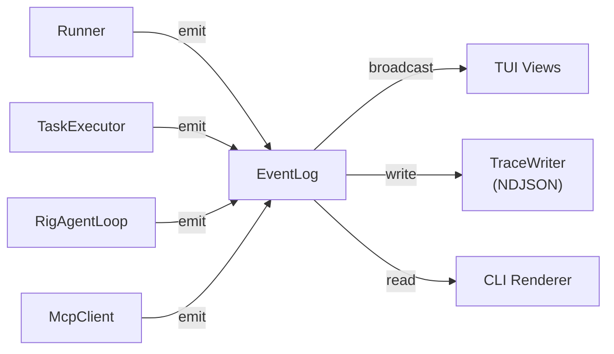

# 08 — Event System

> EventLog, TraceWriter, event categories, and how observability flows through Nika.

## Overview

Nika uses event sourcing for full audit trails with replay capability. Every significant action during workflow execution emits an `Event` to the `EventLog`, which serves as the single source of truth for what happened.



## Event Structure

**Location**: `nika-event/src/log.rs`

```rust
pub struct Event {
    /// Monotonic sequence ID (for ordering)
    pub id: u64,
    /// Time since workflow start (ms)
    pub timestamp_ms: u64,
    /// Event type and data
    pub kind: EventKind,
}
```

Events are ordered by a monotonic `id` (atomic counter) and timestamped relative to workflow start. The relative timestamp avoids clock issues and makes traces portable.

## EventKind (41 Variants, 13 Categories)

```rust
#[derive(Debug, Clone, Serialize, Deserialize, PartialEq)]
#[serde(tag = "type", rename_all = "snake_case")]
pub enum EventKind {
    // Workflow Level (6)
    WorkflowStarted { task_count, generation_id, workflow_hash, nika_version },
    WorkflowCompleted { final_output, total_duration_ms },
    WorkflowFailed { error, failed_task },
    WorkflowAborted { reason, duration_ms, running_tasks },
    WorkflowPaused,
    WorkflowResumed,

    // Task Level (5)
    TaskScheduled { task_id, dependencies },
    TaskStarted { task_id, verb, inputs },
    TaskCompleted { task_id, output, duration_ms },
    TaskFailed { task_id, error, duration_ms },
    TaskSkipped { task_id, reason },

    // Fine-grained (5)
    TemplateResolved { task_id, template, result },
    ContextAssembled { task_id, sources, excluded, total_tokens, budget_used_pct, truncated },
    ProviderCalled { task_id, provider, model, prompt_len },
    BindingResolved { task_id, alias, value },
    RetryAttempt { task_id, attempt, max_attempts, delay_ms },

    // MCP (3)
    McpConnected { server, tool_count },
    McpToolCalled { task_id, server, tool },
    McpToolResult { task_id, server, tool, duration_ms },

    // Agent (5)
    AgentTurn { task_id, turn, tool_calls, metadata },
    AgentToolCall { task_id, tool_name, args },
    AgentToolResult { task_id, tool_name, result_preview },
    AgentCompleted { task_id, turns, total_tokens },
    AgentSpawned { parent_task_id, child_task_id, depth },

    // ... plus guardrails, builtin, artifact, media, structured-output,
    //     media-cleanup, vision categories
}
```

Key design choice: `task_id` fields use `Arc<str>` for zero-cost cloning across threads. The `final_output` in `WorkflowCompleted` uses `Arc<Value>` for the same reason.

## EventLog

```rust
pub struct EventLog {
    events: Arc<RwLock<Vec<Event>>>,
    next_id: Arc<AtomicU64>,
    start_time: Instant,
    broadcast_tx: Option<broadcast::Sender<Event>>,
}
```

### Thread Safety

- `parking_lot::RwLock` (2-3x faster than `std::sync::RwLock`) protects the event vector
- `AtomicU64` provides lock-free sequence ID generation
- The log is `Clone` (all fields are `Arc`) for sharing across tokio tasks

### Broadcast Channel

`EventLog::new_with_broadcast()` returns a `(EventLog, broadcast::Receiver<Event>)` pair:

```rust
pub fn new_with_broadcast() -> (Self, broadcast::Receiver<Event>) {
    let (tx, rx) = broadcast::channel(1024);
    let log = Self {
        events: Arc::new(RwLock::new(Vec::new())),
        next_id: Arc::new(AtomicU64::new(0)),
        start_time: Instant::now(),
        broadcast_tx: Some(tx),
    };
    (log, rx)
}
```

When the TUI is active, the Runner creates a broadcast-enabled EventLog. The TUI receives events in real-time via the broadcast receiver, updating views without polling the event vector.

### Emit

```rust
pub fn emit(&self, kind: EventKind) -> u64 {
    let id = self.next_id.fetch_add(1, Ordering::Relaxed);
    let event = Event {
        id,
        timestamp_ms: self.start_time.elapsed().as_millis() as u64,
        kind,
    };

    // Append to log
    self.events.write().push(event.clone());

    // Broadcast to TUI (if connected)
    if let Some(ref tx) = self.broadcast_tx {
        let _ = tx.send(event);
    }

    id
}
```

## EventEmitter Trait

**Location**: `nika-event/src/emitter.rs`

```rust
pub trait EventEmitter: Send + Sync {
    fn emit(&self, kind: EventKind) -> u64;
}

impl EventEmitter for EventLog { /* delegates to EventLog::emit */ }

pub struct NoopEmitter;
impl EventEmitter for NoopEmitter {
    fn emit(&self, _kind: EventKind) -> u64 { 0 }
}
```

The trait enables dependency injection: production code uses `EventLog`, tests use `NoopEmitter` for zero overhead. The trait is object-safe (`dyn EventEmitter`) and works with `Arc` for concurrent sharing.

## TraceWriter

**Location**: `nika-event/src/trace.rs`

The `TraceWriter` writes events to NDJSON (newline-delimited JSON) files:

```rust
pub struct TraceWriter {
    writer: Arc<Mutex<BufWriter<File>>>,
    path: PathBuf,
}
```

Trace files are stored at `.nika/traces/{generation_id}.ndjson`. Each line is a JSON-serialized `Event`:

```json
{"id":0,"timestamp_ms":0,"kind":{"type":"workflow_started","task_count":3,"generation_id":"gen-abc123","workflow_hash":"f0c7e93e","nika_version":"0.49.0"}}
{"id":1,"timestamp_ms":5,"kind":{"type":"task_started","task_id":"step1","verb":"infer","inputs":{}}}
{"id":2,"timestamp_ms":1230,"kind":{"type":"task_completed","task_id":"step1","output":"...","duration_ms":1225}}
```

### Security

The `generation_id` is validated to prevent path traversal:

```rust
if generation_id.contains("..") || generation_id.contains('/') {
    return Err(EventError::TraceWrite(/* ... */));
}
```

### Trace Management

```rust
pub fn list_traces() -> Vec<TraceInfo>;     // List all trace files
pub fn prune_traces(max_traces: usize, retention_days: u64); // Cleanup old traces
pub fn calculate_workflow_hash(yaml: &str) -> String;        // xxhash3 for cache key
```

## AgentTurnMetadata

For agent loops, each turn captures detailed metadata:

```rust
pub struct AgentTurnMetadata {
    pub thinking: Option<String>,     // Extended thinking content
    pub response_text: String,        // Main response
    pub input_tokens: u64,
    pub output_tokens: u64,
    pub cache_read_tokens: u64,       // Anthropic prompt caching
    pub stop_reason: String,          // "end_turn", "tool_use", "max_tokens"
}
```

This metadata powers the TUI's Reasoning panel (Turns, Thinking, and Steps tabs).

## Event Flow Summary

1. **Runner** emits workflow-level events (started, completed, failed, paused, resumed)
2. **TaskExecutor** emits task-level events (started, completed, failed) and fine-grained events (template resolved, provider called)
3. **RigAgentLoop** emits agent events (turn, tool call, tool result, completed)
4. **McpClient** emits MCP events (connected, tool called, tool result)
5. **EventLog** stores all events and broadcasts to TUI
6. **TraceWriter** persists events to NDJSON for debugging
7. **CliRenderer** reads events for CLI output formatting
