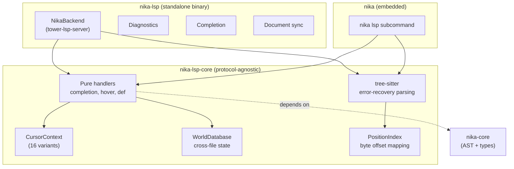

# 10 — LSP Architecture

> Language Server Protocol implementation: completion, diagnostics, hover, and the intelligence layer.

## Two-Crate Design

The LSP is split into two crates:



### nika-lsp-core

**No async, no server, no I/O.** All handlers are pure functions: `(text, offset, context) -> Result`. This enables:
- Testing without spawning a server
- Sharing between embedded and standalone LSP
- Compiling to WebAssembly (future)

### nika-lsp

The standalone binary (`nika-lsp`) uses `tower-lsp` for JSON-RPC transport. It imports `nika-engine` with `default-features = false` to minimize the dependency tree.

## CursorContext (16 Variants)

**Location**: `nika-lsp-core/src/analysis/context.rs`

The central type for completion decisions:

```rust
pub enum CursorContext {
    WorkflowRoot { prefix },          // Top-level keys
    TaskField { task_id, existing_fields, prefix }, // Task properties
    VerbBlock { task_id, verb, existing_subfields, prefix }, // Verb params
    WithBlock { task_id, alias, partial_ref },      // with: bindings
    DependsOnList { task_id, existing_deps },       // depends_on: items
    SchemaValue { prefix },           // schema: completion
    ProviderValue { prefix },         // provider: completion
    ModelValue { provider, prefix },  // model: completion
    McpBlock { prefix },              // mcp: config
    InvokeBlock { task_id, focus },   // invoke: sub-fields
    ContentBlock { task_id, focus },  // content: parts
    ForEachBlock { task_id, prefix }, // for_each: config
    OutputBlock { task_id, prefix },  // output: config
    RetryBlock { task_id, prefix },   // retry: config
    AgentBlock { task_id, prefix },   // agent: sub-fields
    Unknown,                          // No context detected
}
```

Each variant carries enough information for the completion handler to return relevant items. For example, `TaskField` includes `existing_fields` so that already-present fields are excluded from suggestions.

### InvokeFocus Sub-Variants

```rust
pub enum InvokeFocus {
    McpServer,   // Cursor on mcp: field
    Tool,        // Cursor on tool: field
    Params,      // Inside params: block
    Resource,    // Cursor on resource:
    General,     // General invoke block
}
```

## Error-Recovery Parsing

**Location**: `nika-lsp-core/src/parse/`

The LSP uses `tree-sitter-yaml` for error-recovery parsing. Unlike `marked_yaml` (which fails on invalid YAML), tree-sitter produces a partial tree with `ERROR` nodes:

```rust
pub fn parse_and_extract(text: &str) -> PartialWorkflow {
    let mut parser = tree_sitter::Parser::new();
    parser.set_language(&tree_sitter_yaml::LANGUAGE.into()).unwrap();
    let tree = parser.parse(text, None).unwrap();
    // Extract structural info from tree, tolerating ERROR nodes
    PartialWorkflow { /* ... */ }
}
```

`PartialWorkflow` provides structural information even from broken YAML:
- Which tasks are defined (by name)
- Which verbs are used
- Which `with:` aliases are declared
- What the current indentation context is

## Handler Architecture

**Location**: `nika-lsp-core/src/handler.rs`

```rust
pub trait LspHandler {
    fn completion(&self, text: &str, offset: usize, ctx: &CursorContext)
        -> Vec<CompletionItem>;

    fn hover(&self, text: &str, offset: usize)
        -> Option<HoverContent>;

    fn definition(&self, text: &str, offset: usize)
        -> Option<Location>;

    fn diagnostics(&self, text: &str)
        -> Vec<Diagnostic>;
}
```

The `DefaultHandler` wires these to concrete implementations in `nika-lsp-core/src/handlers/`.

### Completion Handler

Generates completion items based on `CursorContext`:

| Context | Completions |
|---------|-------------|
| `WorkflowRoot` | schema, workflow, provider, model, mcp, tasks, imports, inputs, agents, skills |
| `TaskField` | id, infer, exec, fetch, invoke, agent, with, depends_on, output, for_each, retry, decompose |
| `VerbBlock(infer)` | prompt, system, temperature, max_tokens, extended_thinking, content, response_format |
| `ProviderValue` | claude, openai, mistral, groq, deepseek, gemini, xai, native |
| `ModelValue(claude)` | claude-sonnet-4-6, claude-opus-4-6, claude-haiku-3-5, ... |
| `WithBlock` | Task IDs from the same workflow |
| `SchemaValue` | nika/workflow@0.12, nika/workflow@0.11, ... |

### Diagnostics

The diagnostics handler runs the full Phase 1 + Phase 2 pipeline (`parse_analyzed()`) and converts errors to LSP diagnostics:

```rust
fn diagnostics(&self, text: &str) -> Vec<Diagnostic> {
    match nika_core::ast::parse_analyzed(text) {
        Ok(_) => vec![],  // No errors
        Err(e) => convert_to_diagnostics(e),
    }
}
```

Each `AnalyzeError` has a `Span` that maps directly to an LSP `Range`, enabling precise red underlines in the editor.

## WorldDatabase

**Location**: `nika-lsp-core/src/db.rs`

The `WorldDatabase` maintains cross-file state for multi-file projects:

```rust
pub struct WorldDatabase {
    files: DashMap<String, DocumentState>,
    catalogs: Arc<Catalogs>,
}

pub struct DocumentState {
    pub text: String,
    pub version: i32,
    pub analysis: Option<AnalyzedWorkflow>,
    pub tree: Option<tree_sitter::Tree>,
}
```

When a file changes, the database re-parses it incrementally via tree-sitter and re-runs analysis to update diagnostics.

## Position Mapping

**Location**: `nika-lsp-core/src/position.rs`

The `PositionIndex` maps between LSP positions (line, character) and byte offsets:

```rust
pub struct LineIndex {
    line_starts: Vec<u32>,
}

impl LineIndex {
    pub fn offset(&self, line: u32, character: u32) -> usize;
    pub fn position(&self, offset: usize) -> (u32, u32);
}
```

The `ropey` crate provides rope-based text storage for efficient incremental updates.

## Standalone vs Embedded

| Feature | Standalone (`nika-lsp`) | Embedded (`nika lsp`) |
|---------|------------------------|-----------------------|
| Binary | Separate `nika-lsp` binary | Part of `nika` binary |
| Transport | stdio (for VS Code) | stdio (for any editor) |
| Engine deps | Minimal (no default features) | Full (with all features) |
| Intelligence | `nika-lsp-core` | `nika-lsp-core` |
| MCP discovery | Via `mcp_discovery.rs` | Via engine's MCP pool |

Both share the same intelligence layer (`nika-lsp-core`), ensuring consistent behavior regardless of how the LSP is launched.
