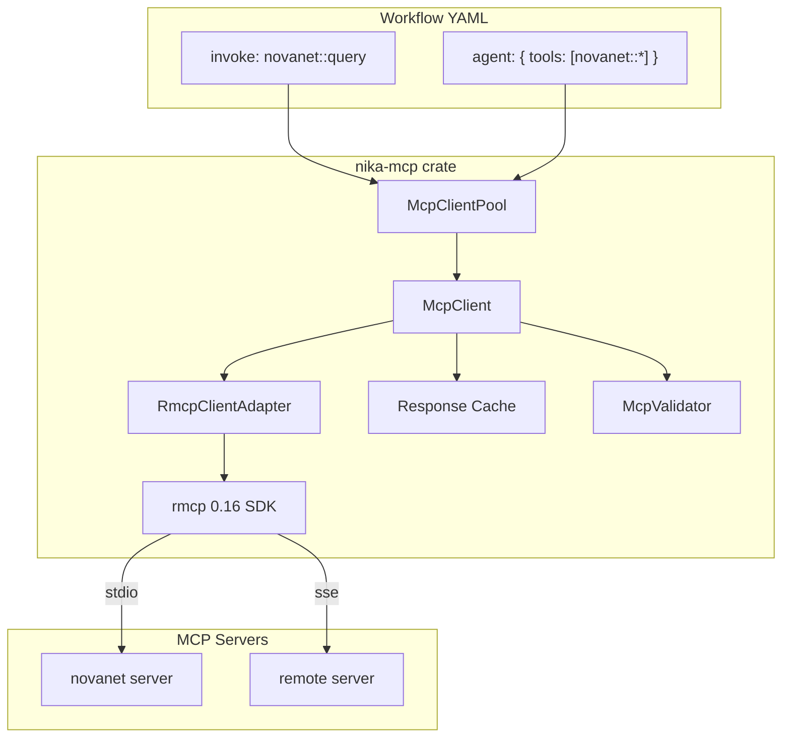

# 06 — MCP Integration

> How Nika connects to MCP servers: the rmcp client, tool discovery, invocation protocol, and alias system.

## Architecture



## McpClient

**Location**: `nika-mcp/src/client.rs`

The `McpClient` wraps an `RmcpClientAdapter` with response caching, validation, health checking, and event emission:

```rust
pub struct McpClient {
    name: String,
    adapter: RmcpClientAdapter,
    connected: AtomicBool,
    cache: Option<ResponseCache>,
    validator: Option<McpValidator>,
    event_log: EventLog,
    call_count: AtomicU64,
}
```

### Connection Lifecycle

1. **Create**: `McpClient::new(config)` stores the config but does not connect
2. **Connect**: `client.connect().await` spawns the server process (stdio) or connects via SSE
3. **Discover**: `client.list_tools().await` fetches the server's tool definitions
4. **Call**: `client.call_tool(name, params).await` invokes a tool
5. **Disconnect**: `client.disconnect().await` shuts down the connection

Connection timeout is 20 seconds. Call timeout is 60 seconds. Reconnect timeout is 30 seconds.

### Response Caching

For deterministic tools (e.g., schema queries), response caching avoids redundant server calls:

```rust
pub struct CacheConfig {
    pub ttl: Duration,        // Cache entry lifetime
    pub max_entries: usize,   // Maximum cached responses
}
```

Cache keys are computed by hashing the tool name and parameters with `FxHasher`. The cache uses `DashMap` for lock-free concurrent access.

### Validation

The `McpValidator` validates tool call parameters against the server's JSON Schema definitions:

```rust
pub struct McpValidator {
    tool_schema_cache: ToolSchemaCache,
    config: ValidationConfig,
}
```

Validation errors include rich diagnostics:
- **InvalidArguments**: Wrong type, missing required field
- **UnknownTool**: Tool not found on any connected server
- **SchemaViolation**: Parameter does not match JSON Schema

The `ErrorEnhancer` provides "did you mean?" suggestions for mistyped tool names.

## McpClientPool

**Location**: `nika-mcp/src/pool.rs`

The `McpClientPool` manages connections to multiple MCP servers using `DashMap<String, OnceCell<Arc<McpClient>>>`:

```rust
pub struct McpClientPool {
    clients: DashMap<String, OnceCell<Arc<McpClient>>>,
    configs: FxHashMap<String, McpConfigInline>,
}
```

The `OnceCell` ensures each server is connected at most once, even under concurrent access. When the executor requests a tool call, the pool lazily initializes the connection:

```rust
pub async fn get_or_connect(&self, server: &str) -> Result<Arc<McpClient>> {
    let entry = self.clients.get(server)?;
    entry.get_or_init(|| async {
        let client = McpClient::new(self.configs[server].clone());
        client.connect().await?;
        Ok(Arc::new(client))
    }).await
}
```

### Graceful Shutdown

On workflow completion, the pool shuts down all connected servers:

```rust
pub async fn shutdown_all(&self) {
    for entry in self.clients.iter() {
        if let Some(client) = entry.get() {
            let _ = client.disconnect().await;
        }
    }
}
```

## Transport Types

Nika supports two MCP transports:

### Stdio Transport (Default)

The server is spawned as a child process. Communication happens over stdin/stdout:

```yaml
mcp:
  novanet:
    command: npx
    args: ["-y", "@novanet/mcp-server"]
    env:
      NOVANET_API_KEY: $NOVANET_API_KEY
```

The `RmcpClientAdapter` uses `rmcp::transport::child_process` to manage the process lifecycle.

### SSE Transport

For remote servers, communication uses Server-Sent Events over HTTP:

```yaml
mcp:
  servers:
    remote:
      url: https://mcp.example.com/sse
```

## Alias System

**Location**: `nika-core/src/catalogs/`

Nika maintains a catalog of 100+ MCP tool aliases mapping common tool names to their canonical server-qualified form:

```yaml
# Examples from the alias catalog:
novanet_query -> novanet::query
novanet_describe -> novanet::describe
filesystem_read -> filesystem::read_file
```

When the executor encounters an unqualified tool name (e.g., `invoke: novanet_query`), it checks the alias catalog before attempting a direct MCP call.

## Configuration Sources

MCP servers can be configured from multiple sources, in priority order:

1. **Workflow YAML** -- `mcp:` block in the workflow file
2. **Project config** -- `.mcp.json` or `.nika/mcp.yaml`
3. **Global config** -- `~/.nika/mcp.yaml`

The `McpConfigResolver` in `mcp_config.rs` handles config discovery and merging across these sources.

## Retry Logic

**Location**: `nika-mcp/src/retry.rs`

Failed MCP calls use exponential backoff:

```rust
pub struct McpRetryConfig {
    pub max_attempts: u32,      // Default: 3
    pub initial_delay: Duration, // Default: 1s
    pub backoff_factor: f64,     // Default: 2.0
    pub max_delay: Duration,     // Default: 30s
}
```

Only retryable errors trigger retries:
- Connection reset
- Timeout
- Server internal error (5xx)

Non-retryable errors (invalid arguments, unknown tool) fail immediately.

## Event Emission

MCP operations emit events to the `EventLog` for observability:

- `McpConnected { server, tool_count }` -- Server connected
- `McpToolCalled { server, tool, params }` -- Tool call started
- `McpToolResult { server, tool, duration_ms }` -- Tool call completed
- `McpDisconnected { server }` -- Server disconnected
- `McpError { server, error }` -- Connection or call error

These events are visible in the TUI's Command view and in NDJSON trace files.
