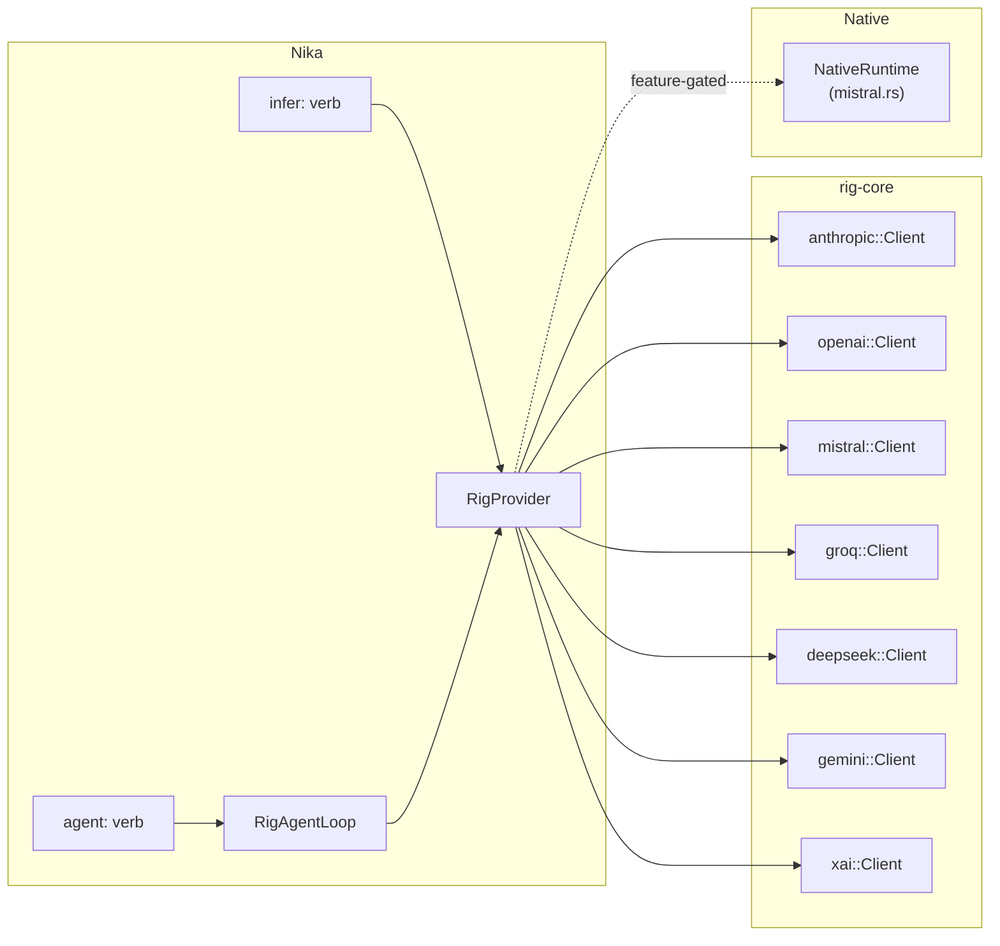

# 05 — Provider Abstraction

> The RigProvider system: multi-provider LLM support, auto-detection, cost tracking, and streaming.

## Provider Strategy

Nika delegates all LLM interactions to [rig-core](https://github.com/0xPlaygrounds/rig), an open-source Rust LLM agent framework. This gives Nika access to 8 providers without maintaining individual API clients.



## RigProvider Enum

**Location**: `nika-engine/src/provider/rig.rs`

```rust
pub enum RigProvider {
    Claude(anthropic::Client),
    OpenAI(openai::Client),
    Mistral(mistral::Client),
    Groq(groq::Client),
    DeepSeek(deepseek::Client),
    Gemini(gemini::Client),
    XAi(xai::Client),
    #[cfg(feature = "native-inference")]
    Native(NativeRuntime),
}
```

Each variant wraps the corresponding rig-core client. Construction uses `from_env()` which reads the provider's API key from the environment:

| Provider | Env Variable | Default Model |
|----------|-------------|---------------|
| Claude | `ANTHROPIC_API_KEY` | `claude-sonnet-4-6` |
| OpenAI | `OPENAI_API_KEY` | `gpt-4o` |
| Mistral | `MISTRAL_API_KEY` | `mistral-large-latest` |
| Groq | `GROQ_API_KEY` | `llama-4-maverick` |
| DeepSeek | `DEEPSEEK_API_KEY` | `deepseek-chat` |
| Gemini | `GEMINI_API_KEY` | `gemini-2.5-flash` |
| xAI | `XAI_API_KEY` | `grok-3-fast` |
| Native | (none) | (loaded GGUF model) |

### Provider Resolution

`RigProvider::from_name()` resolves aliases and validates environment:

```rust
pub fn from_name(name: &str) -> Result<Self, NikaError> {
    // 1. Resolve alias via catalogs: "claude" -> "anthropic"
    let provider = crate::core::find_provider(name)?;

    // 2. Check API key is set (rig-core panics without it)
    if provider.requires_key && !provider.has_env_key() {
        return Err(NikaError::MissingApiKey { provider: ... });
    }

    // 3. Create the appropriate variant
    match provider.id {
        "anthropic" => Ok(Self::claude()),
        "openai" => Ok(Self::openai()),
        // ...
    }
}
```

The catalog system (`nika-core/src/catalogs/`) maps 100+ aliases to canonical provider IDs. For example, `"claude"`, `"anthropic"`, `"claude-3"`, and `"sonnet"` all resolve to the `anthropic` provider.

### Reasoning Model Detection

Some models (OpenAI o-series, GPT-5, DeepSeek Reasoner) do not support the `temperature` parameter and return HTTP 400 if it is set. Nika detects these automatically:

```rust
pub fn is_reasoning_model(model_id: &str) -> bool {
    let lower = model_id.to_lowercase();
    lower == "o1" || lower == "o3" || lower == "o4-mini"
        || lower.starts_with("o1-") || lower.starts_with("o3-")
        || lower == "gpt-5" || lower.starts_with("gpt-5-")
        || lower == "deepseek-reasoner"
}
```

When a reasoning model is detected, Nika strips the temperature parameter with a warning instead of crashing.

## MCP Tool Integration

Tools from MCP servers must be usable in rig-core's agent framework. Nika bridges this via `NikaMcpTool`:

```rust
pub struct NikaMcpToolDef {
    pub name: String,
    pub description: String,
    pub schema: serde_json::Value,
}

pub struct NikaMcpTool {
    pub def: NikaMcpToolDef,
    pub client: Arc<McpClient>,
}
```

`NikaMcpTool` implements rig-core's `ToolDyn` trait, which requires:
- `definition()` -- Returns `ToolDefinition` with name, description, and JSON Schema
- `call()` -- Accepts JSON arguments, calls the MCP server, and returns a string result

This abstraction avoids the rmcp version conflict (rig-core bundles rmcp 0.13 internally; Nika uses rmcp 0.16).

## Streaming

The `infer:` verb supports streaming for real-time token output:

```rust
pub enum StreamChunk {
    Text(String),
    Done { total_tokens: Option<u64> },
}

pub type StreamResult = mpsc::Receiver<StreamChunk>;
```

The executor creates an `mpsc` channel, spawns the streaming completion, and forwards chunks. The TUI subscribes to these chunks for live output display. Streaming is available for all cloud providers via rig-core's `StreamedAssistantContent` API.

A `STREAM_CHUNK_TIMEOUT` prevents hanging on stalled streams.

## Cost Tracking

**Location**: `nika-engine/src/provider/cost.rs`

Nika tracks token costs per provider and model:

```rust
pub struct ModelPricing {
    pub input_per_million: f64,   // USD per million input tokens
    pub output_per_million: f64,  // USD per million output tokens
}

pub fn calculate_cost(
    provider: ProviderKind,
    model: &str,
    input_tokens: u64,
    output_tokens: u64,
) -> f64 {
    let pricing = get_model_pricing(provider, model);
    pricing.calculate(input_tokens, output_tokens)
}
```

Pricing tables are stored as `LazyLock<HashMap>` for zero-allocation access after initialization. The `ProviderKind` enum mirrors `RigProvider` but is used only for cost calculation (it includes `Native` which has zero cost).

## Native Inference

**Feature**: `native-inference` (default on)

When the `native-inference` feature is enabled, Nika can run GGUF models locally via [mistral.rs](https://github.com/EricLBuehler/mistral.rs):

```rust
#[cfg(feature = "native-inference")]
pub struct NativeRuntime { /* ... */ }
```

Key capabilities:
- Load GGUF models from disk
- Vision models via `NativeModelKind::VisionHf` (HuggingFace + ISQ quantization)
- Full streaming support
- Model management: `nika model pull`, `nika model list`, `nika model delete`

Vision requires HuggingFace model IDs (not GGUF files) and uses ISQ (In-Situ Quantization):
```bash
nika model vision Qwen/Qwen2.5-VL-7B-Instruct --isq Q4K
```

## Provider Hierarchy

The provider resolution follows this precedence:

1. **Task-level**: `provider:` / `model:` in the task YAML
2. **Agent-level**: `provider:` / `model:` inside `agent:` block
3. **Workflow-level**: Top-level `provider:` / `model:`
4. **Default**: `claude` / `claude-sonnet-4-6`

At each level, the model can be overridden independently of the provider. For example, a workflow using `provider: openai` can have a task with `model: gpt-4-turbo` without specifying the provider again.
