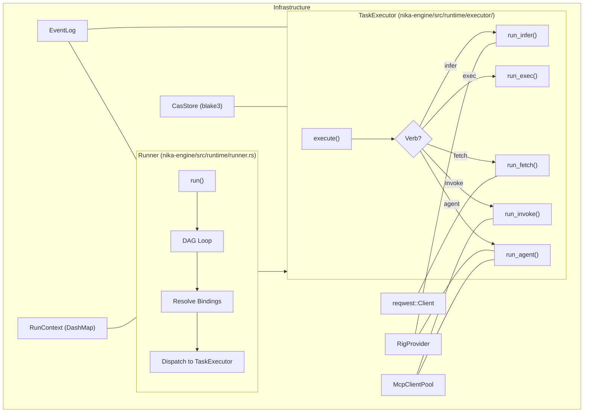

# 04 — Runtime Architecture

> How workflows execute: the Runner, TaskExecutor, verb dispatch, and result collection.

## Runtime Components



## Runner

**Location**: `nika-engine/src/runtime/runner.rs`

The `Runner` is the top-level orchestrator. It owns the workflow, DAG, datastore, executor, event log, and all execution state.

```rust
pub struct Runner {
    workflow: AnalyzedWorkflow,
    flow_graph: Dag,
    datastore: RunContext,
    executor: TaskExecutor,
    event_log: EventLog,
    generation_id: String,
    quiet: bool,
    cancel_token: CancellationToken,
    paused: Arc<AtomicBool>,
    resume_notify: Arc<Notify>,
    resolved_assets: ResolvedAssets,
    trace_config: TraceConfig,
    cli_renderer: Option<CliRenderer>,
}
```

### Construction

```rust
pub fn with_event_log(
    workflow: AnalyzedWorkflow,
    event_log: EventLog,
) -> Result<Self, NikaError> {
    // 1. Build DAG from AnalyzedWorkflow
    let flow_graph = Dag::from_analyzed(&workflow)?;

    // 2. Create RunContext (empty DashMap)
    let datastore = RunContext::new();

    // 3. Bridge MCP servers to McpConfigInline format
    let mcp_configs = lower_mcp_servers(workflow.mcp_servers.clone());

    // 4. Create TaskExecutor with provider, model, MCP configs
    let executor = TaskExecutor::new(
        provider, model, mcp_configs, event_log.clone()
    );

    // 5. Generate unique execution ID
    let generation_id = format!("gen-{}", uuid::Uuid::new_v4());

    Ok(Self { /* ... */ })
}
```

The Runner accepts an `AnalyzedWorkflow` directly -- Phase 3 lowering happens at the `TaskExecutor` boundary, converting actions on-demand via `lower_action()`.

### Execution Flow

The `run()` method implements the core execution loop:

1. **Emit WorkflowStarted** with task count, generation ID, and workflow hash
2. **Load context files** (if `context:` block exists)
3. **Prune old traces** (if trace retention is configured)
4. **Create lockfile guard** (RAII cleanup for media GC)
5. **Process tasks in DAG order** using JoinSet for parallelism
6. **For each ready task**: resolve bindings, dispatch to executor, collect results
7. **Handle for_each expansion**: spawn iterations with semaphore concurrency control
8. **Process artifacts** after each task completion
9. **Emit WorkflowCompleted** or **WorkflowFailed**

### RAII Lockfile Guard

The lockfile guard prevents `nika media clean` from garbage-collecting blobs still in use. The RAII pattern ensures cleanup on all exit paths: normal completion, error propagation, and panics.

```rust
struct LockfileGuard { path: PathBuf }

impl Drop for LockfileGuard {
    fn drop(&mut self) {
        let _ = std::fs::remove_file(&self.path);
    }
}
```

### Result Collection

Task results are stored in `RunContext`, a thread-safe `DashMap`:

```rust
// nika-engine/src/store/

pub struct RunContext {
    results: DashMap<Arc<str>, TaskResult>,
}

pub struct TaskResult {
    pub status: TaskOutcome,
    pub output: serde_json::Value,
    pub duration_ms: u64,
}

pub enum TaskOutcome {
    Success,
    Failed(String),
}
```

Results are read by downstream tasks during binding resolution (`{{with.alias}}` template substitution).

## TaskExecutor

**Location**: `nika-engine/src/runtime/executor/mod.rs`

The `TaskExecutor` handles individual task execution. It maintains cached providers, a shared HTTP client, and the centralized MCP pool.

```rust
pub struct TaskExecutor {
    http_client: reqwest::Client,
    rig_provider_cache: Arc<DashMap<String, RigProvider>>,
    mcp_pool: McpClientPool,
    default_provider: Arc<str>,
    default_model: Option<Arc<str>>,
    event_log: EventLog,
    builtin_router: Arc<BuiltinToolRouter>,
    policy_enforcer: Arc<RwLock<PolicyEnforcer>>,
    cancel_token: CancellationToken,
    cas: Arc<CasStore>,
    skill_injector: Arc<SkillInjector>,
    skills_map: HashMap<String, String>,
    workflow_base_dir: PathBuf,
}
```

### Provider Caching

The `rig_provider_cache` uses `DashMap` for lock-free concurrent access. Providers are created lazily on first use and cached for subsequent calls.

### Verb Dispatch

**Location**: `nika-engine/src/runtime/executor/verbs.rs`

The executor dispatches to one of five verb implementations based on the `TaskAction` variant.

#### run_infer (LLM Inference)

1. Validates infer params (empty prompt, invalid temperature)
2. Resolves `{{with.alias}}` templates in prompt and system prompt
3. Validates resolved prompt is not empty (unless vision content is present)
4. Injects JSON schema instruction if output policy requires JSON
5. Emits `TemplateResolved` and `ContextAssembled` events
6. Resolves vision content parts (CAS hashes to base64)
7. Creates `RigProvider` for the specified provider
8. Calls the provider's completion API with streaming
9. Returns the generated text

#### run_exec (Shell Command)

1. Validates command against the security blocklist (see [11-security-architecture.md](11-security-architecture.md))
2. Resolves templates in command, cwd, and environment variables
3. Enforces policy (command allow/block via `PolicyEnforcer`)
4. Runs the command via `tokio::process::Command`
5. Captures stdout/stderr with configurable timeout (default 60s)
6. Returns stdout content

#### run_fetch (HTTP Request)

1. Resolves templates in URL, headers, body
2. Enforces URL policy (allow/block patterns)
3. Builds reqwest request with method, headers, body/json
4. Handles response modes: `full` (JSON with status+headers+body), `binary` (store in CAS), or default (raw body)
5. Applies extraction mode if specified: markdown, article, text, selector, metadata, links, feed, jsonpath, llm_txt

#### run_invoke (MCP Tool Call)

1. Resolves MCP tool alias via the alias catalog
2. Gets or creates MCP client from the pool
3. Resolves templates in parameters
4. Validates parameters against the tool's JSON Schema
5. Calls the tool with a deadline timeout, racing against cancellation token
6. Processes media in the response (extracts and stores in CAS)
7. Returns the tool result

#### run_agent (Multi-turn Agent Loop)

1. Creates `RigAgentLoop` with agent parameters and MCP tools
2. Injects skills into the system prompt via `SkillInjector`
3. Converts MCP tools to `NikaMcpTool` (rig's `ToolDyn` trait)
4. Adds builtin tools (nika:* tools from `BuiltinToolRouter`)
5. Runs the agent loop via the appropriate provider method
6. Emits `AgentTurn` events with thinking, tokens, and stop reason
7. Returns the final output when the agent signals completion or hits max_turns

### Structured Output Engine

**Location**: `nika-engine/src/runtime/structured_output.rs`

For tasks with `structured:` specification, a 5-layer defense system ensures JSON compliance:

| Layer | Name | Mechanism |
|-------|------|-----------|
| 0 | DynamicSubmitTool | Provider-native JSON mode via tool definition |
| 1 | (reserved) | -- |
| 2 | Extract+Validate | Parse JSON from response, validate against schema |
| 3 | Retry | Re-prompt with validation errors |
| 4 | LLM Repair | Ask the LLM to fix the JSON |

### Builtin Tool Router

**Location**: `nika-engine/src/runtime/builtin/`

The `BuiltinToolRouter` dispatches `nika:*` tool calls to their implementations across three tiers of media tools plus web extraction tools.

Agent loops also have access to file tools (`ReadTool`, `WriteTool`, `EditTool`, `GlobTool`, `GrepTool`) for filesystem operations within the workflow's working directory.

## Boot Sequence

**Location**: `nika-engine/src/runtime/boot.rs`

Before execution, the engine runs a 7-phase boot sequence:

| Phase | Name | Action |
|-------|------|--------|
| 1 | Config Discovery | Find `.nika/` directory |
| 2 | Config Validation | Parse `config.toml` |
| 3 | Memory Loading | Load memory files |
| 4 | Secrets Loading | Load from nika daemon or fallback |
| 5 | MCP Startup | Launch configured servers |
| 6 | Provider Validation | Check API keys |
| 7 | Ready | System ready for execution |

## Error Propagation

All errors flow through `NikaError`, a comprehensive error enum with NIKA-XXX codes organized by range:

| Range | Category | Example |
|-------|----------|---------|
| 000-009 | Workflow | WorkflowNotFound, WorkflowFailed |
| 030-039 | Provider | MissingApiKey, ProviderNotConfigured |
| 040-049 | Template/binding | TemplateError, BindingError |
| 050-059 | Security | BlockedCommand, InvalidPath |
| 090-099 | Execution | ExecTimeout, ExecFailed |
| 100-109 | MCP | McpConnectionFailed, McpToolError |
| 110-119 | Agent | AgentMaxTurns, GuardrailViolation |

## TUI Integration

The Runner integrates with the TUI via `EventLog::new_with_broadcast()`:

```rust
let (event_log, event_rx) = EventLog::new_with_broadcast();
let mut runner = Runner::with_event_log(workflow, event_log)?.quiet();
let runner_handle = tokio::spawn(async move { runner.run().await });

let app = App::new(workflow_path)?.with_broadcast_receiver(event_rx);
app.run_unified();
```

The `.quiet()` mode suppresses console output that would interfere with the TUI. Events flow through the broadcast channel to update the progress, task I/O, and DAG visualization in real-time.
