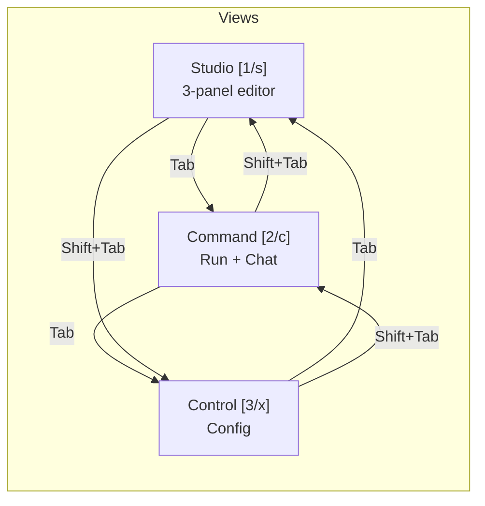

# 07 — TUI Architecture

> The ratatui-based terminal UI: 3-view architecture, event loop, widget system, and state management.

## Three-View Architecture

The TUI is organized into three top-level views, each accessible via Tab cycling or keyboard shortcuts:

```
+------------------------------------------------------------------+
|  [1/s] Studio  | [2/c] Command | [3/x] Control                    |
+------------------------------------------------------------------+
|                                                                    |
|  Studio:   3-panel layout (Browser | Editor | DAG Preview)        |
|  Command:  Chat + Monitor modes (Ctrl+M to toggle)                |
|  Control:  Configuration and preferences                          |
|                                                                    |
+------------------------------------------------------------------+
```



**Location**: `nika-tui/src/views/mod.rs`

```rust
pub enum TuiView {
    Studio,   // Default view -- file browser + YAML editor + DAG preview
    Command,  // Execution monitoring + conversational chat
    Control,  // Provider config, theme, preferences
}
```

## App Structure

**Location**: `nika-tui/src/app.rs`

The `App` struct is the top-level container:

```rust
pub struct App {
    state: TuiState,
    theme: Theme,
    studio_view: StudioView,
    command_view: CommandView,
    control_view: ControlView,
    chat_agent: Option<ChatAgent>,
    event_rx: Option<broadcast::Receiver<Event>>,
    // ...
}
```

### Event Loop

The TUI runs a standard ratatui event loop:

```rust
pub fn run_unified(mut self) -> Result<bool> {
    let mut terminal = setup_terminal()?;

    loop {
        // 1. Draw the current view
        terminal.draw(|frame| {
            match self.state.current_view {
                TuiView::Studio => self.studio_view.render(frame, area, &self.state, &self.theme),
                TuiView::Command => self.command_view.render(frame, area, &self.state, &self.theme),
                TuiView::Control => self.control_view.render(frame, area, &self.state, &self.theme),
            }
        })?;

        // 2. Poll for events (100ms timeout for animations)
        if event::poll(Duration::from_millis(100))? {
            if let Event::Key(key) = event::read()? {
                match self.handle_key(key) {
                    ViewAction::Quit => break,
                    ViewAction::SwitchView(v) => self.state.current_view = v,
                    // ... handle other actions
                }
            }
        }

        // 3. Process broadcast events from Runner
        self.process_runner_events();

        // 4. Update animation frame counter
        self.state.frame_counter += 1;
    }

    restore_terminal()?;
    Ok(false)
}
```

### View Trait

All views implement the `View` trait:

```rust
pub trait View {
    fn render(
        &self,
        frame: &mut Frame,
        area: Rect,
        state: &TuiState,
        theme: &Theme,
    );

    fn handle_key(
        &mut self,
        key: KeyEvent,
        state: &mut TuiState,
    ) -> ViewAction;
}
```

`ViewAction` is a comprehensive enum representing all possible results of key handling:

```rust
pub enum ViewAction {
    None,
    Quit,
    SwitchView(TuiView),
    RunWorkflow(PathBuf),
    OpenInStudio(PathBuf),
    SendChatMessage(String),
    Error(String),
    StatusMessage(StatusMessage),
    ChatInfer(String),
    ChatExec(String),
    ChatFetch(String, String),
    ChatInvoke(String, Option<String>, Value),
    ChatAgent(String, Option<u32>, bool, Vec<String>),
    ChatModelSwitch(ModelProvider),
    // ... 20+ variants
}
```

## Studio View

**Location**: `nika-tui/src/views/studio/`

The Studio view is a 3-panel layout:

```
+-------------------+------------------------+------------------+
|                   |                        |                  |
|  File Browser     |  YAML Editor           |  DAG Preview     |
|  (.nika.yaml)     |  + Syntax highlighting |  + Live graph    |
|  + Git status     |  + LSP diagnostics     |  + Layer view    |
|  + Fuzzy search   |  + Auto-completion     |                  |
|                   |                        |                  |
+-------------------+------------------------+------------------+
```

### YamlEditorPanel

The YAML editor is the most complex component (part of the 86k lines). It provides:

- **Tree-sitter syntax highlighting** via `tree-sitter-yaml` (0.7) and `TreeSitterHighlighter`
- **LSP diagnostics** via `nika-lsp-core` inline (no process spawn)
- **Auto-completion** using `CursorContext` (16 variants)
- **Edit history** with undo/redo (`EditHistory`)
- **Multi-cursor selection** via `SelectionSet`
- **Clipboard integration** via `arboard`
- **Fuzzy file search** via `nucleo`
- **Git integration** via `git2` for gutter decorations and file status

### File Browser (StandalonePanel)

The file browser scans for `.nika.yaml` files in the project tree:

```rust
pub struct StandaloneState {
    pub root: PathBuf,
    pub entries: Vec<BrowserEntry>,
    pub selected: usize,
    pub history: Vec<HistoryEntry>,
}
```

It uses the `ignore` crate (same as ripgrep) to respect `.gitignore` patterns.

## Command View

**Location**: `nika-tui/src/views/command.rs`

The Command view fuses workflow execution monitoring with conversational chat:

- **Monitor mode**: Shows task progress, DAG execution state, outputs, and reasoning traces
- **Chat mode**: Interactive conversation with the LLM (Ctrl+M to toggle)

### ChatAgent

**Location**: `nika-tui/src/chat_agent.rs`

The `ChatAgent` manages multi-turn conversations:

```rust
pub struct ChatAgent {
    messages: Vec<ChatMessage>,
    streaming_state: StreamingState,
    provider: RigProvider,
    model: String,
    // ...
}

pub struct ChatMessage {
    pub role: ChatRole,
    pub content: String,
    pub timestamp: DateTime<Local>,
}

pub enum StreamingState {
    Idle,
    Streaming { buffer: String, token_count: u64 },
    Complete,
}
```

Chat supports slash commands (`/infer`, `/exec`, `/fetch`, `/invoke`, `/agent`, `/model`, `/mcp`, `/clear`) for direct verb execution from the chat interface.

## Control View

**Location**: `nika-tui/src/views/control.rs`

The Control view displays:
- Provider verification status (API key validation)
- Model selection and switching
- Theme configuration (CosmicDark, CosmicLight, CosmicViolet)
- Session management
- Native model management (pull, list, delete)

## State Management

**Location**: `nika-tui/src/state.rs`

All TUI state is centralized in `TuiState`:

```rust
pub struct TuiState {
    pub current_view: TuiView,
    pub tui_mode: TuiMode,
    pub input_mode: InputMode,
    pub frame_counter: u64,
    pub scroll_states: HashMap<String, PanelScrollState>,
    pub active_tabs: TabState,
    // ... many more fields
}

pub enum TuiMode {
    Normal,
    Insert,
    Visual,
    Command,
}
```

The state is mutable and passed by `&mut` to view handlers. This avoids interior mutability patterns and makes state changes explicit.

### Animation Frames

The TUI supports two animation speeds:

```rust
pub const FRAME_CYCLE: u64 = 256;
pub const FRAME_DIV_NORMAL: u64 = 8;    // ~12 FPS at 100ms poll
pub const FRAME_DIV_GLACIAL: u64 = 32;  // ~3 FPS for slow animations
```

Animation state is computed from `frame_counter % FRAME_CYCLE`, enabling smooth spinners and progress indicators without a dedicated animation thread.

## Theme System

**Location**: `nika-tui/src/theme.rs`, `nika-tui/src/cosmic_theme.rs`, `nika-tui/src/tokens.rs`

The theme system uses a semantic token approach:

```rust
pub struct Theme {
    pub colors: SemanticColors,
    pub mode: ColorMode,
    pub verb_colors: VerbColorMap,
    // ...
}

pub struct SemanticColors {
    pub bg_primary: Color,
    pub bg_secondary: Color,
    pub fg_primary: Color,
    pub fg_secondary: Color,
    pub accent: Color,
    pub error: Color,
    pub warning: Color,
    pub success: Color,
    // ...
}
```

Three theme variants are available:
- **CosmicDark** -- Dark background with blue/violet accents
- **CosmicLight** -- Light background with dark text
- **CosmicViolet** -- Dark with violet accents

The `TokenResolver` maps semantic tokens to concrete colors based on the active variant.

## Panic Recovery

The TUI installs a panic hook to restore terminal state on crashes:

```rust
fn install_panic_hook() {
    let original_hook = panic::take_hook();
    panic::set_hook(Box::new(move |panic_info| {
        // 1. Restore terminal state FIRST
        let _ = crossterm::terminal::disable_raw_mode();
        let _ = execute!(stdout(), LeaveAlternateScreen);

        // 2. Write crash log to ~/.nika/crash.log
        // 3. Print user-friendly message
        // 4. Call original hook
    }));
}
```

Signal handlers for `SIGTERM` and `SIGHUP` provide the same terminal restoration on process kill.

## Wizard View

**Location**: `nika-tui/src/views/wizard.rs`

The setup wizard runs as a standalone TUI (separate from the 3-view architecture). It guides new users through:
- Provider API key configuration
- Default model selection
- Theme preferences
- Project initialization

The wizard uses its own event loop and renders directly without the App wrapper.
