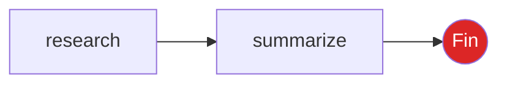
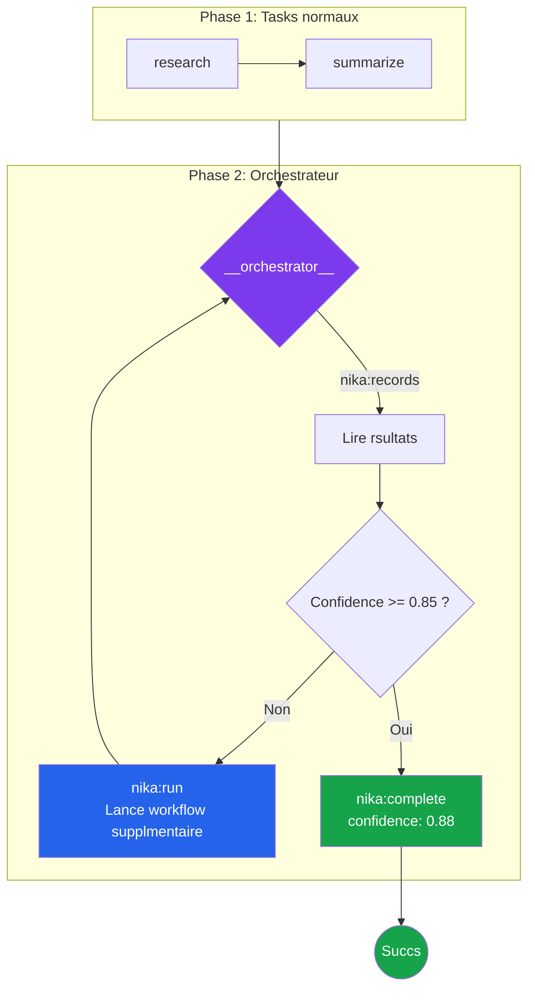
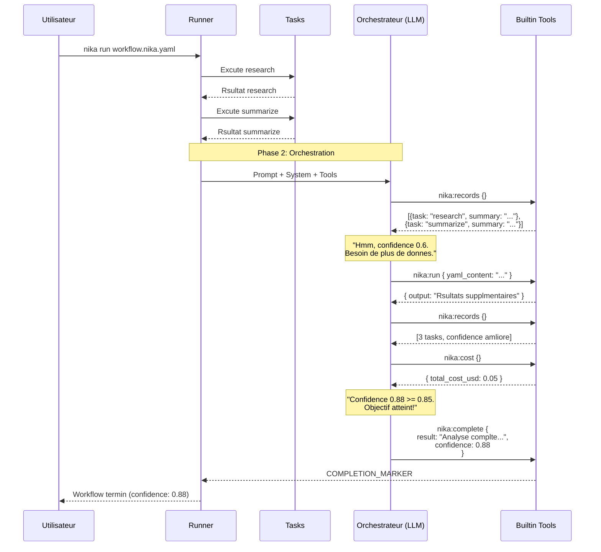
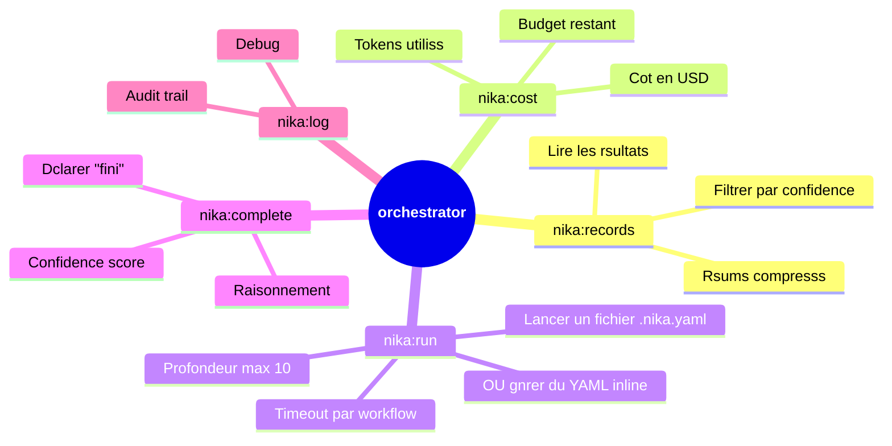
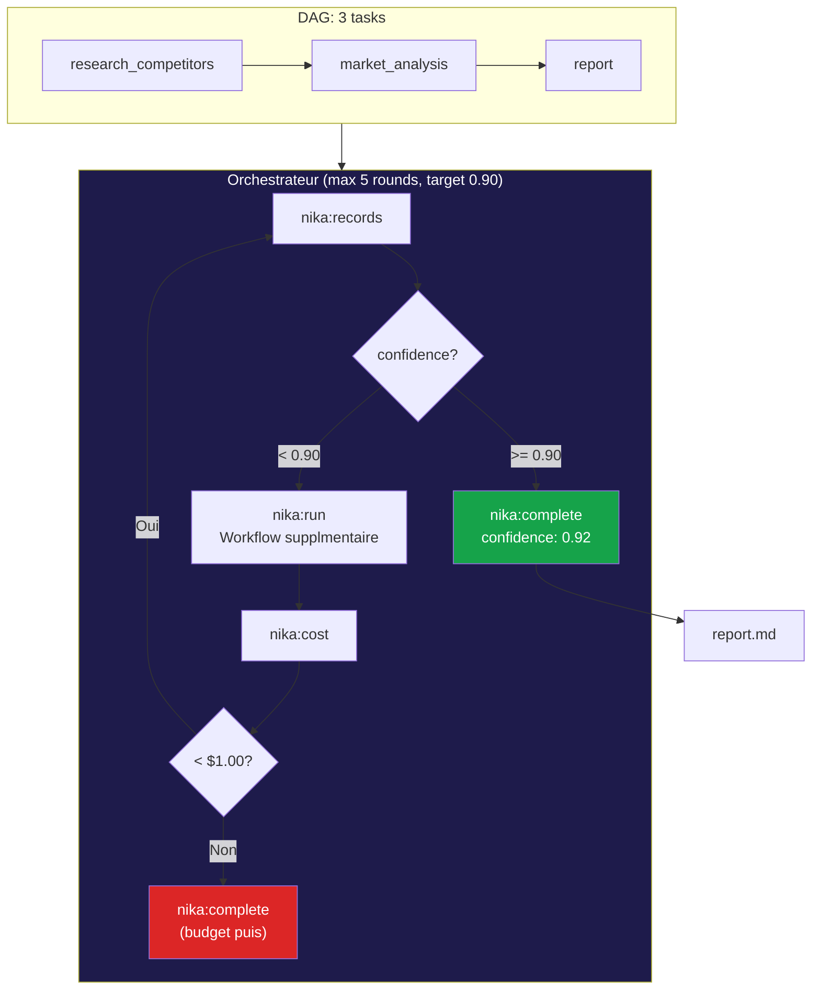
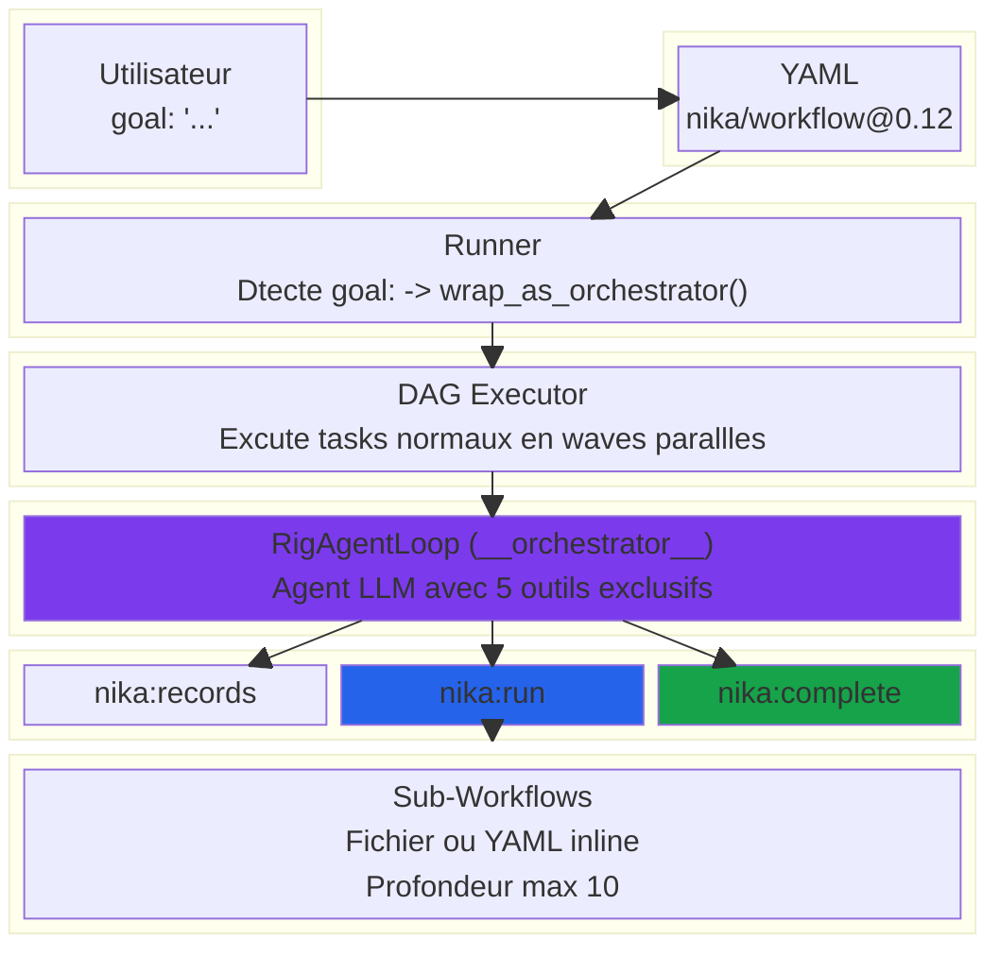
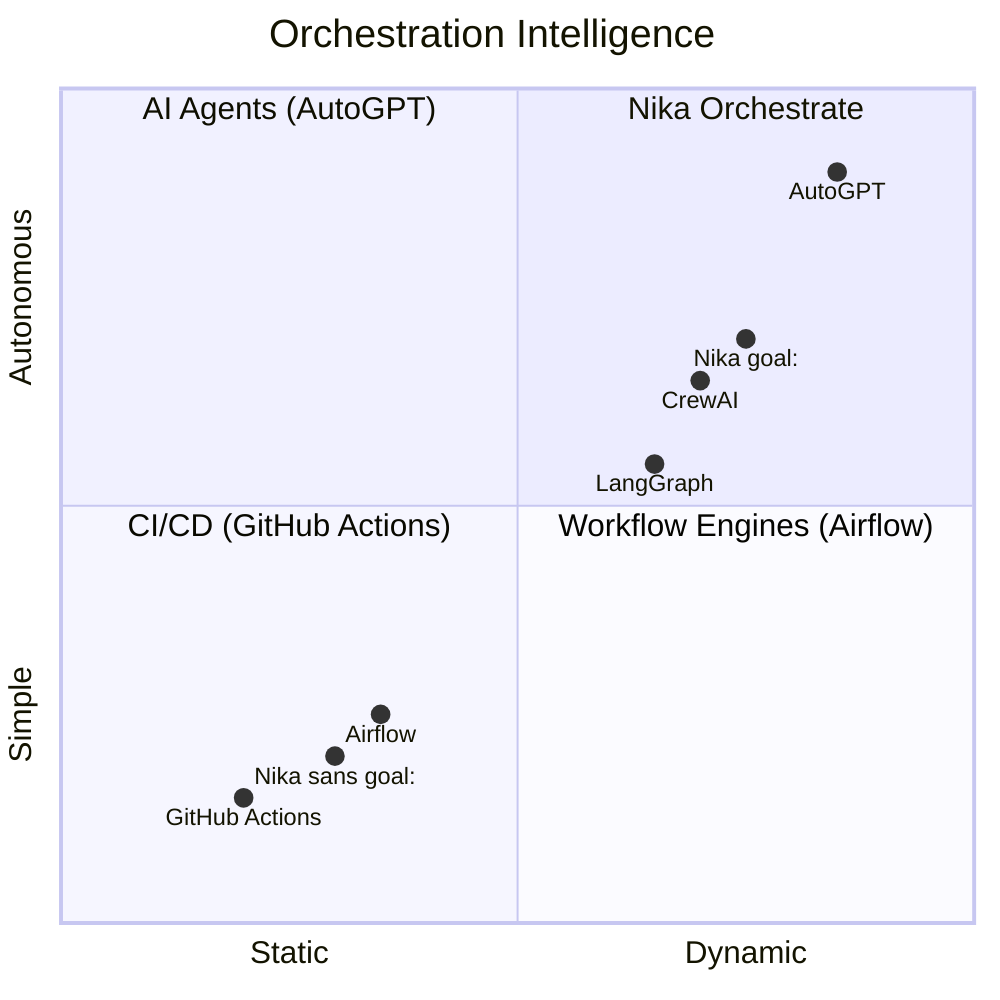
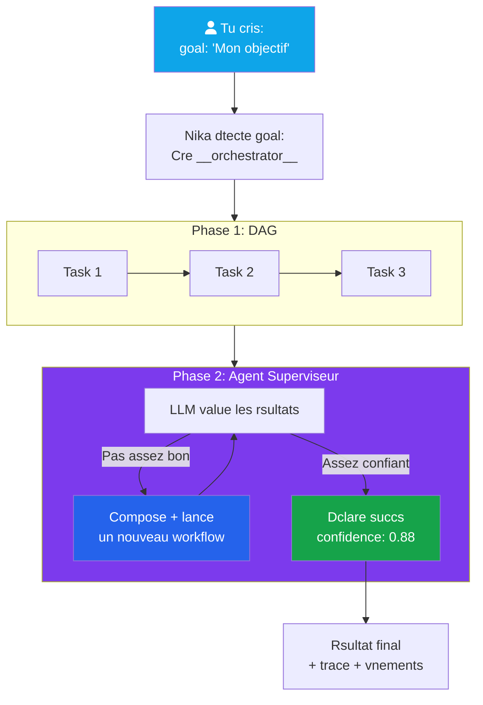

# Orchestrate Deep Dive — Guide Visuel

> Comment `goal:` transforme un workflow en agent superviseur autonome.

## 1. Le problme que ca rsout

### Sans orchestrate: workflow statique

```yaml
tasks:
  - id: research
    infer: "Recherche sur l'IA"
  - id: summarize
    depends_on: [research]
    infer: "Rsume: {{with.data}}"
```



**Problme:** Si le rsultat est mauvais, c'est fini. Pas de boucle, pas de rvaluation, pas d'adaptation.

### Avec orchestrate: workflow adaptatif

```yaml
goal: "Analyse complte du march IA"
orchestrate:
  max_rounds: 5
  confidence_target: 0.85

tasks:
  - id: research
    infer: "Recherche sur l'IA"
  - id: summarize
    depends_on: [research]
    infer: "Rsume: {{with.data}}"
```



---

## 2. Ce qui se passe sous le capot

Quand Nika voit `goal:` dans ton YAML, il fait **3 choses automatiquement**:

### tape 1: Wrapping (transparent)

```
Ton YAML                        Ce que Nika excute rellement
+---------------------------+    +---------------------------+
| goal: "Analyse IA"        |    | tasks:                    |
| tasks:                    | -> |   - id: research          |
|   - id: research          |    |   - id: summarize         |
|   - id: summarize         |    |   - id: __orchestrator__  |
+---------------------------+    |     agent:                 |
                                 |       tools: [records,     |
                                 |         cost, run,         |
                                 |         complete, log]     |
                                 |       depends_on: [ALL]    |
                                 +---------------------------+
```

### tape 2: System Prompt gnr

L'orchestrateur reoit un prompt automatique:

```
Tu es un orchestrateur de workflows. Ton objectif:

  "Analyse complte du march IA"

## Rsultats disponibles
- research: (description)
- summarize: (description)

## Instructions
1. Consulte les rsultats avec nika:records
2. value si l'objectif est atteint
3. Si insuffisant, lance nika:run pour des workflows supplmentaires
4. Surveille le budget avec nika:cost
5. Quand l'objectif est atteint, appelle nika:complete

## Seuil de Confiance
Ta confiance doit atteindre au moins 0.85 avant d'appeler nika:complete.
```

### tape 3: Boucle agentique



---

## 3. Les 5 outils de l'orchestrateur



### nika:records — "Qu'est-ce qui a t fait?"

```yaml
# L'orchestrateur appelle:
nika:records {}

# Rponse:
[
  {
    "task_id": "research",
    "summary": "5 concurrents identifis...",
    "confidence": 0.75,
    "compression_ratio": 0.03
  },
  {
    "task_id": "summarize",
    "summary": "Rsum de 500 mots...",
    "confidence": 0.80
  }
]
```

### nika:run — "Lance un workflow de plus"

**Option A: Fichier existant**
```yaml
nika:run {
  "workflow": "workflows/deep-research.nika.yaml"
}
```

**Option B: YAML gnr la vole** (le plus puissant)
```yaml
nika:run {
  "yaml_content": "
    schema: nika/workflow@0.12
    provider: anthropic
    model: claude-sonnet-4-20250514
    tasks:
      - id: deep_dive
        infer:
          prompt: Analyse approfondie des risques IA
          max_tokens: 2000
      - id: validate
        depends_on: [deep_dive]
        with: { data: $deep_dive }
        infer:
          prompt: Valide cette analyse: {{with.data}}
  "
}
```

L'agent LLM **compose du YAML dynamiquement** et l'excute. C'est du meta-programming agentique.

### nika:complete — "J'ai fini"

```yaml
nika:complete {
  "result": "Analyse complte: 5 concurrents, 3 opportunits...",
  "confidence": 0.88,
  "reasoning": "Research + analysis + validation complete"
}
```

### nika:cost — "Combien j'ai dpens?"

```yaml
nika:cost {}
# -> { total_cost_usd: 0.045, calls: 7, per_task: {...} }
```

---

## 4. Exemples concrets

### Exemple 1: Le plus simple — Goal sans orchestrate block

```yaml
schema: "nika/workflow@0.12"
provider: anthropic
model: claude-sonnet-4-20250514

goal: "Trouver et rsumer les 3 dernires news sur l'IA"

tasks:
  - id: search
    infer: "Liste les 3 dernires actualits majeures sur l'IA en mars 2026"

  - id: summarize
    depends_on: [search]
    with: { news: $search }
    infer: "Rsume chaque actualit en 2 phrases: {{with.news}}"
```

**Ce qui se passe:** L'orchestrateur value si `search` + `summarize` rpondent bien au goal. Si oui, il complte. Si non, il peut lancer des workflows supplmentaires.

### Exemple 2: Multi-source avec confidence

```yaml
schema: "nika/workflow@0.12"
provider: anthropic
model: claude-sonnet-4-20250514

goal: "Rapport complet sur le march des workflow engines IA"

orchestrate:
  max_rounds: 5
  confidence_target: 0.90
  max_cost_usd: 1.00

tasks:
  - id: research_competitors
    infer:
      prompt: "Identifie les 10 principaux workflow engines IA"
    structured:
      schema:
        type: object
        properties:
          competitors:
            type: array
            items:
              type: object
              properties:
                name: { type: string }
                category: { type: string }
                strengths: { type: array, items: { type: string } }
              required: [name, category]
        required: [competitors]

  - id: market_analysis
    depends_on: [research_competitors]
    with: { data: $research_competitors }
    infer:
      prompt: |
        Analyse de march base sur: {{with.data | to_json}}
        Identifie: taille du march, croissance, segments cls.

  - id: report
    depends_on: [market_analysis]
    with:
      competitors: $research_competitors
      analysis: $market_analysis
    infer:
      prompt: |
        Rdige un rapport professionnel:
        Concurrents: {{with.competitors | to_json}}
        Analyse: {{with.analysis}}
    artifact:
      path: report.md
      format: markdown
```



### Exemple 3: Orchestration avec fetch + agents

```yaml
schema: "nika/workflow@0.12"
provider: anthropic
model: claude-sonnet-4-20250514

goal: "Veille concurrentielle complte avec sources vrifies"

orchestrate:
  max_rounds: 8
  confidence_target: 0.85

tasks:
  # Phase 1: Collecte multi-source
  - id: scrape_blogs
    for_each: ["https://blog.langchain.dev", "https://docs.llamaindex.ai"]
    as: url
    concurrency: 2
    fetch:
      url: "{{with.url}}"
      extract: article

  - id: scrape_news
    fetch:
      url: "https://news.ycombinator.com"
      extract: links

  # Phase 2: Analyse
  - id: analyze
    depends_on: [scrape_blogs, scrape_news]
    with:
      blogs: $scrape_blogs
      news: $scrape_news
    agent:
      prompt: |
        Analyse ces donnes pour une veille concurrentielle:
        Blogs: {{with.blogs | to_json}}
        News: {{with.news | to_json}}
      tools: [nika:log]
      max_turns: 5

  # Phase 3: Rapport structur
  - id: report
    depends_on: [analyze]
    with: { analysis: $analyze }
    infer:
      prompt: "Rapport de veille bas sur: {{with.analysis}}"
    artifact:
      path: veille-report.md
```

---

## 5. Architecture: les couches



---

## 6. Ce qui est intelligent vs ce qui ne l'est pas

### Intelligent

| Aspect | Comment |
|--------|---------|
| **Self-assessment** | Le LLM value sa propre confidence — pas de mtriques hardcodes |
| **Workflow composition** | Peut GNRER du YAML et l'excuter — meta-programming agentique |
| **Cost awareness** | Peut checker son budget en temps rel et dcider de s'arrter |
| **Depth control** | Rcursion limite  10 niveaux — pas de boucle infinie |
| **Explicit completion** | Doit activement dclarer "fini" — pas de faux positifs |

### Pas (encore) intelligent

| Aspect | Limite actuelle |
|--------|-----------------|
| **Confidence = LLM honor system** | Pas de validation objective — le LLM peut mentir sur sa confidence |
| **Pas de routing automatique** | Le routing `when: confidence < 0.3` est dans le YAML mais pas encore wired dans le runner |
| **Pas d'accs fichiers/MCP** | L'orchestrateur ne peut QU'orchestrer, pas agir directement |
| **Records compresss** | L'orchestrateur voit des rsums, pas les outputs bruts |
| **max_tokens(8192) hardcod** | Bug connu — les agents ignorent la config max_tokens |

---

## 7. Comparaison avec d'autres systmes



**Nika se positionne entre:**
- Les workflow engines classiques (statiques, dterministes)
- Les agents autonomes (trop libres, pas de structure)

C'est un **DAG dterministe + agent superviseur** — le meilleur des deux mondes.

---

## 8. vnements mis (observabilit)

```mermaid
timeline
    title Timeline d'une excution orchestre
    section Phase 1 : Tasks
        WorkflowStarted : goal dtect, 3 tasks
        TaskStarted : research
        ProviderResponded : 1200 tokens
        TaskCompleted : research OK
        TaskStarted : analyze
        TaskCompleted : analyze OK
        TaskStarted : report
        TaskCompleted : report OK
    section Phase 2 : Orchestration
        OrchestratorStarted : goal, max_rounds=5
        AgentStart : __orchestrator__
        AgentTurn : nika:records
        AgentTurn : nika:cost
        OrchestratorSubWorkflow : round 1
        AgentTurn : nika:run (YAML inline)
        AgentTurn : nika:records (re-check)
        OrchestratorRound : round 1 complete
        AgentTurn : nika:complete
    section Fin
        OrchestratorCompleted : rounds=1, confidence=0.88
        WorkflowCompleted : succs
```

---

## 9. Limites et garde-fous

| Paramtre | Dfaut | Min | Max | Effet |
|-----------|--------|-----|-----|-------|
| `max_rounds` | 10 | 1 | - | Nombre de cycles orchestrateur |
| `confidence_target` | 0.85 | 0.0 | 1.0 | Seuil d'auto-valuation |
| `max_cost_usd` | illimit | - | - | Budget en dollars |
| `max_duration_secs` | 3600 | 1 | 604,800 | Timeout global |
| Profondeur nika:run | - | 1 | 10 | Rcursion max |

**Scurit:**
- L'orchestrateur n'a PAS d'accs fichiers (pas de `nika:write`, `nika:read`)
- L'orchestrateur n'a PAS d'accs MCP (pas de requtes Neo4j, etc.)
- Le YAML gnr est valid avant excution
- `kill_on_drop` + CancellationToken pour l'arrt immdiat

---

## 10. Rsum en une image



**En une phrase:** `goal:` transforme ton workflow en un agent qui excute tes tasks, value les rsultats, et relance des workflows jusqu' satisfaction.
