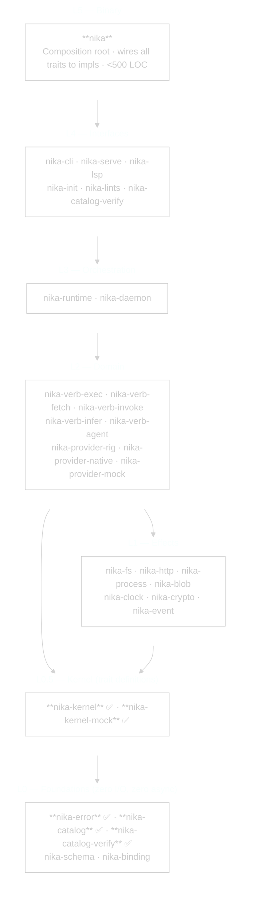
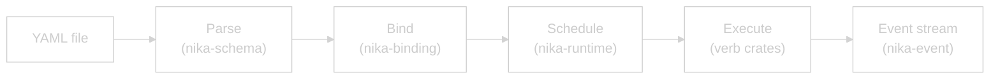

Nika is a single Rust binary composed of ~40 crates. Each crate has one job.
Together they form an engine that parses `.nika.yaml` workflows,
executes them across providers, and emits a structured event stream.

## The seven layers



<Note>
  **Strict downward dependencies only.** No crate at layer N may import from layer N+1 or above.
  Enforced at compile time by `cargo-deny`. Violations block CI.
</Note>

## Layer rules

| Layer | Rule | Max LOC |
|---|---|---|
| **L0 — Foundations** | Zero I/O, zero async, pure data and logic | 15k / crate |
| **L0.5 — Kernel** | Trait definitions only — no implementations | 15k / crate |
| **L1 — Effects** | One I/O trait impl each (fs, http, process…) | 15k / crate |
| **L2 — Domain** | Verb executors, provider impls, service crates | 15k / crate |
| **L3 — Orchestration** | DAG scheduler, daemon, runtime | 15k / crate |
| **L4 — Interfaces** | CLI, LSP, HTTP API, CI tools | 15k / crate |
| **L5 — Binary** | Composition root only — wires traits to impls | 500 |

## The five verbs

Every workflow task uses exactly one verb.

| Verb | What it does | Example use case |
|---|---|---|
| **`exec`** | Run a local shell command | `git clone`, `cargo build`, test runner |
| **`fetch`** | HTTP / URL / file / GitHub | Call an API, download a file, scrape a page |
| **`invoke`** | Call a built-in or MCP tool | 63 built-ins, any MCP-compliant server |
| **`infer`** | LLM inference | Anthropic, OpenAI, Google, Groq, local GGUF |
| **`agent`** | Multi-turn loop with tools | ReAct-style agent with budget + guardrails |

Five verbs, closed set. See [Verbs](/concepts/verbs) for the full spec.

## The kernel traits

The kernel (`nika-kernel`) defines the interfaces that everything else implements.
No crate above L0.5 calls concrete types — only traits.

```rust
// nika-kernel/src/shell.rs
pub trait ShellExecutor: Send + Sync {
    async fn run(&self, cmd: ShellCommand) -> Result<ShellOutput, NikaError>;
}

// nika-kernel/src/provider.rs
pub trait InferProvider: Send + Sync {
    async fn infer(&self, req: InferRequest) -> Result<InferResponse, NikaError>;
}

// nika-kernel/src/memory.rs
pub trait MemoryStore: Send + Sync {
    async fn remember(&self, frame: MemoryFrame) -> Result<MemoryId, NikaError>;
    async fn recall(&self, query: RecallQuery) -> Result<Vec<MemoryFrame>, NikaError>;
}
```

`nika-kernel-mock` provides test doubles for all traits — deterministic,
zero I/O, usable in any `#[test]` without network or filesystem.

## The schema pipeline

A `.nika.yaml` file goes through four stages before execution:



1. **Parse** — YAML to typed AST, taint annotations applied
2. **Bind** — template expressions resolved against typed scope
3. **Schedule** — DAG built, topological sort, parallelism computed
4. **Execute** — verb crates call kernel trait impls
5. **Emit** — every action produces a typed `EventKind` to the NDJSON stream

## Data flow example

```yaml
tasks:
  - id: fetch_issue
    fetch:
      url: https://api.github.com/repos/supernovae-st/nika/issues/42

  - id: summarize
    depends_on: [fetch_issue]
    with:
      issue: $fetch_issue
    infer:
      provider: anthropic
      prompt: |
        Summarize in one sentence:
        Title: {{with.issue.title}}
        Body:  {{with.issue.body}}
```

`$fetch_issue` is a binding. Nika resolves it at runtime with full type awareness,
including taint tracking: output from `fetch` is untrusted by default.
Passing tainted data to `exec.command` without sanitization raises `NIKA-053`.

## Events

Every verb emits a structured stream of events — one JSON object per line:

```bash
nika run workflow.nika.yaml --events ndjson
```

```json
{"ts":"T+00:00:00.00","kind":"workflow_start","workflow":"hello"}
{"ts":"T+00:00:00.05","kind":"task_start","task":"summarize","verb":"infer"}
{"ts":"T+00:00:01.42","kind":"task_complete","task":"summarize","status":"ok"}
{"ts":"T+00:00:01.43","kind":"workflow_complete","status":"ok"}
```

See [Events](/concepts/events) for the full event catalog.

## Build model

Each crate is admitted through a 12-gate process:

<Steps>
  <Step title="SPEC">
    `docs/crate-specs/nika-X.md` — purpose, layer, LOC budget, public API surface
  </Step>
  <Step title="TDD">
    Tests written before implementation. RED before GREEN. No skipping.
  </Step>
  <Step title="IMPL">
    Minimal implementation. Compiles. All tests pass. Zero `# TEMP` without removal plan.
  </Step>
  <Step title="CLIPPY 0">
    `cargo clippy --workspace --all-targets -- -D warnings`. Zero tolerance.
  </Step>
  <Step title="MUTATION ≥ 90%">
    `cargo mutants -p nika-X`. 90% of mutants killed or the crate doesn't land.
  </Step>
  <Step title="PROPERTY">
    `proptest` for security-sensitive paths, parsers, and encoding.
  </Step>
  <Step title="BENCHMARKS">
    `criterion` benchmarks for hot paths.
  </Step>
  <Step title="DOCS">
    `cargo doc --no-deps` — zero warnings, all public items documented.
  </Step>
  <Step title="CANARY E2E">
    `tests/canary-X.nika.yaml` passes end-to-end (or documented exemption).
  </Step>
  <Step title="PARITY">
    Golden test vs legacy output. No regression.
  </Step>
  <Step title="REVIEW SWARM">
    3 parallel review agents: architecture + Rust + feature. P0/P1 fixed same session.
  </Step>
  <Step title="ATOMIC COMMIT">
    One crate = one commit. `feat(nika-X): admit to workspace — all 12 gates passed`
  </Step>
</Steps>

## Read next

<CardGroup cols={2}>
  <Card title="The five verbs" icon="code" href="/concepts/verbs">
    exec · fetch · invoke · infer · agent
  </Card>
  <Card title="Providers" icon="cloud" href="/concepts/providers">
    9 inference providers behind one interface
  </Card>
  <Card title="Events" icon="signal" href="/concepts/events">
    The NDJSON event stream
  </Card>
  <Card title="Crate constellation" icon="diagram-project" href="/reference/constellation">
    Full visual map of all 40 crates
  </Card>
</CardGroup>
