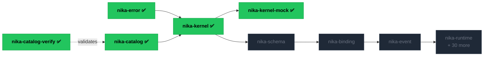

<Note>
  Nika is in active development — **5 of 40 crates admitted** as of April 2026.
  Each crate passes [12 gates](/reference/crates#the-12-gates) before landing in the workspace.
  The engine is usable today; v0.90 marks the complete architecture.
</Note>

## What Nika is

A workflow engine that reads `.nika.yaml` files and executes them as AI pipelines.
Five verbs (`exec`, `fetch`, `invoke`, `infer`, `agent`), nine providers (Anthropic, OpenAI,
Google, Mistral, Groq, DeepSeek, xAI, Ollama, local GGUF), 63 built-in tools.

```yaml
schema: nika/workflow@0.12
workflow: hello

tasks:
  - id: greet
    infer:
      provider: anthropic
      model: claude-sonnet-4-20250514
      prompt: "Summarize the Rust programming language in one sentence."
```

```bash
nika run hello.nika.yaml
```

## What Nika is not

- **Not an agent framework.** No abstractions over agent loops you can't read.
- **Not a chatbot wrapper.** No conversation state hidden in vendor APIs.
- **Not another SDK.** The YAML file *is* the interface.
- **Not a SaaS.** AGPL means the source travels with the binary.

## Why YAML

Because the same file is read by the machine and understood by the human.
No DSL, no Python-pretending-to-be-config, no JavaScript callbacks scattered across nodes.
The schema is the contract.

## Why Rust

Because workflows fail in production, and a single binary with zero runtime
dependencies fails predictably. Because the engine must be auditable, line by line.
Because mutation testing ≥ 90% per crate is not negotiable.

## Build progress

Nika Diamond — ~40 crates, rewritten from scratch, one at a time.



<small>✅ = admitted (all 12 gates green) · gray = planned · ~40 crates total targeting v0.90</small>

See the [full crate constellation](/reference/constellation) for all 40 crates and their dependencies.

## Read next

<CardGroup cols={2}>
  <Card title="Install Nika" icon="download" href="/getting-started/installation">
    One curl command. Single binary, zero daemon.
  </Card>
  <Card title="Your first workflow" icon="play" href="/getting-started/first-workflow">
    Run a workflow in five minutes.
  </Card>
  <Card title="Architecture" icon="layer-group" href="/concepts/architecture">
    The seven layers. How 40 crates fit together.
  </Card>
  <Card title="Crate constellation" icon="diagram-project" href="/reference/constellation">
    Visual map of the full build — admitted, in-progress, planned.
  </Card>
</CardGroup>
