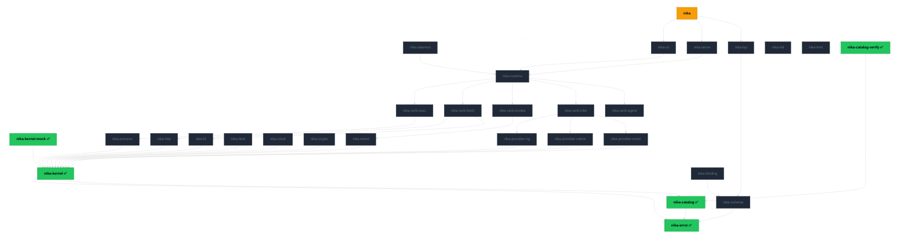
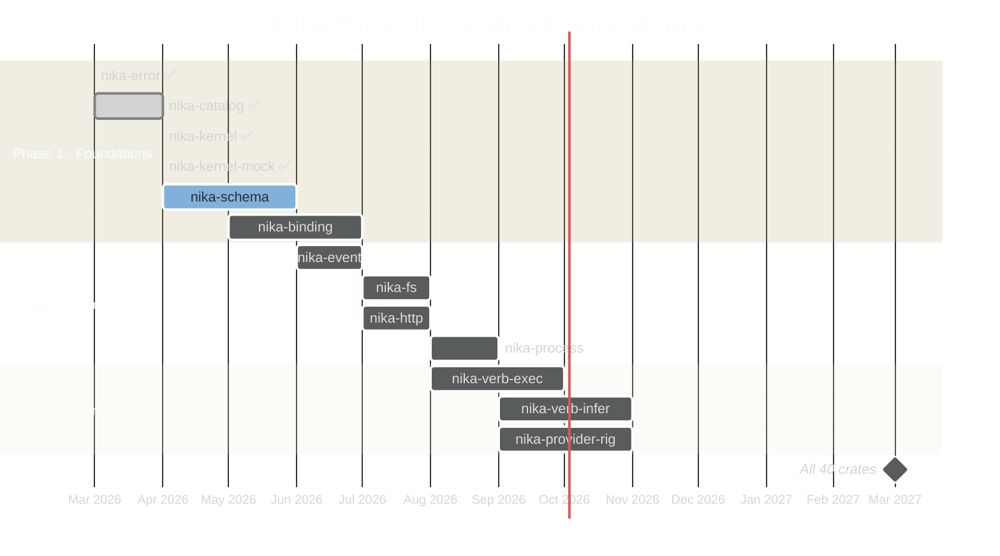

Nika Diamond is a ~40-crate Rust workspace built layer by layer.
Each crate is admitted through [12 gates](/concepts/architecture#build-model) before joining the workspace.
This page tracks the full constellation — admitted, in-progress, and planned.

<Note>
  **Current status (April 2026):** 5 of ~40 crates admitted.
  11,383 src LOC · 385 tests · 0 `.unwrap()` in `src/` · 0 clippy warnings.
  See [Build status →](/reference/status) for live phase progress.
</Note>

## Full dependency graph

<small>**Green** = admitted (all 12 gates passed) · **Gray** = planned · **Amber** = binary composition root</small>

## Admitted crates (5 / ~40)

| Crate | Layer | LOC | Tests | Gate |
|---|---|---|---|---|
| **nika-error** | L0 | 1,013 | 44 | ✅ All 12 |
| **nika-catalog** | L0 | 3,741 | 138 | ✅ All 12 |
| **nika-catalog-verify** | L4 | 600 | 9 | ✅ All 12 |
| **nika-kernel** | L0.5 | 3,375 | 99 | ✅ All 12 |
| **nika-kernel-mock** | L0.5 | 1,705 | 88 | ✅ All 12 |

**Total admitted:** 11,383 LOC · 385 tests · 100% mutation tested

## Next to build

| Crate | Layer | Est. LOC | Priority |
|---|---|---|---|
| **nika-schema** | L0 | ~12,000 | Phase 1 — next |
| **nika-binding** | L0 | ~8,000 | Phase 1 |
| **nika-event** | L1 | ~3,000 | Phase 2 |
| **nika-fs** | L1 | ~2,000 | Phase 2 |
| **nika-http** | L1 | ~2,500 | Phase 2 |
| **nika-process** | L1 | ~2,000 | Phase 2 |

## Phase roadmap

## The 12 gates

Every crate must pass all 12 gates in the same commit before being added to `Cargo.toml [workspace.members]`.

| # | Gate | Tool |
|---|---|---|
| 1 | **SPEC** | `docs/crate-specs/nika-X.md` — purpose, layer, LOC budget, public API |
| 2 | **TDD** | Tests written before implementation (RED → GREEN) |
| 3 | **IMPL** | Compiles, tests pass, no `# TEMP` without removal plan |
| 4 | **CLIPPY 0** | `cargo clippy --workspace --all-targets -- -D warnings` |
| 5 | **MUTATION ≥ 90%** | `cargo mutants -p nika-X` |
| 6 | **PROPERTY** | `proptest` for parsers, security-sensitive paths |
| 7 | **BENCHMARKS** | `criterion` for hot paths |
| 8 | **DOCS** | `cargo doc --no-deps` — 0 warnings, all pub items documented |
| 9 | **CANARY E2E** | `tests/canary-X.nika.yaml` passes end-to-end |
| 10 | **PARITY** | Golden test vs legacy output — no regression |
| 11 | **REVIEW SWARM** | 3 parallel agents: architecture + Rust + feature |
| 12 | **ATOMIC COMMIT** | 1 crate = 1 commit |

No exceptions. Gate exemptions require a written justification in the crate spec.
