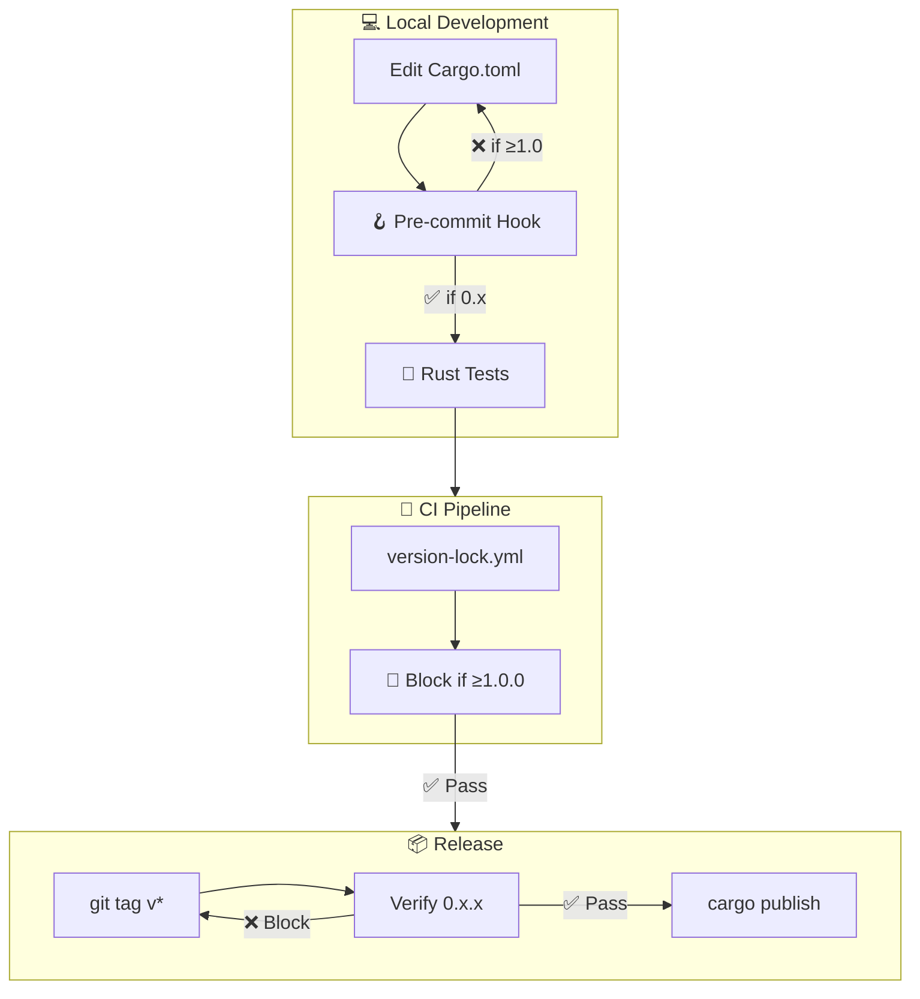
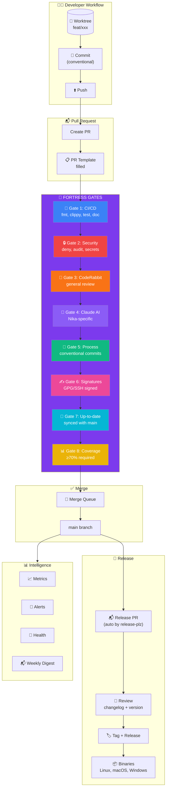
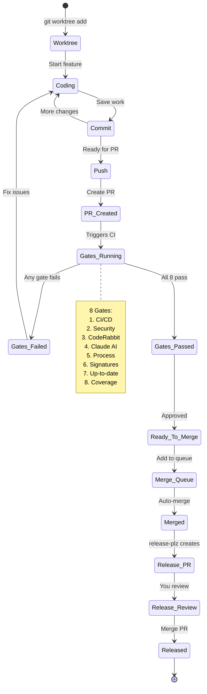
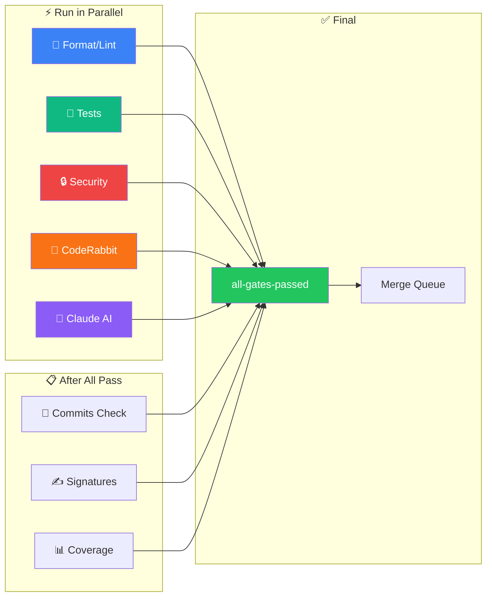
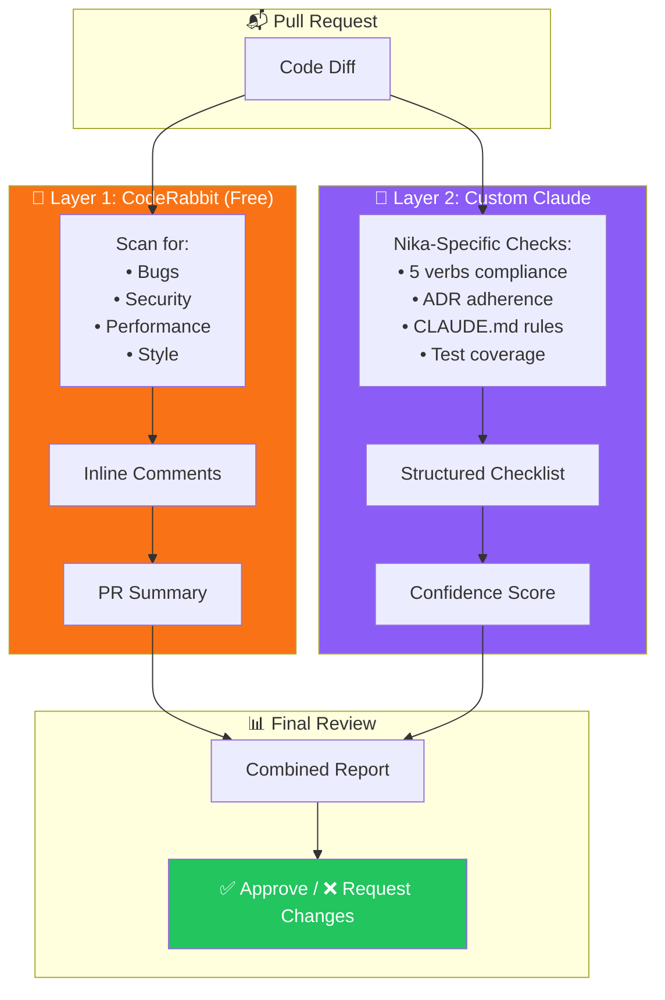
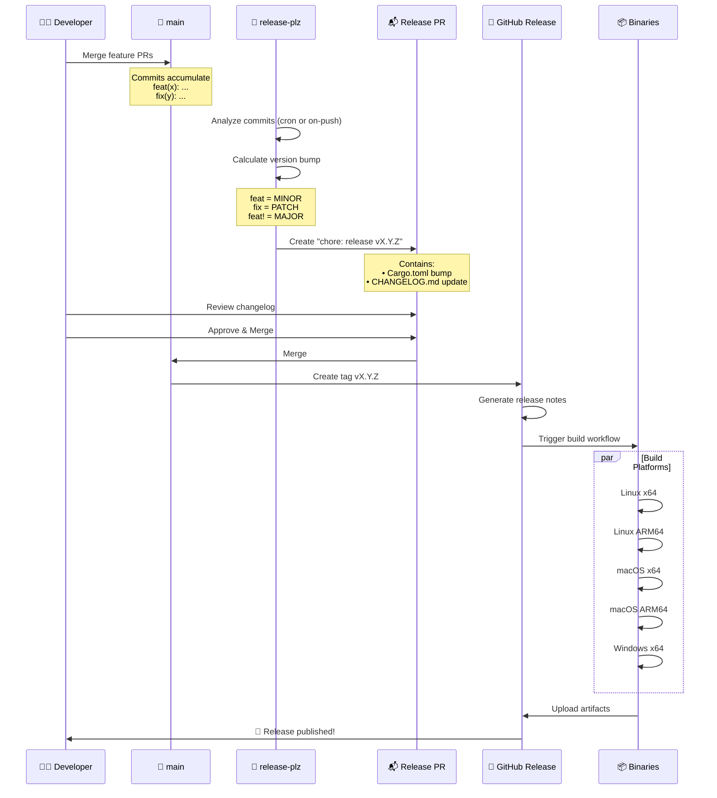
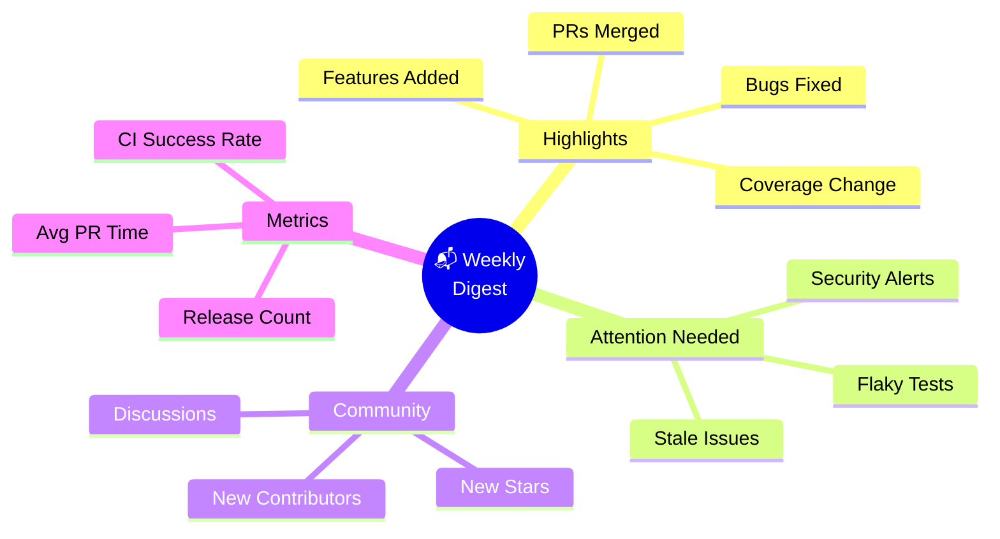
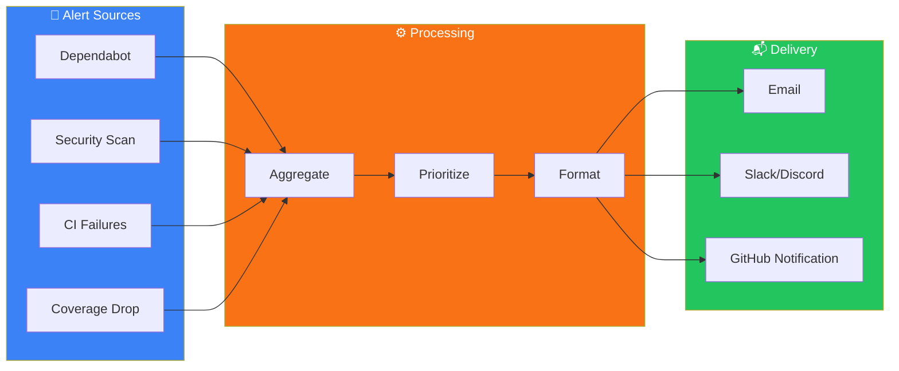
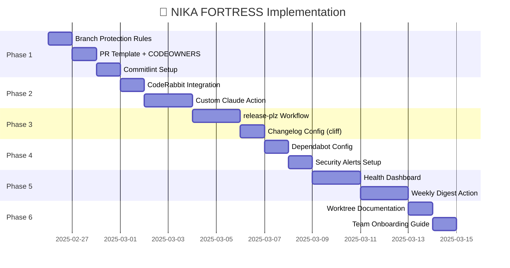

# Nika FORTRESS — Open Source Automation Design

> **Version:** 0.1.0 | **Date:** 2025-02-25 | **Status:** Draft
> **Author:** Thibaut Melen + Claude Opus 4.5

---

<div align="center">

```
╔═══════════════════════════════════════════════════════════════════════════════════════════╗
║                                                                                           ║
║     ███╗   ██╗██╗██╗  ██╗ █████╗     ███████╗ ██████╗ ██████╗ ████████╗██████╗ ███████╗  ║
║     ████╗  ██║██║██║ ██╔╝██╔══██╗    ██╔════╝██╔═══██╗██╔══██╗╚══██╔══╝██╔══██╗██╔════╝  ║
║     ██╔██╗ ██║██║█████╔╝ ███████║    █████╗  ██║   ██║██████╔╝   ██║   ██████╔╝█████╗    ║
║     ██║╚██╗██║██║██╔═██╗ ██╔══██║    ██╔══╝  ██║   ██║██╔══██╗   ██║   ██╔══██╗██╔══╝    ║
║     ██║ ╚████║██║██║  ██╗██║  ██║    ██║     ╚██████╔╝██║  ██║   ██║   ██║  ██║███████╗  ║
║     ╚═╝  ╚═══╝╚═╝╚═╝  ╚═╝╚═╝  ╚═╝    ╚═╝      ╚═════╝ ╚═╝  ╚═╝   ╚═╝   ╚═╝  ╚═╝╚══════╝  ║
║                                                                                           ║
║                    🏰 Maximum Protection for Solo Maintainers 🏰                          ║
║                                                                                           ║
╚═══════════════════════════════════════════════════════════════════════════════════════════╝
```

[](.)
[](.)
[](.)

</div>

---

## Table of Contents

- [Executive Summary](#executive-summary)
- [Architecture Overview](#architecture-overview)
- [The 8 Gates](#the-8-gates)
- [AI Review Stack](#ai-review-stack)
- [Release Automation](#release-automation)
- [Intelligence Layer](#intelligence-layer)
- [Implementation Phases](#implementation-phases)
- [File Reference](#file-reference)

---

## Executive Summary

### The Problem

```
┌─────────────────────────────────────────────────────────────────────────────────┐
│  😰 SOLO MAINTAINER PAIN POINTS                                                 │
├─────────────────────────────────────────────────────────────────────────────────┤
│                                                                                 │
│  ❌ Manual releases         → Forget to bump version, changelog errors         │
│  ❌ Low-quality PRs         → External contributors skip tests/docs            │
│  ❌ Fast merging risks      → Broken code slips through when rushing           │
│  ❌ No time for review      → Can't manually check everything                  │
│  ❌ Security blind spots    → CVEs in deps go unnoticed                        │
│  ❌ No project visibility   → Don't know how project is doing                  │
│                                                                                 │
└─────────────────────────────────────────────────────────────────────────────────┘
```

### The Solution

```
┌─────────────────────────────────────────────────────────────────────────────────┐
│  🏰 NIKA FORTRESS                                                               │
├─────────────────────────────────────────────────────────────────────────────────┤
│                                                                                 │
│  ✅ Semi-auto releases      → PR-based with changelog review                   │
│  ✅ 10 mandatory gates      → Nothing merges without passing ALL               │
│  ✅ Dual AI review          → CodeRabbit + Custom Claude                       │
│  ✅ Security scanning       → cargo-deny, cargo-audit, secrets                 │
│  ✅ Full intelligence       → Metrics, alerts, health, weekly digest           │
│  ✅ Worktree workflow       → Feature branches, main always clean              │
│  ✅ Version lock            → 0.x.x forever (NEVER 1.0.0)                      │
│  ✅ Claude Code hooks       → Pre-commit, session start, tool guards           │
│                                                                                 │
└─────────────────────────────────────────────────────────────────────────────────┘
```

---

## 🔒 Version Lock System (0.xx.xx Forever)

### Philosophy

**Nika will NEVER be version 1.0.0.** This is not a sign of immaturity — it's a deliberate choice:

```
╔═══════════════════════════════════════════════════════════════════════════════╗
║  🔒 VERSION LOCK POLICY                                                        ║
╠═══════════════════════════════════════════════════════════════════════════════╣
║                                                                                ║
║  ❌ Version 1.0.0          → BLOCKED FOREVER                                   ║
║  ✅ Valid versions         → 0.0.1 through 0.99.99                            ║
║  ✅ Breaking changes       → Bump minor (0.9.0 → 0.10.0)                      ║
║  ✅ New features           → Bump minor (0.9.0 → 0.10.0)                      ║
║  ✅ Bug fixes              → Bump patch (0.9.0 → 0.9.1)                       ║
║                                                                                ║
║  Rationale:                                                                    ║
║  • Perpetual beta = continuous evolution mindset                              ║
║  • No "done" mentality — always improving                                     ║
║  • SemVer 0.x.y allows breaking changes without drama                         ║
║  • Follows Rust ecosystem norms (many crates stay 0.x forever)                ║
║                                                                                ║
╚═══════════════════════════════════════════════════════════════════════════════╝
```

### Enforcement Architecture



### CI Workflow

```yaml
# .github/workflows/version-lock.yml
name: 🔒 Version Lock

on:
  push:
    tags: ['v*']
  pull_request:
    paths:
      - '**/Cargo.toml'
      - '**/Cargo.lock'

jobs:
  enforce-zero-version:
    name: Enforce 0.x.x Forever
    runs-on: ubuntu-latest
    steps:
      - uses: actions/checkout@v4

      - name: 📦 Extract version from Cargo.toml
        id: cargo
        run: |
          VERSION=$(grep '^version = ' Cargo.toml | head -1 | sed 's/version = "\(.*\)"/\1/')
          echo "version=$VERSION" >> $GITHUB_OUTPUT
          echo "📦 Found version: $VERSION"

      - name: 🔒 Enforce 0.x.x version
        run: |
          VERSION="${{ steps.cargo.outputs.version }}"

          # Extract major version
          MAJOR=$(echo "$VERSION" | cut -d. -f1)

          if [ "$MAJOR" != "0" ]; then
            echo "::error file=Cargo.toml::❌ VERSION LOCK VIOLATION!"
            echo "::error::Nika must NEVER be version 1.0.0 or higher."
            echo "::error::Found: $VERSION (major=$MAJOR)"
            echo "::error::This is by design. See docs/plans/2025-02-25-nika-fortress-design.md"
            exit 1
          fi

          echo "✅ Version $VERSION is valid (0.x.x series)"

      - name: 🏷️ Validate tag matches version (on tag push)
        if: github.event_name == 'push' && startsWith(github.ref, 'refs/tags/')
        run: |
          TAG="${GITHUB_REF#refs/tags/}"
          VERSION="v${{ steps.cargo.outputs.version }}"

          if [ "$TAG" != "$VERSION" ]; then
            echo "::error::Tag $TAG doesn't match Cargo.toml version $VERSION"
            exit 1
          fi

          echo "✅ Tag $TAG matches Cargo.toml version"
```

### Pre-commit Hook

```bash
#!/bin/bash
# .git/hooks/pre-commit (or via .husky/pre-commit)

# 🔒 VERSION LOCK CHECK
# Nika must NEVER be version 1.0.0 or higher

VERSION=$(grep '^version = ' Cargo.toml | head -1 | sed 's/version = "\(.*\)"/\1/')
MAJOR=$(echo "$VERSION" | cut -d. -f1)

if [ "$MAJOR" != "0" ]; then
    echo ""
    echo "╔═══════════════════════════════════════════════════════════════════════════════╗"
    echo "║  🚫 VERSION LOCK VIOLATION                                                    ║"
    echo "╠═══════════════════════════════════════════════════════════════════════════════╣"
    echo "║                                                                               ║"
    echo "║  Nika version MUST remain in 0.x.x series FOREVER.                           ║"
    echo "║                                                                               ║"
    echo "║  Found: $VERSION                                                              "
    echo "║  Expected: 0.x.x                                                              ║"
    echo "║                                                                               ║"
    echo "║  This is by design, not a bug.                                               ║"
    echo "║  See: docs/plans/2025-02-25-nika-fortress-design.md                          ║"
    echo "║                                                                               ║"
    echo "╚═══════════════════════════════════════════════════════════════════════════════╝"
    echo ""
    exit 1
fi

echo "🔒 Version lock: $VERSION ✅"
```

### Rust Tests

```rust
// tests/version_lock_test.rs
//! 🔒 Version Lock Enforcement Tests
//!
//! These tests ensure Nika NEVER reaches version 1.0.0.
//! This is a deliberate design decision, not a bug.

use std::fs;

/// The one and only source of truth for version
const CARGO_TOML: &str = "Cargo.toml";

#[test]
fn version_must_be_zero_major() {
    let content = fs::read_to_string(CARGO_TOML)
        .expect("Failed to read Cargo.toml");

    let version_line = content
        .lines()
        .find(|line| line.starts_with("version = "))
        .expect("No version found in Cargo.toml");

    let version = version_line
        .trim_start_matches("version = ")
        .trim_matches('"');

    assert!(
        version.starts_with("0."),
        "🔒 VERSION LOCK VIOLATION!\n\
         Nika must NEVER be version 1.0.0 or higher.\n\
         Found: {}\n\
         Expected: 0.x.x\n\
         This is by design. See docs/plans/2025-02-25-nika-fortress-design.md",
        version
    );
}

#[test]
fn version_follows_semver() {
    let content = fs::read_to_string(CARGO_TOML)
        .expect("Failed to read Cargo.toml");

    let version_line = content
        .lines()
        .find(|line| line.starts_with("version = "))
        .expect("No version found");

    let version = version_line
        .trim_start_matches("version = ")
        .trim_matches('"');

    let parts: Vec<&str> = version.split('.').collect();
    assert_eq!(parts.len(), 3, "Version must be MAJOR.MINOR.PATCH, got: {}", version);

    for (i, part) in parts.iter().enumerate() {
        part.parse::<u32>().expect(&format!(
            "Version part {} ('{}') must be a number in: {}",
            i, part, version
        ));
    }
}

#[test]
fn version_not_zero_zero_zero() {
    let content = fs::read_to_string(CARGO_TOML)
        .expect("Failed to read Cargo.toml");

    let version_line = content
        .lines()
        .find(|line| line.starts_with("version = "))
        .expect("No version found");

    let version = version_line
        .trim_start_matches("version = ")
        .trim_matches('"');

    assert_ne!(
        version, "0.0.0",
        "Version 0.0.0 is not allowed (must be at least 0.0.1)"
    );
}
```

---

## 🧩 Claude Code Integration

### Skills Architecture

FORTRESS provides 4 slash commands via Claude Code skills:

```
┌─────────────────────────────────────────────────────────────────────────────────┐
│  🧩 FORTRESS SKILLS                                                             │
├─────────────────────────────────────────────────────────────────────────────────┤
│                                                                                 │
│  /fortress-check      Run all quality gates locally before pushing             │
│  /fortress-release    Prepare release following FORTRESS protocol              │
│  /fortress-worktree   Create isolated git worktree for feature                 │
│  /fortress-status     Show current FORTRESS compliance status                  │
│                                                                                 │
│  Location: nika/.claude/skills/fortress/                                       │
│                                                                                 │
└─────────────────────────────────────────────────────────────────────────────────┘
```

### /fortress-check Skill

```markdown
<!-- nika/.claude/skills/fortress/fortress-check.md -->
---
name: fortress-check
description: Run all FORTRESS quality gates locally before pushing
---

# FORTRESS Check

Run the complete FORTRESS quality gate suite locally.

## Execution Steps

1. **Format Check**
   ```bash
   cargo fmt --check
   ```

2. **Lint Check**
   ```bash
   cargo clippy -- -D warnings
   ```

3. **Test Suite**
   ```bash
   cargo nextest run
   ```

4. **Security Audit**
   ```bash
   cargo audit
   cargo deny check
   ```

5. **Version Lock**
   ```bash
   # Verify version is 0.x.x
   VERSION=$(grep '^version = ' Cargo.toml | head -1 | sed 's/version = "\(.*\)"/\1/')
   [[ "$VERSION" == 0.* ]] || exit 1
   ```

6. **Documentation**
   ```bash
   cargo doc --no-deps
   ```

## Output Format

```
╔═══════════════════════════════════════════════════════════════════════════════╗
║  🏰 FORTRESS CHECK RESULTS                                                     ║
╠═══════════════════════════════════════════════════════════════════════════════╣
║                                                                                ║
║  ✅ Gate 1: Format        passed (cargo fmt --check)                          ║
║  ✅ Gate 2: Lint          passed (clippy -D warnings)                         ║
║  ✅ Gate 3: Tests         2,793 passed, 0 failed                              ║
║  ✅ Gate 4: Security      no vulnerabilities                                  ║
║  ✅ Gate 5: Version Lock  0.9.0 ✓                                             ║
║  ✅ Gate 6: Docs          generated successfully                              ║
║                                                                                ║
║  Result: ALL GATES PASSED ✅                                                   ║
║                                                                                ║
╚═══════════════════════════════════════════════════════════════════════════════╝
```
```

### Hooks Configuration

```json
// nika/.claude/settings.json
{
  "hooks": {
    "PreToolUse": [
      {
        "matcher": "Bash",
        "command": "bash -c 'if echo \"$TOOL_INPUT\" | grep -qE \"git (push|tag).*v[1-9]\\\\.\"; then echo \"🚫 BLOCKED: Cannot push version ≥1.0.0\" && exit 1; fi'"
      },
      {
        "matcher": "Bash",
        "command": "bash -c 'if echo \"$TOOL_INPUT\" | grep -qE \"cargo publish\"; then echo \"⚠️ Release requires /fortress-release skill\" && exit 0; fi'"
      }
    ],
    "PostToolUse": [
      {
        "matcher": "Edit",
        "command": "bash -c 'if echo \"$TOOL_INPUT\" | grep -q \"Cargo.toml\"; then VERSION=$(grep \"^version = \" Cargo.toml | head -1 | sed \"s/version = \\\"\\(.*\\)\\\"/\\1/\"); [[ \"$VERSION\" == 0.* ]] || (echo \"🔒 Version lock violation: $VERSION\" && exit 1); fi'"
      }
    ],
    "SessionStart": [
      {
        "command": "echo '🏰 FORTRESS Mode Active | Version Lock: 0.x.x Forever | /fortress-check to validate'"
      }
    ]
  }
}
```

### Hook Events Reference

| Event | When | Use Case |
|-------|------|----------|
| `PreToolUse` | Before tool execution | Block dangerous commands |
| `PostToolUse` | After tool execution | Validate changes |
| `SessionStart` | Session begins | Show FORTRESS banner |
| `Notification` | Async completion | Alert on long operations |
| `Stop` | Session ends | Cleanup, summary |

---

## 🚦 Enhanced Quality Gates (10 Gates)

### Gate Matrix

```
╔═══════════════════════════════════════════════════════════════════════════════╗
║  🏰 FORTRESS QUALITY GATES (10 Gates)                                          ║
╠═══════════════════════════════════════════════════════════════════════════════╣
║                                                                                ║
║  GATE │ NAME              │ TOOL                  │ BLOCKS PR │ AUTO-FIX     ║
║  ─────┼───────────────────┼───────────────────────┼───────────┼──────────────║
║   1   │ 🔧 Format         │ cargo fmt --check     │    ✅     │ cargo fmt    ║
║   2   │ 📎 Lint           │ clippy -D warnings    │    ✅     │ --fix        ║
║   3   │ 🧪 Tests          │ cargo nextest         │    ✅     │ ❌           ║
║   4   │ 📊 Coverage       │ cargo llvm-cov (80%)  │    ⚠️     │ ❌           ║
║   5   │ 📖 Docs           │ cargo doc --no-deps   │    ✅     │ ❌           ║
║   6   │ 🔒 Security       │ cargo-audit + deny    │    ✅     │ ❌           ║
║   7   │ 🤖 CodeRabbit     │ AI review (general)   │    ⚠️     │ suggestions  ║
║   8   │ 🧠 Claude AI      │ AI review (Nika-spec) │    ⚠️     │ suggestions  ║
║   9   │ 📝 Conventional   │ commitlint            │    ✅     │ ❌           ║
║  10   │ 🔒 Version Lock   │ 0.x.x check           │    ✅     │ ❌           ║
║                                                                                ║
║  Legend: ✅ = Hard blocker | ⚠️ = Soft blocker (can override)                 ║
║                                                                                ║
╚═══════════════════════════════════════════════════════════════════════════════╝
```

### Gate Pipeline

```yaml
# .github/workflows/fortress-gates.yml
name: 🏰 FORTRESS Gates

on:
  pull_request:
    branches: [main]

concurrency:
  group: fortress-${{ github.head_ref }}
  cancel-in-progress: true

jobs:
  # ═══════════════════════════════════════════════════════════════════════════
  # GATE 1-2: Format & Lint (Fast, parallel)
  # ═══════════════════════════════════════════════════════════════════════════
  gate-1-format:
    name: "🔧 Gate 1: Format"
    runs-on: ubuntu-latest
    steps:
      - uses: actions/checkout@v4
      - uses: dtolnay/rust-toolchain@stable
        with:
          components: rustfmt
      - run: cargo fmt --check

  gate-2-lint:
    name: "📎 Gate 2: Lint"
    runs-on: ubuntu-latest
    steps:
      - uses: actions/checkout@v4
      - uses: dtolnay/rust-toolchain@stable
        with:
          components: clippy
      - uses: Swatinem/rust-cache@v2
      - run: cargo clippy -- -D warnings

  # ═══════════════════════════════════════════════════════════════════════════
  # GATE 3-4: Tests & Coverage (Medium, parallel)
  # ═══════════════════════════════════════════════════════════════════════════
  gate-3-tests:
    name: "🧪 Gate 3: Tests"
    runs-on: ubuntu-latest
    steps:
      - uses: actions/checkout@v4
      - uses: dtolnay/rust-toolchain@stable
      - uses: Swatinem/rust-cache@v2
      - uses: taiki-e/install-action@nextest
      - run: cargo nextest run --all-features

  gate-4-coverage:
    name: "📊 Gate 4: Coverage"
    runs-on: ubuntu-latest
    steps:
      - uses: actions/checkout@v4
      - uses: dtolnay/rust-toolchain@stable
        with:
          components: llvm-tools-preview
      - uses: Swatinem/rust-cache@v2
      - uses: taiki-e/install-action@cargo-llvm-cov
      - run: |
          cargo llvm-cov --all-features --lcov --output-path lcov.info
          COVERAGE=$(cargo llvm-cov --all-features --json | jq '.data[0].totals.lines.percent')
          echo "Coverage: $COVERAGE%"
          if (( $(echo "$COVERAGE < 80" | bc -l) )); then
            echo "::warning::Coverage below 80%: $COVERAGE%"
          fi

  # ═══════════════════════════════════════════════════════════════════════════
  # GATE 5-6: Docs & Security (Medium, parallel)
  # ═══════════════════════════════════════════════════════════════════════════
  gate-5-docs:
    name: "📖 Gate 5: Docs"
    runs-on: ubuntu-latest
    steps:
      - uses: actions/checkout@v4
      - uses: dtolnay/rust-toolchain@stable
      - uses: Swatinem/rust-cache@v2
      - run: cargo doc --no-deps --all-features
        env:
          RUSTDOCFLAGS: "-D warnings"

  gate-6-security:
    name: "🔒 Gate 6: Security"
    runs-on: ubuntu-latest
    steps:
      - uses: actions/checkout@v4
      - uses: dtolnay/rust-toolchain@stable
      - uses: Swatinem/rust-cache@v2
      - uses: taiki-e/install-action@cargo-deny
      - run: |
          cargo install cargo-audit
          cargo audit
          cargo deny check

  # ═══════════════════════════════════════════════════════════════════════════
  # GATE 7-8: AI Reviews (Slow, parallel)
  # ═══════════════════════════════════════════════════════════════════════════
  gate-7-coderabbit:
    name: "🤖 Gate 7: CodeRabbit"
    runs-on: ubuntu-latest
    steps:
      - uses: actions/checkout@v4
      # CodeRabbit runs automatically via GitHub App
      - run: echo "CodeRabbit review triggered automatically"

  gate-8-claude:
    name: "🧠 Gate 8: Claude AI"
    runs-on: ubuntu-latest
    if: github.event.pull_request.draft == false
    steps:
      - uses: actions/checkout@v4
        with:
          fetch-depth: 0
      - name: Run Claude AI Review
        env:
          ANTHROPIC_API_KEY: ${{ secrets.ANTHROPIC_API_KEY }}
        run: |
          # Custom Claude review script
          ./scripts/claude-review.sh

  # ═══════════════════════════════════════════════════════════════════════════
  # GATE 9-10: Process Gates (Fast, parallel)
  # ═══════════════════════════════════════════════════════════════════════════
  gate-9-commits:
    name: "📝 Gate 9: Conventional Commits"
    runs-on: ubuntu-latest
    steps:
      - uses: actions/checkout@v4
        with:
          fetch-depth: 0
      - uses: wagoid/commitlint-github-action@v6

  gate-10-version-lock:
    name: "🔒 Gate 10: Version Lock"
    runs-on: ubuntu-latest
    steps:
      - uses: actions/checkout@v4
      - name: Enforce 0.x.x version
        run: |
          VERSION=$(grep '^version = ' Cargo.toml | head -1 | sed 's/version = "\(.*\)"/\1/')
          MAJOR=$(echo "$VERSION" | cut -d. -f1)
          if [ "$MAJOR" != "0" ]; then
            echo "::error::🔒 VERSION LOCK VIOLATION! Found: $VERSION"
            exit 1
          fi
          echo "✅ Version $VERSION is valid"

  # ═══════════════════════════════════════════════════════════════════════════
  # FINAL: All Gates Must Pass
  # ═══════════════════════════════════════════════════════════════════════════
  all-gates-passed:
    name: "🏰 All FORTRESS Gates"
    runs-on: ubuntu-latest
    needs:
      - gate-1-format
      - gate-2-lint
      - gate-3-tests
      - gate-4-coverage
      - gate-5-docs
      - gate-6-security
      - gate-7-coderabbit
      - gate-8-claude
      - gate-9-commits
      - gate-10-version-lock
    steps:
      - run: |
          echo "╔═══════════════════════════════════════════════════════════════════════════════╗"
          echo "║  🏰 ALL FORTRESS GATES PASSED                                                 ║"
          echo "╚═══════════════════════════════════════════════════════════════════════════════╝"
```

---

## Architecture Overview

### High-Level Flow



### Workflow State Machine



---

## The 8 Gates

### Gate Dashboard

```
╔═══════════════════════════════════════════════════════════════════════════════════════════╗
║                              🏰 FORTRESS GATE STATUS                                      ║
╠═══════════════════════════════════════════════════════════════════════════════════════════╣
║                                                                                           ║
║  ┌─────────┬──────────────────────────────────┬─────────────┬─────────────┬────────────┐ ║
║  │  GATE   │  NAME                            │  TOOL       │  BLOCKING   │  AUTO-FIX  │ ║
║  ├─────────┼──────────────────────────────────┼─────────────┼─────────────┼────────────┤ ║
║  │  🔧 1   │  Format + Lint                   │  rustfmt    │  ✅ YES     │  ✅ YES    │ ║
║  │         │                                  │  clippy     │             │            │ ║
║  ├─────────┼──────────────────────────────────┼─────────────┼─────────────┼────────────┤ ║
║  │  🧪 2   │  Tests (2,793)                   │  nextest    │  ✅ YES     │  ❌ NO     │ ║
║  ├─────────┼──────────────────────────────────┼─────────────┼─────────────┼────────────┤ ║
║  │  🔒 3   │  Security Scan                   │  cargo-deny │  ✅ YES     │  ❌ NO     │ ║
║  │         │                                  │  cargo-audit│             │            │ ║
║  │         │                                  │  secrets    │             │            │ ║
║  ├─────────┼──────────────────────────────────┼─────────────┼─────────────┼────────────┤ ║
║  │  🤖 4   │  AI Review #1                    │  CodeRabbit │  ⚠️ WARN    │  N/A       │ ║
║  ├─────────┼──────────────────────────────────┼─────────────┼─────────────┼────────────┤ ║
║  │  🧠 5   │  AI Review #2 (Nika-specific)    │  Claude API │  ⚠️ WARN    │  N/A       │ ║
║  ├─────────┼──────────────────────────────────┼─────────────┼─────────────┼────────────┤ ║
║  │  📏 6   │  Conventional Commits            │  commitlint │  ✅ YES     │  ❌ NO     │ ║
║  ├─────────┼──────────────────────────────────┼─────────────┼─────────────┼────────────┤ ║
║  │  ✍️ 7   │  Signed Commits                  │  GPG/SSH    │  ✅ YES     │  N/A       │ ║
║  ├─────────┼──────────────────────────────────┼─────────────┼─────────────┼────────────┤ ║
║  │  📊 8   │  Coverage ≥70%                   │  llvm-cov   │  ✅ YES     │  ❌ NO     │ ║
║  └─────────┴──────────────────────────────────┴─────────────┴─────────────┴────────────┘ ║
║                                                                                           ║
║  LEGEND:  ✅ YES = PR cannot merge    ⚠️ WARN = Comment only, doesn't block              ║
║                                                                                           ║
╚═══════════════════════════════════════════════════════════════════════════════════════════╝
```

### Gate Dependencies



---

## AI Review Stack

### Dual-Layer Architecture



### Claude Review Checklist

```
╔═══════════════════════════════════════════════════════════════════════════════════════════╗
║                          🧠 CLAUDE NIKA-SPECIFIC REVIEW                                   ║
╠═══════════════════════════════════════════════════════════════════════════════════════════╣
║                                                                                           ║
║  PR #123: feat(tui): add dark mode support                                               ║
║  ─────────────────────────────────────────────────────────────────────────────────────── ║
║                                                                                           ║
║  📋 CHECKLIST                                                          STATUS            ║
║  ├── Conventional commit format                                        ✅ PASS           ║
║  ├── Tests cover new functionality                                     ✅ PASS           ║
║  ├── No breaking changes without docs                                  ✅ PASS           ║
║  ├── CLAUDE.md rules followed                                          ✅ PASS           ║
║  ├── 5 verbs used correctly (if applicable)                            ⬜ N/A            ║
║  ├── ADR compliance (if schema/arch changes)                           ⬜ N/A            ║
║  ├── Error handling with NikaError                                     ✅ PASS           ║
║  └── No TODO/FIXME without issue link                                  ⚠️ WARN           ║
║                                                                                           ║
║  ─────────────────────────────────────────────────────────────────────────────────────── ║
║                                                                                           ║
║  💬 COMMENTS                                                                              ║
║  ├── Line 47: Consider using `ThemeMode::Solarized` as default (suggestion)             ║
║  └── Line 128: Missing test for edge case when config file is corrupted                 ║
║                                                                                           ║
║  ─────────────────────────────────────────────────────────────────────────────────────── ║
║                                                                                           ║
║  📊 CONFIDENCE SCORE: 87/100                                                             ║
║  ├── Code Quality:     ████████████████████░░░░ 92%                                      ║
║  ├── Test Coverage:    ████████████████░░░░░░░░ 78%                                      ║
║  ├── Documentation:    ██████████████████░░░░░░ 85%                                      ║
║  └── Nika Conventions: ████████████████████████ 95%                                      ║
║                                                                                           ║
║  🎯 VERDICT: ✅ APPROVE (with minor suggestions)                                         ║
║                                                                                           ║
╚═══════════════════════════════════════════════════════════════════════════════════════════╝
```

---

## Release Automation

### Release Flow



### Version Bump Logic

```
┌─────────────────────────────────────────────────────────────────────────────────┐
│  📊 VERSION BUMP CALCULATION                                                    │
├─────────────────────────────────────────────────────────────────────────────────┤
│                                                                                 │
│  CURRENT VERSION: 0.9.0                                                         │
│                                                                                 │
│  ┌────────────────────────────────────────────────────────────────────────┐    │
│  │  COMMITS SINCE LAST TAG                                                │    │
│  ├────────────────────────────────────────────────────────────────────────┤    │
│  │  feat(tui): add dark mode support                          → MINOR    │    │
│  │  fix(mcp): handle connection timeout                       → PATCH    │    │
│  │  docs: update README installation                          → PATCH    │    │
│  │  feat(chat): implement @mention syntax                     → MINOR    │    │
│  └────────────────────────────────────────────────────────────────────────┘    │
│                                                                                 │
│  CALCULATION:                                                                   │
│  ├── Has feat!: or BREAKING CHANGE?  → NO  (not MAJOR)                        │
│  ├── Has feat:?                       → YES (MINOR bump)                        │
│  └── RESULT: 0.9.0 → 0.10.0                                                    │
│                                                                                 │
│  ─────────────────────────────────────────────────────────────────────────────  │
│                                                                                 │
│  BUMP RULES:                                                                    │
│  ┌──────────────────┬─────────────────┬──────────────────────────────────┐     │
│  │  Commit Type     │  Bump           │  Example                         │     │
│  ├──────────────────┼─────────────────┼──────────────────────────────────┤     │
│  │  feat!: / !      │  MAJOR (1.0.0)  │  feat!: remove deprecated API    │     │
│  │  feat:           │  MINOR (0.X.0)  │  feat(tui): add new panel        │     │
│  │  fix:            │  PATCH (0.0.X)  │  fix(mcp): null pointer          │     │
│  │  docs/chore/etc  │  PATCH (0.0.X)  │  docs: update README             │     │
│  └──────────────────┴─────────────────┴──────────────────────────────────┘     │
│                                                                                 │
└─────────────────────────────────────────────────────────────────────────────────┘
```

---

## Intelligence Layer

### Dashboard Overview

```
╔═══════════════════════════════════════════════════════════════════════════════════════════╗
║                                                                                           ║
║   ██████╗ ██╗  ██╗ █████╗     ██╗███╗   ██╗████████╗███████╗██╗                          ║
║   ██╔══██╗██║ ██╔╝██╔══██╗    ██║████╗  ██║╚══██╔══╝██╔════╝██║                          ║
║   ██████╔╝█████╔╝ ███████║    ██║██╔██╗ ██║   ██║   █████╗  ██║                          ║
║   ██╔══██╗██╔═██╗ ██╔══██║    ██║██║╚██╗██║   ██║   ██╔══╝  ██║                          ║
║   ██║  ██║██║  ██╗██║  ██║    ██║██║ ╚████║   ██║   ███████╗███████╗                     ║
║   ╚═╝  ╚═╝╚═╝  ╚═╝╚═╝  ╚═╝    ╚═╝╚═╝  ╚═══╝   ╚═╝   ╚══════╝╚══════╝                     ║
║                                                                                           ║
║                           📊 PROJECT INTELLIGENCE DASHBOARD                               ║
║                                                                                           ║
╠═══════════════════════════════════════════════════════════════════════════════════════════╣
║                                                                                           ║
║  ┌─────────────────────────────────┐  ┌─────────────────────────────────┐                ║
║  │  📈 METRICS (Last 30 days)      │  │  🏥 CI HEALTH                   │                ║
║  ├─────────────────────────────────┤  ├─────────────────────────────────┤                ║
║  │                                 │  │                                 │                ║
║  │  Stars:  ████████████░░░ +47    │  │  Success Rate:                  │                ║
║  │  Forks:  ████░░░░░░░░░░░ +12    │  │  ████████████████████░░░░ 94%   │                ║
║  │  Clones: ██████████░░░░░ 312    │  │                                 │                ║
║  │                                 │  │  Avg Duration: 8m 32s (↓12%)    │                ║
║  │  Issues: 5 open / 23 closed     │  │  Flaky Tests: 2 identified      │                ║
║  │  PRs:    2 open / 31 merged     │  │  Queue Time: 2.3min avg         │                ║
║  │                                 │  │                                 │                ║
║  └─────────────────────────────────┘  └─────────────────────────────────┘                ║
║                                                                                           ║
║  ┌─────────────────────────────────┐  ┌─────────────────────────────────┐                ║
║  │  🔒 SECURITY STATUS             │  │  📊 COVERAGE TREND              │                ║
║  ├─────────────────────────────────┤  ├─────────────────────────────────┤                ║
║  │                                 │  │                                 │                ║
║  │  Vulnerabilities:               │  │  Week 1: ████████████░░░░ 72%   │                ║
║  │  ├── Critical: 0  ✅            │  │  Week 2: █████████████░░░ 75%   │                ║
║  │  ├── High:     0  ✅            │  │  Week 3: ██████████████░░ 78%   │                ║
║  │  ├── Medium:   1  ⚠️            │  │  Week 4: ███████████████░ 81%   │                ║
║  │  └── Low:      3  ℹ️            │  │                                 │                ║
║  │                                 │  │  Target: ████████████████ 80%   │                ║
║  │  Last Audit: 2h ago ✓           │  │  Status: ✅ ABOVE TARGET        │                ║
║  │                                 │  │                                 │                ║
║  └─────────────────────────────────┘  └─────────────────────────────────┘                ║
║                                                                                           ║
╠═══════════════════════════════════════════════════════════════════════════════════════════╣
║  🔔 RECENT ALERTS                                                                         ║
║  ├── [INFO]  New contributor @rustacean42 submitted first PR                   2h ago   ║
║  ├── [WARN]  Coverage dropped below 80% on branch feat/experimental            5h ago   ║
║  └── [OK]    Dependabot: tokio 1.49→1.50 merged automatically                  1d ago   ║
╚═══════════════════════════════════════════════════════════════════════════════════════════╝
```

### Weekly Digest Template



### Alert Flow



---

## Implementation Phases

### Roadmap



### Phase Details

```
╔═══════════════════════════════════════════════════════════════════════════════════════════╗
║  📋 IMPLEMENTATION PHASES                                                                 ║
╠═══════════════════════════════════════════════════════════════════════════════════════════╣
║                                                                                           ║
║  ┌─────────────────────────────────────────────────────────────────────────────────────┐ ║
║  │  PHASE 1: FOUNDATION (Day 1-3)                                        Effort: 4h   │ ║
║  ├─────────────────────────────────────────────────────────────────────────────────────┤ ║
║  │  ☐ Enable Branch Protection on main                                               │ ║
║  │    ├── Require PR before merge                                                     │ ║
║  │    ├── Require status checks (ci.yml jobs)                                         │ ║
║  │    ├── Require signed commits                                                      │ ║
║  │    ├── Require branch up-to-date                                                   │ ║
║  │    └── Enable merge queue                                                          │ ║
║  │  ☐ Create CODEOWNERS (you as owner of everything)                                 │ ║
║  │  ☐ Create PR Template (structured checklist)                                      │ ║
║  │  ☐ Setup commitlint + husky (pre-commit hooks)                                    │ ║
║  └─────────────────────────────────────────────────────────────────────────────────────┘ ║
║                                                                                           ║
║  ┌─────────────────────────────────────────────────────────────────────────────────────┐ ║
║  │  PHASE 2: AI REVIEW (Day 4-6)                                         Effort: 5h   │ ║
║  ├─────────────────────────────────────────────────────────────────────────────────────┤ ║
║  │  ☐ Create .coderabbit.yaml config                                                 │ ║
║  │    ├── Enable for all PRs                                                          │ ║
║  │    ├── Configure Rust-specific rules                                               │ ║
║  │    └── Set review style (thorough)                                                 │ ║
║  │  ☐ Create ai-review-claude.yml workflow                                           │ ║
║  │    ├── Trigger on PR open/sync                                                     │ ║
║  │    ├── Fetch diff via GitHub API                                                   │ ║
║  │    ├── Send to Claude API with Nika prompt                                         │ ║
║  │    └── Post structured comment on PR                                               │ ║
║  │  ☐ Add ANTHROPIC_API_KEY to repo secrets                                          │ ║
║  └─────────────────────────────────────────────────────────────────────────────────────┘ ║
║                                                                                           ║
║  ┌─────────────────────────────────────────────────────────────────────────────────────┐ ║
║  │  PHASE 3: RELEASE AUTOMATION (Day 7-9)                                Effort: 4h   │ ║
║  ├─────────────────────────────────────────────────────────────────────────────────────┤ ║
║  │  ☐ Create release-plz.yml workflow                                                │ ║
║  │    ├── Trigger on push to main                                                     │ ║
║  │    ├── Use MarcoIeni/release-plz-action                                           │ ║
║  │    └── Configure for PR creation (not direct release)                             │ ║
║  │  ☐ Update release-plz.toml                                                        │ ║
║  │    ├── Verify changelog template                                                   │ ║
║  │    └── Set git_release_draft = false                                              │ ║
║  │  ☐ Create/verify cliff.toml (git-cliff config)                                    │ ║
║  └─────────────────────────────────────────────────────────────────────────────────────┘ ║
║                                                                                           ║
║  ┌─────────────────────────────────────────────────────────────────────────────────────┐ ║
║  │  PHASE 4: SECURITY (Day 10-11)                                        Effort: 2h   │ ║
║  ├─────────────────────────────────────────────────────────────────────────────────────┤ ║
║  │  ☐ Create/update dependabot.yml                                                   │ ║
║  │    ├── cargo ecosystem (weekly)                                                    │ ║
║  │    └── github-actions ecosystem (weekly)                                           │ ║
║  │  ☐ Enable GitHub Security features                                                │ ║
║  │    ├── Secret scanning                                                             │ ║
║  │    ├── Dependabot alerts                                                           │ ║
║  │    └── Code scanning (if not already)                                             │ ║
║  │  ☐ Create SECURITY.md policy                                                      │ ║
║  └─────────────────────────────────────────────────────────────────────────────────────┘ ║
║                                                                                           ║
║  ┌─────────────────────────────────────────────────────────────────────────────────────┐ ║
║  │  PHASE 5: INTELLIGENCE (Day 12-15)                                    Effort: 6h   │ ║
║  ├─────────────────────────────────────────────────────────────────────────────────────┤ ║
║  │  ☐ Setup README badges (shields.io)                                               │ ║
║  │    ├── CI status                                                                   │ ║
║  │    ├── Coverage percentage                                                         │ ║
║  │    ├── Version                                                                     │ ║
║  │    └── License                                                                     │ ║
║  │  ☐ Create weekly-digest.yml workflow                                              │ ║
║  │    ├── Cron: every Monday 8:00 UTC                                                │ ║
║  │    ├── Fetch stats via GitHub API                                                 │ ║
║  │    ├── Generate digest with Claude API                                            │ ║
║  │    └── Send via email/Slack webhook                                               │ ║
║  │  ☐ Configure notification channels                                                │ ║
║  └─────────────────────────────────────────────────────────────────────────────────────┘ ║
║                                                                                           ║
║  ┌─────────────────────────────────────────────────────────────────────────────────────┐ ║
║  │  PHASE 6: DOCUMENTATION (Day 16-17)                                   Effort: 3h   │ ║
║  ├─────────────────────────────────────────────────────────────────────────────────────┤ ║
║  │  ☐ Create CONTRIBUTING.md                                                         │ ║
║  │    ├── Worktree workflow guide                                                     │ ║
║  │    ├── Conventional commits cheatsheet                                            │ ║
║  │    └── PR checklist                                                                │ ║
║  │  ☐ Update README.md with FORTRESS badges                                          │ ║
║  │  ☐ Create .claude/ skill for worktree workflow                                    │ ║
║  └─────────────────────────────────────────────────────────────────────────────────────┘ ║
║                                                                                           ║
║  ═══════════════════════════════════════════════════════════════════════════════════════ ║
║  TOTAL EFFORT: ~24h (spread over 2-3 weeks)                                              ║
╚═══════════════════════════════════════════════════════════════════════════════════════════╝
```

---

## File Reference

### Files to Create

| File | Purpose | Phase |
|------|---------|-------|
| `.github/workflows/release-plz.yml` | Auto-create release PRs | 3 |
| `.github/workflows/ai-review-claude.yml` | Custom Claude reviewer | 2 |
| `.github/workflows/weekly-digest.yml` | Monday digest email | 5 |
| `.github/CODEOWNERS` | Code ownership rules | 1 |
| `.github/PULL_REQUEST_TEMPLATE.md` | PR checklist | 1 |
| `.github/dependabot.yml` | Auto-update deps | 4 |
| `.github/SECURITY.md` | Security policy | 4 |
| `.coderabbit.yaml` | CodeRabbit config | 2 |
| `cliff.toml` | Changelog generator | 3 |
| `commitlint.config.js` | Commit validation | 1 |
| `CONTRIBUTING.md` | Contributor guide | 6 |

### Files to Modify

| File | Changes | Phase |
|------|---------|-------|
| `.github/workflows/ci.yml` | Add `all-gates-passed` job | 1 |
| `release-plz.toml` | Verify config | 3 |
| `README.md` | Add FORTRESS badges | 5 |

---

## 📄 File Templates

### 1. release-plz.yml (Release Automation)

```yaml
# .github/workflows/release-plz.yml
name: 🚀 Release

on:
  push:
    branches: [main]

permissions:
  contents: write
  pull-requests: write

jobs:
  release-plz:
    name: Release-plz
    runs-on: ubuntu-latest
    steps:
      - name: Checkout
        uses: actions/checkout@v4
        with:
          fetch-depth: 0

      - name: Install Rust toolchain
        uses: dtolnay/rust-action@stable

      - name: Run release-plz
        uses: MarcoIeni/release-plz-action@v0.5
        with:
          command: release-pr
        env:
          GITHUB_TOKEN: ${{ secrets.GITHUB_TOKEN }}
          CARGO_REGISTRY_TOKEN: ${{ secrets.CARGO_REGISTRY_TOKEN }}
```

---

### 2. ai-review-claude.yml (Custom AI Review)

```yaml
# .github/workflows/ai-review-claude.yml
name: 🧠 Claude AI Review

on:
  pull_request:
    types: [opened, synchronize]

permissions:
  contents: read
  pull-requests: write

jobs:
  claude-review:
    name: Claude Code Review
    runs-on: ubuntu-latest
    steps:
      - name: Checkout
        uses: actions/checkout@v4
        with:
          fetch-depth: 0

      - name: Get PR diff
        id: diff
        run: |
          git diff ${{ github.event.pull_request.base.sha }}..${{ github.event.pull_request.head.sha }} > diff.txt
          echo "diff<<EOF" >> $GITHUB_OUTPUT
          cat diff.txt | head -c 50000 >> $GITHUB_OUTPUT
          echo "EOF" >> $GITHUB_OUTPUT

      - name: Review with Claude
        id: review
        uses: actions/github-script@v7
        env:
          ANTHROPIC_API_KEY: ${{ secrets.ANTHROPIC_API_KEY }}
        with:
          script: |
            const diff = `${{ steps.diff.outputs.diff }}`;

            const prompt = `You are a Rust code reviewer for Nika, a YAML workflow engine.

            ## Context
            - Nika uses 5 semantic verbs: infer, exec, fetch, invoke, agent
            - All errors use NikaError enum (see error.rs)
            - Tests are mandatory for new functionality
            - Conventional commits required (feat/fix/docs/chore)

            ## Review this PR diff:
            \`\`\`diff
            ${diff}
            \`\`\`

            ## Provide:
            1. **Summary** (2-3 sentences)
            2. **Checklist** (✅/❌/⬜):
               - Conventional commit format
               - Tests cover new code
               - No breaking changes without docs
               - Error handling with NikaError
               - No TODO/FIXME without issue link
            3. **Suggestions** (max 3, with line numbers)
            4. **Confidence Score** (0-100)

            Format as GitHub-flavored Markdown.`;

            const response = await fetch('https://api.anthropic.com/v1/messages', {
              method: 'POST',
              headers: {
                'Content-Type': 'application/json',
                'x-api-key': process.env.ANTHROPIC_API_KEY,
                'anthropic-version': '2024-01-01'
              },
              body: JSON.stringify({
                model: 'claude-sonnet-4-20250514',
                max_tokens: 2048,
                messages: [{ role: 'user', content: prompt }]
              })
            });

            const data = await response.json();
            return data.content[0].text;

      - name: Post review comment
        uses: actions/github-script@v7
        with:
          script: |
            const review = `${{ steps.review.outputs.result }}`;

            await github.rest.issues.createComment({
              owner: context.repo.owner,
              repo: context.repo.repo,
              issue_number: context.issue.number,
              body: `## 🧠 Claude AI Review\n\n${review}\n\n---\n<sub>Powered by Claude Sonnet 4</sub>`
            });
```

---

### 3. weekly-digest.yml (Intelligence Digest)

```yaml
# .github/workflows/weekly-digest.yml
name: 📬 Weekly Digest

on:
  schedule:
    - cron: '0 8 * * 1'  # Every Monday at 8:00 UTC
  workflow_dispatch:

permissions:
  contents: read
  issues: read
  pull-requests: read

jobs:
  digest:
    name: Generate Digest
    runs-on: ubuntu-latest
    steps:
      - name: Checkout
        uses: actions/checkout@v4

      - name: Gather stats
        id: stats
        uses: actions/github-script@v7
        with:
          script: |
            const oneWeekAgo = new Date();
            oneWeekAgo.setDate(oneWeekAgo.getDate() - 7);

            // PRs merged
            const { data: prs } = await github.rest.pulls.list({
              owner: context.repo.owner,
              repo: context.repo.repo,
              state: 'closed',
              sort: 'updated',
              direction: 'desc',
              per_page: 50
            });
            const mergedPRs = prs.filter(pr =>
              pr.merged_at && new Date(pr.merged_at) > oneWeekAgo
            );

            // Issues
            const { data: issues } = await github.rest.issues.listForRepo({
              owner: context.repo.owner,
              repo: context.repo.repo,
              state: 'all',
              since: oneWeekAgo.toISOString(),
              per_page: 50
            });
            const openedIssues = issues.filter(i => !i.pull_request && new Date(i.created_at) > oneWeekAgo);
            const closedIssues = issues.filter(i => !i.pull_request && i.closed_at && new Date(i.closed_at) > oneWeekAgo);

            // Stars (approximate via watchers/stargazers)
            const { data: repo } = await github.rest.repos.get({
              owner: context.repo.owner,
              repo: context.repo.repo
            });

            return {
              prs_merged: mergedPRs.length,
              pr_titles: mergedPRs.map(p => `- ${p.title}`).join('\n'),
              issues_opened: openedIssues.length,
              issues_closed: closedIssues.length,
              stars: repo.stargazers_count,
              forks: repo.forks_count
            };

      - name: Generate digest with Claude
        id: digest
        env:
          ANTHROPIC_API_KEY: ${{ secrets.ANTHROPIC_API_KEY }}
          STATS: ${{ steps.stats.outputs.result }}
        run: |
          DIGEST=$(curl -s https://api.anthropic.com/v1/messages \
            -H "Content-Type: application/json" \
            -H "x-api-key: $ANTHROPIC_API_KEY" \
            -H "anthropic-version: 2024-01-01" \
            -d '{
              "model": "claude-sonnet-4-20250514",
              "max_tokens": 1024,
              "messages": [{
                "role": "user",
                "content": "Generate a friendly weekly digest email for Nika (Rust workflow engine). Stats: '"$STATS"'. Format: 1) Highlights 2) Merged PRs 3) Community stats. Keep it brief and celebratory."
              }]
            }' | jq -r '.content[0].text')

          echo "digest<<EOF" >> $GITHUB_OUTPUT
          echo "$DIGEST" >> $GITHUB_OUTPUT
          echo "EOF" >> $GITHUB_OUTPUT

      - name: Create digest issue
        uses: actions/github-script@v7
        with:
          script: |
            const digest = `${{ steps.digest.outputs.digest }}`;
            const date = new Date().toISOString().split('T')[0];

            await github.rest.issues.create({
              owner: context.repo.owner,
              repo: context.repo.repo,
              title: `📬 Weekly Digest - ${date}`,
              body: digest,
              labels: ['digest', 'automated']
            });
```

---

### 4. CODEOWNERS

```
# .github/CODEOWNERS
# Nika FORTRESS - Code Ownership Rules
# https://docs.github.com/en/repositories/managing-your-repositorys-settings-and-features/customizing-your-repository/about-code-owners

# Default owner for everything
* @ThibautMelen

# Critical paths require explicit review
/Cargo.toml @ThibautMelen
/Cargo.lock @ThibautMelen
/.github/ @ThibautMelen
/tools/nika/src/runtime/ @ThibautMelen
/tools/nika/src/provider/ @ThibautMelen
```

---

### 5. PULL_REQUEST_TEMPLATE.md

```markdown
<!-- .github/PULL_REQUEST_TEMPLATE.md -->
## 📋 Description

<!-- What does this PR do? Why is it needed? -->

## 🎯 Type of Change

- [ ] 🐛 Bug fix (non-breaking change fixing an issue)
- [ ] ✨ New feature (non-breaking change adding functionality)
- [ ] 💥 Breaking change (fix or feature causing existing functionality to change)
- [ ] 📝 Documentation update
- [ ] 🔧 Refactoring (no functional changes)
- [ ] 🧪 Test update

## ✅ Checklist

### Code Quality
- [ ] My code follows the project's style guidelines
- [ ] I have run `cargo fmt` and `cargo clippy`
- [ ] I have added tests that prove my fix/feature works
- [ ] All tests pass locally (`cargo test`)

### Documentation
- [ ] I have updated relevant documentation
- [ ] I have added/updated CHANGELOG.md if needed

### Conventional Commits
- [ ] My commits follow the [Conventional Commits](https://conventionalcommits.org) format
- [ ] Example: `feat(tui): add dark mode support`

### Security
- [ ] I have not introduced any security vulnerabilities
- [ ] I have not committed any secrets or credentials

## 🔗 Related Issues

<!-- Link related issues: Fixes #123, Relates to #456 -->

## 📸 Screenshots (if applicable)

<!-- Add screenshots for UI changes -->

## 🧪 How to Test

<!-- Steps to test this PR -->

1. Checkout this branch
2. Run `cargo build`
3. Test with `...`

---

<details>
<summary>📊 <b>AI Review Notes</b> (auto-filled by CodeRabbit/Claude)</summary>

_This section will be populated by automated AI review._

</details>
```

---

### 6. dependabot.yml

```yaml
# .github/dependabot.yml
version: 2
updates:
  # Rust dependencies
  - package-ecosystem: "cargo"
    directory: "/"
    schedule:
      interval: "weekly"
      day: "monday"
      time: "08:00"
      timezone: "Europe/Paris"
    open-pull-requests-limit: 5
    commit-message:
      prefix: "chore(deps)"
    labels:
      - "dependencies"
      - "rust"
    reviewers:
      - "ThibautMelen"
    groups:
      rust-minor:
        patterns:
          - "*"
        update-types:
          - "minor"
          - "patch"

  # GitHub Actions
  - package-ecosystem: "github-actions"
    directory: "/"
    schedule:
      interval: "weekly"
      day: "monday"
    commit-message:
      prefix: "chore(ci)"
    labels:
      - "dependencies"
      - "ci"
    reviewers:
      - "ThibautMelen"
```

---

### 7. SECURITY.md

```markdown
<!-- .github/SECURITY.md -->
# Security Policy

## 🔒 Supported Versions

| Version | Supported          |
| ------- | ------------------ |
| 0.9.x   | ✅ Yes             |
| 0.8.x   | ✅ Yes             |
| < 0.8   | ❌ No              |

## 🐛 Reporting a Vulnerability

**Please do NOT report security vulnerabilities through public GitHub issues.**

Instead, please report them via email to: **security@supernovae.studio**

Include:
1. Description of the vulnerability
2. Steps to reproduce
3. Potential impact
4. Suggested fix (if any)

### Response Timeline

| Stage | Timeline |
|-------|----------|
| Acknowledgment | 48 hours |
| Initial assessment | 7 days |
| Fix timeline shared | 14 days |
| Public disclosure | After fix released |

## 🛡️ Security Measures

Nika implements the following security measures:

- **cargo-audit**: Dependency vulnerability scanning in CI
- **cargo-deny**: License and advisory checks
- **Secret scanning**: Enabled via GitHub
- **Signed commits**: Required for all merges
- **Branch protection**: FORTRESS mode enabled

## 🏆 Hall of Fame

We thank the following security researchers:

_No reports yet - be the first!_
```

---

### 8. .coderabbit.yaml

```yaml
# .coderabbit.yaml
# CodeRabbit AI Code Review Configuration
# https://docs.coderabbit.ai/guides/configure-coderabbit

language: en
tone_instructions: |
  Be thorough but friendly. Focus on Rust best practices,
  security issues, and Nika-specific conventions.
  Prioritize actionable suggestions over style nitpicks.

early_access: true
enable_free_tier: true

reviews:
  profile: thorough
  request_changes_workflow: false
  high_level_summary: true
  high_level_summary_placeholder: "@coderabbitai summary"
  poem: false
  review_status: true
  collapse_walkthrough: false
  auto_review:
    enabled: true
    drafts: false
    base_branches:
      - main
  path_instructions:
    - path: "**/*.rs"
      instructions: |
        Review Rust code for:
        - Memory safety and ownership patterns
        - Error handling (should use NikaError)
        - Async correctness (tokio patterns)
        - Test coverage for new code
    - path: "**/Cargo.toml"
      instructions: |
        Check for:
        - Dependency version pinning
        - Feature flag organization
        - No duplicate dependencies
    - path: "**/*.yaml"
      instructions: |
        For workflow YAML files, verify:
        - Schema compliance (nika/workflow@0.8)
        - Valid verb usage (infer, exec, fetch, invoke, agent)
        - Proper use: block bindings

chat:
  auto_reply: true

knowledge_base:
  learnings:
    scope: auto
```

---

### 9. cliff.toml (Changelog Generator)

```toml
# cliff.toml
# git-cliff configuration for changelog generation
# https://git-cliff.org/docs/configuration

[changelog]
header = """
# Changelog

All notable changes to Nika are documented in this file.

Format: [Keep a Changelog](https://keepachangelog.com/en/1.1.0/)
Versioning: [Semantic Versioning](https://semver.org/spec/v2.0.0.html)

"""
body = """
\
    ## [{{ version | trim_start_matches(pat="v") }}] - {{ timestamp | date(format="%Y-%m-%d") }}
\
    ## [Unreleased]
\

    ### {{ group | striptags | trim | upper_first }}
    
        - **{{ commit.scope }}:** \
            {{ commit.message | upper_first }}\
             by @{{ commit.github.username }}\
    
\n
"""
footer = """
---
*Generated by [git-cliff](https://git-cliff.org)*
"""
trim = true

[git]
conventional_commits = true
filter_unconventional = true
split_commits = false

commit_parsers = [
    { message = "^feat", group = "✨ Features" },
    { message = "^fix", group = "🐛 Bug Fixes" },
    { message = "^doc", group = "📝 Documentation" },
    { message = "^perf", group = "⚡ Performance" },
    { message = "^refactor", group = "🔧 Refactoring" },
    { message = "^style", group = "🎨 Styling" },
    { message = "^test", group = "🧪 Testing" },
    { message = "^chore\\(release\\)", skip = true },
    { message = "^chore\\(deps\\)", group = "📦 Dependencies" },
    { message = "^chore", group = "🔨 Miscellaneous" },
    { message = "^ci", group = "👷 CI/CD" },
    { body = ".*security", group = "🔒 Security" },
]

filter_commits = false
tag_pattern = "v[0-9].*"
skip_tags = ""
ignore_tags = ""
topo_order = false
sort_commits = "newest"
```

---

### 10. commitlint.config.js

```javascript
// commitlint.config.js
// Conventional Commits validation
// https://commitlint.js.org

module.exports = {
  extends: ['@commitlint/config-conventional'],
  rules: {
    // Type must be one of these
    'type-enum': [
      2,
      'always',
      [
        'feat',     // New feature
        'fix',      // Bug fix
        'docs',     // Documentation
        'style',    // Formatting (no code change)
        'refactor', // Code restructuring
        'perf',     // Performance improvement
        'test',     // Adding tests
        'chore',    // Maintenance
        'ci',       // CI/CD changes
        'build',    // Build system
        'revert'    // Revert commit
      ]
    ],
    // Scope is optional but must be lowercase
    'scope-case': [2, 'always', 'lower-case'],
    // Subject must be lowercase
    'subject-case': [2, 'always', 'lower-case'],
    // No period at end
    'subject-full-stop': [2, 'never', '.'],
    // Max 72 chars for subject
    'subject-max-length': [2, 'always', 72],
    // Body line max 100 chars
    'body-max-line-length': [2, 'always', 100]
  },
  // Nika-specific scopes
  helpUrl: 'https://github.com/supernovae-st/nika/blob/main/CONTRIBUTING.md#commit-messages'
};
```

---

### 11. CONTRIBUTING.md

````markdown
<!-- CONTRIBUTING.md -->
# Contributing to Nika 🦋

Thank you for your interest in contributing to Nika!

## 🏰 FORTRESS Mode

Nika uses **FORTRESS** mode for quality assurance. All PRs must pass 8 gates:

```
┌─────────┬────────────────────────────────────┐
│  Gate   │  Requirement                       │
├─────────┼────────────────────────────────────┤
│  🔧 1   │  Format (rustfmt) + Lint (clippy)  │
│  🧪 2   │  All tests pass                    │
│  🔒 3   │  Security scan passes              │
│  🤖 4   │  CodeRabbit review                 │
│  🧠 5   │  Claude AI review                  │
│  📏 6   │  Conventional commits              │
│  ✍️ 7   │  Signed commits                    │
│  📊 8   │  Coverage ≥70%                     │
└─────────┴────────────────────────────────────┘
```

## 🌳 Worktree Workflow

We use git worktrees for isolated development:

```bash
# 1. Create worktree for your feature
git worktree add ../nika-feat-xxx -b feat/xxx
cd ../nika-feat-xxx

# 2. Make your changes
code .  # Open in editor

# 3. Commit with conventional format
git add .
git commit -m "feat(scope): add new feature"

# 4. Push and create PR
git push -u origin feat/xxx
# Create PR on GitHub

# 5. After merge, cleanup
cd ../nika
git worktree remove ../nika-feat-xxx
git branch -d feat/xxx
```

## 📝 Commit Messages

We follow [Conventional Commits](https://conventionalcommits.org):

```
<type>(<scope>): <description>

[optional body]

[optional footer]
```

### Types

| Type | Description | Version Bump |
|------|-------------|--------------|
| `feat` | New feature | MINOR |
| `fix` | Bug fix | PATCH |
| `docs` | Documentation | PATCH |
| `style` | Formatting | PATCH |
| `refactor` | Code restructure | PATCH |
| `perf` | Performance | PATCH |
| `test` | Tests | PATCH |
| `chore` | Maintenance | PATCH |
| `feat!` | Breaking change | MAJOR |

### Scopes

Common scopes for Nika:

- `ast` - YAML parsing
- `runtime` - Execution engine
- `mcp` - MCP client
- `provider` - LLM providers
- `tui` - Terminal UI
- `cli` - CLI commands
- `binding` - Data bindings

### Examples

```bash
# Good ✅
feat(tui): add dark mode support
fix(mcp): handle connection timeout gracefully
docs(readme): update installation instructions
test(runtime): add executor edge case tests

# Bad ❌
Added dark mode          # No type
feat: stuff              # Vague description
FEAT(TUI): Add Feature   # Wrong case
```

## 🧪 Testing

```bash
# Run all tests
cargo test

# Run specific test
cargo test test_name

# Run with output
cargo test -- --nocapture

# Check coverage
cargo llvm-cov
```

### Test Requirements

- All new features need tests
- Bug fixes need regression tests
- Coverage must stay ≥70%

## 🔧 Code Style

```bash
# Format code
cargo fmt

# Lint code
cargo clippy -- -D warnings

# Check before committing
cargo fmt && cargo clippy -- -D warnings && cargo test
```

### Rust Guidelines

- Use `NikaError` for all errors
- Prefer `thiserror` for error types
- Use `tracing` for logging
- Document public APIs with `///`

## 📬 Pull Request Process

1. **Create worktree** for your feature
2. **Make changes** with good commit messages
3. **Run checks** locally: fmt, clippy, test
4. **Push** and create PR from GitHub
5. **Wait for AI review** (CodeRabbit + Claude)
6. **Address feedback** if any
7. **Merge** when all gates pass

## ❓ Questions?

- Open an [issue](https://github.com/supernovae-st/nika/issues)
- Check [docs](docs/)
- Read [CLAUDE.md](tools/nika/CLAUDE.md) for AI context

---

Thank you for contributing! 🎉
````

---

## README Badges Preview

```markdown
<!-- Add to README.md -->

<div align="center">

<!-- FORTRESS Status -->
[](docs/plans/2025-02-25-nika-fortress-design.md)
[](.)

<!-- CI/CD -->
[](https://github.com/supernovae-st/nika/actions)
[](https://github.com/supernovae-st/nika/releases)

<!-- Quality -->
[](https://codecov.io/gh/supernovae-st/nika)
[](.)

<!-- Security -->
[](.)
[](.)

<!-- AI Review -->
[](.)
[](.)

</div>
```

**Preview:**

[](.)
[](.)

---

## Appendix

### Worktree Cheatsheet

```bash
# Create new feature worktree
git worktree add ../nika-feat-xxx -b feat/xxx
cd ../nika-feat-xxx
code .  # Open in editor

# Work on feature...
git add . && git commit -m "feat(scope): description"
git push -u origin feat/xxx
# Create PR on GitHub

# After PR merged, cleanup
cd ../nika
git worktree remove ../nika-feat-xxx
git branch -d feat/xxx
```

### Conventional Commits Cheatsheet

```
feat(scope): add new feature          → MINOR bump
fix(scope): fix bug                   → PATCH bump
docs(scope): update documentation     → PATCH bump
style(scope): formatting only         → PATCH bump
refactor(scope): code restructure     → PATCH bump
perf(scope): performance improvement  → PATCH bump
test(scope): add/update tests         → PATCH bump
chore(scope): maintenance             → PATCH bump

feat!: breaking change                → MAJOR bump
fix!: breaking fix                    → MAJOR bump
```

---

<div align="center">

```
╔═══════════════════════════════════════════════════════════════════════════════╗
║                                                                               ║
║                        🏰 NIKA FORTRESS 🏰                                    ║
║                                                                               ║
║              Maximum Protection for Solo Maintainers                          ║
║                                                                               ║
║                  Built with 💜 by SuperNovae Studio                           ║
║                                                                               ║
╚═══════════════════════════════════════════════════════════════════════════════╝
```

</div>
