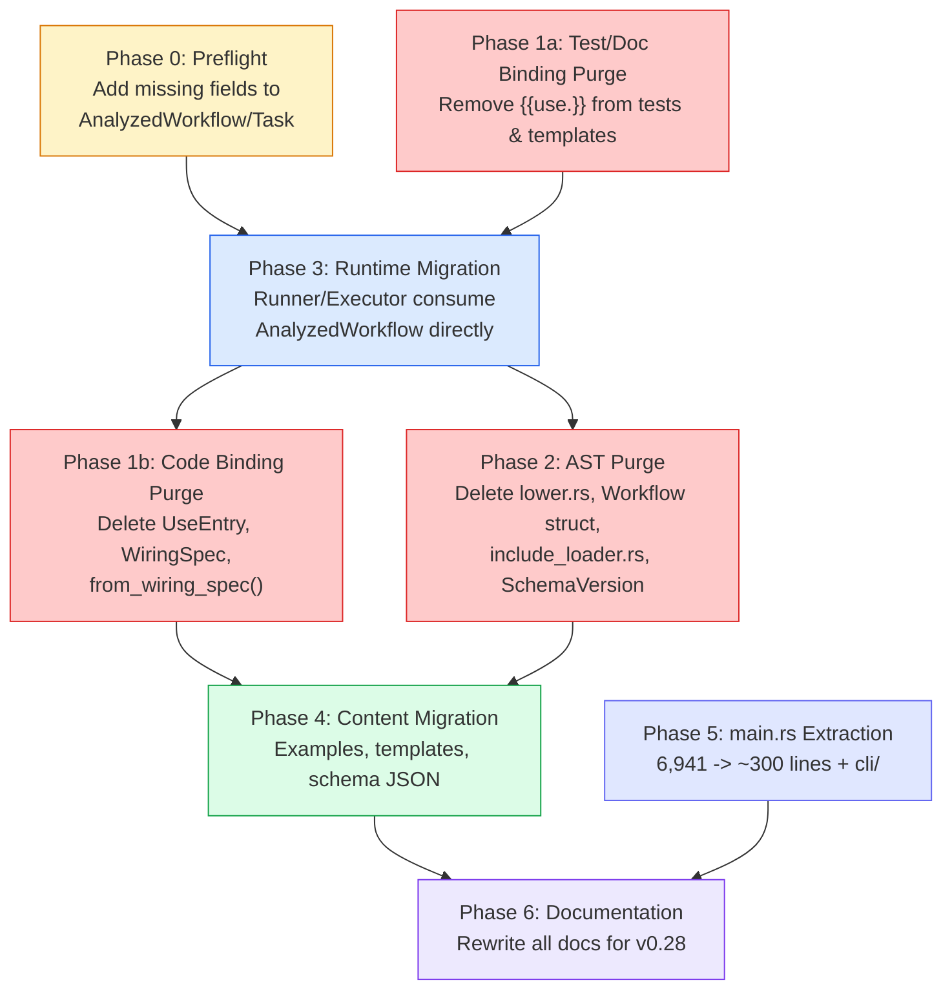

# Operation Tabula Rasa — Deep Legacy Cleanup Plan

> Remove ALL backward compatibility, legacy code, and old version noise.
> v0 philosophy: as if the old stuff never existed.

**Nika** v0.28.0 target | Created 2026-03-14 | Revised 2026-03-14 (post-swarm review)

---

## Scope & Philosophy

```
+===============================================================================+
|                                                                               |
|  PHILOSOPHY: Clean slate. No migration paths. No backward compat.             |
|  If it's from before v0.28, it doesn't exist. Period.                         |
|                                                                               |
|  DECISIONS:                                                                   |
|  1. Delete lower.rs entirely -> runtime accepts AnalyzedWorkflow directly     |
|  2. Delete parser rejection messages -> unknown fields = generic YAML error   |
|  3. Split main.rs god file -> cli/ modules (in scope)                         |
|                                                                               |
+===============================================================================+
```

---

## Execution Order (Critical Path)



**Why this order matters:**

1. **Phase 0 FIRST** — AnalyzedWorkflow is missing fields the runtime needs
   (`artifacts`, `log`, `decompose`, `structured`). Without these, the runtime
   migration (Phase 3) will fail because the new types can't carry the data.

2. **Phase 1a before Phase 3** — Clean `{{use.}}` from tests/templates so
   Phase 3's test rewrites don't introduce new legacy references.

3. **Phase 3 before Phase 1b** — Can't delete `UseEntry`/`WiringSpec` structs
   while `runner.rs` and `executor.rs` still import and use them. Phase 3
   switches the runtime to `AnalyzedWorkflow`/`WithSpec`. Only THEN can we
   delete the old types.

4. **Phase 3 before Phase 2** — Can't delete `lower.rs` or legacy `Workflow`
   struct while the runtime still consumes them. Phase 3 makes the runtime
   accept `AnalyzedWorkflow` directly. Only THEN is `lower.rs` dead code.

5. **Phase 5 is independent** — `main.rs` extraction can happen in parallel
   with any phase. No dependency on binding/AST changes.

---

## Audit Summary

| Phase | What | Lines Deleted | Files Modified | Files Deleted |
|:-----:|------|:------------:|:--------------:|:-------------:|
| 0 | Add missing fields to AnalyzedWorkflow/Task | 0 (adding) | 4 | 0 |
| 1a | Binding purge: tests, templates, exports | ~250 | 10 | 0 |
| 3 | Runtime migration to AnalyzedWorkflow | ~300 | 8 | 0 |
| 1b | Binding purge: UseEntry, WiringSpec, resolve | ~500 | 8 | 0 |
| 2 | AST purge: lower.rs, Workflow, schema, etc. | ~1,800 | 12 | 3 |
| 4 | Content: examples, templates, schema JSON | ~400 | 40+ | 0 |
| 5 | main.rs extraction | ~6,600 (moved) | 1 | 0 (8 new) |
| 6 | Documentation rewrite | ~2,000 | 4 | 0 |
| **Total** | | **~5,250 deleted + 6,600 moved** | **~87 ops** | **3 deleted** |

---

## Phase 0: Preflight — Complete AnalyzedWorkflow

> Add missing fields to AnalyzedWorkflow and AnalyzedTask so the runtime
> migration (Phase 3) has parity with the legacy types.

**Why:** The legacy `Workflow` struct has fields that `AnalyzedWorkflow` doesn't.
If we try to migrate the runtime without adding these, the code won't compile.

### 0.1 — Add missing workflow-level fields

**File:** `src/ast/analyzed/workflow.rs`

The legacy `Workflow` (in `src/ast/workflow.rs`) has these fields that
`AnalyzedWorkflow` is missing:

| Field | Type | Needed By |
|-------|------|-----------|
| `artifacts` | `Option<ArtifactsConfig>` | `runner.rs` (artifact writing) |
| `log` | `Option<LogConfig>` | `runner.rs` (log level config) |
| `agents` | `Option<IndexMap<String, AgentDef>>` | `executor.rs` (reusable agents) |

**Action:** Add these 3 fields to `AnalyzedWorkflow` struct + Default impl.

### 0.2 — Add missing task-level fields

**File:** `src/ast/analyzed/task.rs`

The legacy `Task` (in `src/ast/workflow.rs`) has these fields that
`AnalyzedTask` is missing:

| Field | Type | Needed By |
|-------|------|-----------|
| `decompose` | `Option<DecomposeSpec>` | `executor.rs` (DAG expansion) |
| `artifact` | `Option<ArtifactSpec>` | `executor.rs` (file persistence) |
| `log` | `Option<LogConfig>` | `executor.rs` (per-task log level) |
| `structured` | `Option<StructuredOutputSpec>` | `executor.rs` (JSON schema) |

**Action:** Add these 4 fields to `AnalyzedTask` struct.

### 0.3 — Add compute_hash() to AnalyzedWorkflow

**File:** `src/ast/analyzed/workflow.rs`

The legacy `Workflow` has `compute_hash()` used by `runner.rs` for trace
identification. Add equivalent to `AnalyzedWorkflow`.

### 0.4 — Wire analyzer to populate new fields

**File:** `src/ast/analyzer/analyze.rs`

The analyzer already transforms `RawWorkflow` -> `AnalyzedWorkflow`. Update
`analyze()` to populate the new fields from the raw AST.

### 0.5 — Verification

```bash
# All new fields are populated:
cargo test ast::analyzed --lib

# Existing tests still pass:
cargo test --lib
cargo clippy -- -D warnings
```

**Commit:**
```
feat(ast): add missing fields to AnalyzedWorkflow and AnalyzedTask

Add artifacts, log, agents to AnalyzedWorkflow.
Add decompose, artifact, log, structured to AnalyzedTask.
Wire analyzer to populate all new fields from raw AST.

Co-Authored-By: Claude <noreply@anthropic.com>
Co-Authored-By: Nika <nika@supernovae.studio>
```

---

## Phase 1a: Binding Purge — Tests, Templates & Exports

> Remove `{{use.}}` from test strings, template regex, and public exports.
> The runtime code still uses `UseEntry` at this point — we only clean
> the surface layer so Phase 3 doesn't reintroduce legacy references.

### 1a.1 — Remove `{{use.}}` from template regex

**File:** `src/binding/template.rs`

| Action | What |
|--------|------|
| MODIFY | Regex (line ~92-98): remove `use\.` from pattern — only match `{{with.}}` |
| MODIFY | `parse_template_expr()`: remove `use.` prefix stripping fallback |
| UPDATE | All test cases: `{{use.xxx}}` -> `{{with.xxx}}` |

### 1a.2 — Remove dead public exports

**File:** `src/lib.rs`

| Line | Action | What |
|:----:|--------|------|
| 95 | DELETE | `pub use dag::{validate_use_wiring, ...}` — remove `validate_use_wiring` |
| 98 | DELETE | `pub use binding::{..., UseEntry, WiringSpec}` — remove legacy types |

**File:** `src/binding/mod.rs`

| Action | What |
|--------|------|
| DELETE | `pub use entry::UseEntry;` |
| DELETE | `pub use entry::WiringSpec;` |
| DELETE | Re-export of `parse_use_entry`, `from_wiring_spec` |
| KEEP | `pub use entry::WithEntry;`, `pub use entry::WithSpec;` |

**File:** `src/dag/mod.rs`

| Action | What |
|--------|------|
| DELETE | `pub use validate::validate_use_wiring;` |

### 1a.3 — Verification

```bash
# Public API no longer exports legacy types:
grep -rn "pub use.*UseEntry\|pub use.*WiringSpec\|pub use.*validate_use_wiring" src/lib.rs src/binding/mod.rs src/dag/mod.rs
# Should return 0

cargo test --lib
```

**Commits:**
```
refactor(binding): remove {{use.}} dual-prefix from template regex
refactor: remove UseEntry/WiringSpec/validate_use_wiring from public exports
```

---

## Phase 3: Runtime Migration to AnalyzedWorkflow

> Make the runtime consume `AnalyzedWorkflow` directly.
> This is the structural keystone — it enables deleting lower.rs AND the
> legacy UseEntry code.

### 3.1 — Migrate Runner to AnalyzedWorkflow

**File:** `src/runtime/runner.rs`

| Action | What |
|--------|------|
| CHANGE | `Runner::new(workflow: Workflow)` -> `Runner::new(workflow: AnalyzedWorkflow)` |
| CHANGE | `workflow: Workflow` field -> `workflow: AnalyzedWorkflow` |
| DELETE | `use crate::ast::Workflow;` import |
| ADD | `use crate::ast::analyzed::AnalyzedWorkflow;` import |
| DELETE | `use crate::dag::validate_use_wiring;` import |
| DELETE | All `use_wiring` fallback code paths (3 branches, lines ~629, ~1026, ~1074) |
| UPDATE | Task access: use `TaskTable` for O(1) lookup by TaskId |
| UPDATE | DAG construction: `Dag::from_analyzed()` instead of `Dag::from_tasks_and_flows()` |

**Key structural change:**

```rust
// BEFORE:
let dag = Dag::from_tasks_and_flows(&self.workflow.tasks, &self.workflow.flows)?;

// AFTER:
let dag = Dag::from_analyzed(&self.workflow)?;
```

### 3.2 — Migrate Executor to AnalyzedTask

**File:** `src/runtime/executor.rs` + `src/runtime/executor/verbs.rs`

| Action | What |
|--------|------|
| CHANGE | Verb dispatch to accept `&AnalyzedTask` instead of `&Task` |
| CHANGE | `TaskAction` matches -> `AnalyzedTaskAction` matches |
| UPDATE | Binding resolution: use `task.with_spec` only (no `use_wiring` fallback) |

### 3.3 — Migrate DAG

**File:** `src/dag/mod.rs` + `src/dag/validate.rs`

| Action | What |
|--------|------|
| VERIFY | `Dag::from_analyzed()` already exists — confirm it works |
| DELETE | `Dag::from_tasks_and_flows()` (uses legacy `Flow` struct) |
| DELETE | `validate_use_wiring()` function (~90 lines) |
| DELETE | `legacy_validate_wiring()` helper |
| DELETE | `legacy_validate_template_refs()` helper |
| DELETE | `legacy_extract_templates()` helper |

**File:** `src/dag/flow.rs` (MISSED in original plan)

| Line | Action | What |
|:----:|--------|------|
| 494 | DELETE | `use_wiring` check: `else if let Some(ref wiring) = task.use_wiring` |

### 3.4 — Migrate chat_workflow.rs

**File:** `src/runtime/chat_workflow.rs`

| Action | What |
|--------|------|
| UPDATE | All `WiringSpec` references (5) -> `WithSpec` |
| UPDATE | Workflow construction to use `AnalyzedWorkflow` |

### 3.5 — Migrate TUI standalone (MISSED in original plan)

**File:** `src/tui/standalone.rs`

| Lines | Action | What |
|:-----:|--------|------|
| 445 | DELETE | `use crate::dag::{validate_use_wiring, Dag};` import |
| 513 | DELETE | `if let Err(e) = validate_use_wiring(&workflow, &flow_graph)` call |

### 3.6 — Clean stop_conditions (MISSED in original plan)

**File:** `src/tui/chat_agent.rs`

| Lines | Action | What |
|:-----:|--------|------|
| 966 | DELETE | `stop_conditions: vec![],` |
| 1618 | DELETE | `stop_conditions: vec![],` |

### 3.7 — Update parse_workflow() return type

**File:** `src/ast/mod.rs`

```rust
// BEFORE:
pub fn parse_workflow(yaml: &str) -> Result<Workflow, NikaError> {
    let raw = raw::parse(yaml, FileId(0))?;
    let analyzed = analyzer::analyze(raw).into_result()?;
    Ok(lower(analyzed))  // <-- bridge to legacy
}

// AFTER:
pub fn parse_workflow(yaml: &str) -> Result<AnalyzedWorkflow, NikaError> {
    let raw = raw::parse(yaml, FileId(0))?;
    analyzer::analyze(raw).into_result()  // <-- direct return
}
```

### 3.8 — Rewrite test helpers

**File:** `src/runtime/runner.rs` (test section, lines ~1694+)

| Action | What |
|--------|------|
| REWRITE | `make_empty_workflow()` -> return `AnalyzedWorkflow` |
| REWRITE | `create_exec_workflow()` -> return `AnalyzedWorkflow` |
| DELETE | All `use_wiring: None` in test constructors (~20 tests) |
| UPDATE | All test `Task` construction -> `AnalyzedTask` |

### 3.9 — Verification

```bash
# Runtime only references analyzed types:
grep -rn "ast::Workflow\b\|ast::Task\b\|ast::Flow\b" src/runtime/ --include="*.rs"
# Should return 0

# No more use_wiring in runtime:
grep -rn "use_wiring" src/runtime/ src/dag/ src/tui/ --include="*.rs"
# Should return 0

cargo test runtime:: --lib
cargo test dag:: --lib
cargo test --lib
```

**Commits:**
```
refactor(runtime): migrate Runner to accept AnalyzedWorkflow
refactor(runtime): migrate Executor to AnalyzedTask
refactor(dag): delete Dag::from_tasks_and_flows() and validate_use_wiring()
refactor(ast): change parse_workflow() to return AnalyzedWorkflow
refactor(tui): remove validate_use_wiring and stop_conditions legacy
```

---

## Phase 1b: Binding Purge — Delete UseEntry & Resolution Code

> Now that the runtime no longer imports `UseEntry`/`WiringSpec`,
> delete the structs and all supporting code.

### 1b.1 — Delete UseEntry struct and parser

**File:** `src/binding/entry.rs` (1,755 lines)

| Action | What | Lines |
|--------|------|:-----:|
| DELETE | `UseEntry` struct definition + all impl blocks | ~150 |
| DELETE | `parse_use_entry()` function | ~40 |
| DELETE | Custom `Deserialize` impl for `UseEntry` | ~60 |
| DELETE | `WiringSpec` type alias (`FxHashMap<String, UseEntry>`) | ~5 |
| DELETE | All `UseEntry` unit tests | ~200 |
| KEEP | `WithEntry` struct + all impl blocks | all |
| KEEP | `WithSpec` type alias | all |
| KEEP | `parse_with_entry()` function | all |

**Estimated:** ~455 lines deleted from this file.

### 1b.2 — Delete legacy binding resolution

**File:** `src/binding/resolve.rs`

| Action | What |
|--------|------|
| DELETE | `from_wiring_spec()` function (~150 lines) |
| DELETE | `LazyBinding::Pending` variant (keep only `PendingWithEntry`) |
| DELETE | Any `UseEntry` -> `WithEntry` conversion helpers |
| KEEP | `from_with_spec()` — the new resolution path |
| KEEP | `LazyBinding::PendingWithEntry`, `Resolved`, `Failed` |

### 1b.3 — Clean binding/mention.rs

**File:** `src/binding/mention.rs`

| Action | What |
|--------|------|
| DELETE | All `WiringSpec` / `UseEntry` references (11 occurrences) |
| UPDATE | Mention analysis to use `WithSpec` only |

### 1b.4 — Verification

```bash
# Zero legacy binding types anywhere:
grep -rn "UseEntry\|WiringSpec\|use_wiring\|from_wiring_spec\|parse_use_entry" src/ --include="*.rs"
# Should return 0

cargo test binding:: --lib
cargo test --lib
```

**Commits:**
```
refactor(binding): delete UseEntry struct and WiringSpec type alias
refactor(binding): delete from_wiring_spec() legacy resolution path
```

---

## Phase 2: AST Layer Purge

> Delete the bridge layer, old include loader, schema versions, legacy fields.
> After this phase, the AST is ONLY the analyzed types.

### 2.1 — Delete lower.rs (770 lines)

**File:** `src/ast/lower.rs` — **DELETE ENTIRELY**

This was the bridge from `AnalyzedWorkflow` -> legacy `Workflow`. Now that the
runtime accepts `AnalyzedWorkflow` directly (Phase 3), this file is dead code.

**File:** `src/ast/mod.rs`

| Action | What |
|--------|------|
| DELETE | `pub mod lower;` declaration |
| DELETE | `pub use lower::lower;` re-export |

### 2.2 — Delete legacy Workflow/Task/Flow structs

**File:** `src/ast/workflow.rs`

| Action | What |
|--------|------|
| DELETE | `Workflow` struct (~50 lines) |
| DELETE | `Task` struct (~40 lines) |
| DELETE | `Flow` struct + `FlowEndpoint` enum |
| DELETE | `impl Workflow` block (including `compute_hash()` — moved to Phase 0) |
| DELETE | All imports for types only used by these structs |
| KEEP | `McpConfigInline` struct (still used by MCP config system) |

> `Flow` and `FlowEndpoint` are dead concepts. Dependencies are expressed via
> `depends_on: [task_id]` on `AnalyzedTask`. There is no separate `flows:` section.

### 2.3 — Delete include_loader.rs (768 lines)

**File:** `src/ast/include_loader.rs` — **DELETE ENTIRELY**

Replaced by `src/ast/import_loader.rs`. Check and remove remaining references:

**File:** `src/ast/mod.rs`

| Action | What |
|--------|------|
| DELETE | `pub mod include_loader;` |
| DELETE | `pub use include_loader::expand_includes;` |

### 2.4 — Collapse SchemaVersion enum

**File:** `src/ast/schema.rs` (~200 lines -> ~30 lines)

**Before:** 12 variants (V01-V12) with feature gating methods.

**After:** Single constant.

```rust
/// The one and only schema version.
pub const SCHEMA_VERSION: &str = "nika/workflow@0.12";

/// Validate a schema string.
pub fn validate_schema(s: &str) -> bool {
    s == SCHEMA_VERSION
}
```

| Action | What |
|--------|------|
| DELETE | `SchemaVersion` enum (12 variants) |
| DELETE | `parse()`, `as_str()`, `all()`, `latest()` methods |
| DELETE | All `supports_*()` methods (7 methods) |
| DELETE | `Display` impl, `version_number()`, `supports()` |
| DELETE | All unit tests for old schema versions |
| REPLACE | With `SCHEMA_VERSION` constant + `validate_schema()` |

**Impact on analyzer:** `src/ast/analyzer/feature_gate.rs` — **DELETE ENTIRELY**
(no feature gating when only one schema version exists).

### 2.5 — Delete legacy AST fields

**File:** `src/ast/agent.rs`

| Action | What |
|--------|------|
| DELETE | `stop_conditions: Vec<String>` field (63 refs across 10 files) |
| DELETE | `effective_completion()` migration shim |
| KEEP | `completion:` field (the replacement) |

**File:** `src/ast/invoke.rs`

| Action | What |
|--------|------|
| DELETE | `#[serde(alias = "server")]` on `mcp` field — no `server:` alias |

### 2.6 — Delete parser rejection blocks

**File:** `src/ast/raw/parser.rs`

v0 philosophy = these keywords never existed. Remove all rejection code.

| Action | What | Lines |
|--------|------|:-----:|
| DELETE | `use:` rejection block + error message | ~8 |
| DELETE | `flow:` rejection block | ~8 |
| DELETE | `include:` rejection block | ~8 |
| DELETE | `skills:` rejection block | ~8 |
| DELETE | `flows:` rejection block | ~8 |

Unknown fields will produce a generic `unknown field` serde error.

### 2.7 — Delete dead AST modules

**File:** `src/ast/include.rs` — DELETE if `IncludeSpec` no longer used.

**File:** `src/ast/mod.rs` — Remove all re-exports for deleted types:

| Action | What |
|--------|------|
| DELETE | `pub use workflow::{Flow, FlowEndpoint, Task, Workflow};` |
| DELETE | `pub use include::IncludeSpec;` |
| DELETE | `pub use include_loader::expand_includes;` |
| KEEP | `pub use workflow::McpConfigInline;` |

### 2.8 — Verification

```bash
# After Phase 2, all must return 0:
grep -rn "lower\b" src/ast/ --include="*.rs" | grep -v "//\|lower_case\|lowercase"
grep -rn "include_loader" src/ --include="*.rs"
grep -rn "SchemaVersion" src/ --include="*.rs"
grep -rn "stop_conditions" src/ --include="*.rs"
grep -rn "FlowEndpoint\|ast::Flow\b" src/ --include="*.rs"
test ! -f src/ast/lower.rs
test ! -f src/ast/include_loader.rs
test ! -f src/ast/analyzer/feature_gate.rs

cargo test ast:: --lib
cargo test --lib
cargo clippy -- -D warnings
```

**Commits:**
```
refactor(ast): delete lower.rs bridge layer (770 lines)
refactor(ast): delete legacy Workflow/Task/Flow structs
refactor(ast): delete include_loader.rs (768 lines, replaced by import_loader)
refactor(ast): collapse SchemaVersion to single constant
refactor(ast): delete stop_conditions and server: alias
refactor(ast): delete parser rejection blocks for old keywords
```

---

## Phase 4: Content Migration

> Migrate all examples, templates, and schema JSON from legacy syntax.
> `use:` -> `with:`, `flows:` -> `depends_on:`, `flow:` -> `depends_on:`,
> `server:` -> `mcp:`, schema -> `nika/workflow@0.12`.

### 4.1 — Migrate examples (27+ files)

**Directory:** `examples/`

For each file:

| Find | Replace |
|------|---------|
| `use:` (block key) | `with:` |
| `{{use.xxx}}` | `{{with.xxx}}` |
| `schema: "nika/workflow@0.X"` | `schema: "nika/workflow@0.12"` |
| `flows:` section | `depends_on:` on individual tasks |
| `server:` (invoke alias) | `mcp:` |
| `$task` bare refs | `$task` (keep — works with `with:` system) |

### 4.2 — Migrate init templates (205 `{{use.}}` occurrences)

**Files:**

| File | `{{use.}}` count | Extra legacy |
|------|:---:|--------|
| `src/init/tier1.rs` | 10 | `use:` blocks |
| `src/init/tier2.rs` | 30 | `use:` blocks |
| `src/init/tier3.rs` | 6 | `use:` blocks + `stop_conditions` refs |
| `src/init/tier4.rs` | 4 | `use:` blocks |
| `src/init/tier5.rs` | 36 | `use:` blocks |
| `src/init/tier6.rs` | 60 | `use:` blocks |
| `src/init/partials.rs` | 24 | `use:` blocks |

All templates: `{{use.` -> `{{with.`, `use:` -> `with:`, schema -> 0.12.

### 4.3 — Migrate new/templates.rs (MISSED in original plan)

**File:** `src/new/templates.rs`

| Legacy | Count | Replace |
|--------|:-----:|---------|
| `{{use.xxx}}` | 35 | `{{with.xxx}}` |
| `flow:` (per-task, NOT `flows:`) | 55 | `depends_on:` |
| `server:` | 2 | `mcp:` |
| `use:` blocks | ~20 | `with:` blocks |
| Old schema versions | ~10 | `nika/workflow@0.12` |

> **NOTE:** The 55 `flow:` instances are per-task `flow:` fields, which is
> the OLDEST legacy pattern. These must become `depends_on:` on each task.

### 4.4 — Migrate examples with `server:` (MISSED in original plan)

**Directory:** `examples/`

| File | `server:` count |
|------|:---:|
| `blog-content-pipeline.nika.yaml` | 3 |
| `quickstart-mcp.nika.yaml` | 3 |
| `multi-locale-mcp.nika.yaml` | 3 |
| `code-review.nika.yaml` | 3 |

Also: `blog-content-pipeline.nika.yaml` has 7 per-task `flow:` fields.

### 4.5 — Update JSON Schema

**File:** `schemas/nika-workflow.schema.json`

| Action | What |
|--------|------|
| DELETE | `"use"` field definition in task properties |
| ADD | `"with"` field definition (if not already there) |
| UPDATE | `"schema"` enum to only allow `"nika/workflow@0.12"` |
| DELETE | `"flows"` field definition at workflow level |
| DELETE | `"flow"` field definition at task level |
| DELETE | `"include"` field definition |
| DELETE | `"skills"` field definition (replaced by `imports:`) |
| DELETE | `"server"` from invoke task properties |

### 4.6 — Rename files with legacy names

| Old | New |
|-----|-----|
| `examples/use-output-demo.nika.yaml` | `examples/with-output-demo.nika.yaml` |

### 4.7 — Verification

```bash
# Zero legacy in content:
grep -rn "{{use\." examples/ src/init/ src/new/ --include="*.rs" --include="*.yaml"
grep -rn "^  flow:" examples/ src/init/ src/new/ --include="*.rs" --include="*.yaml"
grep -rn "server:" examples/ --include="*.yaml" | grep -v "servers:"
# All should return 0

# All examples must parse:
for f in examples/*.nika.yaml examples/*.yaml; do
  cargo run -- check "$f" || echo "FAIL: $f"
done
```

**Commits:**
```
refactor(examples): migrate all workflows to with:/depends_on:/0.12
refactor(init): migrate all templates to with: syntax
refactor(new): migrate templates.rs to with:/depends_on: (55 flow: + 35 use.)
refactor(schema): update JSON schema (remove use:/flows:/server:, add with:)
```

---

## Phase 5: main.rs Extraction

> Split the 6,941-line god file into focused cli/ modules.
> main.rs becomes ~300 lines: clap parse + dispatch.
> **Independent of other phases — can run in parallel.**

### 5.1 — Create cli/ module structure

```
src/cli/
+-- mod.rs          # Re-exports, shared CLI types
+-- init.rs         # init_project() -- ~1,516 lines
+-- schema.rs       # handle_schema_command() -- ~701 lines
+-- config.rs       # handle_config_command() -- ~200 lines
+-- trace.rs        # handle_trace_command() -- ~126 lines
+-- new.rs          # handle_new_command() -- ~160 lines
+-- doctor.rs       # Doctor checks -- ~240 lines
+-- run.rs          # Workflow execution entry point -- ~200 lines
+-- utils.rs        # Shared helpers (output formatting, etc.) -- ~300 lines
```

### 5.2 — Extract init_project (largest: ~1,516 lines)

**From:** `src/main.rs` -> **To:** `src/cli/init.rs`

Move `init_project()` and all helper functions:
- Tier selection logic
- Template generation
- Directory creation
- Interactive wizard prompts

### 5.3 — Extract schema commands (~701 lines)

**From:** `src/main.rs` -> **To:** `src/cli/schema.rs`

Move `handle_schema_command()` and schema-related helpers.

### 5.4 — Extract remaining commands

| Command | Target File | Lines |
|---------|-------------|:-----:|
| `config` | `src/cli/config.rs` | ~200 |
| `trace` | `src/cli/trace.rs` | ~126 |
| `new` | `src/cli/new.rs` | ~160 |
| `doctor` | `src/cli/doctor.rs` | ~240 |
| `run` | `src/cli/run.rs` | ~200 |
| helpers | `src/cli/utils.rs` | ~300 |

### 5.5 — Slim down main.rs

**After extraction, main.rs becomes:**

```rust
mod cli;

fn main() -> Result<(), Box<dyn std::error::Error>> {
    let args = Cli::parse();

    match args.command {
        Command::Run(opts) => cli::run::execute(opts),
        Command::Check(opts) => cli::schema::check(opts),
        Command::Init(opts) => cli::init::execute(opts),
        Command::New(opts) => cli::new::execute(opts),
        Command::Trace(opts) => cli::trace::execute(opts),
        Command::Config(opts) => cli::config::execute(opts),
        Command::Doctor => cli::doctor::execute(),
        // ... TUI, chat, studio, provider, model, mcp, sync, etc.
    }
}
```

### 5.6 — Verification

```bash
wc -l src/main.rs
# Should be <500 lines

cargo test --lib
cargo clippy -- -D warnings
```

**Commits:**
```
refactor(cli): extract init_project to src/cli/init.rs
refactor(cli): extract schema commands to src/cli/schema.rs
refactor(cli): extract trace/config/new/doctor to src/cli/
refactor(cli): slim main.rs to dispatch-only (~300 lines)
```

---

## Phase 6: Documentation Purge

> Rewrite all documentation to only reference `with:` syntax.
> No mention of `use:`, old schema versions, or migration paths.

### 6.1 — Rewrite tools/nika/CLAUDE.md

Full rewrite (~2,000 lines):

| Section | Action |
|---------|--------|
| All `use:` examples | Replace with `with:` |
| All `{{use.xxx}}` | Replace with `{{with.xxx}}` |
| "Implicit Output Syntax" | Update `$task` docs to reference `with:` |
| "for_each Parallelism" | `{{use.item}}` -> `{{with.item}}` |
| "Extended Thinking" | Update examples |
| Version history sections | DELETE ALL pre-v0.28 sections |
| Schema references | Only `nika/workflow@0.12` |
| `stop_conditions` docs | DELETE, only document `completion:` |
| `flows:` docs | DELETE, only document `depends_on:` |
| `include:` docs | DELETE, only document `imports:` |
| `server:` alias docs | DELETE |

### 6.2 — Rewrite nika/CLAUDE.md

| Action | What |
|--------|------|
| UPDATE | All `use:` examples -> `with:` |
| DELETE | Version history prior to v0.28 |
| UPDATE | Schema references -> `nika/workflow@0.12` only |

### 6.3 — Update dx/.claude/rules/nika.md

| Action | What |
|--------|------|
| UPDATE | All `{{use.}}` examples -> `{{with.}}` |
| DELETE | All pre-v0.28 changelog sections |
| UPDATE | Schema references |
| DELETE | `stop_conditions` references |

### 6.4 — Update brainstorm docs

**Directory:** `docs/brainstorm/nika-evolution/*.md`

| Action | What |
|--------|------|
| UPDATE | Any `use:` workflow examples -> `with:` |
| NOTE | Research docs — update examples but keep analysis text |

**Commits:**
```
docs: rewrite tools/nika/CLAUDE.md for v0.28 clean slate
docs: rewrite nika/CLAUDE.md for v0.28
docs: update dx/.claude/rules/nika.md for v0.28
docs: update brainstorm docs examples to with: syntax
```

---

## Complete File Impact Map

Every file touched by this plan, organized by module:

```
src/ast/
  +-- analyzed/workflow.rs  Phase 0: add artifacts, log, agents
  +-- analyzed/task.rs      Phase 0: add decompose, artifact, log, structured
  +-- analyzer/analyze.rs   Phase 0: wire new fields
  +-- analyzer/feature_gate.rs  Phase 2: DELETE
  +-- lower.rs              Phase 2: DELETE (770 lines)
  +-- include_loader.rs     Phase 2: DELETE (768 lines)
  +-- include.rs            Phase 2: DELETE (if unused)
  +-- workflow.rs           Phase 2: delete Workflow/Task/Flow, keep McpConfigInline
  +-- schema.rs             Phase 2: collapse to constant
  +-- agent.rs              Phase 2: delete stop_conditions
  +-- invoke.rs             Phase 2: delete server: alias
  +-- raw/parser.rs         Phase 2: delete rejection blocks
  +-- mod.rs                Phase 2+3: update return type, remove dead imports

src/binding/
  +-- entry.rs              Phase 1b: delete UseEntry, WiringSpec (~455 lines)
  +-- resolve.rs            Phase 1b: delete from_wiring_spec()
  +-- template.rs           Phase 1a: remove {{use.}} regex
  +-- mention.rs            Phase 1b: remove UseEntry/WiringSpec refs
  +-- mod.rs                Phase 1a: remove legacy re-exports

src/dag/
  +-- validate.rs           Phase 3: delete validate_use_wiring()
  +-- flow.rs               Phase 3: delete use_wiring check (line 494)
  +-- mod.rs                Phase 1a+3: remove legacy exports

src/runtime/
  +-- runner.rs             Phase 3: migrate to AnalyzedWorkflow
  +-- executor.rs           Phase 3: migrate to AnalyzedTask
  +-- chat_workflow.rs      Phase 3: WiringSpec -> WithSpec

src/tui/
  +-- standalone.rs         Phase 3: remove validate_use_wiring calls
  +-- chat_agent.rs         Phase 3: remove stop_conditions: vec![]

src/init/
  +-- tier1-6.rs            Phase 4: {{use.}} -> {{with.}}
  +-- partials.rs           Phase 4: {{use.}} -> {{with.}}

src/new/
  +-- templates.rs          Phase 4: 55 flow: + 35 use. + 2 server:

src/
  +-- lib.rs                Phase 1a: remove dead exports
  +-- main.rs               Phase 5: extract to cli/ modules

examples/                   Phase 4: 27+ files migrated
schemas/                    Phase 4: JSON schema updated
docs/                       Phase 6: all docs rewritten
```

---

## Commit Strategy

Each phase produces atomic commits that keep the build green.

**Rule: `cargo test && cargo clippy -- -D warnings` must pass after EVERY commit.**

| # | Commit | Phase | Build? |
|:-:|--------|:-----:|:------:|
| 1 | `feat(ast): add missing fields to AnalyzedWorkflow/Task` | 0 | GREEN |
| 2 | `refactor(binding): remove {{use.}} from template regex` | 1a | GREEN |
| 3 | `refactor: remove legacy types from public exports` | 1a | GREEN |
| 4 | `refactor(runtime): migrate Runner to AnalyzedWorkflow` | 3 | GREEN |
| 5 | `refactor(runtime): migrate Executor to AnalyzedTask` | 3 | GREEN |
| 6 | `refactor(dag): delete from_tasks_and_flows + validate_use_wiring` | 3 | GREEN |
| 7 | `refactor(ast): change parse_workflow() return type` | 3 | GREEN |
| 8 | `refactor(tui): remove validate_use_wiring and stop_conditions` | 3 | GREEN |
| 9 | `refactor(binding): delete UseEntry/WiringSpec/from_wiring_spec` | 1b | GREEN |
| 10 | `refactor(ast): delete lower.rs (770 lines)` | 2 | GREEN |
| 11 | `refactor(ast): delete Workflow/Task/Flow structs` | 2 | GREEN |
| 12 | `refactor(ast): delete include_loader.rs (768 lines)` | 2 | GREEN |
| 13 | `refactor(ast): collapse SchemaVersion to constant` | 2 | GREEN |
| 14 | `refactor(ast): delete stop_conditions + server: alias` | 2 | GREEN |
| 15 | `refactor(ast): delete parser rejection blocks` | 2 | GREEN |
| 16 | `refactor(examples): migrate all to with:/depends_on:/0.12` | 4 | GREEN |
| 17 | `refactor(init): migrate templates to with: syntax` | 4 | GREEN |
| 18 | `refactor(new): migrate templates.rs (55 flow: + 35 use.)` | 4 | GREEN |
| 19 | `refactor(schema): update JSON schema for v0.28` | 4 | GREEN |
| 20 | `refactor(cli): extract init_project to cli/init.rs` | 5 | GREEN |
| 21 | `refactor(cli): extract schema/trace/config/new/doctor` | 5 | GREEN |
| 22 | `refactor(cli): slim main.rs to ~300 lines` | 5 | GREEN |
| 23 | `docs: rewrite all docs for v0.28 clean slate` | 6 | GREEN |

---

## Risk Assessment

| Risk | Severity | Mitigation |
|------|:--------:|------------|
| Missing fields break runtime migration | **CRITICAL** | Phase 0 adds ALL missing fields first |
| Commit breaks build mid-sequence | **HIGH** | Every commit verified: `cargo test && clippy` |
| AnalyzedWorkflow missing Runner needs | **HIGH** | Field-by-field audit done (Phase 0 addresses all 7) |
| DAG construction changes break scheduling | **HIGH** | `Dag::from_analyzed()` already exists — verify only |
| Example migration misses edge cases | **MEDIUM** | `nika check` on every example post-migration |
| main.rs extraction changes public API | **LOW** | `lib.rs` exports are separate from CLI |
| 6,157 tests break | **MEDIUM** | Git worktree for isolation; full suite per commit |
| `flow:` per-task in templates missed | **MEDIUM** | Explicit Phase 4.3 for templates.rs (55 instances) |

---

## Success Criteria

```
+===============================================================================+
|  DONE WHEN:                                                                   |
|                                                                               |
|  [ ]  grep "UseEntry\|WiringSpec\|use_wiring" src/ -> 0 results              |
|  [ ]  grep "{{use\." src/ examples/ -> 0 results                             |
|  [ ]  grep "SchemaVersion" src/ -> 0 results (only SCHEMA_VERSION constant)   |
|  [ ]  grep "stop_conditions" src/ -> 0 results                               |
|  [ ]  grep "lower\b" src/ast/ -> 0 results (no bridge layer)                 |
|  [ ]  grep "flow:" src/new/templates.rs -> 0 results (per-task flow: gone)    |
|  [ ]  grep "server:" examples/ -> 0 results (except servers:)                 |
|  [ ]  src/ast/lower.rs does not exist                                         |
|  [ ]  src/ast/include_loader.rs does not exist                                |
|  [ ]  src/ast/analyzer/feature_gate.rs does not exist                         |
|  [ ]  main.rs < 500 lines                                                     |
|  [ ]  cargo test -> 6,000+ tests passing                                      |
|  [ ]  cargo clippy -- -D warnings -> 0 warnings                              |
|  [ ]  All examples parse with nika check                                      |
|                                                                               |
+===============================================================================+
```

---

<div align="center">

**Operation Tabula Rasa** -- v0.28 Clean Slate

*As if the old stuff never existed.*

</div>
