# Nika Memory - Design Bible

> **The cognitive memory engine that thinks about itself.**
> Codename: Egghead (Vegapunk's island — the giant brain that holds all knowledge)
>
> Status: DRAFT - to be validated
> Date: 2026-03-31
> Research: 39 agents, 37 papers, 80+ crates, 106 psychology patterns
>
> **Naming convention:**
> - Crate: `nika-memory` — Struct: `Memory` — Files: `memory.grafeo` + `memory-meta.db`
> - YAML field: `memory:` — Tools: `nika:remember`, `nika:recall`, `nika:memory`
> - Node types: `Episode`, `Fact`, `Skill`, `Reflection`, `Concept`
> - "Egghead" = mascot/lore name only (docs, podcast, course easter eggs)
> - Previous codenames: "Cortex" (research docs), "Record" (v0.52 — deprecated)

---

## Glossary

| Term | Meaning |
|------|---------|
| ACT-R | Adaptive Control of Thought - Rational. Cognitive architecture (Anderson 1998) |
| AGM | Alchourrón, Gardenfors, Makinson. Formal logic of belief revision (1985) |
| BM25 | Best Match 25. Text search ranking algorithm |
| FSRS-6 | Free Spaced Repetition Scheduler v6. Algorithm behind Anki |
| GQL | Graph Query Language (ISO 39075) |
| HNSW | Hierarchical Navigable Small World. Vector search algorithm |
| PQ | Product Quantization. Vector compression (8-32x) |
| RRF | Reciprocal Rank Fusion. Multi-signal score merging |
| SPARQL | SPARQL Protocol and RDF Query Language (W3C standard) |
| SSSP | Single-Source Shortest Path. Graph algorithm |

---

## What is Egghead?

Egghead is a **cognitive memory engine** for Nika workflows. It remembers what
happened, learns from experience, and forgets intelligently - like a brain.

Every AI agent today has amnesia. Each conversation starts from zero. Egghead
fixes this with **22 cognitive mechanisms** from neuroscience and behavioral
psychology, stored in a single file on disk.

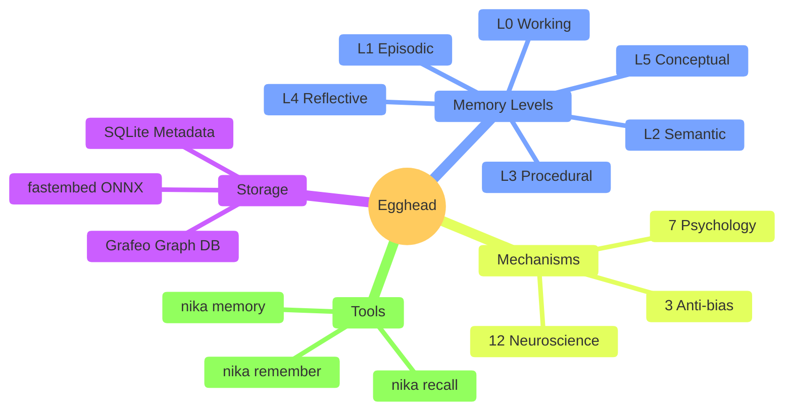

---

## The Problem

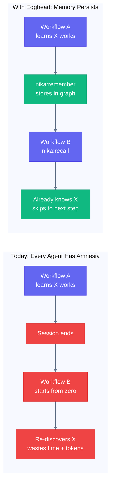

**No existing solution combines** graph + vectors + full-text + cognitive
mechanisms + single binary. Here is why:

| System | Stars | Graph | Vectors | Cognitive | Single Binary |
|--------|-------|-------|---------|-----------|---------------|
| mem0 | 51K | Neo4j (ext) | Qdrant (ext) | None | No |
| Graphiti | 24K | Neo4j (ext) | Built-in | None | No |
| Hermes | 19K | None | None | Learning loop | No |
| Letta | 22K | None | Built-in | Virtual ctx | No |
| **Egghead** | - | **Grafeo** | **Grafeo** | **22 mechanisms** | **Yes** |

---

## Architecture

### The Big Picture

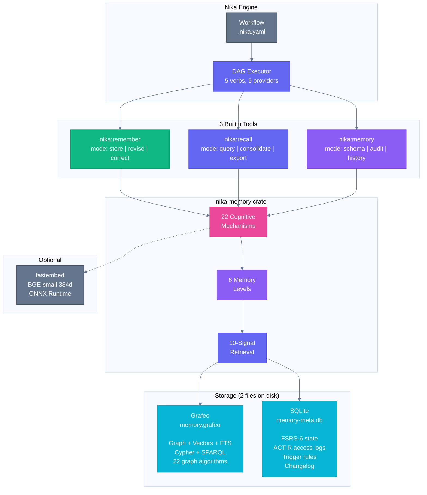

### On Disk — Files vs Memory

**Key distinction**: files are INPUTS (user creates them). Memory is OUTPUT
(the agent creates it). They coexist. Nothing is deleted except NDJSON records.

```
~/.nika/
|
|  NEW (Egghead memory)
+-- memory.grafeo           The Brain — ALL memories live here:
|                             L1 Episodic (events, sessions, task results)
|                             L2 Semantic (facts, entities, relations)
|                             L3 Procedural (skills, patterns, reliability)
|                             L4 Reflective (meta-observations, auto-generated)
|                             L5 Conceptual (themes, Louvain clusters)
|                             + all edges (Supports, Causes, Contradicts...)
|                             + all embeddings (HNSW 384d vectors)
|                             + all text index (BM25 on content + anticipations)
|                             ~37 MB for 100K memories
|
+-- memory-meta.db          The Notebook — counters that change on every access:
|                             FSRS-6 state (difficulty, stability, elapsed)
|                             ACT-R access logs (timestamps)
|                             Trigger rules (conditional auto-recall)
|                             Memory changelog (mutations for rollback)
|                             Node types (ontology evolution history)
|                             ~2 MB
|
|  UNCHANGED (existing files)
+-- traces/                  Execution traces — STAY as files
|   +-- run_2026-03-31.json  Raw event logs from workflow runs.
|                             Not memory. Egghead can READ them to
|                             extract memories (import), but traces
|                             remain separate log files.
|
+-- daemon/                  Daemon — STAYS as-is
|   +-- nika.sock            + MemoryService added for consolidation
|   +-- daemon.db
|   +-- nika.pid
|
+-- secrets/vault.enc        NikaVault — STAYS as-is
+-- cache/                   LLM response cache — STAYS as-is
+-- config.toml              User config — STAYS as-is
|
|  DEPRECATED (migrated to memory.grafeo)
+-- records/                 NDJSON records — MIGRATED via import/ndjson.rs
    +-- *.ndjson             Kept read-only as backup. No new files written.

project/
|
|  UNCHANGED (user-managed files)
+-- .nika/config.toml        Project config — STAYS as file
+-- skills/                  Skill files (.skill.md) — STAY as files
|   +-- writing.md           These are PROMPTS (text injected in system prompt).
|   +-- code-review.md       NOT memory. But when a skill is used successfully,
|                             Egghead creates a L3:Procedural node in the graph
|                             to track its reliability (success/failure count).
|
+-- workflows/               Workflow files (.nika.yaml) — STAY as files
    +-- podcast.nika.yaml    These are RECIPES (declarative instructions).
                              NOT memory. But when a workflow succeeds,
                              Egghead can create a L3:Procedural node
                              "this pattern works" with Bayesian reliability.
```

**The rule**:
- **Files** (yaml, md, traces, config) = user creates, user maintains, on disk as files
- **Memory** (episodes, facts, skills, relations) = agent creates, Egghead maintains, in graph
- **Only NDJSON records are deprecated** — everything else stays

Two files for memory. Everything else unchanged. Copy `memory.grafeo` +
`memory-meta.db` on a USB stick = your entire memory.

---

## The Stack

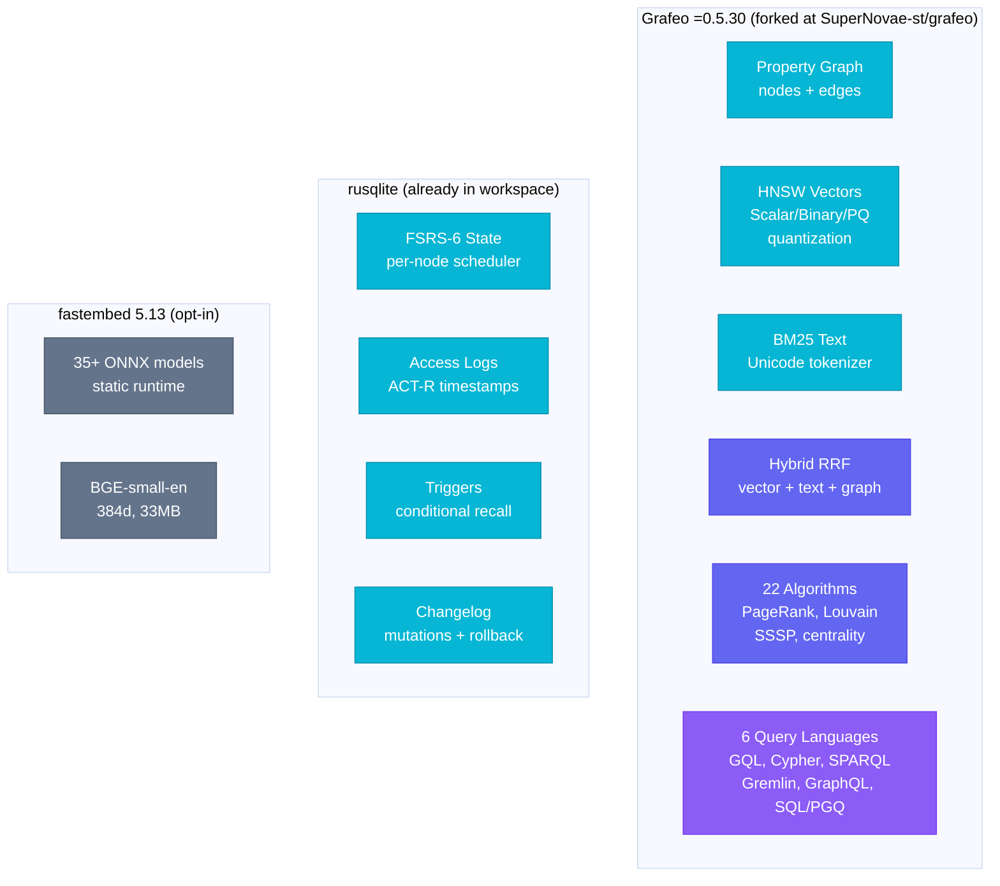

**Why Grafeo?** It is the only pure Rust embeddable DB that does graph + vectors
+ full-text in one engine. Without it, we would need petgraph + usearch + FTS5
+ 200 lines of glue code per query.

**Why fork?** Grafeo is 64 days old, bus factor 1. Apache-2.0 lets us fork at
`SuperNovae-st/grafeo`. We pin `=0.5.30`, contribute upstream, maintain if
abandoned. Open source spirit.

**Why SQLite alongside?** Cognitive state (FSRS, access logs) changes on EVERY
access. SQLite WAL handles frequent small writes better than Grafeo. Grafeo is
optimized for graph traversal, not row-level updates.

### Concurrent Access Model

```
Daemon (write)     exclusive lock (fs2::try_lock_exclusive)
CLI (read-only)    shared lock (fs2::try_lock_shared) → sees last checkpoint
TUI (read-only)    shared lock → sees last checkpoint
Multiple readers   OK (shared locks coexist)
```

The daemon writes memories during/after workflow execution. CLI/TUI read for
display/export. Readers see the last checkpoint, not in-flight mutations.

### Cargo.toml Feature Flags

```toml
[dependencies]
grafeo = { version = "=0.5.30", default-features = false, features = ["embedded"] }
rusqlite = { workspace = true }
fastembed = { version = "5", optional = true }

[features]
default = []
embed = ["dep:fastembed"]           # Local ONNX embeddings
cypher = ["grafeo/cypher"]          # Cypher query language
sparql = ["grafeo/sparql"]          # SPARQL for ontology self-description
full = ["embed", "cypher", "sparql"]
```

---

## 5 Design Principles

These justify the otherwise-arbitrary constants throughout the system.

### 1. Cognitive Load Management

> Decision fatigue + paradox of choice (Schwartz 2004)

- Fixed evidence slots: **5-7 per decision** (Miller's 7 plus minus 2)
- Progressive context compression as workflow advances
- Token budget = cognitive load limiter
- Fewer, higher-quality results beat many low-quality ones

### 2. Calibrated Stubbornness

> Status quo bias + Occam's razor

- Easy to update low-confidence beliefs
- Proportionally harder to update high-confidence ones
- **3:1 evidence ratio** for revision of established beliefs
- AGM success postulate: NEVER impossible to update

### 3. Adaptive Retrieval Strategy

> Satisficing vs maximizing (Simon 1956)

- Simple queries → System 1 (fast, top-3, satisfice if confidence > 0.85)
- Complex queries → System 2 (thorough, top-10, recursive, re-rank)
- Time-pressured → satisfice regardless

### 4. Structured Diversity

> Default effect (Johnson & Goldstein 2003)

- Penalize overuse of generic node types
- Suggest specific alternatives during `nika:remember`
- Periodic re-classification audit in consolidation

### 5. Cautious Narrative Construction

> Narrative bias (Kahneman 2011) + confabulation risk

- Require causal EVIDENCE, not just co-occurrence
- Generate alternative narratives during consolidation
- Tolerate fragmentation (some episodes are genuinely disconnected)
- Tag inferred vs observed relationships

---

## The 6 Memory Levels

Inspired by the GAAMA paper (2603.27910) and Tulving's memory taxonomy.

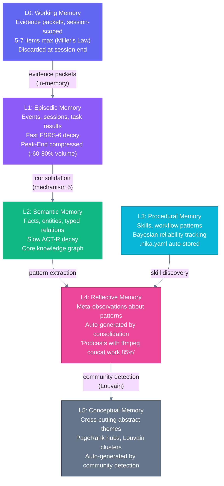

**Consolidation ratio**: 3:1 per level. 1000 events at L0 become ~333
observations at L1, ~111 facts at L2, ~37 patterns at L3, ~12 reflections at
L4, and ~4 concepts at L5.

### What lives where?

| Level | Example | Stored in | Decay model |
|-------|---------|-----------|-------------|
| L0 | "These 5 results answer the query" | In-memory only | Session end |
| L1 | "Workflow podcast-gen ran at 14:30, took 45s" | Grafeo node `:Episodic` | FSRS-6 (fast) |
| L2 | "Claude is good for structured extraction" | Grafeo node `:Semantic` | ACT-R (slow) |
| L3 | "ffmpeg -f concat works for audio merge" | Grafeo node `:Procedural` | Bayesian reliability |
| L4 | "Podcasts with >10 segments always timeout" | Grafeo node `:Reflective` | Very slow |
| L5 | "Media production" (links 50 related facts) | Grafeo node `:Conceptual` | PageRank hub |

---

## The 22 Cognitive Mechanisms

Every mechanism has a scientific foundation. Every constant has an academic
reference.


### Mechanism Details

#### 1. Hebbian Strengthening (Hebb 1949, Bi & Poo 1998)

> *"Neurons that fire together wire together."*

When two facts are recalled together, the link between them strengthens.
When a link proves misleading, it weakens 4x faster (loss aversion).

```
helpful co-access:    weight += weight * 0.025    (+2.5%)
misleading co-access: weight -= weight * 0.10     (-10%)
floor:                weight >= 0.05              (never fully forget)
half-life:            24 hours without reinforcement
max edges per node:   500                         (prevent explosion)
```

**Why asymmetric?** Kahneman & Tversky (1979) showed losses are
psychologically 2x more powerful than gains. A misleading association is
more dangerous than a helpful one is useful.

**Per-memory-type ratios:**
- Episodic: 2.5x (moderate - events are contextual)
- Semantic: 4.0x (default - facts should be reliable)
- Procedural: 5.0x (strict - bad automated procedures are catastrophic)

#### 2. Triple Decay (Ebbinghaus 1885, Anderson 1998, Bjork 1992)

Three decay models combined for the most robust forgetting curve:

**FSRS-6** (Free Spaced Repetition Scheduler):
```
R(t, S) = (1 + t / (9 * S))^(-1)

R = retrievability (0.0 to 1.0)
t = time since last access (hours)
S = stability (half-life in hours)

At t = 9*S: R = 50% (half-life definition)
```

**ACT-R** (Adaptive Control of Thought):
```
B_i = ln(sum(t_j^(-0.5)))

B_i = base-level activation
t_j = time since j-th access (seconds)
```

**Bjork Dual-Strength:**
- Storage strength: only increases (encoding quality, monotone up)
- Retrieval strength: decays with time, boosted by recall
- Key insight: effortful recall (low R) boosts BOTH strengths more

#### 3. Dopamine Gate (D-MEM, 2603.14597)

The brain's bouncer. Routine facts skip expensive processing.

```
gate_score = surprise * utility
surprise   = 1.0 - max_cosine_similarity_to_existing_facts
utility    = source_confidence * workflow_importance

if gate_score < 0.1:  ROUTINE       → just store, skip steps 3-8
if gate_score > 0.3:  FULL          → run all 11 steps
else:                 INTERMEDIATE   → partial processing
```

**Valence dimension** (negativity bias): failures are encoded 50% stronger.
```
encoding_strength = surprise * (1 + |valence| * 0.5)
valence: -1 (failure), 0 (neutral), +1 (success)
```

**Token savings**: ~80% of incoming facts are routine. Massive cost reduction.

#### 13. Peak-End Compression (Kahneman 1993)

> *"People judge an experience by its peak and its end, not its average."*

For workflow memories, store in full detail ONLY:
- The **peak** (step with highest surprise score)
- The **end** (final result)
- Everything else: compress to minimal DAG structure

**Result**: 60-80% reduction in episodic memory volume with 90%+ of
decision-relevant information preserved.

#### 14. Dunning-Kruger Correction (Kruger & Dunning 1999)

> *"People with limited knowledge overestimate their competence."*

When the memory has very few facts about a topic:

```
effective_confidence = per_fact_confidence * coverage_factor

coverage_factor:
  >= 10 facts: 1.0  (full confidence)
  5-9 facts:   0.7  (reduced)
  < 5 facts:   0.5  (halved)
  1 fact:      0.3  (strongly penalized)
```

The system can explicitly say: *"I don't have enough information on this topic."*

#### 17. Dual-Process Retrieval (Kahneman 2011)

> *"System 1 is fast and intuitive. System 2 is slow and analytical."*

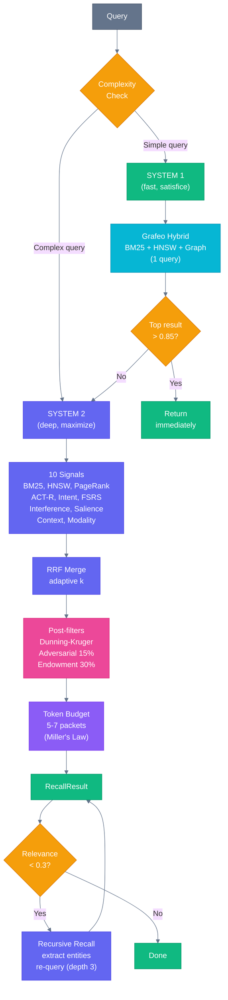

The D-MEM paper (March 2026) validates this: dual-process recovers **96.7%**
of full-deliberation accuracy at a fraction of the cost.

#### 18. Zeigarnik Priority (Zeigarnik 1927)

> *"Incomplete tasks are remembered better than completed ones."*

- Failed workflows get 1.5-2x activation boost
- Unresolved contradictions get priority in recall
- The boost discharges ONLY on actual resolution (not on planning)
- This prevents the Masicampo effect (planning discharges tension prematurely)

#### 20. Adversarial Retrieval (anti confirmation bias)

Hebbian learning + ACT-R spreading activation creates a **computational
confirmation bias loop**: frequently recalled facts become easier to recall,
which makes them recalled even more.

**Fix**: Reserve 15% of the token budget for "devil's advocate" queries that
actively search for contradicting evidence.

#### 4. Prospective Indexing (Kumiho, 2603.17244)

> *"What future scenarios would make this fact useful?"*

At write-time, the system asks an LLM to generate anticipation scenarios. These
are stored and indexed in BM25, creating retrieval paths that match FUTURE needs
to PAST knowledge. Kumiho achieved 93.3% on the LoCoMo benchmark.

Only triggered when the dopamine gate says FULL PROCESSING (~20% of facts).

#### 5. Narrative Consolidation (TraceMem + Vestige)

Background process that clusters similar episodic memories into narrative threads:

1. Cluster episodes with cosine similarity > 0.6
2. For clusters > 3 nodes: create L2 summary node + DerivedFrom edges
3. Extract repeated patterns into L4:Reflective nodes
4. SWR-tagged memories get 70% replay priority (sharp-wave ripple)
5. Runs on Poisson schedule (not fixed interval)

#### 6. Contradiction Detection (AGM, Alchourrón et al. 1985)

When a new fact contradicts an existing one:

1. Search for facts with high cosine AND semantically different content
2. Apply AGM contraction: remove the old belief minimally
3. Then AGM expansion: add the new fact
4. Create SupersededBy edge (never delete the old fact)
5. Require **3:1 evidence ratio** to revise well-established beliefs
6. Emit ContradictionDetected event

#### 7. Salience Encoding (Pensyve 4-factor, Von Restorff 1933)

```
salience = 0.4 * novelty + 0.3 * importance + 0.1 * extremity + 0.2 * specificity

novelty     = cosine distance to nearest existing memory
importance  = source confidence * workflow criticality
extremity   = how far from average values
specificity = inverse of how many nodes share similar content
```

High-salience facts stand out (Von Restorff isolation effect) and resist decay.

#### 8. Feedback Correction (Roediger & Karpicke 2006)

When a recalled fact turns out to be wrong:

1. Create new correct fact node
2. Create Contradicts edge from correct to wrong
3. Apply Hebbian penalty (-10%) on wrong node's edges
4. Log correction in changelog
5. Future recalls suppress the wrong fact, boost the correct one

This is the **testing effect**: every retrieval - even wrong ones - strengthens
memory. The act of correcting deepens encoding.

#### 9. Synaptic Tagging (Frey & Morris 1997)

When an important new fact arrives (salience > 0.7):
- Find related facts stored in the last **6 hours** with low salience
- Retroactively boost their salience

This prevents the "I stored something useful but rated it low" problem. The
protein synthesis window is 6 hours in neuroscience; we use the same value.

#### 10. Interference Detection (Anderson et al. 1994)

Two types of interference:
- **Proactive**: old memory blocks recall of new similar memory
- **Retroactive**: new memory makes old similar memory harder to recall

Detection: if two results have cosine similarity > 0.9, they interfere.
Resolution: penalize the OLDER item; flag both for consolidation merge.

#### 11. Auto-Linking (A-Mem, Zettelkasten method)

At write-time, automatically link new facts to existing ones:

1. Search Grafeo HNSW for cosine > 0.6 neighbors
2. Classify each link: RelatedTo, Refines, or Contradicts
3. Create weighted edges (weight = cosine score)
4. Respect MAX_ENTITY_DEGREE = 500 per node
5. Check if we're overusing generic edge types; suggest specific ones

Every new fact is immediately woven into the knowledge graph.

#### 12. Conditional Triggers (Nocturne)

Register pattern-based auto-recall rules:

```
"When 'deployment' is mentioned → recall VPS configuration"
"When 'podcast' is mentioned → recall ffmpeg concat pattern"
```

Stored in SQLite trigger_rules table. Checked on every `nika:recall` BEFORE
the main search pipeline. Critical facts are auto-injected without explicit
query.

#### 15. Deframing (Tversky & Kahneman 1981)

> *Same info presented differently leads to different conclusions.*

At write-time: strip emotional valence from the fact content. Store the
neutral canonical form. Keep the original framing as metadata
(`source_sentiment: positive | negative | neutral`).

The consumer re-frames at read-time based on their context.

#### 16. Anti-Echo-Chamber (Zajonc 1968)

Repeated exposure increases preference (mere exposure effect). In memory,
this creates echo chambers. Counter:

```
confidence_boost = log(1 + exposure_count) * base_weight
```

Logarithmic diminishing returns. Plus:
- Source independence tracking (same workflow 10x = 1 exposure)
- Contradiction premium (contradictions get EXTRA weight)
- Epsilon-greedy exploration bonus for rarely-retrieved facts

#### 19. Challenger Mechanism (Arkes & Blumer 1985)

> *Don't continue investing because of past costs.*

Procedural memories (L3) are evaluated ONLY by Bayesian reliability:
`reliability = (1 + successes) / (2 + successes + failures)`

When a newer alternative exists and the old skill hasn't been used in N
workflow cycles, flag for re-evaluation. Run both in parallel, compare,
switch if the new method wins. Past investment is irrelevant.

#### 21. Endowment Correction (Thaler 1980)

The agent overvalues its own stored memories vs fresh input data.

Fix:
- **30% token budget floor** guaranteed for fresh (non-stored) context
- **1.3x novelty multiplier** for data not yet in memory
- Source-blind contradiction detection

#### 22. Goal Gradient Recall

As a workflow approaches its goal, retrieval progressively narrows:

| Progress | Search k | Max hops | Diversity |
|----------|----------|----------|-----------|
| 0.0 (start) | 20 | 3 | High |
| 0.5 (middle) | 10 | 2 | Medium |
| 0.9 (near end) | 5 | 1 | Low |
| -1.0 (failure) | 20 | 3 | **RESET** |

Failure resets the gradient to re-enable broad exploration.

### All Constants Reference

| Constant | Value | Source | Used in |
|----------|-------|--------|---------|
| HEBBIAN_BOOST_HELPFUL | 0.025 (+2.5%) | Bi & Poo 1998 | Mechanism 1 |
| HEBBIAN_DECAY_MISLEADING | 0.10 (-10%) | Bi & Poo 1998 | Mechanism 1 |
| IMPORTANCE_FLOOR | 0.05 | Shodh | Mechanism 1 |
| EDGE_HALF_LIFE_HOURS | 24.0 | Shodh | Mechanism 1 |
| MAX_ENTITY_DEGREE | 500 | Shodh | Mechanisms 1, 11 |
| POTENTIATION_THRESHOLD | 5 accesses | Shodh | Mechanism 1 |
| FULL_PROCESSING_THRESHOLD | 0.3 | D-MEM | Mechanism 3 |
| ROUTINE_THRESHOLD | 0.1 | D-MEM | Mechanism 3 |
| NOVELTY_WEIGHT | 0.4 | Pensyve | Mechanism 7 |
| IMPORTANCE_WEIGHT | 0.3 | Pensyve | Mechanism 7 |
| EXTREMITY_WEIGHT | 0.1 | Pensyve | Mechanism 7 |
| SPECIFICITY_WEIGHT | 0.2 | Pensyve | Mechanism 7 |
| INTERFERENCE_THRESHOLD | 0.9 cosine | Shodh | Mechanism 10 |
| LINK_THRESHOLD | 0.6 cosine | A-Mem | Mechanism 11 |
| DEDUP_EXACT | blake3 hash | - | Write step 1 |
| DEDUP_NEAR | 0.92 cosine | Pensyve | Write step 1 |
| REVISION_RATIO | 3.0 (3:1 evidence) | AGM | Mechanism 6 |
| TAGGING_WINDOW_HOURS | 6.0 | Frey & Morris 1997 | Mechanism 9 |
| SALIENCE_THRESHOLD | 0.7 | Vestige | Mechanism 9 |
| ZEIGARNIK_BOOST | 1.75 (1.5-2x) | Zeigarnik 1927 | Mechanism 18 |
| SYSTEM1_CONFIDENCE | 0.85 | Simon (satisfice) | Mechanism 17 |
| ADVERSARIAL_BUDGET | 0.15 (15%) | - | Mechanism 20 |
| FRESH_DATA_FLOOR | 0.30 (30%) | Thaler 1980 | Mechanism 21 |
| NOVELTY_MULTIPLIER | 1.3 | Thaler 1980 | Mechanism 21 |
| MAX_EVIDENCE_PACKETS | 7 | Miller 1956 | Retrieval |
| DEFAULT_TOKEN_BUDGET | 2000 | - | Retrieval |
| CONSOLIDATION_RATIO | 3:1 per level | GAAMA | Consolidation |
| EFFORTFUL_RECALL_EXPONENT | 0.3 | Bjork 1992 | Mechanism 2 |
| GENERATION_INFERRED | 1.3 stability | Slamecka 1978 | Mechanism 2 |
| GENERATION_CONSOLIDATED | 1.2 stability | Slamecka 1978 | Mechanism 2 |

### 15 Sub-Mechanisms

These are smaller behaviors embedded within the main mechanisms:

| Sub-mechanism | Mechanism | What it does |
|---------------|-----------|-------------|
| Valence on surprise | 3 (Gate) | Failures encoded 50% stronger via negativity bias |
| Curiosity score | Audit | `learnability * relevance` for knowledge gap detection |
| Flow-based task assignment | Orchestration | `flow_score = 1 - abs(challenge - skill)` |
| Two-tier mandatory/voluntary | All writes | Audit log = forced. Agent memory = agent chooses. |
| Coverage-weighted confidence | 14 (D-K) | Sparse topics get multiplicative penalty |
| Importance^a * Urgency^b | Retrieval | a=1.5, b=0.8 (importance weighted higher) |
| Narrative coherence check | 5 (Consolidation) | Require causal evidence, not just co-occurrence |
| Alternative narrative generation | 5 (Consolidation) | Generate 1+ alternative explanation |
| Competence trajectory | 3 (Procedural) | Track trend, not just current level |
| Memory visibility model | All reads | private (this workflow) / shared (all workflows) / global |
| Exploration bonus | 16 (Anti-echo) | Epsilon-greedy: small chance to surface rare facts |
| Contradiction premium | 6 (Contradiction) | Contradicting evidence gets EXTRA weight |
| Fragmentation tolerance | 5 (Consolidation) | Store disconnected fragments; don't force narratives |
| Path diversity | Retrieval | Show shortest graph path AND one longer alternative |
| Homeostatic scaling | 1 (Hebbian) | Normalize outlier edge weights (Turrigiano) |
| Anti-burst write throttle | Write pipeline | Similar facts in <5s: `strength * 1/log(n+1)` |
| Testing effect on recall | 2 (Decay) | Every recall boosts FSRS stability; effortful more |
| Generation effect | 2 (Decay) | Inferred facts get 1.3x stability modifier |

### Innovations (what nobody else has)

| # | Innovation | Category |
|---|-----------|----------|
| 1 | Cypher-native graph retrieval | Grafeo-enabled |
| 2 | SPARQL ontology self-description | Grafeo-enabled |
| 3 | Graph-vector hybrid queries in one call | Grafeo-enabled |
| 4 | Louvain auto concept generation (L5) | Grafeo-enabled |
| 5 | Causal chain discovery via SSSP | Grafeo-enabled |
| 6 | TUI graph panel (ASCII knowledge graph) | Grafeo-enabled |
| 7 | Workflow-as-procedural-memory | Nika-specific |
| 8 | Memory-guided orchestration | Nika-specific |
| 9 | Egghead MCP server (expose memory to external tools) | Nika-specific |
| 10 | Memory import (Hermes SKILL.md, Claude MEMORY.md) | Nika-specific |
| 11 | Cross-workflow memory | Nika-specific |
| 12 | Embedding cache in graph nodes | Nika-specific |
| 13 | **BJ Fogg B=MAP for AI** (Behavior = Motivation * Ability * Prompt) | **Novel** |

Innovation 13 is **greenfield territory**: no existing paper applies BJ Fogg's
Behavior Model to AI agent memory. Memory write triggers map to: Motivation =
importance score, Ability = storage capacity + schema fit, Prompt = conditional
triggers (mechanism 12).

---

## Write Pipeline

What happens when the agent calls `nika:remember`:

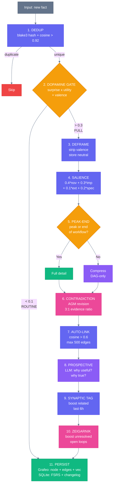

**Key insight**: The dopamine gate (step 2) filters ~80% of facts as ROUTINE,
skipping expensive steps 3-8. Only surprising + useful facts get full
processing. This saves massive LLM token costs.

---

## Read Pipeline

What happens when the agent calls `nika:recall`:

### The 10 Signals

| # | Signal | Source | What it measures |
|---|--------|--------|-----------------|
| 1 | BM25 keywords | Grafeo | Exact word matches in content + anticipations |
| 2 | HNSW cosine | Grafeo | Semantic similarity (384d embedding space) |
| 3 | PageRank | Grafeo | Structural importance in the knowledge graph |
| 4 | ACT-R activation | SQLite | Recency + frequency of access (spreading activation) |
| 5 | Query intent | Rust | Question, Action, Recall, Code, Visual |
| 6 | Confidence x FSRS | SQLite | Node confidence * retrievability R(t,S) |
| 7 | Interference | Rust | Penalty for very similar competing results |
| 8 | Salience | Grafeo | Encoding importance (4-factor score) |
| 9 | Context congruence | Rust | Does recall context match encoding context? (Tulving 1973) |
| 10 | Modality match | Rust | Does retrieval mode match how it was stored? (Morris 1977) |

**Signals 1-3** execute as ONE Grafeo query (native hybrid RRF).
**Signals 4-10** are computed in Rust post-processing.
**Final merge**: Reciprocal Rank Fusion with adaptive k = max(1, count/10).

### Post-Filters

After RRF merge, before returning results:

| Filter | What it does | Source |
|--------|-------------|--------|
| Dunning-Kruger | Halve confidence if < 5 facts on topic | Kruger & Dunning 1999 |
| Adversarial | 15% budget for contradicting evidence | Anti confirmation bias |
| Endowment | 30% budget floor for fresh data, 1.3x novelty boost | Thaler 1980 |
| Serial position | +15% boost for middle items | Murdock 1962 |
| Importance > Urgency | importance^1.5 * urgency^0.8 | Zhu et al. 2018 |

### Context Assembly Modes

| Mode | GQL Query | Use case |
|------|-----------|----------|
| `workflow` | `MATCH (n) WHERE n.source = 'workflow:X'` | All memory from current workflow |
| `task` | `MATCH (n)-[*1..2]-(m) WHERE n.id = $id` | 2-hop neighborhood |
| `knowledge` | `MATCH (n:Semantic)` | Facts only, no episodes |
| `targeted` | `MATCH (n {id: $e})-[*1..N]-(m)` | Entity + N-hop expansion |

---

## The Knowledge Graph

### Node Structure

Every memory is a **node** in the Grafeo graph with these properties:

```
Node (:Semantic)
+---------------------------+
| id: blake3 hash           |
| content: "Claude is good  |
|   for structured output"  |
| node_type: "fact"         |
| confidence: 0.92          |
| salience: 0.78            |
| surprise: 0.65            |
| anticipations:            |
|   ["useful for provider   |
|    selection workflows"]  |
| embedding: [0.23, -0.15,  |
|   0.87, ...] (384d)       |
+---------------------------+
```

Plus cognitive state in SQLite:

```
CognitiveState
+---------------------------+
| activation: 2.34          |  <- ACT-R
| storage_strength: 3.1     |  <- Bjork (only goes up)
| retrieval_strength: 0.85  |  <- Bjork (decays)
| fsrs_stability: 48.0h     |  <- half-life
| fsrs_elapsed: 12.5h       |  <- since last access
| access_log: [10:00, 14:30 |  <- for ACT-R calc
|   16:45]                  |
+---------------------------+
```

### Edge Types

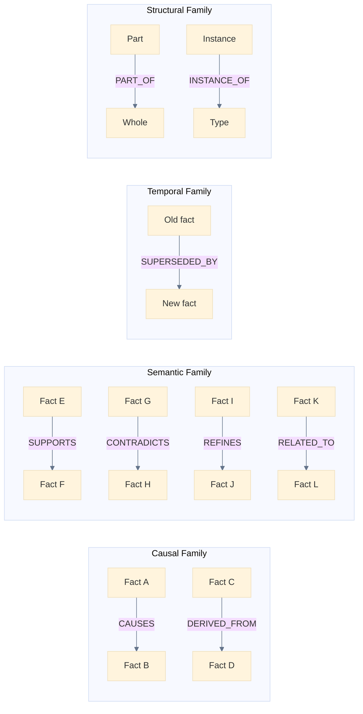

Every edge has a **Hebbian weight** that strengthens with co-access (+2.5%)
and weakens when misleading (-10%). Floor at 0.05. Half-life 24h.

### Auto-Evolving Ontology

The schema grows with usage:

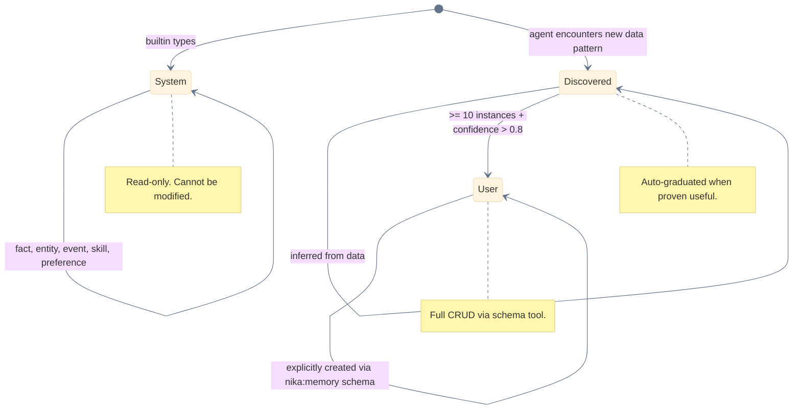

**Example**: After running 15 SEO workflows, the system discovers a recurring
data pattern with `keyword`, `volume`, `difficulty` fields. It auto-creates
a `Discovered` type called `seo_keyword`. After 10+ instances with consistent
schema and confidence > 0.8, it graduates to `User` realm.

---

## Consolidation (Background Daemon)

The "sleep" cycle. Runs periodically via the Nika daemon.

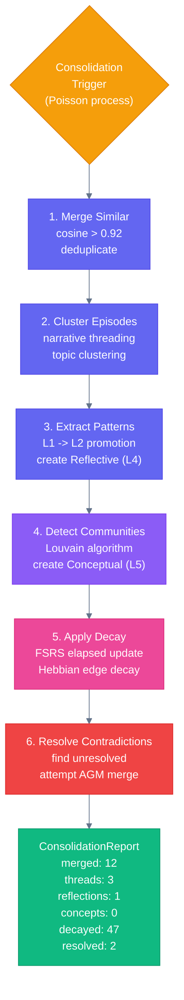

**Why Poisson, not fixed interval?** Fixed consolidation creates temporal bias.
The interval is modulated by accumulated surprise: more surprising facts =
shorter interval (like hippocampal sharp-wave ripples during sleep).

---

## Concrete Example

A real workflow scenario showing Egghead in action:

### Step 1: First Podcast Workflow

```yaml
# podcast.nika.yaml
schema: "nika/workflow@0.12"
workflow: podcast-gen

tasks:
  - id: research
    infer: "Research topic: AI memory systems"

  - id: script
    depends_on: [research]
    with: { data: $research }
    infer: "Write podcast script from: {{with.data}}"

  - id: remember_result    # <-- EGGHEAD IN ACTION
    depends_on: [script]
    with: { script: $script }
    invoke:
      tool: "nika:remember"
      params:
        content: "Podcast script generation works well with research-first approach"
        kind: procedural
        mode: store
```

**What happens internally**:

1. **Dedup**: blake3 hash is new, no near-match in Grafeo
2. **Gate**: surprise=0.8 (first podcast), utility=0.9 → 0.72 > 0.3 → FULL PROCESSING
3. **Deframe**: content is already neutral
4. **Salience**: novelty=0.9, importance=0.7 → salience=0.79
5. **Peak-End**: this IS the end of the workflow → full detail
6. **Contradiction**: no existing facts about podcasts → clean
7. **Auto-link**: no existing related facts → no edges (first time)
8. **Prospective**: LLM says "useful for future podcast and content workflows"
9. **Synaptic tag**: no recent related facts
10. **Zeigarnik**: workflow succeeded → no open loop
11. **Persist**: Grafeo node `:Procedural` + embedding + SQLite FSRS init

### Step 2: Second Podcast Workflow (one week later)

```yaml
tasks:
  - id: recall_past
    invoke:
      tool: "nika:recall"
      params:
        query: "podcast generation best approach"
        mode: query
        budget_tokens: 1000
```

**What happens internally**:

1. **System 1**: Grafeo hybrid → finds the L3:Procedural node, confidence 0.82 < 0.85
2. **Escalate to System 2**: full 10-signal pipeline
3. **Signal 4 (ACT-R)**: activation from access_log (1 access, 7 days ago)
4. **Signal 6 (FSRS)**: retrievability = (1 + 168/(9*24))^(-1) = 0.56 (decayed)
5. **Dunning-Kruger**: only 1 fact about podcasts → penalty: effective confidence 0.30
6. **Result**: returns the fact with a low coverage warning

**After recall**: access_log updated (+1), FSRS on_recall() increases stability
from 24h to 38h (testing effect). Next time, this fact will be easier to recall.

### Step 3: After 10 Podcast Workflows

The system now has 10+ podcast-related facts:
- "research-first approach works" (L3, reliability 0.9)
- "ffmpeg concat for audio merge" (L3, reliability 0.85)
- "ElevenLabs v3 best for French" (L2, confidence 0.92)
- 7 episodic events from different runs

**Consolidation detects**:
- Episode cluster → creates narrative thread "podcast production"
- Pattern: "workflows using ffmpeg concat succeed 85% of the time" → L4 Reflective
- Louvain: "media production" community → L5 Conceptual hub

**Next recall** for "podcast": Dunning-Kruger no longer penalizes (10+ facts).
The L5 Conceptual hub accelerates PageRank traversal. Response is richer and
more confident.

---

## The 3 Tools

### nika:remember

| Mode | What it does |
|------|-------------|
| `store` | Full 11-step write pipeline. Stores a new fact. |
| `revise` | Supersedes an existing fact (never deletes). Creates SupersededBy edge. |
| `correct` | Records that a recalled fact was wrong. Hebbian penalty. Closed-loop learning. |

### nika:recall

| Mode | What it does |
|------|-------------|
| `query` | 10-signal dual-process retrieval. Returns evidence packets. |
| `consolidate` | Manually trigger consolidation cycle. |
| `export` | Dump memory as YAML, JSON, or NDJSON artifact. |

### nika:memory

| Mode | What it does |
|------|-------------|
| `schema` | List, get, create, or auto-evolve node types. |
| `audit` | CSR score, orphans, stale facts, echo chamber index. |
| `history` | Changelog, diff between timestamps, rollback. |

---

## Implementation Phases

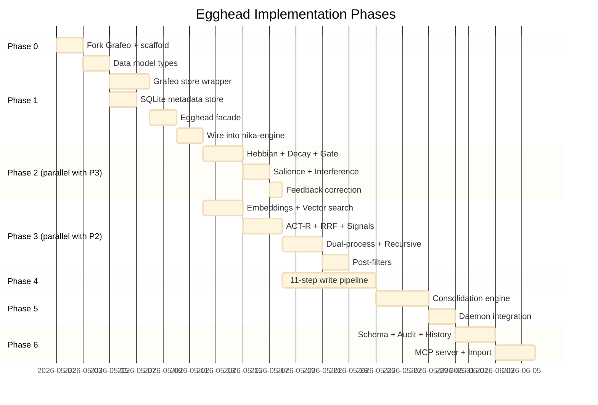

### LOC by Phase

| Phase | LOC | Tests | Cumulative |
|-------|-----|-------|-----------|
| P0 Scaffold | 50 | 0 | 50 |
| P1 Foundation | 1,400 | 400 | 1,850 |
| P2 Cognitive Core | 700 | 350 | 2,900 |
| P3 Deep Retrieval | 1,200 | 400 | 4,500 |
| P4 Write Intelligence | 900 | 350 | 5,750 |
| P5 Consolidation | 700 | 250 | 6,700 |
| P6 Polish | 800 | 250 | 7,750 |
| **Total** | **5,750** | **2,000** | **7,750** |

---

## Crate Structure

```
tools/nika-memory/ (42 files)
|
+-- Cargo.toml                       grafeo + rusqlite + fastembed(opt)
+-- src/
    +-- lib.rs                       Egghead facade
    |
    +-- store/
    |   +-- grafeo.rs                Grafeo wrapper (graph + vec + fts)
    |   +-- meta.rs                  SQLite (FSRS, ACT-R, triggers)
    |   +-- dedup.rs                 blake3 + cosine dedup
    |   +-- embed.rs                 fastembed wrapper (feature-gated)
    |
    +-- memory/
    |   +-- node.rs                  CortexNode + CognitiveState
    |   +-- edge.rs                  CortexEdge + EdgeType + EdgeFamily
    |   +-- types.rs                 MemoryKind + Realm + Source + NodeType
    |   +-- evidence.rs              EvidencePacket + SignalScores + RecallResult
    |
    +-- cognitive/                   22 mechanism files
    |   +-- mod.rs                   All constants
    |   +-- hebbian.rs               1  Edge strengthening
    |   +-- decay.rs                 2  FSRS-6 + ACT-R + Bjork
    |   +-- gate.rs                  3  Dopamine gate + valence
    |   +-- anticipation.rs          4  Prospective indexing
    |   +-- consolidation.rs         5  Narrative + replay
    |   +-- contradiction.rs         6  AGM belief revision
    |   +-- salience.rs              7  4-factor encoding
    |   +-- feedback.rs              8  Correction loop
    |   +-- tagging.rs               9  Synaptic 6h window
    |   +-- interference.rs          10 Proactive/retroactive
    |   +-- autolink.rs              11 Zettelkasten
    |   +-- triggers.rs              12 Conditional recall
    |   +-- peak_end.rs              13 Peak-End compression
    |   +-- dunning_kruger.rs        14 Sparse topic penalty
    |   +-- deframe.rs               15 Valence stripping
    |   +-- echo_chamber.rs          16 Anti-echo-chamber
    |   +-- dual_process.rs          17 System 1 / System 2
    |   +-- zeigarnik.rs             18 Incomplete priority
    |   +-- challenger.rs            19 Anti sunk-cost
    |   +-- adversarial.rs           20 Devil's advocate
    |   +-- endowment.rs             21 Fresh data correction
    |   +-- goal_gradient.rs         22 Progressive narrowing
    |
    +-- retrieval/
    |   +-- mod.rs                   HybridRetriever
    |   +-- grafeo_query.rs          Grafeo hybrid (BM25+HNSW+PageRank)
    |   +-- postprocess.rs           Post-filters
    |   +-- rrf.rs                   RRF merge (adaptive k)
    |   +-- activation.rs            ACT-R spreading
    |   +-- recursive.rs             RLM recursive (depth 3)
    |   +-- assembly.rs              4 context modes
    |   +-- signals.rs               Signal extractors
    |
    +-- tools/
    |   +-- remember.rs              nika:remember (3 modes)
    |   +-- recall.rs                nika:recall (3 modes)
    |   +-- memory_admin.rs               nika:memory (3 modes)
    |
    +-- mcp/
    |   +-- mod.rs                   MCP server for external tools
    |
    +-- import/
        +-- hermes.rs                Hermes SKILL.md import
        +-- claude.rs                Claude MEMORY.md import
        +-- ndjson.rs                Nika NDJSON migration
```

---

## Fork Strategy

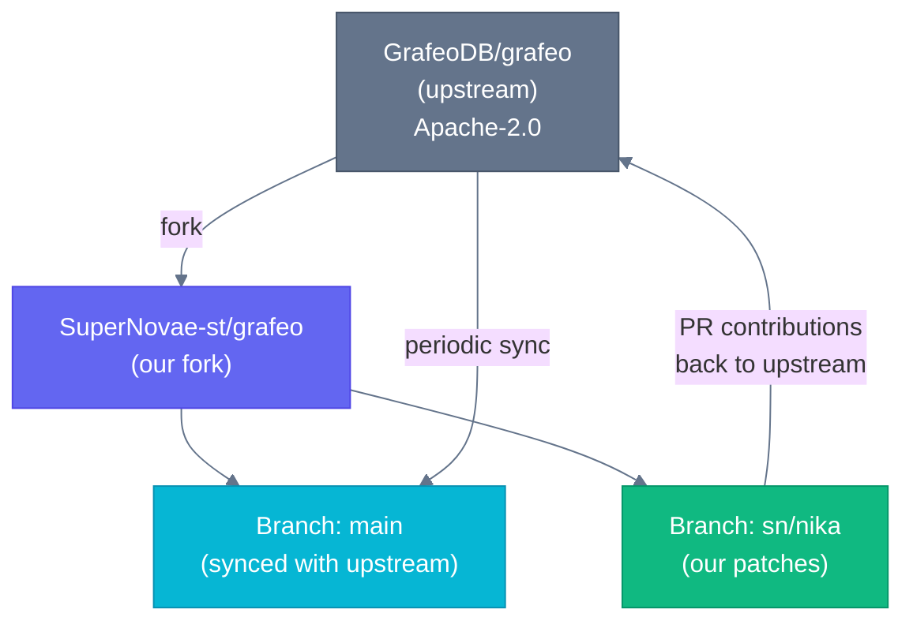

**Cargo.toml phases**:
- Phase 1: `grafeo = "=0.5.30"` (crates.io pinned)
- Phase 2: `grafeo = { git = "...SuperNovae-st/grafeo", rev = "..." }` (if patches)
- Phase 3: `nika-grafeo = "0.6.0-sn.1"` (if heavy divergence)

---

## Scientific Foundations

140 years of cognitive science in one crate.

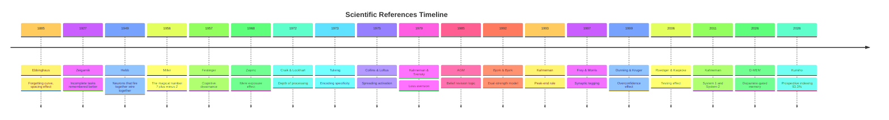

---

## Research Behind This Design

| Metric | Count |
|--------|-------|
| Research agents deployed | 39 |
| Academic papers analyzed | 37+ |
| Rust crates examined | 80+ |
| Psychology patterns mapped | 106 (growth.design) |
| Academic references | 70+ |
| Rust projects deep-dived | 7 (Grafeo, Shodh, Vestige, ICM, Pensyve, Nocturne, Memvid) |
| Core algorithm LOC (verified, licensed) | 440 |

---

*Nika Egghead. The brain of Vegapunk, in Rust.*
*One file. Any AI. And now, a memory that thinks.*

---

## What to Read Next

| Document | What it contains |
|----------|-----------------|
| `docs/plans/2026-03-31-egghead-implementation-plan.md` | Phase-by-phase implementation with file inventory and LOC estimates |
| `docs/research/2026-03-31-nika-cortex-FINAL.md` | Master design doc with Rust struct definitions and Grafeo queries |
| `docs/research/2026-03-31-nika-cortex-psychology.md` | Full psychology mapping (22 mechanisms + 30 academic references) |
| `docs/research/2026-03-31-nika-cortex-data-model.md` | Complete SQLite schema + Rust struct code |
| `docs/research/memory-algorithms-implementation-guide.md` | Concrete algorithms with LOC, licenses, and crate references |
| `docs/research/2026-03-31-nika-cortex-SESSION-SUMMARY.md` | Full session summary (39 agents, all decisions logged) |
