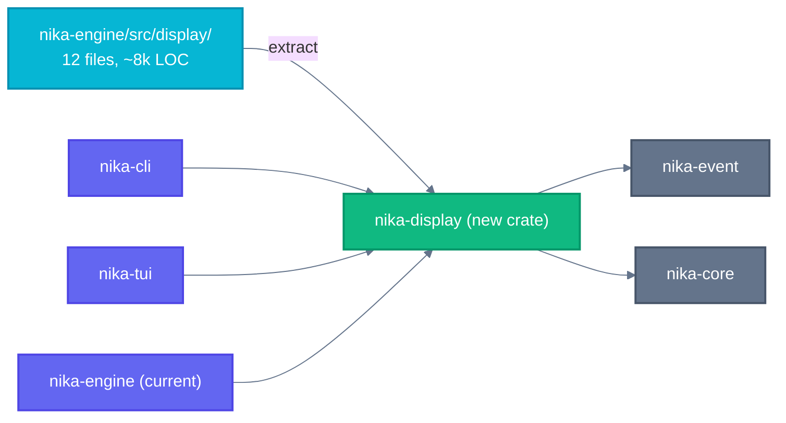
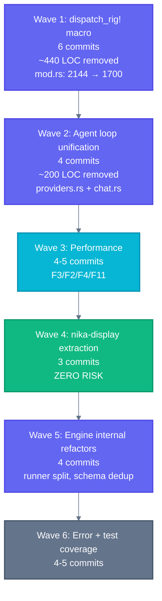

# S4+ Mega Architecture Handoff — Provider Collapse + Engine Refactors

> **Generated**: 2026-04-05 after Session A (6 commits, 9909→9981 tests).
> **Audience**: AI coding agent executing next session autonomously.
> **Philosophy**: Zero dead code. Elegant architecture. 1 fix = 1 commit. TDD always.

---

## Session A Results (What Just Happened)

6 commits landed, tests 9909 → 9981:

| Commit | What |
|--------|------|
| A1 | `raw_chat_completion()` extracted; tools token tracking fixed |
| A2 | `ModelResolver` wired into agent loop (5 hardcoded defaults removed) |
| A3 | CLI model defaults use catalog |
| A4–A6 | 7 OpenAI-compat providers added (20 → 27 providers) |

Current test count: **9,981** (`cargo test --workspace --lib`).

---

## Codebase Orientation

```
tools/
├── nika/                    CLI binary (main.rs, cli/)
├── nika-engine/src/
│   ├── provider/rig/mod.rs  RigProvider enum — THE file for Part 1
│   ├── runtime/
│   │   ├── runner.rs        DAG executor monolith (8,252 LOC)
│   │   ├── for_each.rs      Extracted for_each resolver (partial, ~200 LOC)
│   │   ├── rig_agent_loop/
│   │   │   ├── providers.rs 8 run_*() methods — target for Part 2
│   │   │   └── chat.rs      Second dispatch copy — target for Part 2
│   │   ├── executor/
│   │   │   └── infer.rs     1,798 LOC — infer verb + L0 structured output
│   │   └── structured_output.rs ~1,200 LOC — L2/L3/L4 structured output
│   ├── display/             12 files, ~8k LOC — target for crate extraction
│   └── error.rs             2,802 LOC, 102+ NikaError variants
└── nika-tui/                88k LOC TUI
```

---

## Part 1: Provider Enum Refactor — `dispatch_rig!` Macro

### The Problem

`RigProvider` is a 9-variant enum in `/Users/thibaut/dev/supernovae/nika/tools/nika-engine/src/provider/rig/mod.rs`.

The current variants (line 118):

```rust
pub enum RigProvider {
    Claude(anthropic::Client),      // line 120
    OpenAI(openai::Client),         // line 122
    Mistral(mistral::Client),       // line 124
    Groq(groq::Client),             // line 126
    DeepSeek(deepseek::Client),     // line 128
    Gemini(gemini::Client),         // line 130
    XAi(xai::Client),               // line 132
    OpenAiCompat { client, ... },   // line 135 — 8 fields, stays custom in tools path
    Mock,                           // line 153 — added in S3
    #[cfg(feature = "native-inference")]
    Native(NativeRuntime),          // line 160
}
```

The file is **2,144 lines**. The 5 target methods for `dispatch_rig!`:

| Method | Approx line | Current arms | Pattern |
|--------|-------------|-------------|---------|
| `infer()` | 728 | 7 identical rig-core arms | `client.agent(model_id).max_tokens(n).build(); agent.prompt(prompt)` |
| `infer_with_tools()` dispatch | 1,160 | 7 rig-core arms (OpenAiCompat stays custom) | `build_agent_with_tools!(client)` macro exists |
| `infer_with_options()` dispatch | 1,319 | 7 rig-core arms (OpenAiCompat stays custom) | `build_and_prompt!(client)` macro exists |
| `infer_stream_inner()` | 1,632 | 8 rig-core arms (Native separate) | 140 lines of near-identical blocks |
| `infer_stream_with_options_inner()` | 1,915 | 8 rig-core arms (Native separate) | same pattern as above |

### Architecture Decision

**DO NOT** collapse to 3 variants (RigCore/OpenAiCompat/Mock). Moving the match one level deeper does not reduce arms — it just hides them. Keep the flat enum, apply macro dispatch.

**DO NOT** use trait objects (`Box<dyn ProviderTrait>`). Async trait objects with generics require `dyn_async_traits` or workarounds. The macro approach compiles to monomorphized code — zero overhead.

### The `dispatch_rig!` Macro

Add this macro near the top of `mod.rs`, after the imports and before `impl RigProvider`:

```rust
/// Dispatch to the rig-core client for all standard providers.
///
/// Reduces 7 identical match arms to 1. The body expression gets the
/// extracted client binding `$client`. OpenAiCompat, Mock, and Native
/// are NOT dispatched through this macro — they have custom paths.
///
/// IMPORTANT: the `$body` expression may be `.await`-ed inside the macro.
/// Rust macros expand before type checking, so each arm gets its own
/// monomorphized async block. Streams must be consumed INSIDE `$body`
/// because the stream type is not `Send` across arms.
macro_rules! dispatch_rig {
    ($self:expr, |$client:ident| $body:expr) => {
        match $self {
            RigProvider::Claude($client)    => $body,
            RigProvider::OpenAI($client)   => $body,
            RigProvider::Mistral($client)  => $body,
            RigProvider::Groq($client)     => $body,
            RigProvider::DeepSeek($client) => $body,
            RigProvider::Gemini($client)   => $body,
            RigProvider::XAi($client)      => $body,
            RigProvider::OpenAiCompat { client: $client, .. } => $body,
            RigProvider::Mock => {
                unreachable!("mock provider generates responses in executor, not via RigProvider")
            }
            #[cfg(feature = "native-inference")]
            RigProvider::Native(_) => {
                unreachable!("native uses a dedicated non-rig-core path")
            }
        }
    };
}
```

### Provider Flag Methods to Add

Add these to `impl RigProvider` alongside `name()` and `supports_native_structured_output()`:

```rust
/// True only for Anthropic/Claude — controls `is_anthropic` param in
/// `consume_rig_stream` (thinking block capture, stop_reason mapping).
pub fn is_anthropic(&self) -> bool {
    matches!(self, RigProvider::Claude(_))
}

/// True if this provider supports vision/multimodal content.
/// Used to give an early, clear error before attempting the call.
pub fn supports_vision(&self) -> bool {
    !matches!(self, RigProvider::DeepSeek(_) | RigProvider::Mock)
}

/// True if extended thinking (chain-of-thought) is supported.
pub fn supports_thinking(&self) -> bool {
    matches!(self, RigProvider::Claude(_))
}
```

### Refactor Execution Order

Execute in this exact order (each is one commit):

#### Step 1.1 — Add macro + flag methods (no behavior change)

File: `/Users/thibaut/dev/supernovae/nika/tools/nika-engine/src/provider/rig/mod.rs`

Add `dispatch_rig!` macro and the 3 flag methods. Run `cargo test --workspace --lib`. Should be green — nothing changed yet.

Commit: `refactor(provider): add dispatch_rig! macro + is_anthropic/supports_vision/supports_thinking helpers`

#### Step 1.2 — Refactor `infer_stream_inner()` (biggest win, ~130 LOC removed)

Current code (lines 1632–1855): 8 separate blocks, each doing:

```rust
RigProvider::Claude(client) => {
    let model = client.completion_model(model_id);
    let request = model.completion_request(prompt).max_tokens(effective_max_tokens).build();
    let stream_start = Instant::now();
    let mut stream = model.stream(request).await.map_err(|e| RigInferError::PromptError(e.to_string()))?;
    consume_rig_stream(&mut stream, &tx, &mut response_parts, &mut result, true, stream_start).await?;
}
RigProvider::OpenAI(client) => {
    // same, but is_anthropic=false
}
// ... 5 more identical blocks
```

Replace all 8 rig-core arms + OpenAiCompat arm with:

```rust
match self {
    #[cfg(feature = "native-inference")]
    RigProvider::Native(runtime) => {
        // keep the existing native streaming block unchanged (lines 1818–1855)
    }
    RigProvider::Mock => {
        unreachable!("mock provider generates responses in executor, not via RigProvider")
    }
    _ => {
        // dispatch_rig! handles the remaining 8 variants
        let is_anthropic = self.is_anthropic();
        dispatch_rig!(self, |client| {
            let model = client.completion_model(model_id);
            let request = model
                .completion_request(prompt)
                .max_tokens(effective_max_tokens)
                .build();
            let stream_start = Instant::now();
            let mut stream = model
                .stream(request)
                .await
                .map_err(|e| RigInferError::PromptError(e.to_string()))?;
            consume_rig_stream(
                &mut stream,
                &tx,
                &mut response_parts,
                &mut result,
                is_anthropic,
                stream_start,
            )
            .await?;
        });
    }
}
```

Commit: `refactor(provider): dispatch_rig! in infer_stream_inner() — 130 LOC removed`

#### Step 1.3 — Refactor `infer_stream_with_options_inner()` (~130 LOC removed)

Current code (lines 1915–2143): same pattern as `infer_stream_inner()`, but uses `build_request_with_options!` macro (which already exists at line 1945).

The `build_request_with_options!` macro produces a stream via `model.stream(rb.build()).await`. The stream type differs per provider, so it must be consumed inside the macro/dispatch body.

Replace the 8 rig-core arms (lines 1967–2071 in the options variant) with:

```rust
match self {
    #[cfg(feature = "native-inference")]
    RigProvider::Native(runtime) => {
        // keep existing native block unchanged
    }
    RigProvider::Mock => unreachable!("..."),
    _ => {
        let is_anthropic = self.is_anthropic();
        dispatch_rig!(self, |client| {
            let stream_start = Instant::now();
            let mut stream = build_request_with_options!(client);
            consume_rig_stream(
                &mut stream,
                &tx,
                &mut response_parts,
                &mut result,
                is_anthropic,
                stream_start,
            )
            .await?;
        });
    }
}
```

Commit: `refactor(provider): dispatch_rig! in infer_stream_with_options_inner() — 130 LOC removed`

#### Step 1.4 — Refactor `infer()` (~40 LOC removed)

Current code (lines 741–869): 7 rig-core arms all doing:

```rust
let agent = client.agent(model_id).max_tokens(effective_max_tokens).build();
timeout(INFER_TIMEOUT, agent.prompt(prompt))
    .await
    .map_err(|_| RigInferError::Timeout { duration_ms: INFER_TIMEOUT.as_millis() as u64 })?
    .map_err(|e: PromptError| RigInferError::PromptError(e.to_string()))
```

Replace with:

```rust
match self {
    RigProvider::OpenAiCompat { raw_base_url, raw_api_key, timeout_secs, http_client, .. } => {
        // keep existing custom HTTP path unchanged
    }
    RigProvider::Mock => unreachable!("..."),
    #[cfg(feature = "native-inference")]
    RigProvider::Native(runtime) => {
        // keep existing native path unchanged
    }
    _ => dispatch_rig!(self, |client| {
        let agent = client.agent(model_id).max_tokens(effective_max_tokens).build();
        timeout(INFER_TIMEOUT, agent.prompt(prompt))
            .await
            .map_err(|_| RigInferError::Timeout { duration_ms: INFER_TIMEOUT.as_millis() as u64 })?
            .map_err(|e: PromptError| RigInferError::PromptError(e.to_string()))
    }),
}
```

Commit: `refactor(provider): dispatch_rig! in infer() — 40 LOC removed`

#### Step 1.5 — Refactor `infer_with_tools()` dispatch (~35 LOC removed)

Current code (lines 1202–1292): the `build_agent_with_tools!` macro already exists (line 1177). The 7 rig-core arms are identical applications of that macro. OpenAiCompat arm stays completely custom (raw HTTP tool call).

```rust
let result = timeout(effective_timeout, async {
    match self {
        RigProvider::OpenAiCompat { ... } => {
            // keep existing custom raw HTTP path (lines 1211–1281)
        }
        RigProvider::Mock => unreachable!("..."),
        #[cfg(feature = "native-inference")]
        RigProvider::Native(_) => Err(RigInferError::PromptError("...".to_string())),
        _ => dispatch_rig!(self, |client| build_agent_with_tools!(client)),
    }
})
```

Commit: `refactor(provider): dispatch_rig! in infer_with_tools() — 35 LOC removed`

#### Step 1.6 — Refactor `infer_with_options()` dispatch (~35 LOC removed)

Current code (lines 1372–1432): the `build_and_prompt!` macro exists (line 1350). 7 identical rig-core arms apply it.

```rust
match self {
    RigProvider::OpenAiCompat { ... } => {
        // keep existing raw HTTP path
    }
    RigProvider::Mock => unreachable!("..."),
    #[cfg(feature = "native-inference")]
    RigProvider::Native(runtime) => {
        // keep existing native path
    }
    _ => dispatch_rig!(self, |client| build_and_prompt!(client)),
}
```

Commit: `refactor(provider): dispatch_rig! in infer_with_options() — 35 LOC removed`

### Expected Result

| Metric | Before | After |
|--------|--------|-------|
| mod.rs LOC | ~2,144 | ~1,700 |
| LOC removed | — | ~440 |
| Match arms (across 5 methods) | ~40 | ~15 |
| Test count | green | green |

---

## Part 2: Agent Loop Unification

### Current State

`/Users/thibaut/dev/supernovae/nika/tools/nika-engine/src/runtime/rig_agent_loop/providers.rs`

8 run methods exist:

```
run_mock()      — lines 25–87
run_claude()    — lines 89–131
run_openai()    — lines 133–150
run_mistral()   — lines 220–235
run_groq()      — lines 237–253
run_deepseek()  — lines 255–271
run_gemini()    — lines 273–289
run_xai()       — lines 291–307
run_auto()      — lines 165–213
```

`run_claude()`, `run_openai()`, `run_mistral()`, `run_groq()`, `run_deepseek()`, `run_gemini()`, `run_xai()` are identical in structure:

```rust
pub async fn run_<provider>(&mut self) -> Result<RigAgentLoopResult, NikaError> {
    let model_name = self.params.model.clone()
        .ok_or_else(|| NikaError::ValidationError { reason: "model field is required..." })?;
    let client = rig::providers::<provider>::Client::from_env();
    self.run_agent_loop(client, &model_name, Some(ProviderKind::<Variant>)).await
}
```

The only irreducible case is `run_claude()` which intercepts `extended_thinking: true` → `run_claude_with_thinking()`.

`run_auto()` (lines 165–213) dispatches to the 7 per-provider methods based on `self.params.provider`.

`/Users/thibaut/dev/supernovae/nika/tools/nika-engine/src/runtime/rig_agent_loop/chat.rs`

`chat_continue()` (lines 87–143) has a SECOND copy of the same dispatch. It calls 7 `chat_continue_<provider>()` wrappers (lines 154–216), each a 4-line wrapper around `chat_continue_with_model()`.

### The Plan

#### Step 2.1 — Add unified `run()` method

Add to `providers.rs`:

```rust
/// Unified entry point — replaces run_claude/run_openai/run_mistral/run_groq/
/// run_deepseek/run_gemini/run_xai. Extended thinking intercept stays in run_claude_with_thinking.
pub async fn run(&mut self) -> Result<RigAgentLoopResult, NikaError> {
    // Intercept extended thinking (Anthropic-only, completely separate path)
    if self.params.extended_thinking == Some(true) {
        return self.run_claude_with_thinking().await;
    }

    let provider_name = self.params.provider.as_ref().map(|p| p.as_str())
        .ok_or_else(|| NikaError::AgentValidationError {
            reason: "provider is required for agent: tasks (model field sets provider context)".to_string(),
        })?;

    let resolved = crate::core::find_provider(provider_name).ok_or_else(|| {
        NikaError::AgentValidationError {
            reason: format!("Unknown provider: '{}'. ...", provider_name),
        }
    })?;

    let model_name = self.params.model.clone()
        .ok_or_else(|| NikaError::ValidationError {
            reason: "model field is required for LLM verbs (NIKA-034)".to_string(),
        })?;

    match resolved.id {
        "anthropic" => {
            let client = rig::providers::anthropic::Client::from_env();
            self.run_agent_loop(client, &model_name, Some(ProviderKind::Claude)).await
        }
        "openai" => {
            let client = rig::providers::openai::Client::from_env();
            self.run_agent_loop(client, &model_name, Some(ProviderKind::OpenAI)).await
        }
        "mistral" => {
            let client = rig::providers::mistral::Client::from_env();
            self.run_agent_loop(client, &model_name, Some(ProviderKind::Mistral)).await
        }
        "groq" => {
            let client = rig::providers::groq::Client::from_env();
            self.run_agent_loop(client, &model_name, Some(ProviderKind::Groq)).await
        }
        "deepseek" => {
            let client = rig::providers::deepseek::Client::from_env();
            self.run_agent_loop(client, &model_name, Some(ProviderKind::DeepSeek)).await
        }
        "gemini" => {
            let client = rig::providers::gemini::Client::from_env();
            self.run_agent_loop(client, &model_name, Some(ProviderKind::Gemini)).await
        }
        "xai" => {
            let client = rig::providers::xai::Client::from_env();
            self.run_agent_loop(client, &model_name, Some(ProviderKind::XAi)).await
        }
        "native" => Err(NikaError::AgentValidationError {
            reason: "Provider 'native' is not supported for agent: tasks. Use a cloud provider.".to_string(),
        }),
        _ => Err(NikaError::AgentValidationError {
            reason: format!("Provider '{}' is not supported for agent: tasks.", resolved.id),
        }),
    }
}
```

Commit: `refactor(agent): add unified run() method — replaces 7 run_<provider> wrappers`

#### Step 2.2 — Update `run_auto()` to use `run()`

`run_auto()` currently auto-detects the provider, sets `self.params.provider`, then dispatches. After `run()` exists, `run_auto()` simplifies to: auto-detect → set `self.params.provider` → call `self.run()`.

Commit: `refactor(agent): run_auto() delegates to run()`

#### Step 2.3 — Delete the 7 per-provider wrappers

Delete `run_claude()`, `run_openai()`, `run_mistral()`, `run_groq()`, `run_deepseek()`, `run_gemini()`, `run_xai()`. Verify nothing calls them externally (use grep first).

```bash
# Before deleting, verify
grep -r "run_claude\|run_openai\|run_mistral\|run_groq\|run_deepseek\|run_gemini\|run_xai" \
  /Users/thibaut/dev/supernovae/nika/tools --include="*.rs"
```

Expected: only defined in `providers.rs`, called only from `run_auto()` (which now calls `run()`).

Commit: `refactor(agent): delete 7 redundant run_<provider>() wrappers — 120 LOC removed`

#### Step 2.4 — Unify `chat.rs` dispatch

The `chat_continue()` dispatch at line 87 uses the same provider match. After `run()` exists, the pattern for `chat_continue_with_model()` can be similarly unified.

Add `chat_continue_unified()` that takes the provider client generically, then delete the 7 `chat_continue_<provider>()` wrappers (lines 154–216).

The generic constraint from `run_agent_loop` applies:

```rust
async fn dispatch_chat<C>(&mut self, prompt: &str, client: C) -> Result<RigAgentLoopResult, NikaError>
where
    C: CompletionClient,
    C::CompletionModel: Clone + 'static,
    <C::CompletionModel as CompletionModel>::Response: Send,
{
    let model_name = self.resolve_model_name()?;
    let model = client.completion_model(&model_name);
    self.chat_continue_with_model(prompt, model, &model_name).await
}
```

Commit: `refactor(agent): unify chat_continue() dispatch — 80 LOC removed`

---

## Part 3: Performance Optimizations

### HIGH Priority

#### F3 — `value_to_array()` clones entire array

File: `/Users/thibaut/dev/supernovae/nika/tools/nika-engine/src/runtime/runner.rs`

Find the `value_to_array` function or inline code that calls `.to_owned()` / `.clone()` on a `Value::Array` to expand `for_each` items. This copies the entire array for every `for_each` task spawn.

Fix: Use `Cow<'_, [Value]>` or wrap in `Arc<[Value]>` so each spawned task shares a reference.

Commit: `perf(engine): Cow/Arc for for_each item array — avoid full clone`

#### F2 — `response_parts Vec<String>` accumulation

File: `/Users/thibaut/dev/supernovae/nika/tools/nika-engine/src/provider/rig/mod.rs`

Current code (lines 1641, 1926):

```rust
let mut response_parts: Vec<String> = Vec::new();
// ... inside consume_rig_stream:
response_parts.push(token.clone());
// ... at end:
let complete_response = response_parts.concat();
```

Fix: Replace with a single `String` buffer using `push_str()` pre-allocated to a reasonable capacity:

```rust
let mut response_buf = String::with_capacity(4096);
// inside loop: response_buf.push_str(&token);
// at end: let complete_response = response_buf;
```

This eliminates the intermediate `Vec<String>` allocation and the `concat()` final allocation.

Commit: `perf(provider): String buffer replaces Vec<String> response_parts — fewer allocations`

### MEDIUM Priority

#### F4 — `to_value()` deep-clones for telemetry

Find all `serde_json::to_value(&bindings)` or `Arc<Value>` wrapping in the telemetry path. Replace the clone with an `Arc<Value>` so telemetry and the executor share ownership.

Commit: `perf(engine): Arc<Value> for telemetry — avoid deep clone in hot path`

#### F11 — `TaskExecutor::clone()` copies `skills_map`

File: `/Users/thibaut/dev/supernovae/nika/tools/nika-engine/src/runtime/executor/mod.rs`

If `TaskExecutor` derives `Clone` and holds a `HashMap` of skills, every spawned task gets a full copy. Wrap with `Arc<HashMap<...>>`.

Commit: `perf(engine): Arc<HashMap> for skills_map in TaskExecutor`

---

## Part 4: Crate Extraction

### Phase 1: nika-display (ZERO RISK, execute first)



Source: `/Users/thibaut/dev/supernovae/nika/tools/nika-engine/src/display/`
Target: New `/Users/thibaut/dev/supernovae/nika/tools/nika-display/`

Files to move (from `display/mod.rs` re-exports):

```
bench.rs, bench_cache.rs, check.rs, cli_format.rs, colors.rs,
dag.rs, dag_render.rs, detail.rs, format_event.rs, header.rs,
icons.rs, live.rs, renderer.rs, run_renderer.rs, spinner.rs, summary.rs, tests.rs
```

Dependencies of `display/` (check imports):
- `nika-event` — `EventKind`, `Event`
- `nika-core` — provider types, workflow types for summary
- `colored` — terminal coloring
- `indicatif` — progress bars (live.rs only)

Zero circular dependency risk: `display/` never imports from `runtime/` or `provider/`.

Steps:
1. Create `tools/nika-display/Cargo.toml` with those deps
2. Move files, fix `crate::` paths → `nika_display::` or relative
3. In `nika-engine/Cargo.toml`: add `nika-display = { path = "../nika-display" }`
4. In `nika-engine/src/display/mod.rs`: replace all content with re-exports from `nika_display`
5. Add `nika-display` to `tools/Cargo.toml` workspace members
6. Run `cargo test --workspace --lib`

Commits:
- `chore(workspace): add nika-display crate skeleton`
- `refactor(display): move display/ → nika-display crate`
- `refactor(engine): re-export nika-display from nika-engine`

### Phase 2: nika-provider (HIGH IMPACT, after Phase 1)

Source: `nika-engine/src/provider/` + `runtime/rig_agent_loop/` + `runtime/structured_output.rs`

One non-trivial dependency to invert: `PolicyCheck` is in `nika-engine/src/runtime/policy.rs` and is used inside `provider/`. Extract `PolicyCheck` trait to `nika-core` first.

---

## Part 5: Engine Internal Refactors

### 5.1 — `runner.rs` split (1,384-line `run()` monolith)

File: `/Users/thibaut/dev/supernovae/nika/tools/nika-engine/src/runtime/runner.rs`

The `run()` method on `Runner` has three phases. Extract to private methods:

```rust
impl Runner {
    pub async fn run(&mut self) -> Result<Value, NikaError> {
        let assets = self.init_run().await?;
        let result = self.run_dag_loop(assets).await?;
        self.finalize_run(result).await
    }

    async fn init_run(&mut self) -> Result<ResolvedAssets, NikaError> {
        // lockfile, trace config, renderer init, asset loading
    }

    async fn run_dag_loop(&mut self, assets: ResolvedAssets) -> Result<Value, NikaError> {
        // the main while !all_done loop with JoinSet
    }

    async fn finalize_run(&mut self, result: Value) -> Result<Value, NikaError> {
        // artifact manifest, trace pruning, summary render
    }
}
```

Commit: `refactor(runner): split run() monolith → init_run/run_dag_loop/finalize_run`

### 5.2 — Schema loading dedup in `infer.rs`

File: `/Users/thibaut/dev/supernovae/nika/tools/nika-engine/src/runtime/executor/infer.rs`

The schema `$ref` resolution pattern appears 3 times. Extract:

```rust
async fn load_schema_ref(
    schema_ref: &str,
    bindings: &ResolvedBindings,
    datastore: &RunContext,
) -> Result<serde_json::Value, NikaError> {
    // single implementation
}
```

Commit: `refactor(infer): extract load_schema_ref() — remove triplication`

### 5.3 — `from_name` / `from_name_with_endpoints` dedup

File: `/Users/thibaut/dev/supernovae/nika/tools/nika-engine/src/provider/rig/mod.rs`

Lines 186–279 (`from_name`) and the corresponding section in `from_name_with_endpoints` both have 7 identical OpenAI-compat provider entries. Extract a static URL table:

```rust
/// (provider_id, base_url, env_var_key)
static OPENAI_COMPAT_PROVIDERS: &[(&str, &str, &str)] = &[
    ("openrouter", "https://openrouter.ai/api/v1",            "OPENROUTER_API_KEY"),
    ("together",   "https://api.together.xyz/v1",             "TOGETHER_API_KEY"),
    ("fireworks",  "https://api.fireworks.ai/inference/v1",   "FIREWORKS_API_KEY"),
    ("cerebras",   "https://api.cerebras.ai/v1",              "CEREBRAS_API_KEY"),
    ("sambanova",  "https://api.sambanova.ai/v1",             "SAMBANOVA_API_KEY"),
    ("cohere",     "https://api.cohere.com/compatibility/v1", "COHERE_API_KEY"),
    ("ai21",       "https://api.ai21.com/studio/v1",          "AI21_API_KEY"),
];
```

Both `from_name` and `from_name_with_endpoints` iterate this table.

Commit: `refactor(provider): OPENAI_COMPAT_PROVIDERS static table — dedup from_name*`

---

## Part 6: Error System Cleanup

### 6.1 — WorkflowTimeout missing NIKA-038 prefix

File: `/Users/thibaut/dev/supernovae/nika/tools/nika-engine/src/error.rs`

Search for `WorkflowTimeout` variant. Its display impl should include `[NIKA-038]` but likely doesn't.

```bash
grep -n "WorkflowTimeout" /Users/thibaut/dev/supernovae/nika/tools/nika-engine/src/error.rs
```

Fix: Add `[NIKA-038]` to the error message string.

Commit: `fix(error): add NIKA-038 prefix to WorkflowTimeout display`

### 6.2 — Unify `fix_suggestion()` implementation

File: `/Users/thibaut/dev/supernovae/nika/tools/nika-engine/src/error.rs`

There is a `FixSuggestion` trait (line 79) and a `fix_suggestion_for_code()` free function. The instance method should delegate:

```rust
impl NikaError {
    pub fn fix_suggestion(&self) -> Option<String> {
        fix_suggestion_for_code(self.code())
    }
}
```

Verify this is not already the case before making the change.

Commit: `refactor(error): fix_suggestion() delegates to fix_suggestion_for_code()`

### 6.3 — `FetchExhausted`/`TaskRetry`/`ProviderAutoRetried` bypass `format_event`

File: `/Users/thibaut/dev/supernovae/nika/tools/nika-engine/src/display/format_event.rs`

These events are emitted but the renderer receives raw ANSI strings rather than going through `format_event`. Find the bypass and route through `format_event`.

Commit: `fix(display): route FetchExhausted/TaskRetry/ProviderAutoRetried through format_event`

---

## Part 7: Test Coverage Gaps

### Priority targets (0 tests → meaningful tests)

#### renderer.rs — 0 tests for 1,593 LOC

File: `/Users/thibaut/dev/supernovae/nika/tools/nika-engine/src/display/renderer.rs`

Key functions to test:
- `RunStats::apply_event()` — given an `EventKind`, verify stats fields update correctly
- `format_output_preview()` — given a long string, verify truncation at expected length
- `CliRenderer::render_kind()` — smoke test that it doesn't panic for all EventKind variants

Pattern (no API calls needed):

```rust
#[cfg(test)]
mod tests {
    use super::*;
    use crate::event::EventKind;

    #[test]
    fn run_stats_apply_task_completed() {
        let mut stats = RunStats::default();
        stats.apply_event(&EventKind::TaskCompleted {
            task_id: Arc::from("step1"),
            output: serde_json::json!("result"),
        });
        assert_eq!(stats.completed, 1);
        assert_eq!(stats.failed, 0);
    }
}
```

Commit: `test(display): add RunStats and CliRenderer unit tests — renderer.rs 0→N`

#### `error.rs` — 0 tests for 102 error variants

Test that every `NikaError` variant returns a non-empty `code()`:

```rust
#[test]
fn all_nika_errors_have_codes() {
    // construct representative errors and check code() format
    let err = NikaError::ValidationError { reason: "test".to_string() };
    assert!(err.code().starts_with("NIKA-"), "code was: {}", err.code());
}
```

Commit: `test(error): verify NIKA-XXX code format for error variants`

#### `infer.rs` — 6 tests, needs more

File: `/Users/thibaut/dev/supernovae/nika/tools/nika-engine/src/runtime/executor/infer.rs`

Add mock provider tests for:
- Guardrail length check (min/max words)
- Fallback chain trigger (provider A fails → provider B succeeds)
- `response_format: json` parsing
- System prompt injection from skills

Use `provider: mock` for all — no API calls.

Commit: `test(infer): add guardrail/fallback/response_format unit tests — 6→12`

---

## Execution Order and Wave Plan



### Wave 1 — `dispatch_rig!` (highest architectural ROI)

Skills needed: `/spn-rust:rust-core`, `/spn-powers:test-driven-development`

| Step | Action | Commit type |
|------|--------|------------|
| 1.1 | Add macro + flag methods | `refactor(provider)` |
| 1.2 | `infer_stream_inner()` | `refactor(provider)` |
| 1.3 | `infer_stream_with_options_inner()` | `refactor(provider)` |
| 1.4 | `infer()` | `refactor(provider)` |
| 1.5 | `infer_with_tools()` | `refactor(provider)` |
| 1.6 | `infer_with_options()` | `refactor(provider)` |

After each step: `cargo test --workspace --lib` must be green before next step.

### Wave 2 — Agent loop (clear duplication)

Skills needed: `/spn-rust:rust-async-expert`, `/spn-powers:test-driven-development`

| Step | Action | Commit type |
|------|--------|------------|
| 2.1 | Add `run()` unified method | `refactor(agent)` |
| 2.2 | `run_auto()` delegates to `run()` | `refactor(agent)` |
| 2.3 | Delete 7 per-provider wrappers | `refactor(agent)` |
| 2.4 | Unify `chat.rs` dispatch | `refactor(agent)` |

### Wave 3 — Performance

Skills needed: `/spn-rust:rust-perf`

| Step | Action | Commit type |
|------|--------|------------|
| 3.1 | F3: `value_to_array` Cow/Arc | `perf(engine)` |
| 3.2 | F2: `response_parts` → `String` buffer | `perf(provider)` |
| 3.3 | F4: `Arc<Value>` for telemetry | `perf(engine)` |
| 3.4 | F11: `Arc<HashMap>` skills_map | `perf(engine)` |

### Wave 4 — nika-display extraction

Skills needed: `/spn-rust:rust-architect`

| Step | Action | Commit type |
|------|--------|------------|
| 4.1 | Create crate skeleton + Cargo.toml | `chore(workspace)` |
| 4.2 | Move display files, fix imports | `refactor(display)` |
| 4.3 | Wire nika-engine re-exports | `refactor(engine)` |

### Wave 5 — Engine internal refactors

| Step | Action | Commit type |
|------|--------|------------|
| 5.1 | `runner.rs` run() split | `refactor(runner)` |
| 5.2 | Schema `$ref` dedup in `infer.rs` | `refactor(infer)` |
| 5.3 | `OPENAI_COMPAT_PROVIDERS` static table | `refactor(provider)` |

### Wave 6 — Error + test coverage

| Step | Action | Commit type |
|------|--------|------------|
| 6.1 | NIKA-038 prefix fix | `fix(error)` |
| 6.2 | `fix_suggestion()` unification | `refactor(error)` |
| 6.3 | `format_event` routing fix | `fix(display)` |
| 6.4 | `renderer.rs` tests (0 → N) | `test(display)` |
| 6.5 | `error.rs` NIKA-XXX code tests | `test(error)` |
| 6.6 | `infer.rs` guardrail tests (6 → 12) | `test(infer)` |

**Total estimated commits: 25–31**

---

## Invariants — Never Break These

```
cargo test --workspace --lib          # must be green after EVERY commit
No trait objects for provider dispatch  # use dispatch_rig! macro
No 3-variant collapse                   # keep flat enum
AGPL-3.0-or-later license header       # on all new files
Zero backward compat (v0)              # no deprecation wrappers needed
1 fix = 1 commit                       # no batching
TDD: test first, implement second      # always
dispatch_rig! macro approach           # NOT trait objects, NOT collapse
```

---

## Key File Paths (Absolute)

| What | Path |
|------|------|
| Provider enum (primary target) | `/Users/thibaut/dev/supernovae/nika/tools/nika-engine/src/provider/rig/mod.rs` |
| Agent loop providers | `/Users/thibaut/dev/supernovae/nika/tools/nika-engine/src/runtime/rig_agent_loop/providers.rs` |
| Agent loop chat | `/Users/thibaut/dev/supernovae/nika/tools/nika-engine/src/runtime/rig_agent_loop/chat.rs` |
| DAG runner monolith | `/Users/thibaut/dev/supernovae/nika/tools/nika-engine/src/runtime/runner.rs` |
| Infer verb | `/Users/thibaut/dev/supernovae/nika/tools/nika-engine/src/runtime/executor/infer.rs` |
| Error system | `/Users/thibaut/dev/supernovae/nika/tools/nika-engine/src/error.rs` |
| Display module | `/Users/thibaut/dev/supernovae/nika/tools/nika-engine/src/display/` |
| Display renderer | `/Users/thibaut/dev/supernovae/nika/tools/nika-engine/src/display/renderer.rs` |
| format_event | `/Users/thibaut/dev/supernovae/nika/tools/nika-engine/src/display/format_event.rs` |
| Workspace Cargo.toml | `/Users/thibaut/dev/supernovae/nika/tools/Cargo.toml` |
| Grand Nettoyage master plan | `/Users/thibaut/dev/supernovae/nika/docs/plans/2026-04-04-grand-nettoyage-master-plan.md` |

---

## Context on Prior Sessions

| Session | Status | Tests |
|---------|--------|-------|
| S1 — Security Hardening | DONE | 9,871 |
| S2 — Runner Decomposition | DONE | 9,909 |
| S3 — Provider Layer Cleanup | DONE | 9,909 |
| Session A — Provider Expansion | DONE | 9,981 |
| S4+ (this document) | NEXT | start: 9,981 |

S3 added `RigProvider::Mock` as a proper enum variant (removed string sentinel).
S3 also confirmed: all 14 "dead" event variants were actually alive (earlier audit was wrong).
Session A added `raw_chat_completion()` helper, wired `ModelResolver` into agent loop, added 7 OpenAI-compat providers.

The provider file is now **2,144 lines**. After Wave 1 it should be **~1,700 lines**.
