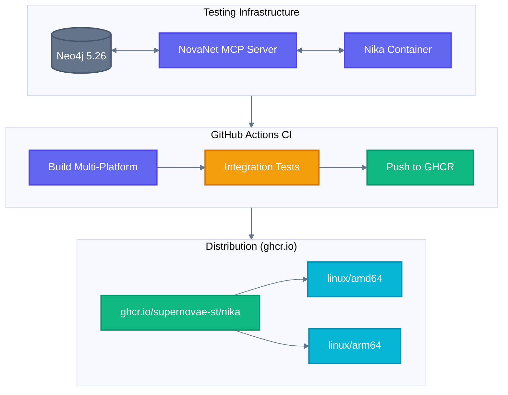
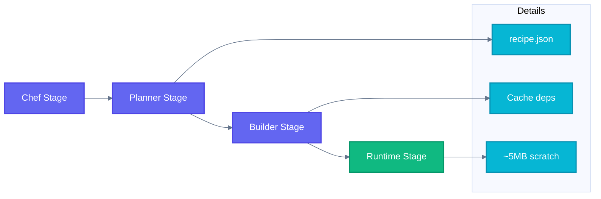
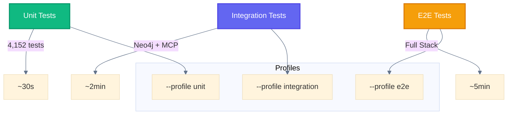
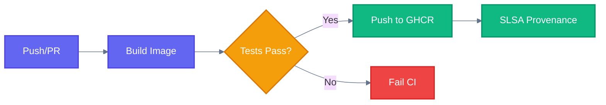
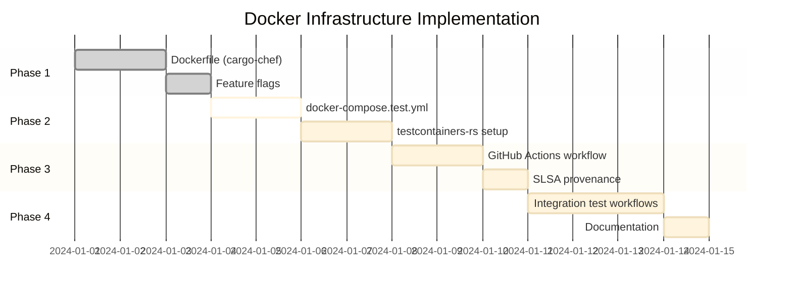

# Docker Infrastructure Master Plan

> Comprehensive Docker strategy for Nika distribution, testing, and development.

## Overview Architecture



---

## Table of Contents

- [Plan A: Docker Distribution](#plan-a-docker-distribution)
- [Plan B: Testing Infrastructure](#plan-b-testing-infrastructure)
- [Plan C: CI/CD Pipeline](#plan-c-cicd-pipeline)
- [Plan D: Integration Test Patterns](#plan-d-integration-test-patterns)
- [Plan E: Workflow Test Snippets](#plan-e-workflow-test-snippets)

---

## Plan A: Docker Distribution

### A.1 Build Strategy: cargo-chef Pattern



The cargo-chef pattern provides **10x faster rebuilds** by separating dependency compilation from application build.

### A.2 Dockerfile Implementation

```dockerfile
# syntax=docker/dockerfile:1.6
# =============================================================================
# Nika CLI — Static Multi-Platform Docker Image (cargo-chef pattern)
# =============================================================================
# Build: docker buildx build --platform linux/amd64,linux/arm64 -t nika .
# Run:   docker run --rm ghcr.io/supernovae-st/nika:latest --version
# =============================================================================

# Stage 1: Chef base with cargo-chef installed
FROM --platform=$BUILDPLATFORM rust:1.85-alpine AS chef
RUN apk add --no-cache musl-dev openssl-dev openssl-libs-static pkgconfig
RUN cargo install cargo-chef --locked
WORKDIR /app

# Stage 2: Planner - analyze dependencies
FROM chef AS planner
COPY Cargo.toml Cargo.lock ./
COPY src ./src
RUN cargo chef prepare --recipe-path recipe.json

# Stage 3: Builder - cache dependencies, then build
FROM chef AS builder

# Build arguments for cross-compilation
ARG TARGETARCH
RUN case "${TARGETARCH}" in \
        amd64) echo "x86_64-unknown-linux-musl" > /tmp/target ;; \
        arm64) echo "aarch64-unknown-linux-musl" > /tmp/target ;; \
        *) echo "unsupported architecture" && exit 1 ;; \
    esac

# Install cross-compilation toolchain for ARM64
RUN if [ "${TARGETARCH}" = "arm64" ]; then \
        apk add --no-cache gcc-aarch64-linux-musl; \
    fi

# Add target
RUN rustup target add $(cat /tmp/target)

# Cook dependencies (cached layer)
COPY --from=planner /app/recipe.json recipe.json
RUN --mount=type=cache,target=/usr/local/cargo/registry \
    --mount=type=cache,target=/usr/local/cargo/git \
    cargo chef cook --release --target $(cat /tmp/target) --recipe-path recipe.json

# Build application
COPY . .
RUN --mount=type=cache,target=/usr/local/cargo/registry \
    --mount=type=cache,target=/usr/local/cargo/git \
    cargo build --release --target $(cat /tmp/target) --bin nika \
    && mkdir -p /release \
    && cp target/$(cat /tmp/target)/release/nika /release/

# Stage 4: Minimal runtime (scratch = ~5MB)
FROM scratch AS runtime

# OCI Labels
LABEL org.opencontainers.image.source="https://github.com/supernovae-st/nika"
LABEL org.opencontainers.image.description="Nika — Semantic YAML Workflow Engine for AI"
LABEL org.opencontainers.image.licenses="AGPL-3.0-or-later"
LABEL org.opencontainers.image.vendor="SuperNovae Studio"
LABEL org.opencontainers.image.title="nika"
LABEL org.opencontainers.image.url="https://supernovae.studio"

# Copy static binary
COPY --from=builder /release/nika /nika

# Working directory for mounted workflows
WORKDIR /workspace

ENTRYPOINT ["/nika"]
CMD ["--help"]
```

### A.3 Feature Flags for Docker

```toml
# Cargo.toml additions
[features]
default = ["tui", "spn-daemon"]
docker = ["tui"]  # Exclude spn-daemon (no keychain in container)
minimal = []      # CLI only, no TUI
```

**Note:** Docker builds use `--features docker` to exclude OS keychain support. Use environment variables for secrets.

### A.4 Image Size Comparison

| Base Image | Size | Use Case |
|------------|------|----------|
| `scratch` | ~5MB | Production (static musl) |
| `alpine:3.19` | ~12MB | Debug (with shell) |
| `debian:bookworm-slim` | ~80MB | Feature-rich |
| `rust:1.85` | ~1.5GB | Development only |

---

## Plan B: Testing Infrastructure

### B.1 docker-compose.test.yml

```yaml
# docker-compose.test.yml
# Usage: docker compose -f docker-compose.test.yml --profile integration up

name: nika-test

services:
  # Neo4j for NovaNet integration
  neo4j:
    image: neo4j:5.26.0-community
    container_name: nika-test-neo4j
    environment:
      NEO4J_AUTH: neo4j/testpassword
      NEO4J_PLUGINS: '["apoc"]'
      NEO4J_apoc_export_file_enabled: "true"
      NEO4J_apoc_import_file_enabled: "true"
    ports:
      - "7474:7474"
      - "7687:7687"
    volumes:
      - neo4j_test_data:/data
    healthcheck:
      test: ["CMD-SHELL", "wget --no-verbose --tries=1 --spider http://localhost:7474 || exit 1"]
      interval: 10s
      timeout: 10s
      retries: 10
      start_period: 30s
    networks:
      - nika-test-network
    profiles:
      - integration
      - e2e

  # NovaNet MCP Server
  novanet-mcp:
    build:
      context: ../../../../novanet/tools/novanet-mcp
      dockerfile: Dockerfile
    container_name: nika-test-novanet
    environment:
      NOVANET_MCP_NEO4J_URI: bolt://neo4j:7687
      NOVANET_MCP_NEO4J_USER: neo4j
      NOVANET_MCP_NEO4J_PASSWORD: testpassword
    depends_on:
      neo4j:
        condition: service_healthy
    networks:
      - nika-test-network
    profiles:
      - integration
      - e2e

  # Nika test runner
  nika-test:
    build:
      context: .
      dockerfile: Dockerfile
      target: builder  # Use builder stage with full toolchain
    container_name: nika-test-runner
    command: cargo nextest run --features docker
    environment:
      NOVANET_MCP_NEO4J_URI: bolt://neo4j:7687
      ANTHROPIC_API_KEY: ${ANTHROPIC_API_KEY:-}
    depends_on:
      novanet-mcp:
        condition: service_started
    volumes:
      - cargo_cache:/usr/local/cargo/registry
      - cargo_git:/usr/local/cargo/git
      - target_cache:/app/target
    networks:
      - nika-test-network
    profiles:
      - integration

volumes:
  neo4j_test_data:
  cargo_cache:
  cargo_git:
  target_cache:

networks:
  nika-test-network:
    driver: bridge
```

### B.2 Test Profiles



| Profile | Services | Duration | Use Case |
|---------|----------|----------|----------|
| `unit` | None | ~30s | CI fast check |
| `integration` | Neo4j + NovaNet MCP | ~2min | MCP tests |
| `e2e` | Full stack + LLM | ~5min | Release validation |

### B.3 testcontainers-rs Integration

For Rust-native container testing without docker-compose:

```rust
// tests/integration/neo4j_test.rs
use testcontainers::compose::DockerCompose;
use nika::mcp::McpClient;

#[tokio::test]
async fn test_novanet_mcp_connection() -> Result<(), Box<dyn std::error::Error>> {
    // Start Neo4j via Docker Compose
    let mut compose = DockerCompose::with_local_client(&[
        "docker-compose.test.yml"
    ]);
    compose.up().await?;

    // Wait for Neo4j to be healthy
    let neo4j_port = compose.get_host_port_ipv4("neo4j", 7687).await?;
    let bolt_url = format!("bolt://localhost:{}", neo4j_port);

    // Test MCP connection
    let client = McpClient::connect_stdio(
        "cargo",
        &["run", "--manifest-path", "../novanet-mcp/Cargo.toml"],
        vec![
            ("NOVANET_MCP_NEO4J_URI", bolt_url.as_str()),
            ("NOVANET_MCP_NEO4J_USER", "neo4j"),
            ("NOVANET_MCP_NEO4J_PASSWORD", "testpassword"),
        ],
    ).await?;

    // Verify novanet_describe tool exists
    let tools = client.list_tools().await?;
    assert!(tools.iter().any(|t| t.name == "novanet_describe"));

    Ok(())
    // Automatic cleanup on drop
}
```

---

## Plan C: CI/CD Pipeline

### C.1 GitHub Actions Workflow

```yaml
# .github/workflows/docker.yml
name: Docker Build & Push

on:
  push:
    branches: [main]
    tags: ['v*']
  pull_request:
    branches: [main]

env:
  REGISTRY: ghcr.io
  IMAGE_NAME: ${{ github.repository }}

jobs:
  build-and-push:
    runs-on: ubuntu-latest
    permissions:
      contents: read
      packages: write
      attestations: write
      id-token: write

    steps:
      - name: Checkout
        uses: actions/checkout@v4

      - name: Set up QEMU
        uses: docker/setup-qemu-action@v3

      - name: Set up Docker Buildx
        uses: docker/setup-buildx-action@v3

      - name: Log in to GHCR
        if: github.event_name != 'pull_request'
        uses: docker/login-action@v3
        with:
          registry: ${{ env.REGISTRY }}
          username: ${{ github.actor }}
          password: ${{ secrets.GITHUB_TOKEN }}

      - name: Extract metadata
        id: meta
        uses: docker/metadata-action@v5
        with:
          images: ${{ env.REGISTRY }}/${{ env.IMAGE_NAME }}
          tags: |
            type=ref,event=branch
            type=ref,event=pr
            type=semver,pattern={{version}}
            type=semver,pattern={{major}}.{{minor}}
            type=sha

      - name: Build and push
        id: push
        uses: docker/build-push-action@v6
        with:
          context: ./tools/nika
          platforms: linux/amd64,linux/arm64
          push: ${{ github.event_name != 'pull_request' }}
          tags: ${{ steps.meta.outputs.tags }}
          labels: ${{ steps.meta.outputs.labels }}
          cache-from: type=gha
          cache-to: type=gha,mode=max
          build-args: |
            VERSION=${{ github.ref_name }}

      - name: Generate SLSA provenance
        if: github.event_name != 'pull_request'
        uses: actions/attest-build-provenance@v2
        with:
          subject-name: ${{ env.REGISTRY }}/${{ env.IMAGE_NAME }}
          subject-digest: ${{ steps.push.outputs.digest }}
          push-to-registry: true

  integration-tests:
    needs: build-and-push
    runs-on: ubuntu-latest
    services:
      neo4j:
        image: neo4j:5.26.0-community
        env:
          NEO4J_AUTH: neo4j/testpassword
          NEO4J_PLUGINS: '["apoc"]'
        ports:
          - 7474:7474
          - 7687:7687
        options: >-
          --health-cmd "wget --no-verbose --tries=1 --spider http://localhost:7474 || exit 1"
          --health-interval 10s
          --health-timeout 10s
          --health-retries 10
          --health-start-period 30s

    steps:
      - name: Checkout
        uses: actions/checkout@v4

      - name: Setup Rust
        uses: dtolnay/rust-action@stable

      - name: Run integration tests
        env:
          NOVANET_MCP_NEO4J_URI: bolt://localhost:7687
          NOVANET_MCP_NEO4J_USER: neo4j
          NOVANET_MCP_NEO4J_PASSWORD: testpassword
        run: |
          cargo nextest run --features docker -E 'test(/integration/)'
```

### C.2 CI Pipeline Flow



---

## Plan D: Integration Test Patterns

### D.1 MCP Connection Test

```yaml
# examples/test-suite/integration/01-mcp-connection.nika.yaml
schema: "nika/workflow@0.10"
workflow: test-mcp-connection
description: "Verify MCP server connectivity"

mcp:
  novanet:
    command: cargo
    args:
      - run
      - --manifest-path
      - ../novanet-mcp/Cargo.toml
    env:
      NOVANET_MCP_NEO4J_URI: ${NOVANET_MCP_NEO4J_URI:-bolt://localhost:7687}
      NOVANET_MCP_NEO4J_USER: ${NOVANET_MCP_NEO4J_USER:-neo4j}
      NOVANET_MCP_NEO4J_PASSWORD: ${NOVANET_MCP_NEO4J_PASSWORD:-novanetpassword}

tasks:
  - id: describe_schema
    description: "Test novanet_describe tool"
    invoke:
      server: novanet
      tool: novanet_describe
      params:
        describe: schema
    output:
      format: json

  - id: verify_schema
    description: "Verify schema response"
    use:
      schema: describe_schema
    exec:
      command: |
        echo '{{use.schema}}' | jq -e '.node_classes | length > 0'
      shell: true
    flow: [describe_schema]
```

### D.2 Entity Traversal Test

```yaml
# examples/test-suite/integration/02-entity-traversal.nika.yaml
schema: "nika/workflow@0.10"
workflow: test-entity-traversal
description: "Test NovaNet graph traversal"

mcp:
  novanet:
    command: cargo
    args: [run, --manifest-path, ../novanet-mcp/Cargo.toml]
    env:
      NOVANET_MCP_NEO4J_URI: ${NOVANET_MCP_NEO4J_URI:-bolt://localhost:7687}
      NOVANET_MCP_NEO4J_USER: neo4j
      NOVANET_MCP_NEO4J_PASSWORD: ${NOVANET_MCP_NEO4J_PASSWORD:-novanetpassword}

tasks:
  - id: search_entity
    description: "Search for QR Code entity"
    invoke:
      server: novanet
      tool: novanet_search
      params:
        query: "QR Code"
        kinds: ["Entity"]
        mode: fulltext
        limit: 5
    output:
      format: json

  - id: traverse_from_entity
    description: "Traverse from entity to native content"
    use:
      entity: search_entity
    invoke:
      server: novanet
      tool: novanet_traverse
      params:
        start_key: "entity:qr-code"
        max_depth: 2
        direction: outgoing
        arc_families: [localization, ownership]
    output:
      format: json
    flow: [search_entity]

  - id: verify_traversal
    description: "Verify traversal results"
    use:
      nodes: traverse_from_entity
    exec:
      command: |
        echo '{{use.nodes}}' | jq -e '.nodes | length >= 0'
      shell: true
    flow: [traverse_from_entity]
```

### D.3 Content Generation Test

```yaml
# examples/test-suite/integration/03-content-generation.nika.yaml
schema: "nika/workflow@0.10"
workflow: test-content-generation
description: "Test full Nika↔NovaNet content generation pipeline"

provider: claude
model: claude-sonnet-4-6

mcp:
  novanet:
    command: cargo
    args: [run, --manifest-path, ../novanet-mcp/Cargo.toml]
    env:
      NOVANET_MCP_NEO4J_URI: ${NOVANET_MCP_NEO4J_URI:-bolt://localhost:7687}
      NOVANET_MCP_NEO4J_USER: neo4j
      NOVANET_MCP_NEO4J_PASSWORD: ${NOVANET_MCP_NEO4J_PASSWORD:-novanetpassword}

tasks:
  - id: assemble_context
    description: "Assemble context for French QR Code page"
    invoke:
      server: novanet
      tool: novanet_generate
      params:
        focus_key: "entity:qr-code"
        locale: fr-FR
        mode: page
        token_budget: 8000
    output:
      format: json

  - id: generate_hero
    description: "Generate hero section content"
    use:
      ctx: assemble_context
    infer:
      prompt: |
        Generate a hero section for a QR Code AI landing page in French.

        CONTEXT FROM NOVANET:
        {{use.ctx}}

        RULES:
        - Use denomination_forms EXACTLY as provided
        - Follow ADR-033: text for prose, title for headings
        - Output valid JSON
      temperature: 0.3
      system: "You are a French copywriter. Output JSON only."
    output:
      format: json
      schema:
        type: object
        required: [headline, description, cta]
        properties:
          headline:
            type: string
            description: "H1 headline using title form"
          description:
            type: string
            description: "2-3 sentences using text form"
          cta:
            type: string
            description: "Call-to-action button text"
      max_retries: 2
    flow: [assemble_context]

  - id: validate_output
    description: "Validate generated content"
    use:
      hero: generate_hero
    exec:
      command: |
        echo '{{use.hero}}' | jq -e '.headline and .description and .cta'
      shell: true
    flow: [generate_hero]
```

---

## Plan E: Workflow Test Snippets

### E.1 All 5 Verbs Integration Test

```yaml
# examples/test-suite/integration/04-all-verbs.nika.yaml
schema: "nika/workflow@0.10"
workflow: test-all-verbs-integration
description: "Test all 5 semantic verbs with NovaNet"

provider: claude
model: claude-sonnet-4-6

mcp:
  novanet:
    command: cargo
    args: [run, --manifest-path, ../novanet-mcp/Cargo.toml]
    env:
      NOVANET_MCP_NEO4J_URI: ${NOVANET_MCP_NEO4J_URI:-bolt://localhost:7687}
      NOVANET_MCP_NEO4J_USER: neo4j
      NOVANET_MCP_NEO4J_PASSWORD: ${NOVANET_MCP_NEO4J_PASSWORD:-novanetpassword}

tasks:
  # 1. exec: - Shell command
  - id: setup_env
    description: "Setup test environment"
    exec:
      command: "echo 'Test started at $(date)' && mkdir -p /tmp/nika-test"
      shell: true

  # 2. fetch: - HTTP request
  - id: fetch_status
    description: "Check Neo4j HTTP endpoint"
    fetch:
      url: "http://localhost:7474"
      method: GET
      timeout: 5
    flow: [setup_env]

  # 3. invoke: - MCP tool call
  - id: invoke_novanet
    description: "Invoke NovaNet MCP tool"
    invoke:
      server: novanet
      tool: novanet_describe
      params:
        describe: stats
    output:
      format: json
    flow: [fetch_status]

  # 4. infer: - LLM generation
  - id: infer_summary
    description: "Generate summary from stats"
    use:
      stats: invoke_novanet
    infer:
      prompt: |
        Summarize these graph statistics in one sentence:
        {{use.stats}}
      temperature: 0.2
      max_tokens: 100
    flow: [invoke_novanet]

  # 5. agent: - Multi-turn agentic loop
  - id: agent_analysis
    description: "Agent analyzes and reports"
    use:
      summary: infer_summary
    agent:
      prompt: |
        Analyze this summary and provide 3 key insights:
        {{use.summary}}

        When done, say "ANALYSIS_COMPLETE".
      mcp: [novanet]
      max_turns: 3
      extended_thinking: false
    output:
      format: json
      schema:
        type: object
        required: [insights]
        properties:
          insights:
            type: array
            items:
              type: string
    flow: [infer_summary]
```

### E.2 Parallel Entity Generation (for_each)

```yaml
# examples/test-suite/integration/05-parallel-generation.nika.yaml
schema: "nika/workflow@0.10"
workflow: test-parallel-entity-generation
description: "Test for_each parallelism with NovaNet"

provider: claude
model: claude-sonnet-4-6

mcp:
  novanet:
    command: cargo
    args: [run, --manifest-path, ../novanet-mcp/Cargo.toml]
    env:
      NOVANET_MCP_NEO4J_URI: ${NOVANET_MCP_NEO4J_URI:-bolt://localhost:7687}
      NOVANET_MCP_NEO4J_USER: neo4j
      NOVANET_MCP_NEO4J_PASSWORD: ${NOVANET_MCP_NEO4J_PASSWORD:-novanetpassword}

inputs:
  locales:
    type: array
    default: ["fr-FR", "en-US", "de-DE", "es-ES"]
  entity:
    type: string
    default: "qr-code"

tasks:
  - id: generate_per_locale
    description: "Generate content for each locale in parallel"
    for_each: "{{inputs.locales}}"
    as: locale
    concurrency: 4
    fail_fast: false
    invoke:
      server: novanet
      tool: novanet_generate
      params:
        focus_key: "entity:{{inputs.entity}}"
        locale: "{{use.locale}}"
        mode: block
        token_budget: 4000
    output:
      format: json

  - id: aggregate_results
    description: "Aggregate all locale results"
    use:
      all_content: generate_per_locale
    infer:
      prompt: |
        Summarize the content generated for these locales:
        {{use.all_content}}

        Output a JSON object with locale codes as keys.
      temperature: 0.2
    output:
      format: json
    flow: [generate_per_locale]
```

### E.3 Agent with spawn_agent

```yaml
# examples/test-suite/integration/06-nested-agents.nika.yaml
schema: "nika/workflow@0.10"
workflow: test-nested-agents
description: "Test spawn_agent for nested agent execution"

provider: claude
model: claude-sonnet-4-6

mcp:
  novanet:
    command: cargo
    args: [run, --manifest-path, ../novanet-mcp/Cargo.toml]
    env:
      NOVANET_MCP_NEO4J_URI: ${NOVANET_MCP_NEO4J_URI:-bolt://localhost:7687}
      NOVANET_MCP_NEO4J_USER: neo4j
      NOVANET_MCP_NEO4J_PASSWORD: ${NOVANET_MCP_NEO4J_PASSWORD:-novanetpassword}

tasks:
  - id: orchestrator_agent
    description: "Orchestrator that spawns sub-agents"
    agent:
      prompt: |
        You are an orchestrator agent. Your task:

        1. Use novanet_search to find entities related to "QR Code"
        2. For each entity found (max 3), use spawn_agent to create a sub-agent
           that will generate a product description for that entity
        3. Collect all sub-agent results
        4. Output a JSON summary

        When complete, say "ORCHESTRATION_COMPLETE".

      mcp: [novanet]
      max_turns: 10
      depth_limit: 2  # Allow 2 levels of nesting
      extended_thinking: false
    output:
      format: json
      schema:
        type: object
        required: [entities_processed, descriptions]
        properties:
          entities_processed:
            type: integer
          descriptions:
            type: array
            items:
              type: object
              properties:
                entity:
                  type: string
                description:
                  type: string
```

---

## Implementation Timeline



---

## Quick Reference

### Commands

```bash
# Build image locally
docker build -t nika:local ./tools/nika

# Build multi-platform
docker buildx build --platform linux/amd64,linux/arm64 \
  -t ghcr.io/supernovae-st/nika:latest ./tools/nika

# Run tests with docker-compose
docker compose -f docker-compose.test.yml --profile integration up

# Run nika in container
docker run --rm -v $(pwd):/workspace ghcr.io/supernovae-st/nika:latest \
  workflow.nika.yaml

# Run nika chat mode
docker run --rm -it -e ANTHROPIC_API_KEY=$ANTHROPIC_API_KEY \
  ghcr.io/supernovae-st/nika:latest chat
```

### Environment Variables

| Variable | Description | Default |
|----------|-------------|---------|
| `ANTHROPIC_API_KEY` | Claude API key | - |
| `OPENAI_API_KEY` | OpenAI API key | - |
| `NOVANET_MCP_NEO4J_URI` | Neo4j Bolt URI | `bolt://localhost:7687` |
| `NOVANET_MCP_NEO4J_USER` | Neo4j username | `neo4j` |
| `NOVANET_MCP_NEO4J_PASSWORD` | Neo4j password | - |

---

## References

- [cargo-chef Documentation](https://github.com/lukemathwalker/cargo-chef)
- [testcontainers-rs](https://rust.testcontainers.org/)
- [Docker Buildx](https://docs.docker.com/buildx/working-with-buildx/)
- [GitHub Container Registry](https://docs.github.com/en/packages/working-with-a-github-packages-registry/working-with-the-container-registry)
- [SLSA Provenance](https://slsa.dev/)
