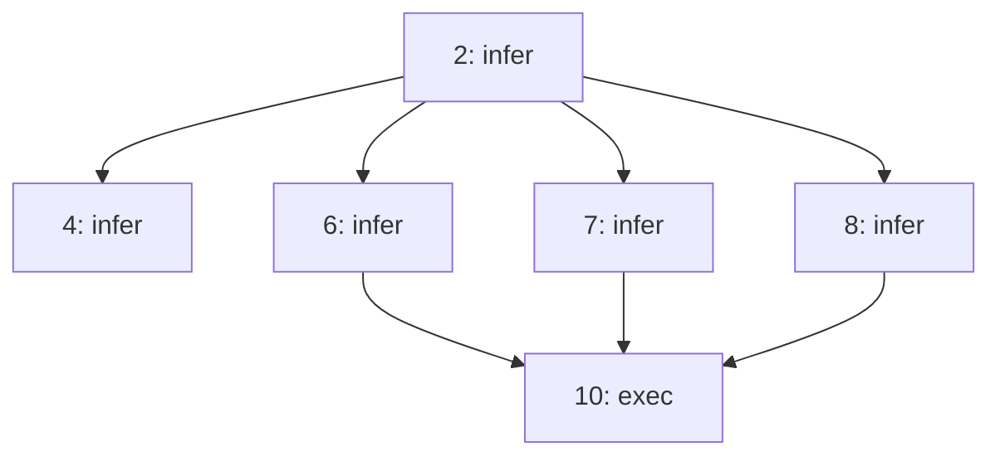

# Chat ↔ Workflow Conversion Specification

**Version:** v0.9.3
**Status:** Design
**Date:** 2026-02-24

---

## Overview

This document specifies the **bidirectional conversion** between Chat sessions and Workflow YAML files, enabling seamless export/import with zero data loss.

```
┌─────────────────┐                      ┌─────────────────┐
│   CHAT VIEW     │                      │  .nika.yaml     │
│  (Interactive)  │                      │   (File)        │
│                 │  ───── EXPORT ─────► │                 │
│  StableGraph    │                      │  YAML AST       │
│  + DataStore    │  ◄──── IMPORT ─────  │                 │
└─────────────────┘                      └─────────────────┘
         │                                       │
         └───────────── SAME EXECUTOR ───────────┘
```

---

## 1. Data Structures

### 1.1 Chat Session Structure

```rust
/// A chat session represented as a DAG
pub struct ChatSession {
    /// Unique session identifier
    pub id: Uuid,

    /// Session metadata
    pub metadata: ChatMetadata,

    /// The DAG of nodes (StableGraph for stable indices)
    pub dag: StableGraph<DagNode, DagEdge>,

    /// Execution results storage
    pub store: DataStore,

    /// Event log for observability
    pub log: EventLog,

    /// Auto-incrementing node counter
    pub node_counter: u32,
}

pub struct ChatMetadata {
    pub created_at: DateTime<Utc>,
    pub updated_at: DateTime<Utc>,
    pub title: Option<String>,        // Auto-generated or user-defined
    pub description: Option<String>,
    pub agent: Option<String>,        // Agent used (e.g., "default", "coder")
    pub tags: Vec<String>,
}

/// A node in the chat DAG
pub struct DagNode {
    pub id: NodeId,                   // Stable index (1, 2, 3, ...)
    pub node_type: NodeType,
    pub created_at: DateTime<Utc>,
    pub metadata: NodeMetadata,
}

pub enum NodeType {
    /// User message input
    UserInput {
        content: String,              // Raw user text
        parsed_mentions: Vec<Mention>, // @1, @last, etc.
        parsed_verb: Option<ParsedVerb>, // /exec, /fetch, etc.
    },

    /// Task execution (5 verbs)
    Task {
        action: TaskAction,           // Infer, Exec, Fetch, Invoke, Agent
        status: TaskStatus,           // Pending, Running, Success, Failed
        output: Option<Value>,        // Execution result
        duration: Option<Duration>,
    },

    /// System message (boot, errors, info)
    SystemMessage {
        level: MessageLevel,          // Info, Warning, Error
        content: String,
    },
}

pub struct NodeMetadata {
    pub tokens_used: Option<TokenUsage>,
    pub model: Option<String>,
    pub provider: Option<String>,
}

/// Edge in the DAG (dependency)
pub struct DagEdge {
    pub edge_type: EdgeType,
}

pub enum EdgeType {
    /// Explicit dependency (user specified @mention)
    Explicit,
    /// Implicit dependency (sequential flow)
    Implicit,
    /// Data binding ({{use.X}})
    Binding { alias: String },
}
```

### 1.2 Workflow YAML Structure (Existing)

```rust
/// Workflow AST (already exists in src/ast/)
pub struct Workflow {
    pub schema: String,               // "nika/workflow@0.3"
    pub workflow: String,             // Workflow name
    pub description: Option<String>,
    pub mcp: Option<McpConfig>,
    pub context: Option<ContextBlock>,
    pub tasks: Vec<Task>,
    pub flows: Option<Vec<Flow>>,
}

pub struct Task {
    pub id: String,
    pub action: TaskAction,           // Same enum as Chat!
    pub depends_on: Option<Vec<String>>,
    pub use_block: Option<WiringSpec>,
    pub output: Option<OutputSpec>,
    pub for_each: Option<ForEachSpec>,
    pub decompose: Option<DecomposeSpec>,
}
```

---

## 2. Export: Chat → Workflow YAML

### 2.1 Conversion Rules

| Chat Element | Workflow Equivalent | Notes |
|--------------|---------------------|-------|
| `NodeType::Task` | `Task` | Direct mapping |
| `NodeType::UserInput` | Comment OR `nika:prompt` | Configurable |
| `NodeType::SystemMessage` | Comment OR omitted | Configurable |
| `@1`, `@2` mentions | `depends_on: ["1", "2"]` | Explicit deps |
| `@last` | `depends_on: ["<last_id>"]` | Resolved to ID |
| `@prev` | `depends_on: ["<prev_id>"]` | Resolved to ID |
| `@all` | `depends_on: [all_previous]` | All prior nodes |
| `// prefix` (parallel) | No `depends_on` | Fork pattern |
| Implicit sequential | `depends_on: ["<prev>"]` | Default flow |
| `EdgeType::Binding` | `use:` block | Data binding |

### 2.2 Export Options

```rust
pub struct ExportOptions {
    /// How to handle UserInput nodes
    pub user_input_mode: UserInputExportMode,

    /// How to handle SystemMessage nodes
    pub system_message_mode: SystemMessageExportMode,

    /// Include execution results as comments
    pub include_results: bool,

    /// Include timing/token metadata as comments
    pub include_metadata: bool,

    /// Preserve original node IDs or renumber sequentially
    pub preserve_ids: bool,

    /// Export format version
    pub schema_version: String,
}

pub enum UserInputExportMode {
    /// Convert to YAML comments (# User: "...")
    AsComment,

    /// Convert to nika:prompt invoke (interactive replay)
    AsPrompt,

    /// Inline into next task's prompt context
    InlineContext,

    /// Omit entirely
    Omit,
}

pub enum SystemMessageExportMode {
    /// Convert to YAML comments
    AsComment,

    /// Omit entirely
    Omit,
}
```

### 2.3 Export Algorithm

```rust
impl ChatSession {
    pub fn export_to_workflow(&self, options: ExportOptions) -> Result<Workflow, ExportError> {
        let mut tasks = Vec::new();
        let mut flows = Vec::new();

        // Topological sort of DAG nodes
        let sorted_nodes = self.dag.topological_sort()?;

        for node_idx in sorted_nodes {
            let node = &self.dag[node_idx];

            match &node.node_type {
                NodeType::Task { action, output, .. } => {
                    // Direct conversion
                    let task = self.convert_task_node(node, &options)?;
                    tasks.push(task);
                }

                NodeType::UserInput { content, parsed_mentions, .. } => {
                    match options.user_input_mode {
                        UserInputExportMode::AsPrompt => {
                            // Create nika:prompt task
                            let task = Task {
                                id: node.id.to_string(),
                                action: TaskAction::Invoke {
                                    tool: "nika:prompt".into(),
                                    server: None,
                                    params: json!({
                                        "message": content,
                                        "type": "confirm"  // or "input"
                                    }),
                                },
                                depends_on: self.get_depends_on(node_idx),
                                ..Default::default()
                            };
                            tasks.push(task);
                        }
                        UserInputExportMode::InlineContext => {
                            // Will be merged into next task
                        }
                        _ => {
                            // AsComment or Omit - handled in YAML serialization
                        }
                    }
                }

                NodeType::SystemMessage { .. } => {
                    // Usually omitted or as comment
                }
            }
        }

        Ok(Workflow {
            schema: options.schema_version,
            workflow: self.metadata.title.clone()
                .unwrap_or_else(|| format!("chat-export-{}", self.id)),
            description: self.metadata.description.clone(),
            tasks,
            flows: if flows.is_empty() { None } else { Some(flows) },
            ..Default::default()
        })
    }

    fn get_depends_on(&self, node_idx: NodeIndex) -> Option<Vec<String>> {
        let incoming: Vec<String> = self.dag
            .edges_directed(node_idx, Direction::Incoming)
            .map(|edge| {
                let source = edge.source();
                self.dag[source].id.to_string()
            })
            .collect();

        if incoming.is_empty() {
            None
        } else {
            Some(incoming)
        }
    }
}
```

### 2.4 Export Example

**Chat Session:**
```
[1:UserInput] "Génère un header pour QR Code AI"
      │
      ▼
[2:Task:infer] → "# Welcome to QR Code AI"
      │
      ▼
[3:UserInput] "Traduis @2 en français"
      │
      ▼
[4:Task:infer] → "# Bienvenue sur QR Code AI"
      │
      ▼
[5:UserInput] "//Génère 3 variantes du header"
      │
      ├──► [6:Task:infer] → "# QR Code AI - Scan the Future"
      ├──► [7:Task:infer] → "# QR Code AI - Connect Instantly"
      └──► [8:Task:infer] → "# QR Code AI - Your Digital Bridge"
      │
      ▼
[9:UserInput] "Combine @6 @7 @8 dans un fichier"
      │
      ▼
[10:Task:exec] → { exit_code: 0 }
```

**Exported YAML (UserInputExportMode::AsComment):**
```yaml
schema: nika/workflow@0.3
workflow: chat-export-header-generation
description: "Exported from chat session on 2026-02-24"

# Exported from Chat Session: a1b2c3d4-...
# Agent: default
# Duration: 2m 34s

tasks:
  # User: "Génère un header pour QR Code AI"
  - id: "2"
    infer:
      prompt: "Génère un header pour QR Code AI"
      model: claude-sonnet-4-20250514
    # Result: "# Welcome to QR Code AI"
    # Tokens: 45 in, 12 out

  # User: "Traduis @2 en français"
  - id: "4"
    infer:
      prompt: "Traduis le texte suivant en français: {{use.header}}"
    depends_on: ["2"]
    use:
      header: "2.output"
    # Result: "# Bienvenue sur QR Code AI"

  # User: "//Génère 3 variantes du header" (parallel)
  - id: "6"
    infer: "Génère une variante créative du header: {{use.original}}"
    use:
      original: "2.output"
    # No depends_on = parallel

  - id: "7"
    infer: "Génère une variante créative du header: {{use.original}}"
    use:
      original: "2.output"

  - id: "8"
    infer: "Génère une variante créative du header: {{use.original}}"
    use:
      original: "2.output"

  # User: "Combine @6 @7 @8 dans un fichier"
  - id: "10"
    exec:
      command: |
        cat << 'EOF' > headers.md
        {{use.v1}}
        {{use.v2}}
        {{use.v3}}
        EOF
    depends_on: ["6", "7", "8"]
    use:
      v1: "6.output"
      v2: "7.output"
      v3: "8.output"
```

**Exported YAML (UserInputExportMode::AsPrompt):**
```yaml
schema: nika/workflow@0.3
workflow: chat-export-header-generation-interactive

tasks:
  - id: "1"
    invoke:
      tool: nika:prompt
      params:
        message: "Génère un header pour QR Code AI"
        type: confirm
    use.user_input: output

  - id: "2"
    infer:
      prompt: "{{use.user_input}}"
    depends_on: ["1"]
    use:
      user_input: "1.output"

  - id: "3"
    invoke:
      tool: nika:prompt
      params:
        message: "Traduis @2 en français"
        default: "Traduis le texte suivant en français"
    depends_on: ["2"]

  - id: "4"
    infer:
      prompt: "{{use.instruction}}: {{use.header}}"
    depends_on: ["2", "3"]
    use:
      instruction: "3.output"
      header: "2.output"

  # ... etc
```

---

## 3. Import: Workflow YAML → Chat

### 3.1 Import Modes

```rust
pub struct ImportOptions {
    /// How to display the workflow in Chat
    pub display_mode: ImportDisplayMode,

    /// Auto-run on import or just load?
    pub auto_run: bool,

    /// Show intermediate results during run
    pub show_progress: bool,
}

pub enum ImportDisplayMode {
    /// Show as collapsible DAG view
    DagView,

    /// Show as sequential chat messages
    ChatView,

    /// Hybrid: DAG sidebar + chat main
    HybridView,
}
```

### 3.2 Import Algorithm

```rust
impl ChatSession {
    pub fn import_from_workflow(
        workflow: &Workflow,
        options: ImportOptions,
    ) -> Result<Self, ImportError> {
        let mut session = ChatSession::new();

        // Set metadata
        session.metadata.title = Some(workflow.workflow.clone());
        session.metadata.description = workflow.description.clone();

        // Build node mapping: task.id -> NodeIndex
        let mut id_map: HashMap<String, NodeIndex> = HashMap::new();

        // First pass: create all nodes
        for task in &workflow.tasks {
            let node = DagNode {
                id: NodeId::from_string(&task.id),
                node_type: NodeType::Task {
                    action: task.action.clone(),
                    status: TaskStatus::Pending,
                    output: None,
                    duration: None,
                },
                created_at: Utc::now(),
                metadata: NodeMetadata::default(),
            };

            let idx = session.dag.add_node(node);
            id_map.insert(task.id.clone(), idx);
        }

        // Second pass: create edges from depends_on
        for task in &workflow.tasks {
            if let Some(deps) = &task.depends_on {
                let target_idx = id_map[&task.id];

                for dep_id in deps {
                    if let Some(&source_idx) = id_map.get(dep_id) {
                        session.dag.add_edge(
                            source_idx,
                            target_idx,
                            DagEdge { edge_type: EdgeType::Explicit },
                        );
                    }
                }
            }

            // Create binding edges from use: block
            if let Some(use_block) = &task.use_block {
                let target_idx = id_map[&task.id];

                for entry in &use_block.entries {
                    if let Some(source_id) = entry.path.task_id() {
                        if let Some(&source_idx) = id_map.get(source_id) {
                            session.dag.add_edge(
                                source_idx,
                                target_idx,
                                DagEdge {
                                    edge_type: EdgeType::Binding {
                                        alias: entry.alias.clone(),
                                    },
                                },
                            );
                        }
                    }
                }
            }
        }

        Ok(session)
    }
}
```

### 3.3 Import Visualization in Chat

```
╔═══════════════════════════════════════════════════════════════════════════════╗
║  📥 IMPORTED WORKFLOW: header-generation.nika.yaml                            ║
╠═══════════════════════════════════════════════════════════════════════════════╣
║                                                                               ║
║  ┌─ DAG VIEW ─────────────────────────────────────────────────────────────┐   ║
║  │                                                                        │   ║
║  │    [2:infer] ────────────────┬──────────────────┐                      │   ║
║  │        │                     │                  │                      │   ║
║  │        ▼                     ▼                  ▼                      │   ║
║  │    [4:infer]            [6:infer]          [7:infer]          [8:infer]│   ║
║  │                              │                  │                  │   │   ║
║  │                              └────────┬─────────┴──────────────────┘   │   ║
║  │                                       │                                │   ║
║  │                                       ▼                                │   ║
║  │                                  [10:exec]                             │   ║
║  │                                                                        │   ║
║  └────────────────────────────────────────────────────────────────────────┘   ║
║                                                                               ║
║  ┌─ TASK LIST ────────────────────────────────────────────────────────────┐   ║
║  │  ○ 2: infer - "Génère un header..."          [Pending]                 │   ║
║  │  ○ 4: infer - "Traduis..."                   [Pending] depends: 2      │   ║
║  │  ○ 6: infer - "Variante 1..."                [Pending]                 │   ║
║  │  ○ 7: infer - "Variante 2..."                [Pending]                 │   ║
║  │  ○ 8: infer - "Variante 3..."                [Pending]                 │   ║
║  │  ○ 10: exec - "cat << 'EOF'..."              [Pending] depends: 6,7,8  │   ║
║  └────────────────────────────────────────────────────────────────────────┘   ║
║                                                                               ║
║  [▶ Run All]  [▶ Run Step]  [✏️ Edit]  [💾 Save As...]                        ║
║                                                                               ║
╚═══════════════════════════════════════════════════════════════════════════════╝
```

---

## 4. Related Features

### 4.1 Export Formats

| Format | Use Case | Command |
|--------|----------|---------|
| **YAML Workflow** | Re-run, share, automate | `Ctrl+E` or `/export yaml` |
| **JSON** | API integration, programmatic | `/export json` |
| **Mermaid Diagram** | Documentation, visualization | `/export mermaid` |
| **Markdown Report** | Sharing, archival | `/export markdown` |
| **Session Archive** | Full backup with results | `/export archive` |

### 4.2 Export to Mermaid

```rust
impl ChatSession {
    pub fn export_to_mermaid(&self) -> String {
        let mut lines = vec!["graph TD".to_string()];

        // Add nodes
        for node in self.dag.node_indices() {
            let n = &self.dag[node];
            let label = match &n.node_type {
                NodeType::Task { action, .. } => {
                    format!("{}[{}: {}]", n.id, n.id, action.verb_name())
                }
                NodeType::UserInput { content, .. } => {
                    let short = content.chars().take(20).collect::<String>();
                    format!("{}([User: {}...])", n.id, short)
                }
                NodeType::SystemMessage { .. } => {
                    format!("{}{{System}}", n.id)
                }
            };
            lines.push(format!("    {}", label));
        }

        // Add edges
        for edge in self.dag.edge_indices() {
            let (source, target) = self.dag.edge_endpoints(edge).unwrap();
            let source_id = &self.dag[source].id;
            let target_id = &self.dag[target].id;
            lines.push(format!("    {} --> {}", source_id, target_id));
        }

        lines.join("\n")
    }
}
```

**Output:**


### 4.3 Template Creation

Convert a chat session into a reusable template with placeholders:

```rust
pub struct TemplateOptions {
    /// Variables to parameterize
    pub variables: Vec<TemplateVariable>,

    /// Template name
    pub name: String,

    /// Template description
    pub description: String,
}

pub struct TemplateVariable {
    /// Variable name (e.g., "entity_name")
    pub name: String,

    /// Default value
    pub default: Option<String>,

    /// Description for user
    pub description: String,

    /// Which nodes to replace in
    pub replace_in: Vec<NodeId>,
}
```

**Example: Chat → Template**

Chat:
```
> Génère un header pour QR Code AI
[2: infer] → "# Welcome to QR Code AI"
```

Template (`header-generator.nika.yaml`):
```yaml
schema: nika/workflow@0.3
workflow: header-generator
description: "Generate a header for any product"

# Template variables
variables:
  - name: product_name
    description: "The name of the product"
    default: "My Product"

tasks:
  - id: generate
    infer:
      prompt: "Génère un header pour {{ product_name }}"
```

### 4.4 Session Sharing

```rust
pub struct ShareOptions {
    /// Include execution results?
    pub include_results: bool,

    /// Include token/cost metadata?
    pub include_metadata: bool,

    /// Anonymize sensitive data?
    pub anonymize: bool,

    /// Output format
    pub format: ShareFormat,
}

pub enum ShareFormat {
    /// Link to hosted session
    Link,

    /// Self-contained HTML file
    Html,

    /// Markdown with embedded results
    Markdown,

    /// YAML workflow
    Yaml,
}
```

### 4.5 Replay/Re-run

```rust
impl ChatSession {
    /// Re-run the entire session from scratch
    pub async fn replay(&mut self, executor: &Executor) -> Result<(), ReplayError> {
        // Reset all task statuses
        for node in self.dag.node_indices() {
            if let NodeType::Task { status, output, .. } = &mut self.dag[node].node_type {
                *status = TaskStatus::Pending;
                *output = None;
            }
        }

        // Clear DataStore
        self.store.clear();

        // Re-execute via standard executor
        executor.run_dag(&mut self.dag, &mut self.store, &mut self.log).await
    }

    /// Re-run from a specific node
    pub async fn replay_from(
        &mut self,
        node_id: NodeId,
        executor: &Executor,
    ) -> Result<(), ReplayError> {
        // Get all downstream nodes
        let downstream = self.dag.descendants(node_id);

        // Reset only downstream nodes
        for idx in downstream {
            if let NodeType::Task { status, output, .. } = &mut self.dag[idx].node_type {
                *status = TaskStatus::Pending;
                *output = None;
            }
            self.store.remove(&self.dag[idx].id.to_string());
        }

        // Re-execute downstream
        executor.run_dag_partial(&mut self.dag, &mut self.store, &mut self.log, node_id).await
    }
}
```

---

## 5. UI/UX Specifications

### 5.1 Export Dialog

```
╔═══════════════════════════════════════════════════════════════════════════════╗
║  📤 EXPORT SESSION                                                     [X]    ║
╠═══════════════════════════════════════════════════════════════════════════════╣
║                                                                               ║
║  Format:  ○ YAML Workflow (recommended)                                       ║
║           ○ JSON                                                              ║
║           ○ Mermaid Diagram                                                   ║
║           ○ Markdown Report                                                   ║
║           ○ Full Archive (.nika-archive)                                      ║
║                                                                               ║
║  ─────────────────────────────────────────────────────────────────────────    ║
║                                                                               ║
║  Options:                                                                     ║
║  ☑ Include execution results as comments                                      ║
║  ☑ Include token/cost metadata                                                ║
║  ☐ Convert user messages to nika:prompt (interactive replay)                  ║
║  ☐ Create template with variables                                             ║
║                                                                               ║
║  ─────────────────────────────────────────────────────────────────────────    ║
║                                                                               ║
║  Filename: header-generation.nika.yaml                                        ║
║  Location: ~/projects/qrcode-ai/workflows/                                    ║
║                                                                               ║
║                                         [Cancel]  [Preview]  [💾 Export]      ║
║                                                                               ║
╚═══════════════════════════════════════════════════════════════════════════════╝
```

### 5.2 Import Dialog

```
╔═══════════════════════════════════════════════════════════════════════════════╗
║  📥 IMPORT WORKFLOW                                                    [X]    ║
╠═══════════════════════════════════════════════════════════════════════════════╣
║                                                                               ║
║  File: header-generation.nika.yaml                        [Browse...]         ║
║                                                                               ║
║  ─────────────────────────────────────────────────────────────────────────    ║
║                                                                               ║
║  Preview:                                                                     ║
║  ┌───────────────────────────────────────────────────────────────────────┐    ║
║  │  workflow: header-generation                                          │    ║
║  │  tasks: 6                                                             │    ║
║  │  ├── 2: infer (root)                                                  │    ║
║  │  ├── 4: infer (depends: 2)                                            │    ║
║  │  ├── 6,7,8: infer (parallel)                                          │    ║
║  │  └── 10: exec (depends: 6,7,8)                                        │    ║
║  └───────────────────────────────────────────────────────────────────────┘    ║
║                                                                               ║
║  Display mode:                                                                ║
║  ○ DAG View (visual graph)                                                    ║
║  ○ Chat View (sequential messages)                                            ║
║  ○ Hybrid (sidebar DAG + chat)                                                ║
║                                                                               ║
║  ☑ Auto-run after import                                                      ║
║  ☑ Show progress during execution                                             ║
║                                                                               ║
║                                         [Cancel]  [View Only]  [▶ Import]     ║
║                                                                               ║
╚═══════════════════════════════════════════════════════════════════════════════╝
```

### 5.3 Keyboard Shortcuts

| Shortcut | Action |
|----------|--------|
| `Ctrl+E` | Export current session |
| `Ctrl+I` | Import workflow |
| `Ctrl+Shift+E` | Quick export to YAML |
| `Ctrl+Shift+M` | Export to Mermaid |
| `Ctrl+R` | Replay entire session |
| `Ctrl+Shift+R` | Replay from selected node |
| `Ctrl+T` | Create template from session |

---

## 6. File Format: .nika-session

For full session archival (including results, metadata, history):

```yaml
# .nika-session format (YAML)
version: "1.0"
format: "nika-session"

metadata:
  id: "a1b2c3d4-e5f6-7890-abcd-ef1234567890"
  created_at: "2026-02-24T10:30:00Z"
  updated_at: "2026-02-24T10:35:00Z"
  title: "Header Generation Session"
  agent: "default"
  duration_ms: 154000
  total_tokens: 1234
  total_cost_usd: 0.0045

nodes:
  - id: 1
    type: user_input
    content: "Génère un header pour QR Code AI"
    created_at: "2026-02-24T10:30:00Z"

  - id: 2
    type: task
    action:
      verb: infer
      prompt: "Génère un header pour QR Code AI"
      model: "claude-sonnet-4-20250514"
    status: success
    output: "# Welcome to QR Code AI"
    duration_ms: 1200
    tokens:
      input: 45
      output: 12
    created_at: "2026-02-24T10:30:01Z"

edges:
  - source: 1
    target: 2
    type: implicit

datastore:
  "2":
    status: success
    output: "# Welcome to QR Code AI"
```

---

## 7. Implementation Plan

### Phase 1: Core Export (v0.9.3)
- [ ] `ChatSession::export_to_workflow()`
- [ ] Basic YAML serialization
- [ ] Comment generation for UserInput
- [ ] depends_on from DAG edges

### Phase 2: Core Import (v0.9.3)
- [ ] `ChatSession::import_from_workflow()`
- [ ] DAG reconstruction from depends_on
- [ ] Binding edge creation from use: blocks

### Phase 3: Export Formats (v0.9.4)
- [ ] Mermaid export
- [ ] JSON export
- [ ] Markdown report

### Phase 4: Advanced Features (v0.10+)
- [ ] Template creation
- [ ] Session archival format
- [ ] Replay/re-run functionality
- [ ] Share links

---

## 8. Test Cases

### 8.1 Round-Trip Fidelity

```rust
#[test]
fn test_export_import_roundtrip() {
    let session = create_test_session();

    // Export to workflow
    let workflow = session.export_to_workflow(ExportOptions::default())?;

    // Import back to session
    let imported = ChatSession::import_from_workflow(&workflow, ImportOptions::default())?;

    // Verify structure matches
    assert_eq!(session.dag.node_count(), imported.dag.node_count());
    assert_eq!(session.dag.edge_count(), imported.dag.edge_count());

    // Verify task actions match
    for (orig, imp) in session.task_nodes().zip(imported.task_nodes()) {
        assert_eq!(orig.action, imp.action);
    }
}
```

### 8.2 Mention Resolution

```rust
#[test]
fn test_mention_to_depends_on() {
    let session = create_session_with_mentions();
    // Session has: @1, @last, @prev, @all mentions

    let workflow = session.export_to_workflow(ExportOptions::default())?;

    // @1 -> depends_on: ["1"]
    assert_eq!(workflow.tasks[1].depends_on, Some(vec!["1".into()]));

    // @last -> depends_on: ["<actual_last_id>"]
    // @all -> depends_on: [all previous IDs]
}
```

### 8.3 Parallel Fork Export

```rust
#[test]
fn test_parallel_fork_export() {
    let session = create_session_with_parallel();
    // Session has // prefix creating parallel tasks

    let workflow = session.export_to_workflow(ExportOptions::default())?;

    // Parallel tasks should have no depends_on
    for task in &workflow.tasks[2..5] {
        assert!(task.depends_on.is_none());
    }
}
```

---

## 9. Error Handling

```rust
#[derive(Debug, thiserror::Error)]
pub enum ExportError {
    #[error("[NIKA-200] Cannot export empty session")]
    EmptySession,

    #[error("[NIKA-201] Circular dependency detected: {cycle:?}")]
    CircularDependency { cycle: Vec<NodeId> },

    #[error("[NIKA-202] Invalid node reference: {node_id}")]
    InvalidNodeReference { node_id: String },

    #[error("[NIKA-203] Serialization failed: {reason}")]
    SerializationFailed { reason: String },
}

#[derive(Debug, thiserror::Error)]
pub enum ImportError {
    #[error("[NIKA-210] Invalid workflow schema: {schema}")]
    InvalidSchema { schema: String },

    #[error("[NIKA-211] Missing task dependency: {task_id} depends on {missing_id}")]
    MissingDependency { task_id: String, missing_id: String },

    #[error("[NIKA-212] Parse error: {reason}")]
    ParseError { reason: String },
}
```

---

## Related Documents

- `2026-02-24-chat-as-workflow-dag.md` - Chat DAG design
- `2026-02-24-v091-consolidated-design.md` - Full v0.9 spec
- `INDEX.md` - Version roadmap
