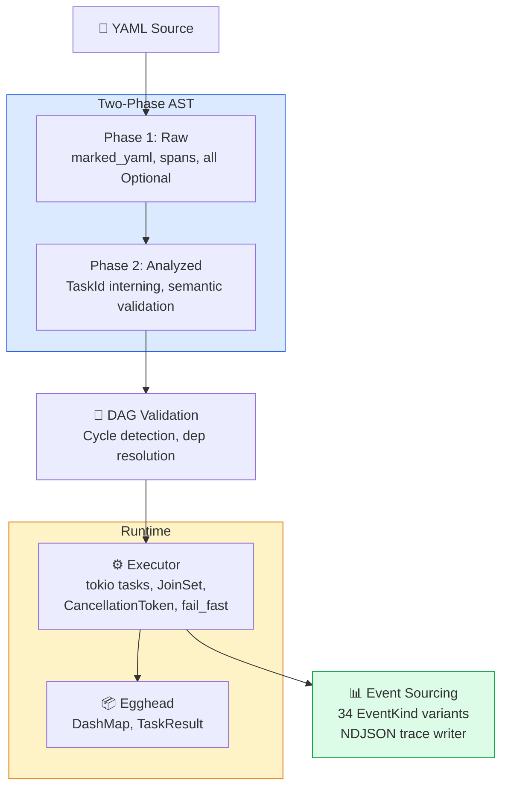
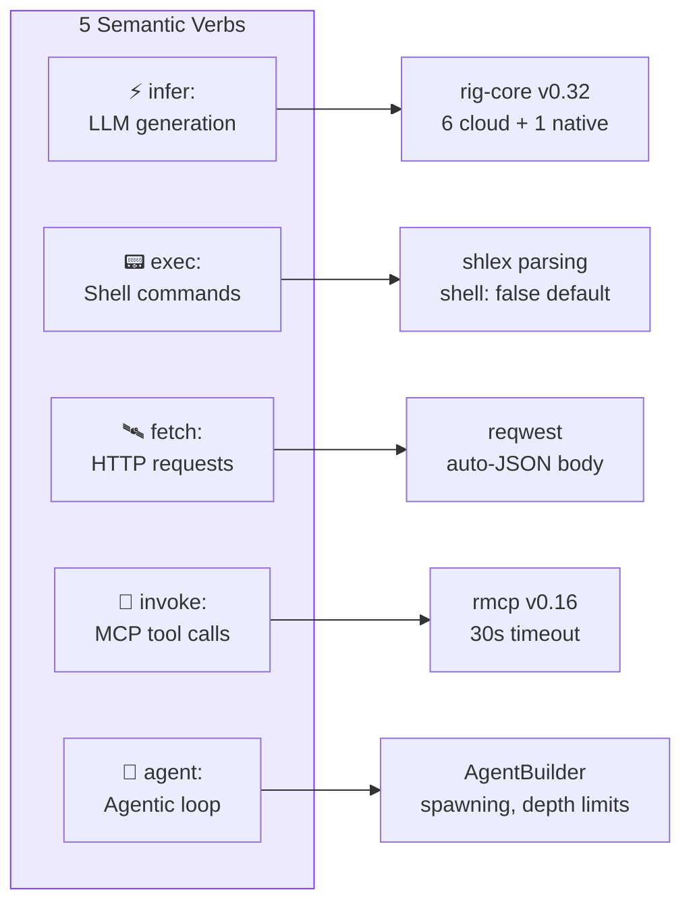
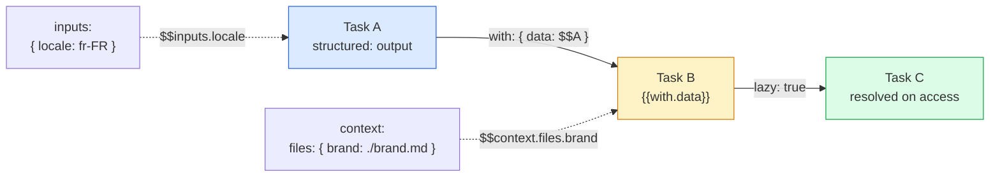
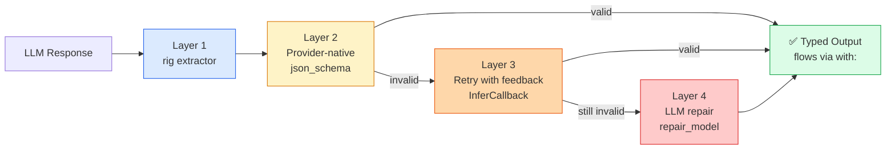
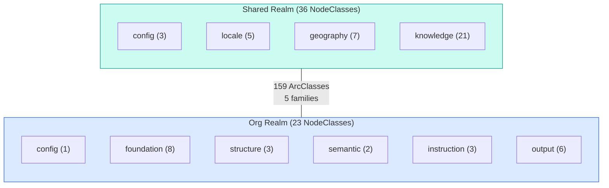
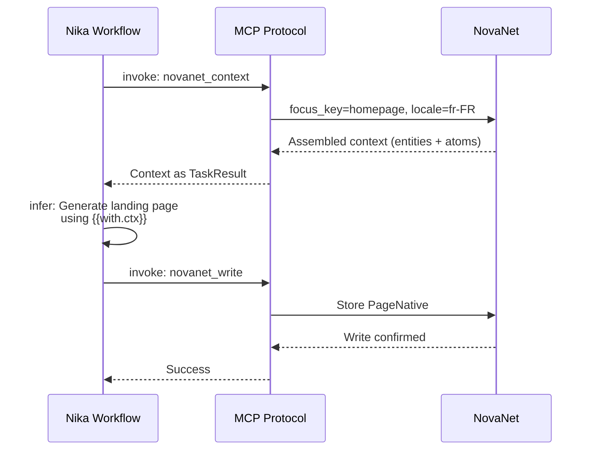

# 01 — Current Features Inventory

> Exhaustive map of Nika v0.27.0 + NovaNet v0.20.0 capabilities.
> Every claim verified against actual source code on 2026-03-14.

**Nika** v0.27.0 · **NovaNet** v0.20.0 · Updated 2026-03-14

---

## Nika v0.27.0 — The Body

**Stats:** 373 Rust source files[^1] | 220K lines[^2] | 6,610 tests[^3] | Zero clippy warnings

### Core Architecture



### Module Breakdown

| Module | Files | Lines | Role |
|--------|------:|------:|------|
| **tui** | 164 | 91.5K | Terminal UI (4 views: Studio, Runner, Chat, Settings) |
| **runtime** | 39 | 24.8K | Execution engine, agent loop, spawn, transforms |
| **ast** | 37 | 21.8K | Two-phase YAML parser (Raw → Analyzed) |
| **binding** | 9 | 10.9K | Data flow, lazy bindings, transform engine |
| **init** | 10 | 8.4K | Project initialization |
| **mcp** | 12 | 7.9K | MCP client (rmcp v0.16) |
| **lsp** | 13 | 6.2K | Language Server Protocol for YAML |
| **provider** | 7 | 4.4K | rig-core v0.32 + mistral.rs native |
| **core** | 8 | 4.1K | Zero-dep provider/model/MCP definitions |
| **new** | 3 | 4.1K | Workflow creation wizard |
| **jobs** | 8 | 3.9K | Background job execution |
| **tools** | 9 | 3.6K | 11 builtin tools (6 core + 5 file) |
| **dag** | 4 | 2.7K | DAG construction and validation |
| **event** | 4 | 2.6K | Event log with 34 variants |
| **registry** | 6 | 2.5K | Package registry |
| **io** | 5 | 1.8K | Atomic writes, security, templates |
| **sync** | 4 | 1.7K | Editor sync (Claude Code, Cursor, etc.) |
| **daemon** | 5 | 1.4K | Background service management |
| **store** | 2 | 1.0K | DashMap-based concurrent data store |
| **source** | 3 | 0.7K | Source file tracking |
| **secrets** | 4 | 0.6K | Keychain + daemon IPC |
| **setup** | 2 | 0.5K | Onboarding wizard |
| **backup** | 2 | 0.5K | Data backup/restore |

> [!NOTE]
> 22 modules totaling 373 files. The TUI alone accounts for 44% of all source files — reflecting the investment in developer experience.

---

### Feature Catalog

#### 1. Five Semantic Verbs



| Verb | Icon | Purpose | Implementation |
|------|------|---------|----------------|
| `infer:` | ⚡ | LLM generation | rig-core `CompletionModel`, 6 cloud + 1 native provider |
| `exec:` | 📟 | Shell commands | shlex parsing, `shell: false` default, command blocklist |
| `fetch:` | 🛰️ | HTTP requests | reqwest, auto-JSON body via `json:` field |
| `invoke:` | 🔌 | MCP tool calls | rmcp v0.16, timeout enforcement (30s) |
| `agent:` | 🐔 | Multi-turn agentic loop | rig-core `AgentBuilder`, spawning, depth limits |

**Verb syntax:** `infer:` and `exec:` support shorthand string form (`infer: "prompt"`) plus full object form (`infer: { prompt, model, temperature }`).

#### 2. LLM Provider Ecosystem

**6 cloud providers** (rig-core v0.32):

| Provider | Constructor | Default Model |
|----------|-------------|---------------|
| Claude | `RigProvider::claude()` | claude-sonnet-4-6 |
| OpenAI | `RigProvider::openai()` | gpt-4o |
| Mistral | `RigProvider::mistral()` | mistral-large-latest |
| Groq | `RigProvider::groq()` | llama-3.3-70b-versatile |
| DeepSeek | `RigProvider::deepseek()` | deepseek-chat |
| Gemini | `RigProvider::gemini()` | gemini-2.0-flash |

**1 local provider** (v0.26):
- `NativeRuntime` via mistral.rs — GGUF models, Metal/CUDA acceleration
- `provider: native` in workflows, streaming via `infer_stream()`

**Auto-detection:** Priority order checks env vars (ANTHROPIC → OPENAI → MISTRAL → GROQ → DEEPSEEK → GEMINI).

#### 3. Agent Capabilities

- **Multi-turn loop:** `RigAgentLoop` with `AgentBuilder`, chat history via rig `Chat` trait
- **Extended thinking:** Claude-only, `thinking_budget: 1024-65536`, reasoning captured in `AgentTurnMetadata`
- **Spawn sub-agents:** `SpawnAgentTool` with `depth_limit` (default 3, max 10)
- **Stop conditions:** Configurable agent termination criteria
- **Chat history:** `add_to_history()`, `chat_continue()`, `with_history()`
- **Streaming:** All 7 providers support real-time token streaming

#### 4. Builtin Tools (11)

**Core tools (6):**
`nika:sleep`, `nika:log`, `nika:emit`, `nika:assert`, `nika:prompt`, `nika:run`

**File tools (5, agent-only):**
`nika:read`, `nika:write`, `nika:edit`, `nika:glob`, `nika:grep`

#### 5. Data Flow & Bindings



- **`with:` block** (v0.28, was `use:`)**:** Typed bindings with `WithEntry` — source, binding_type, default, lazy, transform
- **`BindingPath` syntax:** `$task_id`, `$task_id.field`, `$context.files.X`, `$inputs.param`, `$env.VAR`, `$item`
- **`{{with.alias}}` templates:** Variable interpolation in prompts (was `{{use.alias}}`)
- **Transform pipes:** Inline transforms via `| sort | unique | first(3)` syntax (27 operations)
- **Typed bindings:** `binding_type` enforces string/number/integer/boolean/array/object/any
- **Lazy bindings:** `lazy: true` defers resolution until access, with optional `default`
- **2-pass template resolution:** Pass 1: `{{with.*}}`, Pass 2: `{{context.*}}` + `{{inputs.*}}` + `{{env.*}}`

#### 6. Transform Engine

30+ chained operations via pipe syntax (`sort | unique | first(3)`):

<details>
<summary>📋 All transform operations</summary>

| Category | Operations |
|----------|-----------|
| **String** | `upper`, `lower`, `trim`, `trim_start`, `trim_end`, `replace`, `slice`, `truncate`, `capitalize`, `camel_case`, `snake_case`, `kebab_case` |
| **Collection** | `length`, `first`, `last`, `nth`, `keys`, `values`, `flatten`, `reverse`, `sort`, `unique`, `compact`, `filter`, `map`, `group_by`, `zip` |
| **Type** | `to_string`, `to_number`, `to_bool`, `to_json`, `parse_json`, `type_of` |
| **Numeric** | `round`, `abs`, `ceil`, `floor`, `min`, `max`, `sum`, `avg` |
| **Utility** | `default`, `join`, `split`, `shell`, `regex_match`, `regex_replace` |

</details>

#### 7. DAG Execution

- **Parallel execution:** `for_each` with `concurrency` control and `JoinSet`
- **`fail_fast:`** `tokio::select!` cancellation of in-flight tasks
- **`DependencyFailed`/`DependencyChainFailed`:** Cascading failure propagation
- **Deadlock detection:** Distinguishes true cycles from chain failures
- **Decompose modifier:** Runtime DAG expansion via MCP traversal

#### 8. Structured Output (`structured:`)

4-layer validation pipeline via the `structured:` keyword (v0.21+):



- **`structured:` keyword:** `StructuredOutputSpec` with schema, enable_extractor, enable_tool_use, enable_retry, enable_repair, max_retries, repair_model
- **Output quality gate:** Validated output flows downstream via `with:` bindings as typed data
- **InferCallback:** Async callback enabling Layers 3 & 4 to re-invoke the LLM

```yaml
# Example: structured output feeding typed bindings
- id: extract_data
  infer: "Extract product information"
  structured:
    schema:
      type: object
      properties:
        name: { type: string }
        price: { type: number }
      required: [name, price]
    max_retries: 3
    enable_repair: true

- id: format
  with:
    product: "$extract_data"       # Typed object guaranteed
  infer: "Format {{with.product.name}} at ${{with.product.price}}"
```

#### 9. MCP Client (rmcp v0.16)

- **Server management:** 48 pre-configured aliases via `MCP_ALIASES`
- **Timeout enforcement:** 30s default, 5min deadline for tasks
- **Error code preservation:** JSON-RPC error codes mapped to `McpErrorCode`
- **Cache invalidation:** Tool + response caches invalidated on disconnect
- **Connection lifecycle:** Auto-start, health check, reconnect

#### 10. Workflow Composition

- **`context:`** File loading at workflow start (markdown, JSON, YAML, glob patterns)
- **`include:`** DAG fusion from external workflows with prefix namespacing
- **`skills:`** Skill definition merging through DAG fusion, `pkg:` URI resolution
- **Schema versions:** `nika/workflow@0.1` through `@0.11`

#### 11. Security

- **Shell-free execution:** `exec:` defaults to `shell: false` (shlex parsing)
- **Command blocklist:** Dangerous binaries blocked (`rm -rf`, `sudo`, etc.)
- **Path traversal protection:** `validate_path_boundary()` for include/context
- **Template injection prevention:** Sanitized variable interpolation
- **TOCTOU mitigation:** Atomic writes with temp+fsync+rename

> [!IMPORTANT]
> Security-by-default: `exec:` requires explicit `shell: true` for pipe/redirect. All paths validated against traversal. Templates sanitized before interpolation.

#### 12. Observability

- **Event sourcing:** 34 `EventKind` variants across 11 categories
- **NDJSON traces:** Per-run trace files with full event replay
- **`AgentTurnMetadata`:** thinking, tokens, stop_reason, tool_calls, cache tokens
- **Broadcast channels:** Real-time event streaming to TUI

#### 13. TUI (91.5K lines)

**4 Views:**

| View | Key | Description |
|------|-----|-------------|
| Studio | `1`/`s` | 3-panel: Browser + Editor + DAG Preview |
| Runner | `2`/`r` | Real-time workflow execution monitor |
| Chat | `3`/`c` | Conversational agent interface |
| Settings | `4`/`,` | Provider config and preferences |

**Studio features:** Edit history (undo/redo), session persistence, Solarized theme, syntax highlighting, schema validation, tab management, fuzzy file search, command palette.

#### 14. CLI Commands (v0.27 spn fusion)

<details>
<summary>📋 Full command reference (30+ commands)</summary>

| Category | Commands |
|----------|----------|
| **Run** | `nika workflow.nika.yaml`, `nika check`, `nika tui`, `nika chat`, `nika studio` |
| **Trace** | `nika trace list/show/export/clean` |
| **Provider** | `nika provider list/set/get/test/migrate` |
| **Model** | `nika model list/pull/info/search` |
| **MCP** | `nika mcp add/remove/list/test/tools` |
| **Sync** | `nika sync --enable/--disable/--status` |
| **Jobs** | `nika jobs submit/cancel/output/list` |
| **Backup** | `nika backup create/restore/list/prune` |
| **Setup** | `nika setup nika/novanet/claude-code` |
| **Daemon** | `nika daemon start/stop/status` |

</details>

#### 15. Error System

<details>
<summary>📋 20+ error code ranges (NIKA-000 through NIKA-429)</summary>

| Range | Category | Count |
|-------|----------|-------|
| 000-009 | Workflow | 10 |
| 010-019 | Schema | 10 |
| 020-029 | DAG | 10 |
| 030-039 | Provider | 10 |
| 040-049 | Binding | 10 |
| 050-059 | Security | 10 |
| 060-069 | Output/JSON | 10 |
| 070-079 | Use block | 10 |
| 080-089 | DAG validation | 10 |
| 090-099 | JSONPath/IO | 10 |
| 100-109 | MCP | 10 |
| 110-119 | Agent | 10 |
| 120-129 | Resilience | 10 |
| 130-139 | TUI | 10 |
| 140-149 | AST analysis | 10 |
| 200-209 | File tools | 10 |
| 210-219 | Builtin tools | 10 |
| 280-289 | Artifact | 10 |
| 300-309 | Structured output | 10 |
| 400-429 | Daemon/IO/Sync | 30 |

</details>

#### 16. Artifact System (v0.18)

- **Atomic writes:** temp+fsync+rename pattern
- **Security:** Path validation, traversal prevention
- **Templates:** `{{task_id}}`, `{{date}}`, variable interpolation
- **Events:** `ArtifactWritten`, `ArtifactFailed`

#### 17. LSP (Language Server Protocol)

13 files, 6.2K lines — IDE integration for `.nika.yaml` files with diagnostics and completion.

#### 18. Secrets Management (v0.27)

- **Resolution chain:** daemon → keychain → environment variables
- **spn daemon IPC:** Unix socket at `~/.spn/daemon.sock`
- **18 known providers:** 6 LLM + 11 MCP + 1 Local

---

## NovaNet v0.20.0 — The Brain

### Schema



- **59 NodeClasses** across 2 realms (Shared: 36, Org: 23)
- **159 ArcClasses** in 5 families (ownership, localization, semantic, generation, mining)
- **5-6 layers per realm:** config, locale, geography, knowledge (Shared); config, foundation, structure, semantic, instruction, output (Org)

### MCP Server (7 tools)

| Tool | Purpose |
|------|---------|
| `novanet_describe` | Bootstrap graph understanding |
| `novanet_introspect` | Schema inspection (classes, arcs) |
| `novanet_search` | Find nodes (fulltext, property, hybrid, walk, triggers) |
| `novanet_context` | Build LLM context (page, block, knowledge, assemble) |
| `novanet_write` | Create/update data (with `dry_run` validation) |
| `novanet_audit` | Quality checks + CSR metrics |
| `novanet_batch` | Parallel operations |
| `novanet_query` | Raw Cypher (last resort) |

### Knowledge Atoms

| Type | Purpose |
|------|---------|
| Term | Technical vocabulary with definitions |
| Expression | Idiomatic expressions per locale |
| Pattern | Text templates/patterns |
| CultureRef | Cultural references |
| Taboo | Things to avoid per locale |
| AudienceTrait | Audience characteristics |

> [!TIP]
> Knowledge atoms are NovaNet's unique differentiator. No competitor offers per-locale cultural intelligence (expressions, taboos, audience traits) integrated into content generation.

### Key Patterns

- ***Native Pattern (ADR-029):** `EntityNative`, `PageNative`, `BlockNative` — unified suffix
- **Slug Ownership (ADR-030):** Page owns URL, Entity owns semantics
- **Denomination Forms (ADR-033):** text/title/abbrev/mixed/base/url
- **Inverse Arc Tiers (ADR-026):** 3-tier system (Required/Recommended/Optional)

### Neo4j Integration

- 1,210 tests
- Cypher as source of truth (ADR-021)
- Fulltext indexes for search
- APOC for schema inspection

---

## Nika ↔ NovaNet Integration



```yaml
# The integration pattern
workflow: generate-page
mcp:
  servers:
    novanet:
      command: node
      args: ["/path/to/novanet-mcp/dist/index.js"]

tasks:
  - id: get_context
    invoke: novanet_context
    params:
      focus_key: "homepage"
      locale: "fr-FR"
      mode: page

  - id: generate
    with:
      ctx: "$get_context"
    infer: |
      Generate landing page content:
      {{with.ctx}}
```

> [!IMPORTANT]
> **Zero Cypher Rule** (ADR-003) — Nika never queries Neo4j directly. All graph access flows through NovaNet's 7 MCP tools. MCP is the abstraction boundary.

---

## Summary Statistics

| Metric | Nika | NovaNet | Combined |
|--------|------|---------|----------|
| Tests | 6,610[^3] | 1,210 | 7,820 |
| Source files | 373[^1] | ~200 | ~573 |
| Lines of Rust | 220K[^2] | ~50K | ~270K |
| Providers | 7 | 0 | 7 |
| MCP tools | 11 builtin | 8 exposed | 19 |
| Error codes | 20+ ranges | — | 20+ |
| CLI commands | 30+ | 10+ | 40+ |

---

<div align="center">

[← 00 Index](./00-README.md) · [📋 Index](./00-README.md) · [02 Scientific Literature →](./02-scientific-literature.md)

</div>

---

[^1]: Verified via `find src -name '*.rs' | wc -l` on 2026-03-14. Count: 373.
[^2]: Verified via `find src -name '*.rs' -exec cat {} + | wc -l` on 2026-03-14. Count: 220,380.
[^3]: Verified via `cargo test -- --list | grep "test$" | wc -l` on 2026-03-14. Count: 6,610.
