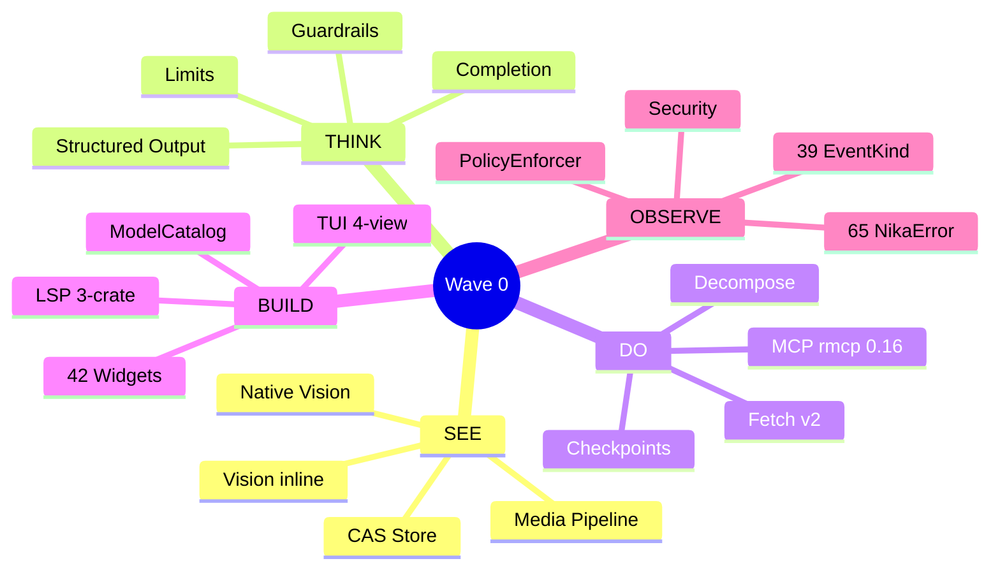
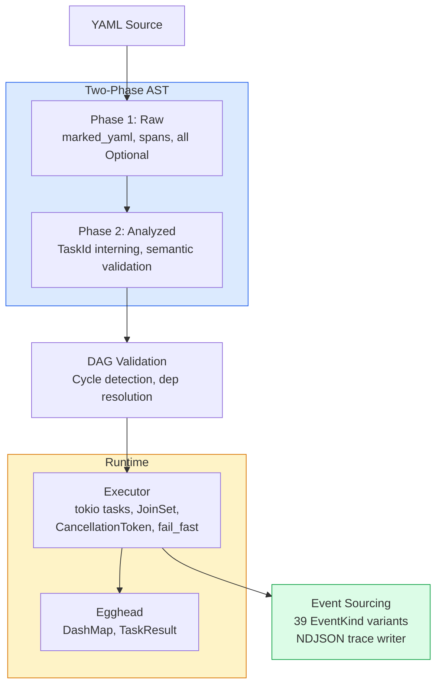
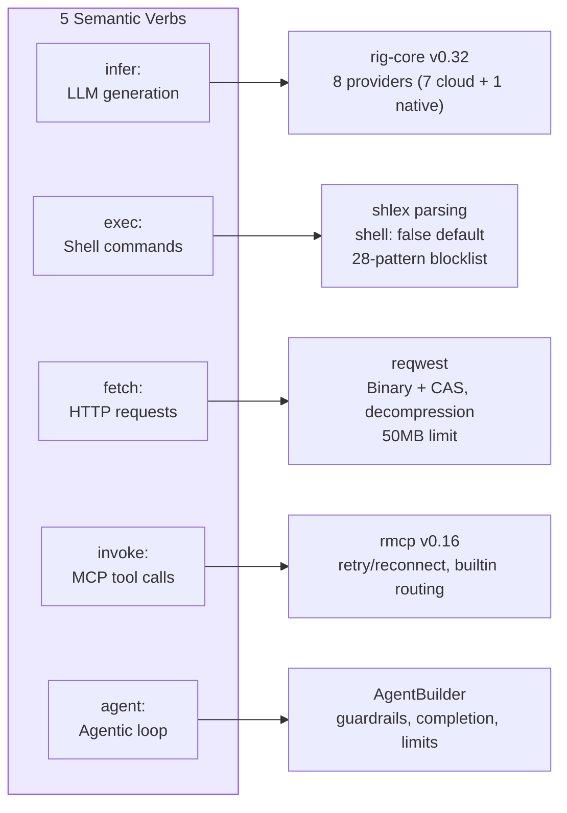
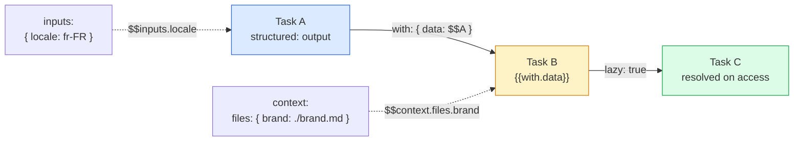
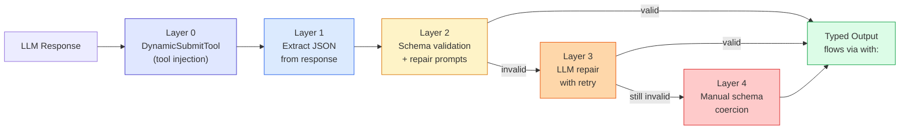
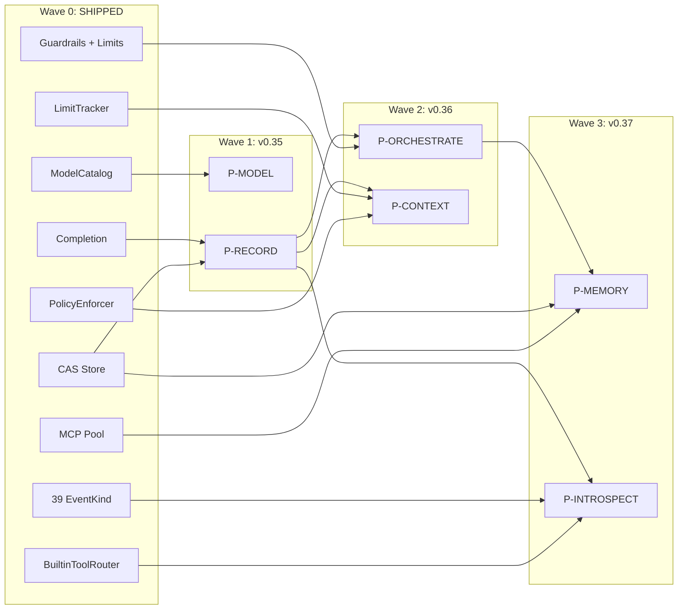
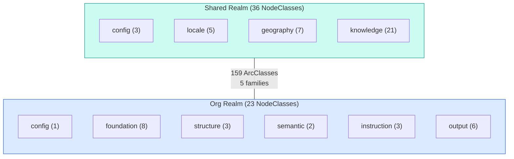
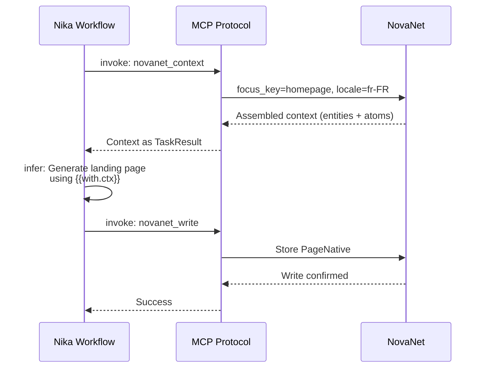

# 01 — Nika: State of the Art

> Exhaustive map of Nika capabilities — features, architecture, and Wave 0 foundations.
> Every claim verified against actual source code. Last updated 2026-03-20.

**Nika** v0.34.0 · **Schema** @0.12 · **NovaNet** v0.20.0

[← 00 README](./00-README.md) · [Index](./00-README.md) · [03 Competitive Landscape →](./03-competitive-landscape.md)

---

## Table of Contents

1. [Overview](#overview)
2. [Architecture](#architecture)
3. [Module Breakdown](#module-breakdown)
4. [The 5 Verbs](#the-5-verbs)
5. [SEE — Vision & Media](#5-see--vision--media)
6. [THINK — Structured Output & Guardrails](#6-think--structured-output--guardrails)
7. [DO — MCP, Fetch, Decompose](#7-do--mcp-fetch-decompose)
8. [BUILD — LSP, TUI, ModelCatalog](#8-build--lsp-tui-modelcatalog)
9. [OBSERVE — Events, Errors, Security](#9-observe--events-errors-security)
10. [How Wave 0 Accelerates Waves 1-3](#10-how-wave-0-accelerates-waves-1-3)
11. [Ground Truth](#11-ground-truth)
12. [Architecture Decisions](#12-architecture-decisions)
13. [NovaNet](#13-novanet)

---

## Overview

**Stats:** 373+ Rust source files | 220K+ lines | 6,610+ tests | Zero clippy warnings

Nika is a semantic YAML workflow engine for AI tasks. Five verbs (`infer:`, `exec:`, `fetch:`, `invoke:`, `agent:`) compose into DAG-scheduled workflows with typed bindings, structured output, and full observability.

Between v0.27 and v0.34, approximately **30K+ lines of production code** shipped across five impact domains — none of which were part of the original 6-priority roadmap (P-MODEL through P-INTROSPECT). These features form **Wave 0: SHIPPED** — the foundation that makes the P-feature roadmap more achievable, not less. Every feature either directly accelerates a planned P-feature or fills a gap the original roadmap assumed would be solved later.



---

## Architecture



---

## Module Breakdown

| Module | Files | Lines | Role |
|--------|------:|------:|------|
| **tui** | 164 | 91.5K | Terminal UI (4 views: Studio, Runner, Chat, Settings) |
| **runtime** | 39 | 24.8K | Execution engine, agent loop, spawn, transforms |
| **ast** | 37 | 21.8K | Two-phase YAML parser (Raw -> Analyzed) |
| **binding** | 9 | 10.9K | Data flow, lazy bindings, transform engine |
| **init** | 10 | 8.4K | Project initialization |
| **mcp** | 12 | 7.9K | MCP client (rmcp v0.16) |
| **lsp** | 13 | 6.2K | Language Server Protocol for YAML |
| **provider** | 7 | 4.4K | rig-core v0.32 + mistral.rs native |
| **core** | 8 | 4.1K | Zero-dep provider/model/MCP definitions |
| **new** | 3 | 4.1K | Workflow creation wizard |
| **jobs** | 8 | 3.9K | Background job execution |
| **tools** | 9 | 3.6K | 31 builtin tools (12 core/file + 19 media) |
| **dag** | 4 | 2.7K | DAG construction and validation |
| **event** | 4 | 2.6K | Event log with 39 variants |
| **registry** | 6 | 2.5K | Package registry |
| **io** | 5 | 1.8K | Atomic writes, security, templates |
| **sync** | 4 | 1.7K | Editor sync (Claude Code, Cursor, etc.) |
| **daemon** | 5 | 1.4K | Background service management |
| **store** | 2 | 1.0K | DashMap-based concurrent data store |
| **source** | 3 | 0.7K | Source file tracking |
| **secrets** | 4 | 0.6K | Keychain + daemon IPC |
| **setup** | 2 | 0.5K | Onboarding wizard |
| **backup** | 2 | 0.5K | Data backup/restore |

> [!NOTE]
> 22 modules totaling 373+ files. The TUI alone accounts for 44% of all source files — reflecting the investment in developer experience.

---

## The 5 Verbs



| Verb | Purpose | Key Features |
|------|---------|-------------|
| `infer:` | LLM generation | Vision/multimodal, structured output, extended thinking, streaming |
| `exec:` | Shell commands | 28-pattern blocklist, policy enforcement, timeout, shell-free mode |
| `fetch:` | HTTP requests | Binary mode (CAS), decompression, 50MB limit, all methods |
| `invoke:` | MCP tool calls | rmcp 0.16, retry/reconnect, builtin routing, media pipeline |
| `agent:` | Multi-turn agentic loop | Guardrails, completion, limits, tool calling, streaming |

**Verb syntax:** `infer:` and `exec:` support shorthand string form (`infer: "prompt"`) plus full object form (`infer: { prompt, model, temperature }`).

### LLM Provider Ecosystem

**7 cloud providers** (rig-core v0.32):

| Provider | Constructor | Default Model |
|----------|-------------|---------------|
| Claude | `RigProvider::claude()` | claude-sonnet-4-6 |
| OpenAI | `RigProvider::openai()` | gpt-4o |
| Mistral | `RigProvider::mistral()` | mistral-large-latest |
| Groq | `RigProvider::groq()` | llama-3.3-70b-versatile |
| DeepSeek | `RigProvider::deepseek()` | deepseek-chat |
| Gemini | `RigProvider::gemini()` | gemini-2.0-flash |

**1 local provider** (v0.26):
- `NativeRuntime` via mistral.rs — GGUF models, Metal/CUDA acceleration
- `provider: native` in workflows, streaming via `infer_stream()`

**Auto-detection:** Priority order checks env vars (ANTHROPIC -> OPENAI -> MISTRAL -> GROQ -> DEEPSEEK -> GEMINI).

### Agent Capabilities

- **Multi-turn loop:** `RigAgentLoop` with `AgentBuilder`, chat history via rig `Chat` trait
- **Extended thinking:** Claude-only, `thinking_budget: 1024-65536`, reasoning captured in `AgentTurnMetadata`
- **Spawn sub-agents:** `SpawnAgentTool` with `depth_limit` (default 3, max 10)
- **Stop conditions:** Configurable agent termination criteria
- **Chat history:** `add_to_history()`, `chat_continue()`, `with_history()`
- **Streaming:** All 8 providers support real-time token streaming

### Data Flow & Bindings



- **`with:` block:** Typed bindings with `WithEntry` — source, binding_type, default, lazy, transform
- **`BindingPath` syntax:** `$task_id`, `$task_id.field`, `$context.files.X`, `$inputs.param`, `$env.VAR`, `$item`
- **`{{with.alias}}` templates:** Variable interpolation in prompts
- **Transform pipes:** Inline transforms via `| sort | unique | first(3)` syntax (31 operations)
- **Typed bindings:** `binding_type` enforces string/number/integer/boolean/array/object/any
- **Lazy bindings:** `lazy: true` defers resolution until access, with optional `default`
- **2-pass template resolution:** Pass 1: `{{with.*}}`, Pass 2: `{{context.*}}` + `{{inputs.*}}` + `{{env.*}}`

### Transform Engine

31 chained operations via pipe syntax (`sort | unique | first(3)`):

<details>
<summary>All transform operations</summary>

| Category | Operations |
|----------|-----------|
| **String** | `upper`, `lower`, `trim`, `trim_start`, `trim_end`, `replace`, `slice`, `truncate`, `capitalize`, `camel_case`, `snake_case`, `kebab_case` |
| **Collection** | `length`, `first`, `last`, `nth`, `keys`, `values`, `flatten`, `reverse`, `sort`, `unique`, `compact`, `filter`, `map`, `group_by`, `zip` |
| **Type** | `to_string`, `to_number`, `to_bool`, `to_json`, `parse_json`, `type_of` |
| **Numeric** | `round`, `abs`, `ceil`, `floor`, `min`, `max`, `sum`, `avg` |
| **Utility** | `default`, `join`, `split`, `shell`, `regex_match`, `regex_replace` |

</details>

### DAG Execution

- **Parallel execution:** `for_each` with `concurrency` control and `JoinSet`
- **`fail_fast:`** `tokio::select!` cancellation of in-flight tasks
- **`DependencyFailed`/`DependencyChainFailed`:** Cascading failure propagation
- **Deadlock detection:** Distinguishes true cycles from chain failures
- **Decompose modifier:** Runtime DAG expansion via MCP traversal

### Builtin Tools (31)

**Core tools (6):**
`nika:sleep`, `nika:log`, `nika:emit`, `nika:assert`, `nika:prompt`, `nika:run`

**File tools (5, agent-only):**
`nika:read`, `nika:write`, `nika:edit`, `nika:glob`, `nika:grep`

**Media tools (19, feature-gated) — see [SEE section](#5-see--vision--media):**
`nika:import`, `nika:dimensions`, `nika:thumbhash`, `nika:dominant_color`, `nika:thumbnail`, `nika:convert`, `nika:strip`, `nika:metadata`, `nika:optimize`, `nika:svg_render`, `nika:phash`, `nika:compare`, `nika:pdf_extract`, `nika:chart`, `nika:provenance`, `nika:verify`, `nika:qr_validate`, `nika:quality`, `nika:pipeline`

### Workflow Composition

- **`context:`** File loading at workflow start (markdown, JSON, YAML, glob patterns)
- **`include:`** DAG fusion from external workflows with prefix namespacing
- **`skills:`** Skill definition merging through DAG fusion, `pkg:` URI resolution
- **Schema versions:** `nika/workflow@0.1` through `@0.12`

---

## 5. SEE — Vision & Media

### Vision Inline (infer: + content:)

Vision is implemented **inside** the `infer:` verb via the `content:` field — NOT as a separate `nika:vision` tool. This design lets vision compose naturally with all infer: features (temperature, system prompt, structured output on text response).

- **3 ContentPart types:** `text`, `image` (CAS hash), `image_url` (HTTPS)
- **ImageDetail:** `auto` (default), `low`, `high`
- **3-phase AST pipeline:** `RawContentPart` -> `AnalyzedContentPart` -> `ContentPart`
- **Limits:** max 20 images, 100MB total
- **SSRF protection:** `https://` only for `image_url`
- **Execution order:** dispatched BEFORE Layer 0 structured output (critical design decision — Layer 0 uses text-only DynamicSubmitTool that ignores content: parts)

**Key files:**
- `ast/content.rs` — ContentPart types, ImageDetail enum
- `runtime/executor/verbs.rs` — `run_infer_vision()` dispatch
- `runtime/executor/tests_vision_e2e.rs` — E2E tests

### Native Vision (mistral.rs VisionModelBuilder + ISQ)

Local vision inference via mistral.rs v0.7 with Integer-Scaled Quantization for memory efficiency.

- **Dual-path model loading:**
  - `NativeModelKind::TextGguf` -> `GgufModelBuilder` (GGUF files, text only)
  - `NativeModelKind::VisionHf { model_id, isq }` -> `VisionModelBuilder` (HuggingFace safetensors, vision)
- **InferenceBackend trait:** `supports_vision()`, `infer_vision()`, `infer_vision_stream()`
- **ISQ levels:** Q4K, Q8_0, etc. — parsed via `mistralrs::parse_isq_value()`
- **Target models:** Gemma 3 4B (3GB VRAM), Qwen2.5-VL 3B/7B
- **Streaming:** Full streaming support at NativeRuntime level via `spawn_stream_task()` + mpsc

**Key files:**
- `provider/native/runtime.rs` — NativeRuntime implementation
- `provider/native/traits.rs` — InferenceBackend trait (object-safe + generic)
- `provider/native/error.rs` — NativeError (VisionNotSupported, VisionModelLoadFailed, InvalidImageData)
- `core/backend.rs` — NativeModelKind, VisionImage types

### Media Pipeline (19 tools, CAS Store)

Content-Addressable Storage with blake3 hashing and 19 image processing tools across 3 feature-gated tiers.

**CAS Store:**
- **Hash:** blake3, `blake3:` prefix
- **Layout:** `{root}/{hash[0..2]}/{hash[2..]}` (sharded, no extension)
- **Writes:** atomic via `O_EXCL`, automatic deduplication
- **Verification:** read-back for files >= 1MB
- **Budget:** `MediaBudget` — 500MB per run, atomic lock-free tracking
- **Compression:** optional zstd (feature `media-compression`), 200MB decompression bomb limit
- **Config:** `NIKA_MEDIA_STORE` env var, default `.nika/media/store/`

**Tools:**

| Tier | Tools | Feature Flag | Deps |
|------|-------|-------------|------|
| **1 (always-on)** | `nika:import`, `nika:dimensions`, `nika:thumbhash`, `nika:dominant_color` | none | zero/tiny |
| **2 (media-core)** | `nika:thumbnail`, `nika:convert`, `nika:strip`, `nika:metadata`, `nika:optimize`, `nika:svg_render` | `media-core` (default) | image, resvg |
| **3 (opt-in)** | `nika:phash`, `nika:compare`, `nika:pdf_extract`, `nika:chart`, `nika:provenance`, `nika:verify`, `nika:qr_validate`, `nika:quality`, `nika:pipeline` | per-tool flags | heavy |

**Error codes:** NIKA-251->259 (pipeline), NIKA-283->285 (store), NIKA-290->297 (tools)

**Key files:**
- `media/store.rs` (~1200 lines) — CAS store
- `runtime/builtin/media/mod.rs` — 19 tool implementations
- `runtime/builtin/router.rs` — BuiltinToolRouter dispatch

---

## 6. THINK — Structured Output & Guardrails

### 5-Layer Structured Output Defense

~99.99% JSON compliance across all providers via cascading validation layers.



| Layer | Method | Trigger | Success Rate |
|-------|--------|---------|-------------|
| **0** | DynamicSubmitTool (tool injection) | `output:` with schema | ~80-90% |
| **1** | Extract JSON from response | Layer 0 fails | ~95% |
| **2** | Schema validation + repair prompts | Layer 1 fails | ~98% |
| **3** | LLM repair with retry | Layer 2 fails | ~99%+ |
| **4** | Manual schema coercion | All fail | Fallback |

- **`structured:` keyword:** `StructuredOutputSpec` with schema, enable_extractor, enable_tool_use, enable_retry, enable_repair, max_retries, repair_model
- **Output quality gate:** Validated output flows downstream via `with:` bindings as typed data
- **InferCallback:** Async callback enabling Layers 3 & 4 to re-invoke the LLM
- **Events:** `StructuredOutputAttempt` (layer, attempt, schema_id), `StructuredOutputSuccess` (layer, attempts_total)
- **Error codes:** NIKA-300 ExtractionFailed, NIKA-301 ValidationFailed, NIKA-302 RepairFailed, NIKA-303 AllLayersFailed

**Key files:** `runtime/structured_output.rs`, `runtime/executor/verbs.rs`

```yaml
# Example: structured output feeding typed bindings
- id: extract_data
  infer: "Extract product information"
  structured:
    schema:
      type: object
      properties:
        name: { type: string }
        price: { type: number }
      required: [name, price]
    max_retries: 3
    enable_repair: true

- id: format
  with:
    product: "$extract_data"       # Typed object guaranteed
  infer: "Format {{with.product.name}} at ${{with.product.price}}"
```

### Agent Guardrails (4 types, chain evaluation)

Quality gates on agent responses with escalation paths.

| Type | Config | Checks |
|------|--------|--------|
| `length` | `{ min, max }` | Response length bounds |
| `schema` | `{ schema }` | JSON schema validation |
| `regex` | `{ pattern, must_match }` | Pattern matching |
| `llm` | `{ prompt, model }` | LLM-based quality judgment |

- **Chain evaluation:** all guardrails checked in order, early termination on failure
- **OnFailure escalation:** `retry` -> `escalate` -> `fail`
- **Events:** `GuardrailPassed`, `GuardrailFailed`, `GuardrailEscalation`

**Key files:** `ast/guardrails.rs`

### Agent Completion (3 modes, confidence routing)

| Mode | Mechanism |
|------|-----------|
| `explicit` | Agent must call `nika:complete` tool |
| `natural` | Detect completion language patterns |
| `pattern` | Regex-based detection |

- **Confidence routing:** `high_threshold`, `medium_threshold` with configurable actions per level
- **Key files:** `ast/completion.rs`

### Agent Limits

| Limit | Type | Default |
|-------|------|---------|
| `max_turns` | u32 | -- |
| `max_tokens` | u64 | -- |
| `max_cost_usd` | f64 | -- |
| `max_duration_secs` | u64 | -- |

- **LimitTracker:** real-time tracking with `LimitStatus`
- **Key files:** `ast/limits.rs`

---

## 7. DO — MCP, Fetch, Decompose

### MCP Integration (rmcp 0.16)

Production-grade Model Context Protocol client.

- **McpClientPool:** lazy init, per-server dedup via `OnceCell`, graceful shutdown
- **Server management:** 48 pre-configured aliases via `MCP_ALIASES`
- **Retry:** `backon` with `McpRetryConfig`, reconnect on failure, event emission (`McpRetry`)
- **Caching:** `DashMap` + TTL + eviction for response caching
- **Validation:** parameter schema caching for tool calls
- **Content:** 5 block types (text, image, audio, resource, resource_link)
- **Timeout enforcement:** 30s default, 5min deadline for tasks
- **Error code preservation:** JSON-RPC error codes mapped to `McpErrorCode`
- **Cache invalidation:** Tool + response caches invalidated on disconnect
- **Connection lifecycle:** Auto-start, health check, reconnect
- **Config:** global `~/.nika/mcp.yaml`, per-workflow `mcp:` block
- **Security:** env var validation against library injection

**Key files:** `mcp/client.rs`, `mcp/pool.rs`, `mcp/rmcp_adapter.rs`, `mcp/types.rs`

### Fetch v2

Enhanced HTTP client with binary mode and CAS integration.

- **Methods:** GET, POST, PUT, DELETE, PATCH, HEAD, OPTIONS
- **Response modes:** `text` (default), `binary` (CAS store + blake3), `full` (status + headers + body)
- **Decompression:** gzip, brotli, deflate (automatic)
- **Limits:** 50MB response size
- **Retry:** exponential backoff
- **Auto-JSON body:** via `json:` field

### Decompose (3 strategies)

| Strategy | Mechanism |
|----------|-----------|
| `semantic` | NovaNet graph traversal via MCP |
| `static` | Predefined subtask list |
| `nested` | Recursive decomposition |

**Key files:** `ast/decompose.rs`, `runtime/executor/decompose.rs`

### Partial Checkpointing

- `PartialCheckpoint`, `PartialResult`, `StopReason`
- Pause/resume workflow execution with state preservation
- **Key files:** `runtime/partial.rs`

---

## 8. BUILD — LSP, TUI, ModelCatalog

### LSP 3-Crate Architecture

Three implementations consolidating toward `nika-lsp-core` as the single intelligence layer.

| Crate | Role | Status |
|-------|------|--------|
| `nika-lsp-core` | Protocol-agnostic intelligence | Newest, target |
| `nika-lsp` | Standalone LSP binary | Has diagnostics, MCP discovery |
| `nika/src/lsp` | Embedded in main binary | Mature, has ModelCatalog |

**6 Handlers:** completion, hover, definition, code_action, semantic_tokens, document_symbols

**16 CursorContext variants:** WorkflowRoot, TaskField, VerbBlock, WithBlock, Template, InvokeBlock, McpConfig, ProviderContext, ContentPart, ForEach, SchemaBlock, DependsOn, Guardrails, RetryBlock, LimitsBlock, Unknown

**Tree-sitter:** `RecoveryParser` wrapping `tree_sitter_yaml` with incremental re-parse, 5s timeout, error recovery from broken YAML. 11 fixture-based tests.

**Key files:** `nika-lsp-core/src/handlers/`, `nika-lsp-core/src/parse/recovery.rs`

### TUI 4-View Architecture (ratatui 0.30)

| View | Shortcut | Description |
|------|----------|-------------|
| **Studio** | `1`/`s` | File browser + YAML editor + DAG preview (vim modes, git gutter, diagnostics, command palette) |
| **Runner** | `2`/`r` | 4-panel 2x2: Mission Control / DAG Execution / NovaNet Station / Agent Reasoning |
| **Chat** | `3`/`c` | Conversational agent (27 source files, 5 verbs via slash commands, MCP, streaming, mentions) |
| **Settings** | `4`/`,` | Providers, MCP Servers, Secrets, Packages, Preferences |

Additional: Home/Browse (workflow browser, fuzzy search, history), Wizard (first-run setup)

**42 widgets** including: DagAscii (Sugiyama layout), NodeBox, DagEdge (animated), Sparkline (latency), MissionControl, ChatDagPanel, matrix rain, which-key popup, tree widget, provider selector

**Studio features:** Edit history (undo/redo), session persistence, Solarized theme, syntax highlighting, schema validation, tab management, fuzzy file search, command palette.

**Key files:** `tui/views/`, `tui/widgets/`

### ModelCatalog

- 25+ cloud models with capability flags, pricing tables, alternatives
- Cost optimizer for model selection
- Compatibility checking (vision, streaming, tool_use, extended_thinking)
- **Key files:** `lsp/model_intel.rs`

### CLI Commands (30+)

<details>
<summary>Full command reference</summary>

| Category | Commands |
|----------|----------|
| **Run** | `nika workflow.nika.yaml`, `nika check`, `nika tui`, `nika chat`, `nika studio` |
| **Trace** | `nika trace list/show/export/clean` |
| **Provider** | `nika provider list/set/get/test/migrate` |
| **Model** | `nika model list/pull/info/search` |
| **MCP** | `nika mcp add/remove/list/test/tools` |
| **Sync** | `nika sync --enable/--disable/--status` |
| **Jobs** | `nika jobs submit/cancel/output/list` |
| **Backup** | `nika backup create/restore/list/prune` |
| **Setup** | `nika setup nika/novanet/claude-code` |
| **Daemon** | `nika daemon start/stop/status` |

</details>

---

## 9. OBSERVE — Events, Errors, Security

### 39 EventKind Variants (12 categories)

| Category | Events | Count |
|----------|--------|-------|
| Workflow | Started, Completed, Failed, Aborted, Paused, Resumed | 6 |
| Task | Scheduled, Started, Completed, Failed | 4 |
| Fine-grained | TemplateResolved, ProviderCalled, ProviderResponded | 3 |
| Context | ContextAssembled | 1 |
| MCP | Invoke, Response, Connected, Error, Retry | 5 |
| Agent | Start, Turn, Complete, Spawned | 4 |
| Guardrail | Passed, Failed, Escalation | 3 |
| Builtin | Log, Custom | 2 |
| Artifact | Written, Failed | 2 |
| Media | Extracted, Processed, Stored, StoreFailed, IntegrityCheck, Cleanup | 6 |
| Structured Output | Attempt, Success | 2 |
| Vision | VisionContentResolved | 1 |

- **NDJSON traces:** Per-run trace files with full event replay
- **`AgentTurnMetadata`:** thinking, tokens, stop_reason, tool_calls, cache tokens
- **Broadcast channels:** Real-time event streaming to TUI

**Key files:** `event/log.rs`

### 65 NikaError Variants + 9 MediaError

<details>
<summary>Full error code ranges (NIKA-000 through NIKA-303)</summary>

| Range | Category | Count |
|-------|----------|-------|
| NIKA-000->009 | Workflow | 6 |
| NIKA-010->019 | Schema | 2 |
| NIKA-020->029 | DAG | 5 |
| NIKA-030->039 | Provider | 4 |
| NIKA-040->049 | Template/Binding | 4 |
| NIKA-050->059 | Path/Task/Security | 5 |
| NIKA-060->069 | Output | 3 |
| NIKA-070->079 | With Block | 4 |
| NIKA-080->089 | DAG Validation | 3 |
| NIKA-090->099 | JSONPath/IO | 4 |
| NIKA-100->109 | MCP | 10 |
| NIKA-110->119 | Agent | 3 |
| NIKA-120->129 | Resilience | 2 |
| NIKA-130->139 | TUI/Config | 2 |
| NIKA-150 | Startup | 1 |
| NIKA-160->161 | Policy/Boot | 2 |
| NIKA-170 | Runtime | 1 |
| NIKA-200->219 | Tool/Builtin | 4 |
| NIKA-251->259 | Media Pipeline | 9 (via MediaError) |
| NIKA-260->269 | Package URI | 2 |
| NIKA-270 | Skill | 1 |
| NIKA-280->285 | Artifact/Media | 6 |
| NIKA-290->297 | Media Tools | 8 |
| NIKA-300->303 | Structured Output | 4 |

</details>

**Key files:** `error.rs`, `media/error.rs`

### Security Hardening

| Layer | Protection | Details |
|-------|-----------|---------|
| **Exec blocklist** | 28 patterns | Destructive ops, reverse shells, privilege escalation, fork bombs, base64 payloads |
| **Unicode NFKC** | Normalization | Prevents fullwidth character bypass |
| **Env vars** | 7 blocked | LD_PRELOAD, DYLD_INSERT_LIBRARIES, etc. |
| **API keys** | Stripped | Removed from child process environment |
| **Paths** | Traversal protection | `../` rejection, absolute paths, null bytes, symlink boundary, max 4096 |
| **SVG** | SSRF protection | Blocks localhost, 127.0.0.1, 169.254.169.254 |
| **Fetch** | Host filtering | PolicyConfig.allowed_hosts / blocked_hosts |
| **Template injection** | Sanitized interpolation | Variables sanitized before template resolution |
| **TOCTOU mitigation** | Atomic writes | temp+fsync+rename pattern |

> [!IMPORTANT]
> Security-by-default: `exec:` requires explicit `shell: true` for pipe/redirect. All paths validated against traversal. Templates sanitized before interpolation.

### PolicyEnforcer

- `check_exec(command)` — blocklist + policy config
- `check_fetch(url)` — host allow/block list
- `check_token_spend(tokens)` — budget enforcement
- `PolicyDecision`: `Allow` | `Block(reason)` | `RequiresApproval(reason)`
- **PolicyConfig:** `allow_exec`, `allow_network`, `blocked_commands`, `max_token_spend`, `allowed_hosts`, `blocked_hosts`

**Key files:** `runtime/policy.rs`, `runtime/security.rs`, `io/security.rs`

### Artifact System

- **Atomic writes:** temp+fsync+rename pattern
- **Security:** Path validation, traversal prevention
- **Templates:** `{{task_id}}`, `{{date}}`, variable interpolation
- **Events:** `ArtifactWritten`, `ArtifactFailed`

### Secrets Management

- **Resolution chain:** daemon -> keychain -> environment variables
- **spn daemon IPC:** Unix socket at `~/.spn/daemon.sock`
- **18 known providers:** 6 LLM + 11 MCP + 1 Local

---

## 10. How Wave 0 Accelerates Waves 1-3



| Wave 0 Foundation | Accelerates | How |
|---|---|---|
| CAS store (blake3, MediaBudget) | **P-RECORD** WARM tier | Records persist to CAS-like format; dedup/budget infrastructure reusable |
| ModelCatalog (25+ models, pricing) | **P-MODEL** slot resolution | Catalog -> slot -> provider mapping; capability flags for routing |
| PolicyEnforcer (check_token_spend) | **P-CONTEXT** budget enforcement | Extend per-task; `ContextAssembled` event already emits `total_tokens` |
| BuiltinToolRouter (31 tools) | **P-INTROSPECT** tool registration | Register 6 new introspection tools in existing FxHashMap router |
| 39 EventKind | **P-INTROSPECT** data source | `nika:cost`, `nika:task_status` read from event stream |
| Guardrails + Limits | **P-ORCHESTRATE** quality scoring | Quality gates for satellite dispatch decisions; LimitTracker for round budgets |
| MCP pool (retry, caching) | **P-MEMORY** NovaNet bridge | `novanet_write` for COLD tier; retry ensures reliability |
| Agent Completion (confidence) | **P-RECORD** confidence | Confidence score -> record compression threshold |
| LimitTracker | **P-CONTEXT** | Foundation for per-task token budgets (already tracks per-turn) |
| BuiltinToolRouter (`nika:run`) | **P-ORCHESTRATE** Dynamic Workflow Generation | `nika:run` builtin tool lets the orchestrator execute generated workflows |
| BuiltinToolRouter (`nika:write`) | **P-ORCHESTRATE** Dynamic Workflow Generation | `nika:write` builtin tool lets the orchestrator write `.nika.yaml` files |
| 5-Layer Structured Output | **P-ORCHESTRATE** workflow gen | 5-layer defense ensures generated workflows are syntactically correct YAML |

---

## 11. Ground Truth

> All numbers extracted from source code, not invented. Verified 2026-03-20.

| Metric | Value |
|--------|-------|
| Nika version | 0.34.0 |
| Schema version | @0.12 |
| Rust files | 373+ |
| Lines of Rust | 220K+ |
| Tests | 6,610+ |
| Verbs | 5 (infer, exec, fetch, invoke, agent) |
| Builtin tools | 31 (12 core/file + 19 media) |
| Providers | 8 (7 cloud + 1 native) |
| EventKind variants | 39 (12 categories) |
| NikaError variants | 65 (+9 MediaError = 74 total error codes) |
| Error code range | NIKA-000 -> NIKA-303 |
| TransformOp count | 31 |
| LSP handlers | 6 |
| CursorContext variants | 16 |
| TUI views | 4 (+ Home + Wizard) |
| TUI widgets | 42 |
| Media tools | 19 (5 always-on + 14 feature-gated) |
| Feature flags | 14 |
| MCP content types | 5 |
| Agent guardrail types | 4 |
| Agent completion modes | 3 |
| Structured output layers | 5 |
| Exec blocklist patterns | 28 |
| CLI commands | 30+ |

---

## 12. Architecture Decisions

### D1: Vision inline in infer: (not nika:vision tool)

Vision is dispatched inside `run_infer()` BEFORE Layer 0 structured output. This avoids a separate tool roundtrip and lets vision compose naturally with all `infer:` features (temperature, system prompt, structured output on text response). The original vision docs proposed `nika:vision` as a standalone builtin tool — the inline approach is simpler and more powerful.

### D2: LSP 3-crate consolidation

`nika-lsp-core` is the target single intelligence layer (protocol-agnostic, tree-sitter recovery). `nika-lsp` and `nika/src/lsp` become thin protocol adapters. The consolidation preserves each crate's strengths: `nika-lsp-core` gets tree-sitter + rich context detection, the embedded LSP contributes ModelCatalog + AstIndex.

### D3: Media tools feature-gated

Conditional compilation via Cargo feature flags keeps the binary small. `media-core` enables the common tool set (Tier 2). Each Tier 3 tool has its own flag (`media-phash`, `media-pdf`, `media-chart`, etc.). This is critical for embedded/constrained environments.

### D4: CAS with blake3 (not SHA-256)

blake3 is faster (3.5 GB/s on modern CPUs), produces 256-bit hashes, and has a streaming API. Hash prefix sharding (`{hash[0..2]}/{hash[2..]}`) keeps directories manageable. The `blake3:` URI prefix is unique to Nika — no collision with other hash schemes.

### D5: with: keyword (not use:)

Doc 07 (Slate Deep Integration) used `use:` in orchestrator examples. Code uses `with:`. Decision: `with:` everywhere. It is consistent with the existing binding system and more intuitive for YAML authors ("with these bindings").

### D6: Raw vs Runtime naming is intentional

| Raw (YAML-facing) | Runtime (semantic) | Rationale |
|---|---|---|
| `max_iterations` | `max_turns` | YAML uses user language; runtime uses agent terminology |
| `working_dir` | `cwd` | YAML is explicit; runtime is concise |
| `thinking` | `extended_thinking` | YAML is simple; runtime disambiguates from regular thinking |
| `server` | `mcp` | YAML names the config block; runtime names the protocol |
| `timeout_ms` | `timeout` (seconds) | YAML uses milliseconds for precision; runtime uses Duration |

This is a design choice, not a bug. The two-phase AST pipeline (Raw -> Analyzed -> Runtime) is the translation layer.

---

## 13. NovaNet

### NovaNet v0.20.0 — The Brain

#### Schema



- **59 NodeClasses** across 2 realms (Shared: 36, Org: 23)
- **159 ArcClasses** in 5 families (ownership, localization, semantic, generation, mining)
- **5-6 layers per realm:** config, locale, geography, knowledge (Shared); config, foundation, structure, semantic, instruction, output (Org)

#### MCP Server (7 tools)

| Tool | Purpose |
|------|---------|
| `novanet_describe` | Bootstrap graph understanding |
| `novanet_introspect` | Schema inspection (classes, arcs) |
| `novanet_search` | Find nodes (fulltext, property, hybrid, walk, triggers) |
| `novanet_context` | Build LLM context (page, block, knowledge, assemble) |
| `novanet_write` | Create/update data (with `dry_run` validation) |
| `novanet_audit` | Quality checks + CSR metrics |
| `novanet_batch` | Parallel operations |
| `novanet_query` | Raw Cypher (last resort) |

#### Knowledge Atoms

| Type | Purpose |
|------|---------|
| Term | Technical vocabulary with definitions |
| Expression | Idiomatic expressions per locale |
| Pattern | Text templates/patterns |
| CultureRef | Cultural references |
| Taboo | Things to avoid per locale |
| AudienceTrait | Audience characteristics |

> [!TIP]
> Knowledge atoms are NovaNet's unique differentiator. No competitor offers per-locale cultural intelligence (expressions, taboos, audience traits) integrated into content generation.

#### Key Patterns

- **Native Pattern (ADR-029):** `EntityNative`, `PageNative`, `BlockNative` — unified suffix
- **Slug Ownership (ADR-030):** Page owns URL, Entity owns semantics
- **Denomination Forms (ADR-033):** text/title/abbrev/mixed/base/url
- **Inverse Arc Tiers (ADR-026):** 3-tier system (Required/Recommended/Optional)

#### Neo4j Integration

- 1,210 tests
- Cypher as source of truth (ADR-021)
- Fulltext indexes for search
- APOC for schema inspection

### Nika <-> NovaNet Integration



```yaml
# The integration pattern
workflow: generate-page
mcp:
  servers:
    novanet:
      command: node
      args: ["/path/to/novanet-mcp/dist/index.js"]

tasks:
  - id: get_context
    invoke: novanet_context
    params:
      focus_key: "homepage"
      locale: "fr-FR"
      mode: page

  - id: generate
    with:
      ctx: "$get_context"
    infer: |
      Generate landing page content:
      {{with.ctx}}
```

> [!IMPORTANT]
> **Zero Cypher Rule** (ADR-003) — Nika never queries Neo4j directly. All graph access flows through NovaNet's 7 MCP tools. MCP is the abstraction boundary.

### Combined Statistics

| Metric | Nika | NovaNet | Combined |
|--------|------|---------|----------|
| Tests | 6,610+ | 1,210 | 7,820+ |
| Source files | 373+ | ~200 | ~573 |
| Lines of Rust | 220K+ | ~50K | ~270K |
| Providers | 8 | 0 | 8 |
| MCP tools | 31 builtin | 8 exposed | 39 |
| Error codes | 74 | -- | 74 |
| CLI commands | 30+ | 10+ | 40+ |

---

<div align="center">

[← 00 README](./00-README.md) · [Index](./00-README.md) · [03 Competitive Landscape →](./03-competitive-landscape.md)

</div>
