# 03 — Competitive Analysis & Inspiration

> Part 1 maps the market: who competes with Nika, where each player sits, and what differentiates them.
> Part 2 deep-dives the most relevant inspiration source — Slate by Random Labs — and designs how Nika absorbs its architectural insights while going beyond.

**Nika** v0.27.0 · **NovaNet** v0.20.0 · Updated 2026-03-20

---

# Part 1 — Competitive Landscape

> 5 competitors mapped. 3 protocols analyzed. Positioning defined.

---

## Market Map

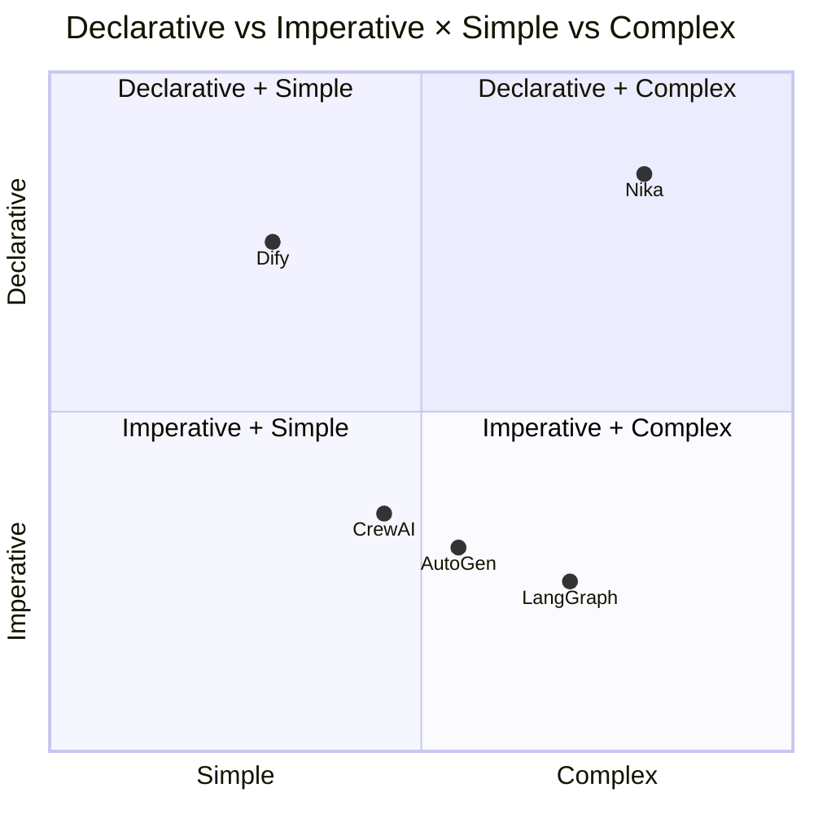

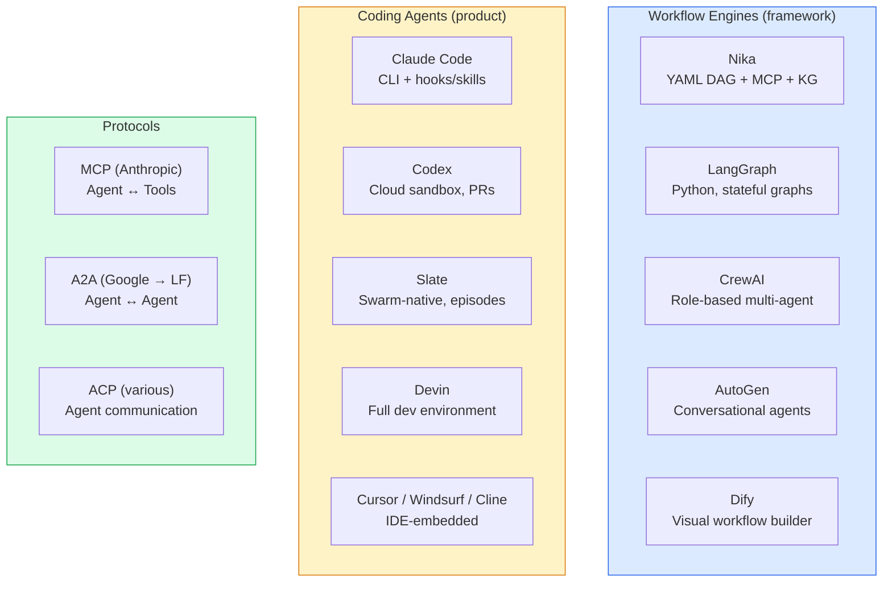

> [!NOTE]
> Nika sits in the **Declarative + Complex** quadrant — a unique position. No other framework combines YAML-first workflows, knowledge graph integration, and multi-provider orchestration.

---

## 1. Slate by Random Labs[^1]

**Source:** Blog post + documentation + npm `@randomlabs/slate` v1.0.15
**Config:** `slate.json` / `slate.jsonc` with 3-level merge (global → project → inline)

### Architecture: 8 Interconnected Concepts

Slate solves the **context window degradation problem**: past a threshold (the "dumb zone"), LLM performance degrades. Every existing approach fails for different reasons. Slate's answer is **threads + episodes + thread weaving**.

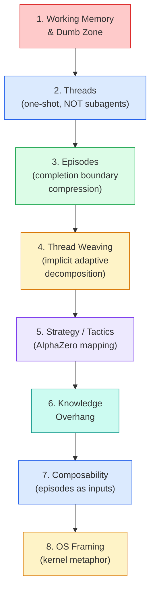

### Slate's Critique of Existing Approaches

| Approach | Failure Mode | Slate's Alternative |
|----------|-------------|---------------------|
| **Compaction** | Lossy, unpredictable information loss | Episode compression at completion boundary |
| **Subagents** | Context isolated, can't transfer info | Threads (one-shot) + episodes (compressed handoff) |
| **Markdown Plans** | Underspecified, incomplete execution, stale | No explicit plans — implicit adaptive decomposition |
| **Task Decomposition** | Rigid, can't adapt, low expressivity | Thread weaving — orchestrator adapts per round |
| **RLM** | Blind N-step execution, no intermediate feedback | Every thread produces episode, orchestrator reviews |
| **Devin/Manus** | Context lost at compress boundary | Episodes preserve key info, entity-linked persistence |

### Slate's Model Slots

> [!IMPORTANT]
> **Attribution note:** Slate configures 4 model slots: **main**, **subagent**, **search**, **reasoning**. Our proposed 4-slot design (P-MODEL) uses **edison**, **atlas**, **york**, **pythagoras** — renaming "subagent" to "atlas" to better reflect the orchestrator/satellites separation from THREAD[^2] and AlphaZero[^3]. The slot concept is inspired by Slate; the specific taxonomy is our design.

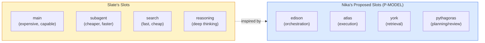

### Slate's Architecture Comparison

| Dimension | ReAct | Plan | Task Trees | RLM | Devin | Claude Code | **Slate** |
|-----------|:-----:|:----:|:----------:|:---:|:-----:|:-----------:|:---------:|
| Planning | Implicit | Explicit | Explicit | None | Explicit | Implicit | Implicit |
| Decomposition | None | Manual | Static | None | Static | None | Implicit |
| Feedback | Per-step | End | End | None | Per-task | Per-step | Per-episode |
| Context isolation | None | None | Partial | None | Full | None | Per-thread |
| Compression | Compact | Compact | None | None | Compress | Compact | Episode |
| Parallelism | None | None | None | None | Multi-agent | None | Native |
| Adaptability | Low | Low | Low | Low | Medium | High | High |

### Head-to-Head: Slate vs Nika

<details>
<summary>Where Slate leads (gaps Nika must close)</summary>

| Feature | Slate | Nika | Priority |
|---------|-------|------|----------|
| Context management | Working memory awareness, episode compression | None — full context carried | P-CONTEXT |
| Model routing | 4 model slots (main/subagent/search/reasoning) | Single provider per workflow | P-MODEL |
| Episodic memory | Cross-session persistence (session files) | In-memory only | P-MEMORY |
| Strategy/tactics | Orchestrator dispatches threads, synthesizes episodes | Flat agent loop | P-ORCHESTRATE |
| Thread model | One-shot threads with episode compression | Persistent subagents | P-RECORD |
| Adaptive planning | Implicit via thread weaving, no stale plans | Static DAG, no runtime adaptation | P-ORCHESTRATE |
| Long-running tasks | Hours to days | Single session | P-MEMORY |

</details>

<details>
<summary>Where Nika leads (moat Slate cannot replicate)</summary>

| Feature | Nika | Slate |
|---------|------|-------|
| Declarative workflows | YAML DAG, version-controlled, auditable | TypeScript, imperative, opaque |
| Knowledge graph | NovaNet (59 NodeClasses, 200+ locales) | None |
| Reproducibility | NDJSON traces, deterministic DAG replay | Thread-based, non-deterministic |
| Security | Shell-free exec, command blocklist, path validation | Not documented |
| Structured output | 4-layer validation (parse → validate → retry → repair) | Not documented |
| Multi-locale | 200+ locales via NovaNet knowledge atoms | English-focused |
| Observability | 34 event types, NDJSON traces, TUI with DAG view | Basic logging |
| Cost control | Token tracking per task, budget awareness | No token budgeting |
| Record persistence | 3-tier: Egghead (HOT) → Punk Records (WARM/NDJSON) → NovaNet (COLD/promoted, graph-queryable) | Session files only |

</details>

> [!TIP]
> **Key takeaway:** Nika's DAG IS already Slate's kernel. Tasks ARE processes. `TaskResult` IS return values. `Egghead` IS RAM. We don't BUILD Slate — we UPGRADE the kernel with 4 additions (model slots, records, orchestrate mode, context budgets), then persist via NovaNet. See [Part 2](#part-2--slate-deep-integration-strategy) for the complete integration strategy.

---

## 2. Claude Code (Anthropic)

**Type:** CLI coding agent
**Traction:** Dominant in developer workflows (March 2026)

| Aspect | Claude Code | Nika |
|--------|------------|------|
| Interaction | Conversational | Workflow-defined |
| Reproducibility | Low (conversations) | High (YAML DAG + traces) |
| Extensibility | Hooks + skills | Verbs + MCP + includes |
| Multi-step | Ad-hoc via conversation | Structured via DAG |
| Multi-model | Claude only | 7 providers |
| Knowledge graph | None | NovaNet integration |

> [!NOTE]
> **Relationship:** Claude Code is Nika's **user**, not competitor. Nika workflows are authored and invoked from Claude Code sessions. The relationship is symbiotic — Claude Code provides the interactive shell, Nika provides the reproducible workflow engine.

---

## 3. Codex (OpenAI)

**Type:** Cloud-based coding agent — sandboxed environment, PR-oriented

| Aspect | Codex | Nika |
|--------|-------|------|
| Execution | Cloud sandbox (firecracker) | Local + cloud |
| Workflow | Single PR task | Multi-step DAG |
| Multi-model | OpenAI only | 7 providers |
| Trace | GitHub PR diffs | NDJSON events |
| Cost model | Per-task billing | Pay-per-API-call |

> [!NOTE]
> **Different markets:** Codex focuses on code-change-as-output (PRs). Nika focuses on arbitrary AI workflow orchestration.

---

## 4. LangGraph (LangChain)

**Type:** Python framework for stateful agent graphs

| Aspect | LangGraph | Nika |
|--------|-----------|------|
| Language | Python | Rust (YAML DSL) |
| Graph model | StateGraph with conditional edges | DAG with 5 verbs |
| State | Shared state dict | Egghead + bindings |
| Checkpointing | Built-in persistence | Event log (replay) |
| Performance | Python (slow) | Rust + tokio (fast) |
| MCP | Via langchain-mcp | Native rmcp |
| Knowledge graph | Manual integration | NovaNet built-in |

> [!NOTE]
> **Tradeoff:** LangGraph is more flexible (arbitrary Python) but slower, harder to reproduce, and lacks YAML-first philosophy. Nika's YAML workflows are version-controllable artifacts; LangGraph's Python graphs are code.

---

## 5. CrewAI

**Type:** Role-based multi-agent framework (Python)

| Aspect | CrewAI | Nika |
|--------|--------|------|
| Agent model | Role-based (researcher, writer, etc.) | Verb-based (infer, exec, agent) |
| Coordination | Sequential/hierarchical | DAG with parallel + for_each |
| Memory | Short/long-term/entity memory (3 types) | Egghead (session only) |
| Tools | Custom tool definitions | MCP tools + 11 builtins |

> [!WARNING]
> CrewAI's **3-type memory system** (short-term, long-term, entity) is more mature than Nika's single Egghead. This gap is addressed by P-MEMORY and P-RECORD in the [Evolution Roadmap](./05-evolution-roadmap.md).

---

## 6. SWE-bench Leaderboard (March 2026)

| Agent | Score | Model |
|-------|-------|-------|
| GPT-5.4 Pro | 95% | OpenAI |
| Claude Opus 4.6 | 91% | Anthropic |
| Devin | ~85% | Multi-model |
| SWE-Agent | ~80% | Various |

> [!TIP]
> The models themselves are converging at high capability. The differentiator is now **orchestration quality** — how effectively you chain, route, and compose LLM calls. This validates Nika's focus on workflow engineering over model capability.

---

## 7. Protocol Landscape

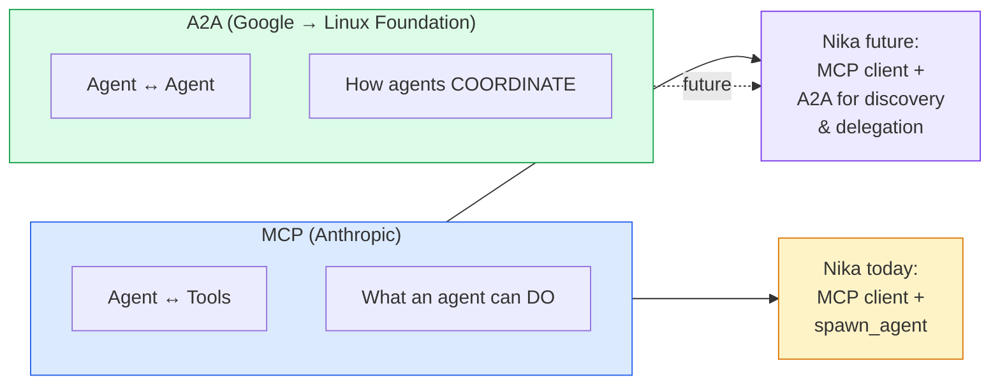

### MCP (Model Context Protocol)

- **Created by:** Anthropic
- **Focus:** Tool provision — exposing capabilities TO agents
- **Nika uses:** rmcp v0.16 as MCP client, NovaNet as MCP server
- **Role:** Intra-agent tooling (agent ↔ tools)

### A2A (Agent-to-Agent Protocol)

- **Created by:** Google (April 2025), donated to Linux Foundation (June 2025)
- **Key features:** Agent Cards at `/.well-known/agent.json`, JSON-RPC 2.0, SSE streaming, OAuth 2.0
- **Role:** Inter-agent communication (agent ↔ agent)

> [!NOTE]
> If Nika wants to support multi-runtime agent coordination (e.g., a Nika agent delegating to an external LangGraph agent), A2A is the protocol to adopt.

---

## Competitive Positioning

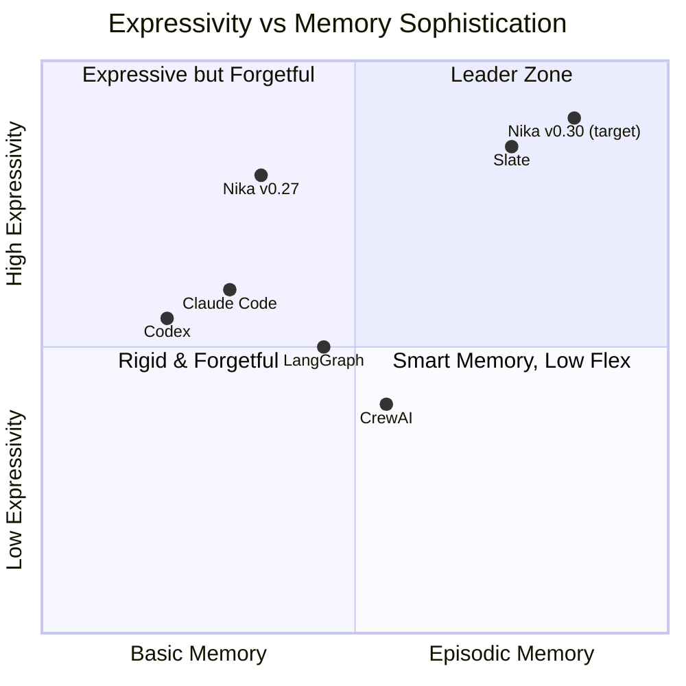

### Nika's Moat

No competitor has **all** of these:

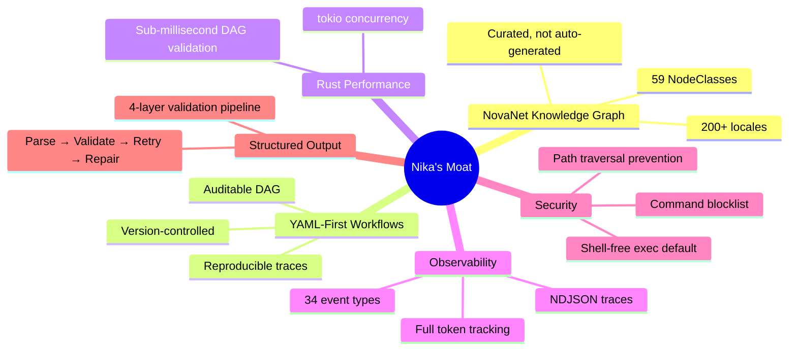

### NovaNet's Unique Position

Research confirmed that NovaNet has **no direct competitors** in the curated-graph native-generation space:

| Closest Alternative | Why It's Different |
|--------------------|--------------------|
| GraphRAG (Microsoft) | Auto-built from documents, not curated |
| Knowledge graph + LLM research | Academic, no product |
| Wikidata / DBpedia | General purpose, not per-org content generation |

> [!IMPORTANT]
> NovaNet's combination of per-locale knowledge atoms (Expression, Pattern, CultureRef, Taboo) with entity-based content generation is **unique in the market**. No competitor offers curated, locale-aware knowledge graph integration with workflow orchestration.

---

# Part 2 — Slate Deep Integration Strategy

> Copying Slate's thread/record architecture into Nika, then going beyond.
> Every concept mapped. Every claim verified. Every design grounded in existing code.

---

## Why This Part Exists

Slate (Random Labs)[^1] introduced an architecture — threads, records, thread weaving, orchestrator/agent dispatch — that solves the fundamental problems of long-running AI agents. This section maps every Slate concept to Nika's existing architecture, identifies what needs to change, and designs how Nika goes **beyond** Slate by leveraging the NovaNet knowledge graph, YAML declarative workflows, and full observability.

> [!IMPORTANT]
> **Guiding principle** — We are not building feature parity with Slate. We are taking Slate's **architectural insights** and implementing them in a way that is **declaratively superior** — auditable, reproducible, version-controlled, and knowledge-graph-powered.

---

## Slate's Core Architecture

### The Problem Slate Solves

LLM context windows are not uniformly useful. Performance degrades past a threshold — the "dumb zone" (Dex Horthy's term[^1]). Every existing approach fails in a specific way:

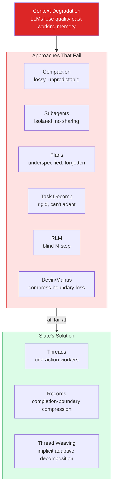

### The 8 Interconnected Concepts

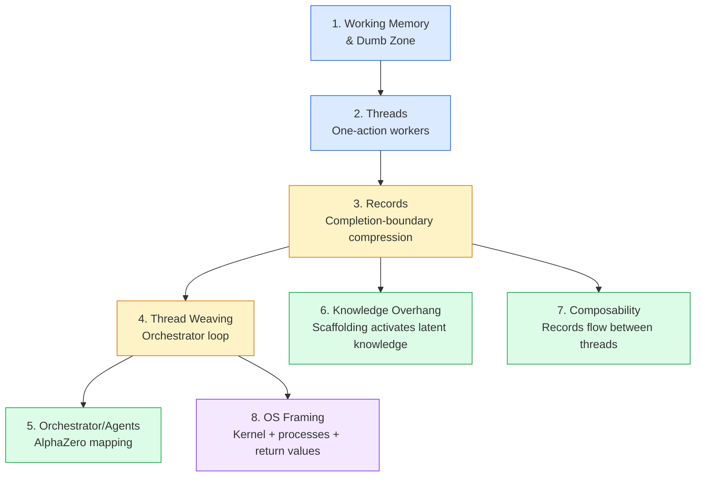

<details>
<summary>Concept Details</summary>

| # | Concept | Mechanism | Key Insight |
|---|---------|-----------|-------------|
| 1 | **Working Memory** | Context has a usable zone and a degraded "dumb zone" | Never exceed working memory threshold |
| 2 | **Threads** | Each thread executes ONE action, then pauses. NOT persistent subagents | Context isolated per thread |
| 3 | **Records** | Compressed representation at completion boundary (not mid-stream) | Only important results retained |
| 4 | **Thread Weaving** | Orchestrator: dispatch threads → collect records → synthesize → dispatch | Implicit adaptive decomposition |
| 5 | **Orchestrator/Agents** | Orchestrator = open-ended planning. Agents = learned action sequences | AlphaZero mapping (value + policy networks)[^2] |
| 6 | **Knowledge Overhang** | Models have knowledge they can't access without scaffolding | Records provide the scaffolding |
| 7 | **Composability** | Records flow between threads as handoff boundary | Cross-model composition |
| 8 | **OS Framing** | Orchestrator = kernel, Threads = processes, Records = return values | Karpathy's LLM OS framing |

</details>

> [!NOTE]
> **Slate's model configuration** — Slate supports cross-model composition (e.g., Sonnet + Codex for different cognitive tasks)[^1]. The "8 agent presets" (default/lite/think/search/vision/judge/coder/summary) is our design, inspired by this capability.

---

## The Critical Realization: Nika IS Already an OS

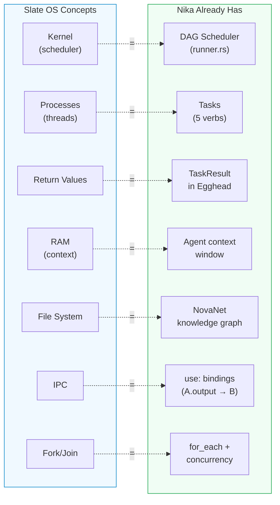

> [!TIP]
> **What's missing is NOT the kernel** — it's 4 kernel upgrades: record compression, dynamic process creation (orchestrator), memory budgets, and agent routing. The kernel itself (`Runner` + `TaskExecutor` + `Egghead`) already works.

---

## Concept-by-Concept Mapping

### Complete Mapping Table

| # | Slate Concept | Nika Existing | Nika Needed | Nika Goes Beyond |
|:-:|---------------|---------------|-------------|------------------|
| 1 | Working Memory | No awareness | Context budget per task | Budget is declarative YAML |
| 2 | Dumb Zone | N/A | Working memory boundary | Token budget in events |
| 3 | Threads | Tasks in DAG (partial) | Dynamic dispatch by orchestrator | Tasks referencing agents in YAML |
| 4 | Records | `TaskResult` (raw) | Record compression at boundary | NovaNet persistence |
| 5 | Thread Weaving | DAG execution (static) | Dynamic DAG + orchestrator loop | Real-time TUI visualization |
| 6 | Orchestrator/Agents | Flat agent loop | `goal:` | Declarative YAML orchestrators |
| 7 | Knowledge Overhang | NovaNet context + files | Record-based scaffolding | 200+ locale knowledge atoms |
| 8 | Episodic Memory | In-memory `Egghead` | NovaNet `Record` | Graph-queryable, entity-linked |
| 9 | Agent Presets | Single provider | `agents:` in YAML | Per-workflow agents |
| 10 | Composability | `use:` bindings | Record-aware bindings | Structured output + records |
| 11 | Parallel Threads | `for_each` + concurrency | Orchestrator parallel dispatch | Token budget + cost tracking |
| 12 | Cross-model | Multi-provider (6+native) | Agent preset per task | YAML-declared routing |
| 13 | OS Framing | DAG = kernel | Orchestrator = kernel upgrade | NovaNet = persistent storage |
| 14 | Permissions | Command blocklist + shell-free | Already better | 4-layer security model |
| 15 | build/plan agents | `agent:` verb | orchestrate mode selection | Multiple orchestrator configurations |
| 16 | Custom /commands | Skills via `include:` | Already exists | YAML skills merged via DAG |
| 17 | .env config | `.nika/config.toml` | Already exists | 3-level config merge |

---

## Design: The 5-Layer Architecture

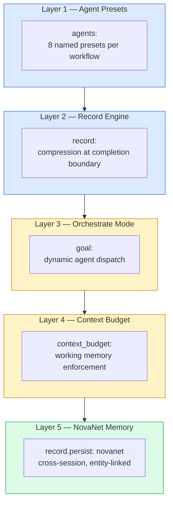

### Layer 1: Agent Presets

Per-workflow agent definitions that route different cognitive tasks to different providers. 8 presets available: default, lite, think, search, vision, judge, coder, summary. See [05-evolution-roadmap.md P-MODEL](./05-evolution-roadmap.md#p-model-4-slot-model-architecture) for full design.

```yaml
# models: layer defines reusable model references
models:
  sonnet: { provider: claude, model: claude-sonnet-4-20250514 }
  groq-llama: { provider: groq, model: llama-3.3-70b-versatile }
  deepseek: { provider: deepseek, model: deepseek-chat }
  gpt4o: { provider: openai, model: gpt-4o }

# agents: reference models by alias
agents:
  default: { model: sonnet }
  lite:    { model: groq-llama }
  search:  { model: deepseek }
  think:   { model: sonnet, extended_thinking: true }
  vision:  { model: gpt4o }
  judge:   { model: sonnet }
  coder:   { model: sonnet }
  summary: { model: groq-llama }
```

### Layer 2: Record Engine

See [05-evolution-roadmap.md P-RECORD](./05-evolution-roadmap.md#p-record-record-engine) for full design.

```yaml
record:
  compress: true           # LLM compression at completion boundary
  retain: [key_findings]   # Explicit key extraction
  max_tokens: 500          # Size limit
  confidence_threshold: 0.8
```

### Layer 3: Orchestrate Mode

The core upgrade. See [05-evolution-roadmap.md P-ORCHESTRATE](./05-evolution-roadmap.md#p-orchestrate-orchestrate-mode) for full design.

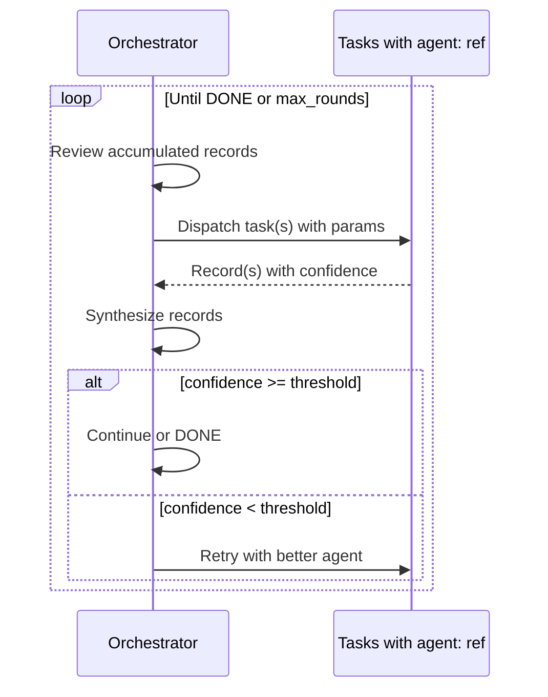

### Layer 4: Context Budget

See [05-evolution-roadmap.md P-CONTEXT](./05-evolution-roadmap.md#p-context-context-budget-management) for full design.

### Layer 5: NovaNet Episodic Memory

See [05-evolution-roadmap.md P-MEMORY](./05-evolution-roadmap.md#p-memory-novanet-episodic-memory) for full design.

---

## Why Nika Goes Beyond Slate

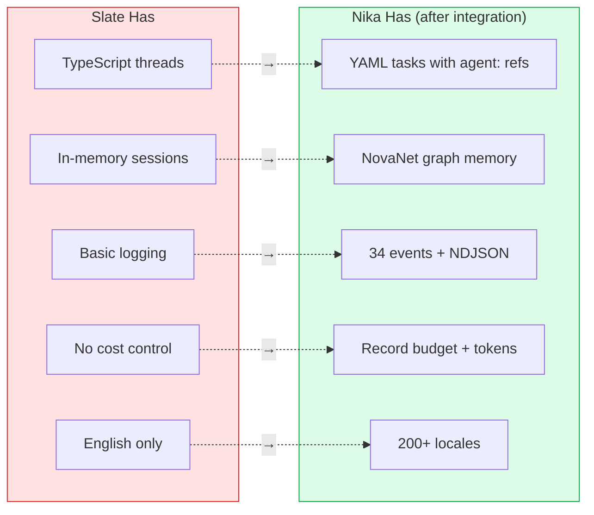

| Dimension | Slate | Nika (after integration) |
|-----------|-------|--------------------------|
| Thread definition | TypeScript code | YAML tasks with agent: refs |
| Record storage | In-memory session | `Egghead` + NovaNet graph |
| Cross-session | Session files | Knowledge graph (queryable) |
| Observability | Basic logging | 34 EventKind variants[^4] + NDJSON |
| Cost control | None | Record budget + token tracking |
| Knowledge source | None | NovaNet atoms (200+ locales) |
| Reproducibility | Non-deterministic | DAG traces + replay |
| Multi-locale | English only | 200+ locales |
| Model routing | Global config | Per-workflow `agents:` |
| Orchestration | Imperative code | Declarative YAML |
| DAG visualization | None | Real-time TUI |
| Structured output | Not documented | 4-layer validation |
| Security | Not documented | Shell-free + blocklist |

> [!IMPORTANT]
> **Unique to Nika** (Slate has NO equivalent):
> - NovaNet knowledge graph (59 NodeClasses, 159 ArcClasses)
> - Entity-linked episodic memory with graph queries
> - Knowledge atoms (Expression, Pattern, CultureRef, Taboo) across 200+ locales
> - NDJSON trace files with full event sourcing (34 EventKind variants)
> - 4-layer structured output (parse → validate → retry → repair)
> - DAG visualization in TUI with real-time thread/record view
> - Record budget with per-workflow cost prediction

---

## Architecture Comparison Matrix

For each dimension in Slate's comparison table[^1], here's where Nika lands:

| Dimension | ReAct | Plan | Task Trees | RLM | Devin | Claude Code | Slate | **Nika** |
|-----------|:-----:|:----:|:----------:|:---:|:-----:|:-----------:|:-----:|:--------:|
| Planning | Implicit | Explicit | Explicit | None | Explicit | Implicit | Implicit | **Implicit** |
| Decomposition | None | Manual | Static | None | Static | None | Implicit | **Implicit** |
| Feedback | Per-step | End | End | None | Per-task | Per-step | Per-record | **Per-record** |
| Context isolation | None | None | Partial | None | Full | None | Per-thread | **Per-task** |
| Compression | Compact | Compact | None | None | Compress | Compact | Record | **Record+NovaNet** |
| Parallelism | None | None | None | None | Multi-agent | None | Native | **for_each+orchestrate** |
| Adaptability | Low | Low | Low | Low | Medium | High | High | **High** |
| **Reproducibility** | Low | Low | Low | Low | Low | Low | Low | **High** |
| **Observability** | Low | Low | Low | Low | Medium | Medium | Low | **High** |
| **Cost control** | None | None | None | None | None | None | None | **Record budget** |
| **Knowledge graph** | None | None | None | None | None | None | None | **NovaNet** |

---

## Complete Example

<details>
<summary>Full Orchestrate Workflow — Landing Page Generation</summary>

```yaml
schema: nika/workflow@0.13
workflow: generate-landing-page

models:
  sonnet: { provider: claude, model: claude-sonnet-4-20250514 }
  groq-llama: { provider: groq, model: llama-3.3-70b-versatile }
  deepseek: { provider: deepseek, model: deepseek-chat }
  gpt4o: { provider: openai, model: gpt-4o }

goal: |
  Generate a complete French landing page for QR Code AI.
  Use NovaNet for entity context and locale knowledge.
  Research current trends, write sections, review quality.

agents:
  think:
    model: sonnet
    extended_thinking: true
    thinking_budget: 16384
  default:  { model: sonnet }
  search:   { model: groq-llama }
  lite:     { model: deepseek }
  vision:   { model: gpt4o }
  judge:
    provider: anthropic
    model: claude-sonnet-4-6
  coder:
    provider: anthropic
    model: claude-sonnet-4-6
  summary:
    provider: groq
    model: llama-3.3-70b-versatile

mcp:
  servers:
    novanet:
      command: cargo
      args: ["run", "--manifest-path", "/path/to/novanet/Cargo.toml"]

goal:
  goal: |
    Generate a complete French landing page for QR Code AI.
    Use NovaNet for entity context and locale knowledge.
    Research current trends, write sections, review quality.
  agent: think
  max_rounds: 8
  record_budget: 15000

tasks:
  - id: get_context
    agent: lite
    invoke:
      tool: novanet_context
      server: novanet
      params:
        focus_key: "homepage"
        locale: "fr-FR"
        mode: page
    record:
      compress: true
      max_tokens: 500

  - id: research
    agent: search
    context_budget: 4000
    infer: "Research: {{use.topic}}"
    record:
      compress: true
      max_tokens: 300
      retain: [key_findings]

  - id: write_section
    agent: default
    context_budget: 8000
    use:
      context: $get_context
    infer: |
      Write the {{use.section}} section for the landing page.
      Entity context: {{use.context}}
      Research: {{use.research_records}}
    record:
      compress: true
      retain: [content]
      max_tokens: 800

  - id: review
    agent: judge
    infer: |
      Review the following draft sections for quality and coherence:
      {{use.drafts}}
      Check against QR Code AI brand guidelines and French locale conventions.
    record:
      compress: true
      retain: [issues, suggestions, score]
      confidence_threshold: 0.85

  - id: persist_records
    agent: lite
    invoke:
      tool: novanet_write
      server: novanet
      params:
        class: Record
        key: "landing-page-{{date}}"
    record:
      persist: novanet
      entity_link: qr-code-ai
```

</details>

---

## Confidence → Natural Escalation

The old P3 ConfidenceRouter is absorbed into records. Confidence is a property, not a system:

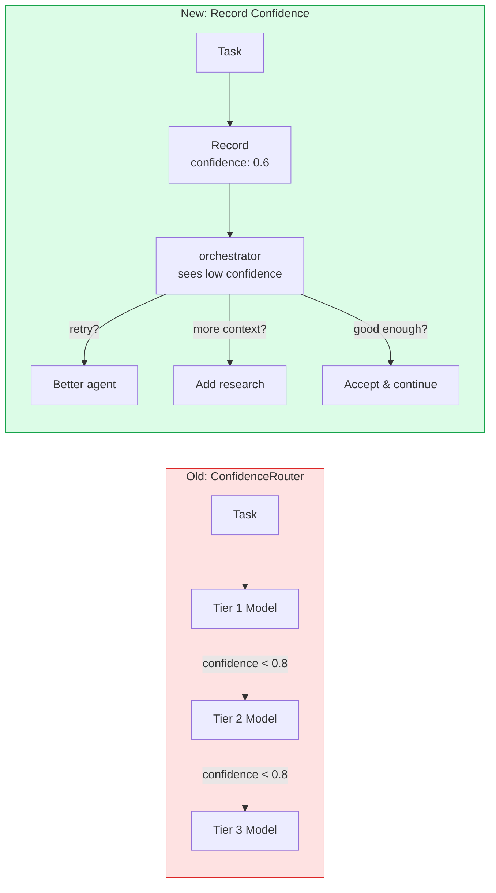

> [!TIP]
> The orchestrator has **full context** to decide how to handle low confidence. A rigid router has fixed rules. This is simpler AND more powerful.

---

## Summary

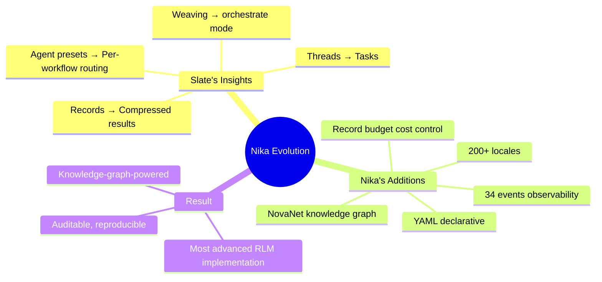

> [!IMPORTANT]
> **The Golden Rule (extended):**
>
> | Concern | Owner | Why |
> |---------|-------|-----|
> | **KNOWING** things | NovaNet | Knowledge graph, entities, locales, semantics |
> | **DOING** things | Nika | Workflow execution, DAG, verbs, providers |
> | **CONNECTING** | MCP | Protocol boundary, zero Cypher in Nika |
> | **THINKING** | Records | orchestrate mode, agent routing, confidence |
> | **REMEMBERING** | Records → NovaNet | Cross-session memory, entity-linked persistence |

---

<div align="center">

[← 01 State of the Art](./01-current-features.md) · [Index](./00-README.md) · [05 Roadmap →](./05-evolution-roadmap.md)

</div>

---

[^1]: Slate by Random Labs — [Technical blog post](https://randomlabs.ai/blog/slate) with 26 academic references. Thread-based episodic memory architecture. The "8 agent presets" design is our proposal, inspired by Slate's cross-model composition (Sonnet + Codex). [Documentation](https://docs.randomlabs.ai). npm: `@randomlabs/slate` v1.0.15.
[^2]: McGrath et al., "Acquisition of Chess Knowledge in AlphaZero" — [PNAS 2022](https://www.pnas.org/doi/10.1073/pnas.2206625119). Hierarchical decomposition with per-task model routing. orchestrator/agents separation cited in Slate blog.
[^3]: THREAD: Thinking Hierarchically for Resource-Efficient Agent Decision-making — [arXiv:2405.17402](https://arxiv.org/abs/2405.17402). Hierarchical decomposition with per-task model routing.
[^4]: Verified via `src/event/log.rs` — 34 `EventKind` variants as of v0.27.0.
