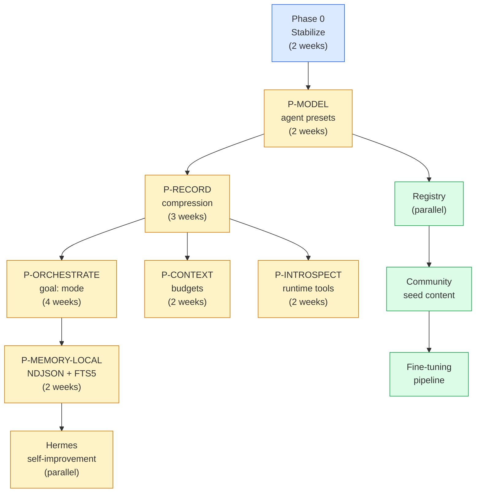
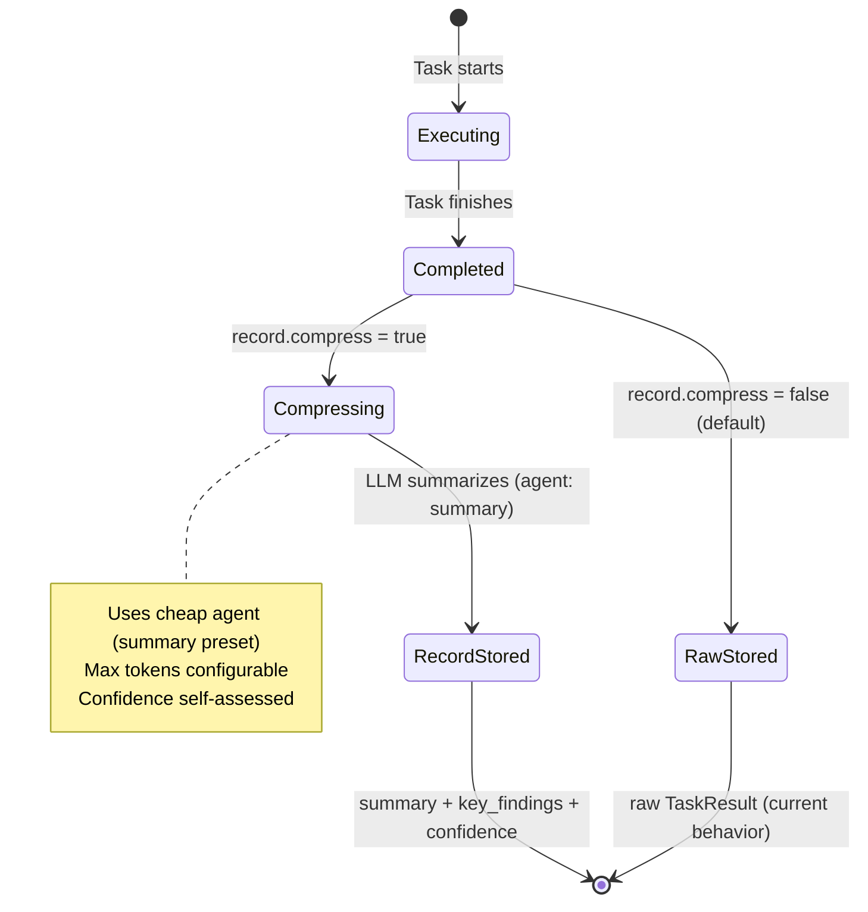
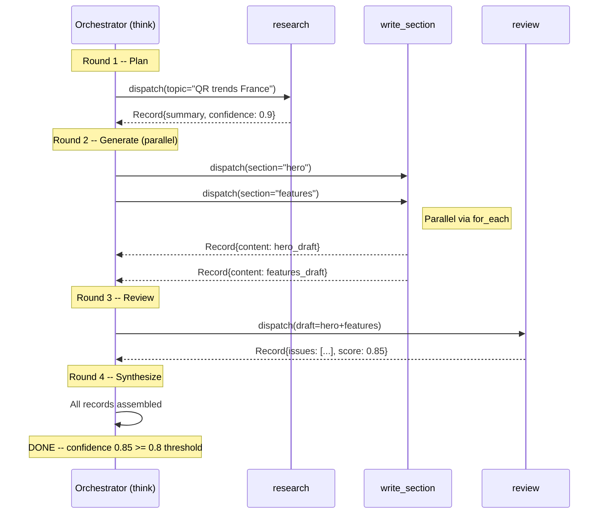
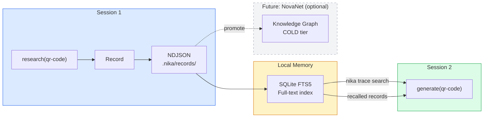
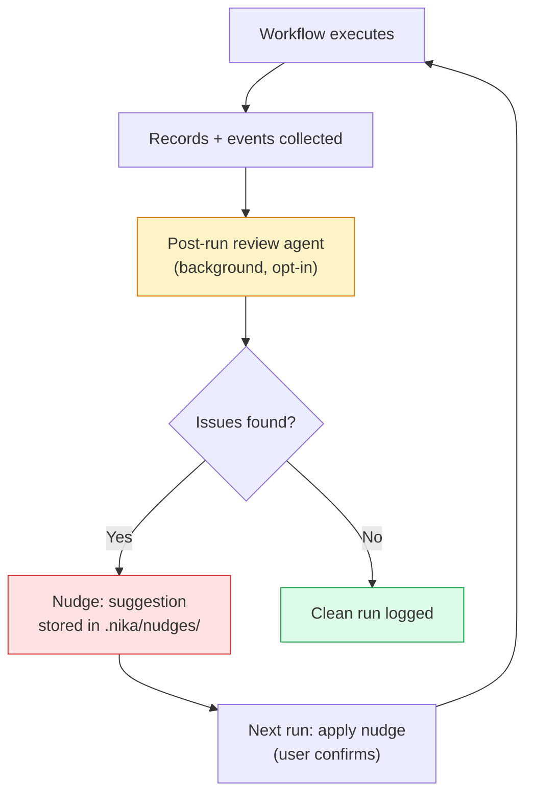
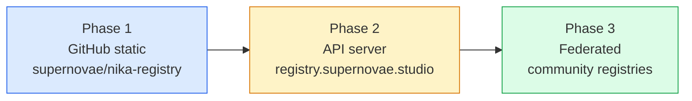
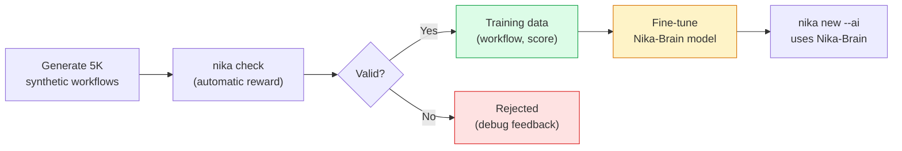
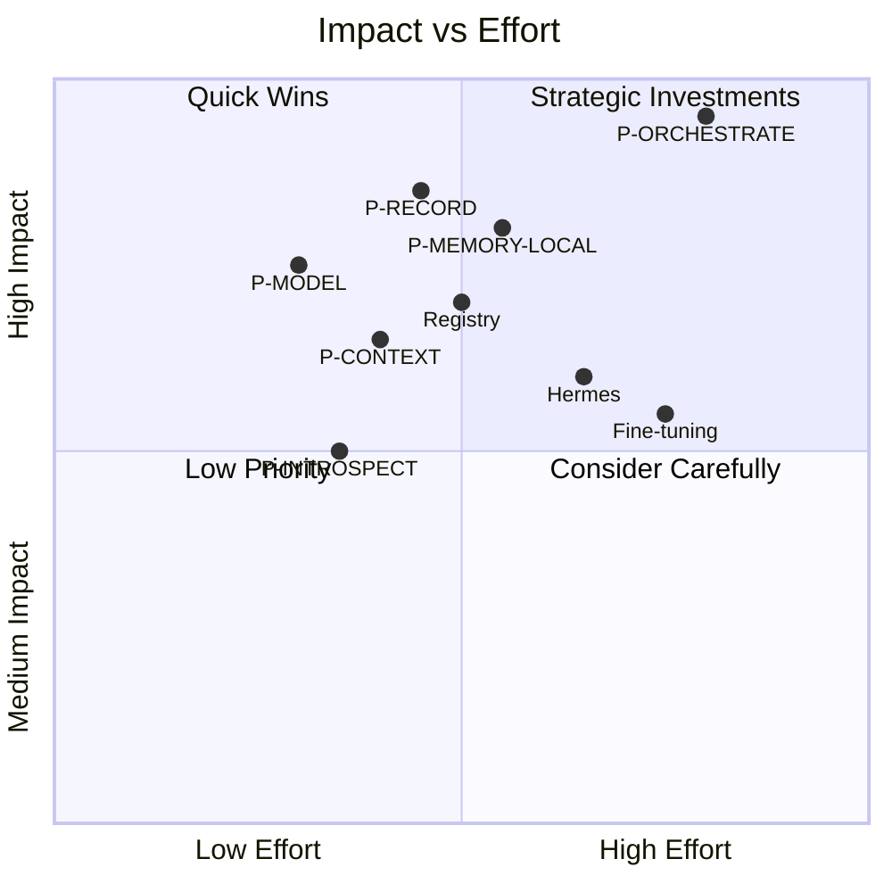

# 05 — Evolution Roadmap

> From solid engine to intelligent platform with ecosystem.
> 3 phases, 5 intelligence layers, 18 weeks to v1.0.

**Nika** v0.49.3 -> v1.0 | **Schema** stays @0.12 (additive only) | Updated 2026-03-28

---

## How We Got Here

The original roadmap (March 2026, v0.27) planned 6 priorities in 3 waves targeting v0.30: P-MODEL, P-RECORD, P-ORCHESTRATE, P-CONTEXT, P-MEMORY, P-INTROSPECT. None were implemented. Instead, 22 versions shipped a massive foundation of **other** capabilities:

| Version Range | What Shipped |
|---------------|-------------|
| v0.28-v0.33 | TUI v2 with 3 views, crate split into 10 workspace crates, course system (12 levels, 226 exercises) |
| v0.34-v0.36 | Vision/multimodal support, 24 media tools (3 tiers), 9 fetch extract modes, structured output with 5-layer defense |
| v0.37-v0.40 | Cargo workspace unification, AI integration suite (`nika setup`), showcase system (115 workflows) |
| v0.41-v0.45 | 6 deep audit rounds (50+ bug fixes), 3200 LOC dead code removed, CIDR SSRF hardening |
| v0.46-v0.49 | Display v3 (live renderer), daemon (secrets + jobs + cache), custom endpoints (vLLM/TGI/Ollama), LSP core extraction |

**Today's numbers**: 8,457 tests, 10 crates, 7 cloud providers + native GGUF + custom endpoints, 24 media tools, 43 event kinds, 31 pipe transforms, 115 showcase workflows, 226 course exercises.

---

## The Realization: `agents:` Already Exists

The original roadmap proposed `model_slots:` -- a new concept for routing tasks to different models. It was never built. Meanwhile, a better abstraction was implemented: **`agents:`**.

The `agents:` block already exists in the AST (`nika-core/src/ast/agent_def.rs`) and supports three definition modes:

```yaml
# Already implemented in AgentDef enum:
agents:
  researcher:
    from: ./agents/researcher         # From file or folder (auto-detect format)
  helper:
    file: ./agents/helper.agent.yaml  # Explicit YAML reference
  translator:
    system: "You are a translator"    # Inline definition
    provider: anthropic
    model: claude-sonnet-4-20250514
    max_turns: 3
    temperature: 0.7
    skills:
      - ./skills/translation.md
```

**We do not need `model_slots:`**. The `agents:` system is strictly more powerful: it carries system prompts, skills, provider config, and supports external file references. The missing piece is wiring: tasks need an `agent:` shorthand field so that `infer:`, `fetch:`, and `exec:` tasks can inherit agent presets -- not just the `agent:` verb.

---

## Roadmap Overview

```mermaid
flowchart LR
    subgraph P0["Phase 0: Stabilize"]
        direction TB
        S1["LSP + Registry fixes"]
        S2["agents: wiring"]
        S3["Vision docs"]
        S4["Showcase CLI"]
    end

    subgraph P1["Phase 1: Intelligence"]
        direction TB
        M1["P-MODEL\nagent presets"]
        M2["P-RECORD\ncompression"]
        M3["P-ORCHESTRATE\ngoal: mode"]
        M4["P-CONTEXT\nbudgets"]
        M5["P-MEMORY-LOCAL\nNDJSON + FTS5"]
        M6["Self-improvement\nHermes loop"]
    end

    subgraph P2["Phase 2: Ecosystem"]
        direction TB
        E1["Registry deploy"]
        E2["nika pkg publish"]
        E3["Community seed"]
        E4["Fine-tuning pipeline"]
    end

    P0 --> P1
    P1 --> P2

    style P0 fill:#dbeafe,stroke:#2563eb
    style P1 fill:#fef3c7,stroke:#d97706
    style P2 fill:#dcfce7,stroke:#16a34a
```



---

## Dependency Chain



**Critical path**: Stabilize --> P-MODEL --> P-RECORD --> P-ORCHESTRATE --> P-MEMORY-LOCAL

Everything else parallelizes around this spine.

---

## Phase 0: Stabilize (v0.50 -- 2 weeks)

**Rule**: Zero new features. Fix what is broken. Update what is stale.

### 0.1 Blockers (Day 1-2)

| # | Task | Location | Effort |
|---|------|----------|--------|
| B1 | Fix LSP borrow-after-move | `nika-lsp/src/backend.rs:90` | 5 min |
| B2 | Fix VS Code extension marketplace | CI / VSCE_PAT renewal | 1h |
| B3 | Deploy registry.supernovae.studio | GitHub static (Phase 1 infra) | 4h |
| B4 | Fix error code table gaps in CLAUDE.md | `tools/nika/CLAUDE.md` | 15 min |

### 0.2 Wire `agents:` to All Tasks (Day 3-4)

The `agents:` block exists but only the `agent:` verb consumes it. The critical gap: `infer:`, `fetch:`, and `exec:` tasks cannot reference agent presets. This is the #1 prerequisite for P-MODEL.

| # | Task | Detail |
|---|------|--------|
| A1 | Add `agent:` shorthand field on all task types | `agent: lite` inherits provider + model + temperature + system |
| A2 | Implement preset inheritance chain | agent def --> task-level override --> workflow defaults |
| A3 | Document `agents:` + `from:` in nika rules | Existing feature, zero documentation |
| A4 | Test inheritance with 3+ levels of override | agent def, task fields, workflow provider |

### 0.3 Vision Docs Coherence (Day 5-6)

| # | Task | Detail |
|---|------|--------|
| D1 | Add deprecation banners to outdated vision docs | "Written for v0.27. Current: v0.49. See master plan." |
| D2 | Replace model_slots naming everywhere | Use agents: with default/lite/think/search/vision/judge/coder/summary |
| D3 | Update competitive matrix in doc 03 | Add TUI, media, structured output, custom endpoints |
| D4 | Create "Current vs Vision" status matrix | What shipped vs what is planned |

### 0.4 Showcase + Course CLI (Day 7-10)

| # | Task | Detail |
|---|------|--------|
| S1 | `nika showcase list` | List all 115 workflows with category filter |
| S2 | `nika showcase extract <name>` | Extract workflow to current directory |
| S3 | `nika course status` | Show constellation progress map |
| S4 | `nika course next` | Open next exercise |
| Q1 | Onboarding wizard on MissingApiKey | Auto-launch `nika setup` when key is missing |
| Q2 | Jobs exit code bug | 2 LOC fix from v0.49 handoff |
| Q3 | Dry-run cost estimation in summary | Show estimated cost without executing |

**Exit criteria Phase 0:**

- `cargo check --workspace` = zero errors (including `nika-lsp`)
- `cargo test --workspace --lib` = 8,500+ tests
- `nika showcase list` shows 115 workflows
- `nika pkg search` reaches registry (even if empty)
- VS Code marketplace published at v0.50
- Vision docs have deprecation banners
- `agents:` documented with examples
- `agent:` shorthand works on `infer:` tasks

---

## Phase 1: Intelligence (v0.51-v0.55 -- 10 weeks)

**Rule**: Ship incrementally. Each sub-version adds one priority layer.

### 1.1 P-MODEL: Agent Preset Routing (v0.51 -- 2 weeks)

Builds on Phase 0's `agents:` wiring. Adds intelligent routing, fallback chains, and cost awareness.

**Slate mapping[^1]**: Named agents replace Slate's cross-model composition. `agents:` IS the model routing layer -- no new concept needed.

| # | Task | Detail | Effort |
|---|------|--------|--------|
| M1 | Agent preset resolution in executor | `agent: think` resolves provider + model + system + temperature | M |
| M2 | Preset inheritance chain | agent def --> task override --> workflow default | M |
| M3 | Inference routing with fallback | `provider: [gemini, deepseek, anthropic]` array syntax | M |
| M4 | Cost-aware routing hints | Task metadata shows model cost estimate | L |
| M5 | `nika:cost` introspection tool | Builtin tool returning tokens + cost | L |
| M6 | Events: `AgentPresetUsed`, `ProviderFallback` | 2 new EventKind variants | L |

```yaml
schema: "nika/workflow@0.12"
workflow: multi-model-content

agents:
  think:
    system: "You are a strategic planner."
    provider: anthropic
    model: claude-sonnet-4-20250514
    temperature: 0.3
  lite:
    system: "You are a fast content generator."
    provider: groq
    model: llama-3.3-70b-versatile
  search:
    system: "You are a research analyst."
    provider: deepseek
    model: deepseek-chat
  coder:
    from: ./agents/coder.agent.yaml    # External definition

tasks:
  - id: plan
    agent: think                       # Expensive: extended thinking
    infer: "Plan the landing page structure for {{inputs.topic}}"

  - id: research
    agent: search                      # Cheap: data retrieval
    fetch:
      url: "https://api.example.com/trends"
      extract: jsonpath
      selector: "$.data[*].keyword"

  - id: generate
    agent: lite                        # Fast: bulk generation
    with: { plan: $plan, data: $research }
    infer: "Generate content using: {{with.plan}}"
    provider: [groq, deepseek, anthropic]   # Fallback chain
```

**Key difference from original `model_slots:` design**: agents carry system prompts, skills, and behavioral config -- not just provider + model. A `think` agent is not just "Claude with thinking enabled" -- it is a complete persona with instructions, tool access, and cost constraints.

---

### 1.2 P-RECORD: Record Compression (v0.52 -- 3 weeks)

The critical primitive. Records are compressed representations of task output, generated at the natural completion boundary. Downstream tasks receive **records** (summaries), not raw output. This is Slate's core innovation[^1] adapted for YAML-first workflows.

**Context-Folding mapping[^3]**: Sub-DAG results are auto-compressed at completion boundaries, keeping context growth logarithmic instead of linear.



| # | Task | Detail | Effort |
|---|------|--------|--------|
| R1 | `Record` struct | summary, key_findings, confidence, tokens, cost, model | M |
| R2 | `RecordCompressor` | Uses `agent: summary` (cheap model) to compress | H |
| R3 | `record:` field in Task AST | compress, retain, max_tokens, confidence_threshold | L |
| R4 | Record-aware bindings | `with: { data: $task }` returns Record when compress = true | M |
| R5 | Backward compatibility | No `record:` block = raw output (current behavior) | L |
| R6 | Events: `RecordCreated`, `ConfidenceScore` | New EventKind variants | L |
| R7 | `nika:records` introspection tool | Query accumulated records in current run | M |

```yaml
schema: "nika/workflow@0.12"

agents:
  search: { provider: deepseek, model: deepseek-chat, system: "Research analyst." }
  think: { provider: anthropic, model: claude-sonnet-4-20250514, system: "Writer." }
  summary: { provider: groq, model: llama-3.3-70b-versatile, system: "Compress to essentials." }

tasks:
  - id: research
    agent: search
    infer: "Research QR code adoption trends in France for 2026"
    record:
      compress: true                   # Generate compressed Record after execution
      retain: [key_findings, statistics]  # Fields to extract explicitly
      max_tokens: 500                  # Record summary size limit

  - id: write
    agent: think
    with: { findings: $research }      # Gets compressed Record (~500 tokens), not raw (~10K tokens)
    infer: |
      Write an article about QR code trends using this research:
      {{with.findings}}
```

**Why this matters**: Without records, a 5-task pipeline accumulates context linearly. Task 5 receives the full output of tasks 1-4. Past ~8K tokens, LLM performance degrades into what Slate calls the "dumb zone"[^1]. Records keep each handoff bounded.

<details>
<summary>Rust data structure</summary>

```rust
/// Compressed representation of a task's execution.
/// Generated at the natural completion boundary (not mid-stream).
pub struct Record {
    pub task_id: TaskId,
    pub summary: String,              // LLM-compressed summary
    pub key_findings: Vec<String>,    // Extracted key points
    pub raw_output: Option<String>,   // Original (debug only, not passed downstream)
    pub model_used: String,           // Which model produced this
    pub tokens_spent: u64,            // Cost tracking
    pub confidence: f64,              // Self-assessed (0.0-1.0)
    pub artifacts: Vec<ArtifactRef>,  // Files produced
}
```

Location: `src/runtime/record.rs` (NEW)

</details>

---

### 1.3 P-ORCHESTRATE: Goal-Driven Execution (v0.53 -- 4 weeks)

The hardest piece. A new execution mode where Nika's **orchestrator** dynamically dispatches tasks based on a `goal:` and accumulated records. This is Slate's thread weaving[^1]: implicit adaptive decomposition via an orchestrator loop.

**THREAD mapping[^2]**: Hierarchical decomposition with resource-aware model selection.
**RLM mapping[^6]**: Recursive sub-calls with external working memory.



| # | Task | Detail | Effort |
|---|------|--------|--------|
| O1 | `goal:` field in Workflow AST | String field, auto-detects orchestrate mode | L |
| O2 | `Orchestrator` struct | Loop: review records --> dispatch --> synthesize --> repeat | H |
| O3 | `DynamicDag` in `dag/dynamic.rs` | Runtime task creation (mutable DAG) | H |
| O4 | Orchestrator plans in YAML | Generates `.nika.yaml`, runs via `nika:run` | H |
| O5 | Round tracking | max_rounds, record_budget, cost limit | M |
| O6 | `nika:orchestrate` introspection tool | Current round, budget, progress | L |

```yaml
schema: "nika/workflow@0.12"
workflow: landing-page-generator

goal: |
  Generate a complete French landing page for QR Code AI.
  Research current trends, write 4 sections, review quality.
  Target confidence: 0.85

agents:
  think:
    provider: anthropic
    model: claude-sonnet-4-20250514
    system: "You are a strategic orchestrator."
    temperature: 0.3
  lite:
    provider: groq
    model: llama-3.3-70b-versatile
    system: "You are a fast content generator."
  search:
    provider: deepseek
    model: deepseek-chat
    system: "You are a research analyst."

# Satellite templates -- dispatched dynamically by the orchestrator
tasks:
  - id: research
    agent: search
    infer: "Research: {{with.topic}}"
    record: { compress: true, max_tokens: 300 }

  - id: write_section
    agent: lite
    infer: "Write: {{with.section}} using context: {{with.context}}"
    record: { compress: true, retain: [content], max_tokens: 800 }
    structured:
      schema:
        type: object
        properties:
          content: { type: string }
          word_count: { type: integer }
        required: [content]

  - id: review
    agent: think
    infer: "Review and critique: {{with.draft}}"
    record: { compress: true, retain: [issues, score] }
    structured:
      schema:
        type: object
        properties:
          issues: { type: array, items: { type: string } }
          score: { type: number }
        required: [issues, score]
```

#### Dynamic Workflow Generation

The core capability of P-ORCHESTRATE. When Nika receives a `goal:`, the orchestrator does not merely dispatch existing task templates. It **writes new `.nika.yaml` workflows on the fly**, runs them, evaluates quality, improves them, and re-runs until the goal is achieved. The orchestrator thinks in YAML workflows, not natural language.

```
goal: "Generate French landing page"
  |
Round 1: Orchestrator writes plan.nika.yaml
  |
Round 2: Nika runs plan.nika.yaml --> gets results
  |
Round 3: Orchestrator evaluates --> confidence 0.6 (too low)
  |
Round 4: Orchestrator writes improved-plan.nika.yaml
  |
Round 5: Nika runs improved plan --> confidence 0.9 --> DONE
```

The orchestrator has access to 6 introspection tools:

| Tool | Returns | Purpose |
|------|---------|---------|
| `nika:cost` | `{total_tokens, total_cost, per_model}` | Budget awareness |
| `nika:records` | `[{task_id, summary, confidence, tokens}]` | Accumulated knowledge |
| `nika:orchestrate` | `{round, max_rounds, budget_used}` | Progress tracking |
| `nika:dag_info` | `{predecessors, successors, critical_path}` | DAG structure |
| `nika:task_status` | `{task_id, status, record}` | Per-task results |
| `nika:threads` | `[{task_id, status, agent}]` | Active/completed threads |

<details>
<summary>What the orchestrator generates internally</summary>

```yaml
# Auto-generated by Nika orchestrator -- Round 1
schema: "nika/workflow@0.12"
workflow: __orchestrator_round_1

agents:
  researcher:
    system: "You are a QR code market research analyst for the French market."
    provider: deepseek
    model: deepseek-chat
    skills: [./skills/research.md]
  writer:
    system: "You are a French copywriter for tech products."
    provider: groq
    model: llama-3.3-70b-versatile

tasks:
  - id: research
    agent: researcher
    infer: "Find latest QR code adoption trends in France 2026"
    record: { compress: true, max_tokens: 400 }

  - id: write_hero
    agent: writer
    depends_on: [research]
    with: { research: $research }
    infer: "Write hero section using: {{with.research}}"
    record: { compress: true, retain: [content] }

  - id: write_features
    agent: writer
    depends_on: [research]
    with: { research: $research }
    infer: "Write features section using: {{with.research}}"
    record: { compress: true, retain: [content] }

  - id: assemble
    depends_on: [write_hero, write_features]
    with:
      hero: $write_hero
      features: $write_features
    infer: |
      Assemble the landing page from these sections:
      Hero: {{with.hero}}
      Features: {{with.features}}
    artifact: { path: ./output/landing-page.md }
```

The generated workflow uses all Nika primitives: agents, records, `with:` bindings, `depends_on`, DAG parallelism, artifacts, structured output. It is a complete, valid `.nika.yaml` file.

</details>

<details>
<summary>Why this approach is unique</summary>

No other framework has an orchestrator that plans in its own workflow language:

| Framework | How It Plans | Limitation |
|-----------|-------------|------------|
| **LangGraph** | Python code | Plans are opaque, not portable |
| **CrewAI** | Natural language | Plans are non-deterministic, not auditable |
| **AutoGen** | Agent conversations | Plans are implicit, not reusable |
| **Nika** | `.nika.yaml` workflows | Plans are deterministic, auditable, reusable, full-featured |

Because Nika's plans are YAML workflows, they are:

- **Deterministic** -- DAG execution with explicit dependencies
- **Auditable** -- YAML is human-readable, diffable, reviewable
- **Reusable** -- Save the generated workflow for next time
- **Full-featured** -- All 5 verbs, agents, guardrails, structured output, MCP tools
- **Version-controlled** -- Store generated plans in git alongside hand-written workflows

</details>

---

### 1.4 P-CONTEXT + P-INTROSPECT (v0.54 -- 2 weeks, parallel)

Working memory awareness at the runtime level. Each task declares its context budget. The runtime enforces this by passing record summaries, never raw history.

```mermaid
flowchart TB
    subgraph BEFORE["Without P-CONTEXT"]
        B1["Task A output\n2,000 tokens"] --> B2["Task B receives\nfull 2,000 tokens"]
        B2 --> B3["Task C receives\nA + B = 4,000 tokens"]
        B3 --> B4["Task D receives\nA+B+C = 6,000+ tokens"]
        B4 --> B5["Context degradation\n(dumb zone)"]
    end

    subgraph AFTER["With P-CONTEXT"]
        A1["Task A --> Record\n300 tokens"] --> A2["Task B receives\nrecord = 300 tokens"]
        A2 --> A3["Task C receives\nA_rec + B_rec = 600 tokens"]
        A3 --> A4["Task D receives\nrelevant records only"]
        A4 --> A5["Working memory\nalways within budget"]
    end

    style BEFORE fill:#fee2e2,stroke:#dc2626
    style AFTER fill:#dcfce7,stroke:#16a34a
    style B5 fill:#dc2626,color:#fff
    style A5 fill:#16a34a,color:#fff
```



| # | Task | Detail | Effort |
|---|------|--------|--------|
| C1 | `context_budget:` field on Task | Max tokens in context window | L |
| C2 | Budget enforcement in executor | Truncate/warn if exceeded | M |
| C3 | Token counting utilities | Approximate tokenizer (tiktoken-compatible) | M |
| C4 | 4 remaining introspection tools | `nika:dag_info`, `nika:task_status`, `nika:threads`, `nika:orchestrate` | M |
| C5 | Budget tracking in events | `BudgetExceeded`, `ContextTruncated` event kinds | L |

```yaml
tasks:
  - id: research
    agent: search
    context_budget: 4000               # Max tokens in this task's context
    infer: "Research QR code trends"
    record:
      compress: true
      max_tokens: 300                  # Record must fit in 300 tokens

  - id: generate
    agent: think
    context_budget: 8000               # Larger budget for generation
    with:
      trends: $research                # Receives record (~300 tokens), not raw output (~10K)
    infer: "Generate landing page based on: {{with.trends}}"
```

**Rules:**
1. Each task receives ONLY: its prompt + relevant records + context files
2. Never raw output history from upstream tasks (when records are enabled)
3. `context_budget` enforced by the runtime (truncate + warn if exceeded)
4. The orchestrator manages which records to include per round
5. Token budget tracked in events for observability

---

### 1.5 P-MEMORY-LOCAL + Self-Improvement (v0.55 -- 2 weeks)

**NovaNet-free** memory layer. Records persist to disk in NDJSON format with SQLite FTS5 for cross-session search. No NovaNet dependency. No cloud. Fully local.

This is a deliberate design choice: all 5 intelligence layers (MODEL, RECORD, ORCHESTRATE, CONTEXT, MEMORY) work without NovaNet. NovaNet becomes an optional upgrade for persistent knowledge graph storage (COLD tier), not a prerequisite.



| # | Task | Detail | Effort |
|---|------|--------|--------|
| ME1 | `.nika/records/` NDJSON persistence | Write records to disk after workflow completes | M |
| ME2 | SQLite FTS5 index | Full-text search across sessions | M |
| ME3 | `nika trace search <query>` | CLI for cross-session recall | L |
| ME4 | Frozen snapshot pattern | Context files loaded once, never re-read mid-run | L |
| ME5 | File locking (fcntl) | Concurrent write safety for daemon | L |

#### 3-Tier Memory Architecture

| Tier | Storage | Lifetime | Access |
|------|---------|----------|--------|
| **HOT** | `Egghead` DashMap (RAM) | One workflow run | `with: { data: $task }` |
| **WARM** | `.nika/records/` NDJSON + FTS5 | Configurable TTL | `nika trace search` |
| **COLD** | NovaNet Knowledge Graph (future) | Permanent | `invoke: novanet::search` |

Records start in HOT (one run), persist to WARM (NDJSON) after workflow completion, and can optionally be promoted to COLD (NovaNet) when they prove valuable across sessions.

---

### Self-Improvement: The Hermes Loop

Inspired by the Hermes framework for self-improvement in agentic systems. The key insight: Nika can improve its own workflows by analyzing execution traces.



| # | Task | Detail | Effort |
|---|------|--------|--------|
| H1 | Background nudge agent | Post-workflow review, stores suggestions | H |
| H2 | Nudge storage in `.nika/nudges/` | YAML suggestions with confidence + reasoning | M |
| H3 | Security scanning | Injection detection on LLM outputs | M |
| H4 | `nika nudge list` / `nika nudge apply` | CLI for reviewing and applying suggestions | M |

The nudge system is **opt-in** and **non-destructive**. Nika never modifies workflows without user confirmation. Suggestions are stored as YAML files that explain what to change and why.

**Exit criteria Phase 1:**

- Agent presets route to different models per task
- Records compress outputs and pass summaries downstream
- `goal:` field triggers orchestrator loop
- Context budgets prevent degradation past the dumb zone
- Cross-session memory via NDJSON + FTS5
- 6 introspection builtin tools (total: 30)
- Inference routing with fallback chains
- `cargo test --workspace --lib` = 9,000+ tests

---

## Phase 2: Ecosystem (v0.56-v0.60 -- 6 weeks)

### 2.1 Package Registry (v0.56 -- 2 weeks)

The "npm moment" for AI workflows. 5 package types, 3-phase rollout, security scanning.

#### 5 Package Types

| Type | Extension | Contains | Example |
|------|-----------|----------|---------|
| `workflow` | `.nika.yaml` | Complete workflow | `@supernovae/qr-landing-page` |
| `agent` | `.agent.yaml` | Agent definition | `@supernovae/researcher` |
| `skill` | `.skill.md` | Prompt augmentation | `@supernovae/french-copywriting` |
| `template` | `.nika.yaml` | Parameterized starter | `@supernovae/blog-generator` |
| `bundle` | `package.yaml` | Multiple of the above | `@supernovae/content-suite` |

#### 3-Phase Registry Rollout



| # | Task | Detail | Effort |
|---|------|--------|--------|
| E1 | GitHub-based registry (Phase 1) | `supernovae/nika-registry` repo, JSON index | M |
| E2 | `nika pkg publish` command | Create tarball + PR to registry | M |
| E3 | Seed registry with 20 packages | Extract from 115 showcases | M |
| E4 | Security scanning on install | Injection, SSRF, command blocklist patterns | M |
| E5 | Trust levels: builtin / trusted / community | Visual badges in `nika pkg search` | L |

### 2.2 Community and Content (v0.57 -- 2 weeks)

| # | Task | Detail | Effort |
|---|------|--------|--------|
| C1 | `nika showcase extract --all` | Extract all 115 to a directory | L |
| C2 | Workflow metadata (WORKFLOW.md) | Frontmatter compatible with agentskills.io | M |
| C3 | `nika new --ai "description"` | Natural language to `.nika.yaml` generation | M |
| C4 | Course gamification | Constellation map, badges, streaks | M |

### 2.3 Integration and Distribution (v0.58-v0.60 -- 2 weeks)

| # | Task | Detail | Effort |
|---|------|--------|--------|
| I1 | Telegram webhook trigger | Daemon receives Telegram message, runs workflow | H |
| I2 | MCP server expansion | Add `nika_run`, `nika_list_packages` tools | M |
| I3 | Fine-tuning data pipeline | 5K synthetic workflows, `nika check` as automatic reward | H |
| I4 | Homebrew tap + GitHub releases | Distribution channels for macOS/Linux/Windows | M |

#### Fine-Tuning Pipeline



The key insight: `nika check` is a **free reward signal**. Every generated workflow can be automatically validated for syntax, DAG correctness, provider availability, and MCP connectivity. This makes fine-tuning data generation nearly free.

---

## What Changed from the Original Roadmap

| Original (v0.27 roadmap, March 2026) | New (v0.50+ plan) | Why |
|---------------------------------------|-------------------|-----|
| `model_slots:` (edison/atlas/york/pythagoras) | `agents:` presets (already implemented!) | `agents:` carries system prompts + skills + provider config |
| Schema bump to @0.13 for orchestrate | Stay @0.12, additive fields only | Zero users = zero migration pain, simpler |
| P-MEMORY requires NovaNet | P-MEMORY-LOCAL with NDJSON + FTS5 | NovaNet not ready, local memory is fully functional |
| Wave 1-3 sequential | Phase 0 --> 1 --> 2 with parallel tracks | More realistic, ships incrementally |
| Satellite templates (new concept) | Reuse existing `agents:` + `from:` | No need for a new abstraction |
| Punk Records 3-tier with NovaNet COLD | 2-tier first: HOT (RAM) + WARM (NDJSON) | COLD (NovaNet) = future optional upgrade |
| One Piece naming (edison/atlas/york) | Functional naming (default/lite/think/search) | Clear, self-documenting, no lore required |
| `use:` for bindings | `with:` (current syntax) | `with:` has been the syntax since v0.30 |

---

## Syntax Reference: Original vs Current

The original document used syntax that was never implemented. Here is the mapping to current, working syntax:

| Original (never implemented) | Current (@0.12, working) |
|------------------------------|--------------------------|
| `model_slots:` | `agents:` |
| `model_slot: edison` | `agent: think` |
| `default_model_slot: edison` | `provider:` + `model:` at workflow level |
| `use: { data: step1 }` | `with: { data: $step1 }` |
| `{{data}}` | `{{with.data}}` |
| `schema: nika/workflow@0.13` | `schema: "nika/workflow@0.12"` |
| `persist: novanet` | `.nika/records/` NDJSON (local-first) |

---

## Priority Matrix



---

## Version Mapping

| Priority | Version | Schema | New Files | Modified Files | Dependencies |
|----------|---------|--------|-----------|----------------|--------------|
| Stabilize | v0.50.0 | @0.12 | 0 | ~15 | None |
| P-MODEL | v0.51.0 | @0.12 | 0 | 6 | Stabilize (agents: wiring) |
| P-RECORD | v0.52.0 | @0.12 | 2 | 5 | P-MODEL (agent: summary) |
| P-ORCHESTRATE | v0.53.0 | @0.12 | 3 | 5 | P-RECORD (record compression) |
| P-CONTEXT | v0.54.0 | @0.12 | 1 | 3 | P-RECORD (record-aware budgets) |
| P-INTROSPECT | v0.54.0 | -- | 6 tools | 3 | P-RECORD + P-ORCHESTRATE |
| P-MEMORY-LOCAL | v0.55.0 | @0.12 | 2 | 4 | P-RECORD (what to persist) |
| Hermes | v0.55.0 | -- | 3 | 2 | P-MEMORY-LOCAL (nudge storage) |
| Registry | v0.56.0 | -- | 5 | 3 | Stabilize (registry server) |
| Fine-tuning | v0.60.0 | -- | 2 | 1 | Registry + P-ORCHESTRATE |

---

## File Change Summary

<details>
<summary>New files (14)</summary>

| File | Priority | Purpose |
|------|----------|---------|
| `nika-engine/src/runtime/record.rs` | P-RECORD | `Record` struct + lifecycle |
| `nika-engine/src/runtime/record_compress.rs` | P-RECORD | LLM-based compression |
| `nika-engine/src/runtime/orchestrator.rs` | P-ORCHESTRATE | `Orchestrator` loop |
| `nika-engine/src/dag/dynamic.rs` | P-ORCHESTRATE | `DynamicDag` for runtime mutation |
| `nika-engine/src/runtime/context_budget.rs` | P-CONTEXT | Token counting + enforcement |
| `nika-engine/src/runtime/memory_local.rs` | P-MEMORY-LOCAL | NDJSON writer + FTS5 index |
| `nika-engine/src/runtime/hermes.rs` | Hermes | Post-run review + nudge generation |
| `nika-engine/src/runtime/builtin/introspect.rs` | P-INTROSPECT | 6 introspection tools |
| `nika-cli/src/cmd/nudge.rs` | Hermes | `nika nudge list/apply` |
| `nika-cli/src/cmd/showcase.rs` | Stabilize | `nika showcase list/extract` |
| `nika-cli/src/cmd/course.rs` | Stabilize | `nika course status/next` |
| `nika-engine/src/registry/publish.rs` | Registry | `nika pkg publish` |
| `nika-engine/src/registry/security.rs` | Registry | Install-time security scanning |
| `nika-engine/src/registry/trust.rs` | Registry | Trust levels (builtin/trusted/community) |

</details>

<details>
<summary>Modified files (15)</summary>

| File | Priorities | Changes |
|------|-----------|---------|
| `nika-core/src/ast/agent_def.rs` | P-MODEL | Add extended_thinking, max_tokens fields to Inline variant |
| `nika-core/src/ast/raw/task.rs` | P-MODEL, P-RECORD, P-CONTEXT | `agent:` shorthand, `record:`, `context_budget:` fields |
| `nika-core/src/ast/raw/workflow.rs` | P-ORCHESTRATE | `goal:` field |
| `nika-core/src/ast/analyzer/` | P-MODEL, P-RECORD | Preset validation, record config validation |
| `nika-engine/src/runtime/executor/` | P-MODEL, P-RECORD, P-CONTEXT | Preset routing, record gen, budget enforcement |
| `nika-engine/src/runtime/runner.rs` | P-ORCHESTRATE | Orchestrate mode routing |
| `nika-engine/src/store/` | P-RECORD | Record storage in `Egghead` |
| `nika-engine/src/binding/resolve.rs` | P-RECORD | Record-aware resolution |
| `nika-event/src/log.rs` | P-RECORD, P-CONTEXT | `RecordCreated`, `BudgetExceeded` events |
| `nika-engine/src/dag/` | P-ORCHESTRATE | Mutable DAG operations |
| `nika-engine/src/runtime/builtin/` | P-INTROSPECT | Register 6 new introspection tools |
| `nika-engine/src/provider/` | P-MODEL | Fallback chain resolution |
| `nika-engine/src/ast/lower.rs` | P-MODEL | Lower agent preset references |
| `nika-engine/src/display/` | P-ORCHESTRATE | Orchestrator round display, record badges |
| `nika-tui/src/` | P-ORCHESTRATE | Orchestrator view in TUI |

</details>

---

## Cross-Cutting Concerns

### NovaNet-Free Design

All 5 intelligence layers work without NovaNet:

| Layer | Without NovaNet | With NovaNet (optional) |
|-------|----------------|------------------------|
| P-MODEL | Local `agents:` definitions | Agent marketplace via registry |
| P-RECORD | In-memory compression | Record nodes in knowledge graph |
| P-ORCHESTRATE | Local YAML generation | Orchestration patterns from graph |
| P-CONTEXT | Token counting + truncation | Semantic relevance from graph |
| P-MEMORY | NDJSON + FTS5 (WARM tier) | COLD tier via `novanet::write` |

NovaNet enriches but never gates. A solo developer on a laptop has the full intelligence stack.

### A2A Protocol

Future consideration beyond this roadmap. If Nika agents need to coordinate with external runtimes (LangGraph, Slate, CrewAI), A2A is the protocol. Not urgent for the QR Code AI target use case.

### Code Execution Sandbox

Potential future priority. A `code:` verb with Pyodide or Deno sandbox would give agents CodeAct-level expressivity[^7]. Lower priority because Nika's 5 semantic verbs + `exec:` cover most needs today.

---

## Risk Register

| Risk | Probability | Impact | Mitigation |
|------|-------------|--------|-----------|
| DynamicDag complexity | HIGH | Blocks P-ORCHESTRATE | Start with `nika:run` (existing builtin) as fallback -- orchestrator calls existing engine |
| Schema break @0.13 | MEDIUM | Confuses zero users | Stay @0.12, all new fields are additive and optional |
| Registry never deployed | MEDIUM | Blocks ecosystem | GitHub-based Phase 1 = zero infra, just a git repo |
| Fine-tuning data quality | MEDIUM | Bad Nika-Brain model | `nika check` = automatic reward signal, low risk |
| NovaNet never ready | LOW | No COLD memory tier | WARM (NDJSON + FTS5) is fully functional standalone |
| LSP complexity spiral | MEDIUM | Delays Phase 0 | Timebox to 2 days, defer Layer 4+ |
| Record compression quality | MEDIUM | Downstream tasks get bad summaries | `retain:` field for explicit key extraction + `confidence_threshold` for escalation |

---

## Success Metrics

| Metric | Phase 0 | Phase 1 | Phase 2 |
|--------|---------|---------|---------|
| Tests | 8,500+ | 9,000+ | 9,500+ |
| CLI commands | All working | +6 introspection, +nudge | +publish, +new --ai |
| Schema | @0.12 stable | +goal:, +record:, +context_budget: | Same @0.12 |
| Packages | 0 (registry up) | 0 (local only) | 20+ seeded |
| Agent presets | Documented | Routed per-task + fallback | Community-shared |
| Memory | None | NDJSON local + FTS5 | Searchable cross-session |
| Orchestration | None | goal: + dynamic DAG | Self-improving (Hermes) |
| Builtin tools | 24 | 30 (+6 introspection) | 30 |

---

## Timeline

```
Week 1-2      Phase 0: Stabilize (LSP, registry, agents: wiring, docs)
Week 3-4      Phase 1.1: P-MODEL (presets, routing, fallback chains)
Week 5-7      Phase 1.2: P-RECORD (Record struct, compression, bindings)
Week 8-11     Phase 1.3: P-ORCHESTRATE (goal:, DynamicDag, YAML planning)
Week 9-10     Phase 1.4: P-CONTEXT + P-INTROSPECT (parallel with P-ORCHESTRATE)
Week 11-12    Phase 1.5: P-MEMORY-LOCAL + Hermes self-improvement
Week 11-14    Phase 2.1: Registry + seed content (parallel)
Week 13-16    Phase 2.2-2.3: Community + integration (parallel)
Week 16-18    Phase 2.3: Fine-tuning pipeline + distribution
```

**Total: ~18 weeks from v0.50 to v1.0 platform with ecosystem.**

---

## Sequencing Rationale

1. **Phase 0 first** -- Cannot build intelligence on a broken foundation. LSP, registry, docs must be solid.
2. **P-MODEL after Phase 0** -- Low effort, high value, prerequisite for everything. Orchestrator needs agent presets to route satellites.
3. **P-RECORD with P-MODEL** -- Records are the core primitive. Everything downstream depends on compressed task results.
4. **P-ORCHESTRATE after P-RECORD** -- Orchestrate mode REQUIRES records for inter-round communication. Without records, rounds accumulate unbounded context.
5. **P-CONTEXT parallel with P-ORCHESTRATE** -- Context budgeting makes orchestrate mode practical. Without budgets, rounds degrade into the dumb zone.
6. **P-MEMORY-LOCAL last in Phase 1** -- Requires records to be stable. NDJSON persistence is the simplest form of cross-session memory.
7. **Registry parallel with Phase 1** -- GitHub-based Phase 1 has zero dependency on intelligence features. Can ship independently.
8. **Fine-tuning last** -- Needs both registry (distribution) and orchestrate (workflow generation) to produce training data at scale.

---

<div align="center">

[<- 04 Nika x NovaNet Overlap](./04-nika-novanet-overlap.md) | [Index](./00-README.md) | [08 Nika Reference ->](./08-nika-reference.md)

</div>

---

[^1]: Slate by Random Labs -- [Technical blog post](https://randomlabs.ai/blog/slate). Records, thread weaving, working memory, and cross-model composition. The "dumb zone" concept describes context degradation past a threshold.
[^2]: THREAD: Thinking Deeper with Recursive Spawning -- [arXiv:2405.17402](https://arxiv.org/abs/2405.17402). Hierarchical agent decomposition with resource-aware model selection.
[^3]: Context-Folding: Scaling Long-Horizon LLM Agent -- [arXiv:2510.11967](https://arxiv.org/abs/2510.11967). Branch/fold sub-trajectory compression.
[^4]: Memory-R1: RL-trained agent memory policies -- [arXiv:2508.19828](https://arxiv.org/abs/2508.19828). Confidence scoring and memory retention.
[^5]: McGrath et al., "Acquisition of Chess Knowledge in AlphaZero" -- [PNAS 2022](https://www.pnas.org/doi/10.1073/pnas.2206625119). Value/policy network separation maps to orchestrator/satellites.
[^6]: RLM: Recursive Language Models -- [arXiv:2512.24601](https://arxiv.org/abs/2512.24601) (MIT, 2025). Recursive sub-LM calls with external working memory.
[^7]: CodeAct: Code Actions for LLM Agents -- [arXiv:2402.01030](https://arxiv.org/abs/2402.01030) (ICML 2024). Code execution as agent action space.
