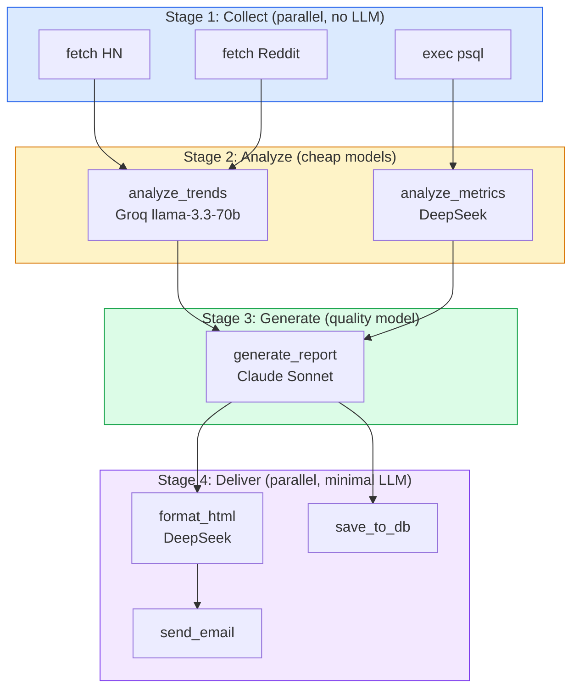
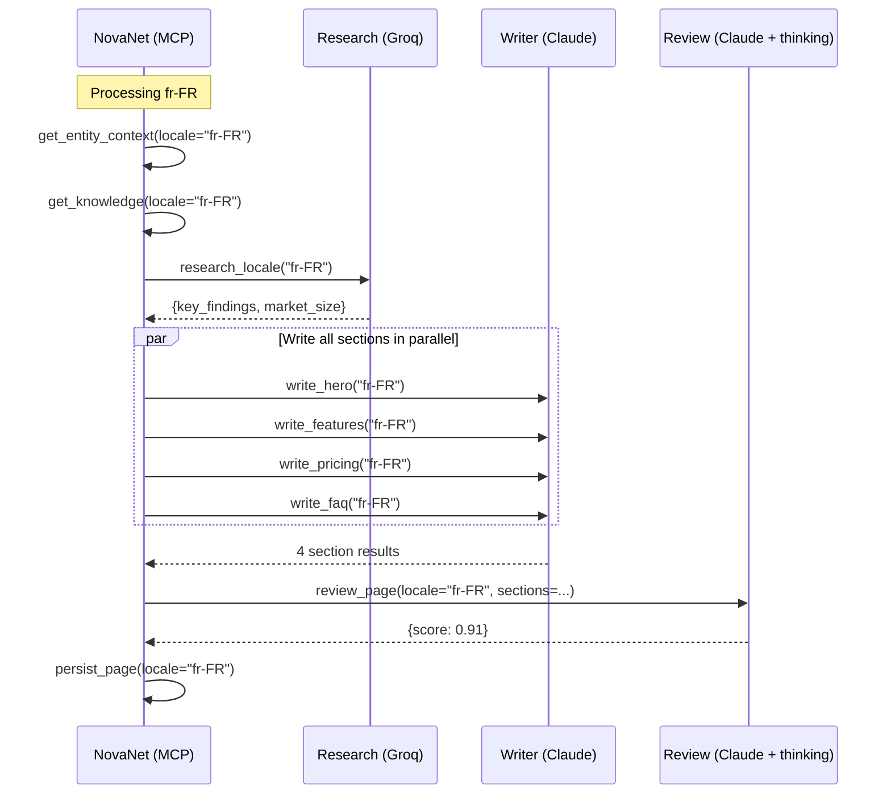
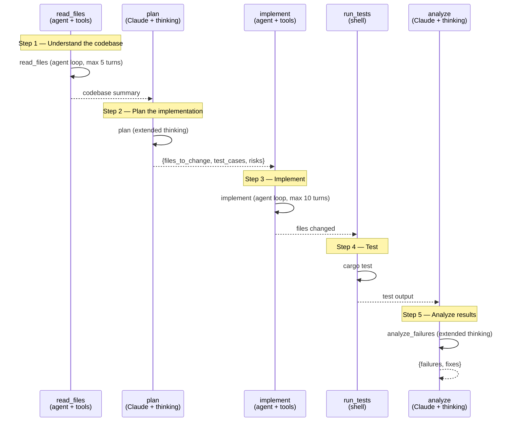

# 09 — Use Cases Cookbook

> Updated 2026-03-28 · Nika v0.49 · Schema @0.12

> 3 concrete use cases with complete YAML workflows.
> Copy-paste ready. Each one demonstrates different Nika features.

**Nika** v0.49 · **NovaNet** v0.20.0 · Updated 2026-03-28

> **Note on future features:** Some fields in these workflows (`record:`, `context_budget:`,
> `goal:` orchestrate mode, `persist: novanet`) are planned features shown here for
> illustrative purposes. They are not yet implemented in v0.49 and will be ignored at runtime.
> All other syntax (`infer:`, `fetch:`, `exec:`, `invoke:`, `agent:`, `with:`, `structured:`,
> `for_each:`, `depends_on:`, `artifacts:`) is fully functional.

---

## Table of Contents

1. [Use Case C: AI Pipeline Automation](#use-case-c-ai-pipeline-automation)
2. [Use Case A: Multilingual Content Generation](#use-case-a-multilingual-content-generation)
3. [Use Case B: Coding Agent Orchestration](#use-case-b-coding-agent-orchestration)
4. [Feature Usage Cheat Sheet](#feature-usage-cheat-sheet)

---

## Use Case C: AI Pipeline Automation

**Scenario:** You have a data processing pipeline — scrape web data, analyze it with an LLM, generate a report, send it via API.

**Features used:** Multi-provider routing, structured output, data flow

### The Workflow

```yaml
# pipeline-report.nika.yaml — Automated data analysis pipeline
schema: "nika/workflow@0.12"
provider: anthropic
model: claude-sonnet-4-20250514

tasks:
  # ──────────────────────────────────────────────────────────
  # STAGE 1: Data Collection (no LLM needed — fetch + exec)
  # ──────────────────────────────────────────────────────────

  - id: scrape_hackernews
    fetch:
      url: https://hacker-news.firebaseio.com/v0/topstories.json
      method: GET

  - id: scrape_reddit
    fetch:
      url: https://www.reddit.com/r/artificial/top.json?t=week
      method: GET
      headers:
        User-Agent: "NikaBot/1.0"

  - id: get_internal_data
    exec:
      command: "psql -c 'SELECT * FROM metrics WHERE date > NOW() - INTERVAL 7 DAY' --csv"
      shell: true

  # ──────────────────────────────────────────────────────────
  # STAGE 2: Analysis (cheap models — just extracting patterns)
  # ──────────────────────────────────────────────────────────

  - id: analyze_trends
    provider: groq                        # ← Groq: fast, cheap
    model: llama-3.3-70b-versatile
    with:
      hn: $scrape_hackernews
      reddit: $scrape_reddit
    infer: |
      Analyze these data sources for AI trends this week:
      HackerNews: {{with.hn}}
      Reddit: {{with.reddit}}
      Extract: top 5 topics, sentiment, emerging themes.
    structured:
      schema:
        type: object
        properties:
          topics: { type: array, items: { type: string } }
          sentiment: { type: string }
          themes: { type: array, items: { type: string } }
        required: [topics, sentiment, themes]

  - id: analyze_metrics
    provider: deepseek                    # ← DeepSeek: very cheap
    model: deepseek-chat
    with:
      data: $get_internal_data
    infer: |
      Analyze these internal metrics:
      {{with.data}}
      Summarize: key changes, anomalies, week-over-week trends.
    structured:
      schema:
        type: object
        properties:
          changes: { type: array, items: { type: string } }
          anomalies: { type: array, items: { type: string } }
        required: [changes]

  # ──────────────────────────────────────────────────────────
  # STAGE 3: Report Generation (quality model — content matters)
  # ──────────────────────────────────────────────────────────

  - id: generate_report
    # Uses workflow defaults: provider: anthropic, model: claude-sonnet-4-20250514
    with:
      trends: $analyze_trends
      metrics: $analyze_metrics
    infer: |
      Generate a weekly AI intelligence report.

      External Trends: {{with.trends}}
      Internal Metrics: {{with.metrics}}

      Format:
      1. Executive Summary (3 sentences)
      2. Key Trends (top 5 with analysis)
      3. Internal Performance (metrics vs last week)
      4. Recommendations (3 action items)

  # ──────────────────────────────────────────────────────────
  # STAGE 4: Delivery (exec + fetch — no LLM needed)
  # ──────────────────────────────────────────────────────────

  - id: format_html
    provider: deepseek                    # ← DeepSeek: simple formatting
    model: deepseek-chat
    with:
      report: $generate_report
    infer: "Convert this report to clean HTML with inline CSS: {{with.report}}"

  - id: send_email
    depends_on: [format_html]
    with:
      html: $format_html
    fetch:
      url: https://api.sendgrid.com/v3/mail/send
      method: POST
      headers:
        Authorization: "Bearer $env.SENDGRID_API_KEY"
      json:
        personalizations:
          - to: [{ email: "team@company.com" }]
        from: { email: "nika@company.com" }
        subject: "Weekly AI Intelligence Report"
        content:
          - type: text/html
            value: "{{with.html}}"

  - id: save_to_db
    depends_on: [generate_report]
    with:
      report: $generate_report
    exec:
      command: "psql -c \"INSERT INTO reports (content, created_at) VALUES ('{{with.report}}', NOW())\""
      shell: true

# Dependencies are implicit via with: bindings and explicit via depends_on: on tasks.
```

### What happens at execution



### Cost Analysis

```
+---------------------------------------------------------------------------+
|  COST BREAKDOWN                                                           |
+---------------------------------------------------------------------------+
|                                                                           |
|  Task               Provider       Tokens    Cost                         |
|  --------------------------------------------------                      |
|  scrape_hackernews   (none)        0         $0                           |
|  scrape_reddit       (none)        0         $0                           |
|  get_internal_data   (none)        0         $0                           |
|  analyze_trends      Groq          3K        $0.0009                      |
|  analyze_metrics     DeepSeek      2K        $0.0002                      |
|  generate_report     Anthropic     4K        $0.012                       |
|  format_html         DeepSeek      2K        $0.0002                      |
|  send_email          (none)        0         $0                           |
|  save_to_db          (none)        0         $0                           |
|  --------------------------------------------------                      |
|  TOTAL                             11K       $0.0133                      |
|                                                                           |
|  Single-provider (all Claude): 11K tokens x $0.003 = $0.033              |
|  Multi-provider routing: $0.0133                                          |
|  Savings: 60%                                                             |
|                                                                           |
+---------------------------------------------------------------------------+
```

---

## Use Case A: Multilingual Content Generation

**Scenario:** Generate localized landing pages for QR Code AI in 5 languages, using NovaNet's knowledge graph for entity context and cultural intelligence.

**Features used:** Multi-provider routing, structured output, MCP integration (NovaNet), agent verb

> **Note:** This workflow uses `goal:` (orchestrate mode) and `record:` which are planned
> features. The core verbs (`infer:`, `invoke:`, `agent:`) and data flow (`with:`, `structured:`)
> are fully functional in v0.49.

### The Workflow

```yaml
# generate-multilingual.nika.yaml — Multilingual content generation
schema: "nika/workflow@0.12"
provider: anthropic
model: claude-sonnet-4-20250514

mcp:
  servers:
    novanet:
      command: cargo
      args: ["run", "-p", "novanet-mcp"]

# goal: orchestrate mode (planned feature — illustrative)
# goal: |
#   Generate landing pages for QR Code AI in 5 locales: fr-FR, en-US, de-DE, ja-JP, es-ES.
#   For each locale:
#   1. Get entity context + knowledge atoms from NovaNet
#   2. Research locale-specific trends
#   3. Write 4 sections: hero, features, pricing, FAQ
#   4. Review for quality (score >= 0.85)

tasks:
  # ──────────────────────────────────────────────────────────
  # STAGE 1: Get context from NovaNet
  # ──────────────────────────────────────────────────────────

  - id: get_entity_context
    invoke:
      tool: "novanet::novanet_context"
      params:
        focus_key: "qr-code-ai"
        locale: "fr-FR"
        mode: page

  - id: get_knowledge
    invoke:
      tool: "novanet::novanet_context"
      params:
        focus_key: "qr-code-ai"
        locale: "fr-FR"
        mode: knowledge
        atom_type: all

  # ──────────────────────────────────────────────────────────
  # STAGE 2: Research locale-specific trends
  # ──────────────────────────────────────────────────────────

  - id: research_locale
    provider: groq
    model: llama-3.3-70b-versatile
    depends_on: [get_entity_context]
    with:
      context: $get_entity_context
    infer: |
      Research QR code market trends for fr-FR.
      Entity context: {{with.context}}
      Focus on: local adoption rates, popular use cases, regulatory requirements.
    structured:
      schema:
        type: object
        properties:
          key_findings: { type: array, items: { type: string } }
          market_size: { type: string }
          regulations: { type: array, items: { type: string } }
        required: [key_findings]

  # ──────────────────────────────────────────────────────────
  # STAGE 3: Write sections
  # ──────────────────────────────────────────────────────────

  - id: write_hero
    depends_on: [get_entity_context, get_knowledge, research_locale]
    with:
      entity_context: $get_entity_context
      knowledge: $get_knowledge
      research: $research_locale
    infer: |
      Write the hero section for a QR Code AI landing page.

      Locale: fr-FR
      Entity context: {{with.entity_context}}
      Knowledge atoms: {{with.knowledge}}
      Research: {{with.research}}

      RULES:
      - Write natively in the target language (NOT translated)
      - Use the provided expressions naturally
      - Respect cultural taboos listed in knowledge atoms
      - Match audience traits (formal/informal, direct/indirect)
    structured:
      schema:
        type: object
        properties:
          content: { type: string }
          cta_text: { type: string }
          word_count: { type: integer }
        required: [content]

  - id: write_features
    depends_on: [get_entity_context, get_knowledge, research_locale]
    with:
      entity_context: $get_entity_context
      knowledge: $get_knowledge
      research: $research_locale
    infer: |
      Write the features section for a QR Code AI landing page.
      Locale: fr-FR
      Entity context: {{with.entity_context}}
      Knowledge atoms: {{with.knowledge}}
      Research: {{with.research}}
      Write natively in the target language. Respect cultural taboos.
    structured:
      schema:
        type: object
        properties:
          content: { type: string }
          cta_text: { type: string }
        required: [content]

  - id: write_pricing
    depends_on: [get_entity_context, get_knowledge, research_locale]
    with:
      entity_context: $get_entity_context
      knowledge: $get_knowledge
      research: $research_locale
    infer: |
      Write the pricing section for a QR Code AI landing page.
      Locale: fr-FR
      Entity context: {{with.entity_context}}
      Knowledge atoms: {{with.knowledge}}
      Write natively in the target language. Respect cultural taboos.
    structured:
      schema:
        type: object
        properties:
          content: { type: string }
          cta_text: { type: string }
        required: [content]

  - id: write_faq
    depends_on: [get_entity_context, get_knowledge, research_locale]
    with:
      entity_context: $get_entity_context
      knowledge: $get_knowledge
      research: $research_locale
    infer: |
      Write the FAQ section for a QR Code AI landing page.
      Locale: fr-FR
      Entity context: {{with.entity_context}}
      Knowledge atoms: {{with.knowledge}}
      Write natively in the target language. Respect cultural taboos.
    structured:
      schema:
        type: object
        properties:
          content: { type: string }
        required: [content]

  # ──────────────────────────────────────────────────────────
  # STAGE 4: Review quality
  # ──────────────────────────────────────────────────────────

  - id: review_page
    extended_thinking: true
    thinking_budget: 16384
    depends_on: [write_hero, write_features, write_pricing, write_faq]
    with:
      hero: $write_hero
      features: $write_features
      pricing: $write_pricing
      faq: $write_faq
    infer: |
      Review this landing page for fr-FR.

      Hero: {{with.hero}}
      Features: {{with.features}}
      Pricing: {{with.pricing}}
      FAQ: {{with.faq}}

      Check:
      1. Language quality (native, not translated?)
      2. Cultural appropriateness (taboos respected?)
      3. Expression usage (knowledge atoms used naturally?)
      4. Completeness (all sections have CTA?)
      5. SEO readiness (keywords present?)
    structured:
      schema:
        type: object
        properties:
          score: { type: number }
          issues: { type: array, items: { type: string } }
          suggestions: { type: array, items: { type: string } }
        required: [score, issues]

  # ──────────────────────────────────────────────────────────
  # STAGE 5: Store result in NovaNet
  # ──────────────────────────────────────────────────────────

  - id: persist_page
    depends_on: [review_page, write_hero, write_features, write_pricing, write_faq]
    with:
      hero: $write_hero
      review: $review_page
    invoke:
      tool: "novanet::novanet_write"
      params:
        operation: upsert_node
        class: PageNative
        key: "homepage-fr-FR"
        locale: "fr-FR"
        properties:
          content: "{{with.hero}}"
          generated_by: nika
          quality_score: "{{with.review}}"
```

### Execution Flow



### NovaNet's Role in Each Step

```
+---------------------------------------------------------------------------+
|  WHAT NOVANET PROVIDES AT EACH STEP                                       |
+---------------------------------------------------------------------------+
|                                                                           |
|  get_entity_context -> "QR Code AI is a SaaS product that generates       |
|                         dynamic QR codes using AI. Key features:          |
|                         customization, analytics, batch generation..."    |
|                                                                           |
|  get_knowledge ->                                                         |
|    expressions:  "code QR" (not "QR code" in French)                      |
|                  "flash code" (alternate term in FR)                       |
|                  "generer" (preferred over "creer" for AI context)         |
|    taboos:       "Don't use 'gratuit' in headlines (implies low quality)"  |
|    audience:     "French B2B prefers formal tone, data-driven arguments"   |
|                                                                           |
|  persist_page -> Stores generated PageNative in the graph                 |
|    linked to Entity "qr-code-ai" + Locale "fr-FR"                        |
|    with provenance: generated_by=nika, quality_score=0.91                 |
|                                                                           |
+---------------------------------------------------------------------------+
```

---

## Use Case B: Coding Agent Orchestration

**Scenario:** A coding agent that analyzes a codebase, plans changes, implements them, runs tests, and iterates until tests pass.

**Features used:** Agent verb with tools, extended thinking, multi-provider routing, structured output

> **Note:** This workflow uses `goal:` (orchestrate mode) and `record:` which are planned
> features. The `agent:` verb, `exec:`, `infer:`, `with:`, and `structured:` are fully
> functional in v0.49.

### The Workflow

```yaml
# code-agent.nika.yaml — Coding agent with iterative test loop
schema: "nika/workflow@0.12"
provider: anthropic
model: claude-sonnet-4-20250514

context:
  files:
    request: ./feature-request.md
    architecture: ./docs/architecture.md

tasks:
  # ──────────────────────────────────────────────────────────
  # STEP 1: Read source files with agent loop
  # ──────────────────────────────────────────────────────────

  - id: read_files
    agent:
      prompt: |
        Read the source files relevant to this feature request.
        Feature request: {{context.request}}
        Architecture: {{context.architecture}}
        Summarize what each file does and how they relate.
      tools: [nika:read, nika:glob, nika:grep]
      max_turns: 5
      completion:
        mode: natural

  # ──────────────────────────────────────────────────────────
  # STEP 2: Plan implementation (with extended thinking)
  # ──────────────────────────────────────────────────────────

  - id: plan
    extended_thinking: true
    thinking_budget: 32768
    depends_on: [read_files]
    with:
      codebase: $read_files
    infer: |
      Based on the feature request and codebase analysis, create an implementation plan.

      Feature request: {{context.request}}
      Architecture: {{context.architecture}}
      Codebase analysis: {{with.codebase}}

      Output:
      1. Files to create/modify
      2. Changes per file (specific functions/structs)
      3. Test cases needed
      4. Risk assessment
    structured:
      schema:
        type: object
        properties:
          files_to_change: { type: array, items: { type: string } }
          test_cases: { type: array, items: { type: string } }
          risks: { type: array, items: { type: string } }
        required: [files_to_change, test_cases]

  # ──────────────────────────────────────────────────────────
  # STEP 3: Implement changes with agent loop
  # ──────────────────────────────────────────────────────────

  - id: implement
    depends_on: [plan, read_files]
    with:
      plan: $plan
      relevant_code: $read_files
    agent:
      prompt: |
        Implement the changes described in this plan:

        Plan: {{with.plan}}
        Relevant code: {{with.relevant_code}}

        Use nika:edit for modifications and nika:write for new files.
        Follow existing code style and patterns.
      tools: [nika:read, nika:write, nika:edit, nika:glob, nika:grep]
      max_turns: 10
      completion:
        mode: natural

  # ──────────────────────────────────────────────────────────
  # STEP 4: Run tests
  # ──────────────────────────────────────────────────────────

  - id: run_tests
    depends_on: [implement]
    exec:
      command: "cargo test 2>&1"
      shell: true

  # ──────────────────────────────────────────────────────────
  # STEP 5: Analyze test failures (if any)
  # ──────────────────────────────────────────────────────────

  - id: analyze_failures
    extended_thinking: true
    thinking_budget: 16384
    depends_on: [run_tests]
    with:
      test_output: $run_tests
      changes: $implement
    infer: |
      Tests completed. Analyze the output and determine if any failures need fixing.

      Test output: {{with.test_output}}
      Recent changes: {{with.changes}}

      For each failure:
      1. Which test failed
      2. Why it failed
      3. What to fix
      4. Specific code change needed
    structured:
      schema:
        type: object
        properties:
          failures: { type: array, items: { type: string } }
          root_causes: { type: array, items: { type: string } }
          fixes: { type: array, items: { type: string } }
        required: [failures, fixes]
```

### Execution Flow



### Why This Beats a Simple Agent

```
+---------------------------------------------------------------------------+
|  SIMPLE AGENT vs STRUCTURED WORKFLOW                                      |
+---------------------------------------------------------------------------+
|                                                                           |
|  Simple agent (single conversation):                                      |
|  - ONE long conversation with the LLM                                     |
|  - Context grows with every tool call                                     |
|  - After 20 tool calls -> dumb zone -> makes mistakes                     |
|  - Can't switch models for different subtasks                             |
|  - Everything in one prompt = confused, unfocused                         |
|                                                                           |
|  Structured workflow (Nika v0.49):                                        |
|  - Each task (read, plan, implement, test) has fresh context              |
|  - Data flow passes only essential info between tasks                     |
|  - Cheap model reads files, expensive model plans                         |
|  - Agent loops handle multi-turn tool use with bounded turns              |
|  - If tests fail -> analyze -> iterate (explicit DAG)                     |
|                                                                           |
|  Result: More reliable, cheaper, and debuggable (traces show each step).  |
|                                                                           |
+---------------------------------------------------------------------------+
```

---

## Feature Usage Cheat Sheet

Quick reference for which YAML fields to use:

```yaml
# ==============================================================
# FEATURE 1: MULTI-PROVIDER ROUTING
# ==============================================================

# Workflow-level defaults
schema: "nika/workflow@0.12"
provider: anthropic
model: claude-sonnet-4-20250514

tasks:
  - id: cheap_task
    provider: deepseek                   # Task-level override
    model: deepseek-chat
    infer: "..."

  - id: fast_task
    provider: groq                       # Another provider
    model: llama-3.3-70b-versatile
    infer: "..."

  - id: quality_task
    # Uses workflow defaults (anthropic / claude-sonnet-4-20250514)
    infer: "..."

  - id: thinking_task
    extended_thinking: true              # Extended thinking on task
    thinking_budget: 16384
    infer: "..."

# ==============================================================
# FEATURE 2: STRUCTURED OUTPUT
# ==============================================================

tasks:
  - id: my_task
    infer: "..."
    structured:
      schema:
        type: object
        properties:
          name: { type: string }
          score: { type: number }
        required: [name, score]
      enable_repair: true                # Auto-repair on violation
      max_retries: 3                     # Retry attempts

# ==============================================================
# FEATURE 3: DATA FLOW (with: bindings)
# ==============================================================

tasks:
  - id: upstream
    infer: "Generate data"

  - id: downstream
    with:
      data: $upstream                    # $ prefix required
      env_key: $env.API_KEY             # Environment variable
    infer: "Process: {{with.data}}"      # Always with. prefix

# ==============================================================
# FEATURE 4: AGENT VERB (multi-turn tool use)
# ==============================================================

tasks:
  - id: smart_agent
    agent:
      prompt: "Research and implement..."
      tools: [nika:read, nika:write, nika:edit, nika:glob, nika:grep]
      max_turns: 10
      completion:
        mode: explicit                   # Must call nika:complete

# ==============================================================
# FEATURE 5: MCP INTEGRATION (NovaNet)
# ==============================================================

mcp:
  servers:
    novanet:
      command: cargo
      args: ["run", "-p", "novanet-mcp"]

tasks:
  - id: search
    invoke:
      tool: "novanet::novanet_search"    # Double colon for MCP tools
      params:
        query: "AI trends"
        limit: 10

# ==============================================================
# FEATURE 6: RETRY + RESILIENCE
# ==============================================================

tasks:
  - id: flaky_api
    retry:                               # Task-level retry
      max_attempts: 3
      delay_ms: 2000
      backoff: 2.0
    fetch:
      url: "https://api.example.com/data"
```

---

## Comparison Table

| Dimension | Use Case C (Pipeline) | Use Case A (Multilingual) | Use Case B (Coding) |
|-----------|:--------------------:|:------------------------:|:-------------------:|
| Mode | DAG | DAG | DAG |
| Providers | 3 (Anthropic, DeepSeek, Groq) | 2 (Anthropic, Groq) | 1 (Anthropic) |
| Structured Output | Yes | Yes | Yes |
| MCP (NovaNet) | No | Yes | No |
| Agent Verb | No | No | Yes (read + implement) |
| Extended Thinking | No | Yes (review) | Yes (plan + analyze) |
| Estimated Cost | $0.013 | $0.50 (5 locales) | $0.10 |
| Complexity | Low | High | Medium |

---

<div align="center">

[< 08 Complete Guide](./08-nika-030-complete-guide.md) · [Index](./00-README.md)

</div>
