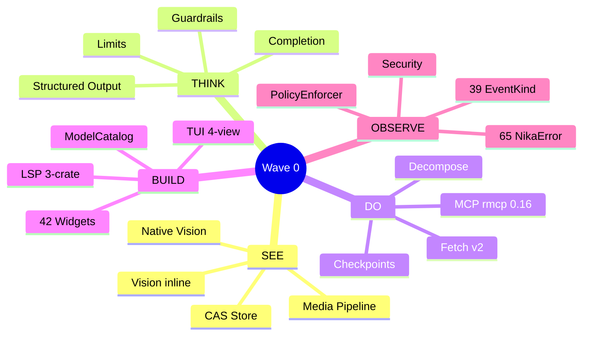
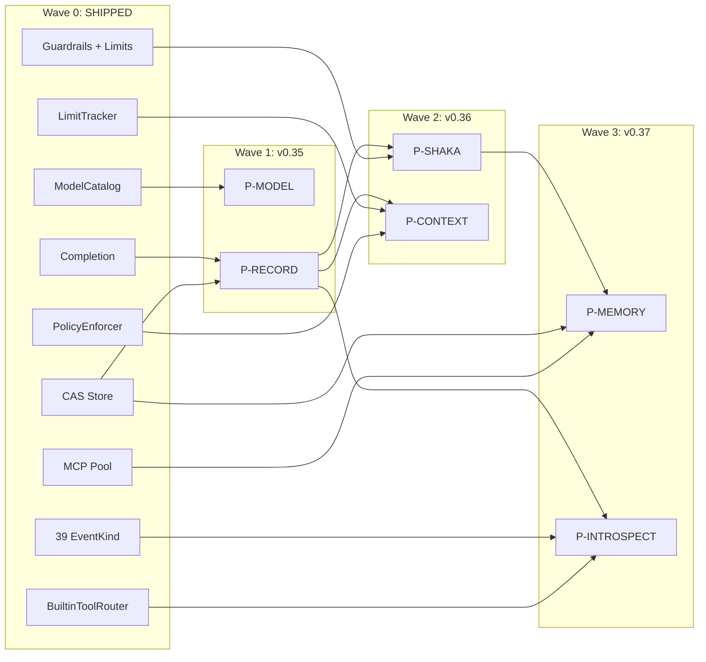

# Wave 0 : Foundation Report — What Nika Built (v0.27→v0.34)

[← 21-model-routing-naming-research](21-model-routing-naming-research.md) · [Index](00-README.md)

> **Status:** SHIPPED · **Date:** 2026-03-20 · **Schema:** @0.12

---

## Table of Contents

1. [Overview](#overview)
2. [SEE — Perceiving the World](#1-see--perceiving-the-world)
3. [THINK — Reasoning with Rigor](#2-think--reasoning-with-rigor)
4. [DO — Acting in the World](#3-do--acting-in-the-world)
5. [BUILD — Developer Experience](#4-build--developer-experience)
6. [OBSERVE — Understanding What Happens](#5-observe--understanding-what-happens)
7. [How Wave 0 Accelerates Waves 1-3](#6-how-wave-0-accelerates-waves-1-3)
8. [Ground Truth](#7-ground-truth)
9. [Architecture Decisions](#8-architecture-decisions)

---

## Overview

Nika's codebase evolved significantly beyond the original v0.30 roadmap. Between v0.27 and v0.34, approximately **30K+ lines of production code** shipped across five impact domains — none of which were part of the original 6-priority roadmap (P-MODEL through P-INTROSPECT).

This document captures these features as **Wave 0: SHIPPED** — the foundation that makes the P-feature roadmap more achievable, not less. Every feature here either directly accelerates a planned P-feature or fills a gap the original roadmap assumed would be solved later.

---

## 1. SEE — Perceiving the World

### Vision Inline (infer: + content:)

Vision is implemented **inside** the `infer:` verb via the `content:` field — NOT as a separate `nika:vision` tool. This design lets vision compose naturally with all infer: features (temperature, system prompt, structured output on text response).

- **3 ContentPart types:** `text`, `image` (CAS hash), `image_url` (HTTPS)
- **ImageDetail:** `auto` (default), `low`, `high`
- **3-phase AST pipeline:** `RawContentPart` → `AnalyzedContentPart` → `ContentPart`
- **Limits:** max 20 images, 100MB total
- **SSRF protection:** `https://` only for `image_url`
- **Execution order:** dispatched BEFORE Layer 0 structured output (critical design decision — Layer 0 uses text-only DynamicSubmitTool that ignores content: parts)

**Key files:**
- `ast/content.rs` — ContentPart types, ImageDetail enum
- `runtime/executor/verbs.rs` — `run_infer_vision()` dispatch
- `runtime/executor/tests_vision_e2e.rs` — E2E tests

### Native Vision (mistral.rs VisionModelBuilder + ISQ)

Local vision inference via mistral.rs v0.7 with Integer-Scaled Quantization for memory efficiency.

- **Dual-path model loading:**
  - `NativeModelKind::TextGguf` → `GgufModelBuilder` (GGUF files, text only)
  - `NativeModelKind::VisionHf { model_id, isq }` → `VisionModelBuilder` (HuggingFace safetensors, vision)
- **InferenceBackend trait:** `supports_vision()`, `infer_vision()`, `infer_vision_stream()`
- **ISQ levels:** Q4K, Q8_0, etc. — parsed via `mistralrs::parse_isq_value()`
- **Target models:** Gemma 3 4B (3GB VRAM), Qwen2.5-VL 3B/7B
- **Streaming:** Full streaming support at NativeRuntime level via `spawn_stream_task()` + mpsc

**Key files:**
- `provider/native/runtime.rs` — NativeRuntime implementation
- `provider/native/traits.rs` — InferenceBackend trait (object-safe + generic)
- `provider/native/error.rs` — NativeError (VisionNotSupported, VisionModelLoadFailed, InvalidImageData)
- `core/backend.rs` — NativeModelKind, VisionImage types

### Media Pipeline (19 tools, CAS Store)

Content-Addressable Storage with blake3 hashing and 19 image processing tools across 3 feature-gated tiers.

**CAS Store:**
- **Hash:** blake3, `blake3:` prefix
- **Layout:** `{root}/{hash[0..2]}/{hash[2..]}` (sharded, no extension)
- **Writes:** atomic via `O_EXCL`, automatic deduplication
- **Verification:** read-back for files >= 1MB
- **Budget:** `MediaBudget` — 500MB per run, atomic lock-free tracking
- **Compression:** optional zstd (feature `media-compression`), 200MB decompression bomb limit
- **Config:** `NIKA_MEDIA_STORE` env var, default `.nika/media/store/`

**Tools:**

| Tier | Tools | Feature Flag | Deps |
|------|-------|-------------|------|
| **1 (always-on)** | `nika:import`, `nika:dimensions`, `nika:thumbhash`, `nika:dominant_color` | none | zero/tiny |
| **2 (media-core)** | `nika:thumbnail`, `nika:convert`, `nika:strip`, `nika:metadata`, `nika:optimize`, `nika:svg_render` | `media-core` (default) | image, resvg |
| **3 (opt-in)** | `nika:phash`, `nika:compare`, `nika:pdf_extract`, `nika:chart`, `nika:provenance`, `nika:verify`, `nika:qr_validate`, `nika:quality`, `nika:pipeline` | per-tool flags | heavy |

**Error codes:** NIKA-251→259 (pipeline), NIKA-283→285 (store), NIKA-290→297 (tools)

**Key files:**
- `media/store.rs` (~1200 lines) — CAS store
- `runtime/builtin/media/mod.rs` — 19 tool implementations
- `runtime/builtin/router.rs` — BuiltinToolRouter dispatch

---

## 2. THINK — Reasoning with Rigor

### 5-Layer Structured Output Defense

~99.99% JSON compliance across all providers via cascading validation layers.

| Layer | Method | Trigger | Success Rate |
|-------|--------|---------|-------------|
| **0** | DynamicSubmitTool (tool injection) | `output:` with schema | ~80-90% |
| **1** | Extract JSON from response | Layer 0 fails | ~95% |
| **2** | Schema validation + repair prompts | Layer 1 fails | ~98% |
| **3** | LLM repair with retry | Layer 2 fails | ~99%+ |
| **4** | Manual schema coercion | All fail | Fallback |

- **Events:** `StructuredOutputAttempt` (layer, attempt, schema_id), `StructuredOutputSuccess` (layer, attempts_total)
- **Error codes:** NIKA-300 ExtractionFailed, NIKA-301 ValidationFailed, NIKA-302 RepairFailed, NIKA-303 AllLayersFailed

**Key files:** `runtime/structured_output.rs`, `runtime/executor/verbs.rs`

### Agent Guardrails (4 types, chain evaluation)

Quality gates on agent responses with escalation paths.

| Type | Config | Checks |
|------|--------|--------|
| `length` | `{ min, max }` | Response length bounds |
| `schema` | `{ schema }` | JSON schema validation |
| `regex` | `{ pattern, must_match }` | Pattern matching |
| `llm` | `{ prompt, model }` | LLM-based quality judgment |

- **Chain evaluation:** all guardrails checked in order, early termination on failure
- **OnFailure escalation:** `retry` → `escalate` → `fail`
- **Events:** `GuardrailPassed`, `GuardrailFailed`, `GuardrailEscalation`

**Key files:** `ast/guardrails.rs`

### Agent Completion (3 modes, confidence routing)

| Mode | Mechanism |
|------|-----------|
| `explicit` | Agent must call `nika:complete` tool |
| `natural` | Detect completion language patterns |
| `pattern` | Regex-based detection |

- **Confidence routing:** `high_threshold`, `medium_threshold` with configurable actions per level
- **Key files:** `ast/completion.rs`

### Agent Limits

| Limit | Type | Default |
|-------|------|---------|
| `max_turns` | u32 | — |
| `max_tokens` | u64 | — |
| `max_cost_usd` | f64 | — |
| `max_duration_secs` | u64 | — |

- **LimitTracker:** real-time tracking with `LimitStatus`
- **Key files:** `ast/limits.rs`

---

## 3. DO — Acting in the World

### 5 Verbs (production-ready)

All 5 semantic verbs fully implemented with error handling, cancellation tokens, and policy enforcement.

| Verb | Purpose | Key Features |
|------|---------|-------------|
| `infer:` | LLM generation | Vision/multimodal, structured output, extended thinking, streaming |
| `exec:` | Shell command | 28-pattern blocklist, policy enforcement, timeout, shell-free mode |
| `fetch:` | HTTP request | Binary mode (CAS), decompression, 50MB limit, all methods |
| `invoke:` | MCP tool call | rmcp 0.16, retry/reconnect, builtin routing, media pipeline |
| `agent:` | Multi-turn loop | Guardrails, completion, limits, tool calling, streaming |

### MCP Integration (rmcp 0.16)

Production-grade Model Context Protocol client.

- **McpClientPool:** lazy init, per-server dedup via `OnceCell`, graceful shutdown
- **Retry:** `backon` with `McpRetryConfig`, reconnect on failure, event emission (`McpRetry`)
- **Caching:** `DashMap` + TTL + eviction for response caching
- **Validation:** parameter schema caching for tool calls
- **Content:** 5 block types (text, image, audio, resource, resource_link)
- **Config:** global `~/.nika/mcp.yaml`, per-workflow `mcp:` block
- **Security:** env var validation against library injection

**Key files:** `mcp/client.rs`, `mcp/pool.rs`, `mcp/rmcp_adapter.rs`, `mcp/types.rs`

### Fetch v2

Enhanced HTTP client with binary mode and CAS integration.

- **Methods:** GET, POST, PUT, DELETE, PATCH, HEAD, OPTIONS
- **Response modes:** `text` (default), `binary` (CAS store + blake3), `full` (status + headers + body)
- **Decompression:** gzip, brotli, deflate (automatic)
- **Limits:** 50MB response size
- **Retry:** exponential backoff

### Decompose (3 strategies)

| Strategy | Mechanism |
|----------|-----------|
| `semantic` | NovaNet graph traversal via MCP |
| `static` | Predefined subtask list |
| `nested` | Recursive decomposition |

**Key files:** `ast/decompose.rs`, `runtime/executor/decompose.rs`

### Partial Checkpointing

- `PartialCheckpoint`, `PartialResult`, `StopReason`
- Pause/resume workflow execution with state preservation
- **Key files:** `runtime/partial.rs`

---

## 4. BUILD — Developer Experience

### LSP 3-Crate Architecture

Three implementations consolidating toward `nika-lsp-core` as the single intelligence layer.

| Crate | Role | Status |
|-------|------|--------|
| `nika-lsp-core` | Protocol-agnostic intelligence | Newest, target |
| `nika-lsp` | Standalone LSP binary | Has diagnostics, MCP discovery |
| `nika/src/lsp` | Embedded in main binary | Mature, has ModelCatalog |

**6 Handlers:** completion, hover, definition, code_action, semantic_tokens, document_symbols

**16 CursorContext variants:** WorkflowRoot, TaskField, VerbBlock, WithBlock, Template, InvokeBlock, McpConfig, ProviderContext, ContentPart, ForEach, SchemaBlock, DependsOn, Guardrails, RetryBlock, LimitsBlock, Unknown

**Tree-sitter:** `RecoveryParser` wrapping `tree_sitter_yaml` with incremental re-parse, 5s timeout, error recovery from broken YAML. 11 fixture-based tests.

**Key files:** `nika-lsp-core/src/handlers/`, `nika-lsp-core/src/parse/recovery.rs`

### TUI 4-View Architecture (ratatui 0.30)

| View | Shortcut | Description |
|------|----------|-------------|
| **Studio** | `1`/`s` | File browser + YAML editor + DAG preview (vim modes, git gutter, diagnostics, command palette) |
| **Runner** | `2`/`r` | 4-panel 2x2: Mission Control / DAG Execution / NovaNet Station / Agent Reasoning |
| **Chat** | `3`/`c` | Conversational agent (27 source files, 5 verbs via slash commands, MCP, streaming, mentions) |
| **Settings** | `4`/`,` | Providers, MCP Servers, Secrets, Packages, Preferences |

Additional: Home/Browse (workflow browser, fuzzy search, history), Wizard (first-run setup)

**42 widgets** including: DagAscii (Sugiyama layout), NodeBox, DagEdge (animated), Sparkline (latency), MissionControl, ChatDagPanel, matrix rain, which-key popup, tree widget, provider selector

**Key files:** `tui/views/`, `tui/widgets/`

### ModelCatalog

- 25+ cloud models with capability flags, pricing tables, alternatives
- Cost optimizer for model selection
- Compatibility checking (vision, streaming, tool_use, extended_thinking)
- **Key files:** `lsp/model_intel.rs`

---

## 5. OBSERVE — Understanding What Happens

### 39 EventKind Variants (12 categories)

| Category | Events | Count |
|----------|--------|-------|
| Workflow | Started, Completed, Failed, Aborted, Paused, Resumed | 6 |
| Task | Scheduled, Started, Completed, Failed | 4 |
| Fine-grained | TemplateResolved, ProviderCalled, ProviderResponded | 3 |
| Context | ContextAssembled | 1 |
| MCP | Invoke, Response, Connected, Error, Retry | 5 |
| Agent | Start, Turn, Complete, Spawned | 4 |
| Guardrail | Passed, Failed, Escalation | 3 |
| Builtin | Log, Custom | 2 |
| Artifact | Written, Failed | 2 |
| Media | Extracted, Processed, Stored, StoreFailed, IntegrityCheck, Cleanup | 6 |
| Structured Output | Attempt, Success | 2 |
| Vision | VisionContentResolved | 1 |

**Key files:** `event/log.rs`

### 65 NikaError Variants + 9 MediaError

| Range | Category | Count |
|-------|----------|-------|
| NIKA-000→009 | Workflow | 6 |
| NIKA-010→019 | Schema | 2 |
| NIKA-020→029 | DAG | 5 |
| NIKA-030→039 | Provider | 4 |
| NIKA-040→049 | Template/Binding | 4 |
| NIKA-050→059 | Path/Task/Security | 5 |
| NIKA-060→069 | Output | 3 |
| NIKA-070→079 | With Block | 4 |
| NIKA-080→089 | DAG Validation | 3 |
| NIKA-090→099 | JSONPath/IO | 4 |
| NIKA-100→109 | MCP | 10 |
| NIKA-110→119 | Agent | 3 |
| NIKA-120→129 | Resilience | 2 |
| NIKA-130→139 | TUI/Config | 2 |
| NIKA-150 | Startup | 1 |
| NIKA-160→161 | Policy/Boot | 2 |
| NIKA-170 | Runtime | 1 |
| NIKA-200→219 | Tool/Builtin | 4 |
| NIKA-251→259 | Media Pipeline | 9 (via MediaError) |
| NIKA-260→269 | Package URI | 2 |
| NIKA-270 | Skill | 1 |
| NIKA-280→285 | Artifact/Media | 6 |
| NIKA-290→297 | Media Tools | 8 |
| NIKA-300→303 | Structured Output | 4 |

**Key files:** `error.rs`, `media/error.rs`

### Security Hardening

| Layer | Protection | Details |
|-------|-----------|---------|
| **Exec blocklist** | 28 patterns | Destructive ops, reverse shells, privilege escalation, fork bombs, base64 payloads |
| **Unicode NFKC** | Normalization | Prevents fullwidth character bypass |
| **Env vars** | 7 blocked | LD_PRELOAD, DYLD_INSERT_LIBRARIES, etc. |
| **API keys** | Stripped | Removed from child process environment |
| **Paths** | Traversal protection | `../` rejection, absolute paths, null bytes, symlink boundary, max 4096 |
| **SVG** | SSRF protection | Blocks localhost, 127.0.0.1, 169.254.169.254 |
| **Fetch** | Host filtering | PolicyConfig.allowed_hosts / blocked_hosts |

### PolicyEnforcer

- `check_exec(command)` — blocklist + policy config
- `check_fetch(url)` — host allow/block list
- `check_token_spend(tokens)` — budget enforcement
- `PolicyDecision`: `Allow` | `Block(reason)` | `RequiresApproval(reason)`
- **PolicyConfig:** `allow_exec`, `allow_network`, `blocked_commands`, `max_token_spend`, `allowed_hosts`, `blocked_hosts`

**Key files:** `runtime/policy.rs`, `runtime/security.rs`, `io/security.rs`

---

## 6. How Wave 0 Accelerates Waves 1-3

| Wave 0 Foundation | Accelerates | How |
|---|---|---|
| CAS store (blake3, MediaBudget) | **P-RECORD** WARM tier | Records persist to CAS-like format; dedup/budget infrastructure reusable |
| ModelCatalog (25+ models, pricing) | **P-MODEL** slot resolution | Catalog → slot → provider mapping; capability flags for routing |
| PolicyEnforcer (check_token_spend) | **P-CONTEXT** budget enforcement | Extend per-task; `ContextAssembled` event already emits `total_tokens` |
| BuiltinToolRouter (31 tools) | **P-INTROSPECT** tool registration | Register 6 new introspection tools in existing FxHashMap router |
| 39 EventKind | **P-INTROSPECT** data source | `nika:cost`, `nika:task_status` read from event stream |
| Guardrails + Limits | **P-SHAKA** quality scoring | Quality gates for satellite dispatch decisions; LimitTracker for round budgets |
| MCP pool (retry, caching) | **P-MEMORY** NovaNet bridge | `novanet_write` for COLD tier; retry ensures reliability |
| Agent Completion (confidence) | **P-RECORD** confidence | Confidence score → record compression threshold |
| LimitTracker | **P-CONTEXT** | Foundation for per-task token budgets (already tracks per-turn) |

---

## 7. Ground Truth

> All numbers extracted from source code, not invented. Verified 2026-03-20.

| Metric | Value |
|--------|-------|
| Nika version | 0.34.0 |
| Schema version | @0.12 |
| Rust files | 373+ |
| Tests | 6,610+ |
| Verbs | 5 (infer, exec, fetch, invoke, agent) |
| Builtin tools | 31 (12 core/file + 19 media) |
| Providers | 8 (7 cloud + 1 native) |
| EventKind variants | 39 (12 categories) |
| NikaError variants | 65 (+9 MediaError = 74 total error codes) |
| Error code range | NIKA-000 → NIKA-303 |
| TransformOp count | 31 |
| LSP handlers | 6 |
| CursorContext variants | 16 |
| TUI views | 4 (+ Home + Wizard) |
| TUI widgets | 42 |
| Media tools | 19 (5 always-on + 14 feature-gated) |
| Feature flags | 14 |
| MCP content types | 5 |
| Agent guardrail types | 4 |
| Agent completion modes | 3 |
| Structured output layers | 5 |
| Exec blocklist patterns | 28 |

---

## 8. Architecture Decisions

### D1: Vision inline in infer: (not nika:vision tool)

Vision is dispatched inside `run_infer()` BEFORE Layer 0 structured output. This avoids a separate tool roundtrip and lets vision compose naturally with all `infer:` features (temperature, system prompt, structured output on text response). The original vision docs proposed `nika:vision` as a standalone builtin tool — the inline approach is simpler and more powerful.

### D2: LSP 3-crate consolidation

`nika-lsp-core` is the target single intelligence layer (protocol-agnostic, tree-sitter recovery). `nika-lsp` and `nika/src/lsp` become thin protocol adapters. The consolidation preserves each crate's strengths: `nika-lsp-core` gets tree-sitter + rich context detection, the embedded LSP contributes ModelCatalog + AstIndex.

### D3: Media tools feature-gated

Conditional compilation via Cargo feature flags keeps the binary small. `media-core` enables the common tool set (Tier 2). Each Tier 3 tool has its own flag (`media-phash`, `media-pdf`, `media-chart`, etc.). This is critical for embedded/constrained environments.

### D4: CAS with blake3 (not SHA-256)

blake3 is faster (3.5 GB/s on modern CPUs), produces 256-bit hashes, and has a streaming API. Hash prefix sharding (`{hash[0..2]}/{hash[2..]}`) keeps directories manageable. The `blake3:` URI prefix is unique to Nika — no collision with other hash schemes.

### D5: with: keyword (not use:)

Doc 07 (Slate Deep Integration) used `use:` in Shaka examples. Code uses `with:`. Decision: `with:` everywhere. It is consistent with the existing binding system and more intuitive for YAML authors ("with these bindings").

### D6: Raw vs Runtime naming is intentional

| Raw (YAML-facing) | Runtime (semantic) | Rationale |
|---|---|---|
| `max_iterations` | `max_turns` | YAML uses user language; runtime uses agent terminology |
| `working_dir` | `cwd` | YAML is explicit; runtime is concise |
| `thinking` | `extended_thinking` | YAML is simple; runtime disambiguates from regular thinking |
| `server` | `mcp` | YAML names the config block; runtime names the protocol |
| `timeout_ms` | `timeout` (seconds) | YAML uses milliseconds for precision; runtime uses Duration |

This is a design choice, not a bug. The two-phase AST pipeline (Raw → Analyzed → Runtime) is the translation layer.

---

[← 21-model-routing-naming-research](21-model-routing-naming-research.md) · [Index](00-README.md)
