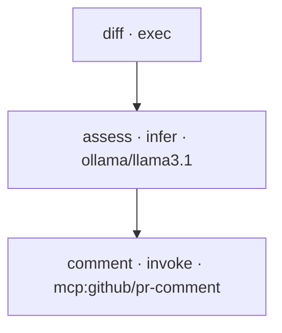

# Nika examples

> If you do the same AI task twice, make it a workflow.

Every example here is a plain `.nika.yaml` file — run it, read it, diff it,
make it yours. The binary embeds the whole gallery, so these three commands
work offline, before you configure any model:

```sh
nika examples list                                  # browse
nika examples show showcase/t1-meeting-actions      # read the file
nika examples run  showcase/t1-meeting-actions --model mock/echo   # preview, zero setup
```

Swap `--model mock/echo` for `ollama/llama3.1` (local, free) or any provider
when you want real inference. `nika doctor` tells you what's wired.

## Start here

- [`pr-risk-review.nika.yaml`](pr-risk-review.nika.yaml) — the signature
  workflow. Reads your PR diff, judges the risk with a structured verdict,
  and comments only when it's high. Four verbs, one readable file,
  local-first. The whole pitch in 60 lines.
- [`image-og-pipeline.nika.yaml`](image-og-pipeline.nika.yaml) — the media
  pipeline. One task: brief in → OG image variants on disk + a provenance
  manifest (paths + sha256, never inline bytes). Runs OFFLINE as-is
  (`provider: mock` renders real PNG files) · one-line flip to local (sovereign) / gemini / openai / xai.

The plan, straight from `nika graph examples/pr-risk-review.nika.yaml --format mermaid`:



Every workflow here checks clean — `nika check` audits the plan, the cost
ceiling, secret flows and types **before a single token is spent**.

## The embedded gallery

The versioned pack lives at
[`../crates/nika-pack/pack/examples/`](../crates/nika-pack/pack/examples/)
(embedded in the binary — the slugs below are what `nika examples run` takes).

### Everyone

| Slug | What it does |
|---|---|
| `showcase/t1-meeting-actions` | Meeting notes → decisions, owners, deadlines |
| `showcase/t1-standup-digest` | Yesterday's commits → today's standup note |
| `showcase/t1-social-repurpose` | One piece of content → per-channel posts |
| `showcase/t4-deep-research-brief` | A topic → a budgeted research agent → a brief on disk |

### Founders · ops

| Slug | What it does |
|---|---|
| `showcase/t2-invoice-chaser` | Overdue invoices → drafted reminders, human-gated |
| `showcase/t2-support-triage` | A support inbox → tagged, prioritized queue |
| `showcase/t3-competitor-radar` | Competitor sitemap → one competitive brief |
| `showcase/t3-resume-screener` | Resumes vs a role → ranked shortlist |
| `showcase/t4-ceo-monday-brief` | Metrics + notes → a Monday operating brief |
| `showcase/t1-price-watch` | Product pages → price-change alerts |

### Developers · maintainers

| Slug | What it does |
|---|---|
| `showcase/t2-release-notes` | Commits → clean release notes |
| `showcase/t2-release-radar` | Dependency releases → what-matters digest |
| `showcase/t3-pr-review-fanout` | One PR → parallel specialized reviews |
| `showcase/t3-config-drift-sentinel` | Configs → drift detection + report |
| `showcase/t2-etl-quarantine` | Messy data in → validated data + quarantine |
| `showcase/t4-incident-war-room` | An incident → timeline, comms, postmortem |
| `showcase/t4-release-train` | A release → the whole gated train |
| `showcase/t2-contract-guard` | A contract → clause extraction → risk memo |
| `showcase/t2-seo-content-brief` | A keyword → a structured content brief |
| `showcase/t3-localization-factory` | Source strings → reviewed translations |

### Foundation patterns (learn the language)

| Slug | Teaches |
|---|---|
| `01-hello` | The smallest real workflow |
| `06-parallel-fanout` | Independent tasks run in parallel |
| `16-exec-pipeline` | Pure `exec` — no model at all |
| `19-schema-retry` | Structured output + retry on violation |
| `22-fetch-chain` | `nika:fetch` → extract → summarize |
| `23-code-review` | The review pattern, minimal |
| `26-for-each-locales` | Bounded fan-out with `for_each` |

Templates for starting your own: `nika new --from <template>` — six
skeletons (chain · fanout · gate-and-act · agent-loop · etl-state ·
human-gated-ship) at [`../crates/nika-pack/pack/templates/`](../crates/nika-pack/pack/templates/).

## Contribute one

Repeat an AI task every week? [Open a "convert my workflow"
issue](https://github.com/supernovae-st/nika/issues/new/choose) — we convert
the best ones into gallery examples, credited to you.
