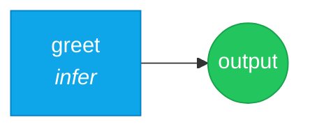

# 01 — Hello World

> The simplest possible Nika workflow: one task, one verb, one result.

## DAG



## Workflow

```yaml
schema: "nika/workflow@0.12"
workflow: hello-world
description: "The simplest possible workflow — one task, one verb"

provider: mock
model: mock-default

inputs:
  name: "World"

tasks:
  - id: greet
    infer: "Say hello to {{inputs.name}} in three languages (English, French, Japanese)"
```

### What's happening

| Line | Purpose |
|------|---------|
| `schema:` | Required. Declares this is a Nika workflow |
| `provider: mock` | Uses the mock provider — no API key needed |
| `inputs:` | Workflow parameters with default values |
| `infer:` | The LLM generation verb (short form) |
| `{{inputs.name}}` | Template interpolation of the input parameter |

## Expected output

With `provider: mock`, you get a deterministic mock response. With a real provider like `anthropic` or `openai`, the LLM generates a multilingual greeting.

## Try it

```bash
# With mock provider (no API key needed)
nika run examples/01-hello-world/hello.nika.yaml

# Override the input
nika run examples/01-hello-world/hello.nika.yaml --input name="Nika"

# With a real provider
nika run examples/01-hello-world/hello.nika.yaml --provider anthropic
```

## Key concepts

- Every workflow starts with `schema: "nika/workflow@0.12"`
- `infer:` is the verb for LLM generation — short form takes a string prompt
- `inputs:` define parameters that can be overridden via `--input`
- `provider: mock` is perfect for testing without API keys

## Next

[02 — Research Pipeline](../02-research-pipeline/) introduces multi-task DAGs with `depends_on` and `with:` bindings.
