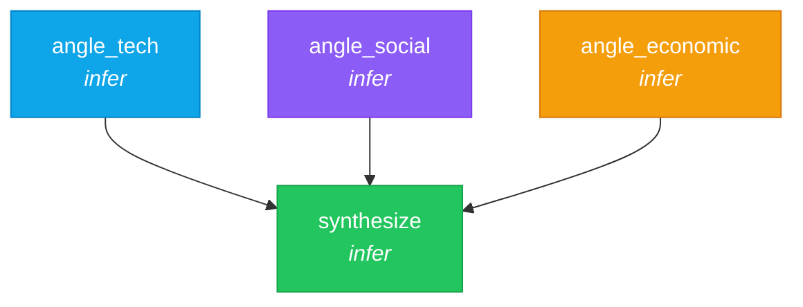

# 02 — Research Pipeline

> Fan-out research from multiple angles, then synthesize into a single report.

## DAG



Tasks without `depends_on` run **in parallel** automatically. Nika's DAG engine detects that the three research tasks are independent and schedules them concurrently.

## Workflow

```yaml
schema: "nika/workflow@0.12"
workflow: research-pipeline
description: "Fan-out research from 3 angles, then synthesize"

provider: mock
model: mock-default

inputs:
  topic: "The impact of open source AI on startups"

tasks:
  - id: angle_tech
    infer:
      prompt: |
        Research the TECHNICAL angle of: {{inputs.topic}}
        Focus on tools, frameworks, and infrastructure.
      temperature: 0.7

  - id: angle_social
    infer:
      prompt: |
        Research the SOCIAL angle of: {{inputs.topic}}
        Focus on community, collaboration, and access.
      temperature: 0.7

  - id: angle_economic
    infer:
      prompt: |
        Research the ECONOMIC angle of: {{inputs.topic}}
        Focus on cost, funding, and business models.
      temperature: 0.7

  - id: synthesize
    depends_on: [angle_tech, angle_social, angle_economic]
    with:
      tech: $angle_tech
      social: $angle_social
      economic: $angle_economic
    infer:
      prompt: |
        Synthesize these three research angles into a cohesive summary:
        TECHNICAL: {{with.tech}}
        SOCIAL: {{with.social}}
        ECONOMIC: {{with.economic}}
```

### What's happening

| Concept | Example | Purpose |
|---------|---------|---------|
| Fan-out | Three `infer:` tasks with no deps | Run in parallel automatically |
| `depends_on:` | `[angle_tech, angle_social, angle_economic]` | Wait for all three before synthesizing |
| `with:` bindings | `tech: $angle_tech` | Bind upstream results to local aliases |
| Templates | `{{with.tech}}` | Inject bound data into prompts |
| `$task_id` | `$angle_tech` | Reference another task's output |

## Expected output

The `synthesize` task receives all three research angles and produces a unified summary. With `provider: mock`, outputs are deterministic placeholders.

## Try it

```bash
# Mock provider (no API key)
nika run examples/02-research-pipeline/research.nika.yaml

# Override the topic
nika run examples/02-research-pipeline/research.nika.yaml --input topic="Rust vs Go for backend services"

# Visualize the DAG
nika workflow graph examples/02-research-pipeline/research.nika.yaml

# Dry run (validate without executing)
nika run examples/02-research-pipeline/research.nika.yaml --dry-run
```

## Key concepts

- Tasks without `depends_on` run in parallel (DAG-scheduled)
- `depends_on: [a, b, c]` creates a fan-in — waits for all listed tasks
- `with: { alias: $task_id }` binds upstream outputs to template variables
- `{{with.alias}}` injects bound data into prompts
- `temperature: 0.7` adds variety to research (0.0 = deterministic, 2.0 = max creativity)

## Next

[03 — Web Scraper](../03-web-scraper/) introduces the `fetch:` verb with HTML extraction.
